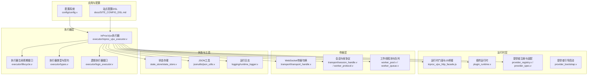
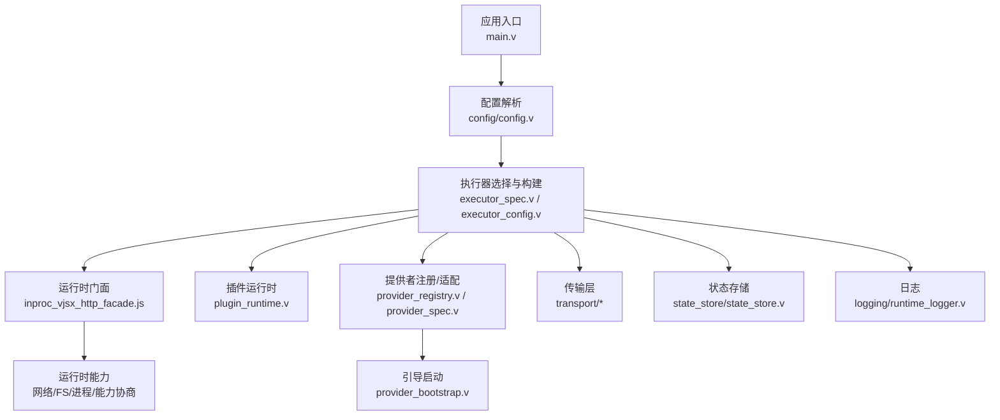
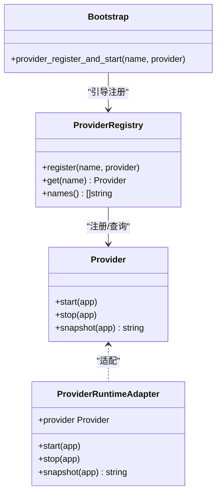
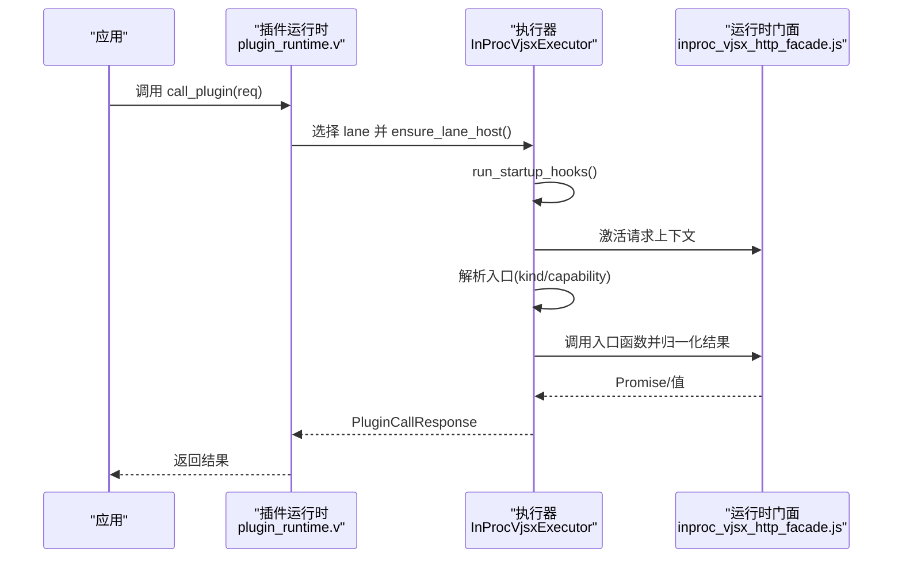
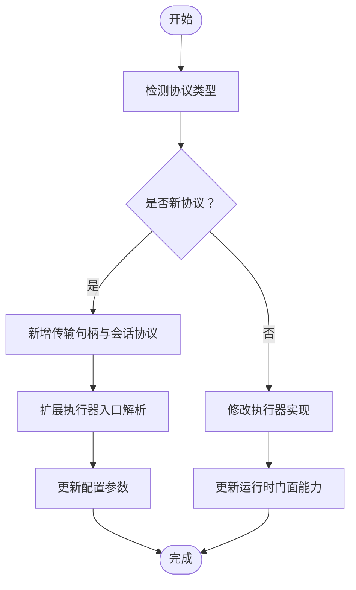
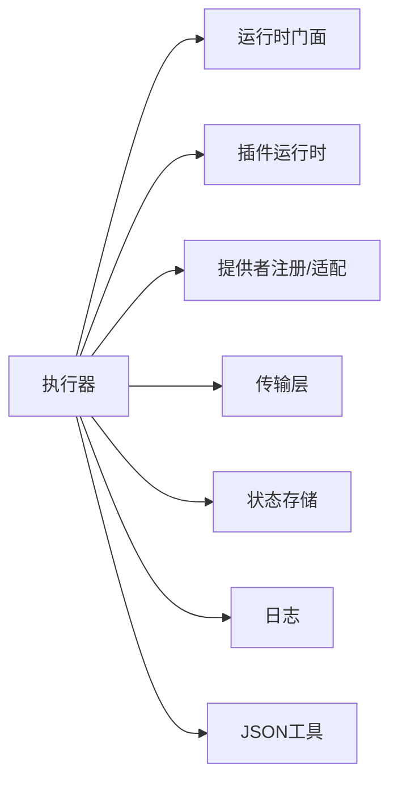

# 扩展定制

<cite>
**本文引用的文件**
- [src/executor/inproc_vjsx_executor.v](file://src/executor/inproc_vjsx_executor.v)
- [src/inproc_vjsx_executor_test.v](file://src/inproc_vjsx_executor_test.v)
- [src/inproc_vjsx_executor_http_fetch_test.v](file://src/inproc_vjsx_executor_http_fetch_test.v)
- [src/inproc_vjsx_http_facade.js](file://src/inproc_vjsx_http_facade.js)
- [src/plugin_runtime.v](file://src/plugin_runtime.v)
- [src/config/config.v](file://src/config/config.v)
- [src/provider_spec.v](file://src/provider_spec.v)
- [src/provider_registry.v](file://src/provider_registry.v)
- [src/provider_bootstrap.v](file://src/provider_bootstrap.v)
- [src/main.v](file://src/main.v)
- [src/transport/transport_handle.v](file://src/transport/transport_handle.v)
- [src/db_runtime.v](file://src/db_runtime.v)
- [dbsrc/db_runtime.v](file://dbsrc/db_runtime.v)
- [src/executor/app_facade.v](file://src/executor/app_facade.v)
- [src/executor/types.v](file://src/executor/types.v)
- [src/executor/lifecycle.v](file://src/executor/lifecycle.v)
- [src/executor/logic_executor.v](file://src/executor/logic_executor.v)
- [src/executor/executor_config.v](file://src/executor/executor_config.v)
- [src/executor/executor_runtime_plan.v](file://src/executor/executor_runtime_plan.v)
- [src/executor/executor_spec.v](file://src/executor/executor_spec.v)
- [src/executor/types.v](file://src/executor/types.v)
- [src/executor/app_facade.v](file://src/executor/app_facade.v)
- [src/executor/worker_backend_dispatch.v](file://src/executor/worker_backend_dispatch.v)
- [src/executor/worker_backend_pool.v](file://src/executor/worker_backend_pool.v)
- [src/executor/worker_backend_queue.v](file://src/executor/worker_backend_queue.v)
- [src/executor/worker_backend_runtime.v](file://src/executor/worker_backend_runtime.v)
- [src/executor/worker_backend_transport.v](file://src/executor/worker_backend_transport.v)
- [src/transport/session_handle.v](file://src/transport/session_handle.v)
- [src/transport/worker_framing.v](file://src/transport/worker_framing.v)
- [src/transport/worker_pool.v](file://src/transport/worker_pool.v)
- [src/transport/worker_protocol.v](file://src/transport/worker_protocol.v)
- [src/state_store/state_store.v](file://src/state_store/state_store.v)
- [src/logging/runtime_logger.v](file://src/logging/runtime_logger.v)
- [src/jsonutils/json_utils.v](file://src/jsonutils/json_utils.v)
- [src/jsonutils/json_utils_test.v](file://src/jsonutils/json_utils_test.v)
- [examples/codexbot-app/app.php](file://examples/codexbot-app/app.php)
- [examples/codexbot-app/lib/AppRuntime.php](file://examples/codexbot-app/lib/AppRuntime.php)
- [examples/codexbot-app/lib/Db.php](file://examples/codexbot-app/lib/Db.php)
- [examples/vjsx/openai-gateway-plugin.mts](file://examples/vjsx/openai-gateway-plugin.mts)
- [examples/vjsx/openai-executor-app.mts](file://examples/vjsx/openai-executor-app.mts)
- [examples/config/mcp.toml](file://examples/config/mcp.toml)
- [examples/config/openai-gateway.toml](file://examples/config/openai-gateway.toml)
- [examples/config/feishu-bot.toml](file://examples/config/feishu-bot.toml)
- [examples/config/wordpress.toml](file://examples/config/wordpress.toml)
- [examples/config/symfony.toml](file://examples/config/symfony.toml)
- [examples/config/laravel.toml](file://examples/config/laravel.toml)
- [examples/config/stream-dispatch.toml](file://examples/config/stream-dispatch.toml)
- [examples/config/db-upstream.toml](file://examples/config/db-upstream.toml)
- [examples/config/db-upstream-pg.toml](file://examples/config/db-upstream-pg.toml)
- [examples/config/ollama-proxy.toml](file://examples/config/ollama-proxy.toml)
- [examples/config/websocket-echo.toml](file://examples/config/websocket-echo.toml)
- [examples/config/hello.toml](file://examples/config/hello.toml)
- [examples/config/ai-stream.toml](file://examples/config/ai-stream.toml)
- [examples/config/stream-bench.toml](file://examples/config/stream-bench.toml)
- [docs/RUNTIME_MODULE_MAP.md](file://docs/RUNTIME_MODULE_MAP.md)
- [docs/EXECUTOR_MODES.md](file://docs/EXECUTOR_MODES.md)
- [docs/COMMAND_CONTRACT_INVENTORY.md](file://docs/COMMAND_CONTRACT_INVENTORY.md)
- [docs/STRUCT_RELATIONSHIP_MAP.md](file://docs/STRUCT_RELATIONSHIP_MAP.md)
- [docs/TRANSPORT_CONTRACT.md](file://docs/TRANSPORT_CONTRACT.md)
- [docs/WEBSOCKET_MESSAGE_DISPATCH_PLAN.md](file://docs/WEBSOCKET_MESSAGE_DISPATCH_PLAN.md)
- [docs/WEBSOCKET_PHASE2_IMPLEMENTATION_PLAN.md](file://docs/WEBSOCKET_PHASE2_IMPLEMENTATION_PLAN.md)
- [docs/WEBSOCKET_UPSTREAM_PLAN.md](file://docs/WEBSOCKET_UPSTREAM_PLAN.md)
- [docs/OPENAI_AGGREGATION_GATEWAY_PLAN.md](file://docs/OPENAI_AGGREGATION_GATEWAY_PLAN.md)
- [docs/FEISHU_GATEWAY_REMOVAL_PLAN.md](file://docs/FEISHU_GATEWAY_REMOVAL_PLAN.md)
- [docs/FEISHU_RUNTIME_COMPATIBILITY_PLAN.md](file://docs/FEISHU_RUNTIME_COMPATIBILITY_PLAN.md)
- [docs/FEISHU_INSTANCE_RUNTIME_PLAN.md](file://docs/FEISHU_INSTANCE_RUNTIME_PLAN.md)
- [docs/CODEx_INSTANCE_RUNTIME_PLAN.md](file://docs/CODEx_INSTANCE_RUNTIME_PLAN.md)
- [docs/STREAM_RUNTIME_PHASES.md](file://docs/STREAM_RUNTIME_PHASES.md)
- [docs/STREAM_PHASE2_IMPLEMENTATION_PLAN.md](file://docs/STREAM_PHASE2_IMPLEMENTATION_PLAN.md)
- [docs/PASEO_RELAY_VHTTPD_PLAN.md](file://docs/PASEO_RELAY_VHTTPD_PLAN.md)
- [docs/VEB_REUSE_1_1_PLAN.md](file://docs/VEB_REUSE_1_1_PLAN.md)
- [docs/MCP.md](file://docs/MCP.md)
- [docs/MCP_APP_API.md](file://docs/MCP_APP_API.md)
- [docs/MCP_CAPABILITY_NEGOTIATION_PLAN.md](file://docs/MCP_CAPABILITY_NEGOTIATION_PLAN.md)
- [docs/MCP_MVP_PLAN.md](file://docs/MCP_MVP_PLAN.md)
- [docs/MCP_RUNBOOK.md](file://docs/MCP_RUNBOOK.md)
- [docs/MCP_SAMPLING_PLAN.md](file://docs/MCP_SAMPLING_PLAN.md)
- [docs/INPROC_VJSX_RUNBOOK.md](file://docs/INPROC_VJSX_RUNBOOK.md)
- [docs/SITE_CONFIG_DSL.md](file://docs/SITE_CONFIG_DSL.md)
- [docs/INTERNAL_HOST_SOCKET_PROTOCOL.md](file://docs/INTERNAL_HOST_SOCKET_PROTOCOL.md)
- [docs/ARCHITECTURE_REFACTOR_BASELINE.md](file://docs/ARCHITECTURE_REFACTOR_BASELINE.md)
- [docs/REFACTOR_0601.md](file://docs/REFACTOR_0601.md)
- [docs/TODO_REFACTOR.md](file://docs/TODO_REFACTOR.md)
- [docs/REPO_SPLIT_NOTES.md](file://docs/REPO_SPLIT_NOTES.md)
- [docs/failure_model.md](file://docs/failure_model.md)
- [docs/psr_support.md](file://docs/psr_support.md)
- [docs/transport_contract.md](file://docs/transport_contract.md)
- [docs/UPSTREAM_PLAN_PHASE3.md](file://docs/UPSTREAM_PLAN_PHASE3.md)
- [docs/WEBSOCKET_EVENT_BUS_PLAN.md](file://docs/WEBSOCKET_EVENT_BUS_PLAN.md)
- [docs/VJSX_FACADE_REFERENCE.md](file://docs/VJSX_FACADE_REFERENCE.md)
- [docs/OBSERVABILITY.md](file://docs/OBSERVABILITY.md)
- [docs/ADVANCED_PATTERNS.md](file://docs/ADVANCED_PATTERNS.md)
- [docs/FUTURE.md](file://docs/FUTURE.md)
- [docs/OVERVIEW.md](file://docs/OVERVIEW.md)
- [docs/NORMALIZED_COMMAND_DRAFT.md](file://docs/NORMALIZED_COMMAND_DRAFT.md)
- [docs/PR_VHTTPD_STREAMING_AI.md](file://docs/PR_VHTTPD_STREAMING_AI.md)
- [docs/PSR_SUPPORT.md](file://docs/PSR_SUPPORT.md)
- [docs/REFLEXIVE_ANNOTATION.md](file://docs/REFLEXIVE_ANNOTATION.md)
- [docs/REFLEXIVE_ANNOTATION.md](file://docs/REFLEXIVE_ANNOTATION.md)
- [docs/REFLEXIVE_ANNOTATION.md](file://docs/REFLEXIVE_ANNOTATION.md)
- [docs/REFLEXIVE_ANNOTATION.md](file://docs/REFLEXIVE_ANNOTATION.md)
- [docs/REFLEXIVE_ANNOTATION.md](file://docs/REFLEXIVE_ANNOTATION.md)
- [docs/REFLEXIVE_ANNOTATION.md](file://docs/REFLEXIVE_ANNOTATION.md)
- [docs/REFLEXIVE_ANNOTATION.md](file://docs/REFLEXIVE_ANNOTATION.md)
- [docs/REFLEXIVE_ANNOTATION.md](file://docs/REFLEXIVE_ANNOTATION.md)
- [docs/REFLEXIVE_ANNOTATION.md](file://docs/REFLEXIVE_ANNOTATION.md)
- [docs/REFLEXIVE_ANNOTATION.md](file://docs/REFLEXIVE_ANNOTATION.md)
- [docs/REFLEXIVE_ANNOTATION.md](file://docs/REFLEXIVE_ANNOTATION.md)
- [docs/REFLEXIVE_ANNOTATION.md](file://docs/REFLEXIVE_ANNOTATION.md)
- [docs/REFLEXIVE_ANNOTATION.md](file://docs/REFLEXIVE_ANNOTATION.md)
- [docs/REFLEXIVE_ANNOTATION.md](file://docs/REFLEXIVE_ANNOTATION.md)
- [docs/REFLEXIVE_ANNOTATION.md](file://docs/REFLEXIVE_ANNOTATION.md)
- [docs/REFLEXIVE_ANNOTATION.md](file://docs/REFLEXIVE_ANNOTATION.md)
- [docs/REFLEXIVE_ANNOTATION.md](file://docs/REFLEXIVE_ANNOTATION.md)
- [docs/REFLEXIVE_ANNOTATION.md](file://docs/REFLEXIVE_ANNOTATION.md)
- [docs/REFLEXIVE_ANNOTATION.md](file://docs/REFLEXIVE_ANNOTATION.md)
- [docs/REFLEXIVE_ANNOTATION.md](file://docs/REFLEXIVE_ANNOTATION.md)
- [docs/REFLEXIVE_ANNOTATION.md](file://docs/REFLEXIVE_ANNOTATION.md)
- [docs/REFLEXIVE_ANNOTATION.md](file://docs/......REFLEXIVE_ANNOTATION.md)
</cite>

## 目录
1. [简介](#简介)
2. [项目结构](#项目结构)
3. [核心组件](#核心组件)
4. [架构总览](#架构总览)
5. [详细组件分析](#详细组件分析)
6. [依赖关系分析](#依赖关系分析)
7. [性能考量](#性能考量)
8. [故障排查指南](#故障排查指南)
9. [结论](#结论)
10. [附录](#附录)

## 简介
本文件面向高级开发者与系统架构师，系统化阐述 vhttpd 的扩展定制方法论与实践路径，覆盖以下主题：
- 自定义运行时的开发方法：运行时接口实现、注册机制与生命周期管理
- 协议扩展策略：新增协议与修改既有协议的步骤与注意事项
- 插件开发指南：插件架构、接口规范、调用流程与生命周期
- 架构定制：模块替换、功能扩展与性能优化
- 重构计划与代码分割：演进方向与落地建议
- 扩展点识别与利用：最大化发挥 vhttpd 可扩展性

## 项目结构
vhttpd 采用分层与模块化的组织方式，核心由“执行器（Executor）+ 运行时（Runtime）+ 配置（Config）+ 传输（Transport）+ 提供者（Provider）”构成。下图给出高层视图：

图表来源
- [src/executor/inproc_vjsx_executor.v](file://src/executor/inproc_vjsx_executor.v)
- [src/inproc_vjsx_http_facade.js](file://src/inproc_vjsx_http_facade.js)
- [src/plugin_runtime.v](file://src/plugin_runtime.v)
- [src/provider_registry.v](file://src/provider_registry.v)
- [src/provider_spec.v](file://src/provider_spec.v)
- [src/provider_bootstrap.v](file://src/provider_bootstrap.v)
- [src/transport/transport_handle.v](file://src/transport/transport_handle.v)
- [src/transport/session_handle.v](file://src/transport/session_handle.v)
- [src/transport/worker_protocol.v](file://src/transport/worker_protocol.v)
- [src/executor/worker_backend_pool.v](file://src/executor/worker_backend_pool.v)
- [src/executor/worker_backend_queue.v](file://src/executor/worker_backend_queue.v)
- [src/state_store/state_store.v](file://src/state_store/state_store.v)
- [src/jsonutils/json_utils.v](file://src/jsonutils/json_utils.v)
- [src/logging/runtime_logger.v](file://src/logging/runtime_logger.v)

章节来源
- [src/executor/inproc_vjsx_executor.v](file://src/executor/inproc_vjsx_executor.v)
- [src/config/config.v](file://src/config/config.v)
- [docs/SITE_CONFIG_DSL.md](file://docs/SITE_CONFIG_DSL.md)

## 核心组件
- 执行器（Executor）
  - InProcVjsxExecutor：内置 JS/TS 应用运行时与入口解析、启动钩子、请求分发与结果归一化
  - 生命周期接口：LogicExecutorLifecycle 定义 start/stop/snapshot
  - 类型与契约：types.v 中定义运行时元数据、统计与摘要
  - 逻辑执行器接口：logic_executor.v 定义统一的执行器抽象
- 运行时（Runtime）
  - 运行时门面与 JS 桥接：inproc_vjsx_http_facade.js 提供运行时对象、能力暴露与错误诊断
  - 插件运行时：plugin_runtime.v 负责按配置构建与调用插件执行器
  - 提供者注册与适配：provider_registry.v 与 provider_spec.v 实现 Provider 接口与适配器
  - 引导启动：provider_bootstrap.v 将具体 Provider 注册到 App 并启动
- 传输（Transport）
  - 传输句柄：transport_handle.v 定义协议/实例/端点等标识
  - 会话与帧协议：session_handle.v、worker_protocol.v 等支撑多路复用与帧处理
  - 工作线程池与队列：worker_pool.v、worker_queue.v 支撑并发与背压
- 配置（Config）
  - config/config.v 解析插件配置（kind、entry、app_entry、module_root、build_root、runtime_profile、thread_count、enable_fs、enable_network 等）
  - 站点配置 DSL：docs/SITE_CONFIG_DSL.md 描述配置模型与约束
- 状态与工具
  - state_store/state_store.v：状态持久化与查询
  - jsonutils/json_utils.v：JSON 序列化/反序列化工具
  - logging/runtime_logger.v：运行时日志记录

章节来源
- [src/executor/inproc_vjsx_executor.v](file://src/executor/inproc_vjsx_executor.v)
- [src/executor/lifecycle.v](file://src/executor/lifecycle.v)
- [src/executor/types.v](file://src/executor/types.v)
- [src/executor/logic_executor.v](file://src/executor/logic_executor.v)
- [src/inproc_vjsx_http_facade.js](file://src/inproc_vjsx_http_facade.js)
- [src/plugin_runtime.v](file://src/plugin_runtime.v)
- [src/provider_registry.v](file://src/provider_registry.v)
- [src/provider_spec.v](file://src/provider_spec.v)
- [src/provider_bootstrap.v](file://src/provider_bootstrap.v)
- [src/transport/transport_handle.v](file://src/transport/transport_handle.v)
- [src/transport/session_handle.v](file://src/transport/session_handle.v)
- [src/transport/worker_protocol.v](file://src/transport/worker_protocol.v)
- [src/executor/worker_backend_pool.v](file://src/executor/worker_backend_pool.v)
- [src/executor/worker_backend_queue.v](file://src/executor/worker_backend_queue.v)
- [src/state_store/state_store.v](file://src/state_store/state_store.v)
- [src/jsonutils/json_utils.v](file://src/jsonutils/json_utils.v)
- [src/logging/runtime_logger.v](file://src/logging/runtime_logger.v)

## 架构总览
下图展示 vhttpd 的扩展架构：应用通过配置驱动执行器，执行器在运行时门面中暴露能力，并通过提供者与插件扩展生态；传输层负责协议与会话管理。

图表来源
- [src/main.v](file://src/main.v)
- [src/config/config.v](file://src/config/config.v)
- [src/executor/executor_spec.v](file://src/executor/executor_spec.v)
- [src/executor/executor_config.v](file://src/executor/executor_config.v)
- [src/inproc_vjsx_http_facade.js](file://src/inproc_vjsx_http_facade.js)
- [src/plugin_runtime.v](file://src/plugin_runtime.v)
- [src/provider_registry.v](file://src/provider_registry.v)
- [src/provider_spec.v](file://src/provider_spec.v)
- [src/provider_bootstrap.v](file://src/provider_bootstrap.v)
- [src/transport/transport_handle.v](file://src/transport/transport_handle.v)
- [src/state_store/state_store.v](file://src/state_store/state_store.v)
- [src/logging/runtime_logger.v](file://src/logging/runtime_logger.v)

## 详细组件分析

### 运行时接口与注册机制
- Provider 接口与适配器
  - Provider 接口定义 start/stop/snapshot，便于不同提供者以统一方式接入
  - ProviderRuntimeAdapter 将现有 Provider 适配为可选的运行时钩子，确保兼容性
- 注册与引导
  - provider_registry.v 维护已注册提供者集合
  - provider_bootstrap.v 在启动阶段按需注册并启动提供者
  - main.v 提供 register_provider/register_provider_spec 等入口，供外部集成

图表来源
- [src/provider_spec.v](file://src/provider_spec.v)
- [src/provider_registry.v](file://src/provider_registry.v)
- [src/provider_bootstrap.v](file://src/provider_bootstrap.v)
- [src/main.v](file://src/main.v)

章节来源
- [src/provider_spec.v](file://src/provider_spec.v)
- [src/provider_registry.v](file://src/provider_registry.v)
- [src/provider_bootstrap.v](file://src/provider_bootstrap.v)
- [src/main.v](file://src/main.v)

### 插件开发指南
- 插件架构
  - 插件通过配置驱动：config/config.v 解析 kind、entry、app_entry、module_root、build_root、runtime_profile、thread_count、enable_fs、enable_network 等
  - plugin_runtime.v 基于配置构建 InProcVjsxExecutor 实例，支持多插件并行
- 调用流程
  - call_plugin/call_plugin_stream 将请求路由到对应 capability 或默认 plugin 入口
  - 执行器在 lane 上确保宿主初始化、运行启动钩子、激活请求上下文后调用入口函数
  - 结果经 Promise 归一化与 JSON 序列化返回
- 生命周期
  - 启动：构建执行器、加载应用入口、初始化运行时门面
  - 运行：请求分发、能力暴露、错误重试与诊断
  - 关闭：释放执行器资源，清理插件映射

图表来源
- [src/plugin_runtime.v](file://src/plugin_runtime.v)
- [src/executor/inproc_vjsx_executor.v](file://src/executor/inproc_vjsx_executor.v)
- [src/inproc_vjsx_http_facade.js](file://src/inproc_vjsx_http_facade.js)

章节来源
- [src/plugin_runtime.v](file://src/plugin_runtime.v)
- [src/executor/inproc_vjsx_executor.v](file://src/executor/inproc_vjsx_executor.v)
- [src/inproc_vjsx_http_facade.js](file://src/inproc_vjsx_http_facade.js)
- [src/config/config.v](file://src/config/config.v)

### 协议扩展与现有协议修改
- 新增协议
  - 在 transport 层新增协议句柄与会话管理（如 transport_handle.v），定义协议/实例/端点标识
  - 在执行器层扩展入口解析与调用（如 inproc_vjsx_executor.v 的全局/模块入口查找）
  - 在配置层增加协议相关参数（如 enable_network、runtime_profile 等）
- 修改既有协议
  - 保持入口签名与返回约定不变，仅调整内部实现与能力暴露
  - 通过运行时门面（inproc_vjsx_http_facade.js）对能力进行条件开关与版本化

图表来源
- [src/transport/transport_handle.v](file://src/transport/transport_handle.v)
- [src/executor/inproc_vjsx_executor.v](file://src/executor/inproc_vjsx_executor.v)
- [src/inproc_vjsx_http_facade.js](file://src/inproc_vjsx_http_facade.js)
- [src/config/config.v](file://src/config/config.v)

章节来源
- [src/transport/transport_handle.v](file://src/transport/transport_handle.v)
- [src/executor/inproc_vjsx_executor.v](file://src/executor/inproc_vjsx_executor.v)
- [src/inproc_vjsx_http_facade.js](file://src/inproc_vjsx_http_facade.js)
- [src/config/config.v](file://src/config/config.v)

### 架构定制：模块替换、功能扩展与性能优化
- 模块替换
  - 使用 executor_spec.v/executor_config.v 选择不同执行器实现
  - 通过 provider_registry.v 替换或扩展 Provider
- 功能扩展
  - 在运行时门面中暴露新能力（inproc_vjsx_http_facade.js），并通过配置启用
  - 在插件层引入新 capability，保持与默认入口的兼容
- 性能优化
  - 利用 worker_backend_pool.v/worker_backend_queue.v 控制并发与背压
  - 使用 state_store/state_store.v 缓存热点状态，减少重复计算
  - 通过 JSON 工具与日志模块降低序列化与观测成本

章节来源
- [src/executor/executor_spec.v](file://src/executor/executor_spec.v)
- [src/executor/executor_config.v](file://src/executor/executor_config.v)
- [src/provider_registry.v](file://src/provider_registry.v)
- [src/executor/worker_backend_pool.v](file://src/executor/worker_backend_pool.v)
- [src/executor/worker_backend_queue.v](file://src/executor/worker_backend_queue.v)
- [src/state_store/state_store.v](file://src/state_store/state_store.v)
- [src/jsonutils/json_utils.v](file://src/jsonutils/json_utils.v)
- [src/logging/runtime_logger.v](file://src/logging/runtime_logger.v)

### 重构计划与代码分割
- 重构基线与演进方向
  - ARCHITECTURE_REFACTOR_BASELINE.md、REFACTOR_0601.md、TODO_REFACTOR.md 提供当前基线与待办清单
  - REPO_SPLIT_NOTES.md 记录仓库拆分与边界
- 代码分割建议
  - 将协议相关模块独立为 transport 子域
  - 将运行时能力与执行器解耦，通过接口抽象隔离变更
  - 将插件体系与核心执行器分离，便于独立演进

章节来源
- [docs/ARCHITECTURE_REFACTOR_BASELINE.md](file://docs/ARCHITECTURE_REFACTOR_BASELINE.md)
- [docs/REFACTOR_0601.md](file://docs/REFACTOR_0601.md)
- [docs/TODO_REFACTOR.md](file://docs/TODO_REFACTOR.md)
- [docs/REPO_SPLIT_NOTES.md](file://docs/REPO_SPLIT_NOTES.md)

### 扩展点识别与利用
- 运行时扩展点
  - 全局/模块入口解析：inproc_vjsx_executor.v 的全局函数名映射与模块别名解析
  - 启动钩子：__vhttpd_create_runtime/__vhttpd_normalize_startup_result 等
  - 能力暴露：inproc_vjsx_http_facade.js 暴露 network/fs/process 等能力
- 插件扩展点
  - capability 路由：call_plugin/call_plugin_stream 支持按 capability 分发
  - 多执行器并行：基于配置的多插件实例
- 提供者扩展点
  - Provider 接口与适配器，支持 start/stop/snapshot 生命周期

章节来源
- [src/executor/inproc_vjsx_executor.v](file://src/executor/inproc_vjsx_executor.v)
- [src/inproc_vjsx_http_facade.js](file://src/inproc_vjsx_http_facade.js)
- [src/plugin_runtime.v](file://src/plugin_runtime.v)
- [src/provider_spec.v](file://src/provider_spec.v)

## 依赖关系分析
- 组件耦合
  - 执行器与运行时门面强耦合（通过 JS 上下文与门面对象）
  - 插件运行时依赖执行器与配置
  - 提供者注册与引导贯穿启动流程
- 外部依赖
  - 配置系统依赖 toml 解析
  - 传输层依赖底层 socket/会话协议
  - 日志与 JSON 工具为通用基础设施

图表来源
- [src/executor/inproc_vjsx_executor.v](file://src/executor/inproc_vjsx_executor.v)
- [src/inproc_vjsx_http_facade.js](file://src/inproc_vjsx_http_facade.js)
- [src/plugin_runtime.v](file://src/plugin_runtime.v)
- [src/provider_registry.v](file://src/provider_registry.v)
- [src/transport/transport_handle.v](file://src/transport/transport_handle.v)
- [src/state_store/state_store.v](file://src/state_store/state_store.v)
- [src/logging/runtime_logger.v](file://src/logging/runtime_logger.v)
- [src/jsonutils/json_utils.v](file://src/jsonutils/json_utils.v)

## 性能考量
- 并发与背压
  - 使用 worker_backend_pool.v/worker_backend_queue.v 控制 lane 数量与请求排队
- 热点缓存
  - state_store/state_store.v 提供状态缓存，减少重复计算
- 序列化与观测
  - jsonutils/json_utils.v 优化序列化路径
  - logging/runtime_logger.v 提供运行时诊断与告警

## 故障排查指南
- 插件调用失败
  - 检查插件配置（kind、entry、app_entry、module_root、build_root、runtime_profile、thread_count、enable_fs、enable_network）
  - 查看执行器 lane 错误记录与重试策略
- 运行时能力不可用
  - 确认运行时门面是否正确暴露能力（network/fs/process）
  - 检查启动钩子是否成功创建运行时对象并归一化结果
- 提供者注册异常
  - 核对 provider_registry.v 的注册顺序与名称冲突
  - 确保 provider_bootstrap.v 的引导流程未被中断

章节来源
- [src/config/config.v](file://src/config/config.v)
- [src/executor/inproc_vjsx_executor.v](file://src/executor/inproc_vjsx_executor.v)
- [src/inproc_vjsx_http_facade.js](file://src/inproc_vjsx_http_facade.js)
- [src/provider_registry.v](file://src/provider_registry.v)
- [src/provider_bootstrap.v](file://src/provider_bootstrap.v)

## 结论
vhttpd 的扩展定制围绕“执行器 + 运行时 + 插件 + 提供者”的分层架构展开。通过标准化的运行时接口、灵活的配置驱动与完善的生命周期管理，开发者可以安全地扩展协议、注入插件能力并替换核心模块。配合仓库重构与代码分割规划，vhttpd 将持续提升可维护性与可扩展性，满足复杂场景下的深度定制需求。

## 附录
- 示例与配置
  - 插件示例：examples/vjsx/openai-gateway-plugin.mts、examples/vjsx/openai-executor-app.mts
  - 应用示例：examples/codexbot-app、examples/config/*.toml
- 文档索引
  - 运行时模块映射：docs/RUNTIME_MODULE_MAP.md
  - 执行器模式：docs/EXECUTOR_MODES.md
  - 命令契约清单：docs/COMMAND_CONTRACT_INVENTORY.md
  - 结构关系图谱：docs/STRUCT_RELATIONSHIP_MAP.md
  - 传输契约：docs/TRANSPORT_CONTRACT.md
  - WebSocket 消息分发与上游计划：docs/WEBSOCKET_MESSAGE_DISPATCH_PLAN.md、docs/WEBSOCKET_PHASE2_IMPLEMENTATION_PLAN.md、docs/WEBSOCKET_UPSTREAM_PLAN.md
  - OpenAI 聚合网关：docs/OPENAI_AGGREGATION_GATEWAY_PLAN.md
  - 飞书运行时兼容与实例计划：docs/FEISHU_RUNTIME_COMPATIBILITY_PLAN.md、docs/FEISHU_INSTANCE_RUNTIME_PLAN.md、docs/FEISHU_GATEWAY_REMOVAL_PLAN.md
  - Codex 实例运行时计划：docs/CODEx_INSTANCE_RUNTIME_PLAN.md
  - 流式运行时阶段：docs/STREAM_RUNTIME_PHASES.md、docs/STREAM_PHASE2_IMPLEMENTATION_PLAN.md
  - Paseo 中继方案：docs/PASEO_RELAY_VHTTPD_PLAN.md
  - VEB 复用：docs/VEB_REUSE_1_1_PLAN.md
  - MCP 生态：docs/MCP.md、docs/MCP_APP_API.md、docs/MCP_CAPABILITY_NEGOTIATION_PLAN.md、docs/MCP_MVP_PLAN.md、docs/MCP_RUNBOOK.md、docs/MCP_SAMPLING_PLAN.md
  - InProc Vjsx 运行手册：docs/INPROC_VJSX_RUNBOOK.md
  - 站点配置DSL：docs/SITE_CONFIG_DSL.md
  - 内部主机套接字协议：docs/INTERNAL_HOST_SOCKET_PROTOCOL.md
  - 架构重构基线与演进：docs/ARCHITECTURE_REFACTOR_BASELINE.md、docs/REFACTOR_0601.md、docs/TODO_REFACTOR.md
  - 仓库拆分：docs/REPO_SPLIT_NOTES.md
  - 失败模型与可观测性：docs/failure_model.md、docs/OBSERVABILITY.md
  - 高级模式与未来：docs/ADVANCED_PATTERNS.md、docs/FUTURE.md
  - 概览与规范化命令草案：docs/OVERVIEW.md、docs/NORMALIZED_COMMAND_DRAFT.md
  - 流式 AI PR：docs/PR_VHTTPD_STREAMING_AI.md
  - PSR 支持：docs/PSR_SUPPORT.md
  - 传输契约：docs/transport_contract.md
  - 上游计划第三阶段：docs/UPSTREAM_PLAN_PHASE3.md
  - WebSocket 事件总线：docs/WEBSOCKET_EVENT_BUS_PLAN.md
  - Vjsx 外观参考：docs/VJSX_FACADE_REFERENCE.md