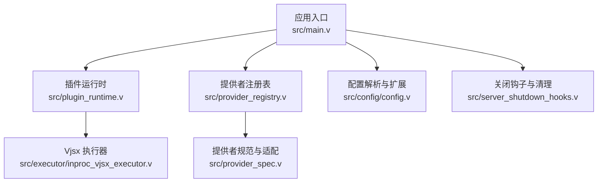
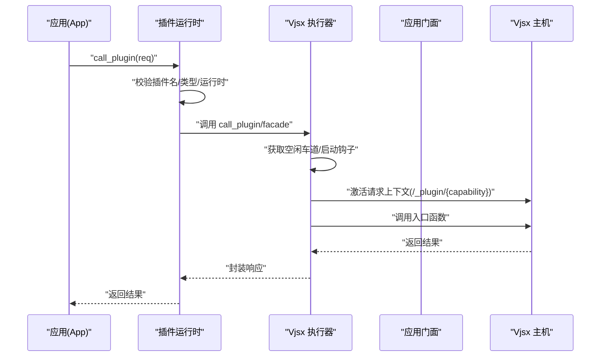
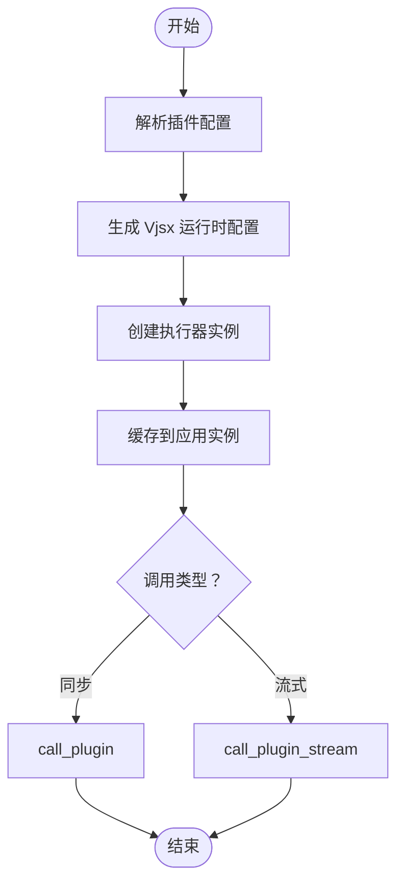
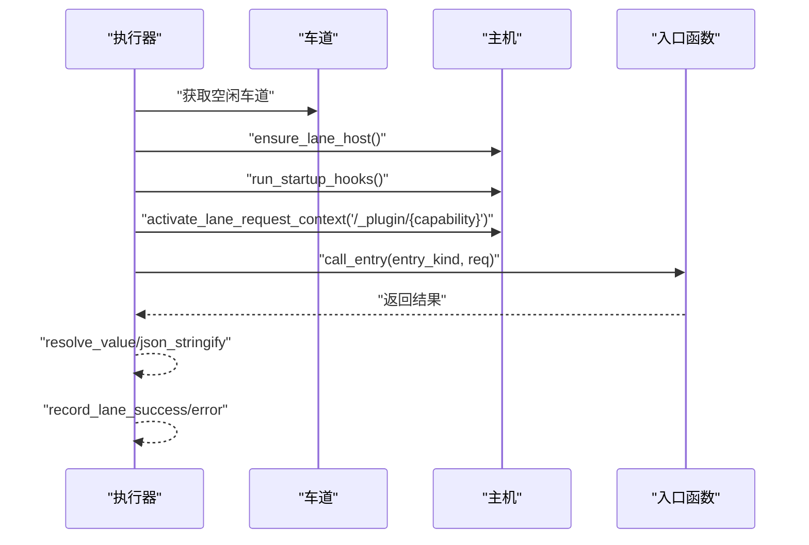
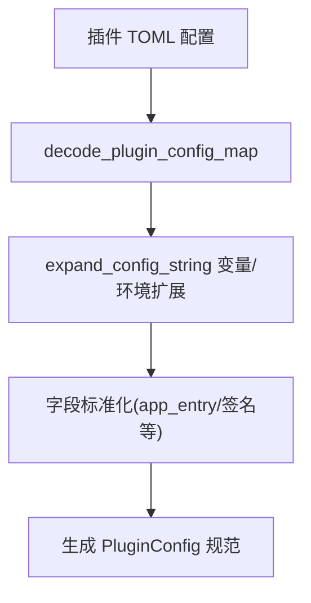
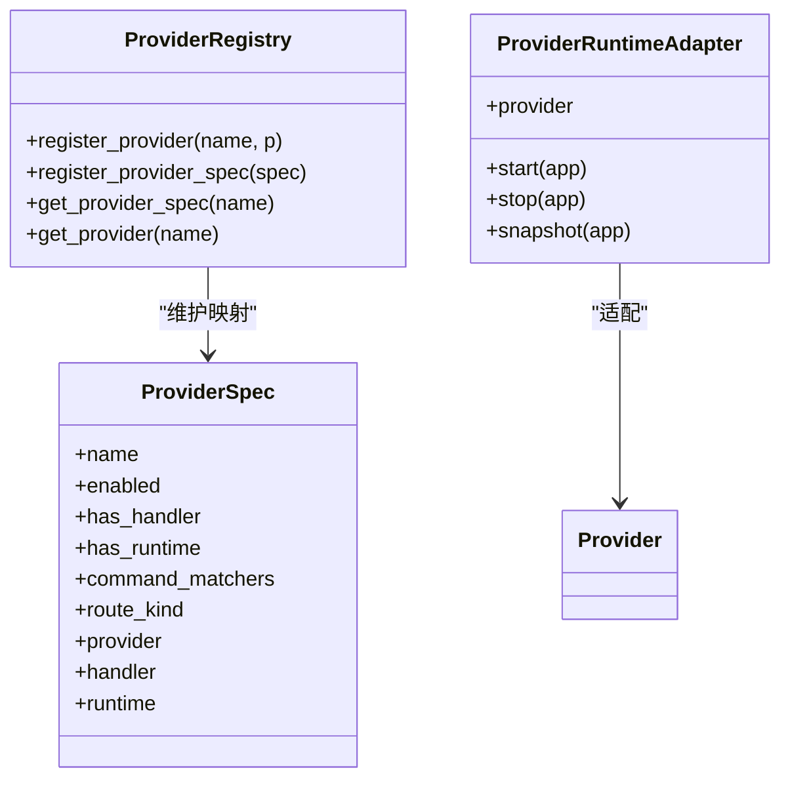
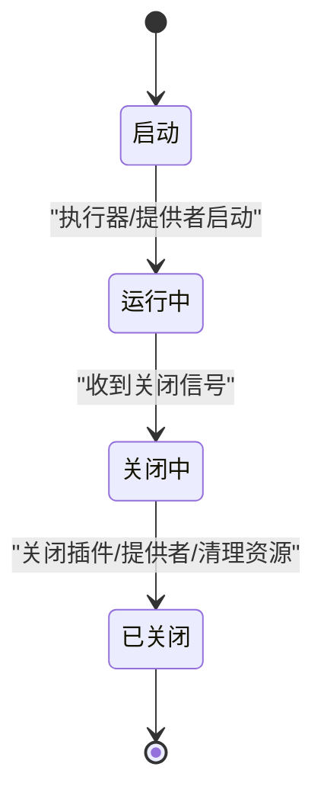
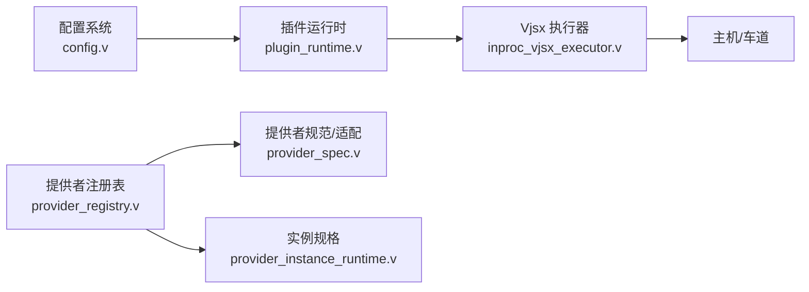

# 插件系统开发

<cite>
**本文引用的文件**
- [src/plugin_runtime.v](file://src/plugin_runtime.v)
- [src/executor/inproc_vjsx_executor.v](file://src/executor/inproc_vjsx_executor.v)
- [src/config/config.v](file://src/config/config.v)
- [src/provider_registry.v](file://src/provider_registry.v)
- [src/provider_spec.v](file://src/provider_spec.v)
- [src/provider_instance_runtime.v](file://src/provider_instance_runtime.v)
- [src/server_shutdown_hooks.v](file://src/server_shutdown_hooks.v)
- [src/main.v](file://src/main.v)
- [examples/vjsx/openai-gateway-plugin.mts](file://examples/vjsx/openai-gateway-plugin.mts)
- [examples/vjsx/openai-executor-app.mts](file://examples/vjsx/openai-executor-app.mts)
- [examples/codexbot-app/codexbot.toml](file://examples/codexbot-app/codexbot.toml)
- [config/vhttpd.example.toml](file://config/vhttpd.example.toml)
</cite>

## 目录
1. [简介](#简介)
2. [项目结构](#项目结构)
3. [核心组件](#核心组件)
4. [架构总览](#架构总览)
5. [详细组件分析](#详细组件分析)
6. [依赖关系分析](#依赖关系分析)
7. [性能考量](#性能考量)
8. [故障排查指南](#故障排查指南)
9. [结论](#结论)
10. [附录](#附录)

## 简介
本文件面向插件系统开发，系统性阐述 vhttpd 的插件架构设计与实现机制，涵盖插件注册表、提供者配置与插件规范定义；详解插件生命周期（加载、初始化、运行时管理、卸载）；给出插件开发指南（接口定义、配置管理、依赖注入）；解释插件与核心系统的交互方式（事件处理、钩子机制、扩展点利用）；并提供安全与权限控制建议、最佳实践与常见问题解决方案。

## 项目结构
vhttpd 将“插件”与“提供者（Provider）”两个概念结合：插件通常以内置的 Vjsx 执行器承载，通过配置驱动；提供者负责能力暴露与生命周期管理，可与插件协同工作。关键模块分布如下：
- 插件运行时与调用链：src/plugin_runtime.v、src/executor/inproc_vjsx_executor.v
- 配置解析与扩展：src/config/config.v
- 提供者注册与适配：src/provider_registry.v、src/provider_spec.v、src/provider_instance_runtime.v
- 应用入口与生命周期：src/main.v、src/server_shutdown_hooks.v
- 示例与配置参考：examples/...、config/vhttpd.example.toml

图表来源
- [src/main.v:1035-1091](file://src/main.v#L1035-L1091)
- [src/plugin_runtime.v:1-98](file://src/plugin_runtime.v#L1-L98)
- [src/executor/inproc_vjsx_executor.v:5123-5254](file://src/executor/inproc_vjsx_executor.v#L5123-L5254)
- [src/provider_registry.v](file://src/provider_registry.v)
- [src/provider_spec.v:161-196](file://src/provider_spec.v#L161-L196)
- [src/config/config.v:603-1240](file://src/config/config.v#L603-L1240)
- [src/server_shutdown_hooks.v:1-16](file://src/server_shutdown_hooks.v#L1-L16)

章节来源
- [src/main.v:1035-1091](file://src/main.v#L1035-L1091)
- [src/plugin_runtime.v:1-98](file://src/plugin_runtime.v#L1-L98)
- [src/executor/inproc_vjsx_executor.v:5123-5254](file://src/executor/inproc_vjsx_executor.v#L5123-L5254)
- [src/provider_registry.v](file://src/provider_registry.v)
- [src/provider_spec.v:161-196](file://src/provider_spec.v#L161-L196)
- [src/config/config.v:603-1240](file://src/config/config.v#L603-L1240)
- [src/server_shutdown_hooks.v:1-16](file://src/server_shutdown_hooks.v#L1-L16)

## 核心组件
- 插件运行时与调用
  - 插件配置到执行器映射：根据插件配置生成 Vjsx 运行时，并缓存于应用实例中。
  - 插件调用：支持同步与流式调用，统一校验插件名、类型与运行时可用性。
- Vjsx 执行器
  - 车道（Lane）调度与启动钩子执行，请求上下文激活，入口函数调用与结果解析。
- 配置系统
  - 插件配置字段标准化、变量与环境扩展、签名根目录与线程数等运行参数。
- 提供者体系
  - 注册表保护并发访问；提供者规范与适配器；实例化规格与状态快照。
- 生命周期钩子
  - 启动阶段：执行器与提供者按计划启动；关闭阶段：执行器与提供者优雅停止，插件运行时关闭。

章节来源
- [src/plugin_runtime.v:1-98](file://src/plugin_runtime.v#L1-L98)
- [src/executor/inproc_vjsx_executor.v:5123-5254](file://src/executor/inproc_vjsx_executor.v#L5123-L5254)
- [src/config/config.v:603-1240](file://src/config/config.v#L603-L1240)
- [src/provider_registry.v](file://src/provider_registry.v)
- [src/provider_spec.v:161-196](file://src/provider_spec.v#L161-L196)
- [src/server_shutdown_hooks.v:1-16](file://src/server_shutdown_hooks.v#L1-L16)

## 架构总览
下图展示从应用入口到插件执行的整体流程，以及与提供者的协作关系。

图表来源
- [src/plugin_runtime.v:72-98](file://src/plugin_runtime.v#L72-L98)
- [src/executor/inproc_vjsx_executor.v:5123-5254](file://src/executor/inproc_vjsx_executor.v#L5123-L5254)

章节来源
- [src/plugin_runtime.v:72-98](file://src/plugin_runtime.v#L72-L98)
- [src/executor/inproc_vjsx_executor.v:5123-5254](file://src/executor/inproc_vjsx_executor.v#L5123-L5254)

## 详细组件分析

### 插件运行时与调用链
- 配置到运行时
  - 依据插件配置生成 Vjsx 运行时参数，支持模块根、构建根、签名根、线程数、最大请求数、文件系统/进程/网络开关等。
  - 仅支持 kind 为空或 "vjsx" 的插件。
- 插件调用
  - 同步调用：校验后转发至执行器。
  - 流式调用：同上，但回调逐帧处理。
  - 统一错误处理：缺失名称、未配置、不支持类型、运行时不可用等。
- 关闭策略
  - 关闭所有插件执行器并清空缓存。

图表来源
- [src/plugin_runtime.v:16-63](file://src/plugin_runtime.v#L16-L63)
- [src/plugin_runtime.v:72-98](file://src/plugin_runtime.v#L72-L98)

章节来源
- [src/plugin_runtime.v:1-98](file://src/plugin_runtime.v#L1-L98)

### Vjsx 执行器调用流程
- 车道调度与启动钩子
  - 获取空闲车道，必要时确保主机存在并执行启动钩子。
- 请求上下文
  - 激活 HTTP 逻辑分发请求上下文，路径固定为 "/_plugin/{capability}"。
- 入口函数调用
  - 支持 capability 对应入口或回退到通用 "plugin" 入口。
- 结果解析与记录
  - 解析 JSON 响应并记录成功或错误。

图表来源
- [src/executor/inproc_vjsx_executor.v:5123-5254](file://src/executor/inproc_vjsx_executor.v#L5123-L5254)

章节来源
- [src/executor/inproc_vjsx_executor.v:5123-5254](file://src/executor/inproc_vjsx_executor.v#L5123-L5254)

### 配置系统与插件规范
- 插件配置字段
  - kind、entry、app_entry、module_root、build_root、signature_root、signature_include/exclude、runtime_profile、thread_count、max_requests、enable_fs/process/network 等。
- 变量与环境扩展
  - 在配置加载过程中对路径类字段进行变量替换，确保部署灵活性。
- 规范定义
  - 插件规范对象包含启用状态、是否具备处理器/运行时、命令匹配器、路由类型、提供者与运行时适配器等元信息。

图表来源
- [src/config/config.v:603-1240](file://src/config/config.v#L603-L1240)

章节来源
- [src/config/config.v:603-1240](file://src/config/config.v#L603-L1240)

### 提供者注册表与生命周期
- 注册与查询
  - 应用持有注册表与规范映射，使用互斥锁保护并发访问。
  - 支持按名称注册 Provider 与 ProviderSpec，并提供查询接口。
- 规范与适配
  - NoopProviderRuntime 与 ProviderRuntimeAdapter 提供空实现与适配，使运行时钩子可选。
- 实例化规格
  - 规格包含 provider 名称、实例名、配置 JSON、期望状态与时间戳等。

图表来源
- [src/main.v:1035-1091](file://src/main.v#L1035-L1091)
- [src/provider_spec.v:161-196](file://src/provider_spec.v#L161-L196)
- [src/provider_instance_runtime.v:1-59](file://src/provider_instance_runtime.v#L1-L59)

章节来源
- [src/main.v:1035-1091](file://src/main.v#L1035-L1091)
- [src/provider_spec.v:161-196](file://src/provider_spec.v#L161-L196)
- [src/provider_instance_runtime.v:1-59](file://src/provider_instance_runtime.v#L1-L59)

### 生命周期管理
- 启动阶段
  - 执行器与提供者按计划启动，准备接收请求。
- 关闭阶段
  - 顺序关闭插件执行器、提供者，清理内部资源与 PID 文件。

图表来源
- [src/server_shutdown_hooks.v:1-16](file://src/server_shutdown_hooks.v#L1-L16)

章节来源
- [src/server_shutdown_hooks.v:1-16](file://src/server_shutdown_hooks.v#L1-L16)

### 插件开发指南
- 接口与入口
  - 插件通过 Vjsx 执行器加载，调用路径固定为 "/_plugin/{capability}"，入口函数名优先 capability，否则回退到 "plugin"。
- 配置管理
  - 使用 TOML 配置插件，支持 app_entry/module_root/build_root/signature_root/thread_count/max_requests 等。
  - 配置字段可在运行时被变量与环境替换。
- 依赖注入
  - 通过执行器激活请求上下文，将应用门面注入插件运行时，插件可访问核心能力。
- 开发示例
  - 参考示例中的插件与执行器应用，了解如何组织入口与能力分发。

章节来源
- [src/executor/inproc_vjsx_executor.v:5123-5254](file://src/executor/inproc_vjsx_executor.v#L5123-L5254)
- [src/config/config.v:603-1240](file://src/config/config.v#L603-L1240)
- [examples/vjsx/openai-gateway-plugin.mts](file://examples/vjsx/openai-gateway-plugin.mts)
- [examples/vjsx/openai-executor-app.mts](file://examples/vjsx/openai-executor-app.mts)

### 与核心系统的交互
- 事件与钩子
  - 提供者生命周期钩子（start/stop/snapshot）与执行器启动钩子共同构成扩展点。
- 扩展点利用
  - 插件通过 capability 入口函数参与请求处理；提供者通过规范与适配器接入系统能力。
- 配置驱动
  - 插件与提供者的启用、实例化、运行参数均由配置决定，便于集中治理。

章节来源
- [src/provider_spec.v:161-196](file://src/provider_spec.v#L161-L196)
- [src/executor/inproc_vjsx_executor.v:5123-5254](file://src/executor/inproc_vjsx_executor.v#L5123-L5254)

### 安全与权限控制
- 访问控制
  - 插件运行时可启用/禁用文件系统、进程与网络访问，通过配置项控制能力边界。
- 权限最小化
  - 默认关闭高风险能力，按需开启；严格限制插件可访问的资源范围。
- 配置验证
  - 在配置解析阶段进行字段标准化与路径扩展，减少误配置带来的安全风险。

章节来源
- [src/config/config.v:603-1240](file://src/config/config.v#L603-L1240)

## 依赖关系分析
- 组件耦合
  - 插件运行时依赖配置系统与执行器；执行器依赖主机与车道调度；提供者注册表与规范解耦具体实现。
- 外部依赖
  - 通过 TOML 配置与变量/环境扩展实现外部输入的动态注入。
- 循环依赖
  - 当前结构以配置与执行器为中心，避免直接循环依赖；提供者适配器进一步降低耦合。

图表来源
- [src/config/config.v:603-1240](file://src/config/config.v#L603-L1240)
- [src/plugin_runtime.v:1-98](file://src/plugin_runtime.v#L1-L98)
- [src/executor/inproc_vjsx_executor.v:5123-5254](file://src/executor/inproc_vjsx_executor.v#L5123-L5254)
- [src/provider_registry.v](file://src/provider_registry.v)
- [src/provider_spec.v:161-196](file://src/provider_spec.v#L161-L196)
- [src/provider_instance_runtime.v:1-59](file://src/provider_instance_runtime.v#L1-L59)

章节来源
- [src/config/config.v:603-1240](file://src/config/config.v#L603-L1240)
- [src/plugin_runtime.v:1-98](file://src/plugin_runtime.v#L1-L98)
- [src/executor/inproc_vjsx_executor.v:5123-5254](file://src/executor/inproc_vjsx_executor.v#L5123-L5254)
- [src/provider_registry.v](file://src/provider_registry.v)
- [src/provider_spec.v:161-196](file://src/provider_spec.v#L161-L196)
- [src/provider_instance_runtime.v:1-59](file://src/provider_instance_runtime.v#L1-L59)

## 性能考量
- 车道调度
  - 通过多车道并行提升吞吐；等待超时与重试策略保障稳定性。
- 资源限制
  - 通过 max_requests 与线程数限制单实例负载，避免资源耗尽。
- 缓存与复用
  - 插件运行时在应用生命周期内复用，减少重复初始化成本。
- I/O 与网络
  - 默认关闭高开销能力，按需启用，降低延迟与带宽占用。

## 故障排查指南
- 常见错误与定位
  - 插件缺失名称/未配置/类型不支持/运行时不可用：检查插件配置与运行时初始化日志。
  - 车道不存在/主机未就绪：查看执行器启动钩子与车道分配日志。
  - 入口函数缺失：确认 capability 对应入口或回退到 "plugin"。
- 排查步骤
  - 核对配置文件与环境变量扩展结果。
  - 查看插件运行时创建与执行器调用链日志。
  - 检查提供者生命周期钩子与运行时适配器实现。
- 清理与重启
  - 关闭阶段会清理插件与提供者；如需强制重建，重新加载配置并重启应用。

章节来源
- [src/plugin_runtime.v:72-98](file://src/plugin_runtime.v#L72-L98)
- [src/executor/inproc_vjsx_executor.v:5123-5254](file://src/executor/inproc_vjsx_executor.v#L5123-L5254)
- [src/server_shutdown_hooks.v:1-16](file://src/server_shutdown_hooks.v#L1-L16)

## 结论
vhttpd 的插件系统以配置驱动、执行器承载为核心，结合提供者注册表与生命周期钩子，形成可扩展、可治理的插件生态。通过严格的配置校验、运行时隔离与权限控制，兼顾易用性与安全性。开发者可基于本文档完成高质量插件的开发与集成。

## 附录
- 示例与参考配置
  - 插件示例：openai-gateway-plugin.mts、openai-executor-app.mts
  - 应用配置：codexbot.toml、vhttpd.example.toml
- 关键实现路径
  - 插件运行时：[src/plugin_runtime.v:1-98](file://src/plugin_runtime.v#L1-L98)
  - 执行器调用：[src/executor/inproc_vjsx_executor.v:5123-5254](file://src/executor/inproc_vjsx_executor.v#L5123-L5254)
  - 配置解析：[src/config/config.v:603-1240](file://src/config/config.v#L603-L1240)
  - 提供者注册与适配：[src/provider_registry.v](file://src/provider_registry.v)、[src/provider_spec.v:161-196](file://src/provider_spec.v#L161-L196)
  - 生命周期钩子：[src/server_shutdown_hooks.v:1-16](file://src/server_shutdown_hooks.v#L1-L16)