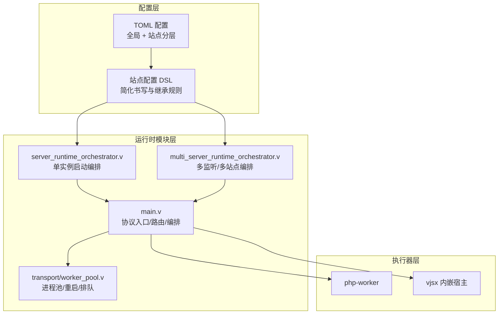
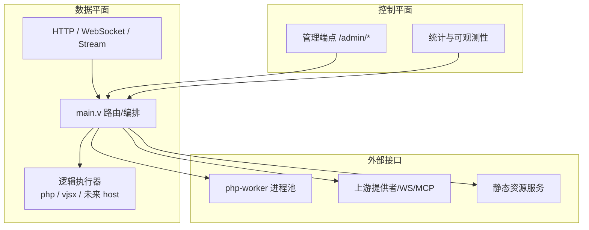
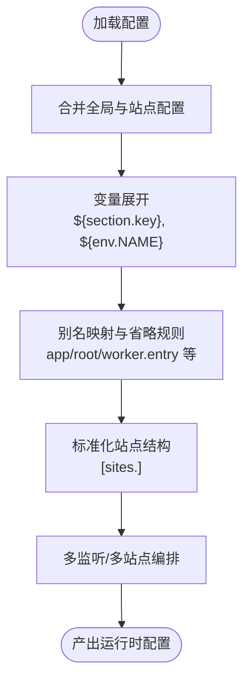
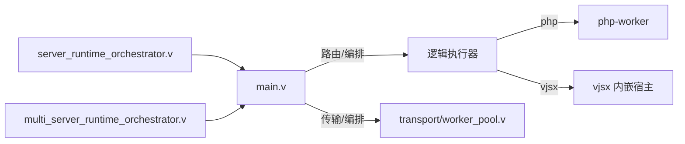
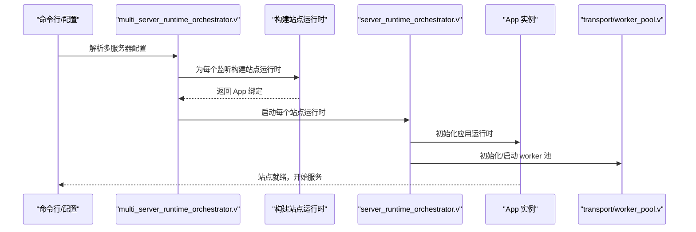
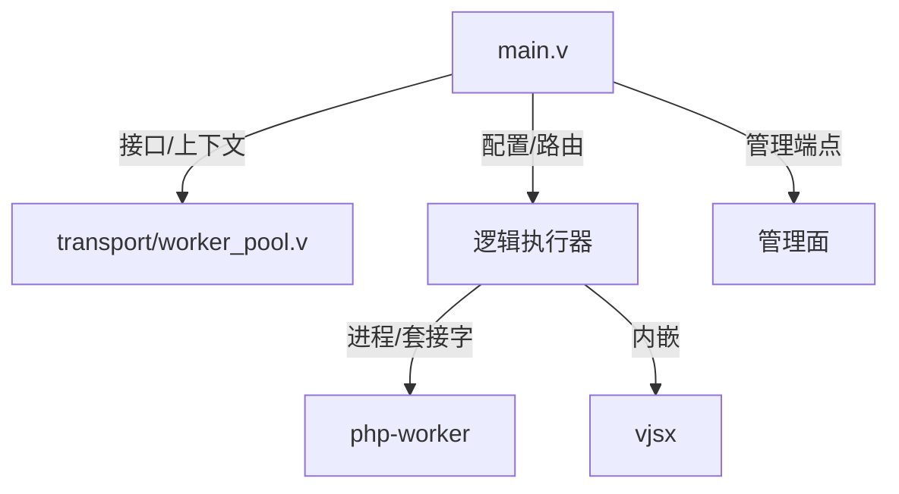

# 架构定制

<cite>
**本文引用的文件**
- [README.md](file://README.md)
- [SITE_CONFIG_DSL.md](file://docs/SITE_CONFIG_DSL.md)
- [RUNTIME_MODULE_MAP.md](file://docs/RUNTIME_MODULE_MAP.md)
- [main.v](file://src/main.v)
- [multi_server_runtime_orchestrator.v](file://src/multi_server_runtime_orchestrator.v)
- [server_runtime_orchestrator.v](file://src/server_runtime_orchestrator.v)
- [worker_pool.v](file://src/transport/worker_pool.v)
- [vhttpd.example.toml](file://config/vhttpd.example.toml)
- [vhttpd.multi.example.toml](file://config/vhttpd.multi.example.toml)
- [vjsx.example.toml](file://config/vhttpd.vjsx.example.toml)
</cite>

## 目录
1. [简介](#简介)
2. [项目结构](#项目结构)
3. [核心组件](#核心组件)
4. [架构总览](#架构总览)
5. [详细组件分析](#详细组件分析)
6. [依赖分析](#依赖分析)
7. [性能考虑](#性能考虑)
8. [故障排查指南](#故障排查指南)
9. [结论](#结论)
10. [附录](#附录)

## 简介
本文件面向“架构定制”的目标，系统化阐述 vhttpd 在可定制性方面的设计与实践，重点覆盖：
- 模块替换机制与功能扩展点
- 配置驱动的定制方法（含站点配置 DSL）
- 运行时模块映射与站点配置的继承规则
- 多服务器运行时配置的定制（负载均衡、故障转移、性能调优）
- 架构演进指导原则与测试验证方法

vhttpd 将请求逻辑抽象为“执行器（executor）”层面的能力，通过可插拔的执行器与运行时模块组合，实现对 PHP、嵌入式 vjsx、WebSocket 上游、流式传输等能力的统一承载。

## 项目结构
vhttpd 的定制能力由“配置层 + 运行时模块层 + 执行器层”构成：
- 配置层：TOML 配置文件支持全局与站点级分层，提供变量展开与继承规则
- 运行时模块层：协议入口、传输与编排、上游/WS/MCP/管理面等模块职责清晰
- 执行器层：逻辑执行器模型（php / vjsx / 未来 host），与 worker 或内嵌宿主对接

图表来源
- [main.v:1-200](file://src/main.v#L1-L200)
- [worker_pool.v:1-183](file://src/transport/worker_pool.v#L1-L183)
- [server_runtime_orchestrator.v:1-79](file://src/server_runtime_orchestrator.v#L1-L79)
- [multi_server_runtime_orchestrator.v:1-57](file://src/multi_server_runtime_orchestrator.v#L1-L57)

章节来源
- [README.md:1-800](file://README.md#L1-L800)
- [SITE_CONFIG_DSL.md:1-182](file://docs/SITE_CONFIG_DSL.md#L1-L182)
- [RUNTIME_MODULE_MAP.md:1-329](file://docs/RUNTIME_MODULE_MAP.md#L1-L329)

## 核心组件
- 协议入口与高层编排：main.v 负责请求入口、协议路由与高层调度，避免在其中堆积具体功能状态机，便于维护与扩展
- 传输与编排：worker_pool.v 管理 worker 进程生命周期、自动启动、重启退避、排队与诊断
- 运行时编排：server_runtime_orchestrator.v 提供单实例启动流程；multi_server_runtime_orchestrator.v 提供多监听/多站点编排
- 配置与站点 DSL：TOML 支持变量展开与分层继承；站点 DSL 提供“最简写法”与别名映射，降低配置复杂度

章节来源
- [main.v:1-200](file://src/main.v#L1-L200)
- [worker_pool.v:1-183](file://src/transport/worker_pool.v#L1-L183)
- [server_runtime_orchestrator.v:1-79](file://src/server_runtime_orchestrator.v#L1-L79)
- [multi_server_runtime_orchestrator.v:1-57](file://src/multi_server_runtime_orchestrator.v#L1-L57)
- [SITE_CONFIG_DSL.md:1-182](file://docs/SITE_CONFIG_DSL.md#L1-L182)
- [RUNTIME_MODULE_MAP.md:1-329](file://docs/RUNTIME_MODULE_MAP.md#L1-L329)

## 架构总览
vhttpd 的定制性体现在“配置即代码”的可插拔架构上：通过 TOML 配置与站点 DSL，将站点维度的执行器、worker、资源根目录、运行时参数等进行声明式组合；运行时模块则严格分层，职责边界清晰，便于替换与扩展。

图表来源
- [README.md:84-126](file://README.md#L84-L126)
- [RUNTIME_MODULE_MAP.md:9-32](file://docs/RUNTIME_MODULE_MAP.md#L9-L32)

## 详细组件分析

### 配置驱动的定制：站点配置 DSL 与继承规则
- 分层与继承
  - 全局配置与站点配置分层，站点配置可覆盖全局同名键
  - 支持变量展开：`${section.key}`、`${env.NAME}`、`${env.NAME:-default}`
- 站点 DSL 的“最简写法”
  - 将站点分为四层：基础信息、worker 通用参数、执行器入口捷径、执行器专属细节
  - 提供别名映射与省略规则，如 app → php.app_entry 或 vjsx.app_entry；root → project_root；worker.entry → php.worker_entry 等
- 多监听/多站点
  - 支持 listeners 与 sites 的显式绑定，或自动从 sites 推导监听项
  - 多站点各自隔离的 app runtime 与执行器选择

图表来源
- [SITE_CONFIG_DSL.md:9-182](file://docs/SITE_CONFIG_DSL.md#L9-L182)
- [README.md:533-617](file://README.md#L533-L617)

章节来源
- [SITE_CONFIG_DSL.md:1-182](file://docs/SITE_CONFIG_DSL.md#L1-L182)
- [README.md:437-617](file://README.md#L437-L617)

### 运行时模块映射与替换点
- 协议入口层：main.v
  - 负责顶层路由、协议分流与高层编排，适合新增协议或路由策略扩展
- 传输与编排层：transport/worker_pool.v
  - 负责 worker 进程生命周期、自动启动、重启退避、排队与诊断，适合替换为不同后端或策略
- 运行时编排：server_runtime_orchestrator.v 与 multi_server_runtime_orchestrator.v
  - 单实例与多实例启动流程，适合替换为不同的执行器生命周期或站点组合策略
- 执行器层：逻辑执行器模型（php / vjsx / 未来 host）
  - 通过执行器计划（executor plan）与生命周期（lifecycle）接口，实现替换与扩展

图表来源
- [RUNTIME_MODULE_MAP.md:33-320](file://docs/RUNTIME_MODULE_MAP.md#L33-L320)
- [main.v:1-200](file://src/main.v#L1-L200)
- [worker_pool.v:1-183](file://src/transport/worker_pool.v#L1-L183)
- [server_runtime_orchestrator.v:1-79](file://src/server_runtime_orchestrator.v#L1-L79)
- [multi_server_runtime_orchestrator.v:1-57](file://src/multi_server_runtime_orchestrator.v#L1-L57)

章节来源
- [RUNTIME_MODULE_MAP.md:1-329](file://docs/RUNTIME_MODULE_MAP.md#L1-L329)
- [main.v:1-200](file://src/main.v#L1-L200)

### 多服务器运行时配置的定制：负载均衡、故障转移与性能调优
- 多监听/多站点编排
  - 通过 multi_server_runtime_orchestrator.v 将多个监听绑定到独立站点，每个站点拥有独立 app runtime 与执行器
  - 单实例回退：当解析到单站或多站不可用时，自动回退到单实例模式
- 负载均衡
  - 多监听模式天然实现“端口级负载均衡”：客户端连接到不同 host:port 即可分流至不同站点
  - 对于同一站点内的 worker 并发，可通过 worker_pool.v 的 pool_size 与队列容量进行调优
- 故障转移
  - worker_pool.v 提供重启退避策略（restart_backoff_ms），在进程异常退出时自动重试
  - 支持“draining”标记与排队超时（queue_timeout_ms），保障优雅降级
- 性能调优
  - 通过 worker.pool_size、queue_capacity、queue_timeout_ms、read_timeout_ms 等参数调整吞吐与延迟
  - vjsx 内嵌模式下，可通过 thread_count 与 runtime_profile 控制执行器线程与运行时特性

图表来源
- [multi_server_runtime_orchestrator.v:12-56](file://src/multi_server_runtime_orchestrator.v#L12-L56)
- [server_runtime_orchestrator.v:36-62](file://src/server_runtime_orchestrator.v#L36-L62)
- [worker_pool.v:142-166](file://src/transport/worker_pool.v#L142-L166)

章节来源
- [multi_server_runtime_orchestrator.v:1-57](file://src/multi_server_runtime_orchestrator.v#L1-L57)
- [server_runtime_orchestrator.v:1-79](file://src/server_runtime_orchestrator.v#L1-L79)
- [worker_pool.v:1-183](file://src/transport/worker_pool.v#L1-L183)
- [README.md:533-617](file://README.md#L533-L617)

### 自定义运行时的集成与模块替换
- 替换执行器
  - 通过站点配置中的 executor.kind 或 CLI 参数切换执行器（php / vjsx），或在内嵌模式下禁用 worker
  - 执行器生命周期（lifecycle）与计划（plan）接口用于注入新执行器
- 替换传输/编排
  - 若需替换 worker 通信协议或编排策略，可在 server_runtime_orchestrator.v 中扩展启动流程
  - 若需替换 worker 进程管理策略，可在 transport/worker_pool.v 中扩展进程池行为
- 新增运行时模块
  - 在 main.v 中注册新的协议入口与路由分支
  - 在 RUNTIME_MODULE_MAP.md 的分层中定位新增模块的职责边界

章节来源
- [README.md:33-67](file://README.md#L33-L67)
- [RUNTIME_MODULE_MAP.md:33-320](file://docs/RUNTIME_MODULE_MAP.md#L33-L320)
- [server_runtime_orchestrator.v:11-34](file://src/server_runtime_orchestrator.v#L11-L34)

### 功能扩展的开发指南
- 以最小改动扩展：遵循 RUNTIME_MODULE_MAP.md 的分层职责，将新功能放入对应模块
- 配置即契约：通过 TOML 与站点 DSL 明确暴露扩展点参数，避免硬编码
- 渐进式演进：先在单实例模式验证，再扩展到多监听/多站点

章节来源
- [RUNTIME_MODULE_MAP.md:306-320](file://docs/RUNTIME_MODULE_MAP.md#L306-L320)
- [SITE_CONFIG_DSL.md:9-37](file://docs/SITE_CONFIG_DSL.md#L9-L37)

## 依赖分析
- 组件耦合与内聚
  - main.v 与各运行时模块松耦合，通过接口与上下文传递数据
  - worker_pool.v 与执行器层通过生命周期接口交互，便于替换
- 外部依赖与集成点
  - 通过 veb 作为 HTTP/请求 ID 源，确保与底层运行时栈一致
  - 通过 TOML 配置与环境变量实现外部输入的注入

图表来源
- [main.v:1-200](file://src/main.v#L1-L200)
- [worker_pool.v:1-183](file://src/transport/worker_pool.v#L1-L183)
- [README.md:152-173](file://README.md#L152-L173)

章节来源
- [README.md:152-173](file://README.md#L152-L173)
- [RUNTIME_MODULE_MAP.md:33-320](file://docs/RUNTIME_MODULE_MAP.md#L33-L320)

## 性能考虑
- worker 并发与排队
  - pool_size、queue_capacity、queue_timeout_ms 影响并发与排队等待
  - read_timeout_ms 控制 worker 读取超时，避免长尾阻塞
- 重启退避
  - restart_backoff_ms 提供指数退避，缓解瞬时失败导致的抖动
- vjsx 内嵌模式
  - thread_count 与 runtime_profile 影响执行器线程与运行时特性，适合在内嵌场景做针对性优化

章节来源
- [worker_pool.v:168-182](file://src/transport/worker_pool.v#L168-L182)
- [README.md:619-672](file://README.md#L619-L672)

## 故障排查指南
- 启动与配置
  - 使用示例配置文件验证基本路径与参数是否正确
  - 多监听模式下检查 listeners 与 sites 的绑定关系
- worker 问题
  - 查看 worker 启动日志与 socket 就绪情况
  - 观察重启退避与排队超时是否触发
- 运行时快照
  - 通过管理端点查看运行时状态与最近事件，辅助定位问题

章节来源
- [README.md:533-617](file://README.md#L533-L617)
- [worker_pool.v:34-45](file://src/transport/worker_pool.v#L34-L45)

## 结论
vhttpd 的架构定制以“配置即代码 + 模块分层 + 执行器模型”为核心，既保证了扩展灵活性，又维持了运行时的稳定性。通过站点配置 DSL 与多监听/多站点编排，可以在不修改核心代码的前提下完成功能扩展与部署定制；通过生命周期与计划接口，可无缝替换执行器与传输策略；通过变量展开与分层继承，使配置具备良好的可维护性与可移植性。

## 附录
- 示例配置参考
  - 单实例示例：[vhttpd.example.toml](file://config/vhttpd.example.toml)
  - 多监听/多站点示例：[vhttpd.multi.example.toml](file://config/vhttpd.multi.example.toml)
  - vjsx 内嵌示例：[vjsx.example.toml](file://config/vhttpd.vjsx.example.toml)
- 文档参考
  - 站点配置 DSL：[SITE_CONFIG_DSL.md](file://docs/SITE_CONFIG_DSL.md)
  - 运行时模块映射：[RUNTIME_MODULE_MAP.md](file://docs/RUNTIME_MODULE_MAP.md)
  - 顶层架构图与说明：[README.md:84-126](file://README.md#L84-L126)