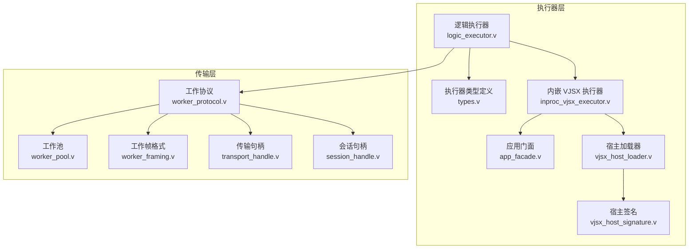
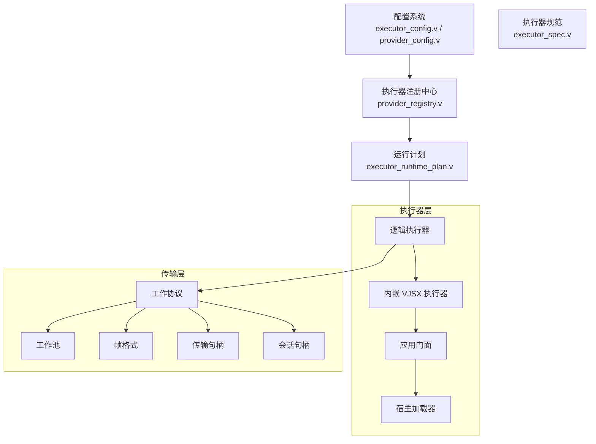
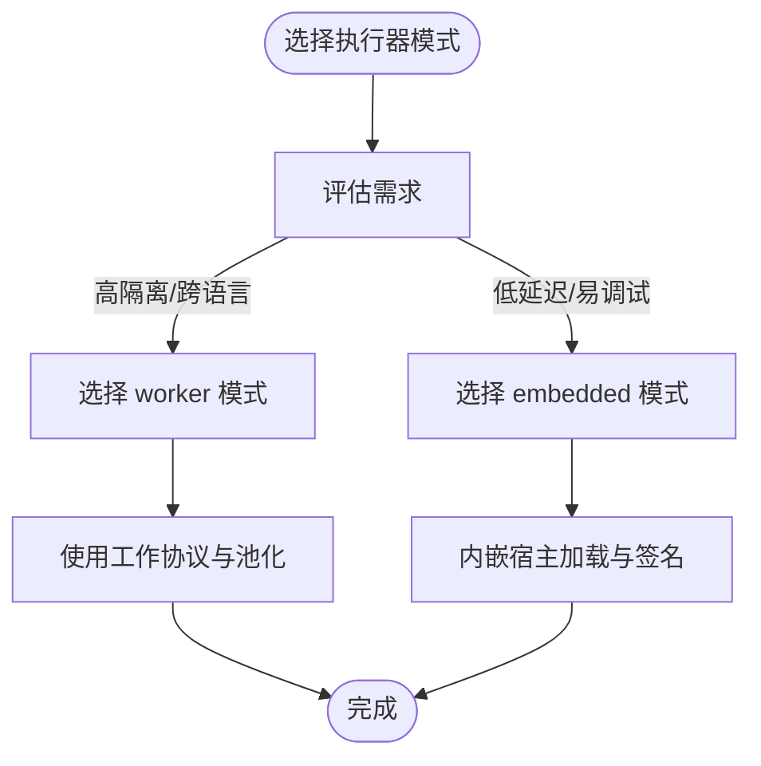
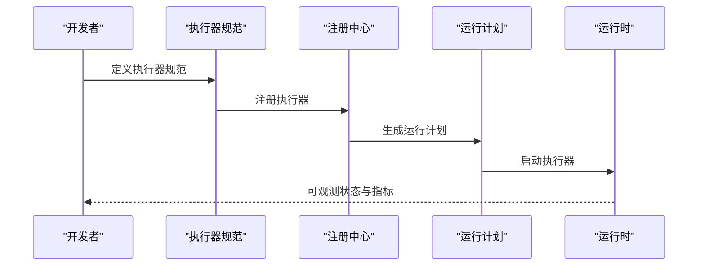
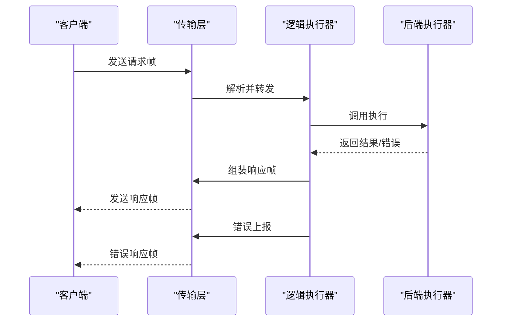
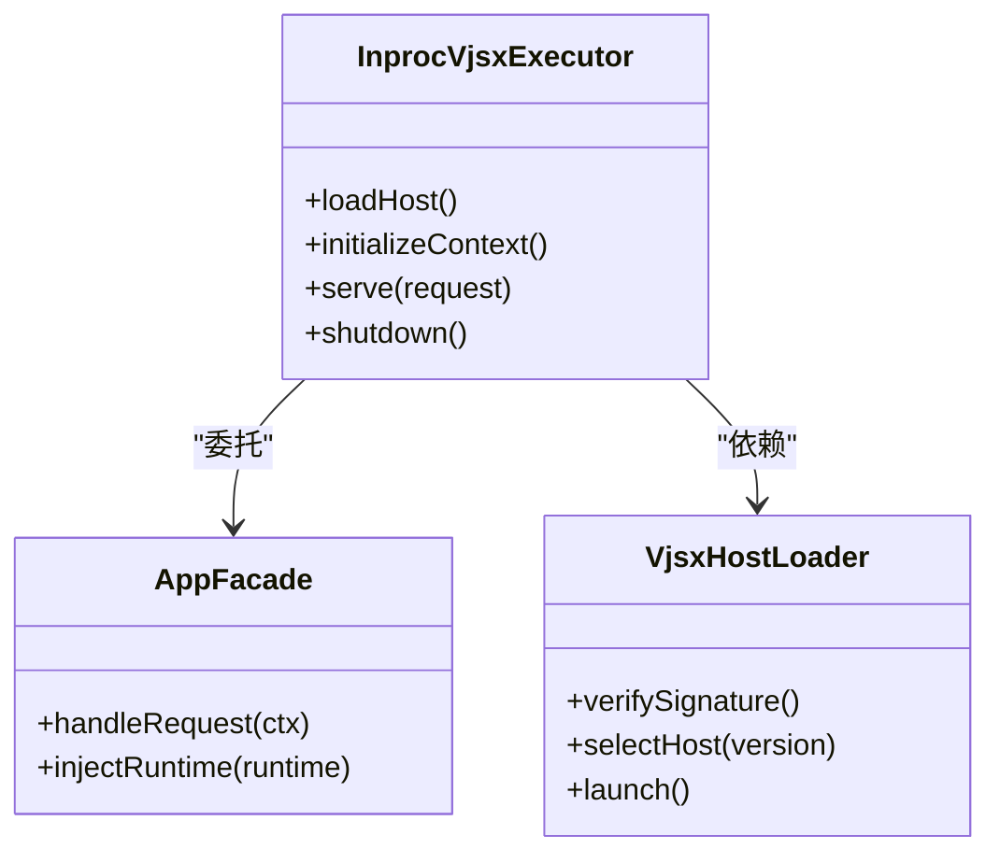
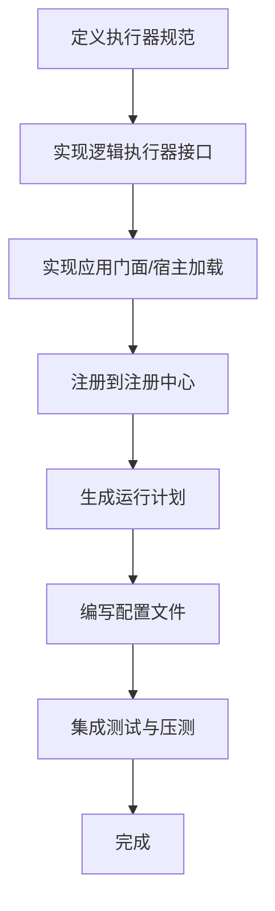
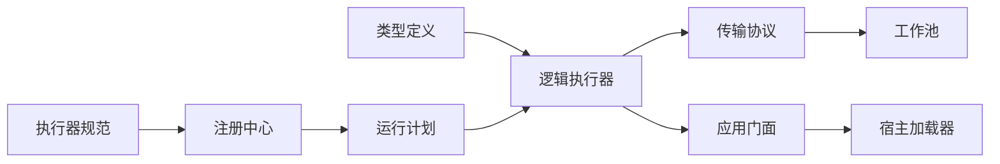

# 自定义执行器开发

<cite>
**本文档引用的文件**
- [logic_executor.v](file://src/executor/logic_executor.v)
- [types.v](file://src/executor/types.v)
- [inproc_vjsx_executor.v](file://src/executor/inproc_vjsx_executor.v)
- [app_facade.v](file://src/executor/app_facade.v)
- [vjsx_host_loader.v](file://src/executor/vjsx_host_loader.v)
- [vjsx_host_signature.v](file://src/executor/vjsx_host_signature.v)
- [executor_config.v](file://src/executor_config.v)
- [executor_lifecycle.v](file://src/executor_lifecycle.v)
- [executor_runtime_plan.v](file://src/executor_runtime_plan.v)
- [executor_spec.v](file://src/executor_spec.v)
- [worker_protocol.v](file://src/transport/worker_protocol.v)
- [worker_pool.v](file://src/transport/worker_pool.v)
- [worker_framing.v](file://src/transport/worker_framing.v)
- [transport_handle.v](file://src/transport/transport_handle.v)
- [session_handle.v](file://src/transport/session_handle.v)
- [provider_registry.v](file://src/provider_registry.v)
- [provider_spec.v](file://src/provider_spec.v)
- [provider_config.v](file://src/provider_config.v)
- [multi_server_runtime_config.v](file://src/multi_server_runtime_config.v)
- [multi_server_runtime_orchestrator.v](file://src/multi_server_runtime_orchestrator.v)
- [server_runtime_config.v](file://src/server_runtime_config.v)
- [server_runtime_orchestrator.v](file://src/server_runtime_orchestrator.v)
- [vhttpd.toml](file://vhttpd.toml)
- [config/vhttpd.example.toml](file://config/vhttpd.example.toml)
- [config/vhttpd.multi.example.toml](file://config/vhttpd.multi.example.toml)
- [examples/config/hello.toml](file://examples/config/hello.toml)
- [examples/config/laravel.toml](file://examples/config/laravel.toml)
- [examples/config/symfony.toml](file://examples/config/symfony.toml)
- [examples/config/mcp.toml](file://examples/config/mcp.toml)
- [examples/config/ollama-proxy.toml](file://examples/config/ollama-proxy.toml)
- [examples/config/openai-gateway.toml](file://examples/config/openai-gateway.toml)
- [examples/config/stream-dispatch.toml](file://examples/config/stream-dispatch.toml)
- [examples/config/websocket-echo.toml](file://examples/config/websocket-echo.toml)
- [examples/config/wordpress.toml](file://examples/config/wordpress.toml)
- [examples/hello-app.php](file://examples/hello-app.php)
- [examples/mcp-app.php](file://examples/mcp-app.php)
- [examples/ollama-proxy-app.php](file://examples/ollama-proxy-app.php)
- [examples/feishu-bot-mcp-app.php](file://examples/feishu-bot-mcp-app.php)
- [examples/ai-stream-app.php](file://examples/ai-stream-app.php)
- [examples/stream-dispatch-app.php](file://examples/stream-dispatch-app.php)
- [examples/websocket_echo_app.php](file://examples/websocket_echo_app.php)
- [examples/wordpress/app.php](file://examples/wordpress/app.php)
- [examples/laravel/app.php](file://examples/laravel/app.php)
- [examples/symfony/app.php](file://examples/symfony/app.php)
- [docs/EXECUTOR_MODES.md](file://docs/EXECUTOR_MODES.md)
- [docs/SITE_CONFIG_DSL.md](file://docs/SITE_CONFIG_DSL.md)
- [docs/RUNTIME_MODULE_MAP.md](file://docs/RUNTIME_MODULE_MAP.md)
- [docs/TRANSPORT_CONTRACT.md](file://docs/TRANSPORT_CONTRACT.md)
</cite>

## 目录
1. [简介](#简介)
2. [项目结构](#项目结构)
3. [核心组件](#核心组件)
4. [架构总览](#架构总览)
5. [详细组件分析](#详细组件分析)
6. [依赖关系分析](#依赖关系分析)
7. [性能考虑](#性能考虑)
8. [故障排除指南](#故障排除指南)
9. [结论](#结论)
10. [附录](#附录)

## 简介
本文件面向高级开发者，系统性阐述 vhttpd 中自定义执行器的开发方法论与实现细节。内容覆盖执行器接口设计原理、执行器类型定义、生命周期管理、worker 模式与 embedded 模式的差异、执行器注册机制与配置接口、与传输层的交互方式（请求处理、响应生成、错误处理），以及性能优化与最佳实践。通过代码级图示与分层讲解，帮助读者从零开始构建高效稳定的自定义执行器。

## 项目结构
vhttpd 的执行器子系统位于 src/executor 目录，围绕逻辑执行器抽象、类型定义、内嵌 VJSX 执行器、应用门面与宿主加载器等模块组织。同时，传输层（transport）负责 worker 协议、池化与帧格式，提供执行器与运行时之间的通信通道。



**图表来源**
- [logic_executor.v](file://src/executor/logic_executor.v)
- [types.v](file://src/executor/types.v)
- [inproc_vjsx_executor.v](file://src/executor/inproc_vjsx_executor.v)
- [app_facade.v](file://src/executor/app_facade.v)
- [vjsx_host_loader.v](file://src/executor/vjsx_host_loader.v)
- [vjsx_host_signature.v](file://src/executor/vjsx_host_signature.v)
- [worker_protocol.v](file://src/transport/worker_protocol.v)
- [worker_pool.v](file://src/transport/worker_pool.v)
- [worker_framing.v](file://src/transport/worker_framing.v)
- [transport_handle.v](file://src/transport/transport_handle.v)
- [session_handle.v](file://src/transport/session_handle.v)

**章节来源**
- [logic_executor.v](file://src/executor/logic_executor.v)
- [types.v](file://src/executor/types.v)
- [inproc_vjsx_executor.v](file://src/executor/inproc_vjsx_executor.v)
- [app_facade.v](file://src/executor/app_facade.v)
- [vjsx_host_loader.v](file://src/executor/vjsx_host_loader.v)
- [vjsx_host_signature.v](file://src/executor/vjsx_host_signature.v)
- [worker_protocol.v](file://src/transport/worker_protocol.v)
- [worker_pool.v](file://src/transport/worker_pool.v)
- [worker_framing.v](file://src/transport/worker_framing.v)
- [transport_handle.v](file://src/transport/transport_handle.v)
- [session_handle.v](file://src/transport/session_handle.v)

## 核心组件
- 逻辑执行器抽象：定义执行器的统一接口、状态管理与生命周期钩子，屏蔽具体执行后端差异。
- 执行器类型定义：描述执行器的元数据、能力声明、资源约束与运行参数。
- 内嵌 VJSX 执行器：在进程内启动 VJSX 宿主，承载前端/脚本类应用的执行。
- 应用门面：封装应用入口、路由与上下文注入，作为执行器对外的统一接口。
- 宿主加载器与签名：负责 VJSX 宿主的加载、校验与版本签名，确保安全与兼容。
- 传输层协议：定义 worker 与宿主间的帧格式、消息编解码与会话管理，支撑多实例并发。

**章节来源**
- [logic_executor.v](file://src/executor/logic_executor.v)
- [types.v](file://src/executor/types.v)
- [inproc_vjsx_executor.v](file://src/executor/inproc_vjsx_executor.v)
- [app_facade.v](file://src/executor/app_facade.v)
- [vjsx_host_loader.v](file://src/executor/vjsx_host_loader.v)
- [vjsx_host_signature.v](file://src/executor/vjsx_host_signature.v)
- [worker_protocol.v](file://src/transport/worker_protocol.v)

## 架构总览
下图展示了执行器与传输层、配置系统与运行时编排的整体交互：



**图表来源**
- [executor_config.v](file://src/executor_config.v)
- [provider_registry.v](file://src/provider_registry.v)
- [executor_runtime_plan.v](file://src/executor_runtime_plan.v)
- [executor_spec.v](file://src/executor_spec.v)
- [logic_executor.v](file://src/executor/logic_executor.v)
- [inproc_vjsx_executor.v](file://src/executor/inproc_vjsx_executor.v)
- [app_facade.v](file://src/executor/app_facade.v)
- [vjsx_host_loader.v](file://src/executor/vjsx_host_loader.v)
- [worker_protocol.v](file://src/transport/worker_protocol.v)
- [worker_pool.v](file://src/transport/worker_pool.v)
- [worker_framing.v](file://src/transport/worker_framing.v)
- [transport_handle.v](file://src/transport/transport_handle.v)
- [session_handle.v](file://src/transport/session_handle.v)

## 详细组件分析

### 逻辑执行器核心接口与生命周期
- 接口职责：接收请求、调度执行、生成响应、错误传播与资源回收。
- 生命周期阶段：初始化（加载配置、准备环境）、运行（处理请求、维护状态）、关闭（释放资源、清理会话）。
- 钩子扩展：支持前置/后置钩子、健康检查、热重载与优雅停机。

```mermaid
classDiagram
class LogicExecutor {
+initialize(config)
+execute(request) Response
+shutdown()
+health() HealthStatus
}
class ExecutorTypes {
+id : string
+kind : ExecutorKind
+capabilities : map[string]interface{}
+resources : Resources
}
class LifecycleHooks {
+onStart()
+onStop()
+onError(error)
+onRequest(request)
+onResponse(response)
}
LogicExecutor --> ExecutorTypes : "使用"
LogicExecutor --> LifecycleHooks : "可选集成"
```

**图表来源**
- [logic_executor.v](file://src/executor/logic_executor.v)
- [types.v](file://src/executor/types.v)
- [executor_lifecycle.v](file://src/executor_lifecycle.v)

**章节来源**
- [logic_executor.v](file://src/executor/logic_executor.v)
- [types.v](file://src/executor/types.v)
- [executor_lifecycle.v](file://src/executor_lifecycle.v)

### 执行器类型定义与能力模型
- 类型标识与种类：唯一 ID、执行器种类（如 worker/embedded）、能力清单（如流式、认证、网络策略）。
- 资源约束：CPU/内存/IO 配额、并发度限制、超时策略。
- 运行参数：启动参数、环境变量、挂载点与权限声明。

```mermaid
classDiagram
class ExecutorSpec {
+id : string
+kind : ExecutorKind
+capabilities : Capabilities
+resources : Resources
+parameters : map[string]interface{}
}
class Capabilities {
+streaming : bool
+authentication : bool
+network_access : bool
+filesystem_perms : Permissions
}
class Resources {
+cpu : CPUQuota
+memory : MemoryQuota
+io_bandwidth : IOBandwidth
+concurrency_limit : int
}
ExecutorSpec --> Capabilities
ExecutorSpec --> Resources
```

**图表来源**
- [executor_spec.v](file://src/executor_spec.v)
- [types.v](file://src/executor/types.v)

**章节来源**
- [executor_spec.v](file://src/executor_spec.v)
- [types.v](file://src/executor/types.v)

### worker 模式 vs embedded 模式
- worker 模式：独立进程/线程池，强隔离、高弹性、跨语言友好；适合复杂或不受信任的应用。
- embedded 模式：在进程内嵌入宿主（如 VJSX），低延迟、共享内存、便于调试；适合轻量或高性能场景。
- 选择依据：安全性要求、性能目标、运维复杂度与资源占用。



**图表来源**
- [docs/EXECUTOR_MODES.md](file://docs/EXECUTOR_MODES.md)
- [worker_protocol.v](file://src/transport/worker_protocol.v)
- [worker_pool.v](file://src/transport/worker_pool.v)
- [vjsx_host_loader.v](file://src/executor/vjsx_host_loader.v)
- [vjsx_host_signature.v](file://src/executor/vjsx_host_signature.v)

**章节来源**
- [docs/EXECUTOR_MODES.md](file://docs/EXECUTOR_MODES.md)
- [worker_protocol.v](file://src/transport/worker_protocol.v)
- [worker_pool.v](file://src/transport/worker_pool.v)
- [vjsx_host_loader.v](file://src/executor/vjsx_host_loader.v)
- [vjsx_host_signature.v](file://src/executor/vjsx_host_signature.v)

### 执行器注册机制与配置接口
- 注册中心：集中管理执行器规范、能力与运行计划，支持动态发现与替换。
- 配置来源：单机/多机运行配置、站点配置 DSL、示例配置模板。
- 集成步骤：定义执行器规范 → 注册到注册中心 → 生成运行计划 → 启动生命周期管理。



**图表来源**
- [executor_spec.v](file://src/executor_spec.v)
- [provider_registry.v](file://src/provider_registry.v)
- [executor_runtime_plan.v](file://src/executor_runtime_plan.v)
- [provider_config.v](file://src/provider_config.v)
- [docs/SITE_CONFIG_DSL.md](file://docs/SITE_CONFIG_DSL.md)

**章节来源**
- [executor_spec.v](file://src/executor_spec.v)
- [provider_registry.v](file://src/provider_registry.v)
- [executor_runtime_plan.v](file://src/executor_runtime_plan.v)
- [provider_config.v](file://src/provider_config.v)
- [docs/SITE_CONFIG_DSL.md](file://docs/SITE_CONFIG_DSL.md)

### 与传输层的交互：请求处理、响应生成与错误处理
- 请求处理：接收来自传输层的请求帧，解析为执行器可消费的上下文对象，调用逻辑执行器处理。
- 响应生成：将执行结果序列化为传输帧，按协议写回客户端。
- 错误处理：捕获执行异常，映射为标准错误码与消息，通过传输层返回并记录日志。



**图表来源**
- [worker_protocol.v](file://src/transport/worker_protocol.v)
- [worker_framing.v](file://src/transport/worker_framing.v)
- [transport_handle.v](file://src/transport/transport_handle.v)
- [session_handle.v](file://src/transport/session_handle.v)
- [logic_executor.v](file://src/executor/logic_executor.v)

**章节来源**
- [worker_protocol.v](file://src/transport/worker_protocol.v)
- [worker_framing.v](file://src/transport/worker_framing.v)
- [transport_handle.v](file://src/transport/transport_handle.v)
- [session_handle.v](file://src/transport/session_handle.v)
- [logic_executor.v](file://src/executor/logic_executor.v)

### 内嵌 VJSX 执行器详解
- 宿主加载：根据签名验证与版本匹配，加载对应 VJSX 宿主二进制或脚本。
- 应用门面：提供统一入口，注入运行时上下文（会话、配置、日志）。
- 生命周期：随进程启动而初始化，在优雅停机时释放资源。



**图表来源**
- [inproc_vjsx_executor.v](file://src/executor/inproc_vjsx_executor.v)
- [app_facade.v](file://src/executor/app_facade.v)
- [vjsx_host_loader.v](file://src/executor/vjsx_host_loader.v)
- [vjsx_host_signature.v](file://src/executor/vjsx_host_signature.v)

**章节来源**
- [inproc_vjsx_executor.v](file://src/executor/inproc_vjsx_executor.v)
- [app_facade.v](file://src/executor/app_facade.v)
- [vjsx_host_loader.v](file://src/executor/vjsx_host_loader.v)
- [vjsx_host_signature.v](file://src/executor/vjsx_host_signature.v)

### 完整开发示例：从接口实现到配置集成
- 步骤一：定义执行器规范（ID、种类、能力、资源）
- 步骤二：实现逻辑执行器接口（初始化、执行、关闭）
- 步骤三：实现应用门面与宿主加载（如适用）
- 步骤四：注册到注册中心并生成运行计划
- 步骤五：编写配置文件（单机/多机/站点 DSL）
- 步骤六：集成测试与性能压测



**图表来源**
- [executor_spec.v](file://src/executor_spec.v)
- [logic_executor.v](file://src/executor/logic_executor.v)
- [app_facade.v](file://src/executor/app_facade.v)
- [vjsx_host_loader.v](file://src/executor/vjsx_host_loader.v)
- [provider_registry.v](file://src/provider_registry.v)
- [executor_runtime_plan.v](file://src/executor_runtime_plan.v)
- [provider_config.v](file://src/provider_config.v)

**章节来源**
- [executor_spec.v](file://src/executor_spec.v)
- [logic_executor.v](file://src/executor/logic_executor.v)
- [app_facade.v](file://src/executor/app_facade.v)
- [vjsx_host_loader.v](file://src/executor/vjsx_host_loader.v)
- [provider_registry.v](file://src/provider_registry.v)
- [executor_runtime_plan.v](file://src/executor_runtime_plan.v)
- [provider_config.v](file://src/provider_config.v)

## 依赖关系分析
- 组件耦合：逻辑执行器对类型定义与生命周期有直接依赖；embedded 执行器进一步依赖应用门面与宿主加载器。
- 外部依赖：传输层协议与池化组件为执行器提供稳定的消息通道与并发控制。
- 运行时编排：配置系统与注册中心共同决定执行器的部署形态与资源分配。



**图表来源**
- [types.v](file://src/executor/types.v)
- [logic_executor.v](file://src/executor/logic_executor.v)
- [executor_spec.v](file://src/executor_spec.v)
- [provider_registry.v](file://src/provider_registry.v)
- [executor_runtime_plan.v](file://src/executor_runtime_plan.v)
- [worker_protocol.v](file://src/transport/worker_protocol.v)
- [worker_pool.v](file://src/transport/worker_pool.v)
- [app_facade.v](file://src/executor/app_facade.v)
- [vjsx_host_loader.v](file://src/executor/vjsx_host_loader.v)

**章节来源**
- [types.v](file://src/executor/types.v)
- [logic_executor.v](file://src/executor/logic_executor.v)
- [executor_spec.v](file://src/executor_spec.v)
- [provider_registry.v](file://src/provider_registry.v)
- [executor_runtime_plan.v](file://src/executor_runtime_plan.v)
- [worker_protocol.v](file://src/transport/worker_protocol.v)
- [worker_pool.v](file://src/transport/worker_pool.v)
- [app_facade.v](file://src/executor/app_facade.v)
- [vjsx_host_loader.v](file://src/executor/vjsx_host_loader.v)

## 性能考虑
- 并发与池化：合理设置工作池大小与队列长度，避免阻塞与饥饿；根据请求特征调整帧格式与批处理策略。
- 资源配额：为执行器设定 CPU/内存/IO 上限，结合健康检查与熔断策略提升稳定性。
- 序列化与编码：优先使用紧凑的二进制帧格式，减少序列化开销；对热点路径进行缓存与预热。
- 生命周期优化：缩短初始化时间，启用懒加载与预热；在优雅停机中避免长尾请求。
- 监控与可观测：埋点关键指标（QPS、P95/P99、错误率、资源占用），结合日志与追踪定位瓶颈。

## 故障排除指南
- 常见问题
  - 执行器无法启动：检查配置文件语法、资源配额与宿主签名验证。
  - 请求无响应：排查传输层协议一致性、工作池饱和与死锁。
  - 崩溃与异常：启用堆栈跟踪与错误上报，定位异常源头。
- 排查步骤
  - 核对执行器规范与注册状态
  - 检查运行计划与资源配置
  - 分析传输层日志与帧格式
  - 触发健康检查与诊断命令

**章节来源**
- [executor_config.v](file://src/executor_config.v)
- [provider_config.v](file://src/provider_config.v)
- [worker_protocol.v](file://src/transport/worker_protocol.v)
- [transport_handle.v](file://src/transport/transport_handle.v)
- [session_handle.v](file://src/transport/session_handle.v)

## 结论
通过统一的逻辑执行器抽象、清晰的类型与生命周期模型、灵活的 worker/embedded 模式以及完善的传输层协议，vhttpd 为自定义执行器提供了高扩展性与高性能的基础。遵循本文档的开发流程与最佳实践，开发者可以快速构建稳定高效的执行器，并与现有运行时无缝集成。

## 附录
- 配置参考
  - 单机配置：参见示例配置文件与默认模板
  - 多机配置：参见多服务器运行配置与编排器
  - 站点配置 DSL：参见站点配置语言文档
- 示例应用
  - PHP 应用示例：Hello、Laravel、Symfony、WordPress
  - 其他协议示例：MCP、Ollama 代理、OpenAI 网关、流式分发、WebSocket 回显
- 文档索引
  - 执行器模式说明
  - 运行时模块映射
  - 传输契约

**章节来源**
- [vhttpd.toml](file://vhttpd.toml)
- [config/vhttpd.example.toml](file://config/vhttpd.example.toml)
- [config/vhttpd.multi.example.toml](file://config/vhttpd.multi.example.toml)
- [examples/config/hello.toml](file://examples/config/hello.toml)
- [examples/config/laravel.toml](file://examples/config/laravel.toml)
- [examples/config/symfony.toml](file://examples/config/symfony.toml)
- [examples/config/mcp.toml](file://examples/config/mcp.toml)
- [examples/config/ollama-proxy.toml](file://examples/config/ollama-proxy.toml)
- [examples/config/openai-gateway.toml](file://examples/config/openai-gateway.toml)
- [examples/config/stream-dispatch.toml](file://examples/config/stream-dispatch.toml)
- [examples/config/websocket-echo.toml](file://examples/config/websocket-echo.toml)
- [examples/config/wordpress.toml](file://examples/config/wordpress.toml)
- [examples/hello-app.php](file://examples/hello-app.php)
- [examples/mcp-app.php](file://examples/mcp-app.php)
- [examples/ollama-proxy-app.php](file://examples/ollama-proxy-app.php)
- [examples/feishu-bot-mcp-app.php](file://examples/feishu-bot-mcp-app.php)
- [examples/ai-stream-app.php](file://examples/ai-stream-app.php)
- [examples/stream-dispatch-app.php](file://examples/stream-dispatch-app.php)
- [examples/websocket_echo_app.php](file://examples/websocket_echo_app.php)
- [examples/wordpress/app.php](file://examples/wordpress/app.php)
- [examples/laravel/app.php](file://examples/laravel/app.php)
- [examples/symfony/app.php](file://examples/symfony/app.php)
- [docs/EXECUTOR_MODES.md](file://docs/EXECUTOR_MODES.md)
- [docs/SITE_CONFIG_DSL.md](file://docs/SITE_CONFIG_DSL.md)
- [docs/RUNTIME_MODULE_MAP.md](file://docs/RUNTIME_MODULE_MAP.md)
- [docs/TRANSPORT_CONTRACT.md](file://docs/TRANSPORT_CONTRACT.md)
- [multi_server_runtime_config.v](file://src/multi_server_runtime_config.v)
- [multi_server_runtime_orchestrator.v](file://src/multi_server_runtime_orchestrator.v)
- [server_runtime_config.v](file://src/server_runtime_config.v)
- [server_runtime_orchestrator.v](file://src/server_runtime_orchestrator.v)