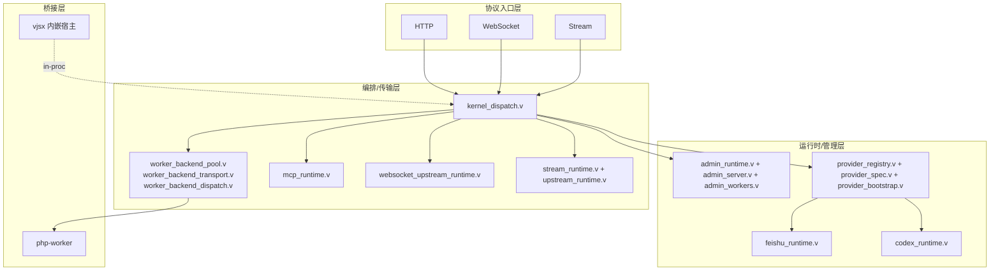
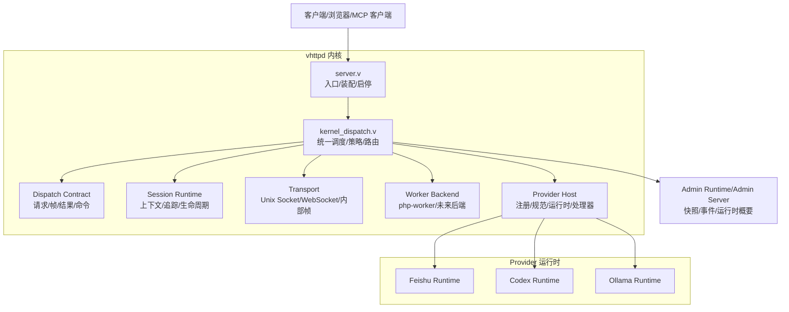
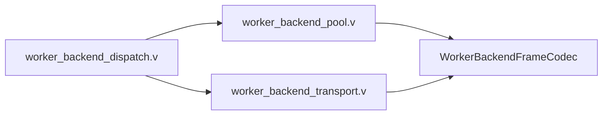
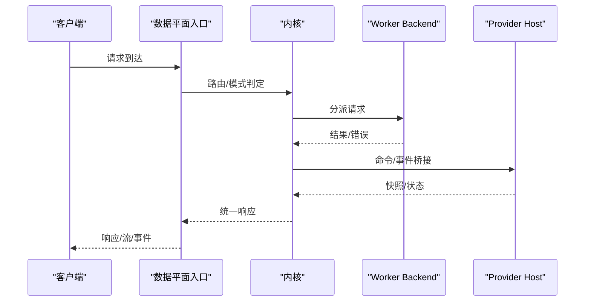
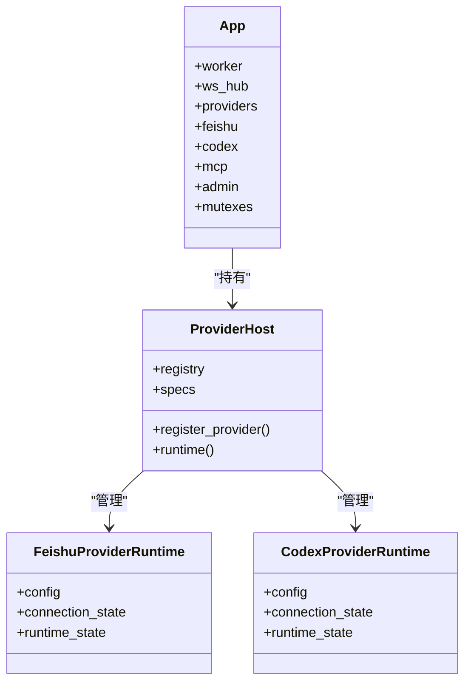
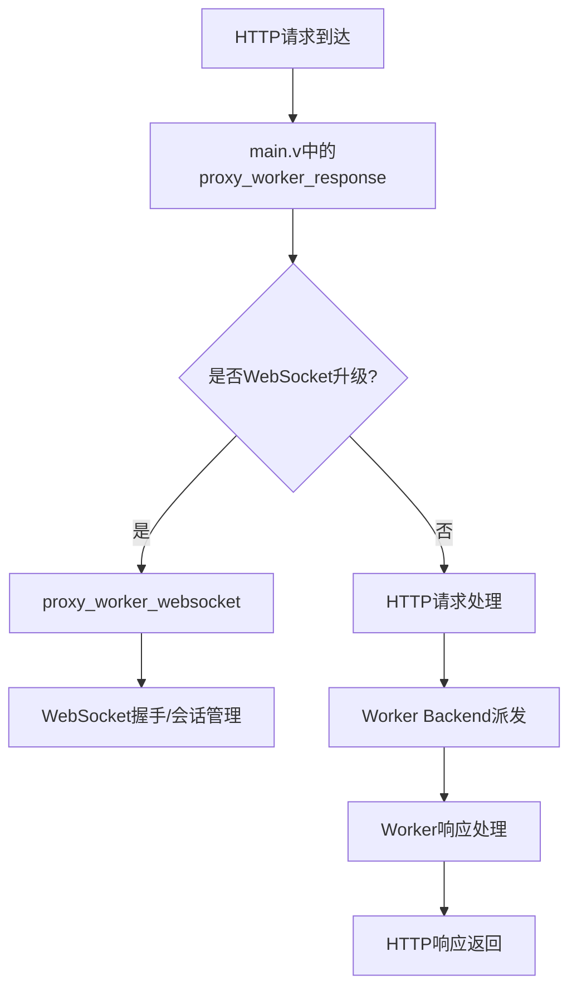
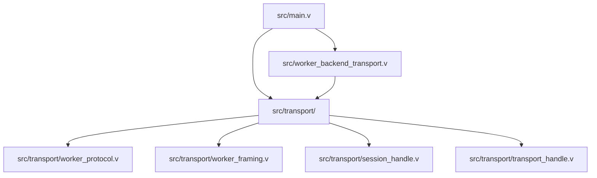
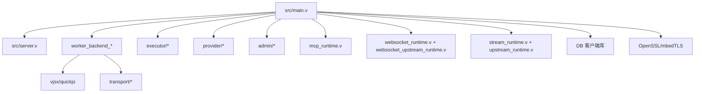
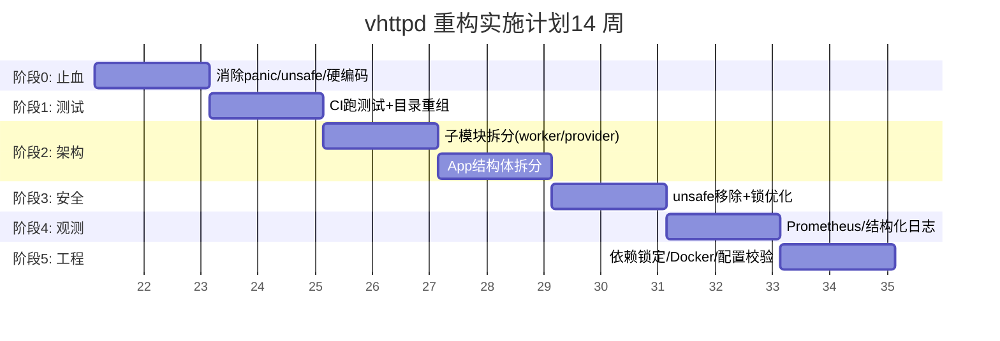

# 重构重组

<cite>
**本文档引用的文件**
- [README.md](file://README.md)
- [TODO_REFACTOR.md](file://TODO_REFACTOR.md)
- [REPO_SPLIT_NOTES.md](file://REPO_SPLIT_NOTES.md)
- [v.mod](file://v.mod)
- [docs/ARCHITECTURE_REFACTOR_BASELINE.md](file://docs/ARCHITECTURE_REFACTOR_BASELINE.md)
- [docs/refactor_0601.md](file://docs/refactor_0601.md)
- [docs/RUNTIME_MODULE_MAP.md](file://docs/RUNTIME_MODULE_MAP.md)
- [docs/STRUCT_RELATIONSHIP_MAP.md](file://docs/STRUCT_RELATIONSHIP_MAP.md)
- [docs/WEBSOCKET_UPSTREAM_PLAN.md](file://docs/WEBSOCKET_UPSTREAM_PLAN.md)
- [docs/STREAM_RUNTIME_PHASES.md](file://docs/STREAM_RUNTIME_PHASES.md)
- [docs/MCP.md](file://docs/MCP.md)
- [Makefile](file://Makefile)
- [src/main.v](file://src/main.v)
- [src/server.v](file://src/server.v)
- [src/worker_backend_pool.v](file://src/worker_backend_pool.v)
- [src/provider_registry.v](file://src/provider_registry.v)
- [src/transport/worker_protocol.v](file://src/transport/worker_protocol.v)
- [src/transport/session_handle.v](file://src/transport/session_handle.v)
- [src/transport/transport_handle.v](file://src/transport/transport_handle.v)
- [src/transport/worker_framing.v](file://src/transport/worker_framing.v)
- [src/transport/worker_pool.v](file://src/transport/worker_pool.v)
- [src/worker_backend_dispatch.v](file://src/worker_backend_dispatch.v)
- [src/worker_backend_transport.v](file://src/worker_backend_transport.v)
</cite>

## 目录
1. [简介](#简介)
2. [项目结构](#项目结构)
3. [核心组件](#核心组件)
4. [架构总览](#架构总览)
5. [详细组件分析](#详细组件分析)
6. [HTTP基础设施模块化](#http基础设施模块化)
7. [依赖分析](#依赖分析)
8. [性能考量](#性能考量)
9. [故障排查指南](#故障排查指南)
10. [结论](#结论)
11. [附录](#附录)

## 简介
本文件面向 vhttpd 项目的重构与重组，系统阐述模块拆分、代码清理与架构优化策略，明确阶段性目标与实施步骤，提供依赖关系分析、接口设计与迁移路径规划，并总结指导原则（向后兼容、测试策略、风险控制）、代码分割方法（模块边界、依赖管理、服务拆分）、重构后的架构演进方向与最佳实践，帮助开发者高效、安全地推进重构。

## 项目结构
vhttpd 当前采用单模块（module main）组织，源码分布在 src/ 下的 60+ 个 .v 文件，围绕 App 结构体形成"上帝对象"，导致模块边界模糊、耦合度高、可维护性差。重构目标是：
- 拆分模块：按领域拆分 server/、worker/、provider/、executor/、admin/、websocket/、mcp/ 等子模块，弱化 main 模块负担
- 解耦 App：将各子系统状态抽取为独立结构体，通过组合与接口与 App 交互
- 明确边界：区分协议入口层、transport/编排层、runtime/admin 层、PHP worker 桥层
- 强化契约：统一内部请求/帧/结果/命令的契约，降低新增运行时模式的成本

图表来源
- [docs/RUNTIME_MODULE_MAP.md:9-32](file://docs/RUNTIME_MODULE_MAP.md#L9-L32)
- [src/main.v:34-61](file://src/main.v#L34-L61)
- [src/server.v:1-200](file://src/server.v#L1-L200)

章节来源
- [README.md:1-120](file://README.md#L1-L120)
- [docs/RUNTIME_MODULE_MAP.md:9-32](file://docs/RUNTIME_MODULE_MAP.md#L9-L32)

## 核心组件
- App：当前运行时根结构体，承载 worker、websocket hub、MCP、Feishu/Codex 运行时、OpenAI 网关、admin 等状态
- Server：进程入口、配置加载、运行时装配与启停
- Worker Backend：进程池、队列、重启退避、socket 生命周期管理
- Provider Host：Provider 注册、规范、运行时与命令处理器的抽象与适配
- Runtime Modules：stream、websocket、mcp、upstream 等运行时模块
- Admin：运行时快照、worker 控制、可观测性

章节来源
- [src/main.v:34-61](file://src/main.v#L34-L61)
- [src/server.v:171-200](file://src/server.v#L171-L200)
- [src/worker_backend_pool.v:1-200](file://src/worker_backend_pool.v#L1-L200)
- [src/provider_registry.v:1-200](file://src/provider_registry.v#L1-L200)

## 架构总览
重构后的架构强调"内核（Kernel）"作为统一调度与协调者，将原本分散在 server/main 中的调度职责集中到内核，使会话、传输、工作器后端、Provider 运行时的边界更清晰，内部契约稳定，便于扩展新的运行时模式与后端。

图表来源
- [docs/ARCHITECTURE_REFACTOR_BASELINE.md:326-346](file://docs/ARCHITECTURE_REFACTOR_BASELINE.md#L326-L346)
- [src/main.v:34-61](file://src/main.v#L34-L61)

章节来源
- [docs/ARCHITECTURE_REFACTOR_BASELINE.md:348-494](file://docs/ARCHITECTURE_REFACTOR_BASELINE.md#L348-L494)

## 详细组件分析

### 1) Worker Backend 模块化（第一阶段）
目标：将 worker 管理抽象为通用后端，使 php-worker 成为一种后端实现，为未来 Lua/Go 等后端预留空间。

- 主要文件
  - worker_backend_pool.v：进程池生命周期、重启退避、最大请求数、drain
  - worker_backend_transport.v：帧读写、流/WS/MCP 分发助手、SSE/文本写出
  - worker_backend_dispatch.v：请求派发、队列容量与超时
- 重构要点
  - 将 server/main 中的调度逻辑下沉到 kernel_dispatch.v，通过 WorkerBackend 抽象进行统一派发
  - 为 WorkerBackend 定义稳定契约（start/stop/dispatch/read/write），便于纯 V 测试与替换
  - 保持 Admin API 与现有行为一致，逐步替换内部实现

图表来源
- [docs/ARCHITECTURE_REFACTOR_BASELINE.md:352-374](file://docs/ARCHITECTURE_REFACTOR_BASELINE.md#L352-L374)
- [src/worker_backend_pool.v:1-200](file://src/worker_backend_pool.v#L1-L200)

章节来源
- [docs/ARCHITECTURE_REFACTOR_BASELINE.md:352-374](file://docs/ARCHITECTURE_REFACTOR_BASELINE.md#L352-L374)

### 2) 内核（Kernel）实体化（第二阶段）
目标：将分散的调度职责集中到 Kernel，使其成为统一的决策中心，减少跨文件耦合。

- 主要文件
  - worker_backend_dispatch.v、worker_backend_queue.v、mcp_runtime.v、stream_runtime.v、websocket_runtime.v、websocket_upstream_runtime.v
- 重构要点
  - 将 data plane 的入口快速交由 Kernel，统一模式路由（http/stream/mcp/websocket_upstream）
  - 在 Kernel 中定义稳定的内部契约，降低新增运行时模式的侵入性
  - 通过 Provider Host 与 Worker Backend 解耦，避免直接依赖 App 字段

图表来源
- [docs/ARCHITECTURE_REFACTOR_BASELINE.md:375-399](file://docs/ARCHITECTURE_REFACTOR_BASELINE.md#L375-L399)

章节来源
- [docs/ARCHITECTURE_REFACTOR_BASELINE.md:375-399](file://docs/ARCHITECTURE_REFACTOR_BASELINE.md#L375-L399)

### 3) Provider 运行时所有权分离（第三阶段）
目标：区分 Provider 能力与 Provider 运行时状态，Provider 运行时成为真正的状态拥有者。

- 主要文件
  - provider_registry.v、provider_spec.v、provider_bootstrap.v、feishu_runtime.v、codex_runtime.v
- 重构要点
  - 将 Provider 的运行时状态收敛到各自 runtime struct（如 FeishuProviderRuntime、CodexProviderRuntime），不再散落在 App 上
  - App 仅保留 provider 级别的 mutex 与 runtime 实例，避免 V 语言对嵌套 mutex 的限制
  - Kernel 通过 Provider Host 与其交互，而非直接操作 App 字段

图表来源
- [docs/STRUCT_RELATIONSHIP_MAP.md:129-166](file://docs/STRUCT_RELATIONSHIP_MAP.md#L129-L166)
- [src/provider_registry.v:1-200](file://src/provider_registry.v#L1-L200)

章节来源
- [docs/STRUCT_RELATIONSHIP_MAP.md:129-166](file://docs/STRUCT_RELATIONSHIP_MAP.md#L129-L166)

### 4) 会话、策略与可观测性整合（第四阶段）
目标：统一上下文传播、快照与运行时报告、减少策略散落。

- 重构要点
  - Session Runtime 统一 trace/上下文/生命周期
  - Policy 子系统收敛重试/队列/能力策略/TTL/白名单
  - 观测性（Admin）统一快照与事件输出，支持按 provider/role 过滤

章节来源
- [docs/ARCHITECTURE_REFACTOR_BASELINE.md:424-435](file://docs/ARCHITECTURE_REFACTOR_BASELINE.md#L424-L435)

### 5) 测试与契约（Contract Tests）
- 纯 V 单元测试：小助手、轻量 JSON 扫描器、策略逻辑
- 纯 V 边界测试：Provider 注册/引导行为、Worker Backend 合同测试、Kernel 路由决策
- 合同测试：Worker 派发合同、命令/结果/帧规范化、Provider 处理器合同
- 全集成测试：HTTP/WebSocket/MCP/受管 worker/Socket 集成

章节来源
- [docs/ARCHITECTURE_REFACTOR_BASELINE.md:436-475](file://docs/ARCHITECTURE_REFACTOR_BASELINE.md#L436-L475)

### 6) 代码分割策略与方法
- 模块边界定义
  - server/：veb 应用壳、路由挂载、入口装配
  - worker/：进程池、队列、传输
  - provider/：注册/规范/引导/运行时/命令处理器
  - executor/：逻辑执行器调度
  - websocket/：Hub/运行时/上游
  - mcp/：会话管理
  - admin/：管理 API
- 依赖管理
  - main.v 通过 import 使用子模块，不直接访问内部符号
  - 保持对外接口兼容，必要时保留代理函数并标注弃用
- 服务拆分
  - 将 App 的 pub mut 字段按领域抽取为独立结构体，通过组合保留在 App 中
  - provider_bootstrap.v 改为遍历 app.providers 列表，而非硬编码 if/else

章节来源
- [docs/refactor_0601.md:268-347](file://docs/refactor_0601.md#L268-L347)

## HTTP基础设施模块化

### HTTP基础设施独立模块
HTTP基础设施现已作为独立模块存在，实现了更好的模块边界和代码组织。这一变化体现在以下几个方面：

#### 1) 传输层模块化
HTTP通信协议和传输机制已从 main 模块中独立出来，形成专门的 transport 模块：

- **worker_protocol.v**：定义了 WorkerResponse、WorkerStreamFrame、WorkerWebSocketFrame 等核心协议结构体
- **worker_framing.v**：提供帧编码/解码、URL处理、HTTP请求编码等工具函数
- **session_handle.v**：定义 RuntimeRole 枚举和 SessionHandle 结构体，用于会话管理
- **transport_handle.v**：提供 TransportHandle 结构体，封装传输层状态

#### 2) 类型别名迁移改进
重构过程中完成了重要的类型别名清理工作：

- **transport 别名清理**：✅ 28 个 main 模块文件 + main.v 本身现在直接使用 `transport.X` 
- **状态/执行器/工作器/服务器生命周期别名清理**：✅ 2025-06年清理完成
- **配置别名清理**：仍需清理 27 个 config 类型别名（如 `pub type VhttpdConfig = config.VhttpdConfig`）

#### 3) HTTP处理流程优化
HTTP请求处理现在更加模块化：

#### 4) 模块间依赖关系
HTTP基础设施的模块化带来了清晰的依赖关系：

**章节来源**
- [src/transport/worker_protocol.v:1-276](file://src/transport/worker_protocol.v#L1-L276)
- [src/transport/worker_framing.v:1-225](file://src/transport/worker_framing.v#L1-L225)
- [src/transport/session_handle.v:1-90](file://src/transport/session_handle.v#L1-L90)
- [src/transport/transport_handle.v:1-21](file://src/transport/transport_handle.v#L1-L21)
- [src/worker_backend_transport.v:1-256](file://src/worker_backend_transport.v#L1-L256)

### 类型别名迁移状态

重构跟踪显示当前类型别名迁移的状态：

| 类型类别 | 状态 | 迁移进度 | 说明 |
|---------|------|----------|------|
| transport 别名 | ✅ 已清理 | 28个别名删除 | 所有 main 模块直接使用 transport.X |
| 状态/执行器/工作器别名 | ✅ 已清理 | 2025-06年完成 | 8个文件删除，executor_config.v 删除 |
| 配置别名 | ⏳ 待清理 | 27个别名剩余 | main.v中的 VhttpdConfig 等类型别名 |

**章节来源**
- [TODO_REFACTOR.md:19-25](file://TODO_REFACTOR.md#L19-L25)

## 依赖分析
- 模块间依赖
  - main.v 依赖 server、worker、executor、provider、admin、mcp、websocket、openai、stats、assets、plugin 等
  - 各子模块之间通过稳定契约与接口交互，避免循环依赖
  - HTTP基础设施现在通过 transport 模块提供统一的协议和传输能力
- 外部依赖
  - vjsx/quickjs：通过 Makefile 与 ensure-quickjs.sh 管理
  - DB 客户端库：MySQL/PG/SQLite 客户端开发包
  - TLS：OpenSSL 或 mbedTLS
- 依赖锁定与可复现构建
  - 建议引入 deps.lock 或 git submodule 记录 vjsx/quickjs/V 编译器 commit
  - CI 中替换 --depth=1 为锁定版本，确保产物可复现

图表来源
- [Makefile:21-25](file://Makefile#L21-L25)
- [src/main.v:1-28](file://src/main.v#L1-L28)

章节来源
- [Makefile:1-139](file://Makefile#L1-L139)

## 性能考量
- 并发与锁
  - 统一锁层级并文档化，避免死锁；对只读场景使用 RWMutex
  - vjsx executor 的 lane 模型引入无锁队列（chan）替代 Mutex + ready bool
- 内存安全
  - 用 ?&T/Option[T] 替代裸 nil 初始化，强制处理 none 情况
  - 用 shared 或 chan 替代裸指针跨线程共享，消除 UAF 风险
- 可观测性
  - 增加 /admin/metrics 指标端点，输出 Prometheus 文本格式
  - 支持结构化日志（JSON），去除 emoji，按模块/Provider 细粒度控制日志级别
- HTTP基础设施优化
  - 通过模块化减少不必要的类型别名查找开销
  - 统一的传输层协议减少了重复代码和潜在的不一致性

章节来源
- [docs/refactor_0601.md:38-117](file://docs/refactor_0601.md#L38-L117)

## 故障排查指南
- 常见问题
  - 生产代码中 panic：将废弃函数改为返回 error 或 ! 类型
  - 静默吞错 or {}：对 I/O 操作至少补充 log.warn 记录错误原因
  - 硬编码路径：将绝对路径改为相对路径或通过环境变量注入
  - 锁顺序不一致：在 server.v 顶部注释中定义全局锁层级，代码审查强制检查
  - 类型别名冲突：确保新代码使用 fully-qualified names（module.TypeName）而非别名
- 建议流程
  - 先止血（消除 panic/unsafe/硬编码），再测试（CI 跑测试），后结构重组，最后工程化打磨
  - 每个子模块 PR 单独提测；保留 pub 代理函数作为兼容层，标记 @deprecated
  - HTTP基础设施相关问题优先检查 transport 模块的协议一致性

章节来源
- [docs/refactor_0601.md:239-263](file://docs/refactor_0601.md#L239-L263)
- [docs/refactor_0601.md:425-433](file://docs/refactor_0601.md#L425-L433)

## 结论
vhttpd 的重构应遵循"先稳定、再解耦、后扩展"的路线：优先解决内存安全与并发问题，建立测试与可观测性体系，再进行模块化与架构解耦，最终实现内核实体化与 Provider 运行时所有权分离。HTTP基础设施的模块化是这一过程的重要里程碑，通过独立的 transport 模块和类型别名清理，vhttpd 将具备更强的可扩展性与可维护性，为未来引入更多执行器与 Provider 打下坚实基础。

## 附录

### A. 阶段化实施计划（甘特示意）

图表来源
- [docs/refactor_0601.md:395-422](file://docs/refactor_0601.md#L395-L422)

### B. 重构指导原则
- 向后兼容
  - 保留对外接口；子模块 PR 逐个合并；兼容层标注弃用
- 测试策略
  - CI 强制跑测试；引入契约测试与纯 V 边界测试；覆盖率门禁
- 风险控制
  - 模块化重构前完成测试覆盖；严格锁顺序；逐步替换 unsafe；引入依赖版本锁定
- 类型别名管理
  - 优先使用 fully-qualified names；逐步清理过渡类型别名
  - HTTP基础设施相关代码必须使用 transport 模块的标准化类型

章节来源
- [docs/refactor_0601.md:137-149](file://docs/refactor_0601.md#L137-L149)
- [docs/ARCHITECTURE_REFACTOR_BASELINE.md:436-475](file://docs/ARCHITECTURE_REFACTOR_BASELINE.md#L436-L475)

### C. 运行时模式与演进方向
- Stream 运行时：Phase 1（连接托管）、Phase 2（流 + 分派策略）、Phase 3（上游计划）
- WebSocket：Phase 1（连接托管）、Phase 2（分派策略）
- MCP：Streamable HTTP 传输与会话管理
- WebSocket Upstream：抽象为上游，首个 Provider 为飞书
- HTTP基础设施：模块化独立，提供统一的协议和传输能力

章节来源
- [docs/STREAM_RUNTIME_PHASES.md:1-123](file://docs/STREAM_RUNTIME_PHASES.md#L1-L123)
- [docs/WEBSOCKET_UPSTREAM_PLAN.md:1-89](file://docs/WEBSOCKET_UPSTREAM_PLAN.md#L1-L89)
- [docs/MCP.md:1-185](file://docs/MCP.md#L1-L185)

### D. HTTP基础设施模块化详情

#### 协议定义
HTTP基础设施的核心协议定义在 worker_protocol.v 中，包括：
- WorkerResponse：标准HTTP响应结构
- WorkerStreamFrame：流式响应帧
- WorkerWebSocketFrame：WebSocket帧结构
- WorkerMcpDispatchRequest/Response：MCP协议请求/响应

#### 传输工具
worker_framing.v 提供：
- 帧编码/解码工具函数
- URL规范化处理
- HTTP请求编码器
- 查询参数解析器

#### 会话管理
session_handle.v 定义：
- RuntimeRole：运行时角色枚举（ingress、external_upstream、backend_worker）
- SessionHandle：会话句柄结构，包含请求ID、跟踪ID、角色、提供者等信息

**章节来源**
- [src/transport/worker_protocol.v:1-276](file://src/transport/worker_protocol.v#L1-L276)
- [src/transport/worker_framing.v:1-225](file://src/transport/worker_framing.v#L1-L225)
- [src/transport/session_handle.v:1-90](file://src/transport/session_handle.v#L1-L90)