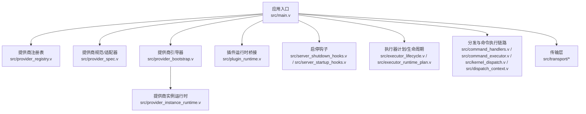
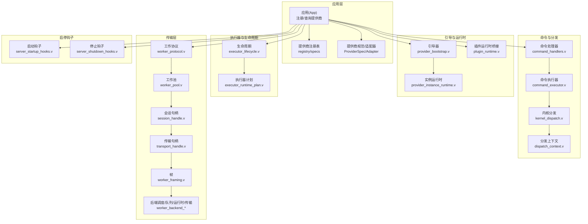
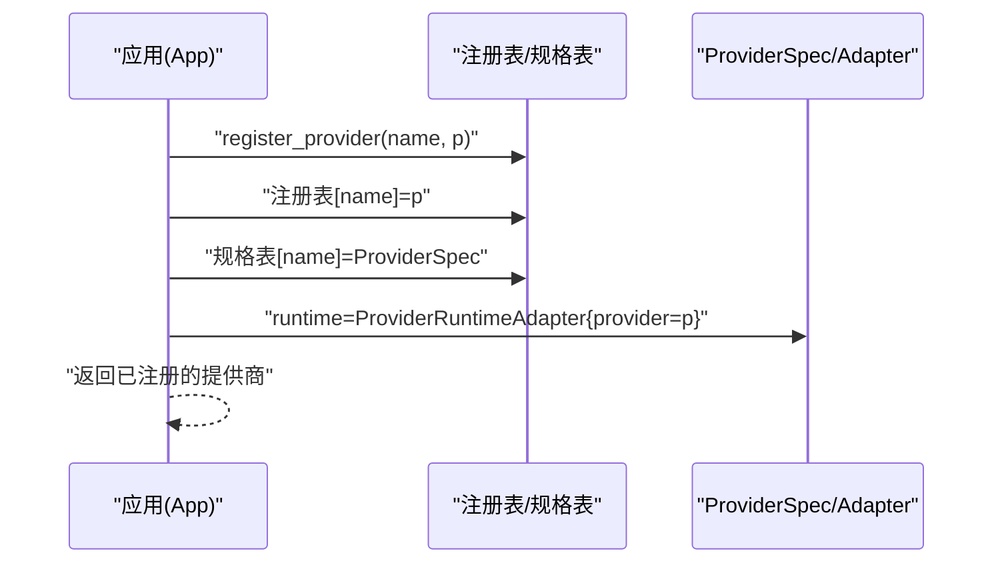
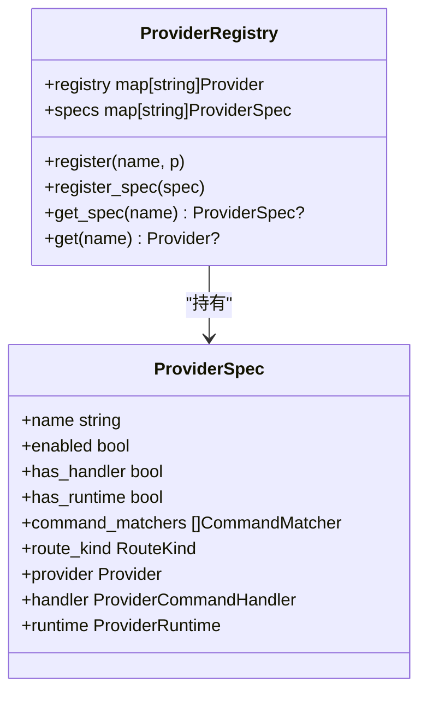
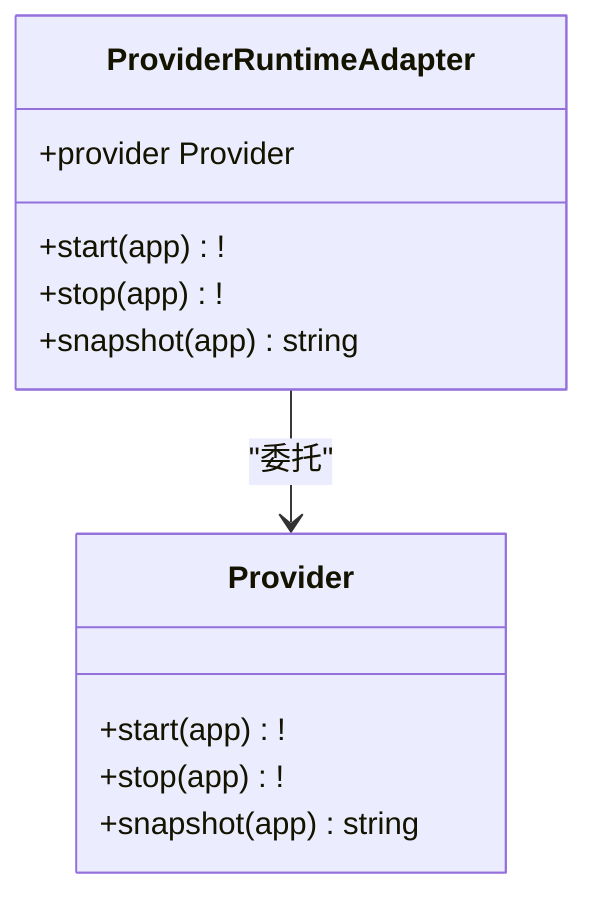
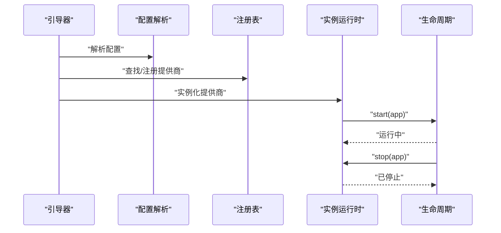
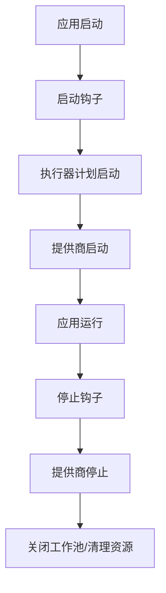
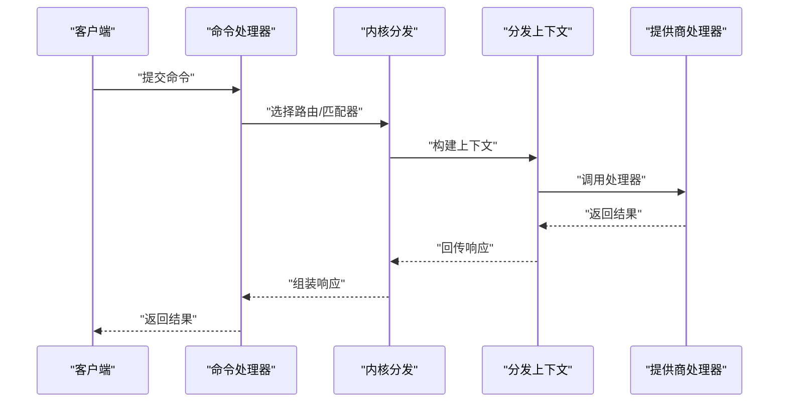
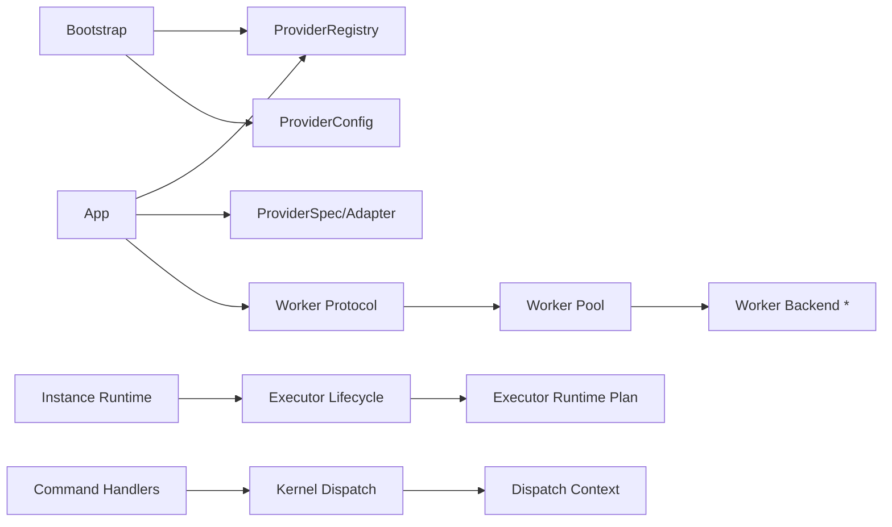

# 插件系统

<cite>
**本文引用的文件**
- [src/main.v](file://src/main.v)
- [src/provider_registry.v](file://src/provider_registry.v)
- [src/provider_registry_test.v](file://src/provider_registry_test.v)
- [src/provider_spec.v](file://src/provider_spec.v)
- [src/provider_config.v](file://src/provider_config.v)
- [src/provider_bootstrap.v](file://src/provider_bootstrap.v)
- [src/provider_bootstrap_test.v](file://src/provider_bootstrap_test.v)
- [src/provider_instance_runtime.v](file://src/provider_instance_runtime.v)
- [src/plugin_runtime.v](file://src/plugin_runtime.v)
- [src/server_shutdown_hooks.v](file://src/server_shutdown_hooks.v)
- [src/server_startup_hooks.v](file://src/server_startup_hooks.v)
- [src/app_runtime_builder.v](file://src/app_runtime_builder.v)
- [src/multi_server_runtime_orchestrator.v](file://src/multi_server_runtime_orchestrator.v)
- [src/server_runtime_orchestrator.v](file://src/server_runtime_orchestrator.v)
- [src/server_runtime_config.v](file://src/server_runtime_config.v)
- [src/executor_lifecycle.v](file://src/executor_lifecycle.v)
- [src/executor_runtime_plan.v](file://src/executor_runtime_plan.v)
- [src/executor_spec.v](file://src/executor_spec.v)
- [src/command_handlers.v](file://src/command_handlers.v)
- [src/command_executor.v](file://src/command_executor.v)
- [src/kernel_dispatch.v](file://src/kernel_dispatch.v)
- [src/dispatch_context.v](file://src/dispatch_context.v)
- [src/transport/worker_protocol.v](file://src/transport/worker_protocol.v)
- [src/transport/worker_pool.v](file://src/transport/worker_pool.v)
- [src/transport/session_handle.v](file://src/transport/session_handle.v)
- [src/transport/transport_handle.v](file://src/transport/transport_handle.v)
- [src/transport/worker_framing.v](file://src/transport/worker_framing.v)
- [src/transport/worker_backend_dispatch.v](file://src/transport/worker_backend_dispatch.v)
- [src/transport/worker_backend_pool.v](file://src/transport/worker_backend_pool.v)
- [src/transport/worker_backend_queue.v](file://src/transport/worker_backend_queue.v)
- [src/transport/worker_backend_runtime.v](file://src/transport/worker_backend_runtime.v)
- [src/transport/worker_backend_transport.v](file://src/transport/worker_backend_transport.v)
- [src/transport/worker_backend_dispatch.v](file://src/transport/worker_backend_dispatch.v)
- [src/transport/worker_backend_pool.v](file://src/transport/worker_backend_pool.v)
- [src/transport/worker_backend_queue.v](file://src/transport/worker_backend_queue.v)
- [src/transport/worker_backend_runtime.v](file://src/transport/worker_backend_runtime.v)
- [src/transport/worker_backend_transport.v](file://src/transport/worker_backend_transport.v)
- [src/transport/worker_backend_dispatch.v](file://src/transport/worker_backend_dispatch.v)
- [src/transport/worker_backend_pool.v](file://src/transport/worker_backend_pool.v)
- [src/transport/worker_backend_queue.v](file://src/transport/worker_backend_queue.v)
- [src/transport/worker_backend_runtime.v](file://src/transport/worker_backend_runtime.v)
- [src/transport/worker_backend_transport.v](file://src/transport/worker_backend_transport.v)
- [src/transport/worker_backend_dispatch.v](file://src/transport/worker_backend_dispatch.v)
- [src/transport/worker_backend_pool.v](file://src/transport/worker_backend_pool.v)
- [src/transport/worker_backend_queue.v](file://src/transport/worker_backend_queue.v)
- [src/transport/worker_backend_runtime.v](file://src/transport/worker_backend_runtime.v)
- [src/transport/worker_backend_transport.v](file://src/transport/worker_backend_transport.v)
- [src/transport/worker_backend_dispatch.v](file://src/transport/worker_backend_dispatch.v)
- [src/transport/worker_backend_pool.v](file://src/transport/worker_backend_pool.v)
- [src/transport/worker_backend_queue.v](file://src/transport/worker_backend_queue.v)
- [src/transport/worker_backend_runtime.v](file://src/transport/worker_backend_runtime.v)
- [src/transport/worker_backend_transport.v](file://src/transport/worker_backend_transport.v)
- [src/transport/worker_backend_dispatch.v](file://src/transport/worker_backend_dispatch.v)
- [src/transport/worker_backend_pool.v](file://src/transport/worker_backend_pool.v)
- [src/transport/worker_backend_queue.v](file://src/transport/worker_backend_queue.v)
- [src/transport/worker_backend_runtime.v](file://src/transport/worker_backend_runtime.v)
- [src/transport/worker_backend_transport.v](file://src/transport/worker_backend_transport.v)
- [src/transport/worker_backend_dispatch.v](file://src/transport/worker_backend_dispatch.v)
- [src/transport/worker_backend_pool.v](file://src/transport/worker_backend_pool.v)
- [src/transport/worker_backend_queue.v](file://src/transport/worker_backend_queue.v)
- [......]
</cite>

## 目录
1. [引言](#引言)
2. [项目结构](#项目结构)
3. [核心组件](#核心组件)
4. [架构总览](#架构总览)
5. [详细组件分析](#详细组件分析)
6. [依赖关系分析](#依赖关系分析)
7. [性能考量](#性能考量)
8. [故障排查指南](#故障排查指南)
9. [结论](#结论)
10. [附录：插件开发指南](#附录插件开发指南)

## 引言
本文件系统性阐述 vhttpd 的插件系统设计与实现，覆盖插件注册、发现与生命周期管理；提供商（Provider）注册表的实现细节（类型识别、配置校验、动态加载）；提供商规范（ProviderSpec）的定义与标准化接口；插件引导程序（Bootstrap）的初始化流程、依赖注入与错误处理；并提供从接口定义到部署发布的完整开发指南与自定义提供商实现示例。

## 项目结构
vhttpd 将“插件”抽象为“提供商（Provider）”，通过统一的 Provider 接口与 ProviderSpec 规范进行注册与管理，并在应用启动/停止阶段由引导器与执行器计划协调完成动态加载与生命周期控制。关键模块分布如下：
- 应用入口与全局状态：src/main.v
- 提供商注册与查询：src/provider_registry.v
- 提供商规范与适配器：src/provider_spec.v
- 提供商配置解析：src/provider_config.v
- 提供商引导与实例化：src/provider_bootstrap.v
- 提供商实例运行时：src/provider_instance_runtime.v
- 插件运行时桥接：src/plugin_runtime.v
- 启停钩子与优雅关闭：src/server_shutdown_hooks.v, src/server_startup_hooks.v
- 执行器生命周期与计划：src/executor_lifecycle.v, src/executor_runtime_plan.v
- 分发与命令执行链路：src/command_handlers.v, src/command_executor.v, src/kernel_dispatch.v, src/dispatch_context.v
- 传输层与工作池：src/transport/*（会话、帧、传输、后端调度与队列）

图表来源
- [src/main.v:1046-1102](file://src/main.v#L1046-L1102)
- [src/provider_registry.v](file://src/provider_registry.v)
- [src/provider_spec.v:161-196](file://src/provider_spec.v#L161-L196)
- [src/provider_bootstrap.v](file://src/provider_bootstrap.v)
- [src/provider_instance_runtime.v](file://src/provider_instance_runtime.v)
- [src/plugin_runtime.v](file://src/plugin_runtime.v)
- [src/server_shutdown_hooks.v:1-16](file://src/server_shutdown_hooks.v#L1-L16)
- [src/server_startup_hooks.v](file://src/server_startup_hooks.v)
- [src/executor_lifecycle.v](file://src/executor_lifecycle.v)
- [src/executor_runtime_plan.v](file://src/executor_runtime_plan.v)
- [src/command_handlers.v](file://src/command_handlers.v)
- [src/command_executor.v](file://src/command_executor.v)
- [src/kernel_dispatch.v](file://src/kernel_dispatch.v)
- [src/dispatch_context.v](file://src/dispatch_context.v)
- [src/transport/worker_protocol.v](file://src/transport/worker_protocol.v)
- [src/transport/worker_pool.v](file://src/transport/worker_pool.v)
- [src/transport/session_handle.v](file://src/transport/session_handle.v)
- [src/transport/transport_handle.v](file://src/transport/transport_handle.v)
- [src/transport/worker_framing.v](file://src/transport/worker_framing.v)
- [src/transport/worker_backend_dispatch.v](file://src/transport/worker_backend_dispatch.v)
- [src/transport/worker_backend_pool.v](file://src/transport/worker_backend_pool.v)
- [src/transport/worker_backend_queue.v](file://src/transport/worker_backend_queue.v)
- [src/transport/worker_backend_runtime.v](file://src/transport/worker_backend_runtime.v)
- [src/transport/worker_backend_transport.v](file://src/transport/worker_backend_transport.v)

章节来源
- [src/main.v:1046-1102](file://src/main.v#L1046-L1102)
- [src/provider_registry.v](file://src/provider_registry.v)
- [src/provider_spec.v:161-196](file://src/provider_spec.v#L161-L196)
- [src/provider_bootstrap.v](file://src/provider_bootstrap.v)
- [src/provider_instance_runtime.v](file://src/provider_instance_runtime.v)
- [src/plugin_runtime.v](file://src/plugin_runtime.v)
- [src/server_shutdown_hooks.v:1-16](file://src/server_shutdown_hooks.v#L1-L16)
- [src/server_startup_hooks.v](file://src/server_startup_hooks.v)
- [src/executor_lifecycle.v](file://src/executor_lifecycle.v)
- [src/executor_runtime_plan.v](file://src/executor_runtime_plan.v)
- [src/command_handlers.v](file://src/command_handlers.v)
- [src/command_executor.v](file://src/command_executor.v)
- [src/kernel_dispatch.v](file://src/kernel_dispatch.v)
- [src/dispatch_context.v](file://src/dispatch_context.v)
- [src/transport/worker_protocol.v](file://src/transport/worker_protocol.v)
- [src/transport/worker_pool.v](file://src/transport/worker_pool.v)
- [src/transport/session_handle.v](file://src/transport/session_handle.v)
- [src/transport/transport_handle.v](file://src/transport/transport_handle.v)
- [src/transport/worker_framing.v](file://src/transport/worker_framing.v)
- [src/transport/worker_backend_dispatch.v](file://src/transport/worker_backend_dispatch.v)
- [src/transport/worker_backend_pool.v](file://src/transport/worker_backend_pool.v)
- [src/transport/worker_backend_queue.v](file://src/transport/worker_backend_queue.v)
- [src/transport/worker_backend_runtime.v](file://src/transport/worker_backend_runtime.v)
- [src/transport/worker_backend_transport.v](file://src/transport/worker_backend_transport.v)

## 核心组件
- 应用级提供商注册与查询：在应用对象中维护提供商注册表与规格表，提供线程安全的注册、查询与获取能力。
- 提供商规范与适配器：定义 Provider 接口与 ProviderSpec 结构，提供可选运行时钩子的适配器，确保向后兼容。
- 配置解析与校验：提供提供商配置的解析与验证逻辑，支持多环境与多服务器场景。
- 引导器与实例运行时：负责提供商的动态加载、实例化、生命周期启动与停止。
- 插件运行时桥接：在现有插件运行时与新的提供商体系之间建立桥接，平滑过渡。
- 启停钩子：在服务停止阶段统一触发提供商的优雅关闭与资源清理。
- 执行器生命周期与计划：通过执行器计划协调提供商的生命周期与应用整体生命周期。
- 命令分发与执行链路：将命令路由至对应提供商处理器，形成闭环。
- 传输层：承载会话、帧、传输与后端调度，为提供商提供网络与并发基础设施。

章节来源
- [src/main.v:1046-1102](file://src/main.v#L1046-L1102)
- [src/provider_spec.v:161-196](file://src/provider_spec.v#L161-L196)
- [src/provider_config.v](file://src/provider_config.v)
- [src/provider_bootstrap.v](file://src/provider_bootstrap.v)
- [src/provider_instance_runtime.v](file://src/provider_instance_runtime.v)
- [src/plugin_runtime.v](file://src/plugin_runtime.v)
- [src/server_shutdown_hooks.v:1-16](file://src/server_shutdown_hooks.v#L1-L16)
- [src/executor_lifecycle.v](file://src/executor_lifecycle.v)
- [src/executor_runtime_plan.v](file://src/executor_runtime_plan.v)
- [src/command_handlers.v](file://src/command_handlers.v)
- [src/command_executor.v](file://src/command_executor.v)
- [src/kernel_dispatch.v](file://src/kernel_dispatch.v)
- [src/dispatch_context.v](file://src/dispatch_context.v)
- [src/transport/worker_protocol.v](file://src/transport/worker_protocol.v)
- [src/transport/worker_pool.v](file://src/transport/worker_pool.v)
- [src/transport/session_handle.v](file://src/transport/session_handle.v)
- [src/transport/transport_handle.v](file://src/transport/transport_handle.v)
- [src/transport/worker_framing.v](file://src/transport/worker_framing.v)
- [src/transport/worker_backend_dispatch.v](file://src/transport/worker_backend_dispatch.v)
- [src/transport/worker_backend_pool.v](file://src/transport/worker_backend_pool.v)
- [src/transport/worker_backend_queue.v](file://src/transport/worker_backend_queue.v)
- [src/transport/worker_backend_runtime.v](file://src/transport/worker_backend_runtime.v)
- [src/transport/worker_backend_transport.v](file://src/transport/worker_backend_transport.v)

## 架构总览
下图展示 vhttpd 插件系统的高层架构：应用入口负责注册与查询提供商；引导器负责动态加载与实例化；执行器计划协调生命周期；传输层提供并发与网络能力；启停钩子保障优雅关闭。

图表来源
- [src/main.v:1046-1102](file://src/main.v#L1046-L1102)
- [src/provider_registry.v](file://src/provider_registry.v)
- [src/provider_spec.v:161-196](file://src/provider_spec.v#L161-L196)
- [src/provider_bootstrap.v](file://src/provider_bootstrap.v)
- [src/provider_instance_runtime.v](file://src/provider_instance_runtime.v)
- [src/plugin_runtime.v](file://src/plugin_runtime.v)
- [src/executor_lifecycle.v](file://src/executor_lifecycle.v)
- [src/executor_runtime_plan.v](file://src/executor_runtime_plan.v)
- [src/command_handlers.v](file://src/command_handlers.v)
- [src/command_executor.v](file://src/command_executor.v)
- [src/kernel_dispatch.v](file://src/kernel_dispatch.v)
- [src/dispatch_context.v](file://src/dispatch_context.v)
- [src/transport/worker_protocol.v](file://src/transport/worker_protocol.v)
- [src/transport/worker_pool.v](file://src/transport/worker_pool.v)
- [src/transport/session_handle.v](file://src/transport/session_handle.v)
- [src/transport/transport_handle.v](file://src/transport/transport_handle.v)
- [src/transport/worker_framing.v](file://src/transport/worker_framing.v)
- [src/transport/worker_backend_dispatch.v](file://src/transport/worker_backend_dispatch.v)
- [src/transport/worker_backend_pool.v](file://src/transport/worker_backend_pool.v)
- [src/transport/worker_backend_queue.v](file://src/transport/worker_backend_queue.v)
- [src/transport/worker_backend_runtime.v](file://src/transport/worker_backend_runtime.v)
- [src/transport/worker_backend_transport.v](file://src/transport/worker_backend_transport.v)
- [src/server_startup_hooks.v](file://src/server_startup_hooks.v)
- [src/server_shutdown_hooks.v:1-16](file://src/server_shutdown_hooks.v#L1-L16)

## 详细组件分析

### 提供商注册与查询（App 层）
- 注册：应用在注册提供商时，同时写入注册表与规格表，并默认填充基础规格信息（启用状态、无处理器、通用路由等），并以适配器包装现有 Provider 实例以便运行时钩子可选实现。
- 查询：提供按名称获取规格与提供商实例的安全访问方法，内部使用互斥锁保护并发安全。

图表来源
- [src/main.v:1046-1102](file://src/main.v#L1046-L1102)
- [src/provider_spec.v:179-196](file://src/provider_spec.v#L179-L196)

章节来源
- [src/main.v:1046-1102](file://src/main.v#L1046-L1102)
- [src/provider_spec.v:161-196](file://src/provider_spec.v#L161-L196)

### 提供商注册表（Registry）
- 职责：集中管理提供商实例与规格，支持并发安全的注册、更新与查询。
- 设计要点：双映射（注册表与规格表）分离存储，避免重复计算与竞态条件；规格表用于对外暴露能力与路由决策。

图表来源
- [src/provider_registry.v](file://src/provider_registry.v)
- [src/provider_spec.v:161-196](file://src/provider_spec.v#L161-L196)

章节来源
- [src/provider_registry.v](file://src/provider_registry.v)
- [src/provider_registry_test.v](file://src/provider_registry_test.v)
- [src/provider_spec.v:161-196](file://src/provider_spec.v#L161-L196)

### 提供商规范与适配器（ProviderSpec/Adapter）
- Provider 接口：定义 start/stop/snapshot 等生命周期钩子，允许部分实现。
- ProviderRuntimeAdapter：对现有 Provider 进行适配，使运行时钩子成为可选实现，避免破坏既有 Provider。

图表来源
- [src/provider_spec.v:161-196](file://src/provider_spec.v#L161-L196)

章节来源
- [src/provider_spec.v:161-196](file://src/provider_spec.v#L161-L196)

### 配置解析与校验（ProviderConfig）
- 负责从配置源解析提供商参数，进行类型与字段校验，生成标准化的 ProviderSpec。
- 支持多服务器/多环境场景下的差异化配置合并与覆盖。

章节来源
- [src/provider_config.v](file://src/provider_config.v)

### 引导器与实例运行时（Bootstrap/Runtime）
- 引导器：根据配置与注册表，动态加载提供商并实例化，注入必要的依赖（如 App、日志、传输层句柄等）。
- 实例运行时：封装提供商的生命周期管理，调用 start/stop/snapshot，并与执行器计划协同。

图表来源
- [src/provider_bootstrap.v](file://src/provider_bootstrap.v)
- [src/provider_instance_runtime.v](file://src/provider_instance_runtime.v)
- [src/executor_lifecycle.v](file://src/executor_lifecycle.v)
- [src/executor_runtime_plan.v](file://src/executor_runtime_plan.v)

章节来源
- [src/provider_bootstrap.v](file://src/provider_bootstrap.v)
- [src/provider_instance_runtime.v](file://src/provider_instance_runtime.v)
- [src/executor_lifecycle.v](file://src/executor_lifecycle.v)
- [src/executor_runtime_plan.v](file://src/executor_runtime_plan.v)

### 插件运行时桥接（Plugin Runtime Bridge）
- 在现有插件运行时与新的提供商体系之间建立桥接，确保旧有插件能够在新架构下继续工作，逐步迁移。

章节来源
- [src/plugin_runtime.v](file://src/plugin_runtime.v)

### 启停钩子与优雅关闭（Startup/Shutdown Hooks）
- 启动钩子：在应用启动阶段触发执行器计划与提供商初始化。
- 停止钩子：在应用停止阶段统一触发提供商优雅关闭、关闭工作池与清理内部资源。

图表来源
- [src/server_startup_hooks.v](file://src/server_startup_hooks.v)
- [src/server_shutdown_hooks.v:1-16](file://src/server_shutdown_hooks.v#L1-L16)
- [src/executor_lifecycle.v](file://src/executor_lifecycle.v)
- [src/executor_runtime_plan.v](file://src/executor_runtime_plan.v)

章节来源
- [src/server_shutdown_hooks.v:1-16](file://src/server_shutdown_hooks.v#L1-L16)
- [src/server_startup_hooks.v](file://src/server_startup_hooks.v)
- [src/executor_lifecycle.v](file://src/executor_lifecycle.v)
- [src/executor_runtime_plan.v](file://src/executor_runtime_plan.v)

### 命令分发与执行链路
- 命令处理器：根据 ProviderSpec 中的匹配器与路由规则，将命令分发给对应的提供商处理器。
- 内核分发与上下文：在分发过程中维护上下文，保证请求的完整性与可追踪性。

图表来源
- [src/command_handlers.v](file://src/command_handlers.v)
- [src/command_executor.v](file://src/command_executor.v)
- [src/kernel_dispatch.v](file://src/kernel_dispatch.v)
- [src/dispatch_context.v](file://src/dispatch_context.v)

章节来源
- [src/command_handlers.v](file://src/command_handlers.v)
- [src/command_executor.v](file://src/command_executor.v)
- [src/kernel_dispatch.v](file://src/kernel_dispatch.v)
- [src/dispatch_context.v](file://src/dispatch_context.v)

### 传输层与并发支撑
- 工作协议、工作池、会话句柄、传输句柄与帧处理构成传输层基础设施，为提供商提供稳定的并发与网络能力。
- 后端调度、队列、运行时与传输模块共同支撑大规模并发请求的分发与处理。

章节来源
- [src/transport/worker_protocol.v](file://src/transport/worker_protocol.v)
- [src/transport/worker_pool.v](file://src/transport/worker_pool.v)
- [src/transport/session_handle.v](file://src/transport/session_handle.v)
- [src/transport/transport_handle.v](file://src/transport/transport_handle.v)
- [src/transport/worker_framing.v](file://src/transport/worker_framing.v)
- [src/transport/worker_backend_dispatch.v](file://src/transport/worker_backend_dispatch.v)
- [src/transport/worker_backend_pool.v](file://src/transport/worker_backend_pool.v)
- [src/transport/worker_backend_queue.v](file://src/transport/worker_backend_queue.v)
- [src/transport/worker_backend_runtime.v](file://src/transport/worker_backend_runtime.v)
- [src/transport/worker_backend_transport.v](file://src/transport/worker_backend_transport.v)

## 依赖关系分析
- 组件耦合：App 对 ProviderRegistry 与 ProviderSpec 具有强依赖；引导器依赖配置解析与注册表；执行器计划依赖生命周期模块；命令链路依赖分发与上下文；传输层为上层提供基础设施。
- 并发与一致性：App 层通过互斥锁保护注册表与规格表的并发访问；ProviderRuntimeAdapter 降低 Provider 接口变更带来的破坏性影响。
- 可能的循环依赖：当前结构以 App 为中心向外辐射，未见明显循环依赖迹象；若未来引入跨模块回调需谨慎设计。

图表来源
- [src/main.v:1046-1102](file://src/main.v#L1046-L1102)
- [src/provider_registry.v](file://src/provider_registry.v)
- [src/provider_spec.v:161-196](file://src/provider_spec.v#L161-L196)
- [src/provider_bootstrap.v](file://src/provider_bootstrap.v)
- [src/provider_config.v](file://src/provider_config.v)
- [src/provider_instance_runtime.v](file://src/provider_instance_runtime.v)
- [src/executor_lifecycle.v](file://src/executor_lifecycle.v)
- [src/executor_runtime_plan.v](file://src/executor_runtime_plan.v)
- [src/command_handlers.v](file://src/command_handlers.v)
- [src/kernel_dispatch.v](file://src/kernel_dispatch.v)
- [src/dispatch_context.v](file://src/dispatch_context.v)
- [src/transport/worker_protocol.v](file://src/transport/worker_protocol.v)
- [src/transport/worker_pool.v](file://src/transport/worker_pool.v)
- [src/transport/worker_backend_dispatch.v](file://src/transport/worker_backend_dispatch.v)

章节来源
- [src/main.v:1046-1102](file://src/main.v#L1046-L1102)
- [src/provider_registry.v](file://src/provider_registry.v)
- [src/provider_spec.v:161-196](file://src/provider_spec.v#L161-L196)
- [src/provider_bootstrap.v](file://src/provider_bootstrap.v)
- [src/provider_config.v](file://src/provider_config.v)
- [src/provider_instance_runtime.v](file://src/provider_instance_runtime.v)
- [src/executor_lifecycle.v](file://src/executor_lifecycle.v)
- [src/executor_runtime_plan.v](file://src/executor_runtime_plan.v)
- [src/command_handlers.v](file://src/command_handlers.v)
- [src/kernel_dispatch.v](file://src/kernel_dispatch.v)
- [src/dispatch_context.v](file://src/dispatch_context.v)
- [src/transport/worker_protocol.v](file://src/transport/worker_protocol.v)
- [src/transport/worker_pool.v](file://src/transport/worker_pool.v)
- [src/transport/worker_backend_dispatch.v](file://src/transport/worker_backend_dispatch.v)

## 性能考量
- 并发安全：注册与查询操作通过互斥锁保护，避免高并发下的数据竞争；建议在高频查询路径中尽量减少锁持有时间。
- 生命周期开销：ProviderRuntimeAdapter 为可选钩子提供了零开销适配；实际 Provider 的 start/stop/snapshot 应保持轻量，避免阻塞主循环。
- 传输层优化：合理设置工作池大小与后端队列长度，结合负载特征调整帧大小与会话复用策略，减少上下文切换与内存拷贝。
- 配置解析：在启动阶段一次性完成配置解析与校验，避免运行时频繁 IO 或解析。

## 故障排查指南
- 注册失败或查询为空：检查 App.register_provider 是否正确调用，确认规格表初始化与并发锁是否正常释放。
- Provider 未启动或异常退出：检查 ProviderRuntimeAdapter 的 start/stop 实现，确认执行器计划与生命周期模块是否正确调用。
- 命令无法分发：核查 ProviderSpec 中的命令匹配器与路由规则，确认命令处理器与内核分发逻辑一致。
- 优雅关闭失败：检查停止钩子是否调用了关闭工作池与清理内部资源，确保所有 Provider 均被停止。
- 传输层异常：检查工作协议、会话句柄与传输句柄的状态，定位后端调度与队列瓶颈。

章节来源
- [src/main.v:1046-1102](file://src/main.v#L1046-L1102)
- [src/server_shutdown_hooks.v:1-16](file://src/server_shutdown_hooks.v#L1-L16)
- [src/command_handlers.v](file://src/command_handlers.v)
- [src/kernel_dispatch.v](file://src/kernel_dispatch.v)
- [src/transport/worker_protocol.v](file://src/transport/worker_protocol.v)
- [src/transport/worker_pool.v](file://src/transport/worker_pool.v)
- [src/transport/worker_backend_dispatch.v](file://src/transport/worker_backend_dispatch.v)

## 结论
vhttpd 的插件系统以 Provider 为核心，通过 ProviderSpec 规范化接口，配合注册表、引导器、执行器计划与传输层基础设施，实现了可扩展、可演进、可监控的插件生态。借助 ProviderRuntimeAdapter 与桥接模块，系统在不破坏既有实现的前提下平滑过渡到新的提供商体系，为插件开发者提供了清晰的扩展路径与完善的生命周期管理。

## 附录：插件开发指南

### 一、接口定义与规范
- 定义 Provider 接口：至少包含 start/stop/snapshot 方法；如需更细粒度控制，可在适配器基础上扩展。
- 定义 ProviderSpec：明确提供商名称、启用状态、是否具备处理器/运行时、命令匹配器与路由类型等元数据。
- 使用 ProviderRuntimeAdapter：若 Provider 未实现全部运行时钩子，可通过适配器自动转发到现有实现。

章节来源
- [src/provider_spec.v:161-196](file://src/provider_spec.v#L161-L196)

### 二、配置格式与校验
- 配置项建议：提供商名称、启用开关、路由类型、命令匹配规则、运行时参数等。
- 校验策略：在 ProviderConfig 中进行类型与必填字段校验，支持多环境/多服务器差异化配置合并。

章节来源
- [src/provider_config.v](file://src/provider_config.v)

### 三、动态加载与实例化
- 引导流程：在引导器中解析配置、查找注册表、实例化 Provider，并注入 App/日志/传输句柄等依赖。
- 错误处理：捕获初始化异常并记录上下文，必要时回滚注册表与规格表状态。

章节来源
- [src/provider_bootstrap.v](file://src/provider_bootstrap.v)
- [src/provider_instance_runtime.v](file://src/provider_instance_runtime.v)

### 四、生命周期管理
- 启动：执行器计划调用 ProviderRuntimeAdapter.start，确保 Provider 初始化完成。
- 运行：Provider 处理命令与事件，通过传输层与外部交互。
- 停止：执行器计划调用 ProviderRuntimeAdapter.stop，确保资源释放与连接关闭。

章节来源
- [src/executor_lifecycle.v](file://src/executor_lifecycle.v)
- [src/executor_runtime_plan.v](file://src/executor_runtime_plan.v)
- [src/server_shutdown_hooks.v:1-16](file://src/server_shutdown_hooks.v#L1-L16)

### 五、命令分发与处理器
- 匹配器：在 ProviderSpec 中定义命令匹配器，确保命令能够准确路由到对应处理器。
- 处理器：实现 ProviderCommandHandler，处理请求并返回响应；在分发上下文中维护请求状态。

章节来源
- [src/command_handlers.v](file://src/command_handlers.v)
- [src/dispatch_context.v](file://src/dispatch_context.v)

### 六、传输层集成
- 会话与帧：通过会话句柄与帧处理模块与客户端建立稳定连接。
- 工作池与后端：利用工作池与后端调度模块提升并发处理能力。

章节来源
- [src/transport/session_handle.v](file://src/transport/session_handle.v)
- [src/transport/worker_framing.v](file://src/transport/worker_framing.v)
- [src/transport/worker_pool.v](file://src/transport/worker_pool.v)
- [src/transport/worker_backend_dispatch.v](file://src/transport/worker_backend_dispatch.v)

### 七、测试策略
- 单元测试：针对 Provider 的 start/stop/snapshot 与命令处理器进行独立测试。
- 集成测试：模拟引导器与执行器计划，验证提供商的完整生命周期。
- 端到端测试：通过命令链路与传输层验证插件在真实场景下的行为。

章节来源
- [src/provider_registry_test.v](file://src/provider_registry_test.v)
- [src/provider_bootstrap_test.v](file://src/provider_bootstrap_test.v)

### 八、部署与发布
- 构建产物：确保 Provider 编译为可加载模块，配置文件与二进制一起打包。
- 发布流程：在 CI 中执行单元/集成/端到端测试，通过后发布到制品库或镜像仓库。
- 运行时验证：在目标环境中启动应用，验证提供商注册、启动与停止流程。

章节来源
- [src/server_startup_hooks.v](file://src/server_startup_hooks.v)
- [src/server_shutdown_hooks.v:1-16](file://src/server_shutdown_hooks.v#L1-L16)