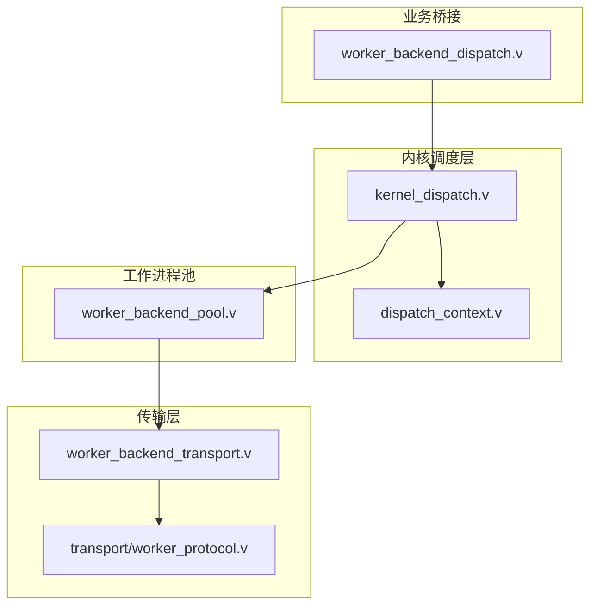
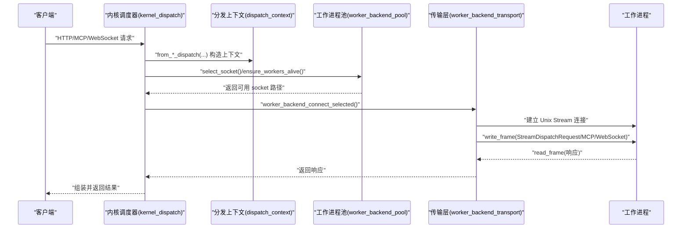
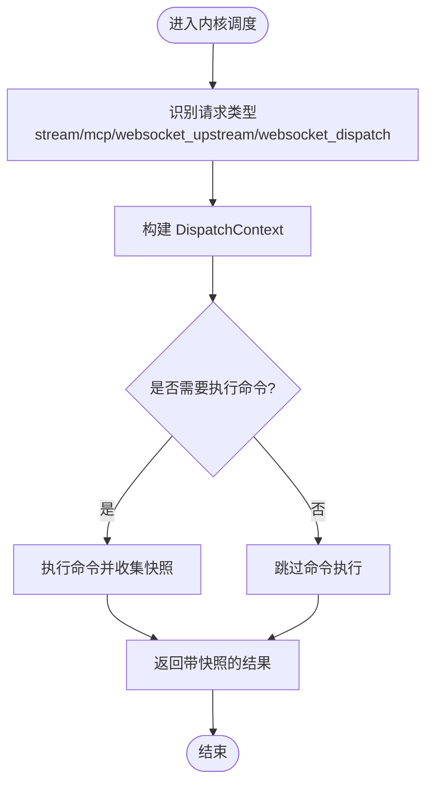
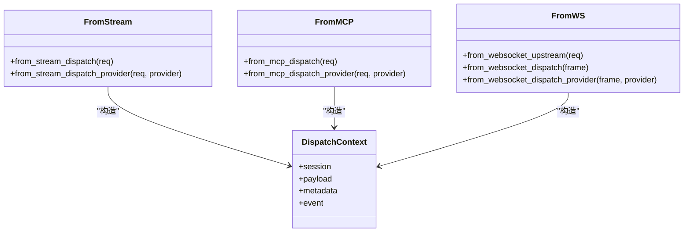
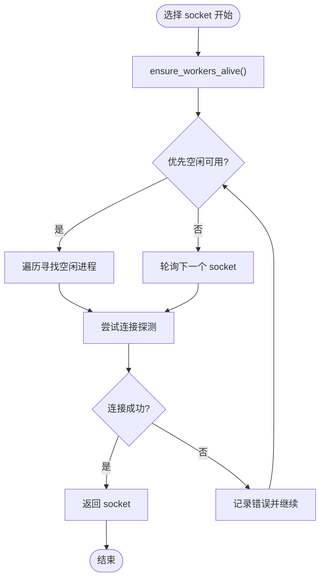
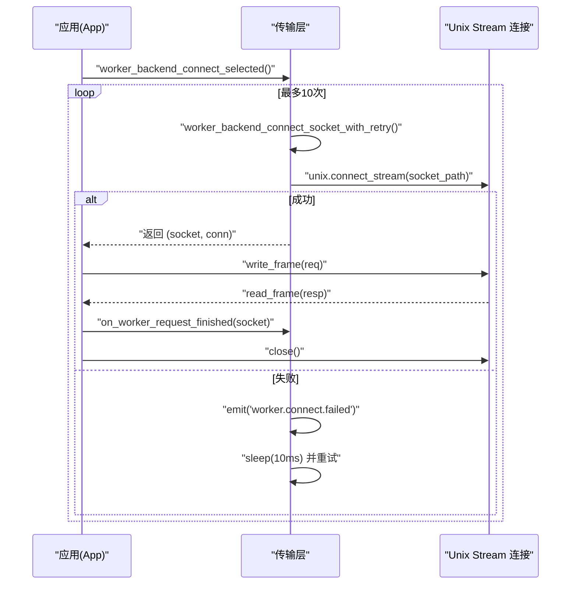
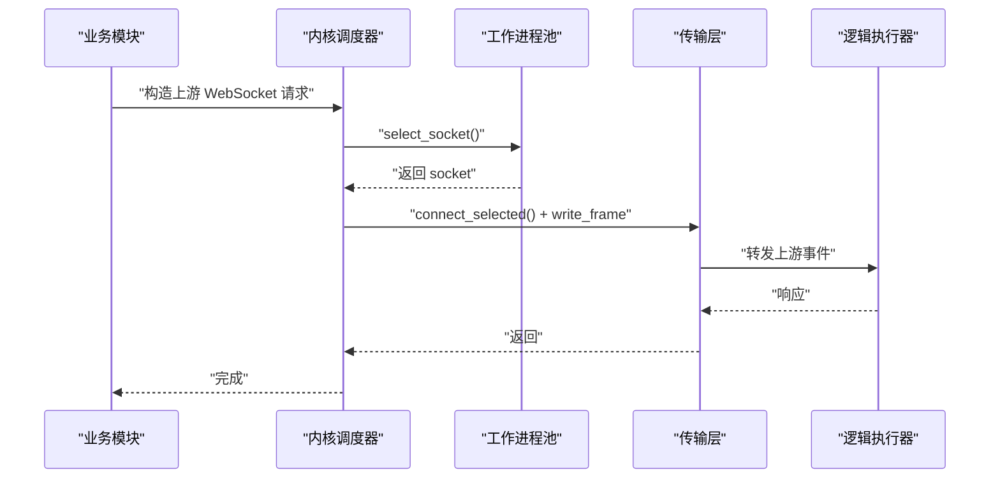
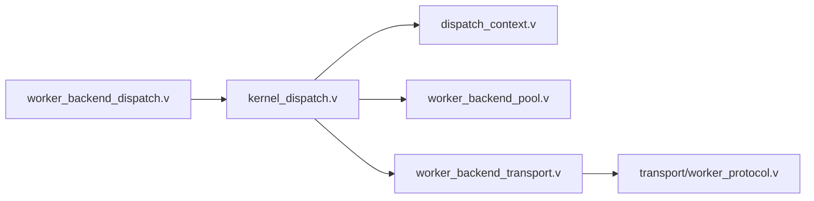

# 内核调度与请求分发系统

<cite>
**本文引用的文件**
- [kernel_dispatch.v](file://src/kernel_dispatch.v)
- [dispatch_context.v](file://src/dispatch_context.v)
- [worker_backend_pool.v](file://src/worker_backend_pool.v)
- [worker_backend_transport.v](file://src/worker_backend_transport.v)
- [worker_backend_dispatch.v](file://src/worker_backend_dispatch.v)
- [worker_protocol.v](file://src/transport/worker_protocol.v)
</cite>

## 目录
1. [引言](#引言)
2. [项目结构](#项目结构)
3. [核心组件](#核心组件)
4. [架构总览](#架构总览)
5. [详细组件分析](#详细组件分析)
6. [依赖关系分析](#依赖关系分析)
7. [性能考量](#性能考量)
8. [故障排查指南](#故障排查指南)
9. [结论](#结论)

## 引言
本文件面向系统架构师与性能工程师，系统性阐述 vhttpd 的内核调度与请求分发体系：从请求接收、协议识别、运行时选择到任务分发的完整链路；解析工作进程池（worker backend pool）的生命周期管理、负载均衡与资源分配策略；详解请求分发上下文（dispatch context）在不同运行时之间的传递与转换；并给出调度算法选择依据、并发控制、队列管理与错误重试机制的实践建议。

## 项目结构
围绕“内核调度与请求分发”的核心代码主要分布在以下模块：
- 内核调度入口与分发封装：src/kernel_dispatch.v
- 分发上下文抽象与转换：src/dispatch_context.v
- 工作进程池与负载均衡：src/worker_backend_pool.v
- 工作进程通信与传输层：src/worker_backend_transport.v
- 针对特定场景的分发桥接：src/worker_backend_dispatch.v
- 传输协议数据结构定义：src/transport/worker_protocol.v

**图表来源**
- [kernel_dispatch.v:1-291](file://src/kernel_dispatch.v#L1-L291)
- [dispatch_context.v:1-65](file://src/dispatch_context.v#L1-L65)
- [worker_backend_pool.v:1-472](file://src/worker_backend_pool.v#L1-L472)
- [worker_backend_transport.v:120-166](file://src/worker_backend_transport.v#L120-L166)
- [worker_protocol.v:1-54](file://src/transport/worker_protocol.v#L1-L54)
- [worker_backend_dispatch.v:1-66](file://src/worker_backend_dispatch.v#L1-L66)

**章节来源**
- [kernel_dispatch.v:1-291](file://src/kernel_dispatch.v#L1-L291)
- [dispatch_context.v:1-65](file://src/dispatch_context.v#L1-L65)
- [worker_backend_pool.v:1-472](file://src/worker_backend_pool.v#L1-L472)
- [worker_backend_transport.v:120-166](file://src/worker_backend_transport.v#L120-L166)
- [worker_protocol.v:1-54](file://src/transport/worker_protocol.v#L1-L54)
- [worker_backend_dispatch.v:1-66](file://src/worker_backend_dispatch.v#L1-L66)

## 核心组件
- 内核调度器（Kernel Dispatcher）
  - 负责根据请求类型（流式 HTTP、MCP、WebSocket 上游/事件）构造分发信封与上下文，并委派给逻辑执行器或直接进行工作进程分发。
  - 提供统一的 open/next/close 流式分发接口与 MCP/WebSocket 分发请求构造器。
- 请求分发上下文（DispatchContext）
  - 将来自不同协议的数据（HTTP、MCP、WebSocket）抽象为统一的上下文对象，携带会话句柄、载荷与元数据，便于在不同运行时间传递。
- 工作进程池（Worker Backend Pool）
  - 管理工作进程生命周期、自动重启、最大请求数轮换、空闲探测与连接健康检查；提供轮询与“优先空闲”两种选择策略。
- 传输层（Worker Transport）
  - 建立与工作进程的 Unix Stream 连接，进行帧化读写与超时设置；封装分发调用与响应读取。
- 协议模型（Worker Protocol）
  - 定义流式分发请求/响应、WebSocket 帧、MCP 消息等数据结构，确保跨进程通信的一致性。

**章节来源**
- [kernel_dispatch.v:71-291](file://src/kernel_dispatch.v#L71-L291)
- [dispatch_context.v:5-65](file://src/dispatch_context.v#L5-L65)
- [worker_backend_pool.v:201-378](file://src/worker_backend_pool.v#L201-L378)
- [worker_backend_transport.v:120-166](file://src/worker_backend_transport.v#L120-L166)
- [worker_protocol.v:1-54](file://src/transport/worker_protocol.v#L1-L54)

## 架构总览
下图展示从请求进入内核到工作进程处理的端到端流程，以及上下文在各层的生成与传递。

**图表来源**
- [kernel_dispatch.v:71-180](file://src/kernel_dispatch.v#L71-L180)
- [dispatch_context.v:16-48](file://src/dispatch_context.v#L16-L48)
- [worker_backend_pool.v:301-378](file://src/worker_backend_pool.v#L301-L378)
- [worker_backend_transport.v:120-166](file://src/worker_backend_transport.v#L120-L166)

## 详细组件分析

### 内核调度器（Kernel Dispatcher）
职责与流程要点：
- 统一封装请求类型：支持流式 HTTP、MCP、WebSocket 上游与事件。
- 构造分发信封与上下文：将原始请求映射为统一的上下文对象，携带会话、载荷与元数据。
- 命令执行与快照：对于包含命令的响应，可执行命令并记录活动快照，便于可观测性与回溯。
- 失败分类：对传输失败进行分类，输出状态码与错误类别，便于上层处理。

**图表来源**
- [kernel_dispatch.v:43-115](file://src/kernel_dispatch.v#L43-L115)
- [kernel_dispatch.v:117-149](file://src/kernel_dispatch.v#L117-L149)

**章节来源**
- [kernel_dispatch.v:43-115](file://src/kernel_dispatch.v#L43-L115)
- [kernel_dispatch.v:117-149](file://src/kernel_dispatch.v#L117-L149)

### 请求分发上下文（DispatchContext）
设计目标：
- 在不同协议（HTTP、MCP、WebSocket）之间保持一致的上下文视图。
- 将会话句柄、载荷与元数据解耦，便于在逻辑执行器与工作进程之间传递。

实现要点：
- 从不同请求类型构造上下文：HTTP 使用 method/path/strategy/event；MCP 使用 http_method/path/protocol_version；WebSocket 使用 path/opcode 等。
- 元数据字段随协议而异，但均以键值形式承载，便于后续路由与追踪。

**图表来源**
- [dispatch_context.v:16-64](file://src/dispatch_context.v#L16-L64)

**章节来源**
- [dispatch_context.v:16-64](file://src/dispatch_context.v#L16-L64)

### 工作进程池（Worker Backend Pool）
管理机制与策略：
- 自动启动与健康检查：按配置自动拉起工作进程，等待其监听 UNIX Socket 并进行健康探测。
- 最大请求数轮换：单个工作进程服务达到上限后标记为“draining”，待在途请求完成后重启，实现平滑轮换。
- 负载均衡策略：
  - 轮询（round-robin）：通过内部索引 rr_index 实现均匀分布。
  - 优先空闲：在可用 socket 中优先选择“未在途且未 drain”的进程，提升吞吐与延迟表现。
- 错误重试与退避：进程退出后按指数退避策略延时重启，避免雪崩。
- 管理接口：支持按 ID 重启、批量重启、状态快照导出，便于运维与可观测性。

**图表来源**
- [worker_backend_pool.v:301-378](file://src/worker_backend_pool.v#L301-L378)
- [worker_backend_pool.v:201-241](file://src/worker_backend_pool.v#L201-L241)

**章节来源**
- [worker_backend_pool.v:21-72](file://src/worker_backend_pool.v#L21-L72)
- [worker_backend_pool.v:140-190](file://src/worker_backend_pool.v#L140-L190)
- [worker_backend_pool.v:201-241](file://src/worker_backend_pool.v#L201-L241)
- [worker_backend_pool.v:301-378](file://src/worker_backend_pool.v#L301-L378)

### 传输层（Worker Transport）
职责与特性：
- 连接建立：在多次重试与短暂退避后，尝试连接选定的 UNIX Socket。
- 超时控制：可按配置设置读超时，避免阻塞。
- 帧化通信：将请求/响应序列化为帧，保证边界清晰与可恢复。
- 生命周期钩子：在请求开始与结束时更新工作进程的在途计数，驱动池管理策略。

**图表来源**
- [worker_backend_transport.v:120-166](file://src/worker_backend_transport.v#L120-L166)

**章节来源**
- [worker_backend_transport.v:120-166](file://src/worker_backend_transport.v#L120-L166)

### 协议模型（Worker Protocol）
数据结构概览：
- WorkerResponse：工作进程通用响应载体（状态、头、体）。
- WorkerStreamFrame：流式帧（事件、状态、SSE 字段、错误信息等）。
- StreamDispatchRequest：内核向工作进程发起的流式请求（方法、路径、查询、头、状态等）。
- StreamDispatchChunk：分片传输辅助结构。

这些结构确保了跨进程通信的稳定性与一致性，是调度与分发的契约基础。

**章节来源**
- [worker_protocol.v:1-54](file://src/transport/worker_protocol.v#L1-L54)

### 业务桥接（示例：飞书消息通知）
当特定业务事件发生时（如消息发送/更新），系统通过上游 WebSocket 分发请求，将事件推送到逻辑执行器，实现端到端闭环。

**图表来源**
- [worker_backend_dispatch.v:15-35](file://src/worker_backend_dispatch.v#L15-L35)
- [kernel_dispatch.v:117-139](file://src/kernel_dispatch.v#L117-L139)

**章节来源**
- [worker_backend_dispatch.v:15-35](file://src/worker_backend_dispatch.v#L15-L35)
- [worker_backend_dispatch.v:45-65](file://src/worker_backend_dispatch.v#L45-L65)
- [kernel_dispatch.v:117-139](file://src/kernel_dispatch.v#L117-L139)

## 依赖关系分析
- 内核调度器依赖分发上下文进行协议无关的请求建模，并依赖工作进程池与传输层完成实际分发。
- 工作进程池与传输层共同构成“工作进程后端”，负责进程生命周期与通信可靠性。
- 协议模型作为契约被调度器与传输层共享，确保跨模块一致性。

**图表来源**
- [kernel_dispatch.v:1-291](file://src/kernel_dispatch.v#L1-L291)
- [dispatch_context.v:1-65](file://src/dispatch_context.v#L1-L65)
- [worker_backend_pool.v:1-472](file://src/worker_backend_pool.v#L1-L472)
- [worker_backend_transport.v:120-166](file://src/worker_backend_transport.v#L120-L166)
- [worker_protocol.v:1-54](file://src/transport/worker_protocol.v#L1-L54)
- [worker_backend_dispatch.v:1-66](file://src/worker_backend_dispatch.v#L1-L66)

**章节来源**
- [kernel_dispatch.v:1-291](file://src/kernel_dispatch.v#L1-L291)
- [worker_backend_pool.v:1-472](file://src/worker_backend_pool.v#L1-L472)
- [worker_backend_transport.v:120-166](file://src/worker_backend_transport.v#L120-L166)
- [worker_protocol.v:1-54](file://src/transport/worker_protocol.v#L1-L54)
- [worker_backend_dispatch.v:1-66](file://src/worker_backend_dispatch.v#L1-L66)

## 性能考量
- 选择策略
  - 优先空闲（next_idle_worker_socket）在高并发场景下能显著降低排队与抖动，适合低延迟要求。
  - 轮询（next_worker_socket）更均衡地摊销热点，适合长尾稳定型流量。
- 退避与重试
  - 指数退避减少重启风暴风险；合理设置最大退避时间，避免长时间不可用。
- 超时与资源
  - 读超时与连接探测结合，快速剔除异常进程，缩短故障恢复时间。
- 最大请求数轮换
  - 通过“draining + 在途清零”的组合，避免在途请求中断，同时实现无损轮换。
- 观测与诊断
  - 利用选择诊断接口输出进程存活、draining、在途数等指标，指导容量规划与限流策略。

[本节为通用性能建议，不直接分析具体文件]

## 故障排查指南
- 连接失败
  - 检查工作进程是否正常监听 UNIX Socket；查看传输层的连接失败事件与重试日志。
  - 参考：[worker_backend_transport.v:120-166](file://src/worker_backend_transport.v#L120-L166)
- 无可用工作进程
  - 查看“worker.select.failed”事件与诊断 JSON，定位全部在途、全部 drain 或进程非存活等问题。
  - 参考：[worker_backend_pool.v:301-378](file://src/worker_backend_pool.v#L301-L378)
- 进程异常退出
  - 关注“worker.restart_scheduled”事件，确认退避参数与重启次数；必要时手动重启或全量重启。
  - 参考：[worker_backend_pool.v:21-72](file://src/worker_backend_pool.v#L21-L72)
- 响应异常
  - 对于流式响应中的错误事件，使用失败分类函数提取状态码与错误类别，辅助上层降级。
  - 参考：[kernel_dispatch.v:80-88](file://src/kernel_dispatch.v#L80-L88)

**章节来源**
- [worker_backend_transport.v:120-166](file://src/worker_backend_transport.v#L120-L166)
- [worker_backend_pool.v:301-378](file://src/worker_backend_pool.v#L301-L378)
- [worker_backend_pool.v:21-72](file://src/worker_backend_pool.v#L21-L72)
- [kernel_dispatch.v:80-88](file://src/kernel_dispatch.v#L80-L88)

## 结论
vhttpd 的内核调度与请求分发体系以“协议无关的上下文 + 工作进程池 + 传输层”为核心，实现了高可靠、可扩展的多运行时分发能力。通过优先空闲选择、指数退避重启、最大请求数轮换与连接探测等机制，在保证稳定性的同时兼顾性能与可观测性。建议在生产环境中结合业务特征选择合适的调度策略，并配合完善的监控与告警体系，持续优化容量与延迟表现。