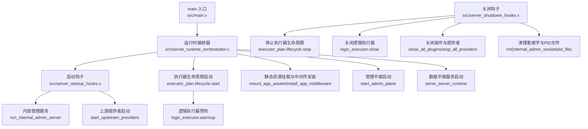
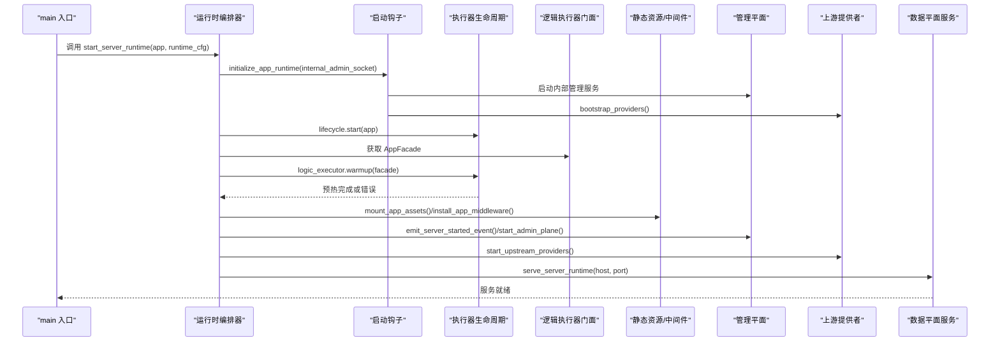
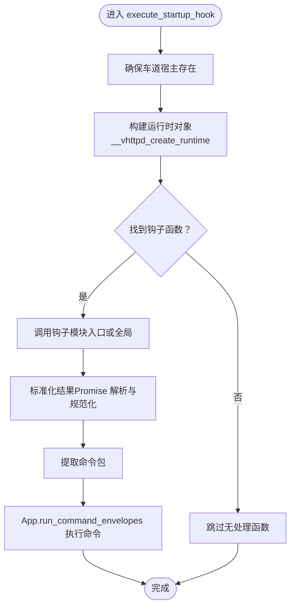
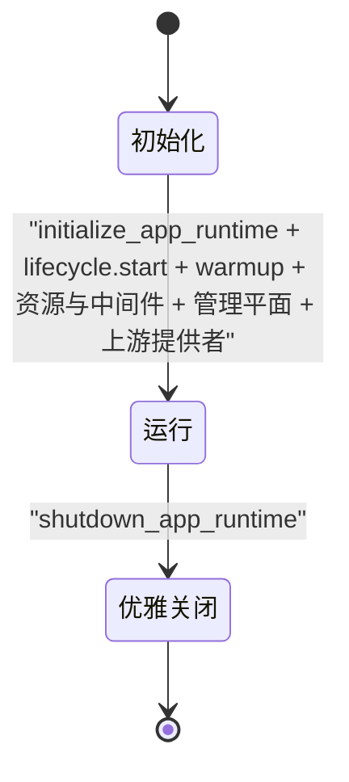
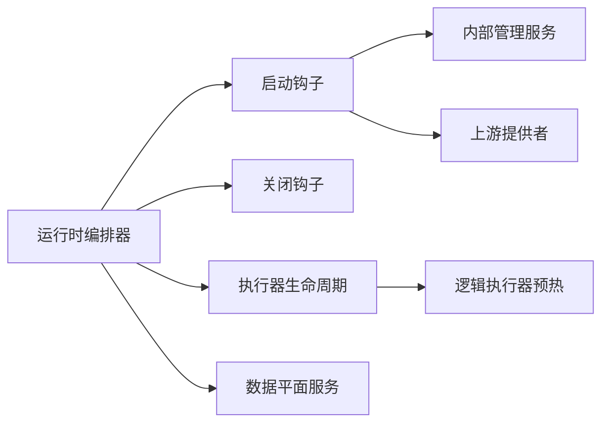

# 服务器启动与生命周期管理

<cite>
**本文引用的文件**
- [src/main.v](file://src/main.v)
- [src/server_runtime_orchestrator.v](file://src/server_runtime_orchestrator.v)
- [src/server_startup_hooks.v](file://src/server_startup_hooks.v)
- [src/server_shutdown_hooks.v](file://src/server_shutdown_hooks.v)
- [src/multi_server_runtime_orchestrator.v](file://src/multi_server_runtime_orchestrator.v)
- [src/executor/inproc_vjsx_executor.v](file://src/executor/inproc_vjsx_executor.v)
- [src/inproc_vjsx_http_facade.js](file://src/inproc_vjsx_http_facade.js)
- [src/worker_backend_pool.v](file://src/worker_backend_pool.v)
- [src/transport/worker_pool.v](file://src/transport/worker_pool.v)
- [src/server_logic_test.v](file://src/server_logic_test.v)
</cite>

## 目录
1. [引言](#引言)
2. [项目结构](#项目结构)
3. [核心组件](#核心组件)
4. [架构总览](#架构总览)
5. [详细组件分析](#详细组件分析)
6. [依赖关系分析](#依赖关系分析)
7. [性能考量](#性能考量)
8. [故障排查指南](#故障排查指南)
9. [结论](#结论)
10. [附录](#附录)

## 引言
本文件面向 vhttpd 的服务器启动与生命周期管理，系统性阐述从 main 入口到运行期各组件初始化、启动钩子（startup hooks）的执行时机与机制、生命周期状态转换（初始化、运行、优雅关闭）、服务器运行时编排器（server_runtime_orchestrator）的职责与实现，并提供启动失败诊断与常见问题解决方案，以及进程管理、信号处理与资源清理的最佳实践。

## 项目结构
围绕启动与生命周期的关键代码主要分布在以下模块：
- 运行时编排：负责按序初始化应用、启动执行器生命周期、挂载静态资源与中间件、启动管理平面与上游提供者、输出端点日志。
- 启动钩子：在应用初始化阶段注入内部管理服务、Feishu 卡片桥、数据库上游环境变量、启动上游提供者等。
- 关闭钩子：在停止阶段发出 server.stopped 事件、停止执行器生命周期、关闭逻辑执行器、关闭插件与所有上游提供者、清理内部管理套接字与 PID 文件。
- 多服务器编排：支持多监听器/站点的并行启动与优雅关闭。
- 执行器与启动钩子：内嵌 Vjsx 执行器通过 JS 全局函数暴露 app_startup 与 startup 钩子，支持命令式结果驱动的启动流程。
- 工作进程池：工作进程的自动拉起、重启退避策略与优雅停止。

图表来源
- [src/server_runtime_orchestrator.v:8-32](file://src/server_runtime_orchestrator.v#L8-L32)
- [src/server_startup_hooks.v:6-20](file://src/server_startup_hooks.v#L6-L20)
- [src/server_shutdown_hooks.v:5-16](file://src/server_shutdown_hooks.v#L5-L16)

章节来源
- [src/server_runtime_orchestrator.v:8-32](file://src/server_runtime_orchestrator.v#L8-L32)
- [src/server_startup_hooks.v:6-20](file://src/server_startup_hooks.v#L6-L20)
- [src/server_shutdown_hooks.v:5-16](file://src/server_shutdown_hooks.v#L5-L16)

## 核心组件
- App 结构体：承载事件日志、工作线程状态、内部管理套接字、插件配置、资产配置、MCP/OpenAI 状态、统计计数、WS Hub、上游提供者集合等。
- 运行时编排器：统一调度启动顺序，确保生命周期钩子与资源准备就绪后再对外提供服务。
- 启动钩子：设置内部管理套接字与上游环境变量、启动内部管理服务、Feishu 卡片桥、上游提供者；安装静态资源缓存控制中间件；发出 server.started 事件；启动管理平面；记录端点信息。
- 关闭钩子：发出 server.stopped 事件；停止执行器生命周期；关闭逻辑执行器；关闭插件与提供者；清理内部管理套接字与 PID 文件。
- 内嵌 Vjsx 执行器：通过 JS 全局函数 __vhttpd_startup_handle/__vhttpd_app_startup_handle 暴露启动钩子；支持命令式结果驱动的启动流程；提供 app_startup 与 startup 两类钩子。
- 工作进程池：自动拉起/重启工作进程，带指数退避与信号优雅停止。

章节来源
- [src/main.v:28-62](file://src/main.v#L28-L62)
- [src/server_runtime_orchestrator.v:8-32](file://src/server_runtime_orchestrator.v#L8-L32)
- [src/server_startup_hooks.v:6-20](file://src/server_startup_hooks.v#L6-L20)
- [src/server_shutdown_hooks.v:5-16](file://src/server_shutdown_hooks.v#L5-L16)
- [src/executor/inproc_vjsx_executor.v:4822-4925](file://src/executor/inproc_vjsx_executor.v#L4822-L4925)
- [src/executor/inproc_vjsx_executor.v:4950-5002](file://src/executor/inproc_vjsx_executor.v#L4950-L5002)

## 架构总览
下图展示 vhttpd 启动到运行的完整序列，包括启动钩子、执行器生命周期、静态资源与中间件、管理平面与上游提供者，以及服务对外提供请求。

图表来源
- [src/server_runtime_orchestrator.v:8-32](file://src/server_runtime_orchestrator.v#L8-L32)
- [src/server_startup_hooks.v:6-20](file://src/server_startup_hooks.v#L6-L20)
- [src/server_shutdown_hooks.v:5-16](file://src/server_shutdown_hooks.v#L5-L16)

## 详细组件分析

### 运行时编排器（server_runtime_orchestrator）
- 职责
  - 初始化应用运行时（设置内部管理套接字、上游环境变量、Feishu 卡片桥、内部管理服务与上游提供者引导）。
  - 启动执行器生命周期（由执行器计划提供）。
  - 逻辑执行器预热（warmup），失败时进行标准化错误记录。
  - 挂载静态资源与安装中间件（如缓存控制）。
  - 发出 server.started 事件并启动管理平面。
  - 启动上游提供者并记录端点信息。
  - 启动数据平面服务（veb.run_at）。
- 关键流程
  - initialize_app_runtime → lifecycle.start → logic_executor.warmup → mount_app_assets → install_app_middleware → emit_server_started_event → start_admin_plane → start_upstream_providers → log_server_runtime_endpoints → serve_server_runtime。
  - serve_server_runtime 在启动失败时发出 server.failed 事件并记录错误。

章节来源
- [src/server_runtime_orchestrator.v:8-32](file://src/server_runtime_orchestrator.v#L8-L32)
- [src/server_runtime_orchestrator.v:34-48](file://src/server_runtime_orchestrator.v#L34-L48)

### 启动钩子（server_startup_hooks）
- initialize_app_runtime
  - 设置内部管理套接字与上游环境变量（如数据库 socket）。
  - 启动内部管理服务（run_internal_admin_server）。
  - Feishu 启用时启动卡片桥客户端与缓冲刷新器。
  - 引导上游提供者（bootstrap_providers）。
- mount_app_assets
  - 若启用且根路径有效，则挂载静态目录到指定前缀，失败记录错误。
- install_app_middleware
  - 若启用缓存控制，则对匹配的静态资源路径设置 Cache-Control 头。
- emit_server_started_event
  - 发出 server.started 事件，包含主机、端口、PID、工作线程后端、逻辑执行器类型与模型、管理员平面开关与地址等。
- start_admin_plane
  - 若启用管理平面则启动管理服务并发出 admin.started 事件，否则提示在数据平面上提供。
- start_upstream_providers
  - 解析上游启动项，延迟启动某些上游（如 Codex 在特定执行器模式下的 WebSocket 上游），记录启用状态与标签。
- log_server_runtime_endpoints
  - 输出静态资源、数据库上游与数据平面访问地址。

章节来源
- [src/server_startup_hooks.v:6-20](file://src/server_startup_hooks.v#L6-L20)
- [src/server_startup_hooks.v:22-47](file://src/server_startup_hooks.v#L22-L47)
- [src/server_startup_hooks.v:49-66](file://src/server_startup_hooks.v#L49-L66)
- [src/server_startup_hooks.v:68-79](file://src/server_startup_hooks.v#L68-L79)
- [src/server_startup_hooks.v:81-108](file://src/server_startup_hooks.v#L81-L108)
- [src/server_startup_hooks.v:110-123](file://src/server_startup_hooks.v#L110-L123)

### 关闭钩子（server_shutdown_hooks）
- 发出 server.stopped 事件，包含当前进程 ID。
- 停止执行器生命周期（executor_plan.lifecycle.stop）。
- 关闭逻辑执行器（logic_executor.close）。
- 关闭所有插件与上游提供者（close_all_plugins / stop_all_providers）。
- 清理内部管理套接字与 PID 文件（os.rm）。

章节来源
- [src/server_shutdown_hooks.v:5-16](file://src/server_shutdown_hooks.v#L5-L16)

### 多服务器编排（multi_server_runtime_orchestrator）
- 解析多服务器运行时配置，若单机模式则回退到单服务器启动。
- 构建多应用绑定（每个监听器对应一个应用实例）。
- 在 defer 中统一调用 shutdown_app_runtime，确保优雅关闭。
- 并行启动每个应用的运行时，最后统一启动数据平面服务。

章节来源
- [src/multi_server_runtime_orchestrator.v:24-56](file://src/multi_server_runtime_orchestrator.v#L24-L56)

### 启动钩子执行机制（内嵌 Vjsx 执行器）
- 钩子类型
  - startup：通用启动钩子，通过全局 __vhttpd_startup_handle 触发。
  - app_startup：应用级启动钩子，通过全局 __vhttpd_app_startup_handle 触发。
- 执行流程
  - 确保执行器车道宿主存在并激活请求上下文。
  - 构造运行时对象并通过 __vhttpd_create_runtime 创建运行时。
  - 调用相应钩子（模块入口或全局函数），解析 Promise 结果并标准化。
  - 将标准化结果转换为命令包，通过 App.run_command_envelopes 执行。
  - 记录命令数量与日志。
- app_startup 流程
  - 对比源签名，若变化则重置状态。
  - 若已完成则直接返回；若正在运行则轮询等待；否则标记运行并执行 startup 钩子，成功后标记完成。

图表来源
- [src/executor/inproc_vjsx_executor.v:4822-4925](file://src/executor/inproc_vjsx_executor.v#L4822-L4925)

章节来源
- [src/executor/inproc_vjsx_executor.v:4822-4925](file://src/executor/inproc_vjsx_executor.v#L4822-L4925)
- [src/executor/inproc_vjsx_executor.v:4950-5002](file://src/executor/inproc_vjsx_executor.v#L4950-L5002)
- [src/inproc_vjsx_http_facade.js:1561-1572](file://src/inproc_vjsx_http_facade.js#L1561-L1572)

### 生命周期状态转换
- 初始化阶段
  - initialize_app_runtime 完成环境变量注入、内部管理服务与上游提供者引导。
  - 执行器生命周期启动（lifecycle.start）。
  - 逻辑执行器 warmup 成功后进入运行准备。
- 运行阶段
  - mount_app_assets 与 install_app_middleware 生效。
  - emit_server_started_event 与 start_admin_plane 启动管理平面。
  - start_upstream_providers 启动上游提供者。
  - serve_server_runtime 对外提供服务。
- 优雅关闭阶段
  - shutdown_app_runtime 发出 server.stopped 事件，停止执行器生命周期、关闭逻辑执行器、关闭插件与提供者、清理套接字与 PID 文件。

图表来源
- [src/server_runtime_orchestrator.v:8-32](file://src/server_runtime_orchestrator.v#L8-L32)
- [src/server_shutdown_hooks.v:5-16](file://src/server_shutdown_hooks.v#L5-L16)

章节来源
- [src/server_runtime_orchestrator.v:8-32](file://src/server_runtime_orchestrator.v#L8-L32)
- [src/server_shutdown_hooks.v:5-16](file://src/server_shutdown_hooks.v#L5-L16)

### 工作进程管理与信号处理
- 自动拉起与重启
  - ensure_worker_slot：检查槽位进程存活与下次重试时间，按退避策略启动新进程并等待套接字可用。
  - restart_worker_slot_now：立即重启指定槽位，发送 SIGTERM/SIGKILL 并重新拉起。
- 优雅停止
  - stop_worker_pool：逐个停止工作进程，先 TERM，再 PGKILL，最后 KILL，确保进程组被清理。
- 指数退避
  - restart_backoff_ms：基于重启次数与最大退避时间计算延迟，避免频繁重启。

章节来源
- [src/worker_backend_pool.v:21-64](file://src/worker_backend_pool.v#L21-L64)
- [src/worker_backend_pool.v:82-138](file://src/worker_backend_pool.v#L82-L138)
- [src/transport/worker_pool.v:114-138](file://src/transport/worker_pool.v#L114-L138)
- [src/transport/worker_pool.v:166-180](file://src/transport/worker_pool.v#L166-L180)

## 依赖关系分析
- 运行时编排器依赖启动钩子与关闭钩子，以保证启动与关闭流程的完整性。
- 启动钩子依赖内部管理服务、上游提供者引导与静态资源挂载。
- 执行器生命周期与逻辑执行器预热是启动的关键前置条件。
- 数据平面服务依赖 veb.run_at 提供网络监听与路由。

图表来源
- [src/server_runtime_orchestrator.v:8-32](file://src/server_runtime_orchestrator.v#L8-L32)
- [src/server_startup_hooks.v:6-20](file://src/server_startup_hooks.v#L6-L20)
- [src/server_shutdown_hooks.v:5-16](file://src/server_shutdown_hooks.v#L5-L16)

章节来源
- [src/server_runtime_orchestrator.v:8-32](file://src/server_runtime_orchestrator.v#L8-L32)
- [src/server_startup_hooks.v:6-20](file://src/server_startup_hooks.v#L6-L20)
- [src/server_shutdown_hooks.v:5-16](file://src/server_shutdown_hooks.v#L5-L16)

## 性能考量
- 预热策略：逻辑执行器 warmup 可能成为启动瓶颈，建议在配置层面优化执行器模型与资源分配。
- 上游提供者延迟启动：Codex 等上游在特定执行器模式下延迟启动，减少不必要的资源占用。
- 静态资源缓存：通过中间件设置 Cache-Control，降低带宽与服务器压力。
- 工作进程退避：合理的重启退避策略可避免雪崩效应，提升系统稳定性。

## 故障排查指南
- 启动失败
  - 现象：serve_server_runtime 抛错并发出 server.failed 事件。
  - 排查：检查日志中 server.failed 的错误信息；确认监听地址与端口可用；验证配置文件与权限。
- 逻辑执行器预热失败
  - 现象：warmup 返回错误，标准化后记录错误日志。
  - 排查：检查执行器模型与资源；查看 __vhttpd_create_runtime 与钩子函数是否正确；确认命令包生成与执行。
- 静态资源挂载失败
  - 现象：assets mount failed 错误。
  - 排查：确认 assets_root_real 是否存在与可读；检查 assets_prefix 与路径拼接规则。
- 管理平面未启动
  - 现象：admin 平面不可用或日志提示禁用。
  - 排查：确认 admin_enabled 与 admin_host/admin_port；检查令牌与权限。
- 上游提供者未启动
  - 现象：日志显示上游提供者未启动或延迟启动。
  - 排查：检查 provider 配置与实例标识；确认执行器类型与延迟策略。
- 优雅关闭异常
  - 现象：PID 文件或内部管理套接字未清理。
  - 排查：确认 shutdown_app_runtime 是否被调用；检查权限与文件是否存在；查看事件日志 server.stopped 与 provider/executor 停止事件。

章节来源
- [src/server_runtime_orchestrator.v:34-48](file://src/server_runtime_orchestrator.v#L34-L48)
- [src/server_startup_hooks.v:24-27](file://src/server_startup_hooks.v#L24-L27)
- [src/server_shutdown_hooks.v:14-15](file://src/server_shutdown_hooks.v#L14-L15)
- [src/server_logic_test.v:1899-1957](file://src/server_logic_test.v#L1899-L1957)

## 结论
vhttpd 的启动与生命周期管理通过“运行时编排器 + 启动钩子 + 关闭钩子”的分层设计，实现了从应用初始化、执行器生命周期、静态资源与中间件、管理平面与上游提供者到数据平面服务的完整链路。内嵌 Vjsx 执行器的启动钩子机制进一步增强了启动阶段的可扩展性。配合工作进程的自动拉起与优雅停止策略，系统在可用性与稳定性方面具备良好表现。建议在生产环境中结合测试用例与事件日志进行持续监控与优化。

## 附录
- 启动钩子自定义扩展
  - 通过 __vhttpd_startup_handle 或 __vhttpd_app_startup_handle 暴露钩子函数，返回 Promise 并在标准化后生成命令包，由 App.run_command_envelopes 执行。
  - 参考路径：[src/executor/inproc_vjsx_executor.v:4822-4925](file://src/executor/inproc_vjsx_executor.v#L4822-L4925)，[src/inproc_vjsx_http_facade.js:1561-1572](file://src/inproc_vjsx_http_facade.js#L1561-L1572)。
- 多服务器运行时
  - 参考路径：[src/multi_server_runtime_orchestrator.v:24-56](file://src/multi_server_runtime_orchestrator.v#L24-L56)。
- 关闭流程验证
  - 参考测试用例：[src/server_logic_test.v:1899-1957](file://src/server_logic_test.v#L1899-L1957)。