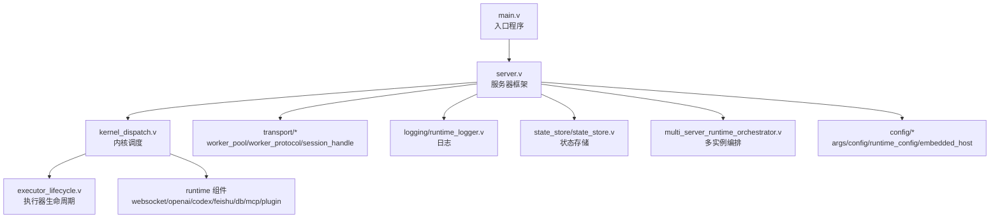
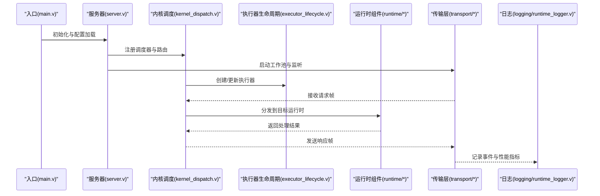
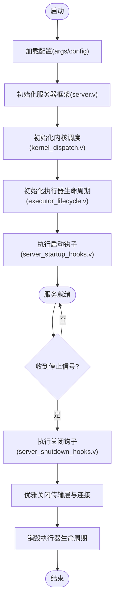
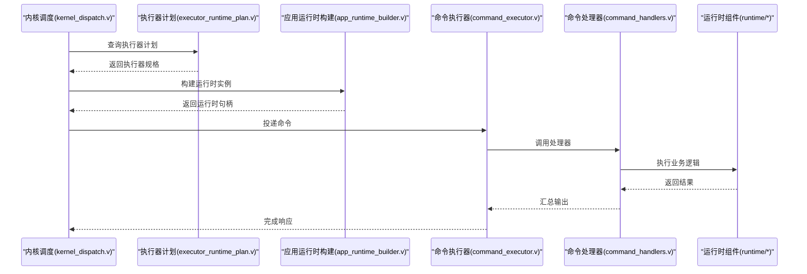
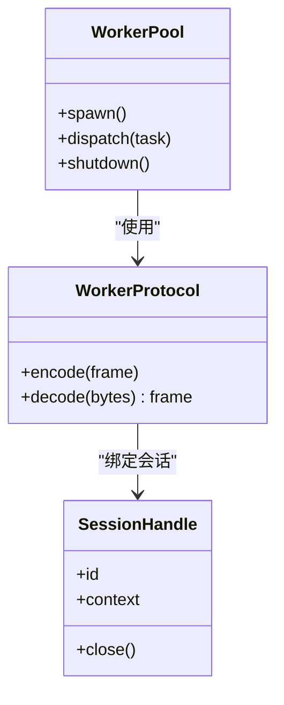
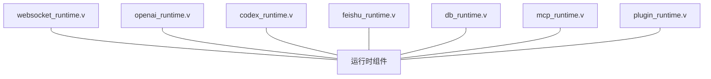
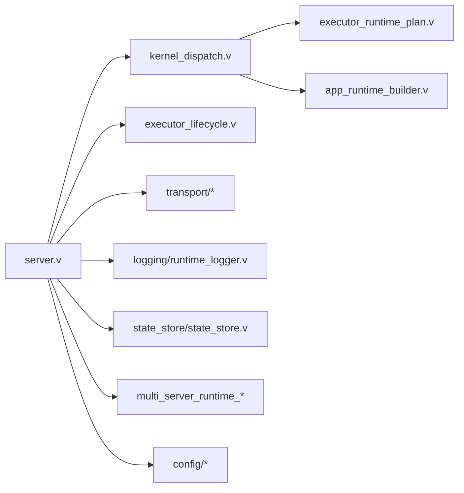

# 服务器核心

<cite>
**本文引用的文件**
- [main.v](file://src/main.v)
- [server.v](file://src/server.v)
- [kernel_dispatch.v](file://src/kernel_dispatch.v)
- [server_startup_hooks.v](file://src/server_startup_hooks.v)
- [server_shutdown_hooks.v](file://src/server_shutdown_hooks.v)
- [executor_lifecycle.v](file://src/executor_lifecycle.v)
- [executor_runtime_plan.v](file://src/executor_runtime_plan.v)
- [app_runtime_builder.v](file://src/app_runtime_builder.v)
- [command_executor.v](file://src/command_executor.v)
- [command_handlers.v](file://src/command_handlers.v)
- [transport/worker_pool.v](file://src/transport/worker_pool.v)
- [transport/worker_protocol.v](file://src/transport/worker_protocol.v)
- [transport/session_handle.v](file://src/transport/session_handle.v)
- [logging/runtime_logger.v](file://src/logging/runtime_logger.v)
- [state_store/state_store.v](file://src/state_store/state_store.v)
- [multi_server_runtime_orchestrator.v](file://src/multi_server_runtime_orchestrator.v)
- [multi_server_runtime_config.v](file://src/multi_server_runtime_config.v)
- [websocket_runtime.v](file://src/websocket_runtime.v)
- [openai_runtime.v](file://src/openai_runtime.v)
- [codex_runtime.v](file://src/codex_runtime.v)
- [feishu_runtime.v](file://src/feishu_runtime.v)
- [db_runtime.v](file://src/db_runtime.v)
- [mcp_runtime.v](file://src/mcp_runtime.v)
- [plugin_runtime.v](file://src/plugin_runtime.v)
- [config/config.v](file://src/config/config.v)
- [config/args.v](file://src/config/args.v)
- [config/runtime_config.v](file://src/config/runtime_config.v)
- [config/embedded_host.v](file://src/config/embedded_host.v)
- [v.mod](file://v.mod)
- [README.md](file://README.md)
</cite>

## 目录
1. [简介](#简介)
2. [项目结构](#项目结构)
3. [核心组件](#核心组件)
4. [架构总览](#架构总览)
5. [详细组件分析](#详细组件分析)
6. [依赖关系分析](#依赖关系分析)
7. [性能考量](#性能考量)
8. [故障排查指南](#故障排查指南)
9. [结论](#结论)
10. [附录](#附录)

## 简介
本文件面向系统管理员与高级开发者，系统性阐述 vhttpd 服务器核心的技术架构与实现细节。重点覆盖以下主题：
- 服务器启动与关闭生命周期：启动钩子与关闭钩子的执行时机、作用与扩展点
- 内核调度机制：请求如何被分发到不同运行时组件（如 WebSocket、OpenAI、Codex、Feishu、数据库等）
- 监控与日志：事件日志格式、日志级别控制与性能指标采集
- 错误处理与恢复：故障检测、自动重启与优雅降级策略
- 资源管理、进程间通信与并发控制：工作池、协议帧、会话句柄与状态存储
- 面向运维的深度内容：配置、多实例编排与可观测性

## 项目结构
vhttpd 的核心代码位于 src 目录，采用按功能域划分的模块化组织方式：
- config：命令行参数解析、全局配置与运行时配置
- transport：传输层抽象，包括工作池、协议帧与会话句柄
- executor：执行器桥接与生命周期管理
- runtime：各类业务运行时（WebSocket、OpenAI、Codex、Feishu、数据库、MCP、插件等）
- logging：运行时日志记录
- state_store：状态持久化存储
- multi_server_runtime_*：多服务器编排与配置
- 根目录入口：main.v 启动主程序，server.v 提供服务框架

图表来源
- [main.v](file://src/main.v)
- [server.v](file://src/server.v)
- [kernel_dispatch.v](file://src/kernel_dispatch.v)
- [executor_lifecycle.v](file://src/executor_lifecycle.v)
- [transport/worker_pool.v](file://src/transport/worker_pool.v)
- [transport/worker_protocol.v](file://src/transport/worker_protocol.v)
- [transport/session_handle.v](file://src/transport/session_handle.v)
- [logging/runtime_logger.v](file://src/logging/runtime_logger.v)
- [state_store/state_store.v](file://src/state_store/state_store.v)
- [multi_server_runtime_orchestrator.v](file://src/multi_server_runtime_orchestrator.v)
- [config/config.v](file://src/config/config.v)
- [config/args.v](file://src/config/args.v)
- [config/runtime_config.v](file://src/config/runtime_config.v)
- [config/embedded_host.v](file://src/config/embedded_host.v)

章节来源
- [main.v](file://src/main.v)
- [server.v](file://src/server.v)
- [config/config.v](file://src/config/config.v)
- [config/args.v](file://src/config/args.v)
- [config/runtime_config.v](file://src/config/runtime_config.v)
- [config/embedded_host.v](file://src/config/embedded_host.v)

## 核心组件
- 入口与服务器框架：负责初始化、加载配置、启动监听与生命周期管理
- 内核调度：统一接收请求，根据路由规则选择合适的运行时组件进行处理
- 执行器生命周期：管理执行器的创建、热更新、销毁与错误恢复
- 传输层：提供工作池、协议帧与会话句柄，支撑并发与多路复用
- 运行时组件：针对不同协议或上游能力（WS、OpenAI、Codex、Feishu、DB、MCP、Plugin）提供专用处理逻辑
- 日志与状态：集中化日志与状态持久化，便于运维观测与问题定位
- 多实例编排：支持多服务器实例的配置与协调

章节来源
- [server.v](file://src/server.v)
- [kernel_dispatch.v](file://src/kernel_dispatch.v)
- [executor_lifecycle.v](file://src/executor_lifecycle.v)
- [transport/worker_pool.v](file://src/transport/worker_pool.v)
- [transport/worker_protocol.v](file://src/transport/worker_protocol.v)
- [transport/session_handle.v](file://src/transport/session_handle.v)
- [logging/runtime_logger.v](file://src/logging/runtime_logger.v)
- [state_store/state_store.v](file://src/state_store/state_store.v)
- [multi_server_runtime_orchestrator.v](file://src/multi_server_runtime_orchestrator.v)

## 架构总览
下图展示从入口到内核调度、执行器与运行时组件的整体交互：

图表来源
- [main.v](file://src/main.v)
- [server.v](file://src/server.v)
- [kernel_dispatch.v](file://src/kernel_dispatch.v)
- [executor_lifecycle.v](file://src/executor_lifecycle.v)
- [transport/worker_pool.v](file://src/transport/worker_pool.v)
- [transport/worker_protocol.v](file://src/transport/worker_protocol.v)
- [logging/runtime_logger.v](file://src/logging/runtime_logger.v)

## 详细组件分析

### 启动与关闭生命周期
- 启动阶段
  - 入口程序加载命令行参数与配置，初始化服务器框架
  - 服务器框架注册内核调度器与传输层，启动工作池与监听端口
  - 执行器生命周期模块创建并预热执行器，准备处理请求
  - 启动钩子在服务器就绪后执行，用于外部集成、健康检查准备等
- 关闭阶段
  - 收到停止信号后，触发关闭钩子，执行清理与资源回收
  - 优雅关闭传输层连接，等待在途请求完成
  - 执行器生命周期模块安全销毁执行器，保存状态或释放资源

图表来源
- [main.v](file://src/main.v)
- [server.v](file://src/server.v)
- [server_startup_hooks.v](file://src/server_startup_hooks.v)
- [server_shutdown_hooks.v](file://src/server_shutdown_hooks.v)
- [executor_lifecycle.v](file://src/executor_lifecycle.v)

章节来源
- [main.v](file://src/main.v)
- [server.v](file://src/server.v)
- [server_startup_hooks.v](file://src/server_startup_hooks.v)
- [server_shutdown_hooks.v](file://src/server_shutdown_hooks.v)
- [executor_lifecycle.v](file://src/executor_lifecycle.v)

### 内核调度机制与请求分发
- 路由与分发
  - 内核调度器根据请求类型与目标标识，选择对应运行时组件
  - 支持多运行时并存与动态切换，确保请求被正确路由
- 执行器计划与构建
  - 执行器运行时计划定义了执行器的创建、热更新与销毁策略
  - 应用运行时构建器负责将配置映射到具体运行时实例
- 命令执行链
  - 命令执行器与命令处理器构成统一的请求处理管线，支持扩展与组合

图表来源
- [kernel_dispatch.v](file://src/kernel_dispatch.v)
- [executor_runtime_plan.v](file://src/executor_runtime_plan.v)
- [app_runtime_builder.v](file://src/app_runtime_builder.v)
- [command_executor.v](file://src/command_executor.v)
- [command_handlers.v](file://src/command_handlers.v)

章节来源
- [kernel_dispatch.v](file://src/kernel_dispatch.v)
- [executor_runtime_plan.v](file://src/executor_runtime_plan.v)
- [app_runtime_builder.v](file://src/app_runtime_builder.v)
- [command_executor.v](file://src/command_executor.v)
- [command_handlers.v](file://src/command_handlers.v)

### 传输层与并发控制
- 工作池
  - 工作池负责线程/协程池的创建与任务派发，支持背压与限流
- 协议帧
  - 协议帧定义请求/响应的序列化与反序列化规范，保证跨组件一致性
- 会话句柄
  - 会话句柄封装连接状态与上下文，支持长连接与多路复用
- 并发与队列
  - 传输层提供队列与调度策略，避免热点与拥塞

图表来源
- [transport/worker_pool.v](file://src/transport/worker_pool.v)
- [transport/worker_protocol.v](file://src/transport/worker_protocol.v)
- [transport/session_handle.v](file://src/transport/session_handle.v)

章节来源
- [transport/worker_pool.v](file://src/transport/worker_pool.v)
- [transport/worker_protocol.v](file://src/transport/worker_protocol.v)
- [transport/session_handle.v](file://src/transport/session_handle.v)

### 运行时组件与业务域
- WebSocket 运行时：处理实时双向通信，支持上游转发与事件总线
- OpenAI 运行时：对接 OpenAI 生态，聚合与转发消息
- Codex 运行时：面向 Codex 的专用处理逻辑
- Feishu 运行时：企业微信生态的卡片与消息处理
- 数据库运行时：提供数据库访问与事务支持
- MCP 运行时：多命令协议运行时
- 插件运行时：插件化扩展能力

图表来源
- [websocket_runtime.v](file://src/websocket_runtime.v)
- [openai_runtime.v](file://src/openai_runtime.v)
- [codex_runtime.v](file://src/codex_runtime.v)
- [feishu_runtime.v](file://src/feishu_runtime.v)
- [db_runtime.v](file://src/db_runtime.v)
- [mcp_runtime.v](file://src/mcp_runtime.v)
- [plugin_runtime.v](file://src/plugin_runtime.v)

章节来源
- [websocket_runtime.v](file://src/websocket_runtime.v)
- [openai_runtime.v](file://src/openai_runtime.v)
- [codex_runtime.v](file://src/codex_runtime.v)
- [feishu_runtime.v](file://src/feishu_runtime.v)
- [db_runtime.v](file://src/db_runtime.v)
- [mcp_runtime.v](file://src/mcp_runtime.v)
- [plugin_runtime.v](file://src/plugin_runtime.v)

### 日志与监控
- 日志记录
  - 运行时日志器集中记录请求、错误、性能与调试信息
  - 支持不同日志级别，便于生产环境分级输出
- 性能指标
  - 通过传输层与运行时组件上报延迟、吞吐、错误率等指标
  - 结合状态存储，支持历史趋势分析与告警联动

章节来源
- [logging/runtime_logger.v](file://src/logging/runtime_logger.v)
- [transport/worker_protocol.v](file://src/transport/worker_protocol.v)
- [state_store/state_store.v](file://src/state_store/state_store.v)

### 多服务器编排与配置
- 多服务器运行时配置与编排器负责：
  - 实例发现与负载均衡
  - 配置同步与版本管理
  - 故障隔离与自动恢复

章节来源
- [multi_server_runtime_config.v](file://src/multi_server_runtime_config.v)
- [multi_server_runtime_orchestrator.v](file://src/multi_server_runtime_orchestrator.v)

## 依赖关系分析
- 模块耦合
  - server.v 作为中枢，依赖 kernel_dispatch.v、executor_lifecycle.v、transport/*、logging、state_store、multi_server_runtime_* 与 config/*
  - kernel_dispatch.v 依赖 executor_runtime_plan.v 与 app_runtime_builder.v
  - 运行时组件彼此解耦，通过统一接口与协议交互
- 外部依赖
  - v.mod 描述了语言与工具链版本要求，确保构建一致性

图表来源
- [server.v](file://src/server.v)
- [kernel_dispatch.v](file://src/kernel_dispatch.v)
- [executor_lifecycle.v](file://src/executor_lifecycle.v)
- [executor_runtime_plan.v](file://src/executor_runtime_plan.v)
- [app_runtime_builder.v](file://src/app_runtime_builder.v)
- [transport/worker_pool.v](file://src/transport/worker_pool.v)
- [logging/runtime_logger.v](file://src/logging/runtime_logger.v)
- [state_store/state_store.v](file://src/state_store/state_store.v)
- [multi_server_runtime_orchestrator.v](file://src/multi_server_runtime_orchestrator.v)
- [config/config.v](file://src/config/config.v)

章节来源
- [server.v](file://src/server.v)
- [v.mod](file://v.mod)

## 性能考量
- 并发模型
  - 使用工作池与协议帧实现高并发与低延迟
  - 通过会话句柄与队列控制背压，避免过载
- 调度优化
  - 内核调度器优先选择空闲执行器，减少排队时间
  - 动态调整执行器数量以适配流量峰值
- I/O 与序列化
  - 协议帧采用紧凑格式，降低网络与 CPU 开销
- 观测性
  - 持续采集延迟、错误率与资源占用，结合告警阈值进行弹性伸缩

## 故障排查指南
- 启动失败
  - 检查配置文件与命令行参数是否正确
  - 查看启动钩子输出，确认外部依赖可用
- 请求异常
  - 通过日志查看请求进入与离开内核调度器的时间点
  - 定位具体运行时组件的错误码与堆栈
- 连接问题
  - 检查传输层工作池状态与会话句柄数量
  - 关注协议帧编码/解码错误
- 自动重启与降级
  - 执行器生命周期模块支持失败重试与回退策略
  - 多服务器编排器在实例不可用时进行故障转移

章节来源
- [server_startup_hooks.v](file://src/server_startup_hooks.v)
- [server_shutdown_hooks.v](file://src/server_shutdown_hooks.v)
- [executor_lifecycle.v](file://src/executor_lifecycle.v)
- [transport/worker_pool.v](file://src/transport/worker_pool.v)
- [transport/worker_protocol.v](file://src/transport/worker_protocol.v)
- [transport/session_handle.v](file://src/transport/session_handle.v)
- [logging/runtime_logger.v](file://src/logging/runtime_logger.v)

## 结论
vhttpd 服务器核心通过清晰的模块边界与可插拔的运行时设计，实现了高并发、可观测与可运维的统一平台。启动/关闭钩子提供了灵活的扩展点；内核调度与执行器生命周期保障了请求的高效分发与稳定运行；传输层与状态存储为并发与持久化提供了坚实基础；多服务器编排与日志监控体系则满足了生产环境对可靠性与可维护性的严苛要求。

## 附录
- 快速参考
  - 入口与配置：main.v、config/args.v、config/config.v、config/runtime_config.v、config/embedded_host.v
  - 服务器框架与调度：server.v、kernel_dispatch.v
  - 生命周期与计划：executor_lifecycle.v、executor_runtime_plan.v、app_runtime_builder.v
  - 传输层：transport/worker_pool.v、transport/worker_protocol.v、transport/session_handle.v
  - 运行时组件：websocket_runtime.v、openai_runtime.v、codex_runtime.v、feishu_runtime.v、db_runtime.v、mcp_runtime.v、plugin_runtime.v
  - 日志与状态：logging/runtime_logger.v、state_store/state_store.v
  - 多实例编排：multi_server_runtime_orchestrator.v、multi_server_runtime_config.v
  - 版本与工具链：v.mod

章节来源
- [README.md](file://README.md)
- [v.mod](file://v.mod)