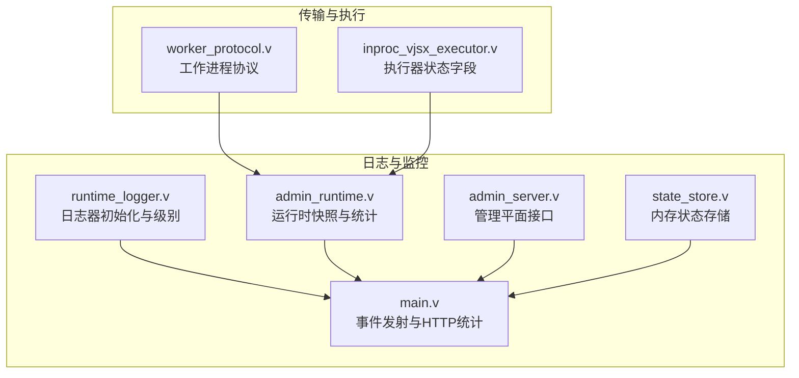
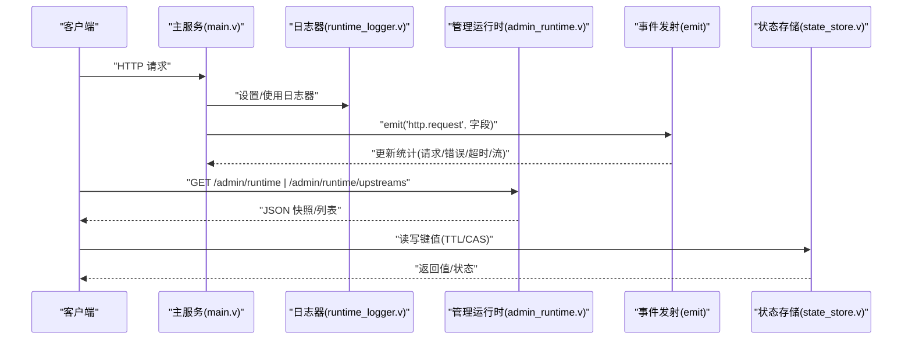
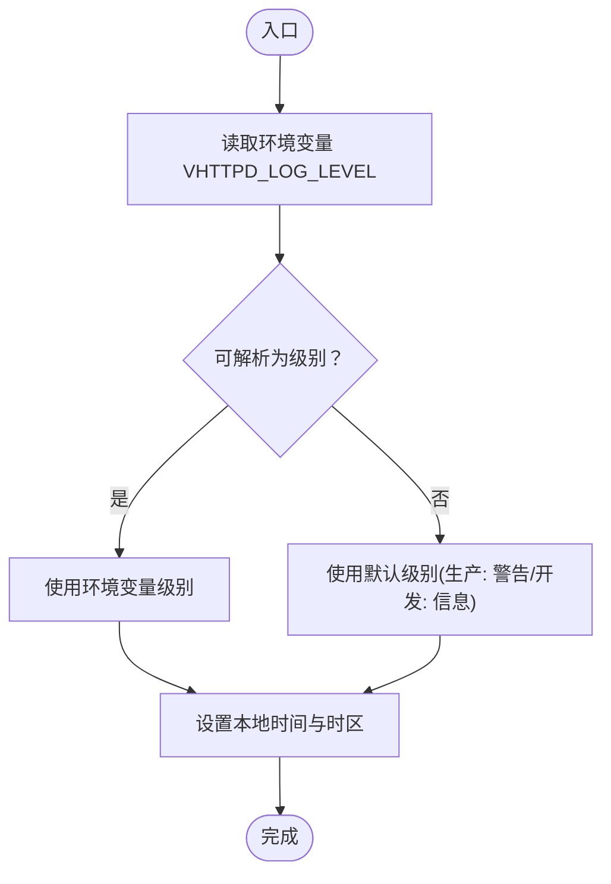
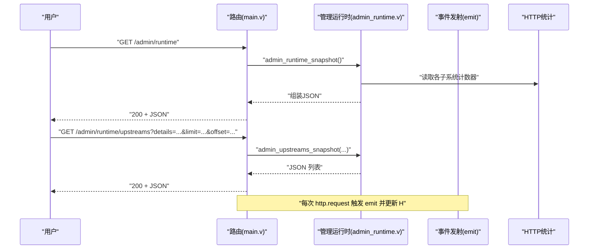
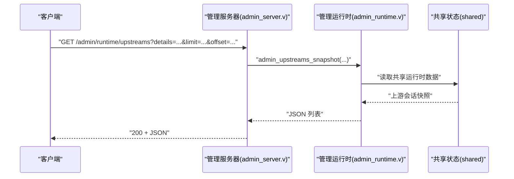
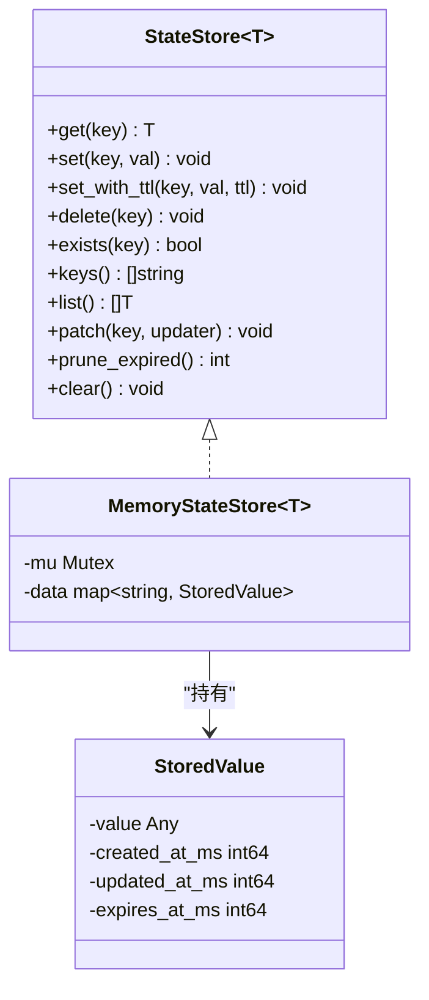
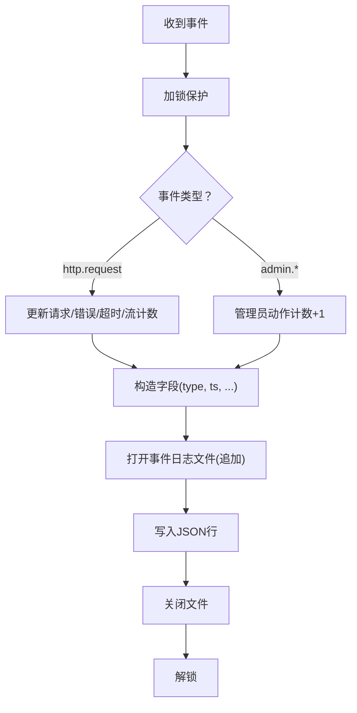
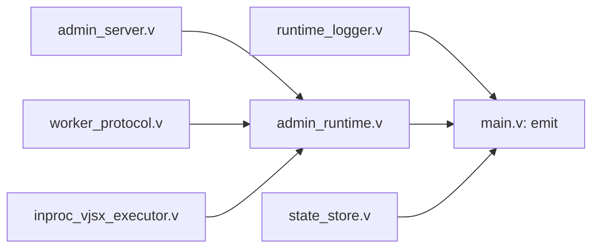

# 监控与日志系统

<cite>
**本文引用的文件**
- [src/logging/runtime_logger.v](file://src/logging/runtime_logger.v)
- [src/admin_runtime.v](file://src/admin_runtime.v)
- [src/admin_server.v](file://src/admin_server.v)
- [src/state_store/state_store.v](file://src/state_store/state_store.v)
- [src/state_store/state_store_test.v](file://src/state_store/state_store_test.v)
- [src/main.v](file://src/main.v)
- [README.md](file://README.md)
- [src/transport/worker_protocol.v](file://src/transport/worker_protocol.v)
- [src/executor/inproc_vjsx_executor.v](file://src/executor/inproc_vjsx_executor.v)
</cite>

## 目录
1. [简介](#简介)
2. [项目结构](#项目结构)
3. [核心组件](#核心组件)
4. [架构总览](#架构总览)
5. [详细组件分析](#详细组件分析)
6. [依赖关系分析](#依赖关系分析)
7. [性能考量](#性能考量)
8. [故障排查指南](#故障排查指南)
9. [结论](#结论)
10. [附录](#附录)

## 简介
本文件面向 vhttpd 的监控与日志系统，聚焦以下主题：
- 运行时日志记录器（runtime logger）：日志级别、格式规范与输出目标配置
- 监控指标采集与上报：性能指标、运行时状态与业务指标
- 管理运行时（admin runtime）监控接口与 API：健康检查、状态查询与性能分析
- 状态存储（state store）：持久化与查询系统状态信息
- 日志分析、性能监控与故障诊断的最佳实践
- 日志轮转、压缩与远程收集的配置建议

## 项目结构
vhttpd 将监控与日志相关能力分布在多个模块中：
- 日志记录：logging 子模块负责日志器初始化与级别解析
- 管理接口：admin_runtime 与 admin_server 提供运行时状态与上游会话等查询
- 事件与统计：主应用通过 emit 记录事件并维护 HTTP 统计
- 状态存储：state_store 提供内存态键值存储与 TTL 清理
- 协议与执行：worker_protocol 定义跨进程通信协议；inproc_vjsx_executor 跟踪执行器状态

图表来源
- [src/logging/runtime_logger.v:1-39](file://src/logging/runtime_logger.v#L1-L39)
- [src/admin_runtime.v:16-61](file://src/admin_runtime.v#L16-L61)
- [src/admin_server.v:253-370](file://src/admin_server.v#L253-L370)
- [src/main.v:996-1033](file://src/main.v#L996-L1033)
- [src/state_store/state_store.v:1-289](file://src/state_store/state_store.v#L1-L289)
- [src/transport/worker_protocol.v:201-247](file://src/transport/worker_protocol.v#L201-L247)
- [src/executor/inproc_vjsx_executor.v:139-151](file://src/executor/inproc_vjsx_executor.v#L139-L151)

章节来源
- [src/logging/runtime_logger.v:1-39](file://src/logging/runtime_logger.v#L1-L39)
- [src/admin_runtime.v:16-61](file://src/admin_runtime.v#L16-L61)
- [src/admin_server.v:253-370](file://src/admin_server.v#L253-L370)
- [src/main.v:996-1033](file://src/main.v#L996-L1033)
- [src/state_store/state_store.v:1-289](file://src/state_store/state_store.v#L1-L289)
- [src/transport/worker_protocol.v:201-247](file://src/transport/worker_protocol.v#L201-L247)
- [src/executor/inproc_vjsx_executor.v:139-151](file://src/executor/inproc_vjsx_executor.v#L139-L151)

## 核心组件
- 运行时日志记录器：支持从环境变量读取日志级别，按生产/开发环境设定默认级别，并设置本地时间与时区
- 管理运行时接口：提供运行时快照、上游会话列表、提供者实例快照等查询端点
- 事件与统计：统一事件发射器 emit，记录 HTTP 请求统计与各类运行时事件
- 状态存储：通用内存态键值存储，支持 TTL、过期清理、CAS 操作与结构体序列化
- 协议与执行：定义工作进程间消息结构，跟踪执行器签名与启动状态

章节来源
- [src/logging/runtime_logger.v:6-39](file://src/logging/runtime_logger.v#L6-L39)
- [src/admin_runtime.v:16-61](file://src/admin_runtime.v#L16-L61)
- [src/admin_server.v:253-370](file://src/admin_server.v#L253-L370)
- [src/main.v:996-1033](file://src/main.v#L996-L1033)
- [src/state_store/state_store.v:8-226](file://src/state_store/state_store.v#L8-L226)
- [src/transport/worker_protocol.v:201-247](file://src/transport/worker_protocol.v#L201-L247)
- [src/executor/inproc_vjsx_executor.v:139-151](file://src/executor/inproc_vjsx_executor.v#L139-L151)

## 架构总览
下图展示监控与日志在系统中的交互路径：请求经路由进入，触发事件发射与统计更新；管理接口读取运行时快照；状态存储用于临时状态持久化。

图表来源
- [src/main.v:996-1033](file://src/main.v#L996-L1033)
- [src/logging/runtime_logger.v:34-39](file://src/logging/runtime_logger.v#L34-L39)
- [src/admin_runtime.v:151-199](file://src/admin_runtime.v#L151-L199)
- [src/state_store/state_store.v:71-120](file://src/state_store/state_store.v#L71-L120)

## 详细组件分析

### 运行时日志记录器（runtime logger）
- 级别解析与默认值
  - 支持从字符串到枚举级别的映射，大小写不敏感
  - 生产环境默认警告级别，开发环境默认信息级别
  - 可通过环境变量覆盖默认级别
- 初始化与时间设置
  - 设置本地时间与时区，便于审计与排障
- 输出目标
  - 通过全局日志器设置，影响后续所有日志输出

图表来源
- [src/logging/runtime_logger.v:6-32](file://src/logging/runtime_logger.v#L6-L32)

章节来源
- [src/logging/runtime_logger.v:6-39](file://src/logging/runtime_logger.v#L6-L39)

### 监控指标采集与上报
- HTTP 请求统计
  - 总请求数、错误数、超时数、流式响应数
  - 由事件发射器在每次 http.request 事件时更新
- 运行时快照
  - 包含启动时间、运行时长、HTTP 统计、工作池队列统计、上游计划统计、MCP 会话统计、飞书提供者指标等
- 管理接口
  - GET /admin/runtime 返回运行时快照
  - GET /admin/runtime/upstreams 返回上游会话列表（支持详情、限制、偏移、角色/提供者过滤）

图表来源
- [src/admin_runtime.v:16-61](file://src/admin_runtime.v#L16-L61)
- [src/admin_runtime.v:151-199](file://src/admin_runtime.v#L151-L199)
- [src/main.v:996-1033](file://src/main.v#L996-L1033)

章节来源
- [src/admin_runtime.v:16-61](file://src/admin_runtime.v#L16-L61)
- [src/admin_runtime.v:151-199](file://src/admin_runtime.v#L151-L199)
- [src/main.v:996-1033](file://src/main.v#L996-L1033)

### 管理运行时（admin runtime）监控接口与 API
- 健康检查
  - GET /health 返回服务可用性
- 运行时状态查询
  - GET /admin/runtime：返回运行时能力标志、活跃连接数与队列统计
  - GET /admin/runtime/upstreams：返回活跃上游会话，支持过滤与分页
  - GET /admin/runtime/provider-instances：返回提供者实例快照（管理平面）
- 性能分析
  - 通过运行时快照中的计数器与时间戳进行趋势分析
  - 结合事件流 /events/stream 进行实时观测

图表来源
- [src/admin_server.v:253-370](file://src/admin_server.v#L253-L370)
- [src/admin_runtime.v:173-199](file://src/admin_runtime.v#L173-L199)

章节来源
- [src/admin_server.v:253-370](file://src/admin_server.v#L253-L370)
- [README.md:1091-1120](file://README.md#L1091-L1120)

### 状态存储（state store）
- 接口与能力
  - 通用接口 StateStore[T]：get/set/delete/exists/keys/list/patch/prune_expired/clear
  - 内存态实现 MemoryStateStore[T]：线程安全、基于互斥锁
- 数据结构
  - StoredValue：保存值、创建/更新时间戳、过期时间戳
  - 支持字符串与结构体的序列化/反序列化
- TTL 与过期清理
  - set_with_ttl 支持设置过期时间
  - keys/list 在遍历时清理过期项
  - prune_expired 主动清理过期键
- CAS 与并发
  - compare_and_swap_set_with_ttl 与 compare_and_swap_delete 提供基于期望值的原子操作
- 测试验证
  - 覆盖基本 CRUD、TTL 过期、结构体往返、并发一致性

图表来源
- [src/state_store/state_store.v:8-40](file://src/state_store/state_store.v#L8-L40)
- [src/state_store/state_store.v:22-28](file://src/state_store/state_store.v#L22-L28)
- [src/state_store/state_store.v:30-40](file://src/state_store/state_store.v#L30-L40)

章节来源
- [src/state_store/state_store.v:8-289](file://src/state_store/state_store.v#L8-L289)
- [src/state_store/state_store_test.v:11-45](file://src/state_store/state_store_test.v#L11-L45)

### 事件与日志格式规范
- 事件字段
  - type：事件类型（如 server.started、http.request、admin.xxx 等）
  - ts：事件发生的时间戳（秒）
  - 其他上下文字段：如 status、request_id、trace_id、duration_ms 等
- 写入策略
  - 以 JSON 行格式追加写入事件日志文件
  - 仅在特定关键事件上启用运行时追踪输出

图表来源
- [src/main.v:996-1033](file://src/main.v#L996-L1033)

章节来源
- [src/main.v:996-1033](file://src/main.v#L996-L1033)

### 执行器与协议辅助监控
- 执行器状态字段
  - 签名检查/探测时间、待处理时间、最近错误
  - 预热与应用启动状态、错误信息
- 工作进程协议
  - 定义 MCP 分发响应、WebSocket 上游命令等结构，便于观测与调试

章节来源
- [src/executor/inproc_vjsx_executor.v:139-151](file://src/executor/inproc_vjsx_executor.v#L139-L151)
- [src/transport/worker_protocol.v:201-247](file://src/transport/worker_protocol.v#L201-L247)

## 依赖关系分析
- 日志记录器依赖标准库日志与环境变量
- 管理运行时依赖各子系统的统计数据与快照函数
- 事件发射器依赖文件系统写入与 JSON 编码
- 状态存储依赖同步原语与 JSON 序列化
- 协议与执行器状态为监控提供结构化数据载体

图表来源
- [src/logging/runtime_logger.v:34-39](file://src/logging/runtime_logger.v#L34-L39)
- [src/admin_runtime.v:16-61](file://src/admin_runtime.v#L16-L61)
- [src/admin_server.v:253-370](file://src/admin_server.v#L253-L370)
- [src/main.v:996-1033](file://src/main.v#L996-L1033)
- [src/state_store/state_store.v:71-120](file://src/state_store/state_store.v#L71-L120)
- [src/transport/worker_protocol.v:201-247](file://src/transport/worker_protocol.v#L201-L247)
- [src/executor/inproc_vjsx_executor.v:139-151](file://src/executor/inproc_vjsx_executor.v#L139-L151)

章节来源
- [src/logging/runtime_logger.v:34-39](file://src/logging/runtime_logger.v#L34-L39)
- [src/admin_runtime.v:16-61](file://src/admin_runtime.v#L16-L61)
- [src/admin_server.v:253-370](file://src/admin_server.v#L253-L370)
- [src/main.v:996-1033](file://src/main.v#L996-L1033)
- [src/state_store/state_store.v:71-120](file://src/state_store/state_store.v#L71-L120)
- [src/transport/worker_protocol.v:201-247](file://src/transport/worker_protocol.v#L201-L247)
- [src/executor/inproc_vjsx_executor.v:139-151](file://src/executor/inproc_vjsx_executor.v#L139-L151)

## 性能考量
- 日志级别控制
  - 生产环境默认警告级别，降低高吞吐场景的日志开销
  - 使用环境变量快速调整，避免重启
- 事件写入
  - 采用追加写与单行 JSON，减少 IO 开销
  - 关键事件才触发运行时追踪，避免过度采样
- 状态存储
  - 内存态实现具备低延迟特性；注意 keys/list 会清理过期项，避免内存膨胀
  - 合理设置 TTL，结合 prune_expired 主动回收
- 管理接口
  - 支持 limit/offset/filter，避免一次性返回大量数据
  - 对上游会话与提供者实例查询应配合分页参数

## 故障排查指南
- 健康检查
  - 使用 GET /health 快速判断服务可用性
- 事件流观测
  - 使用 GET /events/stream 获取 SSE 事件流，辅助定位问题
- 管理接口
  - GET /admin/runtime 查看运行时快照，关注队列等待/拒绝/超时、上游计划错误、MCP 会话状态
  - GET /admin/runtime/upstreams 查看活跃上游会话，结合角色/提供者过滤缩小范围
- 状态存储
  - 使用 keys/list 检查当前有效键；若出现过期键缺失，确认 TTL 设置与 prune_expired 调用频率
  - 使用 compare_and_swap_* 进行无锁并发更新，避免竞态
- 日志级别
  - 通过 VHTTPD_LOG_LEVEL 调整级别，必要时临时提升至调试级别获取更多信息

章节来源
- [README.md:1091-1120](file://README.md#L1091-L1120)
- [src/main.v:1537-1575](file://src/main.v#L1537-L1575)
- [src/admin_runtime.v:151-199](file://src/admin_runtime.v#L151-L199)
- [src/state_store/state_store.v:138-218](file://src/state_store/state_store.v#L138-L218)
- [src/logging/runtime_logger.v:26-32](file://src/logging/runtime_logger.v#L26-L32)

## 结论
vhttpd 的监控与日志体系以“轻量、可观测、易扩展”为目标：通过可配置的日志器、统一的事件发射与统计、完善的管理接口以及内存态状态存储，实现了对运行时状态、性能指标与业务行为的全面掌控。配合合理的日志级别与事件流，可在生产环境中高效地进行问题定位与容量规划。

## 附录

### 日志轮转、压缩与远程收集配置指南
- 日志轮转
  - 建议使用系统级工具（如 logrotate）对事件日志文件进行轮转与归档，避免单文件过大
- 压缩
  - 归档后启用压缩，降低存储占用
- 远程收集
  - 可将事件日志文件接入集中式日志系统（如 Fluent Bit/Filebeat + Elasticsearch/OpenSearch），实现统一检索与告警
  - 若需实时流式传输，可将 /events/stream 作为事件源接入流式平台

[本节为通用实践建议，无需代码来源]