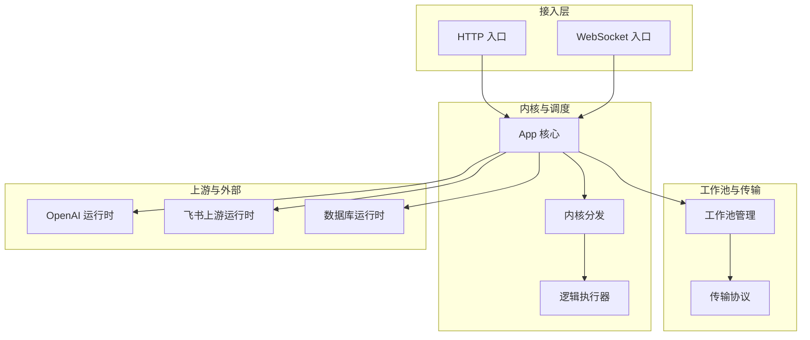
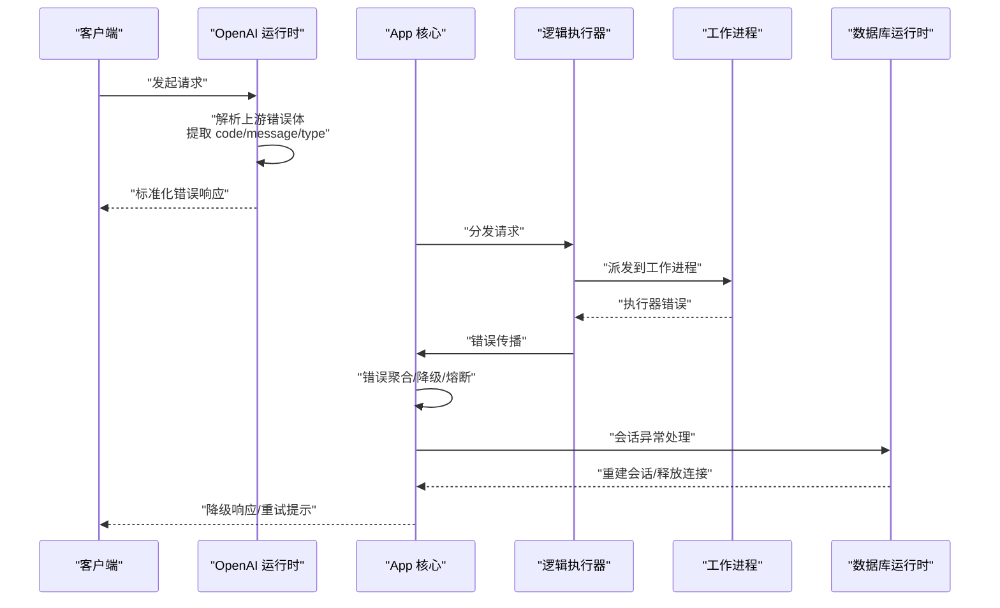
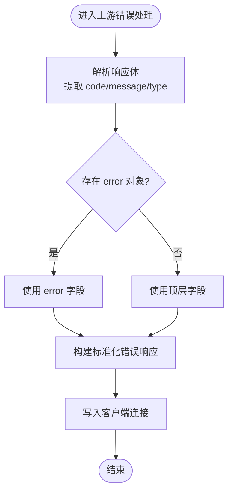
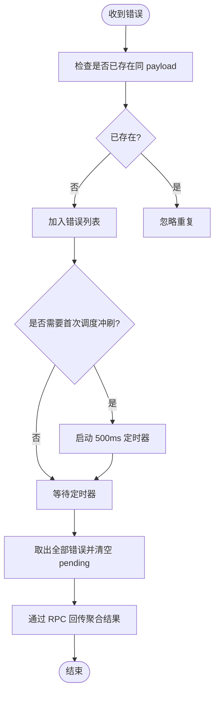
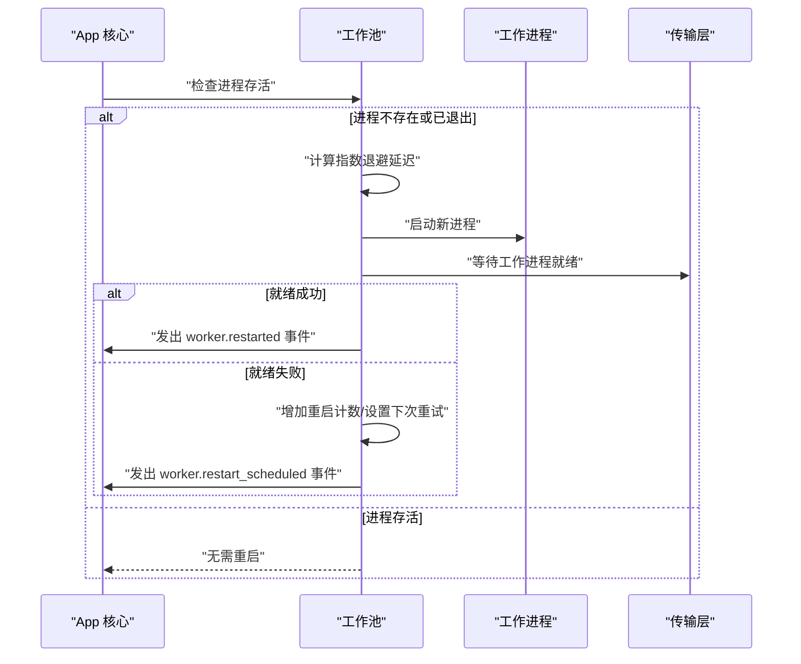
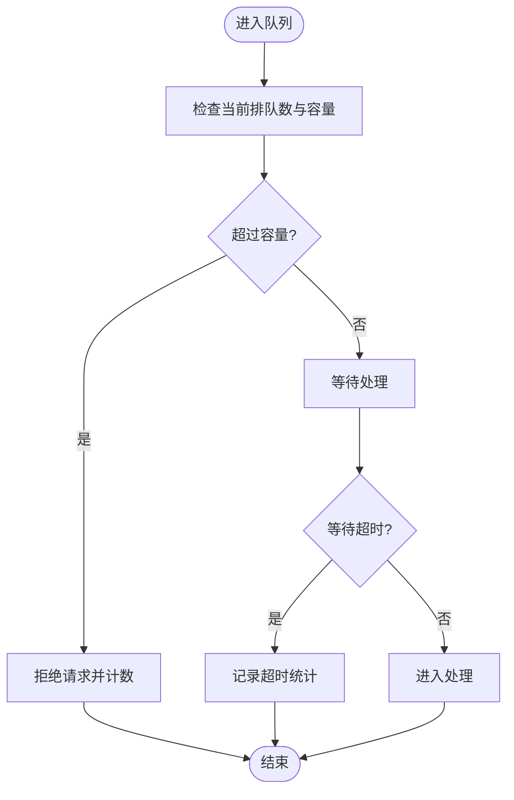
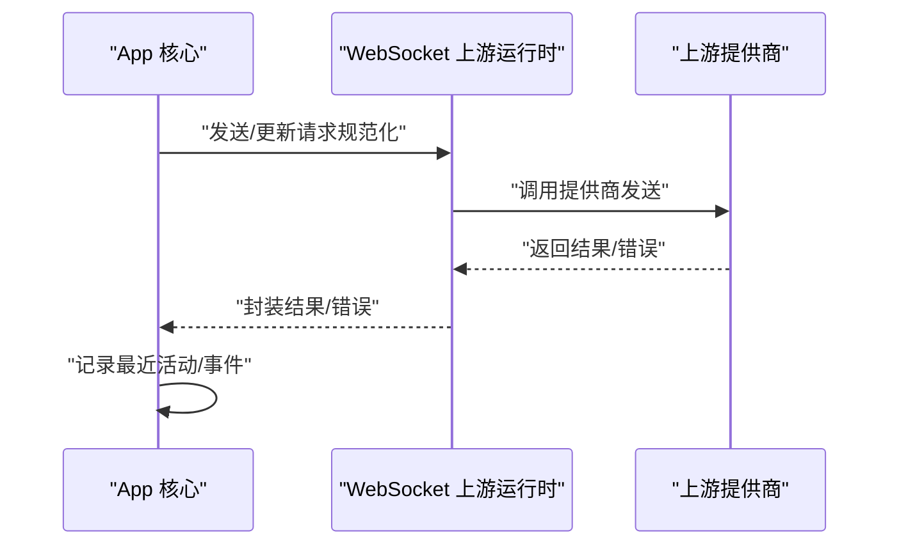
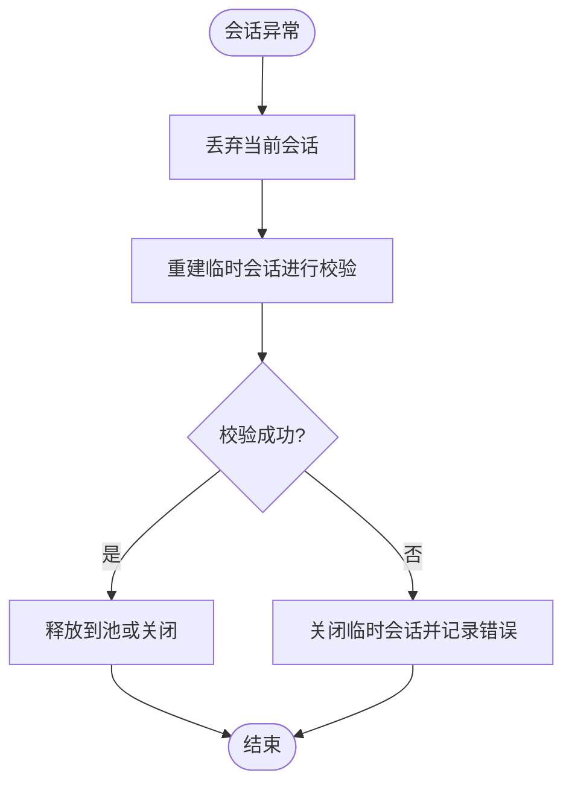
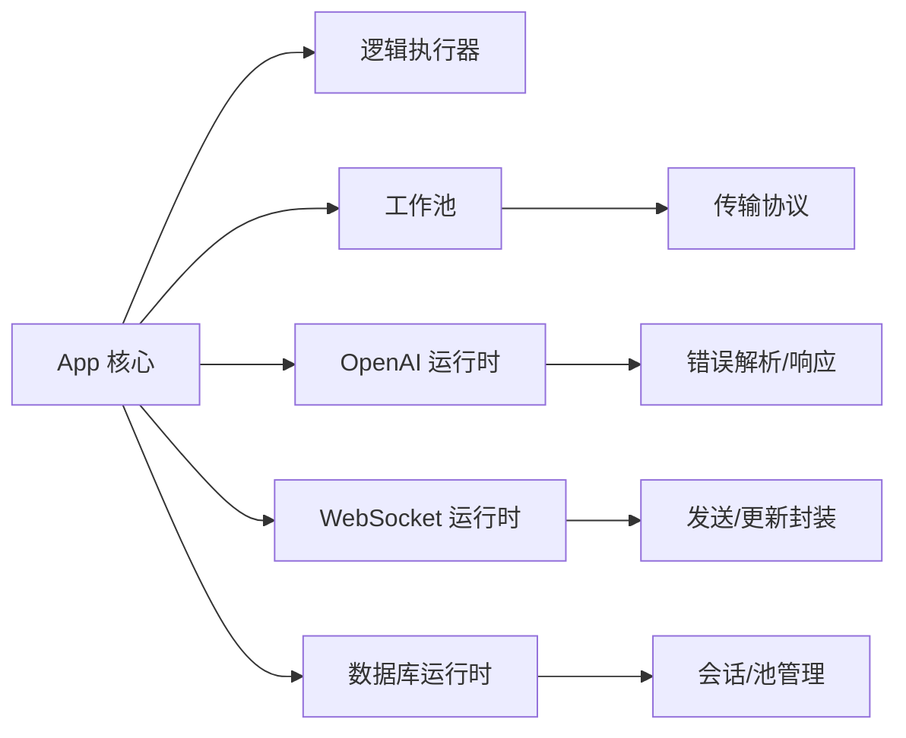

# 错误处理与恢复机制

<cite>
**本文引用的文件**
- [src/openai_runtime.v](file://src/openai_runtime.v)
- [src/codex_runtime.v](file://src/codex_runtime.v)
- [src/worker_backend_pool.v](file://src/worker_backend_pool.v)
- [src/transport/worker_pool.v](file://src/transport/worker_pool.v)
- [src/worker_backend_queue.v](file://src/worker_backend_queue.v)
- [src/worker_backend_dispatch.v](file://src/worker_backend_dispatch.v)
- [src/websocket_upstream_runtime.v](file://src/websocket_upstream_runtime.v)
- [src/dbsrc/db_runtime.v](file://src/dbsrc/db_runtime.v)
- [src/inproc_vjsx_http_facade.js](file://src/inproc_vjsx_http_facade.js)
- [src/inproc_vjsx_executor_test.v](file://src/inproc_vjsx_executor_test.v)
- [src/feishu_runtime_test.v](file://src/feishu_runtime_test.v)
- [src/config/runtime_config.v](file://src/config/runtime_config.v)
- [src/logging/runtime_logger.v](file://src/logging/runtime_logger.v)
- [docs/failure_model.md](file://docs/failure_model.md)
</cite>

## 目录
1. [引言](#引言)
2. [项目结构](#项目结构)
3. [核心组件](#核心组件)
4. [架构总览](#架构总览)
5. [详细组件分析](#详细组件分析)
6. [依赖关系分析](#依赖关系分析)
7. [性能考量](#性能考量)
8. [故障排查指南](#故障排查指南)
9. [结论](#结论)
10. [附录](#附录)

## 引言
本文件聚焦于 vhttpd 的错误处理与恢复机制，系统性阐述错误类型分类（网络错误、执行器错误、协议错误、资源错误）、错误传播路径与转换策略、自动恢复（进程重启、连接重连、状态恢复）、故障检测与隔离（超时、熔断、降级）、优雅降级实现以及日志与告警、运维排障最佳实践。目标读者为运维工程师与系统管理员。

## 项目结构
vhttpd 采用多模块分层设计：内核调度与运行时（App、逻辑执行器、工作池）、传输层（Unix Socket/HTTP/WebSocket 协议栈）、上游集成（OpenAI、Feishu 等）、数据库运行时、内联 VJSX 执行器等。错误处理贯穿各层，通过统一的错误传播与恢复策略保障系统稳定性。

图示来源
- [src/openai_runtime.v](file://src/openai_runtime.v)
- [src/websocket_upstream_runtime.v](file://src/websocket_upstream_runtime.v)
- [src/worker_backend_pool.v](file://src/worker_backend_pool.v)
- [src/dbsrc/db_runtime.v](file://src/dbsrc/db_runtime.v)

章节来源
- [src/openai_runtime.v](file://src/openai_runtime.v)
- [src/websocket_upstream_runtime.v](file://src/websocket_upstream_runtime.v)
- [src/worker_backend_pool.v](file://src/worker_backend_pool.v)
- [src/dbsrc/db_runtime.v](file://src/dbsrc/db_runtime.v)

## 核心组件
- 错误解析与响应生成：针对上游返回体进行结构化解析，提取 code/message/type，并生成标准化错误响应。
- 错误聚合与延迟冲刷：对同一流上的并发错误进行聚合，延时批量上报，避免风暴效应。
- 工作进程生命周期与自愈：基于指数退避的进程重启策略，失败后等待并重试，同时发出事件通知。
- 队列与排队超时：对工作队列容量与等待时间进行统计与告警，防止过载。
- 上游发送与更新：对上游消息发送与更新进行规范化封装，便于后续熔断与降级扩展。
- 数据库会话与连接池：会话异常时进行丢弃与重建，确保池健康；事务结束时按可复用性释放或关闭。
- 内联 VJSX 执行器：对应用侧错误进行捕获与标记脏状态，修复后自动恢复。
- 日志与事件：统一的日志记录与事件发射，便于监控与审计。

章节来源
- [src/openai_runtime.v](file://src/openai_runtime.v)
- [src/codex_runtime.v](file://src/codex_runtime.v)
- [src/worker_backend_pool.v](file://src/worker_backend_pool.v)
- [src/transport/worker_pool.v](file://src/transport/worker_pool.v)
- [src/worker_backend_queue.v](file://src/worker_backend_queue.v)
- [src/websocket_upstream_runtime.v](file://src/websocket_upstream_runtime.v)
- [src/dbsrc/db_runtime.v](file://src/dbsrc/db_runtime.v)
- [src/inproc_vjsx_http_facade.js](file://src/inproc_vjsx_http_facade.js)
- [src/logging/runtime_logger.v](file://src/logging/runtime_logger.v)

## 架构总览
下图展示错误从上游到客户端的典型传播路径，以及在各层的处理与恢复动作。

图示来源
- [src/openai_runtime.v](file://src/openai_runtime.v)
- [src/worker_backend_pool.v](file://src/worker_backend_pool.v)
- [src/dbsrc/db_runtime.v](file://src/dbsrc/db_runtime.v)

## 详细组件分析

### 组件一：OpenAI 上游错误解析与响应
- 功能要点
  - 从上游响应体中解析 error/code/message/type，若非 JSON 则回退为纯文本或默认值。
  - 将错误写入客户端连接，设置标准 JSON 响应头与状态码。
  - 在 4xx/5xx 场景下，优先尝试降级映射流模式，失败后再回写错误。
- 错误传播
  - 解析后的错误信息向上游传播，驱动上层降级策略。
- 恢复策略
  - 通过映射流或回退计划进行恢复；若仍失败则直接回写标准化错误。

图示来源
- [src/openai_runtime.v](file://src/openai_runtime.v)

章节来源
- [src/openai_runtime.v](file://src/openai_runtime.v)

### 组件二：Codex 错误聚合与延迟冲刷
- 功能要点
  - 对同一流的错误进行去重与聚合，设定 500ms 聚合窗口，收集并发错误。
  - 达到阈值后批量冲刷，将所有错误详情以 JSON 数组形式上报。
  - 选择首个原始负载作为元数据来源，保证可观测性。
- 错误传播
  - 通过 RPC 响应通道将聚合结果回传给 PHP 层，携带首条错误用于元信息提取。
- 恢复策略
  - 通过聚合上报，辅助上层定位问题并触发相应恢复流程。

图示来源
- [src/codex_runtime.v](file://src/codex_runtime.v)

章节来源
- [src/codex_runtime.v](file://src/codex_runtime.v)

### 组件三：工作进程生命周期与自愈（指数退避）
- 功能要点
  - 当工作进程退出或不可达时，按指数退避策略延迟重启，避免雪崩。
  - 成功启动后清除下次重试时间戳；失败则记录重启次数与下次重试时间。
  - 发出“worker.restart_scheduled”和“worker.restarted”事件，便于监控与告警。
- 错误传播
  - 通过事件系统向系统广播重启原因与时间点，便于运维追踪。
- 恢复策略
  - 自动重启与健康检查结合，确保服务可用性。

图示来源
- [src/worker_backend_pool.v](file://src/worker_backend_pool.v)
- [src/transport/worker_pool.v](file://src/transport/worker_pool.v)

章节来源
- [src/worker_backend_pool.v](file://src/worker_backend_pool.v)
- [src/transport/worker_pool.v](file://src/transport/worker_pool.v)

### 组件四：工作队列超时与拒绝
- 功能要点
  - 当队列容量或等待时间配置启用时，统计排队等待请求数量。
  - 当排队人数达到上限或等待超时时，进行拒绝与计数统计。
- 错误传播
  - 通过统计指标暴露排队状态，辅助上层限流与熔断决策。
- 恢复策略
  - 结合上游限流与降级策略，缓解瞬时高峰。

图示来源
- [src/worker_backend_queue.v](file://src/worker_backend_queue.v)

章节来源
- [src/worker_backend_queue.v](file://src/worker_backend_queue.v)

### 组件五：WebSocket 上游发送与更新
- 功能要点
  - 对上游发送与更新请求进行规范化封装，支持 provider 与 instance 选择。
  - 提供管理端快照接口，支持过滤与限制，便于观测最近活动。
- 错误传播
  - 通过返回结果与事件记录，向上层反馈发送状态。
- 恢复策略
  - 可结合重连与降级策略，确保消息最终可达或可观测。

图示来源
- [src/websocket_upstream_runtime.v](file://src/websocket_upstream_runtime.v)

章节来源
- [src/websocket_upstream_runtime.v](file://src/websocket_upstream_runtime.v)
- [src/feishu_runtime_test.v](file://src/feishu_runtime_test.v)

### 组件六：数据库运行时会话与连接池
- 功能要点
  - 会话异常时丢弃旧连接并重建临时会话进行健康检查。
  - 事务结束后根据可复用性决定释放到池或直接关闭。
  - 清理阶段关闭池与重置活跃事务计数。
- 错误传播
  - 通过 note_error 记录错误信息，配合上层策略进行降级或重试。
- 恢复策略
  - 通过重建与释放机制维持连接池健康，降低全局影响。

图示来源
- [src/dbsrc/db_runtime.v](file://src/dbsrc/db_runtime.v)

章节来源
- [src/dbsrc/db_runtime.v](file://src/dbsrc/db_runtime.v)

### 组件七：内联 VJSX 执行器错误与恢复
- 功能要点
  - 应用侧抛错时捕获并标记脏状态，修复源文件后自动恢复。
  - 测试覆盖了脏状态标记与恢复场景，验证错误传播与自愈能力。
- 错误传播
  - 通过执行器内部状态机与测试断言，确保错误被正确上报与处理。
- 恢复策略
  - 修复后重新加载模块，恢复服务。

章节来源
- [src/inproc_vjsx_executor_test.v](file://src/inproc_vjsx_executor_test.v)
- [src/inproc_vjsx_http_facade.js](file://src/inproc_vjsx_http_facade.js)

### 组件八：日志与事件
- 功能要点
  - 统一日志输出与事件发射，覆盖错误、重启、队列等待与拒绝等关键场景。
  - 事件内容包含请求 ID、跟踪 ID、错误类别等，便于关联分析。
- 错误传播
  - 事件作为跨组件通信载体，支撑监控与告警系统。
- 恢复策略
  - 通过事件与日志联动，快速定位问题并触发恢复动作。

章节来源
- [src/logging/runtime_logger.v](file://src/logging/runtime_logger.v)
- [src/worker_backend_pool.v](file://src/worker_backend_pool.v)
- [src/worker_backend_queue.v](file://src/worker_backend_queue.v)
- [src/openai_runtime.v](file://src/openai_runtime.v)

## 依赖关系分析
- 组件耦合
  - App 核心作为中枢，协调逻辑执行器、工作池、上游运行时与数据库运行时。
  - 传输层与工作池紧密耦合，负责进程生命周期与健康检查。
  - 上游运行时（如 OpenAI、WebSocket）依赖 App 的错误解析与降级策略。
- 外部依赖
  - Unix Socket/HTTP/WebSocket 协议栈提供传输基础。
  - 外部上游（OpenAI、飞书）提供业务能力，但错误与恢复由 vhttpd 控制。
- 循环依赖
  - 未发现直接循环依赖；事件与日志作为弱耦合扩展点。

图示来源
- [src/openai_runtime.v](file://src/openai_runtime.v)
- [src/websocket_upstream_runtime.v](file://src/websocket_upstream_runtime.v)
- [src/worker_backend_pool.v](file://src/worker_backend_pool.v)
- [src/dbsrc/db_runtime.v](file://src/dbsrc/db_runtime.v)

章节来源
- [src/openai_runtime.v](file://src/openai_runtime.v)
- [src/websocket_upstream_runtime.v](file://src/websocket_upstream_runtime.v)
- [src/worker_backend_pool.v](file://src/worker_backend_pool.v)
- [src/dbsrc/db_runtime.v](file://src/dbsrc/db_runtime.v)

## 性能考量
- 指数退避与抖动
  - 通过指数退避减少重启风暴，避免雪崩效应。
- 错误聚合窗口
  - 500ms 聚合窗口平衡实时性与吞吐，降低重复错误的上报开销。
- 队列容量与超时
  - 合理配置队列容量与等待超时，避免积压导致尾延迟放大。
- 连接池健康检查
  - 通过临时会话校验与释放策略，维持池健康，降低全局失败概率。

## 故障排查指南
- 快速定位
  - 查看事件日志中的“worker.restart_scheduled/restarted”、“worker.queue.timeout/rejected”等事件，结合请求 ID 与跟踪 ID 进行关联。
  - 检查 OpenAI 运行时错误响应头中的错误类别与消息，确认上游错误类型。
- 常见场景
  - 执行器错误：查看内联 VJSX 执行器错误与脏状态标记，修复源文件后观察自动恢复。
  - 上游映射流失败：检查降级映射流状态与回退计划，必要时切换至直连模式。
  - 数据库会话异常：确认会话是否被丢弃与重建，关注事务计数与池状态。
- 建议操作
  - 启用并观察队列统计指标，必要时扩容或限流。
  - 对频繁重启的工作进程进行根因分析，检查资源与依赖。
  - 使用管理端快照接口导出最近活动，辅助问题复现与归因。

章节来源
- [src/worker_backend_pool.v](file://src/worker_backend_pool.v)
- [src/worker_backend_queue.v](file://src/worker_backend_queue.v)
- [src/openai_runtime.v](file://src/openai_runtime.v)
- [src/dbsrc/db_runtime.v](file://src/dbsrc/db_runtime.v)
- [src/websocket_upstream_runtime.v](file://src/websocket_upstream_runtime.v)

## 结论
vhttpd 的错误处理与恢复机制以“可观测、可传播、可恢复”为核心设计原则：通过标准化错误解析与响应、错误聚合与延迟冲刷、指数退避的进程自愈、队列超时与拒绝统计、数据库会话健康检查、内联执行器的自动恢复以及完善的日志与事件体系，实现了在复杂外部依赖下的稳定运行。建议在生产环境中结合监控与告警，持续优化退避参数、队列容量与上游降级策略，以获得更好的韧性与用户体验。

## 附录
- 失败模型参考
  - 文档提供了系统的失败模型与运行计划，有助于理解错误分类与恢复策略的设计背景。
  
章节来源
- [docs/failure_model.md](file://docs/failure_model.md)