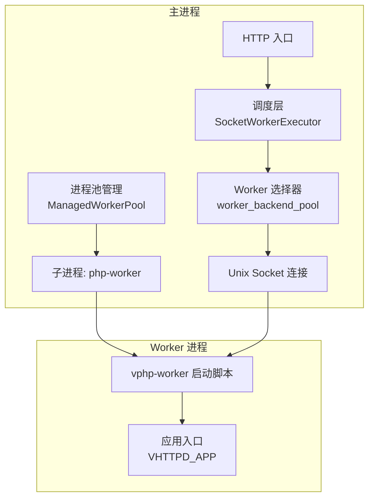
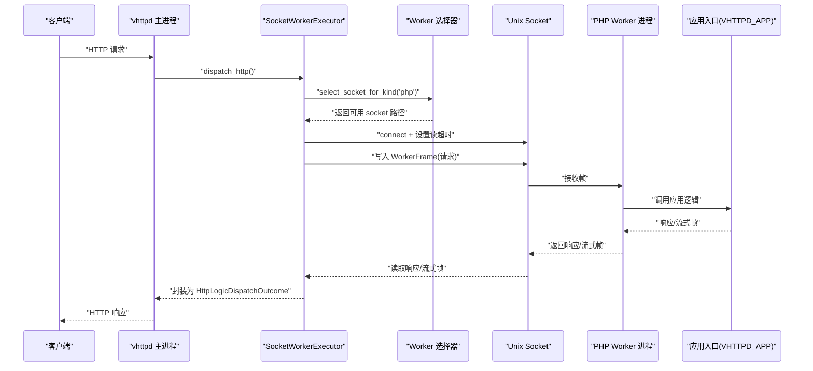
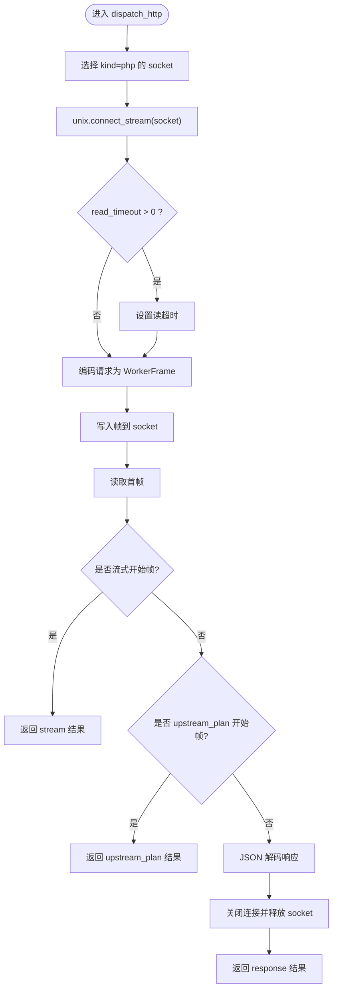
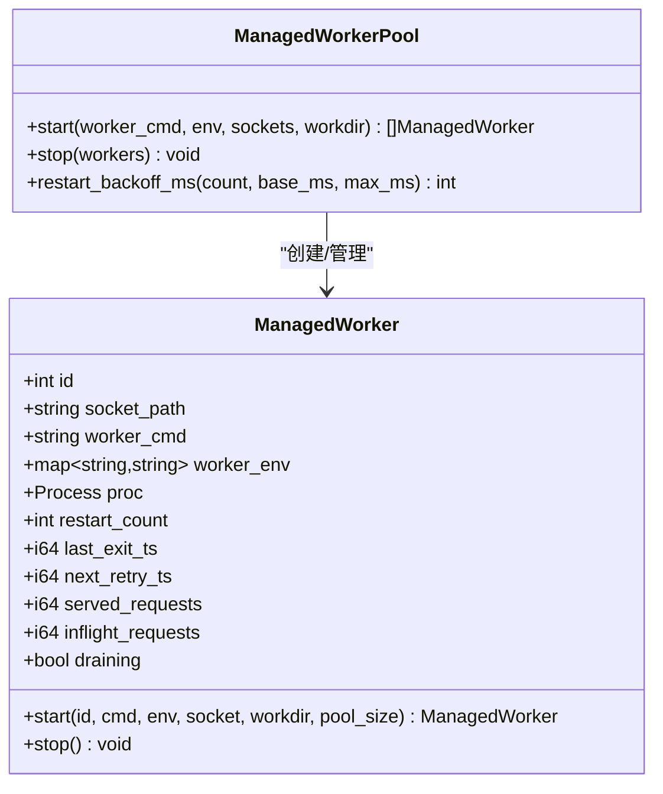
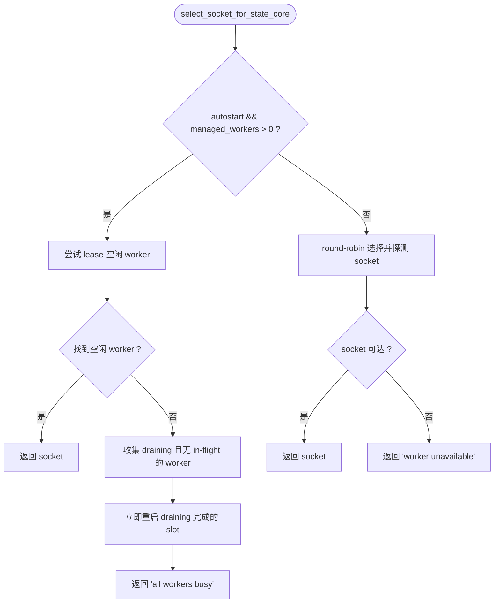
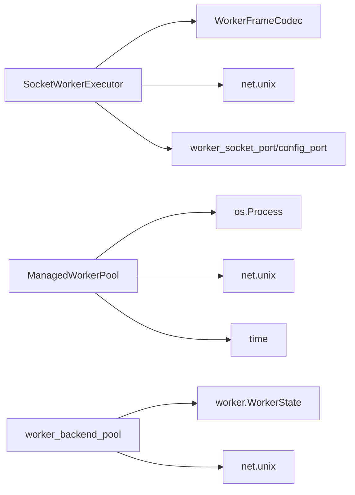

# PHP Worker 执行器

<cite>
**本文引用的文件列表**
- [config/vhttpd.example.toml](file://config/vhttpd.example.toml)
- [vhttpd.toml](file://vhttpd.toml)
- [src/executor/socket_worker_executor.v](file://src/executor/socket_worker_executor.v)
- [src/executor/php_cgi_executor.v](file://src/executor/php_cgi_executor.v)
- [src/upstream/transport/worker_pool.v](file://src/upstream/transport/worker_pool.v)
- [src/worker_backend_pool.v](file://src/worker_backend_pool.v)
- [php/package/bin/vphp-worker](file://php/package/bin/vphp-worker)
- [src/server.v](file://src/server.v)
- [src/lifecycle.v](file://src/executor/lifecycle.v)
- [articles/11-observability.md](file://articles/11-observability.md)
</cite>

## 目录
1. [简介](#简介)
2. [项目结构](#项目结构)
3. [核心组件](#核心组件)
4. [架构总览](#架构总览)
5. [详细组件分析](#详细组件分析)
6. [依赖关系分析](#依赖关系分析)
7. [性能与配置优化](#性能与配置优化)
8. [故障排除指南](#故障排除指南)
9. [结论](#结论)
10. [附录：完整配置项说明](#附录完整配置项说明)

## 简介
本文件系统性说明 vhttpd 中 PHP Worker 执行器的工作原理与配置方法。重点包括：
- PHP Worker 模式如何通过 Unix Socket 与 vhttpd 主进程通信
- worker 池管理、请求分发机制与生命周期管理
- 完整的配置选项（[php] 与 [worker] 节）
- 最佳实践、性能调优、错误处理与监控
- 常见问题排查与解决方案

## 项目结构
PHP Worker 相关的关键代码与配置分布在以下位置：
- 执行器实现：src/executor/socket_worker_executor.v、src/executor/php_cgi_executor.v
- Worker 进程管理与选择：src/upstream/transport/worker_pool.v、src/worker_backend_pool.v
- PHP 侧启动脚本：php/package/bin/vphp-worker
- 示例与默认配置：config/vhttpd.example.toml、vhttpd.toml
- 命令行参数与帮助信息：src/server.v
- 生命周期编排：src/executor/lifecycle.v
- 可观测性与排障参考：articles/11-observability.md

图表来源
- [src/executor/socket_worker_executor.v:43-95](file://src/executor/socket_worker_executor.v#L43-L95)
- [src/worker_backend_pool.v:60-124](file://src/worker_backend_pool.v#L60-L124)
- [src/upstream/transport/worker_pool.v:178-202](file://src/upstream/transport/worker_pool.v#L178-L202)
- [php/package/bin/vphp-worker:55-60](file://php/package/bin/vphp-worker#L55-L60)

章节来源
- [config/vhttpd.example.toml:18-36](file://config/vhttpd.example.toml#L18-L36)
- [vhttpd.toml:8-16](file://vhttpd.toml#L8-L16)

## 核心组件
- SocketWorkerExecutor：负责将 HTTP/WebSocket/流式/MCP 等请求通过 Unix Socket 转发到 PHP Worker，并处理响应或流式帧。
- PhpCgiExecutor：兼容 FastCGI 模式的 PHP 执行器（不支持 WebSocket/流式）。
- ManagedWorkerPool：负责启动、停止、重启 PHP Worker 子进程，维护进程组、环境变量、socket 路径及退避策略。
- worker_backend_pool：在运行时按轮询/空闲优先策略选择可用的 worker socket，支持 draining 与探测。
- vphp-worker：PHP 侧启动脚本，解析 --socket 参数，加载应用入口并运行服务循环。

章节来源
- [src/executor/socket_worker_executor.v:1-41](file://src/executor/socket_worker_executor.v#L1-L41)
- [src/executor/php_cgi_executor.v:1-40](file://src/executor/php_cgi_executor.v#L1-L40)
- [src/upstream/transport/worker_pool.v:37-136](file://src/upstream/transport/worker_pool.v#L37-L136)
- [src/worker_backend_pool.v:16-58](file://src/worker_backend_pool.v#L16-L58)
- [php/package/bin/vphp-worker:55-60](file://php/package/bin/vphp-worker#L55-L60)

## 架构总览
下图展示了从 HTTP 请求进入 vhttpd 到 PHP Worker 处理的端到端流程，以及 Worker 进程的启动与生命周期管理。

图表来源
- [src/executor/socket_worker_executor.v:43-95](file://src/executor/socket_worker_executor.v#L43-L95)
- [src/worker_backend_pool.v:60-124](file://src/worker_backend_pool.v#L60-L124)
- [php/package/bin/vphp-worker:55-60](file://php/package/bin/vphp-worker#L55-L60)

## 详细组件分析

### SocketWorkerExecutor（PHP Worker 执行器）
职责：
- 根据 kind='php' 选择对应 socket
- 建立 Unix Socket 连接，设置读超时
- 编码请求为 WorkerFrame，发送并读取响应
- 支持普通响应、流式响应（SSE/文本流）、上游计划（upstream_plan）
- 提供 WebSocket 会话打开、流式派发、MCP 派发、WebSocket 事件派发等接口

关键流程要点：
- 选择 socket：基于 kind 的专用 socket 集合
- 超时控制：从后端配置获取 read_timeout_ms
- 帧编解码：使用 transport.WorkerFrameCodec 进行读写
- 结果类型：response/stream/upstream_plan

图表来源
- [src/executor/socket_worker_executor.v:43-95](file://src/executor/socket_worker_executor.v#L43-L95)

章节来源
- [src/executor/socket_worker_executor.v:1-157](file://src/executor/socket_worker_executor.v#L1-L157)

### PhpCgiExecutor（FastCGI 兼容执行器）
职责：
- 以 kind='php-cgi' 标识，provider='php-cgi'
- 通过 FastCGI 协议与后端通信（非自定义 WorkerFrame）
- 仅支持 HTTP 响应；不支持 WebSocket/流式/MCP

注意：
- 当需要 WebSocket 或流式能力时，应使用 kind='php' 的 SocketWorkerExecutor

章节来源
- [src/executor/php_cgi_executor.v:1-118](file://src/executor/php_cgi_executor.v#L1-L118)

### Worker 进程池管理（ManagedWorkerPool）
职责：
- 构建并启动多个 PHP Worker 子进程
- 自动注入 --socket 参数或使用 {socket} 占位符
- 合并环境变量，设置工作目录与进程组
- 优雅停止：先 SIGTERM，再 SIGKILL，等待退出
- 启动失败重试与指数退避

关键行为：
- command_with_socket：校验命令格式，避免 pool 模式下重复指定 --socket
- start：启动 /bin/sh 包装命令，重定向日志（针对特定命令），注册子进程 PID
- wait_for_socket：等待 worker 监听 socket 就绪
- restart_backoff_ms：计算下次重启延迟

图表来源
- [src/upstream/transport/worker_pool.v:37-136](file://src/upstream/transport/worker_pool.v#L37-L136)
- [src/upstream/transport/worker_pool.v:178-219](file://src/upstream/transport/worker_pool.v#L178-L219)

章节来源
- [src/upstream/transport/worker_pool.v:1-219](file://src/upstream/transport/worker_pool.v#L1-L219)

### Worker 选择与分配（worker_backend_pool）
职责：
- 在 autostart=true 且存在已管理的 worker 时，优先选择空闲 worker（lease_idle_worker_socket_for_state）
- 若所有 worker 忙，则尝试触发 draining 完成后的立即重启
- 否则回退到 round-robin 选择并探测 socket 可用性
- 记录诊断信息并通过事件上报

图表来源
- [src/worker_backend_pool.v:60-124](file://src/worker_backend_pool.v#L60-L124)

章节来源
- [src/worker_backend_pool.v:1-137](file://src/worker_backend_pool.v#L1-L137)

### PHP 侧启动脚本（vphp-worker）
职责：
- 解析 argv 中的 --socket 参数
- 加载 autoload 或直接引入核心类
- 初始化 Server 实例并运行服务循环
- 暴露 vhttpd_stream_sse/vhttpd_stream_text 辅助函数

章节来源
- [php/package/bin/vphp-worker:1-60](file://php/package/bin/vphp-worker#L1-L60)

### 生命周期编排（php_worker_executor_lifecycle）
职责：
- prepare_bootstrap：根据 [php] 配置构建 worker 命令与环境变量
- start：若 autostart=true，则批量启动 worker 进程，并上报 worker.started/worker.restart_scheduled 事件
- stop：统一停止所有受管 worker

章节来源
- [src/executor/lifecycle.v:84-135](file://src/executor/lifecycle.v#L84-L135)

## 依赖关系分析
- SocketWorkerExecutor 依赖：
  - unix.StreamConn（Unix Socket 连接）
  - transport.WorkerFrameCodec（帧编解码）
  - worker_socket_port/config_port（运行时端口访问）
- ManagedWorkerPool 依赖：
  - os.Process（进程管理）
  - net.unix（socket 探测）
  - time（超时与退避）
- worker_backend_pool 依赖：
  - worker.WorkerState（状态与锁）
  - unix.connect_stream（socket 探测）

图表来源
- [src/executor/socket_worker_executor.v:1-41](file://src/executor/socket_worker_executor.v#L1-L41)
- [src/upstream/transport/worker_pool.v:1-36](file://src/upstream/transport/worker_pool.v#L1-L36)
- [src/worker_backend_pool.v:1-29](file://src/worker_backend_pool.v#L1-L29)

章节来源
- [src/executor/socket_worker_executor.v:1-157](file://src/executor/socket_worker_executor.v#L1-L157)
- [src/upstream/transport/worker_pool.v:1-219](file://src/upstream/transport/worker_pool.v#L1-L219)
- [src/worker_backend_pool.v:1-137](file://src/worker_backend_pool.v#L1-L137)

## 性能与配置优化
- Worker 池大小：建议设置为 CPU 核心数的 1~2 倍，结合业务 I/O 特性调整
- 最大请求数：设置 max_requests 定期重启 worker，缓解内存泄漏风险
- 超时配置：
  - 普通请求：read_timeout_ms 建议 2~5 秒
  - AI 流式请求：可适当增大至 60 秒或更长
- 队列与并发：
  - queue_capacity/queue_timeout_ms 用于限制排队与等待时间
  - 合理设置以避免雪崩
- MCP 与会话：
  - max_sessions/session_ttl_seconds/max_pending_messages 需根据负载评估

章节来源
- [articles/11-observability.md:602-666](file://articles/11-observability.md#L602-L666)

## 故障排除指南
常见症状与定位步骤：
- Worker 未就绪
  - 检查 socket_prefix 与 socket 文件是否存在
  - 查看 ManagedWorkerPool 启动日志与重试退避
  - 确认 vphp-worker 是否能正确解析 --socket 并监听
- 请求超时
  - 核对 read_timeout_ms 配置
  - 观察 worker 是否 busy（inflight_requests 高）
- 内存增长
  - 启用 max_requests 定期重启
  - 监控 admin/workers 指标
- 无法选择 worker
  - 检查 select_socket_for_state 的诊断事件
  - 确认 autostart 与 managed_workers 数量

章节来源
- [src/upstream/transport/worker_pool.v:178-219](file://src/upstream/transport/worker_pool.v#L178-L219)
- [src/worker_backend_pool.v:126-137](file://src/worker_backend_pool.v#L126-L137)
- [articles/11-observability.md:602-666](file://articles/11-observability.md#L602-L666)

## 结论
PHP Worker 执行器通过 Unix Socket 与 vhttpd 主进程高效通信，具备完善的进程池管理、请求分发与生命周期控制。配合合理的配置与监控，可在保证稳定性的同时获得良好的吞吐与低延迟表现。

## 附录：完整配置项说明

### [worker] 节（通用）
- autostart：是否由主进程自动启动 worker 池
- pool_size：worker 进程数量
- socket_prefix：worker socket 前缀（最终 socket 路径由前缀与索引生成）
- read_timeout_ms：worker 请求读超时（毫秒）
- max_requests：每个 worker 的最大请求数，达到后触发重启
- restart_backoff_ms：重启基础退避时间（毫秒）
- restart_backoff_max_ms：重启最大退避时间（毫秒）
- queue_capacity：请求队列容量
- queue_timeout_ms：排队等待超时（毫秒）
- queue_poll_ms：队列轮询间隔（毫秒）
- socket：单 worker 模式下的固定 socket 路径（pool_size=1 时使用）
- cmd：worker 启动命令（支持 {socket} 占位符；pool 模式应避免显式 --socket）

章节来源
- [config/vhttpd.example.toml:19-27](file://config/vhttpd.example.toml#L19-L27)
- [vhttpd.toml:8-16](file://vhttpd.toml#L8-L16)
- [tests/e2e/config_acceptance_test.sh:2229-2295](file://tests/e2e/config_acceptance_test.sh#L2229-L2295)

### [php] 节（PHP 执行器）
- bin：PHP 二进制路径
- worker_entry：PHP worker 引导脚本（如 vphp-worker）
- app_entry：应用入口（会被注入为 VHTTPD_APP 环境变量）
- extensions：PHP 扩展数组（例如 vslim.so）
- args：额外 CLI 参数数组

章节来源
- [config/vhttpd.example.toml:31-36](file://config/vhttpd.example.toml#L31-L36)

### 其他相关配置
- executor.kind：选择执行器种类（php 或 php-cgi）
- server.host/port：HTTP 监听地址与端口
- files.pid_file/event_log：PID 与事件日志路径
- runtime.timezone：时区设置

章节来源
- [config/vhttpd.example.toml:8-17](file://config/vhttpd.example.toml#L8-L17)
- [config/vhttpd.example.toml:28-30](file://config/vhttpd.example.toml#L28-L30)

### 命令行参数（与配置联动）
- --worker-socket-prefix：高级覆盖 worker 池 socket 前缀
- --executor：选择内置执行器种类
- --php-bin/--php-worker-entry/--php-app-entry/--php-extension/--php-arg：动态覆盖 [php] 节参数

章节来源
- [src/server.v:229-252](file://src/server.v#L229-L252)

### 典型配置示例
- 最小化示例（单 worker）
  - [worker] 节设置 autostart=true、pool_size=1、socket 指向临时文件
  - [php] 节设置 worker_entry 与 app_entry
- 多 worker 示例
  - 设置 pool_size=N，使用 socket_prefix 自动生成 N 个 socket
  - 合理设置 read_timeout_ms、max_requests、退避参数

章节来源
- [vhttpd.toml:8-16](file://vhttpd.toml#L8-L16)
- [config/vhttpd.example.toml:19-36](file://config/vhttpd.example.toml#L19-L36)