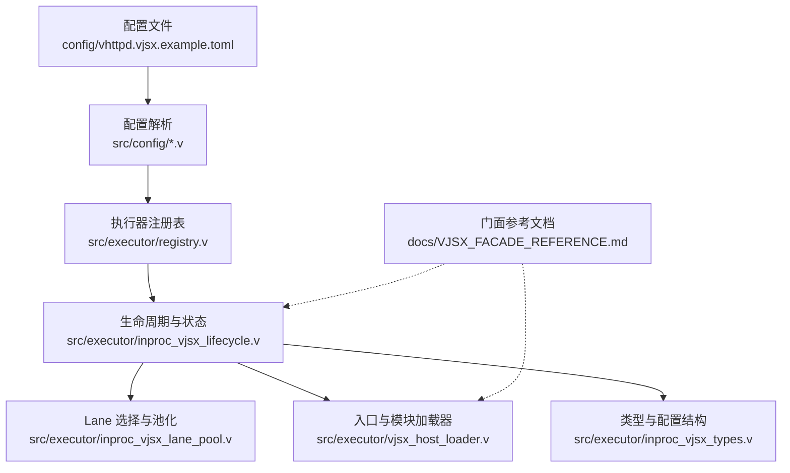
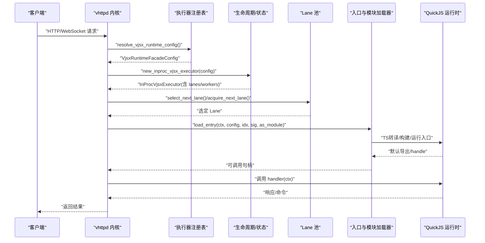
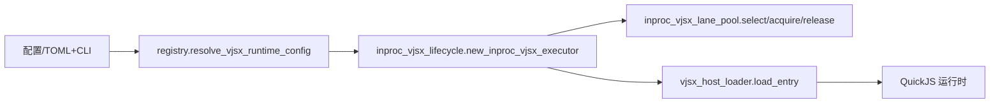

# VJSX 嵌入式执行器

<cite>
**本文引用的文件列表**
- [vhttpd.vjsx.example.toml](file://config/vhttpd.vjsx.example.toml)
- [08-vjsx-intro.md](file://articles/08-vjsx-intro.md)
- [VJSX_FACADE_REFERENCE.md](file://docs/VJSX_FACADE_REFERENCE.md)
- [inproc_vjsx_types.v](file://src/executor/inproc_vjsx_types.v)
- [registry.v](file://src/executor/registry.v)
- [vjsx_host_loader.v](file://src/executor/vjsx_host_loader.v)
- [inproc_vjsx_lifecycle.v](file://src/executor/inproc_vjsx_lifecycle.v)
- [inproc_vjsx_lane_pool.v](file://src/executor/inproc_vjsx_lane_pool.v)
- [runtime_plan_cli_overlay.v](file://src/config/runtime_plan_cli_overlay.v)
- [config.v](file://src/config/config.v)
</cite>

## 目录
1. [简介](#简介)
2. [项目结构](#项目结构)
3. [核心组件](#核心组件)
4. [架构总览](#架构总览)
5. [详细组件分析](#详细组件分析)
6. [依赖关系分析](#依赖关系分析)
7. [性能与线程模型](#性能与线程模型)
8. [配置详解：[vjsx] 选项](#配置详解vjsx-选项)
9. [开发指南与最佳实践](#开发指南与最佳实践)
10. [与 PHP Worker 模式对比](#与-php-worker-模式对比)
11. [故障排查](#故障排查)
12. [结论](#结论)

## 简介
VJSX 是 vhttpd 内置的嵌入式 TypeScript/JavaScript 执行器，基于 QuickJS 引擎在进程内直接运行用户编写的 .mts/.ts/.mjs 等模块。它提供轻量、高性能的 HTTP/WebSocket 处理与宿主能力桥接，适合网关、中间件、协议粘合与快速原型场景。

## 项目结构
围绕 VJSX 的核心代码集中在 src/executor 下的 inproc_vjsx_* 系列模块，配合配置解析与运行时门面（Facade）文档，形成“配置→注册表→生命周期→Lane池→加载器→宿主API”的完整链路。

图表来源
- [vhttpd.vjsx.example.toml:1-36](file://config/vhttpd.vjsx.example.toml#L1-L36)
- [registry.v:197-261](file://src/executor/registry.v#L197-L261)
- [inproc_vjsx_lifecycle.v:16-87](file://src/executor/inproc_vjsx_lifecycle.v#L16-L87)
- [inproc_vjsx_lane_pool.v:5-30](file://src/executor/inproc_vjsx_lane_pool.v#L5-L30)
- [vjsx_host_loader.v:93-111](file://src/executor/vjsx_host_loader.v#L93-L111)
- [inproc_vjsx_types.v:7-24](file://src/executor/inproc_vjsx_types.v#L7-L24)
- [VJSX_FACADE_REFERENCE.md:1-62](file://docs/VJSX_FACADE_REFERENCE.md#L1-L62)

章节来源
- [vhttpd.vjsx.example.toml:1-36](file://config/vhttpd.vjsx.example.toml#L1-L36)
- [registry.v:107-127](file://src/executor/registry.v#L107-L127)
- [inproc_vjsx_lifecycle.v:16-87](file://src/executor/inproc_vjsx_lifecycle.v#L16-L87)
- [inproc_vjsx_lane_pool.v:5-30](file://src/executor/inproc_vjsx_lane_pool.v#L5-L30)
- [vjsx_host_loader.v:93-111](file://src/executor/vjsx_host_loader.v#L93-L111)
- [inproc_vjsx_types.v:7-24](file://src/executor/inproc_vjsx_types.v#L7-L24)
- [VJSX_FACADE_REFERENCE.md:1-62](file://docs/VJSX_FACADE_REFERENCE.md#L1-L62)

## 核心组件
- 执行器注册表：负责将 kind=vjsx 映射为嵌入式工厂，并解析 CLI/配置到 VjsxRuntimeFacadeConfig。
- 生命周期与状态：创建 Lane 集合、启动 lane worker、维护签名与热更新状态。
- Lane 池与调度：按轮询选择空闲且健康的 Lane，支持超时等待与按 ID 精确选择。
- 入口与模块加载器：根据 app_entry 后缀判断模块模式，必要时安装 TS 运行时并构建临时产物，再导入默认导出或 handle 函数。
- 类型与配置结构：定义 VjsxRuntimeFacadeConfig、VjsxExecutionLane、InProcVjsxExecutor 等关键结构。
- 门面参考：对外暴露 ctx、ctx.runtime、WebSocket frame 等 API 约定。

章节来源
- [registry.v:226-261](file://src/executor/registry.v#L226-L261)
- [inproc_vjsx_lifecycle.v:16-87](file://src/executor/inproc_vjsx_lifecycle.v#L16-L87)
- [inproc_vjsx_lane_pool.v:5-30](file://src/executor/inproc_vjsx_lane_pool.v#L5-L30)
- [vjsx_host_loader.v:17-29](file://src/executor/vjsx_host_loader.v#L17-L29)
- [inproc_vjsx_types.v:7-24](file://src/executor/inproc_vjsx_types.v#L7-L24)
- [VJSX_FACADE_REFERENCE.md:8-25](file://docs/VJSX_FACADE_REFERENCE.md#L8-L25)

## 架构总览
下图展示了从请求进入 vhttpd 到 VJSX 嵌入式执行器的关键路径，包括配置解析、执行器选择、Lane 分配、模块加载与调用。

图表来源
- [registry.v:226-261](file://src/executor/registry.v#L226-L261)
- [inproc_vjsx_lifecycle.v:16-87](file://src/executor/inproc_vjsx_lifecycle.v#L16-L87)
- [inproc_vjsx_lane_pool.v:83-101](file://src/executor/inproc_vjsx_lane_pool.v#L83-L101)
- [vjsx_host_loader.v:93-111](file://src/executor/vjsx_host_loader.v#L93-L111)

## 详细组件分析

### 执行器注册与配置解析
- 当 executor.kind = "vjsx" 时，注册表将其识别为嵌入式执行器，并通过 resolve_embedded_host_runtime_config 将 TOML/Cli 参数合并为 EmbeddedHostRuntimeConfig，再转换为 VjsxRuntimeFacadeConfig。
- 关键映射：
  - app_entry → app_entry
  - module_root → module_root
  - build_root → build_root
  - runtime_profile → runtime_profile
  - thread_count → lane_count → thread_count
  - enable_fs/process/network 透传
  - websocket_affinity/actor 透传

章节来源
- [registry.v:197-261](file://src/executor/registry.v#L197-L261)
- [registry.v:107-127](file://src/executor/registry.v#L107-L127)

### 生命周期与 Lane 管理
- new_inproc_vjsx_executor 依据 thread_count 初始化若干 VjsxExecutionLane，并为每个 Lane 准备 worker 通道（websocket/snapshot/warmup/pump/affinity）。
- 维护 source_probe/signature 缓存，用于增量热更新与预热。
- admin_details/lane_snapshot 暴露运行时元数据与 Lane 健康度。

章节来源
- [inproc_vjsx_lifecycle.v:16-87](file://src/executor/inproc_vjsx_lifecycle.v#L16-L87)
- [inproc_vjsx_lifecycle.v:102-155](file://src/executor/inproc_vjsx_lifecycle.v#L102-L155)

### Lane 选择与并发控制
- select_next_lane 使用轮询 + 健康检查 + inflight 计数，避免将请求派发至忙碌或不健康 Lane。
- acquire_next_lane 支持带超时的重试等待；release_lane 在请求完成后减少 inflight 并尝试调度 WebSocket 邮箱任务。

章节来源
- [inproc_vjsx_lane_pool.v:5-30](file://src/executor/inproc_vjsx_lane_pool.v#L5-L30)
- [inproc_vjsx_lane_pool.v:83-101](file://src/executor/inproc_vjsx_lane_pool.v#L83-L101)
- [inproc_vjsx_lane_pool.v:126-143](file://src/executor/inproc_vjsx_lane_pool.v#L126-L143)

### 入口与模块加载器
- entry_runs_as_module 根据后缀判定是否作为模块运行（.mts/.ts/.mjs/.cjs 等），否则以脚本模式运行。
- load_entry 会：
  - 若为 TS/运行时模块，安装 TS 运行时
  - 构建产物到 lane 专属临时目录（含 pid/lane 信息）
  - 生成 loader 包装，统一导出 default/handle/globalThis.__vhttpd_handle
- fs_roots 决定模块解析根目录（module_root/app_entry 所在目录与工作目录）。

章节来源
- [vjsx_host_loader.v:17-29](file://src/executor/vjsx_host_loader.v#L17-L29)
- [vjsx_host_loader.v:31-41](file://src/executor/vjsx_host_loader.v#L31-L41)
- [vjsx_host_loader.v:74-91](file://src/executor/vjsx_host_loader.v#L74-L91)
- [vjsx_host_loader.v:93-111](file://src/executor/vjsx_host_loader.v#L93-L111)

### 类型与配置结构
- VjsxRuntimeFacadeConfig 承载所有运行时开关与路径、线程数、网络/FS/进程权限等。
- VjsxExecutionLane 记录 id、served_requests、healthy/dirty、inflight、last_error 等。
- InProcVjsxExecutor 持有共享状态与对外接口。

章节来源
- [inproc_vjsx_types.v:7-24](file://src/executor/inproc_vjsx_types.v#L7-L24)
- [inproc_vjsx_types.v:33-42](file://src/executor/inproc_vjsx_types.v#L33-L42)
- [inproc_vjsx_types.v:44-90](file://src/executor/inproc_vjsx_types.v#L44-L90)

### 门面与 API 约定
- 入口解析顺序：export default → export const handle → globalThis.__vhttpd_handle。
- ctx.runtime 提供只读元信息与日志/事件/快照/IO/网络/桥接方法。
- WebSocket 帧与 upstream 帧字段、返回值形状均有明确约定。

章节来源
- [VJSX_FACADE_REFERENCE.md:8-25](file://docs/VJSX_FACADE_REFERENCE.md#L8-L25)
- [VJSX_FACADE_REFERENCE.md:26-62](file://docs/VJSX_FACADE_REFERENCE.md#L26-L62)
- [VJSX_FACADE_REFERENCE.md:204-280](file://docs/VJSX_FACADE_REFERENCE.md#L204-L280)

## 依赖关系分析
- 配置层：TOML/Cli 通过 runtime_plan_cli_overlay 与 embedded host 配置合并，最终落到 registry 的 resolve_vjsx_runtime_config。
- 执行层：生命周期创建 Lane 与 worker，Lane 池负责调度，加载器负责 TS 编译与模块装载。
- 外部依赖：QuickJS 运行时由 vjsx.* 模块驱动；TS 转译与运行时注入由 vjsx.runtimejs 完成。

图表来源
- [registry.v:226-261](file://src/executor/registry.v#L226-L261)
- [inproc_vjsx_lifecycle.v:16-87](file://src/executor/inproc_vjsx_lifecycle.v#L16-L87)
- [inproc_vjsx_lane_pool.v:5-30](file://src/executor/inproc_vjsx_lane_pool.v#L5-L30)
- [vjsx_host_loader.v:93-111](file://src/executor/vjsx_host_loader.v#L93-L111)

章节来源
- [registry.v:226-261](file://src/executor/registry.v#L226-L261)
- [inproc_vjsx_lifecycle.v:16-87](file://src/executor/inproc_vjsx_lifecycle.v#L16-L87)
- [inproc_vjsx_lane_pool.v:5-30](file://src/executor/inproc_vjsx_lane_pool.v#L5-L30)
- [vjsx_host_loader.v:93-111](file://src/executor/vjsx_host_loader.v#L93-L111)

## 性能与线程模型
- 线程/Lane 模型：thread_count 决定 Lane 数量，每个 Lane 对应一个独立的 QuickJS 上下文与 worker 协程，内部通过 channel 分发 WebSocket/快照/预热/泵任务。
- 调度策略：轮询 + 健康检查 + inflight 计数，避免热点过载；支持按 lane_id 精准路由（如粘性会话）。
- 内存与资源：
  - 构建产物位于 lane 专属临时目录（含 pid/lane 索引），便于隔离与清理。
  - 源码探针与签名缓存用于增量热更新，降低重启成本。
  - 当前嵌入范围限定于 HTTP 与 WebSocket 事件分发，流式/MCP worker 模式不在此门面范围内。

章节来源
- [inproc_vjsx_lifecycle.v:16-87](file://src/executor/inproc_vjsx_lifecycle.v#L16-L87)
- [inproc_vjsx_lane_pool.v:5-30](file://src/executor/inproc_vjsx_lane_pool.v#L5-L30)
- [vjsx_host_loader.v:74-91](file://src/executor/vjsx_host_loader.v#L74-L91)
- [VJSX_FACADE_REFERENCE.md:196-202](file://docs/VJSX_FACADE_REFERENCE.md#L196-L202)

## 配置详解：[vjsx] 选项
以下选项来自示例配置与注册表解析逻辑，说明其作用与典型用法。

- app_entry
  - 作用：应用入口文件路径（支持相对/绝对路径）
  - 解析：由 TOML 的 [vjsx].app_entry 或 CLI --vjsx-entry 覆盖
  - 影响：模块加载器据此确定模块模式与构建产物位置
  - 参考路径
    - [vhttpd.vjsx.example.toml:21-25](file://config/vhttpd.vjsx.example.toml#L21-L25)
    - [registry.v:201-214](file://src/executor/registry.v#L201-L214)

- module_root
  - 作用：模块解析根目录，优先于工作目录
  - 解析：TOML [vjsx].module_root 或 CLI --vjsx-module-root
  - 影响：fs_roots() 会将 module_root 加入解析根
  - 参考路径
    - [vhttpd.vjsx.example.toml:22-24](file://config/vhttpd.vjsx.example.toml#L22-L24)
    - [vjsx_host_loader.v:31-41](file://src/executor/vjsx_host_loader.v#L31-L41)

- build_root
  - 作用：TS 转译与构建产物根目录；未设置时使用系统临时目录下的 vhttpd_vjsx
  - 解析：TOML [vjsx].build_root 或 CLI --vjsx-build-root
  - 影响：lane_temp_root 组合 entry_name/source_signature/pid/lane 生成唯一子目录
  - 参考路径
    - [vjsx_host_loader.v:74-91](file://src/executor/vjsx_host_loader.v#L74-L91)

- runtime_profile
  - 作用：运行时配置集（例如 node/script），影响全局环境与行为
  - 解析：TOML [vjsx].runtime_profile 或 CLI --vjsx-runtime-profile
  - 参考路径
    - [vhttpd.vjsx.example.toml:24](file://config/vhttpd.vjsx.example.toml#L24)
    - [registry.v:208](file://src/executor/registry.v#L208)

- thread_count
  - 作用：执行线程/Lane 数量，建议接近 CPU 核心数
  - 解析：TOML [vjsx].thread_count 或 CLI --vjsx-thread-count
  - 影响：new_inproc_vjsx_executor 据此创建 lanes 与 workers
  - 参考路径
    - [vhttpd.vjsx.example.toml:25](file://config/vhttpd.vjsx.example.toml#L25)
    - [inproc_vjsx_lifecycle.v:17-24](file://src/executor/inproc_vjsx_lifecycle.v#L17-L24)
    - [runtime_plan_cli_overlay.v:204-206](file://src/config/runtime_plan_cli_overlay.v#L204-L206)

- 其他相关开关（可选）
  - enable_fs / enable_process / enable_network：控制宿主能力白名单
  - max_requests：单 Lane 最大请求数（用于优雅重启/回收）
  - websocket_affinity / websocket_actor：WebSocket 粘性与 Actor 策略
  - 参考路径
    - [inproc_vjsx_types.v:17-24](file://src/executor/inproc_vjsx_types.v#L17-L24)
    - [registry.v:254-260](file://src/executor/registry.v#L254-L260)

章节来源
- [vhttpd.vjsx.example.toml:21-25](file://config/vhttpd.vjsx.example.toml#L21-L25)
- [registry.v:201-214](file://src/executor/registry.v#L201-L214)
- [vjsx_host_loader.v:31-41](file://src/executor/vjsx_host_loader.v#L31-L41)
- [vjsx_host_loader.v:74-91](file://src/executor/vjsx_host_loader.v#L74-L91)
- [inproc_vjsx_lifecycle.v:17-24](file://src/executor/inproc_vjsx_lifecycle.v#L17-L24)
- [runtime_plan_cli_overlay.v:204-206](file://src/config/runtime_plan_cli_overlay.v#L204-L206)
- [inproc_vjsx_types.v:17-24](file://src/executor/inproc_vjsx_types.v#L17-L24)
- [registry.v:254-260](file://src/executor/registry.v#L254-L260)

## 开发指南与最佳实践
- 入口约定
  - 推荐导出 default 函数；其次支持 export const handle 或 globalThis.__vhttpd_handle
  - Bot 风格也可导出 http/websocket/websocket_upstream/snapshot 等命名
  - 参考路径
    - [VJSX_FACADE_REFERENCE.md:8-25](file://docs/VJSX_FACADE_REFERENCE.md#L8-L25)

- 模块与依赖
  - 使用 .mts/.ts 获得类型检查；.mjs/.cjs 可作为 ES 模块
  - 模块解析根优先 module_root，其次 app_entry 所在目录，最后工作目录
  - 参考路径
    - [vjsx_host_loader.v:17-29](file://src/executor/vjsx_host_loader.v#L17-L29)
    - [vjsx_host_loader.v:31-41](file://src/executor/vjsx_host_loader.v#L31-L41)

- 调试技巧
  - 使用 ctx.runtime.log/warn/error 输出日志
  - 使用 ctx.runtime.snapshot 获取运行时快照
  - 查看 Admin Plane 的事件日志定位问题
  - 参考路径
    - [VJSX_FACADE_REFERENCE.md:44-62](file://docs/VJSX_FACADE_REFERENCE.md#L44-L62)
    - [08-vjsx-intro.md:720-733](file://articles/08-vjsx-intro.md#L720-L733)

- 性能优化
  - 合理设置 thread_count（接近 CPU 核心数）
  - 利用 ctx.runtime.httpFetch 发起外部请求时做好超时与重试
  - 使用本地 Map/Set 做轻量缓存，避免重复计算
  - 参考路径
    - [inproc_vjsx_lifecycle.v:17-24](file://src/executor/inproc_vjsx_lifecycle.v#L17-L24)
    - [VJSX_FACADE_REFERENCE.md:54-56](file://docs/VJSX_FACADE_REFERENCE.md#L54-L56)

## 与 PHP Worker 模式对比
- 适用场景
  - VJSX：薄逻辑层、网关/中间件、协议粘合、快速原型、低开销高并发
  - PHP Worker：复杂业务、生态丰富、长期任务、数据库密集
- 差异点
  - 执行模型：VJSX 嵌入式（进程内 QuickJS），PHP Worker 独立进程/CGI
  - 依赖管理：VJSX 轻量、无 npm；PHP 生态成熟
  - 生命周期：VJSX 基于 Lane 与签名热更；PHP Worker 有显式 worker 入口
- 参考路径
  - [08-vjsx-intro.md:28-41](file://articles/08-vjsx-intro.md#L28-L41)
  - [registry.v:79-127](file://src/executor/registry.v#L79-L127)

## 故障排查
- 常见错误
  - 缺少 app_entry 或路径不存在：注册表会在解析阶段报错并给出明确提示
  - 不支持的入口后缀：加载器会拒绝非 .js/.mjs/.cjs/.mts/.cts 等
  - 无可用 Lane：Lane 池在全部忙或不健康时会返回错误
- 定位手段
  - 使用 ctx.runtime.error 记录异常堆栈
  - 使用 ctx.runtime.snapshot 观察各 Lane 健康与负载
  - 检查 build_root 下 lane 专属目录是否存在构建产物
- 参考路径
  - [registry.v:230-243](file://src/executor/registry.v#L230-L243)
  - [vjsx_host_loader.v:17-29](file://src/executor/vjsx_host_loader.v#L17-L29)
  - [inproc_vjsx_lane_pool.v:83-101](file://src/executor/inproc_vjsx_lane_pool.v#L83-L101)

## 结论
VJSX 嵌入式执行器以“配置→注册表→生命周期→Lane 池→加载器→宿主 API”的清晰分层，提供了在 vhttpd 进程内高效运行 TypeScript/JavaScript 的能力。通过合理的 thread_count、module_root/build_root 与 runtime_profile 配置，结合 ctx/runtime 提供的丰富能力，开发者可在网关、中间件与协议适配场景中快速落地。对于复杂业务与长生命周期任务，仍建议采用 PHP Worker 模式，二者可按需组合使用。