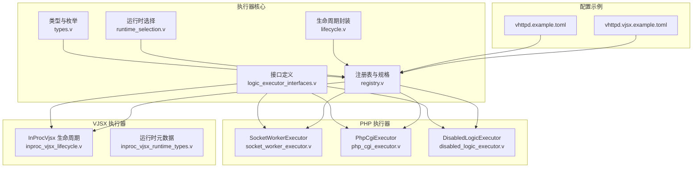
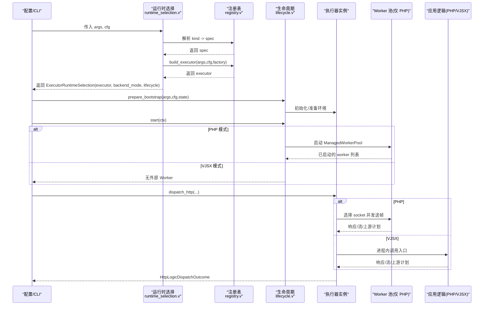
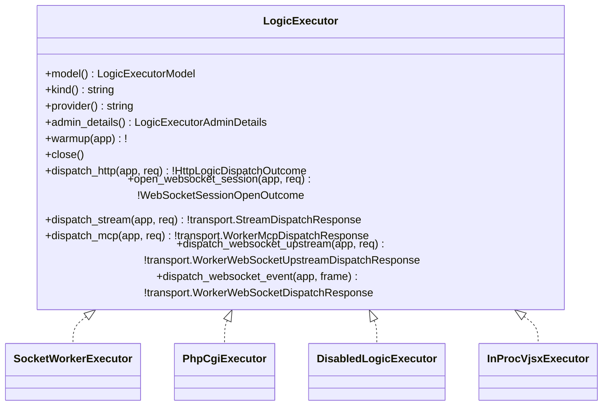
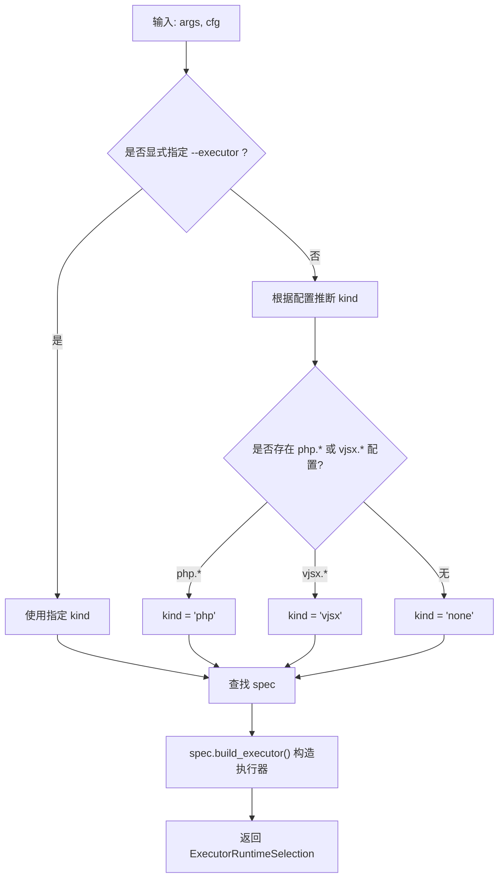
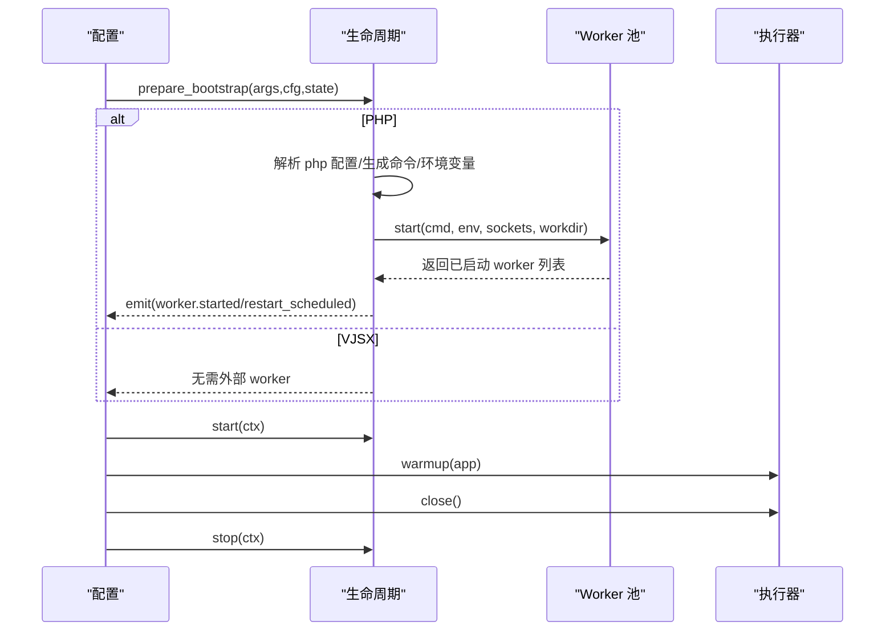
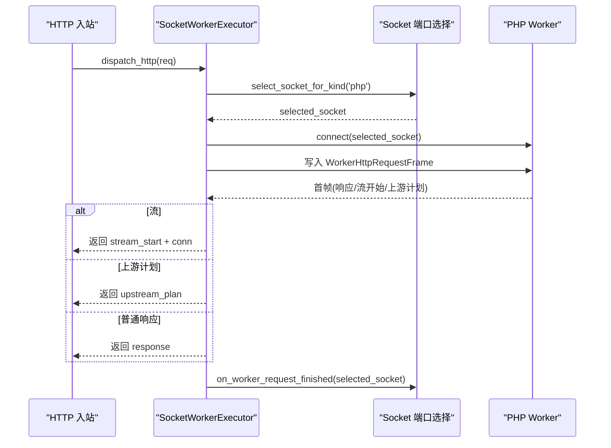
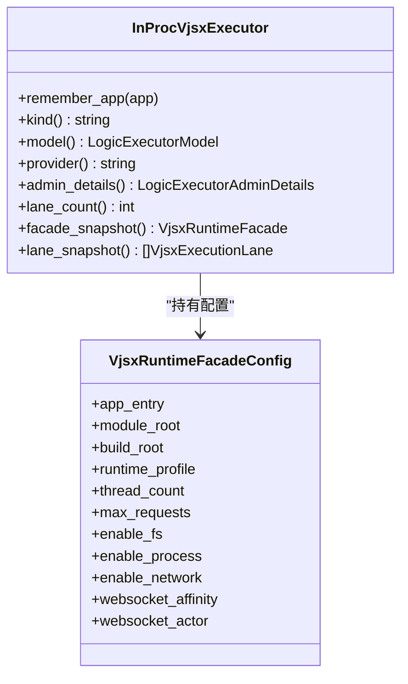
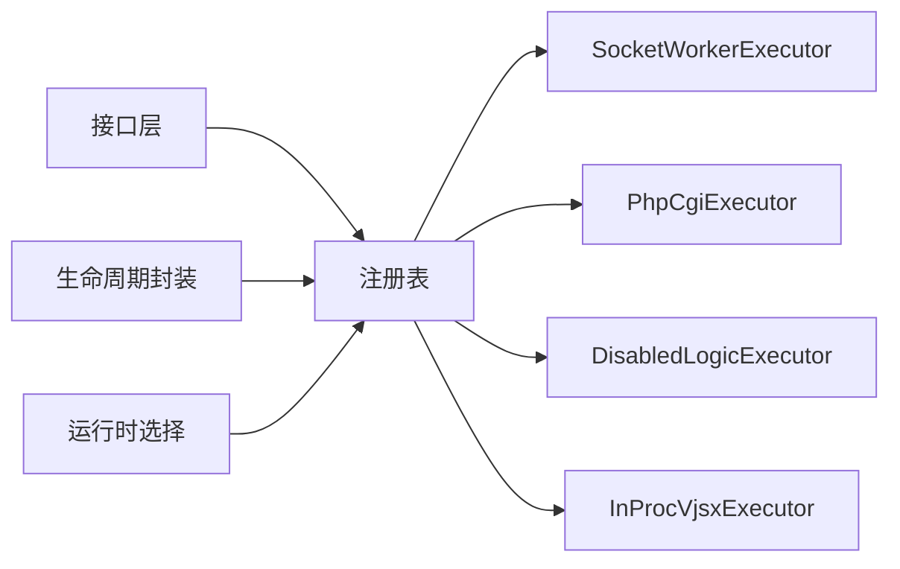

# 执行器模式

<cite>
**本文引用的文件**   
- [EXECUTOR_MODES.md](file://docs/EXECUTOR_MODES.md)
- [logic_executor_interfaces.v](file://src/executor/logic_executor_interfaces.v)
- [types.v](file://src/executor/types.v)
- [registry.v](file://src/executor/registry.v)
- [runtime_selection.v](file://src/executor/runtime_selection.v)
- [lifecycle.v](file://src/executor/lifecycle.v)
- [socket_worker_executor.v](file://src/executor/socket_worker_executor.v)
- [php_cgi_executor.v](file://src/executor/php_cgi_executor.v)
- [disabled_logic_executor.v](file://src/executor/disabled_logic_executor.v)
- [inproc_vjsx_lifecycle.v](file://src/executor/inproc_vjsx_lifecycle.v)
- [inproc_vjsx_runtime_types.v](file://src/executor/inproc_vjsx_runtime_types.v)
- [vhttpd.example.toml](file://config/vhttpd.example.toml)
- [vhttpd.vjsx.example.toml](file://config/vhttpd.vjsx.example.toml)
</cite>

## 目录
1. [简介](#简介)
2. [项目结构](#项目结构)
3. [核心组件](#核心组件)
4. [架构总览](#架构总览)
5. [详细组件分析](#详细组件分析)
6. [依赖关系分析](#依赖关系分析)
7. [性能考虑](#性能考虑)
8. [故障排查指南](#故障排查指南)
9. [结论](#结论)
10. [附录](#附录)

## 简介
本文件系统性阐述 VHTTPD 的“执行器模式”架构与实现，重点解释两个正交特性：
- logic_executor_model（worker / embedded）：决定逻辑执行的模型是“外部 Worker 进程 + Unix Socket”还是“进程内嵌入式执行”。
- worker_backend_mode（required / disabled）：决定是否需要后端 Worker 池。当为 required 时，必须拉起并管理 Worker；当为 disabled 时，禁用所有需要 Worker 的后端能力。

内置执行器包括：
- PHP 执行器：通过 Unix Socket 将请求分发到 PHP Worker 进程。
- VJSX 执行器：在 vhttpd 进程内嵌入 VJSX 运行时进行执行。

此外还包含一个“禁用”执行器用于关闭逻辑处理路径。

## 项目结构
执行器相关代码集中在 src/executor 目录下，围绕统一接口、注册表、生命周期与具体实现展开。配置示例位于 config 目录。

图示来源
- [logic_executor_interfaces.v:1-51](file://src/executor/logic_executor_interfaces.v#L1-L51)
- [types.v:65-91](file://src/executor/types.v#L65-L91)
- [registry.v:65-127](file://src/executor/registry.v#L65-L127)
- [runtime_selection.v:1-31](file://src/executor/runtime_selection.v#L1-L31)
- [lifecycle.v:17-42](file://src/executor/lifecycle.v#L17-L42)
- [socket_worker_executor.v:1-157](file://src/executor/socket_worker_executor.v#L1-L157)
- [php_cgi_executor.v:1-118](file://src/executor/php_cgi_executor.v#L1-L118)
- [disabled_logic_executor.v:1-81](file://src/executor/disabled_logic_executor.v#L1-L81)
- [inproc_vjsx_lifecycle.v:1-155](file://src/executor/inproc_vjsx_lifecycle.v#L1-L155)
- [inproc_vjsx_runtime_types.v:1-37](file://src/executor/inproc_vjsx_runtime_types.v#L1-L37)
- [vhttpd.example.toml:1-67](file://config/vhttpd.example.toml#L1-L67)
- [vhttpd.vjsx.example.toml:1-37](file://config/vhttpd.vjsx.example.toml#L1-L37)

章节来源
- [EXECUTOR_MODES.md:1-136](file://docs/EXECUTOR_MODES.md#L1-L136)
- [logic_executor_interfaces.v:1-51](file://src/executor/logic_executor_interfaces.v#L1-L51)
- [types.v:65-91](file://src/executor/types.v#L65-L91)
- [registry.v:65-127](file://src/executor/registry.v#L65-L127)
- [runtime_selection.v:1-31](file://src/executor/runtime_selection.v#L1-L31)
- [lifecycle.v:17-42](file://src/executor/lifecycle.v#L17-L42)
- [socket_worker_executor.v:1-157](file://src/executor/socket_worker_executor.v#L1-L157)
- [php_cgi_executor.v:1-118](file://src/executor/php_cgi_executor.v#L1-L118)
- [disabled_logic_executor.v:1-81](file://src/executor/disabled_logic_executor.v#L1-L81)
- [inproc_vjsx_lifecycle.v:1-155](file://src/executor/inproc_vjsx_lifecycle.v#L1-L155)
- [inproc_vjsx_runtime_types.v:1-37](file://src/executor/inproc_vjsx_runtime_types.v#L1-L37)
- [vhttpd.example.toml:1-67](file://config/vhttpd.example.toml#L1-L67)
- [vhttpd.vjsx.example.toml:1-37](file://config/vhttpd.vjsx.example.toml#L1-L37)

## 核心组件
- 统一接口层
  - LogicExecutor 及其子接口定义了 HTTP/WebSocket/Stream/MCP 等调度入口，以及 warmup/close 生命周期钩子。
- 类型与枚举
  - LogicExecutorModel（worker/embedded）、WorkerBackendMode（required/disabled）描述执行模型与后端需求。
  - 多种 Admin 统计与摘要结构用于可观测性。
- 注册表与规格
  - BuiltinLogicExecutorSpec 声明每个内置执行器的 kind、provider、model、backend_mode、lifecycle、factory 及配置映射。
  - runtime_selection 根据 CLI 或配置推断 kind，并返回 ExecutorRuntimeSelection（含 executor、worker_backend_mode、lifecycle）。
- 生命周期封装
  - LogicExecutorLifecycle 以函数指针形式提供 prepare_bootstrap/start/stop，避免循环依赖，同时暴露 name() 给上层。
- 具体执行器
  - SocketWorkerExecutor：基于 Unix Socket 的 PHP Worker 分发。
  - PhpCgiExecutor：基于 FastCGI 的 PHP CGI 分发。
  - DisabledLogicExecutor：禁用所有逻辑处理。
  - InProcVjsxExecutor：进程内 VJSX 执行器，维护 lanes、workers、mailbox、affinity 等状态。

章节来源
- [logic_executor_interfaces.v:1-51](file://src/executor/logic_executor_interfaces.v#L1-L51)
- [types.v:65-91](file://src/executor/types.v#L65-L91)
- [registry.v:65-127](file://src/executor/registry.v#L65-L127)
- [runtime_selection.v:1-31](file://src/executor/runtime_selection.v#L1-L31)
- [lifecycle.v:17-42](file://src/executor/lifecycle.v#L17-L42)
- [socket_worker_executor.v:1-157](file://src/executor/socket_worker_executor.v#L1-L157)
- [php_cgi_executor.v:1-118](file://src/executor/php_cgi_executor.v#L1-L118)
- [disabled_logic_executor.v:1-81](file://src/executor/disabled_logic_executor.v#L1-L81)
- [inproc_vjsx_lifecycle.v:1-155](file://src/executor/inproc_vjsx_lifecycle.v#L1-L155)

## 架构总览
下图展示从配置解析到执行器实例化、生命周期启动与请求分发的整体流程。

图示来源
- [runtime_selection.v:23-31](file://src/executor/runtime_selection.v#L23-L31)
- [registry.v:263-286](file://src/executor/registry.v#L263-L286)
- [lifecycle.v:84-134](file://src/executor/lifecycle.v#L84-L134)
- [socket_worker_executor.v:43-95](file://src/executor/socket_worker_executor.v#L43-L95)
- [inproc_vjsx_lifecycle.v:16-86](file://src/executor/inproc_vjsx_lifecycle.v#L16-L86)

## 详细组件分析

### 统一接口与类型
- 接口设计
  - LogicExecutorIdentity：model()/kind()/provider()/admin_details()
  - LogicExecutorLifecycleOps：warmup()/close()
  - 各调度接口：Http/WS/Stream/MCP/Upstream/Event
- 关键类型
  - LogicExecutorModel：worker/embedded
  - WorkerBackendMode：required/disabled
  - 各类 Admin 统计与摘要结构

图示来源
- [logic_executor_interfaces.v:1-51](file://src/executor/logic_executor_interfaces.v#L1-L51)
- [socket_worker_executor.v:1-157](file://src/executor/socket_worker_executor.v#L1-L157)
- [php_cgi_executor.v:1-118](file://src/executor/php_cgi_executor.v#L1-L118)
- [disabled_logic_executor.v:1-81](file://src/executor/disabled_logic_executor.v#L1-L81)
- [inproc_vjsx_lifecycle.v:1-155](file://src/executor/inproc_vjsx_lifecycle.v#L1-L155)

章节来源
- [logic_executor_interfaces.v:1-51](file://src/executor/logic_executor_interfaces.v#L1-L51)
- [types.v:65-91](file://src/executor/types.v#L65-L91)

### 注册表与运行时选择
- 内置规格
  - none/noop/disabled：logic_model=worker，worker_backend_mode=disabled
  - php/php-cgi：logic_model=worker，worker_backend_mode=required
  - vjsx：logic_model=embedded，worker_backend_mode=disabled
- 配置面映射
  - 每种执行器定义其 TOML section 与 CLI flags 的映射，便于统一解析与校验。
- 构建与选择
  - resolve() 优先使用 --executor，否则按配置推断 kind，再调用 spec.runtime_selection() 得到最终选择。

图示来源
- [runtime_selection.v:12-31](file://src/executor/runtime_selection.v#L12-L31)
- [registry.v:65-127](file://src/executor/registry.v#L65-L127)
- [registry.v:263-286](file://src/executor/registry.v#L263-L286)

章节来源
- [registry.v:65-127](file://src/executor/registry.v#L65-L127)
- [runtime_selection.v:1-31](file://src/executor/runtime_selection.v#L1-L31)

### 生命周期管理（启动/关闭）
- 通用封装
  - LogicExecutorLifecycle 提供 prepare_bootstrap/start/stop 三阶段，name() 暴露当前宿主标签。
- PHP Worker 生命周期
  - prepare_bootstrap：解析 php 配置，生成命令与环境变量（如 VHTTPD_APP），必要时校验入口与扩展。
  - start：若 autostart=true，则拉起 ManagedWorkerPool，并广播 worker.started/worker.restart_scheduled 事件。
  - stop：停止所有受管 worker。
- VJSX 生命周期
  - prepare_bootstrap：清空 worker 相关字段，禁用外部 worker。
  - start/stop：无外部进程操作，内部由 lanes/workers 管理。
- 禁用生命周期
  - 全部空实现，不启动任何后端。

图示来源
- [lifecycle.v:84-134](file://src/executor/lifecycle.v#L84-L134)
- [lifecycle.v:158-178](file://src/executor/lifecycle.v#L158-L178)
- [lifecycle.v:59-80](file://src/executor/lifecycle.v#L59-L80)

章节来源
- [lifecycle.v:17-42](file://src/executor/lifecycle.v#L17-L42)
- [lifecycle.v:84-134](file://src/executor/lifecycle.v#L84-L134)
- [lifecycle.v:158-178](file://src/executor/lifecycle.v#L158-L178)

### PHP 执行器（Socket Worker）
- 行为特征
  - model=worker，worker_backend_mode=required
  - 通过 Unix Socket 连接选定的 worker，编码请求帧，读取响应/流/上游计划。
  - 支持 WebSocket 会话打开、Stream/MCP/Upstream/Event 分发。
- 错误与超时
  - 连接失败、读写失败会释放 socket 并返回错误；支持读超时设置。

图示来源
- [socket_worker_executor.v:43-95](file://src/executor/socket_worker_executor.v#L43-L95)

章节来源
- [socket_worker_executor.v:1-157](file://src/executor/socket_worker_executor.v#L1-L157)

### PHP CGI 执行器
- 行为特征
  - model=worker，worker_backend_mode=required
  - 通过 FastCGI 协议与外部 php-cgi 通信，不支持 WS/Stream/MCP/Upstream/Event。
- 错误处理
  - 非 HTTP 场景直接返回错误信息。

章节来源
- [php_cgi_executor.v:1-118](file://src/executor/php_cgi_executor.v#L1-L118)

### 禁用执行器
- 行为特征
  - 所有调度方法均返回“逻辑执行器被禁用”的错误，适用于只托管静态资源或不启用业务逻辑的场景。

章节来源
- [disabled_logic_executor.v:1-81](file://src/executor/disabled_logic_executor.v#L1-L81)

### VJSX 嵌入式执行器
- 行为特征
  - model=embedded，worker_backend_mode=disabled
  - 在进程内创建若干 lane，每个 lane 对应一个 host 与 worker，维护 mailbox、affinity、snapshot 等。
  - 通过 InProcVjsxExecutor.remember_app() 注入 AppFacade，供后续调度使用。
- 运行时元数据
  - InProcVjsxRuntimeMeta 携带 provider、executor、lane_id、request_id、trace_id、app_entry、module_root、build_root、thread_count、权限开关等上下文。

图示来源
- [inproc_vjsx_lifecycle.v:16-86](file://src/executor/inproc_vjsx_lifecycle.v#L16-L86)
- [inproc_vjsx_lifecycle.v:89-155](file://src/executor/inproc_vjsx_lifecycle.v#L89-L155)
- [inproc_vjsx_runtime_types.v:1-37](file://src/executor/inproc_vjsx_runtime_types.v#L1-L37)

章节来源
- [inproc_vjsx_lifecycle.v:1-155](file://src/executor/inproc_vjsx_lifecycle.v#L1-L155)
- [inproc_vjsx_runtime_types.v:1-37](file://src/executor/inproc_vjsx_runtime_types.v#L1-L37)

## 依赖关系分析
- 耦合与内聚
  - 接口层高度内聚，具体执行器仅依赖 transport 编解码与系统 IO。
  - 注册表集中管理规格与工厂，降低散落的分支判断。
- 外部依赖
  - PHP 执行器依赖外部进程与 Unix Socket/FastCGI。
  - VJSX 执行器依赖进程内运行时与状态存储。
- 可能的循环依赖规避
  - 生命周期采用函数指针而非接口，避免与主模块循环引用。

图示来源
- [logic_executor_interfaces.v:1-51](file://src/executor/logic_executor_interfaces.v#L1-L51)
- [registry.v:65-127](file://src/executor/registry.v#L65-L127)
- [lifecycle.v:17-42](file://src/executor/lifecycle.v#L17-L42)
- [runtime_selection.v:1-31](file://src/executor/runtime_selection.v#L1-L31)

章节来源
- [registry.v:65-127](file://src/executor/registry.v#L65-L127)
- [lifecycle.v:17-42](file://src/executor/lifecycle.v#L17-L42)
- [runtime_selection.v:1-31](file://src/executor/runtime_selection.v#L1-L31)

## 性能考虑
- PHP Worker 模式
  - 合理设置 pool_size、read_timeout_ms、max_requests、restart_backoff_*，平衡吞吐与稳定性。
  - 长连接/流式场景需关注 read_timeout 与队列深度。
- VJSX 嵌入式模式
  - thread_count 控制并发 lane 数，结合内存与 CPU 核数调优。
  - enable_fs/enable_process/enable_network 按需开启以减少攻击面与开销。
- 通用建议
  - 监控 admin 指标（HTTP/Worker/Upstream/MCP/Feishu 统计）定位瓶颈。
  - 对高延迟后端增加超时与重试退避策略。

[本节为通用指导，不直接分析具体文件]

## 故障排查指南
- 常见错误
  - 未找到 worker_entry/app_entry/extensions：检查路径与权限。
  - 无法连接 worker socket：确认 socket_prefix/pool_size 与进程存活。
  - FastCGI 解码失败：检查 php-cgi 进程与参数。
  - 执行器被禁用：确认 executor.kind 与 worker_backend_mode 匹配。
- 诊断手段
  - 查看事件日志（files.event_log）中的 worker.started/worker.restart_scheduled 等事件。
  - 访问 /admin/executors 查看内置执行器清单与当前运行态。

章节来源
- [registry.v:300-323](file://src/executor/registry.v#L300-L323)
- [lifecycle.v:97-134](file://src/executor/lifecycle.v#L97-L134)
- [EXECUTOR_MODES.md:17-24](file://docs/EXECUTOR_MODES.md#L17-L24)

## 结论
VHTTPD 的执行器模式通过统一的接口与注册表，将“执行模型”和“后端需求”解耦为两个正交维度，使 PHP 与 VJSX 两种执行方式在同一抽象下共存。配合生命周期封装与运行时选择机制，既保证了可扩展性，也提供了清晰的运维与排障路径。

[本节为总结，不直接分析具体文件]

## 附录

### 配置示例与快速切换
- PHP 模式最小配置要点
  - [executor].kind = "php"
  - [php].worker_entry/app_entry/extensions/args
  - [worker].autostart/pool_size/socket_prefix/read_timeout_ms/max_requests
- VJSX 模式最小配置要点
  - [executor].kind = "vjsx"
  - [vjsx].app_entry/module_root/build_root/runtime_profile/thread_count
- 快速切换规则
  - 保持公共段不变，仅修改 [executor].kind，并保留各自专属段。

章节来源
- [EXECUTOR_MODES.md:25-136](file://docs/EXECUTOR_MODES.md#L25-L136)
- [vhttpd.example.toml:1-67](file://config/vhttpd.example.toml#L1-L67)
- [vhttpd.vjsx.example.toml:1-37](file://config/vhttpd.vjsx.example.toml#L1-L37)

### 执行器扩展开发指南与最佳实践
- 新增执行器步骤
  - 在注册表中添加 BuiltinLogicExecutorSpec，声明 kind/provider/model/backend_mode/factory/config_surface。
  - 实现对应的 Lifecycle（prepare_bootstrap/start/stop）与执行器类（实现统一接口）。
  - 在 ExecutorFactory.new_default() 中注册 new_inproc 构造器（如适用）。
- 最佳实践
  - 严格遵循接口契约，确保 admin_details 返回完整元数据。
  - 生命周期中做好资源清理与事件上报。
  - 对外部依赖（进程/IO）做健壮的错误分类与恢复策略。
  - 提供 CLI 覆盖项与 TOML 配置映射，便于测试与部署。

章节来源
- [registry.v:263-286](file://src/executor/registry.v#L263-L286)
- [registry.v:29-40](file://src/executor/registry.v#L29-L40)
- [logic_executor_interfaces.v:1-51](file://src/executor/logic_executor_interfaces.v#L1-L51)
- [lifecycle.v:17-42](file://src/executor/lifecycle.v#L17-L42)