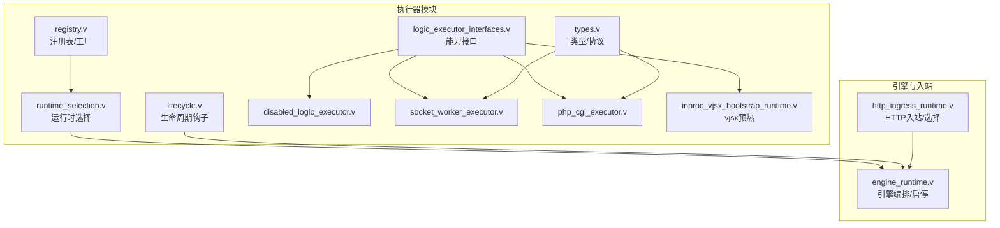
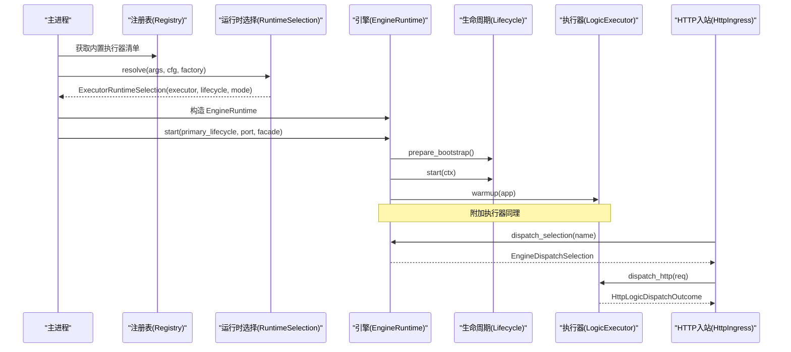
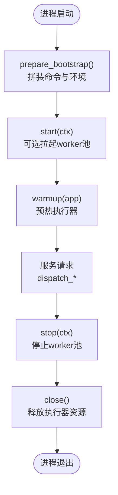
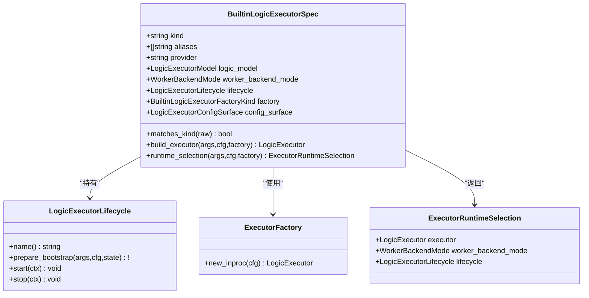
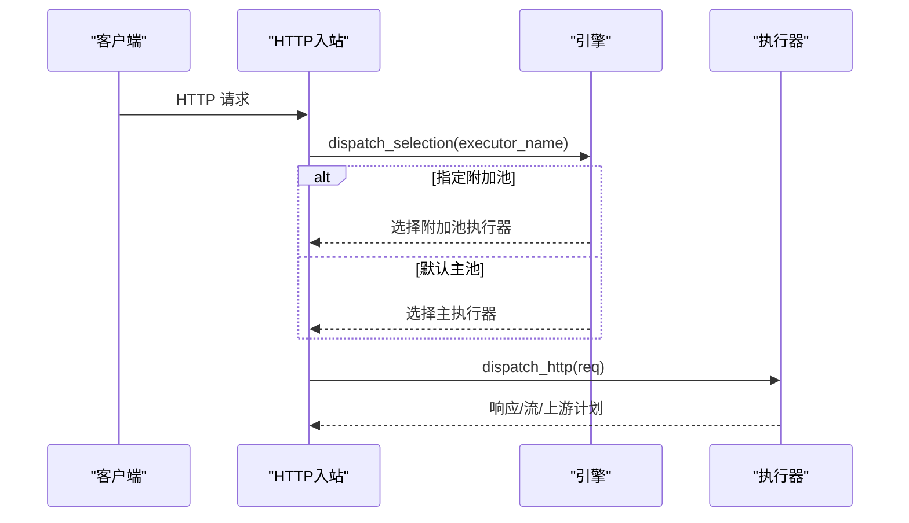
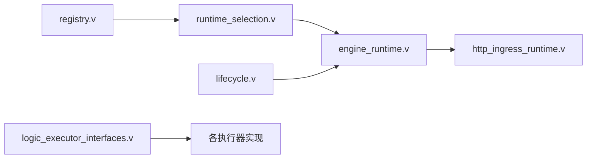

# 执行器生命周期管理

<cite>
**本文引用的文件**   
- [src/executor/lifecycle.v](file://src/executor/lifecycle.v)
- [src/executor/registry.v](file://src/executor/registry.v)
- [src/executor/runtime_selection.v](file://src/executor/runtime_selection.v)
- [src/executor/logic_executor_interfaces.v](file://src/executor/logic_executor_interfaces.v)
- [src/executor/disabled_logic_executor.v](file://src/executor/disabled_logic_executor.v)
- [src/executor/socket_worker_executor.v](file://src/executor/socket_worker_executor.v)
- [src/executor/php_cgi_executor.v](file://src/executor/php_cgi_executor.v)
- [src/executor/inproc_vjsx_bootstrap_runtime.v](file://src/executor/inproc_vjsx_bootstrap_runtime.v)
- [src/engine_runtime.v](file://src/engine_runtime.v)
- [src/http_ingress_runtime.v](file://src/http_ingress_runtime.v)
- [src/executor/types.v](file://src/executor/types.v)
- [docs/EXECUTOR_MODES.md](file://docs/EXECUTOR_MODES.md)
</cite>

## 目录
1. [简介](#简介)
2. [项目结构](#项目结构)
3. [核心组件](#核心组件)
4. [架构总览](#架构总览)
5. [详细组件分析](#详细组件分析)
6. [依赖关系分析](#依赖关系分析)
7. [性能考量](#性能考量)
8. [故障排查指南](#故障排查指南)
9. [结论](#结论)
10. [附录](#附录)

## 简介
本文件系统化阐述 vhttpd 中“逻辑执行器”的生命周期管理机制，覆盖从启动到关闭的完整流程（初始化、准备、运行、清理），并深入解析执行器注册表的工作原理（动态加载、版本与兼容性检查）、运行时选择策略与切换机制。同时提供自定义执行器的开发指南（接口定义、实现要求、测试方法）以及错误处理、资源管理与监控集成的最佳实践。

## 项目结构
围绕执行器生命周期与选择的关键代码集中在 executor 模块与引擎编排层：
- 生命周期钩子与上下文：src/executor/lifecycle.v
- 内置执行器注册表与工厂：src/executor/registry.v
- 运行时选择与推断：src/executor/runtime_selection.v
- 执行器能力接口：src/executor/logic_executor_interfaces.v
- 具体执行器实现：disabled、socket_worker、php_cgi、inproc_vjsx（含预热）
- 引擎编排与调度入口：src/engine_runtime.v、src/http_ingress_runtime.v
- 类型与协议封装：src/executor/types.v
- 模式说明文档：docs/EXECUTOR_MODES.md

图表来源
- [src/executor/lifecycle.v:1-179](file://src/executor/lifecycle.v#L1-L179)
- [src/executor/registry.v:1-387](file://src/executor/registry.v#L1-L387)
- [src/executor/runtime_selection.v:1-31](file://src/executor/runtime_selection.v#L1-L31)
- [src/executor/logic_executor_interfaces.v:1-51](file://src/executor/logic_executor_interfaces.v#L1-L51)
- [src/executor/disabled_logic_executor.v:1-81](file://src/executor/disabled_logic_executor.v#L1-L81)
- [src/executor/socket_worker_executor.v:1-157](file://src/executor/socket_worker_executor.v#L1-L157)
- [src/executor/php_cgi_executor.v:1-118](file://src/executor/php_cgi_executor.v#L1-L118)
- [src/executor/inproc_vjsx_bootstrap_runtime.v:1-42](file://src/executor/inproc_vjsx_bootstrap_runtime.v#L1-L42)
- [src/executor/types.v:1-449](file://src/executor/types.v#L1-L449)
- [src/engine_runtime.v:1-361](file://src/engine_runtime.v#L1-L361)
- [src/http_ingress_runtime.v:121-145](file://src/http_ingress_runtime.v#L121-L145)

章节来源
- [src/executor/lifecycle.v:1-179](file://src/executor/lifecycle.v#L1-L179)
- [src/executor/registry.v:1-387](file://src/executor/registry.v#L1-L387)
- [src/executor/runtime_selection.v:1-31](file://src/executor/runtime_selection.v#L1-L31)
- [src/executor/logic_executor_interfaces.v:1-51](file://src/executor/logic_executor_interfaces.v#L1-L51)
- [src/executor/disabled_logic_executor.v:1-81](file://src/executor/disabled_logic_executor.v#L1-L81)
- [src/executor/socket_worker_executor.v:1-157](file://src/executor/socket_worker_executor.v#L1-L157)
- [src/executor/php_cgi_executor.v:1-118](file://src/executor/php_cgi_executor.v#L1-L118)
- [src/executor/inproc_vjsx_bootstrap_runtime.v:1-42](file://src/executor/inproc_vjsx_bootstrap_runtime.v#L1-L42)
- [src/executor/types.v:1-449](file://src/executor/types.v#L1-L449)
- [src/engine_runtime.v:1-361](file://src/engine_runtime.v#L1-L361)
- [src/http_ingress_runtime.v:121-145](file://src/http_ingress_runtime.v#L121-L145)
- [docs/EXECUTOR_MODES.md:1-56](file://docs/EXECUTOR_MODES.md#L1-L56)

## 核心组件
- 生命周期钩子（prepare/start/stop）：通过函数指针避免循环依赖，允许在 start/stop 中访问 App 状态（如 worker 池、事件发射）。
- 执行器注册表：集中声明内置执行器规格（kind、别名、provider、模型、worker 后端模式、生命周期、工厂、配置面），并提供构建与运行时选择方法。
- 运行时选择：根据命令行参数或配置推断 kind，查找对应 spec，返回包含执行器实例、worker 后端模式与生命周期的选择结果。
- 能力接口：统一抽象 HTTP、WebSocket、流式、MCP、上游等分发能力，所有内置实现均满足该契约。
- 引擎编排：负责按生命周期顺序启动/停止执行器，维护 worker 池状态，并在请求路径中选择正确的执行器进行分发。

章节来源
- [src/executor/lifecycle.v:17-55](file://src/executor/lifecycle.v#L17-L55)
- [src/executor/registry.v:42-128](file://src/executor/registry.v#L42-L128)
- [src/executor/runtime_selection.v:5-31](file://src/executor/runtime_selection.v#L5-L31)
- [src/executor/logic_executor_interfaces.v:1-51](file://src/executor/logic_executor_interfaces.v#L1-L51)
- [src/engine_runtime.v:32-66](file://src/engine_runtime.v#L32-L66)

## 架构总览
下图展示从进程启动到请求分发的关键阶段与组件交互。

图表来源
- [src/executor/registry.v:138-145](file://src/executor/registry.v#L138-L145)
- [src/executor/runtime_selection.v:23-30](file://src/executor/runtime_selection.v#L23-L30)
- [src/engine_runtime.v:32-51](file://src/engine_runtime.v#L32-L51)
- [src/http_ingress_runtime.v:121-139](file://src/http_ingress_runtime.v#L121-L139)

## 详细组件分析

### 生命周期阶段详解
- 初始化阶段（prepare_bootstrap）
  - 作用：基于 CLI 与配置拼装执行器所需的运行时环境（例如 PHP 命令、环境变量、是否启用流式/WebSocket 分发等）。
  - 关键点：不同执行器会填充不同的 state（sockets、autostart、cmd、env、stream/websocket 标志）。
- 准备阶段（start）
  - 作用：按需拉起外部 worker 池（如 PHP Worker），或在嵌入式模式下不做额外操作。
  - 关键点：若 autostart 为真则启动 ManagedWorkerPool；当池为空但期望有 socket 时发出告警事件。
- 运行阶段（warmup）
  - 作用：预热执行器内部状态（如 vjsx 的 lanes 预热、签名刷新任务启动等）。
  - 关键点：失败会被记录日志但不中断主流程；后续请求仍可按能力降级或报错。
- 清理阶段（stop/close）
  - 作用：优雅停止 worker 池、释放连接、关闭执行器内部资源。
  - 关键点：先 stop 生命周期再 close 执行器，确保外部进程被正确回收。

图表来源
- [src/executor/lifecycle.v:32-42](file://src/executor/lifecycle.v#L32-L42)
- [src/executor/lifecycle.v:84-135](file://src/executor/lifecycle.v#L84-L135)
- [src/executor/inproc_vjsx_bootstrap_runtime.v:5-13](file://src/executor/inproc_vjsx_bootstrap_runtime.v#L5-L13)
- [src/engine_runtime.v:53-66](file://src/engine_runtime.v#L53-L66)

章节来源
- [src/executor/lifecycle.v:17-55](file://src/executor/lifecycle.v#L17-L55)
- [src/executor/lifecycle.v:84-135](file://src/executor/lifecycle.v#L84-L135)
- [src/executor/inproc_vjsx_bootstrap_runtime.v:5-13](file://src/executor/inproc_vjsx_bootstrap_runtime.v#L5-L13)
- [src/engine_runtime.v:32-66](file://src/engine_runtime.v#L32-L66)

### 执行器注册表工作原理
- 动态加载
  - 通过 builtin_executor_spec_all 集中声明内置执行器（none、php、php-cgi、vjsx），每个规格包含 kind、aliases、provider、model、worker_backend_mode、lifecycle、factory、config_surface。
  - 支持别名归一化（大小写、横杠/下划线），便于兼容多种写法。
- 版本管理与兼容性检查
  - 通过 config_surface 暴露各执行器支持的 CLI 选项段名与 flag 名称，用于解析与校验。
  - 针对 PHP 执行器提供 validate_config 与 build_command/env 工具，确保二进制、扩展、入口文件存在性校验。
  - 针对嵌入式 vjsx 提供 resolve_embedded_host_runtime_config 与 resolve_vjsx_runtime_config，将通用配置映射为执行器专用配置。
- 构建与选择
  - build_executor 依据 factory 分支创建具体执行器实例。
  - runtime_selection 返回包含执行器、worker 后端模式与生命周期的选择结果。

图表来源
- [src/executor/registry.v:42-128](file://src/executor/registry.v#L42-L128)
- [src/executor/registry.v:263-286](file://src/executor/registry.v#L263-L286)
- [src/executor/lifecycle.v:17-42](file://src/executor/lifecycle.v#L17-L42)
- [src/executor/runtime_selection.v:5-10](file://src/executor/runtime_selection.v#L5-L10)

章节来源
- [src/executor/registry.v:138-145](file://src/executor/registry.v#L138-L145)
- [src/executor/registry.v:176-224](file://src/executor/registry.v#L176-L224)
- [src/executor/registry.v:263-286](file://src/executor/registry.v#L263-L286)

### 执行器选择策略与运行时切换
- 选择优先级
  - 优先读取命令行 --executor；否则根据配置推断（php 或 vjsx 相关字段非空即命中）。
  - 未指定且无法推断时回退为 none。
- 运行时切换
  - 引擎在请求路径中通过 dispatch_selection(name) 选择目标执行器（main 或附加 pool）。
  - 对于主执行器且开启 stream_dispatch 的请求，尝试走流式分发通道，否则走普通 HTTP 分发。
  - 附加执行器可拥有独立 env 与 read_timeout，支持多后端并行运行。

图表来源
- [src/executor/runtime_selection.v:23-30](file://src/executor/runtime_selection.v#L23-L30)
- [src/engine_runtime.v:140-155](file://src/engine_runtime.v#L140-L155)
- [src/http_ingress_runtime.v:121-139](file://src/http_ingress_runtime.v#L121-L139)

章节来源
- [src/executor/runtime_selection.v:12-30](file://src/executor/runtime_selection.v#L12-L30)
- [src/engine_runtime.v:140-155](file://src/engine_runtime.v#L140-L155)
- [src/http_ingress_runtime.v:121-139](file://src/http_ingress_runtime.v#L121-L139)

### 内置执行器概览
- disabled（none）
  - 模型：worker（占位）
  - 行为：所有分发调用直接返回禁用错误
- php-worker（socket_worker）
  - 模型：worker
  - 行为：通过 Unix Socket 与外部 PHP Worker 通信，支持 HTTP、WebSocket 会话、流式、MCP、WebSocket 事件等
- php-cgi
  - 模型：worker
  - 行为：FastCGI 模式，仅支持 HTTP；其他能力返回不支持错误
- vjsx（embedded）
  - 模型：embedded
  - 行为：进程内执行，具备预热、签名刷新、lane 并发等特性

章节来源
- [src/executor/disabled_logic_executor.v:1-81](file://src/executor/disabled_logic_executor.v#L1-L81)
- [src/executor/socket_worker_executor.v:1-157](file://src/executor/socket_worker_executor.v#L1-L157)
- [src/executor/php_cgi_executor.v:1-118](file://src/executor/php_cgi_executor.v#L1-L118)
- [docs/EXECUTOR_MODES.md:1-56](file://docs/EXECUTOR_MODES.md#L1-L56)

### 自定义执行器开发指南
- 接口定义
  - 必须实现 LogicExecutor 及其组合接口（身份、生命周期、HTTP、WebSocket、流式、MCP、上游、事件）。
  - 参考接口定义位置：src/executor/logic_executor_interfaces.v
- 实现要求
  - 身份与元数据：model、kind、provider、admin_details 需准确反映执行器特征。
  - 生命周期：warmup 完成必要初始化；close 释放资源。
  - 分发能力：至少实现 HTTP 分发；如需 WebSocket/流式/MCP 等，请实现对应接口。
  - 错误语义：对不支持的能力返回明确错误码/消息，便于上层统一处理。
- 注册与选择
  - 在注册表中新增 BuiltinLogicExecutorSpec，声明 kind、aliases、provider、model、worker_backend_mode、lifecycle、factory、config_surface。
  - 在 build_executor 中根据 factory 分支返回新实现实例。
  - 若需要外部进程管理，配合 Lifecycle.prepare_bootstrap/start/stop 设置 worker 命令与环境。
- 测试方法
  - 单元测试：验证 identity、能力接口满足性、HTTP 分发基本路径。
  - 集成测试：结合 engine_runtime.start/stop 验证生命周期与资源回收。
  - 示例参考：
    - 能力接口满足性测试：src/executor_capability_interfaces_test.v
    - 内置执行器选择与别名归一化测试：src/server_logic_test.v（部分片段）
    - vjsx 执行器端到端测试：src/inproc_vjsx_executor_test.v

章节来源
- [src/executor/logic_executor_interfaces.v:1-51](file://src/executor/logic_executor_interfaces.v#L1-L51)
- [src/executor/registry.v:42-128](file://src/executor/registry.v#L42-L128)
- [src/executor/registry.v:263-286](file://src/executor/registry.v#L263-L286)
- [src/executor/lifecycle.v:17-42](file://src/executor/lifecycle.v#L17-L42)

## 依赖关系分析
- 低耦合高内聚
  - 生命周期以函数指针形式注入，避免与 main 模块形成循环依赖。
  - 注册表与选择逻辑解耦，新增执行器只需扩展 registry 与实现接口。
- 直接依赖
  - engine_runtime 依赖 executor 模块提供的生命周期与分发端口。
  - http_ingress 通过引擎的选择结果路由到具体执行器。
- 潜在风险
  - 若新增执行器未正确实现所有能力接口，可能导致运行时选择后分发失败。
  - 外部 worker 进程异常退出需配合生命周期 stop 与重试策略。

图表来源
- [src/executor/registry.v:138-145](file://src/executor/registry.v#L138-L145)
- [src/executor/runtime_selection.v:23-30](file://src/executor/runtime_selection.v#L23-L30)
- [src/engine_runtime.v:32-66](file://src/engine_runtime.v#L32-L66)
- [src/http_ingress_runtime.v:121-139](file://src/http_ingress_runtime.v#L121-L139)
- [src/executor/logic_executor_interfaces.v:1-51](file://src/executor/logic_executor_interfaces.v#L1-L51)

章节来源
- [src/executor/registry.v:138-145](file://src/executor/registry.v#L138-L145)
- [src/executor/runtime_selection.v:23-30](file://src/executor/runtime_selection.v#L23-L30)
- [src/engine_runtime.v:32-66](file://src/engine_runtime.v#L32-L66)
- [src/http_ingress_runtime.v:121-139](file://src/http_ingress_runtime.v#L121-L139)
- [src/executor/logic_executor_interfaces.v:1-51](file://src/executor/logic_executor_interfaces.v#L1-L51)

## 性能考量
- 预热优化
  - vjsx 执行器在 warmup 阶段遍历 lanes 发起预热请求，减少首包延迟。
- 超时与队列
  - 针对不同执行器可配置独立的 read_timeout_ms，避免慢下游阻塞。
- 并发与隔离
  - 附加执行器可拥有独立 env 与线程/队列参数，便于按业务隔离与限流。
- 资源回收
  - 达到 max_requests 的 worker 进入 draining 并在空闲后重启，避免内存泄漏与状态污染。

章节来源
- [src/executor/inproc_vjsx_bootstrap_runtime.v:5-13](file://src/executor/inproc_vjsx_bootstrap_runtime.v#L5-L13)
- [src/engine_runtime.v:116-134](file://src/engine_runtime.v#L116-L134)
- [src/engine_runtime.v:323-360](file://src/engine_runtime.v#L323-L360)

## 故障排查指南
- 常见错误定位
  - 执行器禁用：所有分发返回“禁用”错误，确认选择是否正确。
  - 入口缺失：PHP/vjsx 入口文件或扩展不存在，检查配置与路径。
  - 连接失败：Unix Socket 连接失败或 FastCGI 解码失败，检查 worker 进程与端口。
  - 预热失败：warmup 抛错会被记录，不影响主流程，但可能影响首包性能。
- 事件与日志
  - worker.pool.empty、worker.started、worker.restart_scheduled、worker.max_requests_reached 等事件可用于观测 worker 池健康度。
- 建议步骤
  - 核对 --executor 与配置推断结果。
  - 查看 admin 统计与诊断信息（如 /admin/executors）。
  - 逐步缩小范围：先验证 HTTP 分发，再验证 WebSocket/流式/MCP。

章节来源
- [src/executor/disabled_logic_executor.v:40-80](file://src/executor/disabled_logic_executor.v#L40-L80)
- [src/executor/registry.v:300-323](file://src/executor/registry.v#L300-L323)
- [src/executor/socket_worker_executor.v:43-95](file://src/executor/socket_worker_executor.v#L43-L95)
- [src/executor/php_cgi_executor.v:42-82](file://src/executor/php_cgi_executor.v#L42-L82)
- [src/executor/lifecycle.v:104-133](file://src/executor/lifecycle.v#L104-L133)
- [src/engine_runtime.v:36-50](file://src/engine_runtime.v#L36-L50)

## 结论
vhttpd 的执行器体系通过清晰的接口契约、灵活的注册表与生命周期钩子，实现了多后端执行环境的统一编排与热插拔。结合运行时选择与引擎编排，系统可在同一进程中协调多个执行器，满足不同场景的性能与隔离需求。遵循本文的开发与实践指南，可快速扩展新的执行器并确保稳定性与可观测性。

## 附录
- 模式说明与示例配置参见：docs/EXECUTOR_MODES.md
- 类型与协议定义参见：src/executor/types.v