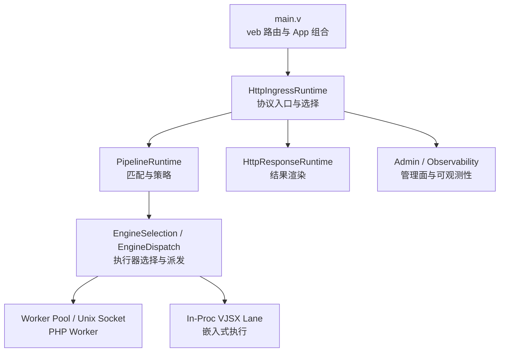
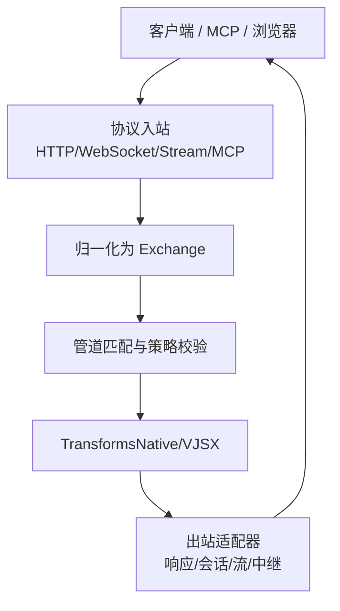
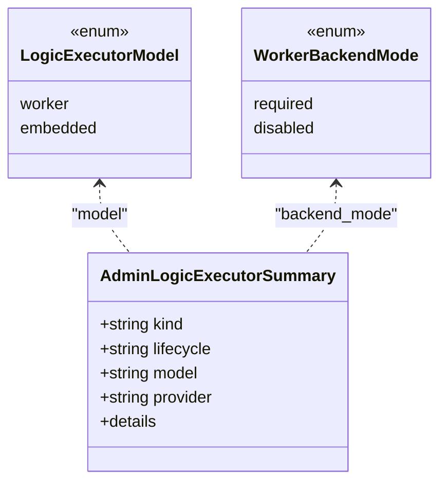
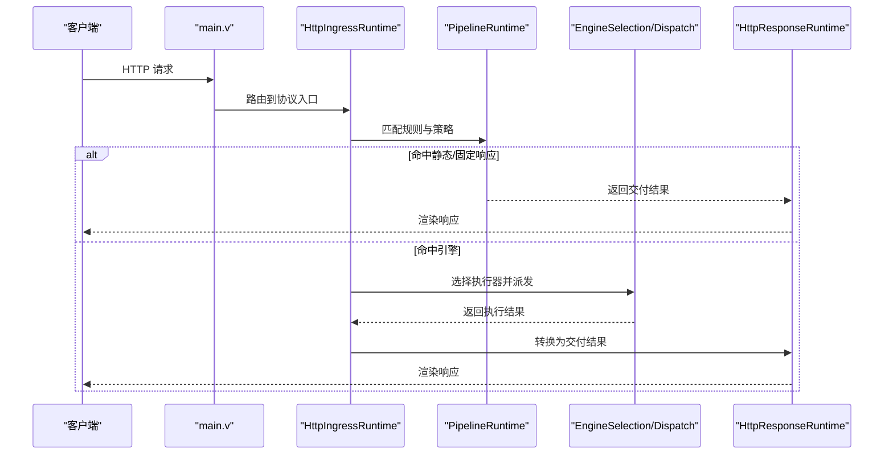
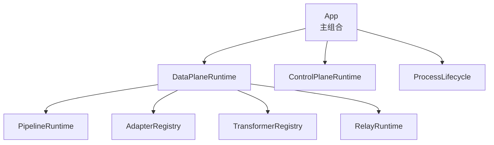
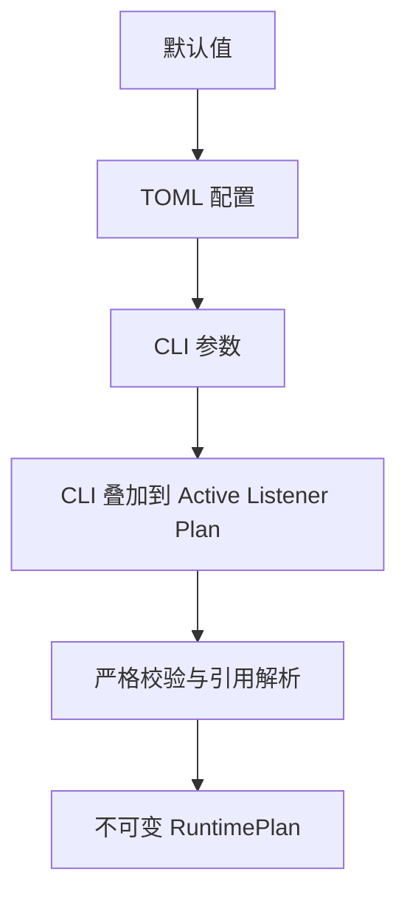
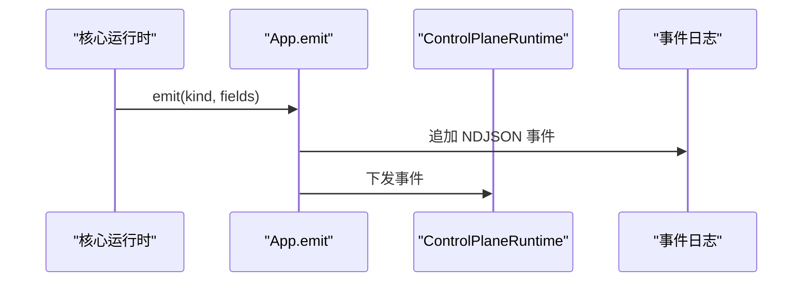
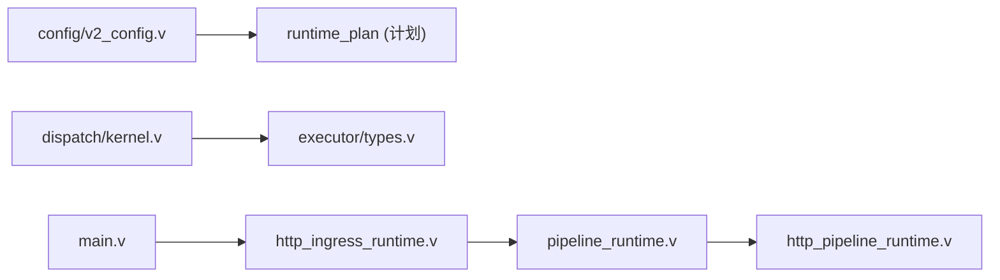

# 核心概念

<cite>
**本文引用的文件列表**
- [README.md](file://README.md)
- [OVERVIEW.md](file://docs/OVERVIEW.md)
- [EXECUTOR_MODES.md](file://docs/EXECUTOR_MODES.md)
- [PROTOCOL_PIPELINE_IMPLEMENTATION_PLAN.md](file://docs/PROTOCOL_PIPELINE_IMPLEMENTATION_PLAN.md)
- [CONFIGURATION_MODEL_V2.md](file://docs/CONFIGURATION_MODEL_V2.md)
- [INPROC_VJSX_RUNBOOK.md](file://docs/INPROC_VJSX_RUNBOOK.md)
- [main.v](file://src/main.v)
- [kernel.v](file://src/dispatch/kernel.v)
- [types.v（executor）](file://src/executor/types.v)
- [v2_config.v](file://src/config/v2_config.v)
- [http_ingress_runtime.v](file://src/http_ingress_runtime.v)
- [pipeline_runtime.v](file://src/pipeline_runtime.v)
- [http_pipeline_runtime.v](file://src/http_pipeline_runtime.v)
</cite>

## 目录
1. [引言](#引言)
2. [项目结构](#项目结构)
3. [核心组件](#核心组件)
4. [架构总览](#架构总览)
5. [详细组件分析](#详细组件分析)
6. [依赖关系分析](#依赖关系分析)
7. [性能考量](#性能考量)
8. [故障排查指南](#故障排查指南)
9. [结论](#结论)
10. [附录](#附录)

## 引言
本文件聚焦 VHTTPD 的核心概念与架构原理，围绕执行器模式、请求调度内核、管道处理机制、运行时模块组织、配置系统层次与覆盖机制、事件驱动架构展开，并辅以架构图与数据流图帮助开发者理解内部工作机制。内容严格基于仓库源码与文档进行归纳与提炼，避免臆造信息。

## 项目结构
VHTTPD 以“协议入口 + 可编程运行时 + 跨节点中继”为总体定位，采用分层与主题化组织：
- 顶层入口与 veb 集成位于 main.v，负责将 HTTP 请求路由到各运行时子系统。
- 调度内核集中在 dispatch 模块，定义统一的分发上下文与信封类型，屏蔽具体协议差异。
- 执行器模型在 executor 模块中抽象，支持外部 worker（如 PHP）与嵌入式宿主（如 vjsx）。
- 配置系统分为 V1 兼容与 V2 严格模式，最终编译为不可变的 RuntimePlan，供运行时装配。
- 管道与适配器在 pipeline 与 http_*_runtime 等文件中实现，形成从入站到出站的统一处理链。

图表来源
- [main.v:1-117](file://src/main.v#L1-L117)
- [http_ingress_runtime.v:121-145](file://src/http_ingress_runtime.v#L121-L145)
- [pipeline_runtime.v:1-160](file://src/pipeline_runtime.v#L1-L160)

章节来源
- [README.md:1-127](file://README.md#L1-L127)
- [OVERVIEW.md:1-53](file://docs/OVERVIEW.md#L1-L53)

## 核心组件
- 执行器模式：通过逻辑执行器抽象统一接入不同运行态（worker 或 embedded），对外暴露一致的 admin 与生命周期语义。
- 调度内核：以 KernelDispatchEnvelope 为核心，封装 stream/mcp/websocket_upstream/websocket_dispatch 等分发场景，提供统一的构建与分类能力。
- 管道与适配器：HTTP 入站经 PipelineRuntime 匹配规则与策略后，进入终端适配器或直接交由引擎执行；结果经由 HttpResponseRuntime 渲染。
- 配置系统：V2 配置域清晰分离 server/listeners/control/observability/resources/engines/adapters/transforms/policies/pipelines/relays，编译为不可变计划，CLI 覆盖在启动期注入。
- 事件驱动：通过控制面 emit 与事件日志记录关键生命周期与错误事件，便于运维与诊断。

章节来源
- [types.v（executor）:67-91](file://src/executor/types.v#L67-L91)
- [kernel.v:1-151](file://src/dispatch/kernel.v#L1-L151)
- [pipeline_runtime.v:40-55](file://src/pipeline_runtime.v#L40-L55)
- [v2_config.v:1-318](file://src/config/v2_config.v#L1-L318)
- [main.v:75-81](file://src/main.v#L75-L81)

## 架构总览
VHTTPD 作为 transport runtime，承担协议终止、连接与流生命周期管理、worker 编排、上游流拥有、可观测性与网关能力。其目标架构强调：
- 协议对等：HTTP、WebSocket、Stream、MCP 均为对等适配器。
- 统一交换体：入站归一化为 Exchange，经过 transforms 再出站。
- 跨节点中继：通过 relay carrier 在不同实例间转发交换体。

图表来源
- [PROTOCOL_PIPELINE_IMPLEMENTATION_PLAN.md:46-83](file://docs/PROTOCOL_PIPELINE_IMPLEMENTATION_PLAN.md#L46-L83)
- [PROTOCOL_PIPELINE_IMPLEMENTATION_PLAN.md:367-406](file://docs/PROTOCOL_PIPELINE_IMPLEMENTATION_PLAN.md#L367-L406)

## 详细组件分析

### 执行器模式：PHP Worker 与 VJSX
- 设计要点
  - 逻辑执行器模型区分 worker 与 embedded，worker_backend_mode 区分 required/disabled，用于表达“按设计禁用”与“异常不可用”。
  - 运行时暴露 logic_executor_lifecycle 标签，指示当前选中的宿主生命周期路径。
- PHP Worker
  - 通过 Unix Socket 与外部 php-worker 进程通信，支持自动启动、池大小、队列容量、超时、重启退避等。
  - 生成 worker 命令时，若未显式设置 worker.cmd，则根据 [php] 段自动生成，并在启动前校验必要路径。
- VJSX 嵌入式执行器
  - 默认关闭 worker sockets 与 autostart，适用于轻量 HTTP 与 websocket_upstream 场景。
  - 支持 script/node 两种运行时 profile，线程数可调，构建产物缓存于临时目录。
- 适用场景
  - PHP：需要复用成熟生态与框架（WordPress/Laravel/Symfony），且需保持现有 worker 路径。
  - VJSX：快速原型、插件粘合、轻量 API 与事件桥接，无需独立进程开销。

图表来源
- [types.v（executor）:67-75](file://src/executor/types.v#L67-L75)
- [types.v（executor）:157-164](file://src/executor/types.v#L157-L164)

章节来源
- [EXECUTOR_MODES.md:1-136](file://docs/EXECUTOR_MODES.md#L1-L136)
- [README.md:33-43](file://README.md#L33-L43)
- [INPROC_VJSX_RUNBOOK.md:1-52](file://docs/INPROC_VJSX_RUNBOOK.md#L1-L52)

### 请求调度内核与管道处理
- 内核分发
  - KernelDispatchEnvelope 统一封装 stream/mcp/websocket_upstream/websocket_dispatch 四类分发场景，并提供 from_* 构造方法。
  - 辅助函数负责构建 Stream/MCP/WebSocket Upstream 的调度请求帧，以及错误分类与失败包装。
- 管道处理
  - HttpIngressRuntime 负责协议入口、动态后端选择、静态/上传路由、缓存命中与重写。
  - PipelineRuntime 维护 HTTP 路由与中继管道描述符，提供匹配与策略前置检查。
  - 终端适配器（固定响应/拒绝/响应）与引擎执行结果统一映射为交付结果，再由 HttpResponseRuntime 渲染。

图表来源
- [kernel.v:1-151](file://src/dispatch/kernel.v#L1-L151)
- [http_ingress_runtime.v:121-145](file://src/http_ingress_runtime.v#L121-L145)
- [pipeline_runtime.v:127-160](file://src/pipeline_runtime.v#L127-L160)
- [http_pipeline_runtime.v:1-161](file://src/http_pipeline_runtime.v#L1-L161)

章节来源
- [kernel.v:1-151](file://src/dispatch/kernel.v#L1-L151)
- [http_ingress_runtime.v:121-145](file://src/http_ingress_runtime.v#L121-L145)
- [pipeline_runtime.v:1-160](file://src/pipeline_runtime.v#L1-L160)
- [http_pipeline_runtime.v:1-161](file://src/http_pipeline_runtime.v#L1-L161)

### 运行时模块组织结构
- 顶层 App 仅保留 veb 集成与三个顶级运行时所有者：DataPlaneRuntime、ControlPlaneRuntime、ProcessLifecycle。
- DataPlaneRuntime 聚合 PipelineRuntime、AdapterRegistry、TransformerRegistry、RelayRuntime 等子运行时，各自封闭状态与生命周期。
- 协议相关（HTTP/WebSocket/Stream/MCP）由对应运行时模块拥有，不扁平回 App。
- 资源（DB/Cache/Storage/Secret）与 Provider 由各自运行时管理，通过 plan 引用而非全局耦合。

图表来源
- [PROTOCOL_PIPELINE_IMPLEMENTATION_PLAN.md:46-83](file://docs/PROTOCOL_PIPELINE_IMPLEMENTATION_PLAN.md#L46-L83)
- [main.v:15-23](file://src/main.v#L15-L23)

章节来源
- [PROTOCOL_PIPELINE_IMPLEMENTATION_PLAN.md:46-83](file://docs/PROTOCOL_PIPELINE_IMPLEMENTATION_PLAN.md#L46-L83)
- [main.v:15-23](file://src/main.v#L15-L23)

### 配置系统的层次结构与覆盖机制
- 层次结构
  - V2 配置域包括 server、listeners、control、observability、resources、engines、adapters、transforms、policies、pipelines、relays。
  - 每个域有严格的解码与校验，禁止未知字段，确保“配置即规范，行为在运行时”。
- 覆盖机制
  - 加载顺序：默认值 -> TOML 配置 -> CLI 参数，CLI 始终优先。
  - 变量扩展：支持 ${section.key}、${env.NAME} 与 ${env.NAME:-default}。
  - CLI 叠加：针对 worker、vjsx、php、feishu、openai 等提供细粒度覆盖，合并进 active listener 的 RuntimePlan。
- 兼容性
  - V1 配置经兼容编译器转为 V2 风格的 RuntimePlan，请求路径不再直接解析旧字段。

图表来源
- [CONFIGURATION_MODEL_V2.md:22-104](file://docs/CONFIGURATION_MODEL_V2.md#L22-L104)
- [v2_config.v:1-318](file://src/config/v2_config.v#L1-L318)
- [runtime_plan_cli_overlay.v:84-204](file://src/config/runtime_plan_cli_overlay.v#L84-L204)

章节来源
- [CONFIGURATION_MODEL_V2.md:22-104](file://docs/CONFIGURATION_MODEL_V2.md#L22-L104)
- [v2_config.v:1-318](file://src/config/v2_config.v#L1-L318)
- [runtime_plan_cli_overlay.v:84-204](file://src/config/runtime_plan_cli_overlay.v#L84-L204)

### 事件驱动架构的实现方式
- 事件发射
  - App.emit 将关键生命周期事件（server.started/failed/stopped、admin.started/failed、internal_admin.started/error、worker.select.failed 等）写入事件日志并下发至控制面。
- 事件用途
  - 运维监控、审计与排障；结合事件日志与 admin 快照，形成完整的运行时可见性。
- 最佳实践
  - 在自定义 transform 或 provider 中，尽量使用统一的 emit 接口上报结构化事件，避免散落日志。

图表来源
- [main.v:75-81](file://src/main.v#L75-L81)

章节来源
- [main.v:75-81](file://src/main.v#L75-L81)

## 依赖关系分析
- 模块边界
  - dispatch 不得导入 executor、veb、具体 DB/Cache 实现或网络对象，保持纯契约与值类型。
  - config/plan 层只产出不可变计划，不持有运行时状态。
- 直接依赖
  - main.v 依赖 veb 中间件与静态处理器，并将请求委托给 HttpIngressRuntime。
  - http_ingress_runtime.v 依赖 pipeline_runtime 与 engine selection，最终调用 HttpResponseRuntime 渲染。
- 潜在循环
  - 通过 plan 与 dispatch 契约解耦，避免运行时与配置层的循环依赖。

图表来源
- [kernel.v:1-151](file://src/dispatch/kernel.v#L1-L151)
- [types.v（executor）:1-449](file://src/executor/types.v#L1-L449)
- [main.v:1-117](file://src/main.v#L1-L117)
- [http_ingress_runtime.v:121-145](file://src/http_ingress_runtime.v#L121-L145)
- [pipeline_runtime.v:1-160](file://src/pipeline_runtime.v#L1-L160)
- [http_pipeline_runtime.v:1-161](file://src/http_pipeline_runtime.v#L1-L161)

章节来源
- [PROTOCOL_PIPELINE_IMPLEMENTATION_PLAN.md:17-45](file://docs/PROTOCOL_PIPELINE_IMPLEMENTATION_PLAN.md#L17-L45)
- [v2_config.v:1-318](file://src/config/v2_config.v#L1-L318)

## 性能考量
- 无每阶段序列化：原生 V 阶段共享进程内 Exchange，仅在 VJSX 边界序列化一次。
- 编译期决策：路由正则、引用解析、能力校验、监听器管道顺序均在启动期完成。
- 有界并发：引擎、transform 队列、relay 通道与流缓冲均有上限；VJSX 复用 lane 而非无限线程。
- 拷贝预算：避免不必要的 .clone()，仅在所有权边界外复制。
- 性能验收：HTTP 兼容路径相比基线不超过 5% 吞吐退化，静态响应路径独立于应用执行。

章节来源
- [PROTOCOL_PIPELINE_IMPLEMENTATION_PLAN.md:621-659](file://docs/PROTOCOL_PIPELINE_IMPLEMENTATION_PLAN.md#L621-L659)

## 故障排查指南
- 常见症状
  - 启动失败：PHP worker_entry/app_entry/extensions 缺失会在启动期快速失败，便于早期发现。
  - 请求 404/403：可能命中 none 路由或 required_header/denied_query 策略。
  - 流式响应中断：检查 stream open/next/close 帧与 upstream-plan 验证是否通过。
- 定位手段
  - 查看事件日志与 admin 快照，关注 server/worker/admin 相关事件。
  - 使用 /admin/executors 确认当前执行器与生命周期标签。
  - 使用 /admin/runtime/plan 检查已编译的计划与能力匹配情况。
- 建议操作
  - 调整 worker pool_size、queue_capacity、read_timeout_ms 等参数缓解拥塞。
  - 在 VJSX 模式下确认 thread_count 与 build_root 是否合理。

章节来源
- [EXECUTOR_MODES.md:69-76](file://docs/EXECUTOR_MODES.md#L69-L76)
- [http_pipeline_runtime.v:138-147](file://src/http_pipeline_runtime.v#L138-L147)
- [PROTOCOL_PIPELINE_IMPLEMENTATION_PLAN.md:929-959](file://docs/PROTOCOL_PIPELINE_IMPLEMENTATION_PLAN.md#L929-L959)

## 结论
VHTTPD 以执行器模式统一接入多语言与多形态业务逻辑，以调度内核与管道机制实现协议无关的请求处理，配合清晰的配置系统与事件驱动的可观测性，形成了面向现代应用的 transport runtime 基础。通过严格的模块边界与不可变计划，系统在可扩展性与稳定性之间取得平衡，适合在生产环境中承载复杂的多协议与流式负载。

## 附录
- 快速参考
  - 切换执行器：修改 [executor].kind，保持其他公共配置不变。
  - 启用 VJSX in-proc：配置 [vjsx] 段并指定 app_entry/module_root/build_root。
  - 多监听器：为每个站点配置独立的 listeners/sites，共享全局配置。

章节来源
- [EXECUTOR_MODES.md:126-136](file://docs/EXECUTOR_MODES.md#L126-L136)
- [INPROC_VJSX_RUNBOOK.md:20-52](file://docs/INPROC_VJSX_RUNBOOK.md#L20-L52)
- [README.md:533-603](file://README.md#L533-L603)