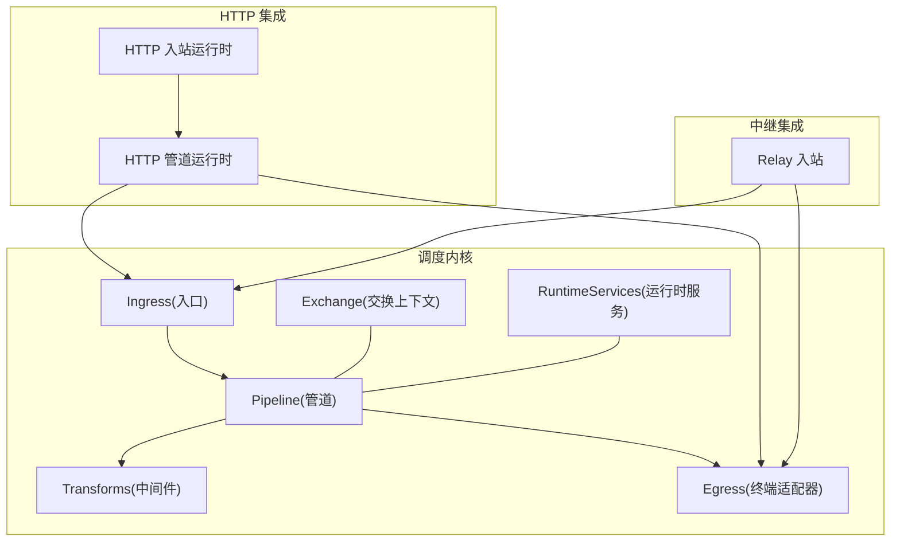
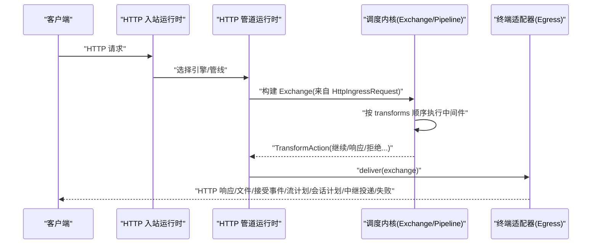
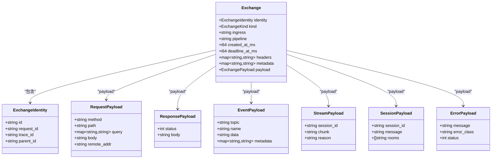
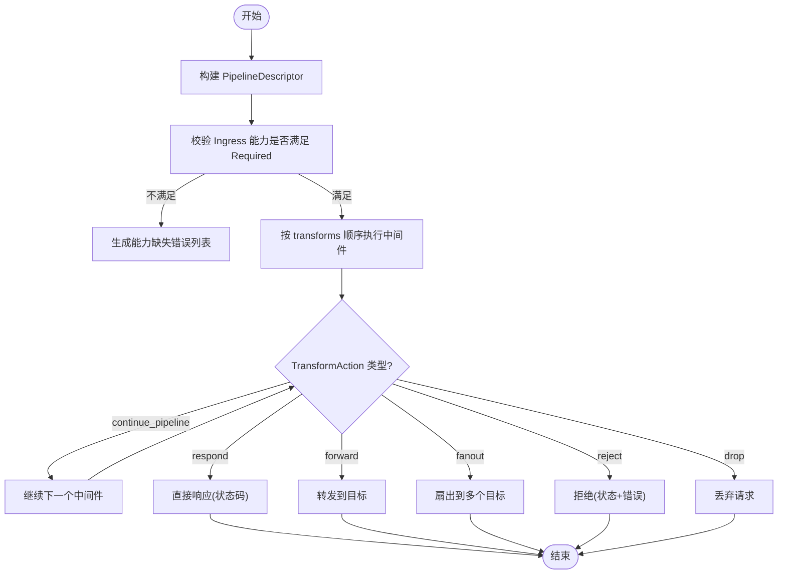
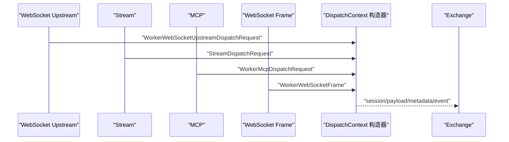
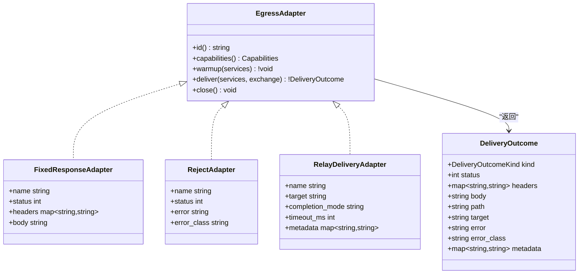
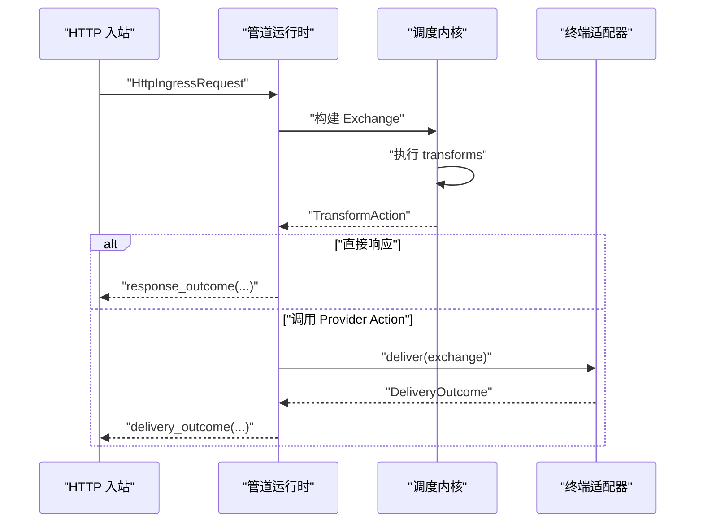
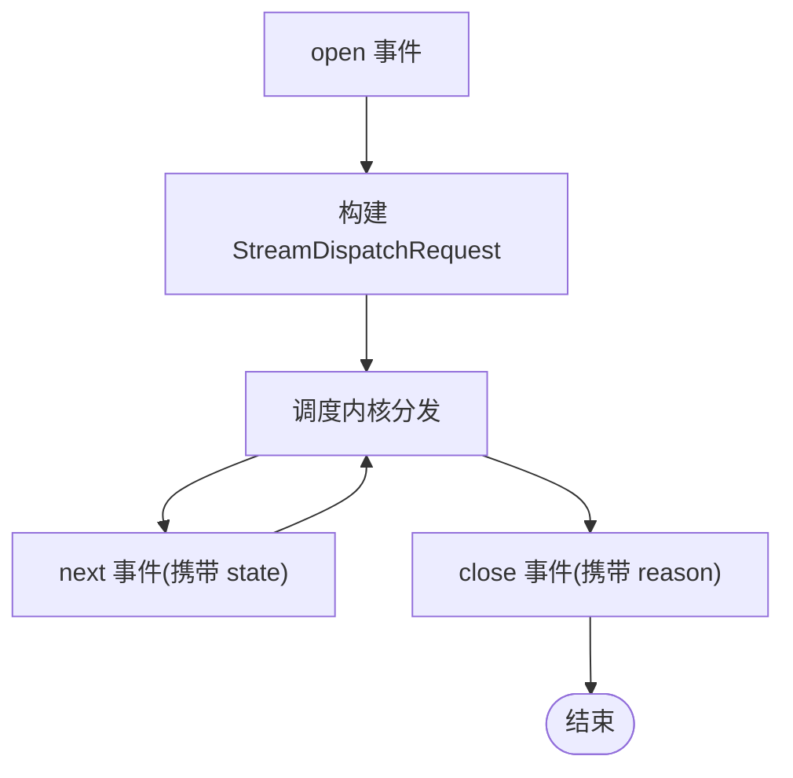
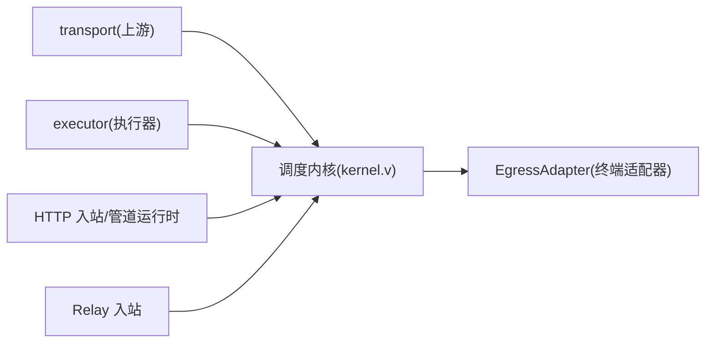

# 调度内核

<cite>
**本文引用的文件**   
- [kernel.v](file://src/dispatch/kernel.v)
- [pipeline.v](file://src/dispatch/pipeline.v)
- [adapter.v](file://src/dispatch/adapter.v)
- [context.v](file://src/dispatch/context.v)
- [exchange.v](file://src/dispatch/exchange.v)
- [http.v](file://src/dispatch/http.v)
- [relay.v](file://src/dispatch/relay.v)
- [fixed_response_adapter.v](file://src/dispatch/fixed_response_adapter.v)
- [reject_adapter.v](file://src/dispatch/reject_adapter.v)
- [relay_delivery_adapter.v](file://src/dispatch/relay_delivery_adapter.v)
- [runtime_services.v](file://src/dispatch/runtime_services.v)
- [http_ingress_runtime.v](file://src/http_ingress_runtime.v)
- [http_pipeline_runtime.v](file://src/http_pipeline_runtime.v)
</cite>

## 目录
1. [简介](#简介)
2. [项目结构](#项目结构)
3. [核心组件](#核心组件)
4. [架构总览](#架构总览)
5. [详细组件分析](#详细组件分析)
6. [依赖关系分析](#依赖关系分析)
7. [性能考量](#性能考量)
8. [故障排查指南](#故障排查指南)
9. [结论](#结论)
10. [附录](#附录)

## 简介
本文件系统性阐述 VHTTPD 的“调度内核”工作原理，覆盖从请求进入、匹配路由、构建交换上下文、执行管道与中间件、到最终通过适配器统一输出（HTTP、WebSocket、流式响应、中继投递等）的完整流程。重点说明：
- 请求调度的端到端流程与控制流
- 管道处理机制与中间件注册、能力校验与执行顺序
- 上下文传递机制与数据交换模型（Exchange）
- 适配器模式在调度中的应用与协议统一
- 关键数据结构与复杂度分析
- 流程图与类图帮助开发者理解内部机制

## 项目结构
调度内核位于 src/dispatch 模块，围绕“入站入口 → 管道编排 → 终端适配器”的统一抽象展开；HTTP 与中继等上层运行时负责将外部协议转换为统一的 Exchange 并驱动调度。

图表来源
- [http_ingress_runtime.v:111-122](file://src/http_ingress_runtime.v#L111-L122)
- [http_pipeline_runtime.v:128-161](file://src/http_pipeline_runtime.v#L128-L161)
- [http.v:20-46](file://src/dispatch/http.v#L20-L46)
- [relay.v:24-59](file://src/dispatch/relay.v#L24-L59)

章节来源
- [http_ingress_runtime.v:111-122](file://src/http_ingress_runtime.v#L111-L122)
- [http_pipeline_runtime.v:128-161](file://src/http_pipeline_runtime.v#L128-L161)
- [http.v:20-46](file://src/dispatch/http.v#L20-L46)
- [relay.v:24-59](file://src/dispatch/relay.v#L24-L59)

## 核心组件
- 交换上下文 Exchange：承载一次处理的身份、元数据、负载与生命周期信息，是调度内核的数据总线。
- 管道 PipelineDescriptor：声明 ingress、transforms、policies、egress 以及所需 Capabilities。
- 中间件 Transformer：可插拔的处理单元，返回 TransformAction 控制继续、响应、转发、扇出、拒绝或丢弃。
- 终端适配器 EgressAdapter：实现 deliver 将结果交付给具体协议（HTTP、WS、流、中继等）。
- 运行时服务 RuntimeServices：提供 trace_id、事件发射等横切能力。
- 上下文构造器：针对不同入站（HTTP、WebSocket、MCP、Stream、Relay）将外部请求映射为 DispatchContext 与 Exchange。

章节来源
- [exchange.v:78-104](file://src/dispatch/exchange.v#L78-L104)
- [exchange.v:147-159](file://src/dispatch/exchange.v#L147-L159)
- [pipeline.v:3-12](file://src/dispatch/pipeline.v#L3-L12)
- [pipeline.v:114-118](file://src/dispatch/pipeline.v#L114-L118)
- [adapter.v:129-136](file://src/dispatch/adapter.v#L129-L136)
- [runtime_services.v:1-17](file://src/dispatch/runtime_services.v#L1-L17)
- [context.v:1-66](file://src/dispatch/context.v#L1-L66)

## 架构总览
调度内核以 Exchange 为中心，将不同协议的入站请求标准化为统一的数据模型，经由管道与中间件处理后，由终端适配器完成协议无关的输出。

图表来源
- [http_ingress_runtime.v:111-122](file://src/http_ingress_runtime.v#L111-L122)
- [http_pipeline_runtime.v:128-161](file://src/http_pipeline_runtime.v#L128-L161)
- [http.v:20-46](file://src/dispatch/http.v#L20-L46)
- [adapter.v:129-136](file://src/dispatch/adapter.v#L129-L136)

## 详细组件分析

### 交换上下文与数据模型
- ExchangeIdentity：包含 id、request_id、trace_id、parent_id，贯穿全链路追踪。
- ExchangeKind：定义 request/response/event/stream_open/stream_chunk/stream_end/session_open/session_message/session_close/error 等语义。
- Payload 联合类型：EmptyPayload/ErrorPayload/EventPayload/RequestPayload/ResponsePayload/SessionPayload/StreamPayload，承载各阶段数据。
- Exchange：聚合 identity、kind、ingress、pipeline、时间戳、headers、metadata、payload，作为调度内核唯一数据载体。

图表来源
- [exchange.v:3-22](file://src/dispatch/exchange.v#L3-L22)
- [exchange.v:24-68](file://src/dispatch/exchange.v#L24-L68)
- [exchange.v:78-90](file://src/dispatch/exchange.v#L78-L90)

章节来源
- [exchange.v:3-22](file://src/dispatch/exchange.v#L3-L22)
- [exchange.v:24-68](file://src/dispatch/exchange.v#L24-L68)
- [exchange.v:78-90](file://src/dispatch/exchange.v#L78-L90)

### 管道与中间件
- PipelineDescriptor：声明 id、group、ingress、transforms、policies、egress、required Capabilities。
- TransformDescriptor：声明 id、kind、handler、capabilities。
- TerminalDescriptor：声明 id、capabilities。
- 能力校验：capabilities_satisfy/missing_capabilities/pipeline_capability_errors/issues 确保 ingress 能力满足 pipeline 需求。
- PipelineDispatcher：定义 dispatch(services, exchange) -> DeliveryOutcome 的接口。

图表来源
- [pipeline.v:3-12](file://src/dispatch/pipeline.v#L3-L12)
- [pipeline.v:14-26](file://src/dispatch/pipeline.v#L14-L26)
- [pipeline.v:44-55](file://src/dispatch/pipeline.v#L44-L55)
- [pipeline.v:57-90](file://src/dispatch/pipeline.v#L57-L90)
- [pipeline.v:92-112](file://src/dispatch/pipeline.v#L92-L112)
- [exchange.v:106-123](file://src/dispatch/exchange.v#L106-L123)

章节来源
- [pipeline.v:3-12](file://src/dispatch/pipeline.v#L3-L12)
- [pipeline.v:14-26](file://src/dispatch/pipeline.v#L14-L26)
- [pipeline.v:44-55](file://src/dispatch/pipeline.v#L44-L55)
- [pipeline.v:57-90](file://src/dispatch/pipeline.v#L57-L90)
- [pipeline.v:92-112](file://src/dispatch/pipeline.v#L92-L112)
- [exchange.v:106-123](file://src/dispatch/exchange.v#L106-L123)

### 上下文传递机制
- 针对 WebSocket Upstream、Stream、MCP、WebSocket Frame 等不同入站，提供专用函数将 transport 层请求转换为 DispatchContext，并携带 session、payload、metadata、event 等信息。
- 这些上下文随后用于构建 Exchange，保证跨协议一致的数据访问。

图表来源
- [context.v:8-15](file://src/dispatch/context.v#L8-L15)
- [context.v:17-32](file://src/dispatch/context.v#L17-L32)
- [context.v:34-49](file://src/dispatch/context.v#L34-L49)
- [context.v:51-65](file://src/dispatch/context.v#L51-L65)

章节来源
- [context.v:8-15](file://src/dispatch/context.v#L8-L15)
- [context.v:17-32](file://src/dispatch/context.v#L17-L32)
- [context.v:34-49](file://src/dispatch/context.v#L34-L49)
- [context.v:51-65](file://src/dispatch/context.v#L51-L65)

### 适配器模式与协议统一
- EgressAdapter 接口定义了 deliver(services, exchange) -> DeliveryOutcome，屏蔽协议差异。
- 内置适配器：
  - FixedResponseAdapter：固定响应。
  - RejectAdapter：拒绝响应（带状态码与错误分类）。
  - RelayDeliveryAdapter：将请求投递至中继系统，支持 completion_mode、timeout、route 等元数据注入。
- DeliveryOutcome 统一描述 response/file/accepted_event/stream_plan/session_plan/relay_delivery/failure 等结果形态。

图表来源
- [adapter.v:129-136](file://src/dispatch/adapter.v#L129-L136)
- [adapter.v:27-38](file://src/dispatch/adapter.v#L27-L38)
- [fixed_response_adapter.v:1-45](file://src/dispatch/fixed_response_adapter.v#L1-L45)
- [reject_adapter.v:1-45](file://src/dispatch/reject_adapter.v#L1-L45)
- [relay_delivery_adapter.v:1-110](file://src/dispatch/relay_delivery_adapter.v#L1-L110)

章节来源
- [adapter.v:129-136](file://src/dispatch/adapter.v#L129-L136)
- [adapter.v:27-38](file://src/dispatch/adapter.v#L27-L38)
- [fixed_response_adapter.v:1-45](file://src/dispatch/fixed_response_adapter.v#L1-L45)
- [reject_adapter.v:1-45](file://src/dispatch/reject_adapter.v#L1-L45)
- [relay_delivery_adapter.v:1-110](file://src/dispatch/relay_delivery_adapter.v#L1-L110)

### HTTP 入站到管道执行流程
- HTTP 入站运行时根据配置选择引擎与管线，必要时进行缓存命中判断与后端切换。
- 管道运行时将 HttpIngressRequest 转换为 Exchange，调用调度内核执行 transforms，并根据 TransformAction 决定后续动作（如直接响应、调用 provider action、或渲染终端适配器）。

图表来源
- [http_ingress_runtime.v:111-122](file://src/http_ingress_runtime.v#L111-L122)
- [http_pipeline_runtime.v:128-161](file://src/http_pipeline_runtime.v#L128-L161)
- [http.v:20-46](file://src/dispatch/http.v#L20-L46)
- [adapter.v:40-47](file://src/dispatch/adapter.v#L40-L47)

章节来源
- [http_ingress_runtime.v:111-122](file://src/http_ingress_runtime.v#L111-L122)
- [http_pipeline_runtime.v:128-161](file://src/http_pipeline_runtime.v#L128-L161)
- [http.v:20-46](file://src/dispatch/http.v#L20-L46)
- [adapter.v:40-47](file://src/dispatch/adapter.v#L40-L47)

### 流式与中继投递
- 流式调度：通过 build_stream_open_request/build_stream_next_request/build_stream_close_request 构造 StreamDispatchRequest，并在 kernel 中封装为统一格式。
- 中继投递：RelayDeliveryAdapter 将 Exchange 中的请求体、查询参数、路由信息等注入到 metadata，并返回 relay_delivery_outcome_with_completion，支持 completion_mode 与 timeout。

图表来源
- [kernel.v:30-46](file://src/dispatch/kernel.v#L30-L46)
- [kernel.v:48-64](file://src/dispatch/kernel.v#L48-L64)
- [kernel.v:66-77](file://src/dispatch/kernel.v#L66-L77)
- [relay_delivery_adapter.v:38-74](file://src/dispatch/relay_delivery_adapter.v#L38-L74)

章节来源
- [kernel.v:30-46](file://src/dispatch/kernel.v#L30-L46)
- [kernel.v:48-64](file://src/dispatch/kernel.v#L48-L64)
- [kernel.v:66-77](file://src/dispatch/kernel.v#L66-L77)
- [relay_delivery_adapter.v:38-74](file://src/dispatch/relay_delivery_adapter.v#L38-L74)

## 依赖关系分析
- 调度内核对上游 transport 与 executor 存在依赖，用于构造上下文与错误分类。
- HTTP 与中继运行时依赖调度内核提供的 Exchange 与适配器接口，形成松耦合的协议适配层。

图表来源
- [kernel.v:1-10](file://src/dispatch/kernel.v#L1-L10)
- [http_ingress_runtime.v:111-122](file://src/http_ingress_runtime.v#L111-L122)
- [http_pipeline_runtime.v:128-161](file://src/http_pipeline_runtime.v#L128-L161)
- [relay.v:24-59](file://src/dispatch/relay.v#L24-L59)

章节来源
- [kernel.v:1-10](file://src/dispatch/kernel.v#L1-L10)
- [http_ingress_runtime.v:111-122](file://src/http_ingress_runtime.v#L111-L122)
- [http_pipeline_runtime.v:128-161](file://src/http_pipeline_runtime.v#L128-L161)
- [relay.v:24-59](file://src/dispatch/relay.v#L24-L59)

## 性能考量
- 中间件链长度与复杂度直接影响延迟，建议将轻量校验前置、重计算后置。
- Exchange 的 headers/metadata 使用 map[string]string，频繁拷贝可能带来开销，建议在必要处复用或最小化字段。
- 管道能力校验在启动时完成，避免运行时分支判断。
- 流式场景下，state 传递应避免过大对象，保持增量更新。

[本节为通用指导，无需源码引用]

## 故障排查指南
- 传输错误分类：kernel 提供 transport_failure/classify_transport_error 将底层错误映射为统一的状态码与错误分类，便于定位问题。
- 管道能力不匹配：pipeline_capability_errors/issues 会列出缺失的能力项，检查 ingress 与 pipeline.required 的配置一致性。
- 终端适配器失败：DeliveryOutcome.kind=failure 时，关注 status、error、error_class 字段，结合 trace_id/request_id 进行链路追踪。

章节来源
- [kernel.v:22-28](file://src/dispatch/kernel.v#L22-L28)
- [kernel.v:148-150](file://src/dispatch/kernel.v#L148-L150)
- [pipeline.v:97-112](file://src/dispatch/pipeline.v#L97-L112)
- [adapter.v:120-127](file://src/dispatch/adapter.v#L120-L127)

## 结论
VHTTPD 调度内核以 Exchange 为核心，通过 Pipeline 与 Transformer 实现可插拔的中间件编排，并以 EgressAdapter 统一输出多种协议。该设计使 HTTP、WebSocket、流式响应与中继投递在同一套调度框架内得到一致处理，具备良好的扩展性与可观测性。

[本节为总结，无需源码引用]

## 附录
- 关键数据结构速查
  - Exchange：统一上下文载体，含 identity、kind、ingress、pipeline、时间戳、headers、metadata、payload。
  - TransformAction：控制中间件行为（继续、响应、转发、扇出、拒绝、丢弃）。
  - DeliveryOutcome：统一输出结果（响应、文件、接受事件、流计划、会话计划、中继投递、失败）。
  - Capabilities：描述入站与管道的能力集合，用于启动期校验。

章节来源
- [exchange.v:78-104](file://src/dispatch/exchange.v#L78-L104)
- [exchange.v:106-123](file://src/dispatch/exchange.v#L106-L123)
- [adapter.v:27-38](file://src/dispatch/adapter.v#L27-L38)
- [pipeline.v:3-12](file://src/dispatch/pipeline.v#L3-L12)