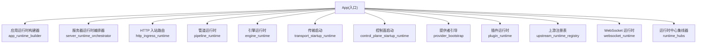
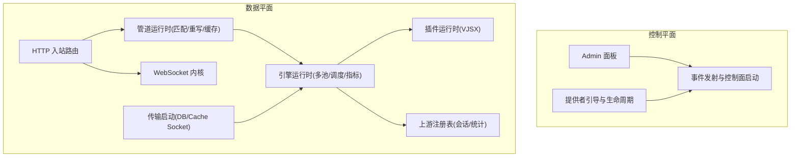
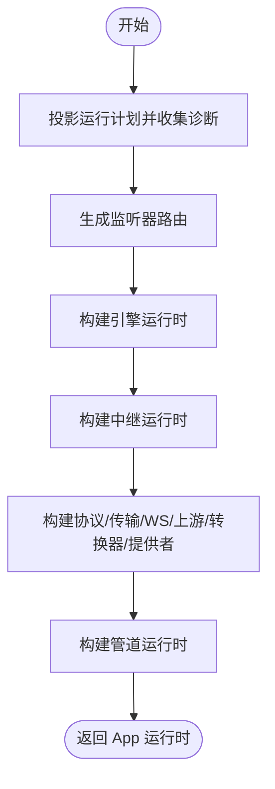
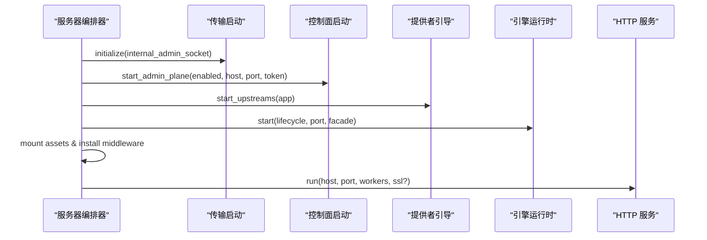
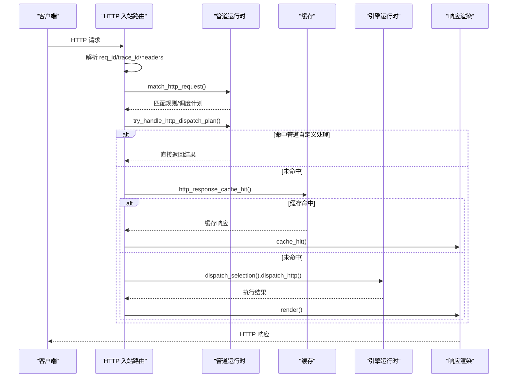
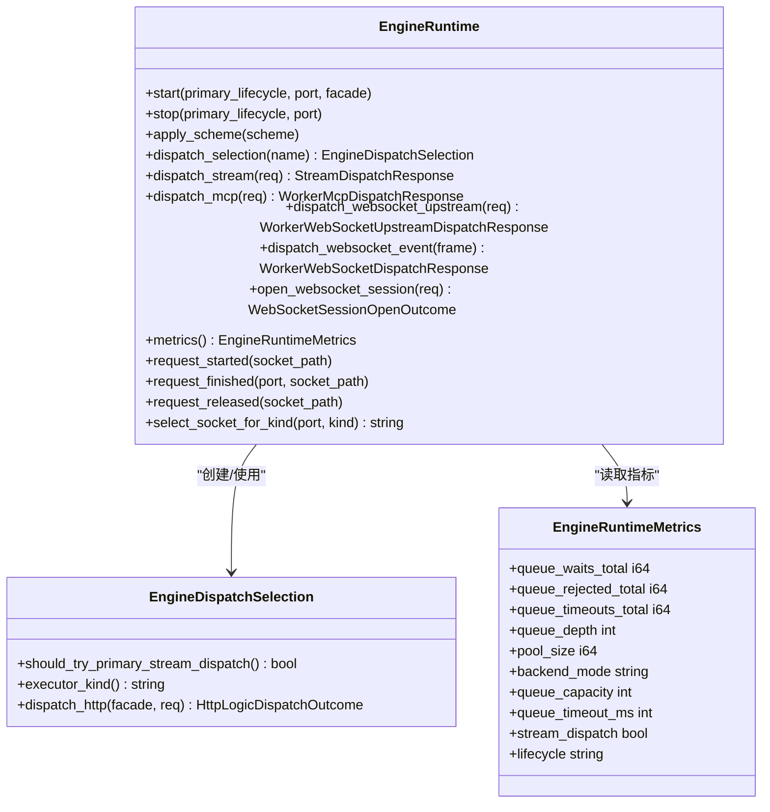
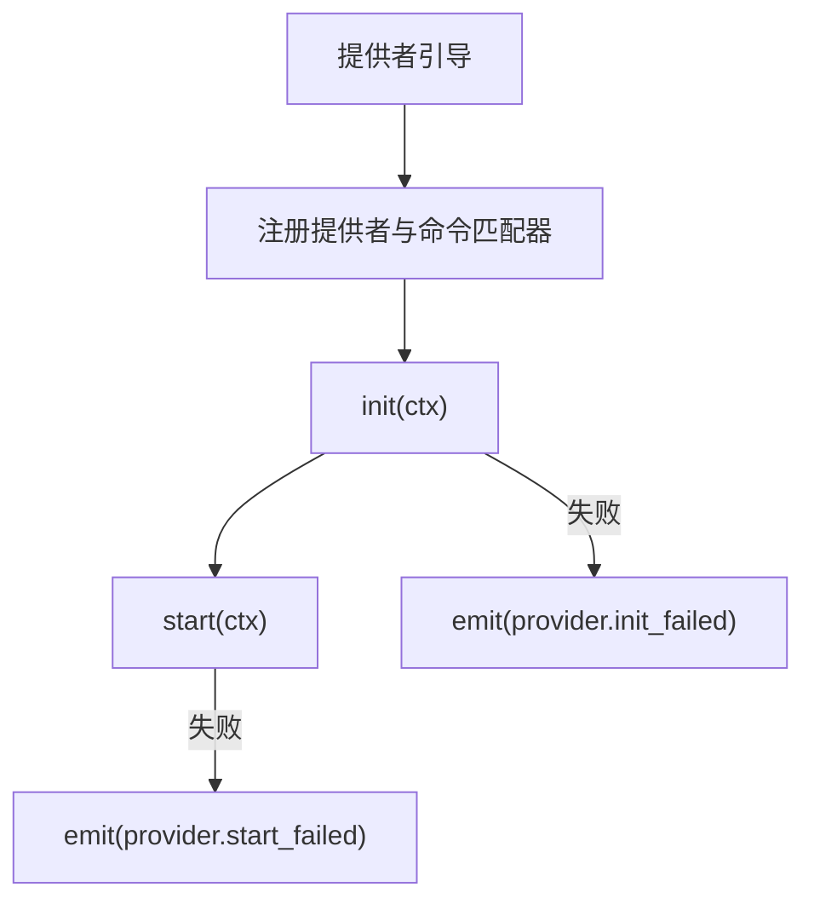
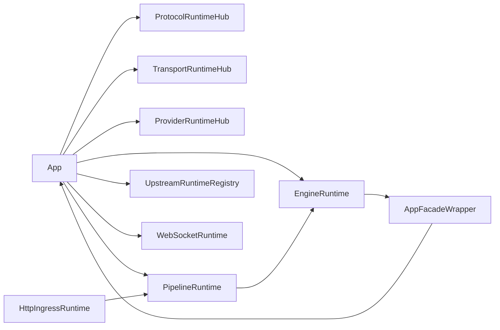

# 运行时架构

<cite>
**本文引用的文件**   
- [src/main.v](file://src/main.v)
- [src/app_runtime_builder.v](file://src/app_runtime_builder.v)
- [src/server_runtime_orchestrator.v](file://src/server_runtime_orchestrator.v)
- [src/engine_runtime.v](file://src/engine_runtime.v)
- [src/runtime_hubs.v](file://src/runtime_hubs.v)
- [src/control_plane_startup_runtime.v](file://src/control_plane_startup_runtime.v)
- [src/transport_startup_runtime.v](file://src/transport_startup_runtime.v)
- [src/provider_bootstrap.v](file://src/provider_bootstrap.v)
- [src/pipeline_runtime.v](file://src/pipeline_runtime.v)
- [src/http_ingress_runtime.v](file://src/http_ingress_runtime.v)
- [src/executor_bridge.v](file://src/executor_bridge.v)
- [src/plugin_runtime.v](file://src/plugin_runtime.v)
- [src/provider_runtime_hub.v](file://src/provider_runtime_hub.v)
- [src/upstream_runtime_registry.v](file://src/upstream_runtime_registry.v)
- [src/websocket_runtime.v](file://src/websocket_runtime.v)
</cite>

## 目录
1. [引言](#引言)
2. [项目结构](#项目结构)
3. [核心组件](#核心组件)
4. [架构总览](#架构总览)
5. [详细组件分析](#详细组件分析)
6. [依赖关系分析](#依赖关系分析)
7. [性能与并发模型](#性能与并发模型)
8. [监控与调试](#监控与调试)
9. [结论](#结论)
10. [附录](#附录)

## 引言
本文件深入解析 VHTTPD 的运行时架构设计，聚焦控制平面与数据平面的分离、应用运行时构建器与服务器运行时编排器的职责、插件系统与提供者模式、内存与线程模型、并发策略，以及运行时监控与调试方法。文档通过架构图与交互图展示组件通信协议与数据流向，帮助读者从高层到代码级全面理解系统。

## 项目结构
VHTTPD 的运行时由多个模块协同组成：入口 App 聚合控制面与数据面能力；应用运行时构建器负责基于运行计划装配引擎、传输、协议、管道与提供者；服务器运行时编排器负责启动生命周期、绑定端口、挂载中间件与上游服务；HTTP/WebSocket 入站路由将请求分发至执行引擎或协议处理器；插件与提供者提供可扩展能力；上游注册表管理外部会话；WebSocket 内核维护连接与会话状态。

图表来源
- [src/main.v:15-23](file://src/main.v#L15-L23)
- [src/app_runtime_builder.v:10-56](file://src/app_runtime_builder.v#L10-L56)
- [src/server_runtime_orchestrator.v:55-84](file://src/server_runtime_orchestrator.v#L55-L84)
- [src/http_ingress_runtime.v:31-40](file://src/http_ingress_runtime.v#L31-L40)
- [src/pipeline_runtime.v:40-56](file://src/pipeline_runtime.v#L40-L56)
- [src/engine_runtime.v:32-51](file://src/engine_runtime.v#L32-L51)
- [src/transport_startup_runtime.v:7-16](file://src/transport_startup_runtime.v#L7-L16)
- [src/control_plane_startup_runtime.v:8-18](file://src/control_plane_startup_runtime.v#L8-L18)
- [src/provider_bootstrap.v:9-25](file://src/provider_bootstrap.v#L9-L25)
- [src/plugin_runtime.v:6-15](file://src/plugin_runtime.v#L6-L15)
- [src/upstream_runtime_registry.v:8-20](file://src/upstream_runtime_registry.v#L8-L20)
- [src/websocket_runtime.v:12-24](file://src/websocket_runtime.v#L12-L24)
- [src/runtime_hubs.v:10-31](file://src/runtime_hubs.v#L10-L31)

章节来源
- [src/main.v:15-23](file://src/main.v#L15-L23)
- [src/app_runtime_builder.v:10-56](file://src/app_runtime_builder.v#L10-L56)
- [src/server_runtime_orchestrator.v:55-84](file://src/server_runtime_orchestrator.v#L55-L84)

## 核心组件
- 入口 App：聚合控制面运行时、进程生命周期、静态资源、协议中心、传输中心、WebSocket、上游注册表、中继、转换器、引擎、提供者与管道等。
- 应用运行时构建器：基于运行计划生成监听器路由、诊断信息、引擎与中继运行时、协议与传输中心、WebSocket、上游注册表、转换器、引擎与提供者，并组装 PipelineRuntime。
- 服务器运行时编排器：预检绑定地址、初始化传输、启动内部管理与提供者、启动执行引擎生命周期、挂载静态资源与中间件、启动控制面、记录端点、启动数据面 HTTP 服务。
- HTTP 入站路由：处理 WebSocket 升级、协议路由、目录重定向、匹配规则、缓存命中、选择执行引擎、流式分发、渲染响应。
- 管道运行时：HTTP 匹配、重写目标、选择执行器、构造入站请求、缓存存取、中继描述符与交换。
- 引擎运行时：多池执行器（主/附加）、生命周期启停、环境注入、调度选择、指标统计、工作槽健康与重启。
- 传输启动：设置内部管理与 DB/Cache Socket 环境变量、启动 Cache 服务端、打印端点日志。
- 控制面启动：发射 server.started 事件、启动 Admin 面板。
- 提供者引导：按名称注册并启动 Feishu/Codex/DB/Ollama 等提供者，封装命令匹配与运行时驱动。
- 插件运行时：加载与调用 VJSX 插件，支持同步与流式调用。
- 上游注册表：管理外部上游会话、错误计数、快照导出。
- WebSocket 运行时：构建内核端口、连接注册、房间与元数据、广播与关闭。

章节来源
- [src/main.v:15-23](file://src/main.v#L15-L23)
- [src/app_runtime_builder.v:10-56](file://src/app_runtime_builder.v#L10-L56)
- [src/server_runtime_orchestrator.v:55-84](file://src/server_runtime_orchestrator.v#L55-L84)
- [src/http_ingress_runtime.v:31-139](file://src/http_ingress_runtime.v#L31-L139)
- [src/pipeline_runtime.v:40-224](file://src/pipeline_runtime.v#L40-L224)
- [src/engine_runtime.v:32-249](file://src/engine_runtime.v#L32-L249)
- [src/transport_startup_runtime.v:7-29](file://src/transport_startup_runtime.v#L7-L29)
- [src/control_plane_startup_runtime.v:8-31](file://src/control_plane_startup_runtime.v#L8-L31)
- [src/provider_bootstrap.v:9-143](file://src/provider_bootstrap.v#L9-L143)
- [src/plugin_runtime.v:6-56](file://src/plugin_runtime.v#L6-L56)
- [src/upstream_runtime_registry.v:8-168](file://src/upstream_runtime_registry.v#L8-L168)
- [src/websocket_runtime.v:12-99](file://src/websocket_runtime.v#L12-L99)

## 架构总览
VHTTPD 采用“控制平面 + 数据平面”的分离设计：
- 控制平面：Admin 面板、内部管理、事件发射、配置与运行计划诊断、提供者生命周期管理。
- 数据平面：HTTP/WebSocket 入站、路由匹配、缓存、执行引擎调度、上游转发、插件与提供者调用。

图表来源
- [src/control_plane_startup_runtime.v:8-31](file://src/control_plane_startup_runtime.v#L8-L31)
- [src/provider_bootstrap.v:9-143](file://src/provider_bootstrap.v#L9-L143)
- [src/http_ingress_runtime.v:31-139](file://src/http_ingress_runtime.v#L31-L139)
- [src/pipeline_runtime.v:40-224](file://src/pipeline_runtime.v#L40-L224)
- [src/engine_runtime.v:32-249](file://src/engine_runtime.v#L32-L249)
- [src/transport_startup_runtime.v:7-29](file://src/transport_startup_runtime.v#L7-L29)
- [src/plugin_runtime.v:6-56](file://src/plugin_runtime.v#L6-L56)
- [src/upstream_runtime_registry.v:8-168](file://src/upstream_runtime_registry.v#L8-L168)

## 详细组件分析

### 应用运行时构建器
作用与流程：
- 基于运行计划为指定监听器生成请求时路由与诊断信息。
- 构建引擎运行时、中继运行时、协议与传输中心、WebSocket、上游注册表、转换器、提供者与管道。
- 返回包含完整运行时结构的 App 引用。

图表来源
- [src/app_runtime_builder.v:10-56](file://src/app_runtime_builder.v#L10-L56)

章节来源
- [src/app_runtime_builder.v:10-56](file://src/app_runtime_builder.v#L10-L56)

### 服务器运行时编排器
职责：
- 预检绑定地址与 SSL 证书有效性。
- 初始化传输、启动内部管理与提供者、启动执行引擎生命周期、挂载静态资源与中间件、启动控制面、记录端点、启动数据面 HTTP 服务。

图表来源
- [src/server_runtime_orchestrator.v:55-126](file://src/server_runtime_orchestrator.v#L55-L126)
- [src/transport_startup_runtime.v:7-16](file://src/transport_startup_runtime.v#L7-L16)
- [src/control_plane_startup_runtime.v:20-31](file://src/control_plane_startup_runtime.v#L20-L31)
- [src/provider_bootstrap.v:9-25](file://src/provider_bootstrap.v#L9-L25)
- [src/engine_runtime.v:32-51](file://src/engine_runtime.v#L32-L51)

章节来源
- [src/server_runtime_orchestrator.v:55-126](file://src/server_runtime_orchestrator.v#L55-L126)

### HTTP 入站与管道分发
关键流程：
- 检测 WebSocket 升级，走 WS 代理。
- 尝试协议路由（如 MCP/OpenAI），否则进入通用处理。
- 计算 req_id/trace_id，标准化路径与查询，进行目录重定向。
- 匹配运行时计划中的路由规则，生成调度计划。
- 尝试管道自定义处理与缓存命中。
- 若无逻辑执行器则返回 404。
- 选择执行引擎（主/附加池），优先尝试主池流式分发。
- 构造逻辑执行请求并调度，渲染最终响应。

图表来源
- [src/http_ingress_runtime.v:31-139](file://src/http_ingress_runtime.v#L31-L139)
- [src/pipeline_runtime.v:91-172](file://src/pipeline_runtime.v#L91-L172)
- [src/pipeline_runtime.v:174-223](file://src/pipeline_runtime.v#L174-L223)
- [src/engine_runtime.v:140-208](file://src/engine_runtime.v#L140-L208)

章节来源
- [src/http_ingress_runtime.v:31-139](file://src/http_ingress_runtime.v#L31-L139)
- [src/pipeline_runtime.v:91-223](file://src/pipeline_runtime.v#L91-L223)
- [src/engine_runtime.v:140-208](file://src/engine_runtime.v#L140-L208)

### 引擎运行时与工作槽管理
要点：
- 主执行器与附加执行器共享生命周期接口，支持 warmup/close。
- 通过 EngineLifecyclePort 回调事件（如 max_requests_reached）。
- 根据 kind 选择执行器，支持流式与常规 HTTP 调度。
- 维护工作槽状态（inflight/served/max_requests），触发优雅重启。
- 暴露指标（队列等待/拒绝/超时、深度、池大小、后端模式、超时容量等）。

图表来源
- [src/engine_runtime.v:32-249](file://src/engine_runtime.v#L32-L249)
- [src/engine_runtime.v:78-155](file://src/engine_runtime.v#L78-L155)
- [src/engine_runtime.v:98-110](file://src/engine_runtime.v#L98-L110)

章节来源
- [src/engine_runtime.v:32-249](file://src/engine_runtime.v#L32-L249)

### 传输启动与环境注入
- 设置内部管理 Socket、DB/Cache Socket 环境变量。
- 启动 Cache 服务端（Unix Socket）。
- 输出 DB/Cache 上游端点日志。

章节来源
- [src/transport_startup_runtime.v:7-29](file://src/transport_startup_runtime.v#L7-L29)

### 控制面启动与事件
- 发射 server.started 事件，包含 scheme/host/port/admin 信息。
- 可选启动 Admin 面板，输出 UI 访问地址。

章节来源
- [src/control_plane_startup_runtime.v:8-31](file://src/control_plane_startup_runtime.v#L8-L31)

### 提供者引导与提供者模式
- 按名称注册并提供运行时驱动、命令匹配器、路由类型、处理器与运行时适配器。
- 支持 Feishu/Codex/DB/Ollama 等提供者，按需启用。
- 启动失败时发射 provider.init_failed/start_failed 事件。

图表来源
- [src/provider_bootstrap.v:9-143](file://src/provider_bootstrap.v#L9-L143)

章节来源
- [src/provider_bootstrap.v:9-143](file://src/provider_bootstrap.v#L9-L143)

### 插件系统（VJSX）
- 构建 VJSX 插件运行时集合，支持同步与流式调用。
- 通过 AppFacade 桥接调用宿主能力。
- 关闭所有插件以释放资源。

章节来源
- [src/plugin_runtime.v:6-56](file://src/plugin_runtime.v#L6-L56)
- [src/executor_bridge.v:186-194](file://src/executor_bridge.v#L186-L194)

### 上游注册表（外部会话）
- 注册/注销外部上游会话，记录错误计数。
- 支持分页快照导出，用于管理界面展示。

章节来源
- [src/upstream_runtime_registry.v:8-168](file://src/upstream_runtime_registry.v#L8-L168)

### WebSocket 运行时
- 构建内核端口，封装帧构建与事件分发。
- 维护连接注册、房间成员、元数据、广播与关闭。
- 支持跟随失败的后续处理（当前为占位实现）。

章节来源
- [src/websocket_runtime.v:12-99](file://src/websocket_runtime.v#L12-L99)

## 依赖关系分析
- App 作为聚合根，依赖各运行时中心集线器（Protocol/Transport/Engine/Provider/Pipeline/Relay/Transformer/Upstream/WebSocket）。
- HTTP 入站依赖管道运行时进行匹配与缓存，再委托引擎运行时执行。
- 引擎运行时依赖工作槽与后端执行器，通过 AppFacade 回调 App 能力。
- 传输启动向引擎注入环境变量，控制面启动与提供者引导独立于数据面。

图表来源
- [src/runtime_hubs.v:10-31](file://src/runtime_hubs.v#L10-L31)
- [src/http_ingress_runtime.v:31-139](file://src/http_ingress_runtime.v#L31-L139)
- [src/pipeline_runtime.v:40-224](file://src/pipeline_runtime.v#L40-L224)
- [src/engine_runtime.v:32-249](file://src/engine_runtime.v#L32-L249)
- [src/executor_bridge.v:12-22](file://src/executor_bridge.v#L12-L22)

章节来源
- [src/runtime_hubs.v:10-31](file://src/runtime_hubs.v#L10-L31)
- [src/http_ingress_runtime.v:31-139](file://src/http_ingress_runtime.v#L31-L139)
- [src/pipeline_runtime.v:40-224](file://src/pipeline_runtime.v#L40-L224)
- [src/engine_runtime.v:32-249](file://src/engine_runtime.v#L32-L249)
- [src/executor_bridge.v:12-22](file://src/executor_bridge.v#L12-L22)

## 性能与并发模型
- 多线程模型：HTTP 服务以多 worker 模式运行，每个 worker 可持有多个 socket 连接；引擎运行时维护工作槽并发状态（inflight/served）。
- 并发策略：
  - 请求开始/结束/释放钩子更新工作槽计数，避免泄漏。
  - 达到最大请求数后标记 draining，空闲时优雅重启工作槽。
  - 主池可选择流式分发以降低延迟。
- 指标观测：队列等待/拒绝/超时、深度、池大小、后端模式、超时容量、是否流式分发、生命周期状态。
- 内存管理：
  - 通过工作槽生命周期与请求计数控制内存占用峰值。
  - 插件与上游会话在关闭/注销时释放资源。
  - 缓存命中减少重复计算与 IO。

章节来源
- [src/engine_runtime.v:251-361](file://src/engine_runtime.v#L251-L361)
- [src/engine_runtime.v:234-249](file://src/engine_runtime.v#L234-L249)
- [src/pipeline_runtime.v:174-223](file://src/pipeline_runtime.v#L174-L223)

## 监控与调试
- 运行时追踪：
  - 关键事件（server.started/failed/stopped、admin.started/failed、internal_admin.error、worker.select.failed）写入 /tmp/vhttpd_runtime_trace.log。
  - 事件字段包含时间戳、标签、PID 与上下文信息。
- 启动日志：
  - 数据面端点（scheme/host/port）、Admin 面板地址、DB/Cache 上游端点。
- 管理面板：
  - 可选启动 Admin 面板，提供运行时概览与操作入口。
- 上游会话快照：
  - 支持分页与过滤，便于定位问题。
- 指标采集：
  - 引擎运行时指标可用于告警与容量规划。

章节来源
- [src/main.v:25-81](file://src/main.v#L25-L81)
- [src/control_plane_startup_runtime.v:8-31](file://src/control_plane_startup_runtime.v#L8-L31)
- [src/transport_startup_runtime.v:18-29](file://src/transport_startup_runtime.v#L18-L29)
- [src/upstream_runtime_registry.v:98-168](file://src/upstream_runtime_registry.v#L98-L168)
- [src/engine_runtime.v:234-249](file://src/engine_runtime.v#L234-L249)

## 结论
VHTTPD 的运行时以“控制面/数据面”分离为核心，通过应用运行时构建器与服务器运行时编排器完成装配与启动。HTTP/WebSocket 入站经管道匹配与缓存优化后，交由引擎运行时调度执行，结合插件与提供者扩展能力，形成高内聚、低耦合的可插拔架构。工作槽生命周期与指标体系保障了系统的稳定性与可观测性。

## 附录
- 术语说明：
  - 控制平面：管理与运维相关功能（Admin、事件、提供者生命周期）。
  - 数据平面：请求处理与业务执行（HTTP/WebSocket、路由、缓存、执行器）。
  - 执行器：承载业务逻辑的运行环境（如 VJSX、PHP-CGI 等）。
  - 提供者：面向第三方服务的适配层（Feishu/Codex/DB/Ollama）。
  - 插件：可插拔的业务扩展（VJSX）。
  - 上游：外部会话与转发的远端服务。