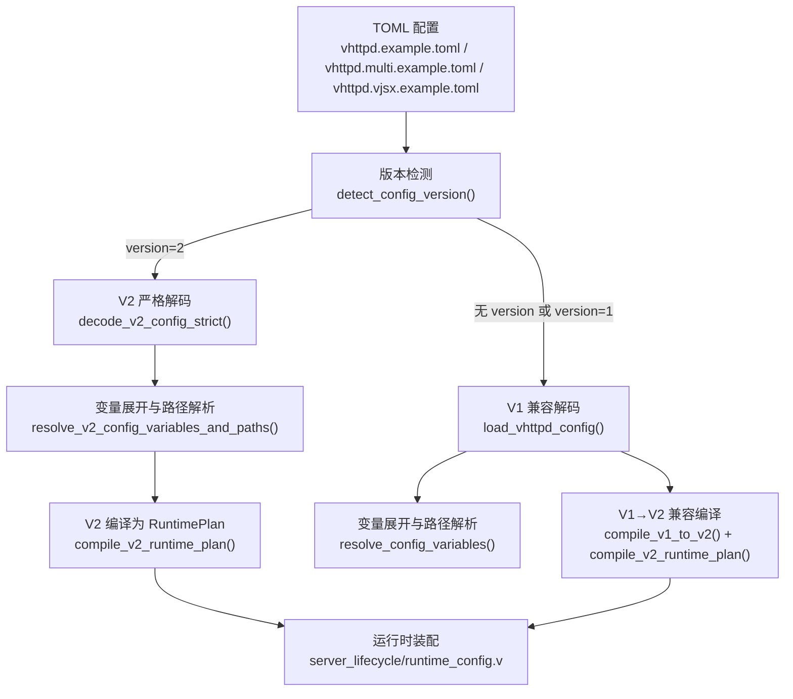
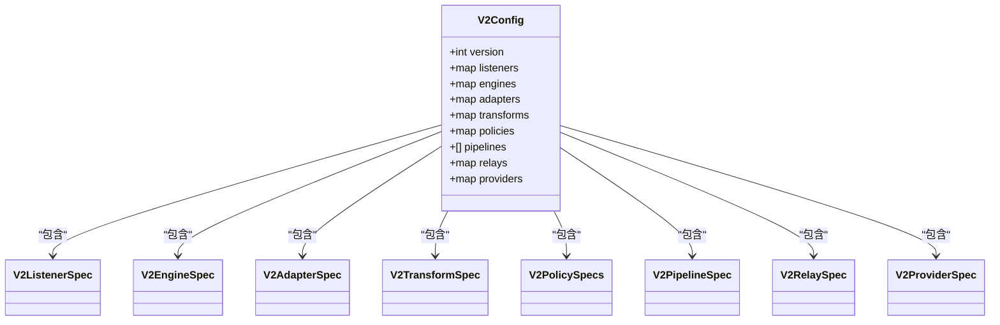
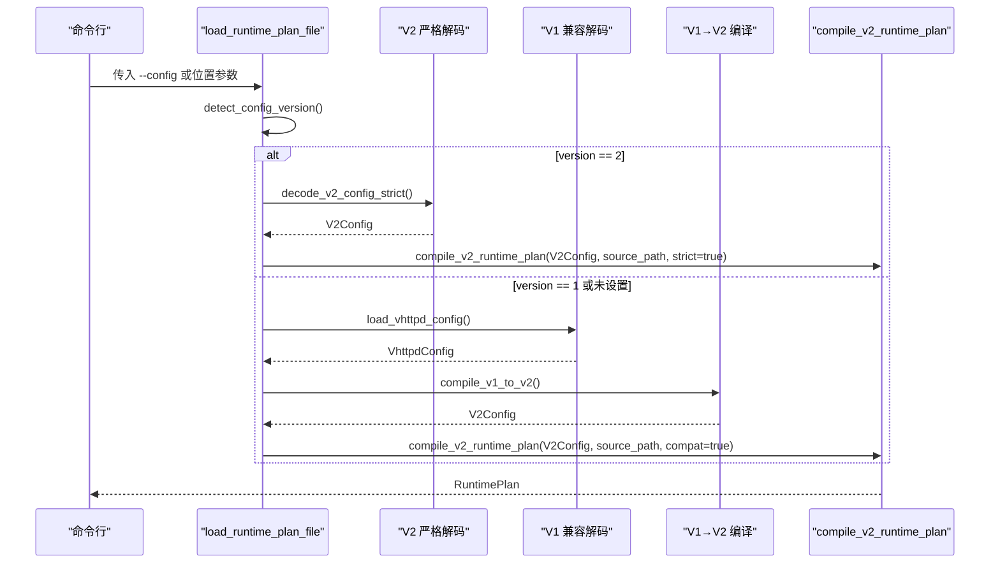
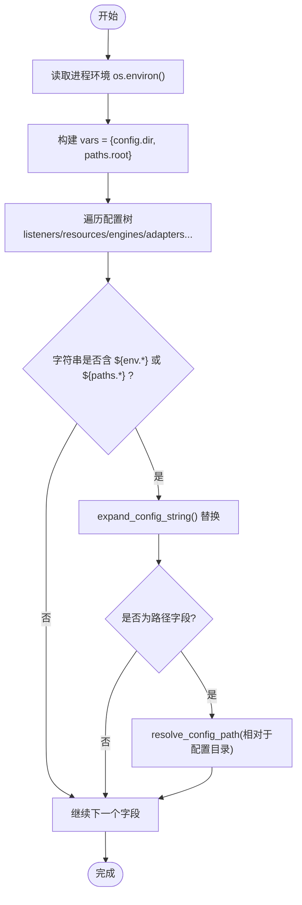
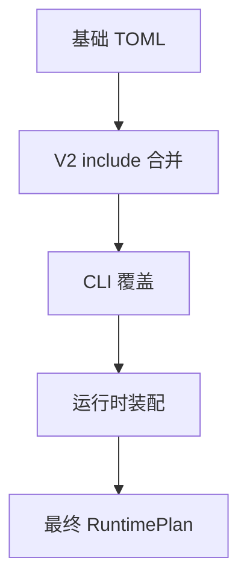
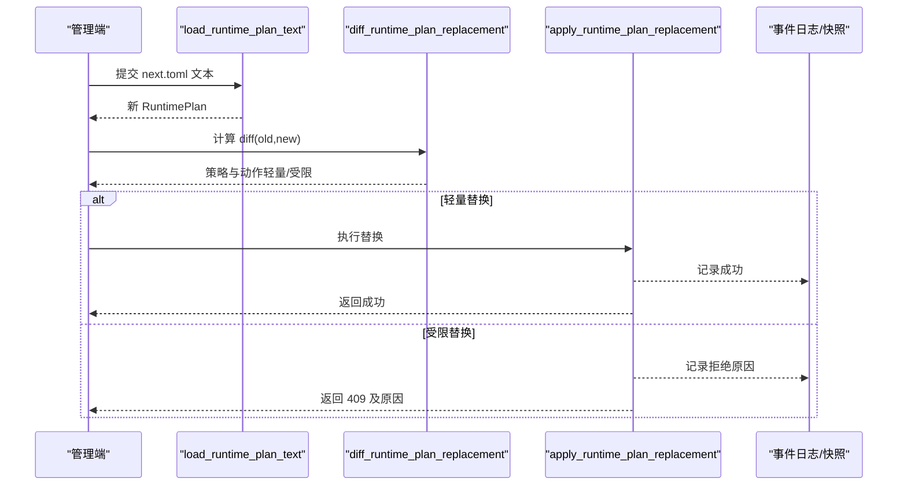
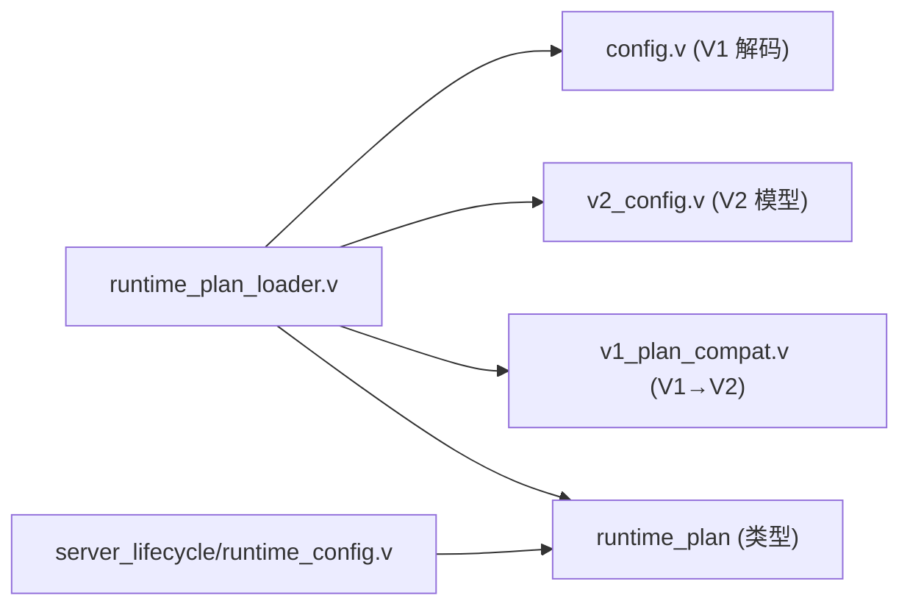

# 配置系统

<cite>
**本文引用的文件**   
- [config.v](file://src/config/config.v)
- [v2_config.v](file://src/config/v2_config.v)
- [runtime_plan_loader.v](file://src/config/runtime_plan_loader.v)
- [v1_plan_compat.v](file://src/config/v1_plan_compat.v)
- [runtime_plan_cli_overlay.v](file://src/config/runtime_plan_cli_overlay.v)
- [server_lifecycle_runtime_config.v](file://src/server_lifecycle/runtime_config.v)
- [CONFIGURATION_MODEL_V2.md](file://docs/CONFIGURATION_MODEL_V2.md)
- [PROTOCOL_PIPELINE_IMPLEMENTATION_PLAN.md](file://docs/PROTOCOL_PIPELINE_IMPLEMENTATION_PLAN.md)
- [README.md](file://README.md)
- [vhttpd.example.toml](file://config/vhttpd.example.toml)
- [vhttpd.multi.example.toml](file://config/vhttpd.multi.example.toml)
- [vhttpd.vjsx.example.toml](file://config/vhttpd.vjsx.example.toml)
</cite>

## 目录
1. [简介](#简介)
2. [项目结构](#项目结构)
3. [核心组件](#核心组件)
4. [架构总览](#架构总览)
5. [详细组件分析](#详细组件分析)
6. [依赖关系分析](#依赖关系分析)
7. [性能与扩展性](#性能与扩展性)
8. [故障排除指南](#故障排除指南)
9. [结论](#结论)
10. [附录：配置项参考与最佳实践](#附录配置项参考与最佳实践)

## 简介
本文件系统性阐述 VHTTPD 的配置系统架构与实现原理，覆盖以下主题：
- TOML 配置文件解析流程（V1 兼容与 V2 严格模式）
- 环境变量注入机制与路径别名系统
- 多层配置覆盖策略（全局、站点、执行器、CLI 覆盖）
- 运行时配置热更新机制与验证流程
- 完整配置项参考、常用模式与最佳实践
- 调试技巧与常见问题排查

## 项目结构
配置相关代码集中在 src/config 下，包含 V1/V2 两套模型、加载器、编译器与 CLI 覆盖层；示例配置位于 config 目录；设计目标与迁移路线在 docs 中说明。

图表来源
- [runtime_plan_loader.v:10-46](file://src/config/runtime_plan_loader.v#L10-L46)
- [config.v:448-482](file://src/config/config.v#L448-L482)
- [v1_plan_compat.v:5-9](file://src/config/v1_plan_compat.v#L5-L9)
- [v2_config.v:1-19](file://src/config/v2_config.v#L1-19)

章节来源
- [config.v:448-482](file://src/config/config.v#L448-L482)
- [runtime_plan_loader.v:10-46](file://src/config/runtime_plan_loader.v#L10-L46)
- [v1_plan_compat.v:5-9](file://src/config/v1_plan_compat.v#L5-L9)
- [v2_config.v:1-19](file://src/config/v2_config.v#L1-19)

## 核心组件
- 版本检测与入口
  - detect_config_version：从 TOML 的 version 字段判断 V1/V2
  - load_runtime_plan_file：根据版本选择 V2 严格解码或 V1 兼容路径
- V2 严格解码与校验
  - decode_v2_config_strict：严格键名校验、类型推断、扩展选项合并
  - validate_*：顶层与子表键白名单校验，拒绝未知字段
- V1 兼容解码与编译
  - load_vhttpd_config：读取并解析 V1 TOML，支持多监听器与站点
  - compile_v1_to_v2：将 V1 概念映射到 V2 资源/适配器/管道/策略
- 变量展开与路径解析
  - resolve_v2_config_variables_and_paths：对 V2 各段进行 ${env.X} 与 ${paths.*} 展开
  - resolve_config_variables：对 V1 各段进行相同处理
- CLI 覆盖层
  - apply_worker/php/vjsx_cli_overrides：命令行参数覆盖计划选项
- 运行时装配
  - server_lifecycle/runtime_config.v：基于 RuntimePlan 启动监听器、引擎、控制面等

章节来源
- [runtime_plan_loader.v:10-46](file://src/config/runtime_plan_loader.v#L10-L46)
- [runtime_plan_loader.v:108-117](file://src/config/runtime_plan_loader.v#L108-L117)
- [config.v:448-482](file://src/config/config.v#L448-L482)
- [v1_plan_compat.v:5-9](file://src/config/v1_plan_compat.v#L5-L9)
- [runtime_plan_cli_overlay.v:84-204](file://src/config/runtime_plan_cli_overlay.v#L84-L204)
- [server_lifecycle/runtime_config.v:89-112](file://src/server_lifecycle/runtime_config.v#L89-L112)

## 架构总览
V2 配置模型以“资源域”为中心，强调“一个概念一个家”，通过声明式计划（RuntimePlan）驱动运行时装配。V1 配置通过兼容层编译为 V2 计划，保证行为一致且可诊断。

图表来源
- [v2_config.v:1-19](file://src/config/v2_config.v#L1-19)
- [v2_config.v:120-155](file://src/config/v2_config.v#L120-L155)
- [v2_config.v:157-182](file://src/config/v2_config.v#L157-L182)
- [v2_config.v:184-197](file://src/config/v2_config.v#L184-L197)
- [v2_config.v:199-207](file://src/config/v2_config.v#L199-L207)
- [v2_config.v:279-288](file://src/config/v2_config.v#L279-L288)
- [v2_config.v:302-317](file://src/config/v2_config.v#L302-L317)
- [v2_config.v:261-269](file://src/config/v2_config.v#L261-L269)

## 详细组件分析

### TOML 解析与版本路由
- 入口函数 load_runtime_plan_file 依据 version 字段分流：
  - V2：严格解码、变量展开、编译为 RuntimePlan
  - V1：调用 V1 兼容解码，再经 V1→V2 编译
- 若未提供配置文件，返回默认配置并走 V1 兼容编译

图表来源
- [runtime_plan_loader.v:34-46](file://src/config/runtime_plan_loader.v#L34-L46)
- [runtime_plan_loader.v:108-117](file://src/config/runtime_plan_loader.v#L108-L117)
- [v1_plan_compat.v:5-9](file://src/config/v1_plan_compat.v#L5-L9)

章节来源
- [runtime_plan_loader.v:34-46](file://src/config/runtime_plan_loader.v#L34-L46)
- [config.v:448-482](file://src/config/config.v#L448-L482)
- [v1_plan_compat.v:5-9](file://src/config/v1_plan_compat.v#L5-L9)

### 环境变量注入机制
- V2 路径与值展开：
  - 内置变量：config.dir、paths.root
  - 环境变量：${env.VAR:-default}
  - 路径字段自动按配置目录相对解析
- V1 路径与值展开：
  - 同样支持 ${env.*} 与 ${paths.*}，并在多监听/站点场景下逐段展开

图表来源
- [runtime_plan_loader.v:416-493](file://src/config/runtime_plan_loader.v#L416-L493)
- [config.v:1861-1886](file://src/config/config.v#L1861-L1886)

章节来源
- [runtime_plan_loader.v:416-493](file://src/config/runtime_plan_loader.v#L416-L493)
- [config.v:1861-1886](file://src/config/config.v#L1861-L1886)

### 路径别名系统
- [paths] 定义根与别名集合，所有非绝对路径按 [paths].root 解析
- V2 中 paths.root 默认等于配置目录，便于 include 与相对路径
- 示例配置展示了 root、php_app、web_root 等常见别名用法

章节来源
- [README.md:613-617](file://README.md#L613-L617)
- [vhttpd.example.toml:1-6](file://config/vhttpd.example.toml#L1-L6)
- [vhttpd.multi.example.toml:1-10](file://config/vhttpd.multi.example.toml#L1-L10)
- [vhttpd.vjsx.example.toml:1-6](file://config/vhttpd.vjsx.example.toml#L1-L6)

### 多层配置覆盖策略
- 层级顺序（优先级由低到高）：
  1) 基础 TOML（V1 或 V2）
  2) V2 include 合并（同名 ID 冲突报错）
  3) CLI 覆盖（针对 worker/php/vjsx 等选项）
  4) 运行时装配时应用（如 admin 端口/令牌可由 CLI 覆盖）
- V2 include 合并规则：
  - 命名对象（listeners、engines、adapters、transforms、providers、relays、pipelines）按 ID 去重合并
  - 重复 ID 直接报错，避免静默覆盖
- CLI 覆盖范围：
  - worker 池大小、队列容量/超时、重启退避、最大请求数等
  - php 二进制、worker/app entry、extensions、args
  - vjsx entry/module_root/build_root/signature 等

图表来源
- [runtime_plan_loader.v:119-184](file://src/config/runtime_plan_loader.v#L119-L184)
- [runtime_plan_cli_overlay.v:84-204](file://src/config/runtime_plan_cli_overlay.v#L84-L204)
- [server_lifecycle/runtime_config.v:89-112](file://src/server_lifecycle/runtime_config.v#L89-L112)

章节来源
- [runtime_plan_loader.v:119-184](file://src/config/runtime_plan_loader.v#L119-L184)
- [runtime_plan_cli_overlay.v:84-204](file://src/config/runtime_plan_cli_overlay.v#L84-L204)
- [server_lifecycle/runtime_config.v:89-112](file://src/server_lifecycle/runtime_config.v#L89-L112)

### 运行时配置的热更新机制与验证流程
- 预览阶段：
  - 加载候选配置文本，生成新 RuntimePlan，计算差异（diff），输出允许的策略与动作清单
- 应用阶段：
  - 轻量替换：无需监听器重启/引擎排空/中继重载的变更可直接原子替换
  - 受限替换：需要监听器重启、引擎排空、中继重载或状态迁移的变更会被拒绝并给出结构化原因
- 观测性：
  - 预览/应用尝试均记录事件日志与快照，暴露于管理端点

图表来源
- [PROTOCOL_PIPELINE_IMPLEMENTATION_PLAN.md:1247-1254](file://docs/PROTOCOL_PIPELINE_IMPLEMENTATION_PLAN.md#L1247-L1254)
- [logic_executor_test.v:507-602](file://src/logic_executor_test.v#L507-L602)
- [runtime_plan/replacement_test.v:440-476](file://src/runtime_plan/replacement_test.v#L440-L476)

章节来源
- [PROTOCOL_PIPELINE_IMPLEMENTATION_PLAN.md:1247-1254](file://docs/PROTOCOL_PIPELINE_IMPLEMENTATION_PLAN.md#L1247-L1254)
- [logic_executor_test.v:507-602](file://src/logic_executor_test.v#L507-L602)
- [runtime_plan/replacement_test.v:440-476](file://src/runtime_plan/replacement_test.v#L440-L476)

### V1→V2 概念映射与站点 DSL
- V1 中的 server/listener/site/executor/routes 等概念被映射到 V2 的 listeners/engines/adapters/pipelines/policies 等稳定领域
- 站点 DSL 简化了 host/port/root/executor/worker.entry 等常用字段的表达
- 兼容性编译会产出诊断信息，提示哪些特性被转换

章节来源
- [CONFIGURATION_MODEL_V2.md:132-164](file://docs/CONFIGURATION_MODEL_V2.md#L132-L164)
- [v1_plan_compat.v:49-100](file://src/config/v1_plan_compat.v#L49-L100)
- [vhttpd.multi.example.toml:37-43](file://config/vhttpd.multi.example.toml#L37-L43)

## 依赖关系分析
- 模块耦合
  - runtime_plan_loader 依赖 toml 解析与 runtime_plan 类型
  - v1_plan_compat 仅负责将 V1 转为 V2，不持有运行时状态
  - server_lifecycle/runtime_config 消费 RuntimePlan 进行装配
- 外部依赖
  - TOML 库用于解析与类型推断
  - 操作系统 API 用于环境变量与文件系统路径解析

图表来源
- [runtime_plan_loader.v:1-6](file://src/config/runtime_plan_loader.v#L1-L6)
- [config.v:1-5](file://src/config/config.v#L1-L5)
- [v2_config.v:1-19](file://src/config/v2_config.v#L1-19)
- [v1_plan_compat.v:1-4](file://src/config/v1_plan_compat.v#L1-L4)
- [server_lifecycle/runtime_config.v:89-112](file://src/server_lifecycle/runtime_config.v#L89-L112)

章节来源
- [runtime_plan_loader.v:1-6](file://src/config/runtime_plan_loader.v#L1-L6)
- [config.v:1-5](file://src/config/config.v#L1-L5)
- [v2_config.v:1-19](file://src/config/v2_config.v#L1-19)
- [v1_plan_compat.v:1-4](file://src/config/v1_plan_compat.v#L1-L4)
- [server_lifecycle/runtime_config.v:89-112](file://src/server_lifecycle/runtime_config.v#L89-L112)

## 性能与扩展性
- 配置编译一次性完成，运行时只消费不可变计划，减少运行时开销
- V2 严格校验与白名单降低错误配置带来的运行时异常概率
- 通过 include 拆分配置，提升可维护性与复用性
- CLI 覆盖支持在不修改文件的情况下快速调优

[本节为通用指导，不直接分析具体文件]

## 故障排除指南
- 未知字段报错
  - V2 严格模式遇到未知键会直接报错，附带精确路径，便于定位
- 包含循环
  - include 检测到循环引用会报错，检查 include 路径与相对解析
- 重复 ID
  - include 合并时对同名 ID 报错，需调整名称避免冲突
- 监听器/中继/引擎变更受限
  - 预览阶段会明确告知是否需要监听器重启、引擎排空或中继重载，必要时分步操作

章节来源
- [runtime_plan_loader.v:505-533](file://src/config/runtime_plan_loader.v#L505-L533)
- [runtime_plan_loader.v:66-84](file://src/config/runtime_plan_loader.v#L66-L84)
- [runtime_plan_loader.v:134-141](file://src/config/runtime_plan_loader.v#L134-L141)
- [logic_executor_test.v:507-602](file://src/logic_executor_test.v#L507-L602)

## 结论
VHTTPD 配置系统以 V2 为核心，采用严格校验、声明式计划与一次编译的原则，结合 V1 兼容层平滑过渡。通过 include、CLI 覆盖与热更新预览/应用机制，兼顾安全性、可运维性与演进能力。

[本节为总结，不直接分析具体文件]

## 附录：配置项参考与最佳实践

### 常用配置项速览（节选）
- 全局与服务器
  - server.host/port、files.pid_file/event_log、runtime.timezone
- 工作进程与执行器
  - worker.pool_size/read_timeout_ms/max_requests/socket_prefix/env
  - executor.kind、php.bin/worker_entry/app_entry/extensions/args
  - vjsx.app_entry/module_root/build_root/runtime_profile/thread_count
- 静态资源与管理面板
  - assets.enabled/prefix/root/cache_control
  - admin.host/port/token
- 多站点与多监听器
  - sites.<id>.host/port/root/executor/worker.entry/php.bin/app
  - listeners.<id> 绑定与 SSL（V2）

章节来源
- [vhttpd.example.toml:1-67](file://config/vhttpd.example.toml#L1-L67)
- [vhttpd.multi.example.toml:1-73](file://config/vhttpd.multi.example.toml#L1-L73)
- [vhttpd.vjsx.example.toml:1-37](file://config/vhttpd.vjsx.example.toml#L1-L37)
- [README.md:447-531](file://README.md#L447-L531)

### 最佳实践建议
- 使用 V2 严格模式，利用 include 拆分公共与站点特定配置
- 通过 [paths] 集中管理路径别名，避免硬编码
- 敏感信息使用环境变量注入，避免写入仓库
- 优先使用 CLI 覆盖进行临时调优，保留基线配置
- 热更新前先预览差异，确认策略与动作符合预期

[本节为通用指导，不直接分析具体文件]