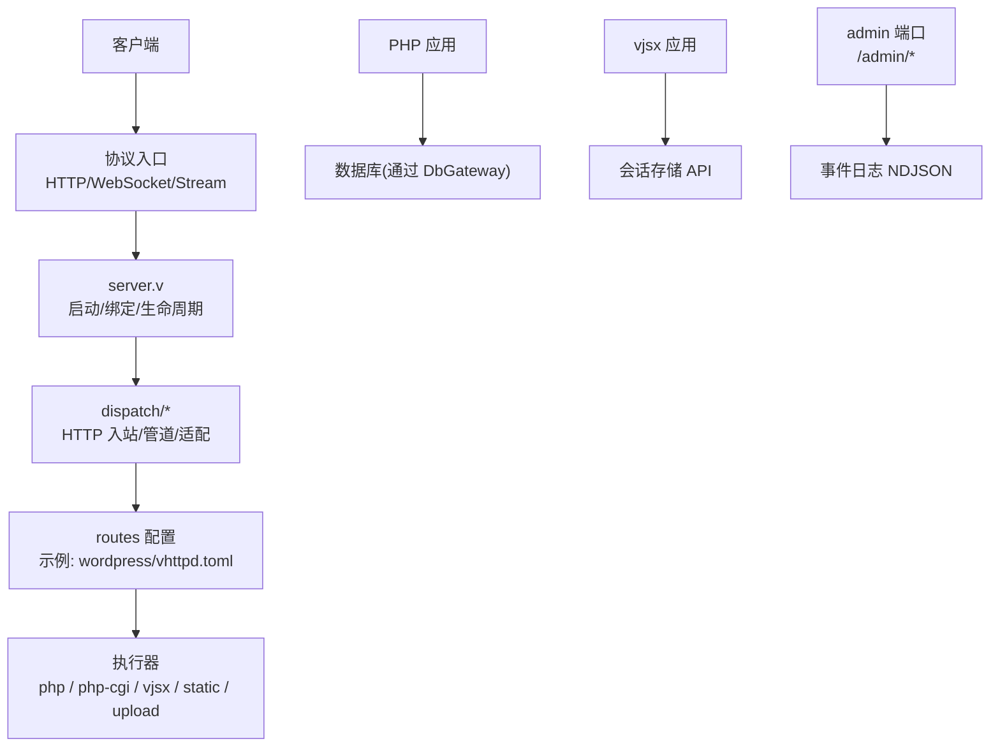
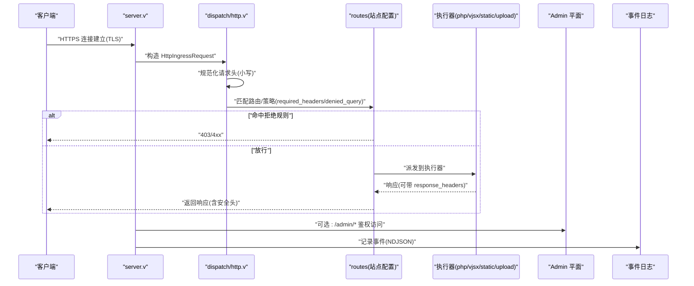
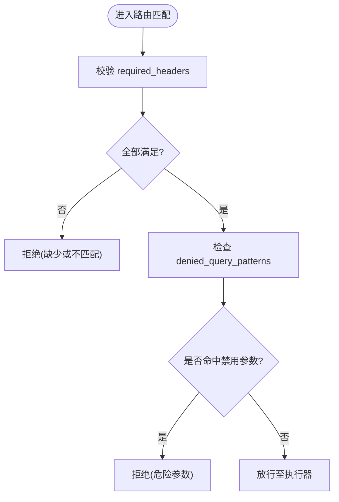
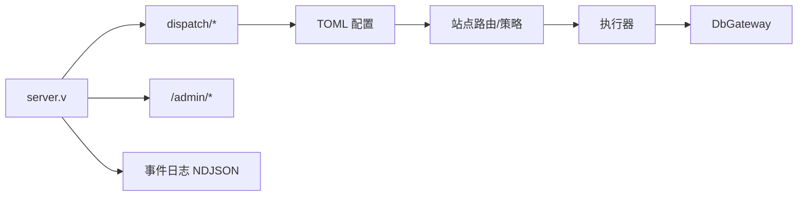

# 安全开发最佳实践

<cite>
**本文引用的文件**   
- [README.md](file://README.md)
- [config/vhttpd.example.toml](file://config/vhttpd.example.toml)
- [examples/wordpress/vhttpd.toml](file://examples/wordpress/vhttpd.toml)
- [src/config/config.v](file://src/config/config.v)
- [src/server.v](file://src/server.v)
- [src/dispatch/http.v](file://src/dispatch/http.v)
- [src/dispatch/pipeline.v](file://src/dispatch/pipeline.v)
- [src/api/mcp/protocol/state.v](file://src/api/mcp/protocol/state.v)
- [php/package/src/VHttpd/WordPress/Profiler.php](file://php/package/src/VHttpd/WordPress/Profiler.php)
- [articles/11-observability.md](file://articles/11-observability.md)
- [src/route_rule_test.v](file://src/route_rule_test.v)
- [src/server_logic_test.v](file://src/server_logic_test.v)
- [examples/laravel/vendor/fruitcake/php-cors/src/CorsService.php](file://examples/laravel/vendor/fruitcake/php-cors/src/CorsService.php)
- [php/package/src/VHttpd/DbGateway/PDOStatement.php](file://php/package/src/VHttpd/DbGateway/PDOStatement.php)
</cite>

## 目录
1. [简介](#简介)
2. [项目结构](#项目结构)
3. [核心组件](#核心组件)
4. [架构总览](#架构总览)
5. [详细组件分析](#详细组件分析)
6. [依赖关系分析](#依赖关系分析)
7. [性能与安全权衡](#性能与安全权衡)
8. [故障排查指南](#故障排查指南)
9. [结论](#结论)
10. [附录](#附录)

## 简介
本指南面向在 VHTTPD 上构建与运营安全、可观测、可治理的 Web 与 API 服务。内容覆盖 HTTPS/TLS 配置、访问控制策略、输入验证与过滤、SQL 注入防护、XSS 防护、认证与授权（含 JWT 与会话）、安全响应头、CORS、CSRF、API 安全设计（签名、限流、版本管理），以及日志审计、监控与漏洞扫描等运维实践。文中所有实现细节均基于仓库现有代码与示例配置，并给出“章节来源”以便追溯。

## 项目结构
VHTTPD 以 veb 为 HTTP 事实源，自身聚焦传输、执行器编排、流式处理与可观测性。安全相关能力分布在以下位置：
- 服务器与 TLS：配置结构与运行时解析
- 请求入站与管道：标准化头部、匹配规则、路由策略
- 站点与路由：静态直出、上传、REST 重写、响应头与缓存策略
- 管理平面：Admin 端口与鉴权
- 可观测性：事件日志与 Admin 指标
- PHP 侧工具：安全头检测与建议生成、数据库网关（参数化）

**图示来源** 
- [src/server.v:276-296](file://src/server.v#L276-L296)
- [src/dispatch/http.v:1-55](file://src/dispatch/http.v#L1-L55)
- [examples/wordpress/vhttpd.toml:1-290](file://examples/wordpress/vhttpd.toml#L1-L290)
- [articles/11-observability.md:1-405](file://articles/11-observability.md#L1-L405)

**章节来源**
- [README.md:1-174](file://README.md#L1-L174)
- [src/server.v:276-296](file://src/server.v#L276-L296)
- [src/dispatch/http.v:1-55](file://src/dispatch/http.v#L1-L55)
- [examples/wordpress/vhttpd.toml:1-290](file://examples/wordpress/vhttpd.toml#L1-L290)

## 核心组件
- 服务器与 TLS 配置
  - 支持通过 TOML 的 [server.ssl] 启用 HTTPS，并提供 CLI 覆盖证书路径。
  - 参考：[ServerSslConfig:14-19](file://src/config/config.v#L14-L19)、[server_logic_test:204-240](file://src/server_logic_test.v#L204-L240)。
- 请求入站与标准化
  - 统一将请求头键名归一化为小写，便于后续策略匹配。
  - 参考：[http_request_exchange:20-46](file://src/dispatch/http.v#L20-L46)、[normalized_header_map:48-54](file://src/dispatch/http.v#L48-L54)。
- 路由与策略
  - 支持 required_headers、denied_query_patterns 等安全规则；示例测试覆盖缺失必填头与危险查询参数的拦截。
  - 参考：[route_rule_test:247-278](file://src/route_rule_test.v#L247-L278)。
- 站点路由与响应头
  - WordPress 示例中设置 X-Content-Type-Options、CORS 相关头、静态资源直出、上传限制与完成回调。
  - 参考：[examples/wordpress/vhttpd.toml:122-184](file://examples/wordpress/vhttpd.toml#L122-L184)。
- 管理平面鉴权
  - 通过 x-vhttpd-admin-token 或 admin_token 查询参数进行鉴权；未提供时返回 403。
  - 参考：[README.md:1187-1221](file://README.md#L1187-L1221)。
- 可观测性与审计
  - 事件日志 NDJSON 与 Admin 指标端点，用于安全审计与异常追踪。
  - 参考：[articles/11-observability.md:1-405](file://articles/11-observability.md#L1-L405)。

**章节来源**
- [src/config/config.v:14-19](file://src/config/config.v#L14-L19)
- [src/server_logic_test.v:204-240](file://src/server_logic_test.v#L204-L240)
- [src/dispatch/http.v:20-54](file://src/dispatch/http.v#L20-L54)
- [src/route_rule_test.v:247-278](file://src/route_rule_test.v#L247-L278)
- [examples/wordpress/vhttpd.toml:122-184](file://examples/wordpress/vhttpd.toml#L122-L184)
- [README.md:1187-1221](file://README.md#L1187-L1221)
- [articles/11-observability.md:1-405](file://articles/11-observability.md#L1-L405)

## 架构总览
下图展示从客户端到执行器的完整链路，标注了安全关键节点：TLS 终止、请求标准化、路由策略、响应头注入、管理平面鉴权与事件日志。

**图示来源** 
- [src/server.v:276-296](file://src/server.v#L276-L296)
- [src/dispatch/http.v:20-54](file://src/dispatch/http.v#L20-L54)
- [examples/wordpress/vhttpd.toml:122-184](file://examples/wordpress/vhttpd.toml#L122-L184)
- [README.md:1187-1221](file://README.md#L1187-L1221)
- [articles/11-observability.md:1-405](file://articles/11-observability.md#L1-L405)

## 详细组件分析

### HTTPS/TLS 配置
- 启用方式
  - 在 TOML 的 [server.ssl] 中设置 enabled/cert/cert_key，或通过 CLI --ssl-cert/--ssl-key 覆盖。
  - 参考：[ServerSslConfig:14-19](file://src/config/config.v#L14-L19)、[server_logic_test:204-240](file://src/server_logic_test.v#L204-L240)。
- 环境变量与站点模式
  - 示例中通过 VHTTPD_SCHEME 与 VHTTPD_REQUEST_SCHEME 告知后端使用 https。
  - 参考：[examples/wordpress/vhttpd.toml:82-83](file://examples/wordpress/vhttpd.toml#L82-L83)。
- 多监听与多站点
  - 多监听模式下每个站点独立运行环境，便于按域/端口差异化安全策略。
  - 参考：[README.md:533-603](file://README.md#L533-L603)。

**章节来源**
- [src/config/config.v:14-19](file://src/config/config.v#L14-L19)
- [src/server_logic_test.v:204-240](file://src/server_logic_test.v#L204-L240)
- [examples/wordpress/vhttpd.toml:82-83](file://examples/wordpress/vhttpd.toml#L82-L83)
- [README.md:533-603](file://README.md#L533-L603)

### 访问控制策略
- 管理平面鉴权
  - 当配置了 [admin].token 或 --admin-token 时，必须携带 x-vhttpd-admin-token 或 ?admin_token=，否则返回 403。
  - 参考：[README.md:1187-1221](file://README.md#L1187-L1221)。
- 路由级访问控制
  - required_headers：强制要求特定请求头存在且满足值约束。
  - denied_query_patterns：禁止包含危险查询参数。
  - 参考：[route_rule_test:247-278](file://src/route_rule_test.v#L247-L278)。

**图示来源** 
- [src/route_rule_test.v:247-278](file://src/route_rule_test.v#L247-L278)

**章节来源**
- [README.md:1187-1221](file://README.md#L1187-L1221)
- [src/route_rule_test.v:247-278](file://src/route_rule_test.v#L247-L278)

### 输入验证与过滤
- 请求头标准化
  - 所有请求头键名被归一化为小写，避免大小写绕过。
  - 参考：[normalized_header_map:48-54](file://src/dispatch/http.v#L48-L54)。
- 请求体与路径
  - 路由层支持 rewrite 与 strip_prefix，结合 max_body_bytes 限制上传与请求体大小。
  - 参考：[examples/wordpress/vhttpd.toml:122-184](file://examples/wordpress/vhttpd.toml#L122-L184)。

**章节来源**
- [src/dispatch/http.v:48-54](file://src/dispatch/http.v#L48-L54)
- [examples/wordpress/vhttpd.toml:122-184](file://examples/wordpress/vhttpd.toml#L122-L184)

### SQL 注入防护
- 参数化查询
  - DbGateway 的 PDOStatement 对绑定参数进行规范化与顺序化处理，通过 gatewayQuery/gatewayExecute 下发，避免拼接 SQL。
  - 参考：[PDOStatement:1-101](file://php/package/src/VHttpd/DbGateway/PDOStatement.php#L1-L101)。
- 字符集与排序规则
  - 通过 SET NAMES/COLLATE 确保一致编码，降低编码攻击面。
  - 参考：[Wpdb::set_charset:93-111](file://php/package/src/VHttpd/WordPress/Wpdb.php#L93-L111)。

**章节来源**
- [php/package/src/VHttpd/DbGateway/PDOStatement.php:1-101](file://php/package/src/VHttpd/DbGateway/PDOStatement.php#L1-L101)
- [php/package/src/VHttpd/WordPress/Wpdb.php:93-111](file://php/package/src/VHttpd/WordPress/Wpdb.php#L93-L111)

### XSS 攻击防护
- 安全响应头建议
  - Profiler 会检测缺失的安全头并生成建议的 TOML 片段，包括 Content-Security-Policy、X-Frame-Options、X-Content-Type-Options、Referrer-Policy、Permissions-Policy。
  - 参考：[Profiler 安全头建议:1176-1197](file://php/package/src/VHttpd/WordPress/Profiler.php#L1176-L1197)。
- 站点级响应头
  - 在路由中直接注入 X-Content-Type-Options 等头，减少浏览器 MIME 嗅探风险。
  - 参考：[examples/wordpress/vhttpd.toml:129-184](file://examples/wordpress/vhttpd.toml#L129-L184)。

**章节来源**
- [php/package/src/VHttpd/WordPress/Profiler.php:1176-1197](file://php/package/src/VHttpd/WordPress/Profiler.php#L1176-L1197)
- [examples/wordpress/vhttpd.toml:129-184](file://examples/wordpress/vhttpd.toml#L129-L184)

### 认证与授权最佳实践
- 管理平面认证
  - 使用 x-vhttpd-admin-token 或 ?admin_token= 进行强认证，生产环境务必开启并严格保管 token。
  - 参考：[README.md:1187-1221](file://README.md#L1187-L1221)。
- 应用层认证（JWT/会话）
  - 建议在应用层实现 JWT 签发与校验、会话绑定 IP/UA、短 TTL 与刷新机制；在路由层配合 required_headers 校验 Authorization 头。
  - 参考：[route_rule_test:247-278](file://src/route_rule_test.v#L247-L278)。
- 权限模型
  - 基于角色的访问控制（RBAC）或基于资源的访问控制（ABAC），在中间件/处理器中集中校验，最小权限原则。

**章节来源**
- [README.md:1187-1221](file://README.md#L1187-L1221)
- [src/route_rule_test.v:247-278](file://src/route_rule_test.v#L247-L278)

### 安全响应头与 CORS 配置
- 安全响应头
  - 在路由中设置 X-Content-Type-Options、Access-Control-Allow-Methods/Headers/Max-Age 等。
  - 参考：[examples/wordpress/vhttpd.toml:174-184](file://examples/wordpress/vhttpd.toml#L174-L184)。
- CORS 策略
  - 建议使用白名单 Origin，避免 *；结合 Access-Control-Max-Age 优化预检缓存。
  - 参考：[Laravel CorsService:156-214](file://examples/laravel/vendor/fruitcake/php-cors/src/CorsService.php#L156-L214)。

**章节来源**
- [examples/wordpress/vhttpd.toml:174-184](file://examples/wordpress/vhttpd.toml#L174-L184)
- [examples/laravel/vendor/fruitcake/php-cors/src/CorsService.php:156-214](file://examples/laravel/vendor/fruitcake/php-cors/src/CorsService.php#L156-L214)

### CSRF 防护
- 推荐做法
  - 在表单与 AJAX 请求中引入一次性令牌（nonce），服务端校验来源与令牌一致性；敏感操作仅接受同源 POST/PUT/DELETE。
  - 结合路由层 denied_query_patterns 与 required_headers 强化校验。
  - 参考：[route_rule_test:247-278](file://src/route_rule_test.v#L247-L278)。

**章节来源**
- [src/route_rule_test.v:247-278](file://src/route_rule_test.v#L247-L278)

### API 安全设计原则
- 请求签名验证
  - 在 required_headers 中强制校验签名头（如 X-Signature），并在应用层验签。
- 速率限制
  - 在应用层实现基于 Redis 的滑动窗口或固定窗口限流，返回 429 并附带 Retry-After。
  - 参考：[高级模式文章中的速率限制示例:822-915](file://articles/12-advanced-patterns.md#L822-L915)。
- API 版本管理
  - 通过 URL 前缀或 Accept 头进行版本协商；在路由层按版本分流到不同执行器或处理器。

**章节来源**
- [src/route_rule_test.v:247-278](file://src/route_rule_test.v#L247-L278)
- [articles/12-advanced-patterns.md:822-915](file://articles/12-advanced-patterns.md#L822-L915)

### 日志审计与安全监控
- 事件日志
  - 输出 NDJSON 格式事件，包含 http.request、worker.*、upstream.*、error 等类型，便于审计与告警。
  - 参考：[可观测性文章:333-371](file://articles/11-observability.md#L333-L371)。
- Admin 指标
  - 暴露运行时摘要、Worker 状态、上游连接等，用于安全态势感知。
  - 参考：[可观测性文章:1-140](file://articles/11-observability.md#L1-L140)。

**章节来源**
- [articles/11-observability.md:1-140](file://articles/11-observability.md#L1-L140)
- [articles/11-observability.md:333-371](file://articles/11-observability.md#L333-L371)

### 漏洞扫描与合规检查
- 安全头自检
  - Profiler 自动检测缺失的安全头并生成建议配置，辅助合规检查。
  - 参考：[Profiler 安全头建议:1176-1197](file://php/package/src/VHttpd/WordPress/Profiler.php#L1176-L1197)。
- 集成 CI
  - 在流水线中加入安全头检查脚本与依赖漏洞扫描（例如对 PHP 依赖进行审计）。

**章节来源**
- [php/package/src/VHttpd/WordPress/Profiler.php:1176-1197](file://php/package/src/VHttpd/WordPress/Profiler.php#L1176-L1197)

## 依赖关系分析
- 模块耦合
  - server.v 负责生命周期与绑定；dispatch/* 负责入站与管道；站点配置驱动路由与策略；Admin 与事件日志解耦于数据平面。
- 外部依赖
  - 通过 DbGateway 与数据库交互；CORS 由框架库处理；Admin 鉴权由内置逻辑处理。

**图示来源** 
- [src/server.v:276-296](file://src/server.v#L276-L296)
- [src/dispatch/http.v:1-55](file://src/dispatch/http.v#L1-L55)
- [examples/wordpress/vhttpd.toml:1-290](file://examples/wordpress/vhttpd.toml#L1-L290)
- [php/package/src/VHttpd/DbGateway/PDOStatement.php:1-101](file://php/package/src/VHttpd/DbGateway/PDOStatement.php#L1-L101)
- [articles/11-observability.md:1-405](file://articles/11-observability.md#L1-L405)

**章节来源**
- [src/server.v:276-296](file://src/server.v#L276-L296)
- [src/dispatch/http.v:1-55](file://src/dispatch/http.v#L1-L55)
- [examples/wordpress/vhttpd.toml:1-290](file://examples/wordpress/vhttpd.toml#L1-L290)
- [php/package/src/VHttpd/DbGateway/PDOStatement.php:1-101](file://php/package/src/VHttpd/DbGateway/PDOStatement.php#L1-L101)
- [articles/11-observability.md:1-405](file://articles/11-observability.md#L1-L405)

## 性能与安全权衡
- 静态资源直出与缓存
  - 通过路由将静态资源交由 static 执行器直出，并设置长缓存与 immutable，提升性能同时减少动态处理面。
  - 参考：[examples/wordpress/vhttpd.toml:132-161](file://examples/wordpress/vhttpd.toml#L132-L161)。
- 请求体与队列限制
  - 使用 max_body_bytes 与 worker 队列容量/超时保护系统免受放大攻击与资源耗尽。
  - 参考：[examples/wordpress/vhttpd.toml:122-184](file://examples/wordpress/vhttpd.toml#L122-L184)。
- 响应头与兼容性
  - 安全头可能影响旧客户端行为，需灰度发布与回滚预案。

**章节来源**
- [examples/wordpress/vhttpd.toml:122-184](file://examples/wordpress/vhttpd.toml#L122-L184)

## 故障排查指南
- 管理平面无法访问
  - 确认已配置 [admin].token 并携带正确凭证；若 admin-port 为 0，则 /admin/* 仅在数据平面可用。
  - 参考：[README.md:1187-1221](file://README.md#L1187-L1221)。
- 安全头缺失告警
  - 使用 Profiler 生成的建议 TOML 片段快速补齐安全头。
  - 参考：[Profiler 安全头建议:1176-1197](file://php/package/src/VHttpd/WordPress/Profiler.php#L1176-L1197)。
- 路由拒绝请求
  - 检查 required_headers 与 denied_query_patterns 是否误配；查看事件日志定位失败原因。
  - 参考：[route_rule_test:247-278](file://src/route_rule_test.v#L247-L278)、[可观测性文章:333-371](file://articles/11-observability.md#L333-L371)。

**章节来源**
- [README.md:1187-1221](file://README.md#L1187-L1221)
- [php/package/src/VHttpd/WordPress/Profiler.php:1176-1197](file://php/package/src/VHttpd/WordPress/Profiler.php#L1176-L1197)
- [src/route_rule_test.v:247-278](file://src/route_rule_test.v#L247-L278)
- [articles/11-observability.md:333-371](file://articles/11-observability.md#L333-L371)

## 结论
VHTTPD 提供了完善的安全基座：TLS 终止、标准化入站、路由级访问控制、响应头加固、管理平面鉴权与可观测性。结合应用层的 JWT/会话、CSRF、签名与限流，可构建高安全性的 Web 与 API 服务。建议在生产环境中持续进行安全头自检、依赖漏洞扫描与事件日志审计，形成闭环的安全运营体系。

## 附录
- 示例配置
  - 基础示例：[config/vhttpd.example.toml:1-67](file://config/vhttpd.example.toml#L1-L67)
  - WordPress 站点：[examples/wordpress/vhttpd.toml:1-290](file://examples/wordpress/vhttpd.toml#L1-L290)
- 参考文档
  - 概览与架构：[README.md:1-174](file://README.md#L1-L174)
  - 可观测性实战：[articles/11-observability.md:1-405](file://articles/11-observability.md#L1-L405)