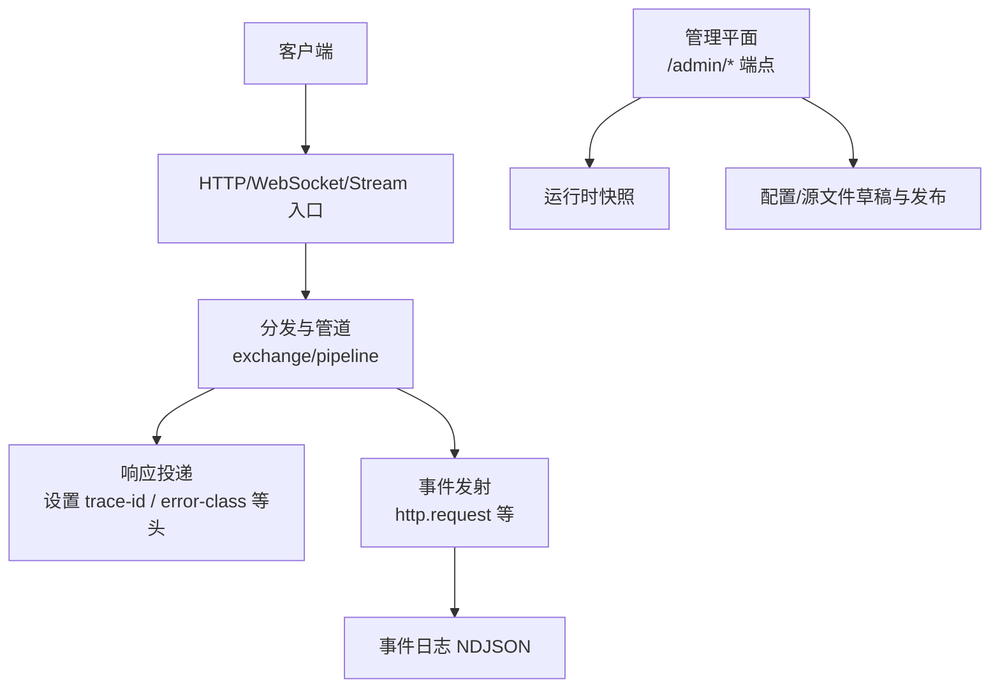
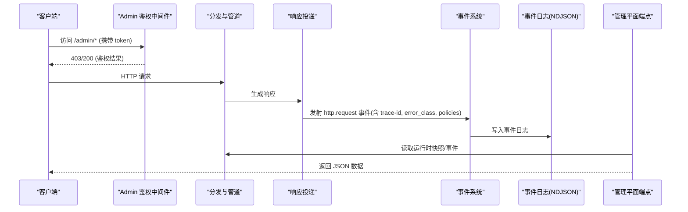
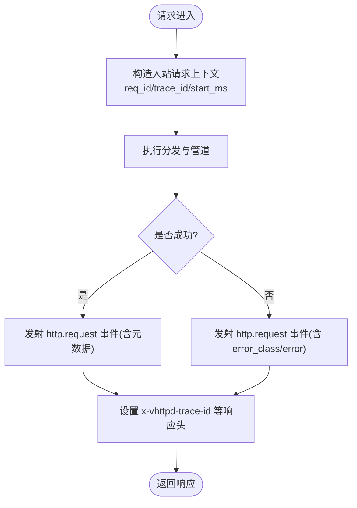
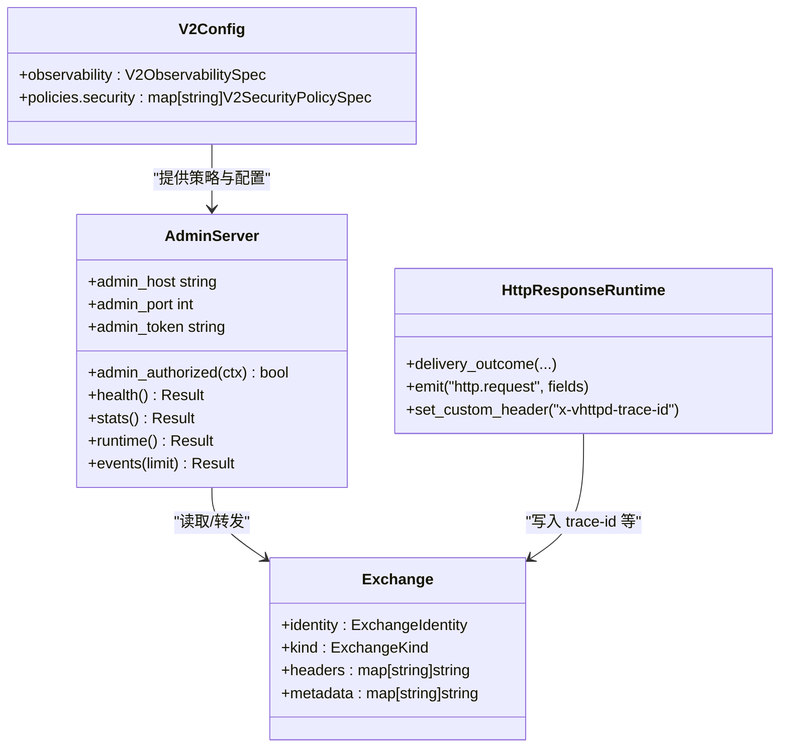

# 安全监控与审计

<cite>
**本文引用的文件**
- [README.md](file://README.md)
- [config/vhttpd.example.toml](file://config/vhttpd.example.toml)
- [src/logging/runtime_logger.v](file://src/logging/runtime_logger.v)
- [src/admin_server.v](file://src/admin_server.v)
- [src/dispatch/exchange.v](file://src/dispatch/exchange.v)
- [src/http_response_runtime.v](file://src/http_response_runtime.v)
- [src/config/v2_config.v](file://src/config/v2_config.v)
- [src/server_lifecycle/runtime_config.v](file://src/server_lifecycle/runtime_config.v)
- [articles/11-observability.md](file://articles/11-observability.md)
- [tests/e2e/config_acceptance_test.sh](file://tests/e2e/config_acceptance_test.sh)
</cite>

## 目录
1. [简介](#简介)
2. [项目结构](#项目结构)
3. [核心组件](#核心组件)
4. [架构总览](#架构总览)
5. [详细组件分析](#详细组件分析)
6. [依赖关系分析](#依赖关系分析)
7. [性能与安全考量](#性能与安全考量)
8. [故障排查指南](#故障排查指南)
9. [结论](#结论)
10. [附录](#附录)

## 简介
本指南面向生产环境的安全监控与审计实践，围绕以下目标展开：
- 安全事件日志记录：访问日志、错误日志、安全告警日志的配置与管理
- 安全监控指标收集：异常访问检测、暴力破解防护、资源滥用监控
- 安全审计能力：用户行为审计、配置变更审计、API 调用审计
- 威胁检测与入侵检测：结合现有可观测性能力给出最佳实践
- 应急响应流程：基于 Admin Plane 与事件日志的闭环处置

vhttpd 提供管理平面（Admin Plane）、结构化事件日志（NDJSON）以及丰富的运行时快照端点，为安全监控与审计提供了坚实基础。

## 项目结构
从安全与可观测性视角，关键位置包括：
- 管理平面与认证：admin 服务器、鉴权中间件、运行时快照端点
- 事件日志与追踪：请求/响应生命周期中的事件发射、trace-id 透传
- 配置模型：V2 配置中 observability、security 策略等
- 示例与文档：Prometheus 集成、日志轮转建议、Admin 端点说明

图表来源
- [src/admin_server.v:1-120](file://src/admin_server.v#L1-L120)
- [src/dispatch/exchange.v:1-160](file://src/dispatch/exchange.v#L1-L160)
- [src/http_response_runtime.v:82-129](file://src/http_response_runtime.v#L82-L129)
- [articles/11-observability.md:1-120](file://articles/11-observability.md#L1-L120)

章节来源
- [README.md:1-120](file://README.md#L1-L120)
- [config/vhttpd.example.toml:1-67](file://config/vhttpd.example.toml#L1-L67)

## 核心组件
- 管理平面（Admin Plane）
  - 提供 /health、/admin/workers、/admin/stats、/admin/runtime、/admin/events、/admin/schema 等端点
  - 通过 x-vhttpd-admin-token 或查询参数 admin_token 进行鉴权
  - 支持查看上游连接、WebSocket、MCP、Provider 实例等运行时状态
- 事件日志与追踪
  - 在响应投递阶段发射 http.request 事件，附带 pipeline、ingress、error_class、metadata 等字段
  - 将 trace-id 写入响应头 x-vhttpd-trace-id，便于跨层关联
- 配置与策略
  - V2 配置包含 observability（event_log、log_level、tracing）与 security（required_headers、denied_query_patterns、allowed_origins）
  - Admin 配置项 host/port/token 控制管理平面暴露与鉴权

章节来源
- [src/admin_server.v:100-120](file://src/admin_server.v#L100-L120)
- [src/http_response_runtime.v:82-129](file://src/http_response_runtime.v#L82-L129)
- [src/config/v2_config.v:59-72](file://src/config/v2_config.v#L59-L72)
- [config/vhttpd.example.toml:38-42](file://config/vhttpd.example.toml#L38-L42)

## 架构总览
下图展示了从请求进入、分发处理、响应投递到事件落盘与 Admin 可视化的整体链路，并标注了安全相关的关键点。

图表来源
- [src/admin_server.v:100-120](file://src/admin_server.v#L100-L120)
- [src/http_response_runtime.v:82-129](file://src/http_response_runtime.v#L82-L129)
- [src/dispatch/exchange.v:1-160](file://src/dispatch/exchange.v#L1-L160)

## 详细组件分析

### 管理平面与访问控制
- 鉴权方式
  - 优先从请求头 x-vhttpd-admin-token 读取，其次回退到查询参数 admin_token
  - 未通过鉴权的请求返回 403
- 关键端点
  - /health：健康检查
  - /admin/workers：Worker 池状态
  - /admin/stats：请求速率、延迟分位、错误分类统计
  - /admin/runtime：运行时摘要（worker、队列、连接数、内存等）
  - /admin/events：最近事件列表（分页限制）
  - /admin/schema：配置/策略模式定义
  - /admin/runtime/upstreams/websocket：上游 WebSocket 连接与事件
  - /admin/runtime/provider-instances：Provider 实例管理与快照
- 安全建议
  - 仅绑定本地回环地址（如 127.0.0.1），并通过反向代理或防火墙暴露
  - 使用强随机 token，定期轮换；生产环境禁止默认值
  - 对敏感端点增加二次校验或 IP 白名单（由外部网关实现）

章节来源
- [src/admin_server.v:100-120](file://src/admin_server.v#L100-L120)
- [src/admin_server.v:117-185](file://src/admin_server.v#L117-L185)
- [src/admin_server.v:623-740](file://src/admin_server.v#L623-L740)
- [config/vhttpd.example.toml:38-42](file://config/vhttpd.example.toml#L38-L42)

### 事件日志与追踪
- 事件发射
  - 在响应投递时发射 http.request 事件，包含 pipeline、ingress、error_class、error、metadata 等
  - 将 trace-id 注入响应头 x-vhttpd-trace-id，便于后续关联
- 日志级别与格式
  - 通过环境变量 VHTTPD_LOG_LEVEL 控制全局日志级别（debug/info/warn/error/fatal）
  - 生产构建默认 warn，开发默认 info
- 事件日志输出
  - 可通过 TOML 配置 files.event_log 指定 NDJSON 事件日志路径
  - 建议配合 logrotate 按日轮转，保留策略参考文章

图表来源
- [src/http_response_runtime.v:82-129](file://src/http_response_runtime.v#L82-L129)
- [src/logging/runtime_logger.v:1-42](file://src/logging/runtime_logger.v#L1-L42)
- [config/vhttpd.example.toml:12-15](file://config/vhttpd.example.toml#L12-L15)

章节来源
- [src/http_response_runtime.v:82-129](file://src/http_response_runtime.v#L82-L129)
- [src/logging/runtime_logger.v:1-42](file://src/logging/runtime_logger.v#L1-L42)
- [config/vhttpd.example.toml:12-15](file://config/vhttpd.example.toml#L12-L15)
- [articles/11-observability.md:436-466](file://articles/11-observability.md#L436-L466)

### 安全策略与访问控制
- 路由级安全策略（V2 配置）
  - required_headers：强制要求特定请求头存在且匹配
  - denied_query_patterns：拒绝包含危险查询参数的请求
  - allowed_origins：允许的来源域白名单
- 应用侧安全建议
  - 在 PHP/VJSX 应用中实现登录态校验、权限校验、限流与防重放
  - 对敏感接口启用签名校验与时间戳校验
- 测试覆盖
  - 单元测试验证 required_headers 与 denied_query_patterns 的匹配逻辑

章节来源
- [src/config/v2_config.v:224-229](file://src/config/v2_config.v#L224-L229)
- [src/route_rule_test.v:247-278](file://src/route_rule_test.v#L247-L278)

### 监控指标与 Prometheus 集成
- 内置指标
  - /admin/stats 提供请求总量、成功率、错误分类、延迟分位等
  - /admin/runtime 提供 worker 池、队列深度、活跃连接、内存等
- Prometheus 抓取
  - 通过 /admin/metrics 暴露 Prometheus text format（参考文章）
  - 建议在 prometheus.yml 中配置 metrics_path 与鉴权头
- 自定义指标
  - 在应用层通过 Metrics API 上报业务指标（如端点 QPS、耗时直方图）

章节来源
- [articles/11-observability.md:406-433](file://articles/11-observability.md#L406-L433)
- [src/admin_server.v:131-153](file://src/admin_server.v#L131-L153)

### 安全审计功能
- 用户行为审计
  - 利用 http.request 事件与 trace-id 关联用户会话与操作轨迹
  - 结合 Provider 实例快照（如 Feishu chats）进行消息收发审计
- 配置变更审计
  - /admin/config/files 与 /admin/source/files 提供配置/源码文件清单
  - 通过 /admin/drafts 与 publish 接口记录草稿与发布动作
- API 调用审计
  - Admin 端点统一记录 admin_endpoint、admin_action、pipeline、ingress 等元数据
  - 结合事件日志与 trace-id 进行端到端审计

章节来源
- [src/admin_server.v:307-403](file://src/admin_server.v#L307-L403)
- [src/admin_server.v:718-740](file://src/admin_server.v#L718-L740)
- [src/dispatch/exchange.v:1-160](file://src/dispatch/exchange.v#L1-L160)

### 威胁检测与入侵检测最佳实践
- 异常访问检测
  - 基于 /admin/stats 的错误率与延迟分位阈值告警
  - 基于 denied_query_patterns 与 required_headers 拦截可疑请求
- 暴力破解防护
  - 在应用层实现登录失败计数与临时封禁
  - 结合队列超时与容量指标（worker_queue_timeout、worker_queue_full）识别异常负载
- 资源滥用监控
  - 监控 worker_available、worker_queue_length、websocket_connections、mcp_sessions 等
  - 针对大文件上传与长连接场景设置 max_body_bytes 与超时策略

章节来源
- [tests/e2e/config_acceptance_test.sh:3203-3216](file://tests/e2e/config_acceptance_test.sh#L3203-L3216)
- [articles/11-observability.md:67-76](file://articles/11-observability.md#L67-L76)

### 应急响应流程
- 快速定位
  - 通过 /admin/events 获取最近事件，结合 trace-id 定位问题请求
  - 使用 /admin/runtime 与 /admin/workers 观察系统健康度
- 隔离与恢复
  - 通过 /admin/runtime/plan/replacement 预览/应用/取消运行时计划替换
  - 重启 Worker 或调整队列参数缓解拥塞
- 复盘与加固
  - 导出事件日志与快照，分析攻击面与漏洞点
  - 更新 security 策略与应用侧校验规则

章节来源
- [src/admin_server.v:470-557](file://src/admin_server.v#L470-L557)
- [src/admin_server.v:117-185](file://src/admin_server.v#L117-L185)

## 依赖关系分析
- 管理平面依赖
  - 鉴权中间件与 App 共享状态（AdminApp.shared）
  - 运行时快照来自 App 内部状态聚合
- 事件系统依赖
  - 响应投递模块负责发射 http.request 事件
  - 事件系统通过 RuntimeServices.emit 抽象，便于扩展
- 配置依赖
  - V2 配置解析后注入到运行时，影响 observability 与 security 策略

图表来源
- [src/admin_server.v:1-120](file://src/admin_server.v#L1-L120)
- [src/http_response_runtime.v:82-129](file://src/http_response_runtime.v#L82-L129)
- [src/dispatch/exchange.v:1-160](file://src/dispatch/exchange.v#L1-L160)
- [src/config/v2_config.v:59-72](file://src/config/v2_config.v#L59-L72)

章节来源
- [src/admin_server.v:1-120](file://src/admin_server.v#L1-L120)
- [src/http_response_runtime.v:82-129](file://src/http_response_runtime.v#L82-L129)
- [src/dispatch/exchange.v:1-160](file://src/dispatch/exchange.v#L1-L160)
- [src/config/v2_config.v:59-72](file://src/config/v2_config.v#L59-L72)

## 性能与安全考量
- 并发与锁优化
  - 只读快照建议使用读写锁提升并发性能（重构计划提及）
- 日志开销
  - 合理设置日志级别与采样率，避免高吞吐下 I/O 瓶颈
- 策略评估
  - required_headers 与 denied_query_patterns 应在早期短路拒绝，减少后端压力
- 资源上限
  - 合理配置 queue_capacity、queue_timeout_ms、max_requests 等，防止资源耗尽

[本节为通用指导，不直接分析具体文件]

## 故障排查指南
- 常见问题
  - 管理端点 403：检查 x-vhttpd-admin-token 或 admin_token 是否正确
  - 事件缺失：确认 event_log 路径可写，进程有权限写入
  - 指标不可用：确认 /admin/metrics 已启用且被 Prometheus 正确抓取
- 诊断步骤
  - 使用 /admin/events 与 /admin/runtime 定位异常
  - 结合 trace-id 在事件日志中检索完整链路
  - 检查 security 策略是否误拦截正常请求

章节来源
- [src/admin_server.v:100-120](file://src/admin_server.v#L100-L120)
- [config/vhttpd.example.toml:12-15](file://config/vhttpd.example.toml#L12-L15)
- [articles/11-observability.md:406-433](file://articles/11-observability.md#L406-L433)

## 结论
vhttpd 的管理平面、事件日志与 V2 配置模型为安全监控与审计提供了完善基础。通过合理配置 security 策略、采集与告警关键指标、实施用户行为与配置变更审计，并结合应急响应流程，可有效提升系统的可观测性与安全性。

[本节为总结，不直接分析具体文件]

## 附录
- 配置要点
  - 管理平面：host/port/token
  - 事件日志：files.event_log
  - 日志级别：VHTTPD_LOG_LEVEL
  - 安全策略：required_headers、denied_query_patterns、allowed_origins
- 推荐工具
  - Prometheus + Grafana 可视化
  - logrotate 日志轮转
  - 集中式日志系统（ELK/Loki）

章节来源
- [config/vhttpd.example.toml:12-15](file://config/vhttpd.example.toml#L12-L15)
- [src/logging/runtime_logger.v:1-42](file://src/logging/runtime_logger.v#L1-L42)
- [src/config/v2_config.v:224-229](file://src/config/v2_config.v#L224-L229)
- [articles/11-observability.md:436-466](file://articles/11-observability.md#L436-L466)