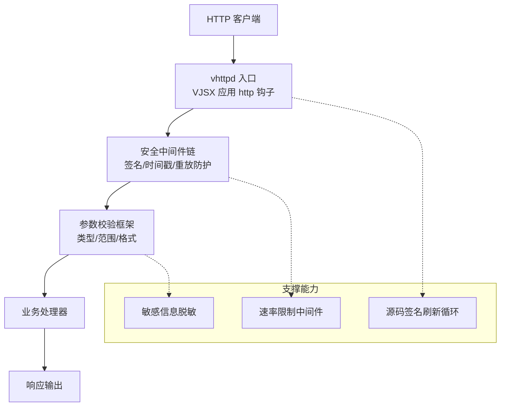
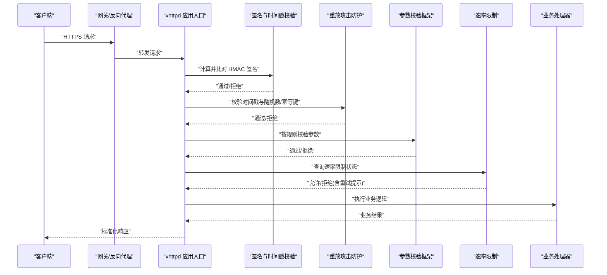
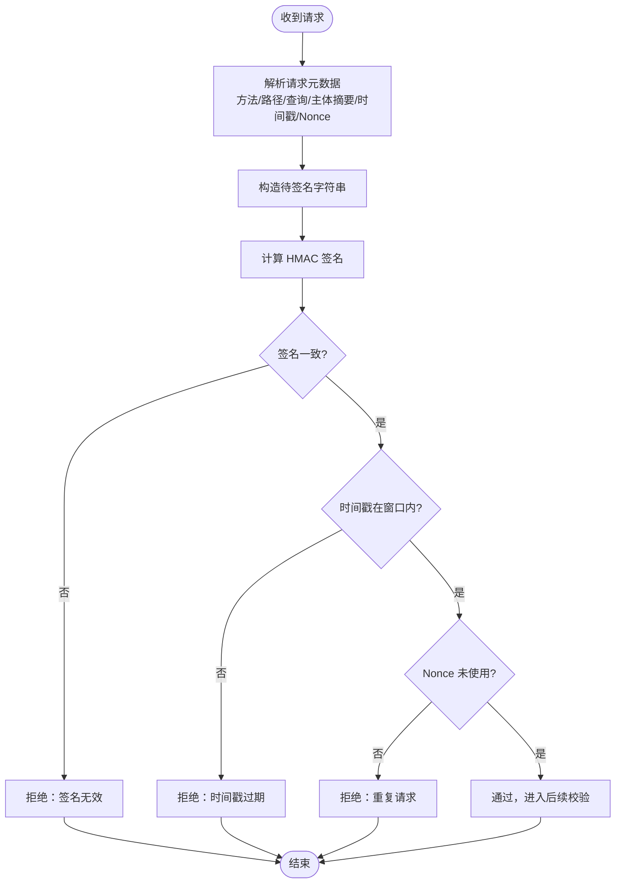
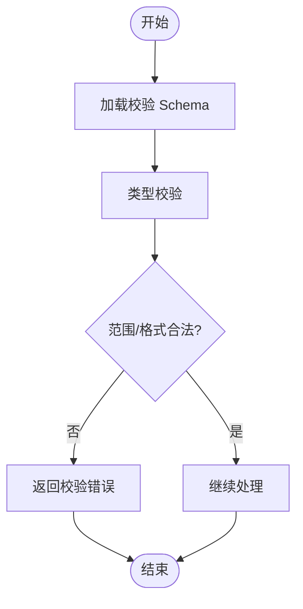
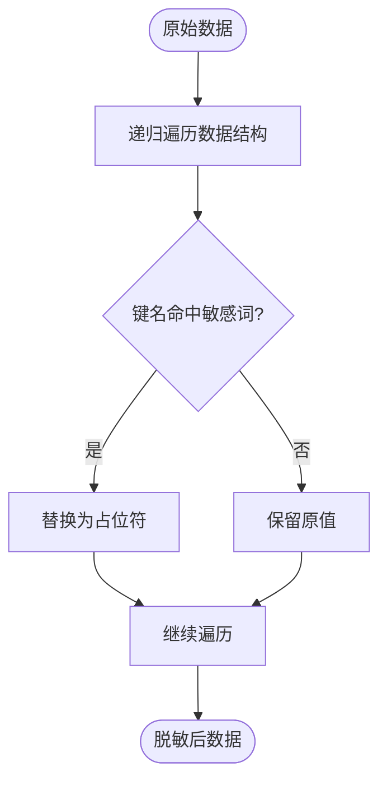
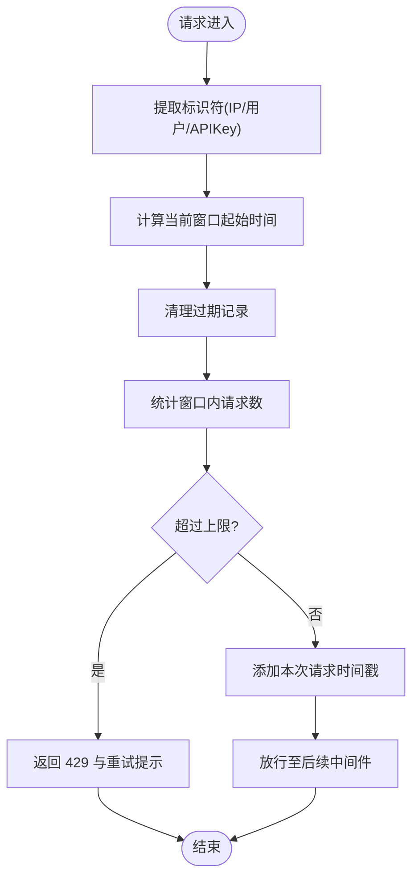
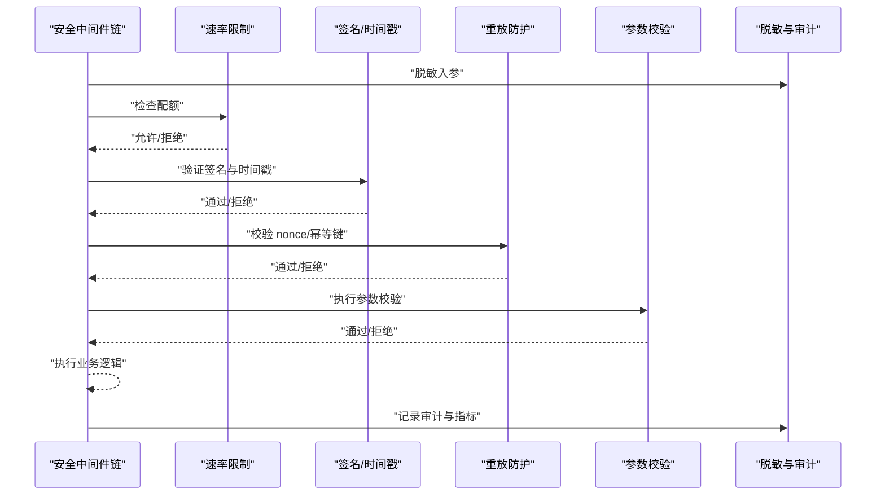
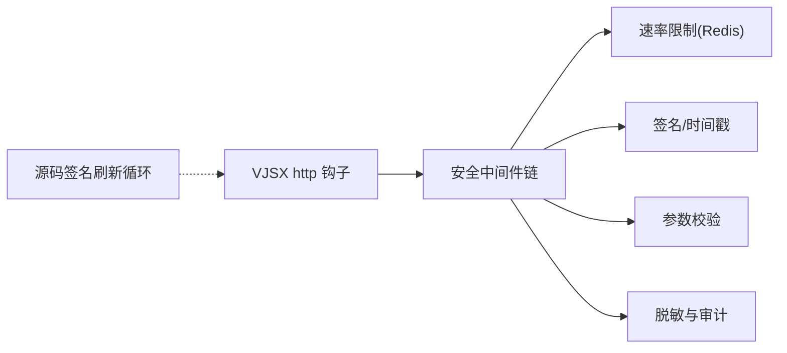

# API 安全设计

<cite>
**本文引用的文件**
- [src/executor/inproc_vjsx_signature_refresh.v](file://src/executor/inproc_vjsx_signature_refresh.v)
- [articles/12-advanced-patterns.md](file://articles/12-advanced-patterns.md)
- [dist/v-profiler/src/VHttpd/WordPress/Profiler.php](file://dist/v-profiler/src/VHttpd/WordPress/Profiler.php)
- [examples/codexbot-app-ts/app.mts](file://examples/codexbot-app-ts/app.mts)
</cite>

## 目录
1. [引言](#引言)
2. [项目结构](#项目结构)
3. [核心组件](#核心组件)
4. [架构总览](#架构总览)
5. [详细组件分析](#详细组件分析)
6. [依赖关系分析](#依赖关系分析)
7. [性能考量](#性能考量)
8. [故障排查指南](#故障排查指南)
9. [结论](#结论)
10. [附录](#附录)

## 引言
本指南面向在 vhttpd 上构建对外 API 的工程师，聚焦于“请求签名验证、参数校验框架、数据脱敏与隐私保护、速率限制与访问控制、以及安全中间件实现”等关键主题。文档结合仓库中的现有能力（如 VJSX 源码签名刷新机制、PHP 侧敏感信息过滤、速率限制示例）给出可落地的设计方案与参考实现路径，帮助读者在不泄露具体代码的前提下，快速搭建一套稳健的 API 安全体系。

## 项目结构
围绕 API 安全相关能力，本项目中与签名、校验、脱敏、限流相关的要点分布如下：
- 源码签名与热更新：VJSX 执行器提供源码探针与签名刷新循环，用于保障应用入口变更时的安全重启与一致性。
- 敏感信息脱敏：PHP 侧工具对请求参数、Cookie、会话等进行递归脱敏，避免日志或诊断输出泄露敏感字段。
- 速率限制：文章示例提供了基于 Redis 滑动窗口的速率限制中间件与配置建议。
- 应用入口：VJSX 应用通过标准 http 钩子接入 HTTP 处理流程，便于嵌入统一的安全中间件链。

图表来源
- [src/executor/inproc_vjsx_signature_refresh.v:1-96](file://src/executor/inproc_vjsx_signature_refresh.v#L1-L96)
- [dist/v-profiler/src/VHttpd/WordPress/Profiler.php:560-759](file://dist/v-profiler/src/VHttpd/WordPress/Profiler.php#L560-L759)
- [articles/12-advanced-patterns.md:820-960](file://articles/12-advanced-patterns.md#L820-L960)
- [examples/codexbot-app-ts/app.mts:1-35](file://examples/codexbot-app-ts/app.mts#L1-L35)

章节来源
- [src/executor/inproc_vjsx_signature_refresh.v:1-96](file://src/executor/inproc_vjsx_signature_refresh.v#L1-L96)
- [dist/v-profiler/src/VHttpd/WordPress/Profiler.php:560-759](file://dist/v-profiler/src/VHttpd/WordPress/Profiler.php#L560-L759)
- [articles/12-advanced-patterns.md:820-960](file://articles/12-advanced-patterns.md#L820-L960)
- [examples/codexbot-app-ts/app.mts:1-35](file://examples/codexbot-app-ts/app.mts#L1-L35)

## 核心组件
- 请求签名与时间戳校验
  - 目标：确保请求来源可信、未被篡改且未过期。
  - 要点：HMAC 签名算法、时间戳窗口、随机数防重放、幂等键。
- 参数校验框架
  - 目标：在业务逻辑前完成数据类型、取值范围、格式约束检查。
  - 要点：白名单字段、必填项、正则/枚举/数值区间、错误聚合。
- 数据脱敏与隐私保护
  - 目标：防止敏感信息进入日志、监控与调试面板。
  - 要点：敏感键匹配、递归脱敏、传输加密（TLS）、最小化暴露。
- 速率限制与访问控制
  - 目标：抵御滥用与暴力破解，保障系统稳定性。
  - 要点：滑动窗口、IP/用户维度、策略分级、告警与熔断。
- 安全中间件
  - 目标：将上述能力以可插拔方式组合到 HTTP 处理链路中。
  - 要点：顺序编排、短路返回、上下文传递、指标埋点。

章节来源
- [src/executor/inproc_vjsx_signature_refresh.v:1-96](file://src/executor/inproc_vjsx_signature_refresh.v#L1-L96)
- [dist/v-profiler/src/VHttpd/WordPress/Profiler.php:560-759](file://dist/v-profiler/src/VHttpd/WordPress/Profiler.php#L560-L759)
- [articles/12-advanced-patterns.md:820-960](file://articles/12-advanced-patterns.md#L820-L960)
- [examples/codexbot-app-ts/app.mts:1-35](file://examples/codexbot-app-ts/app.mts#L1-L35)

## 架构总览
下图展示一个典型的 API 安全处理序列：从客户端发起请求，经签名校验、时间戳与重放防护、参数校验、速率限制，最终到达业务处理器并返回响应。

图表来源
- [examples/codexbot-app-ts/app.mts:1-35](file://examples/codexbot-app-ts/app.mts#L1-L35)
- [articles/12-advanced-patterns.md:820-960](file://articles/12-advanced-patterns.md#L820-L960)

## 详细组件分析

### 组件一：请求签名验证（HMAC + 时间戳 + 防重放）
- 设计要点
  - 签名内容：方法、路径、查询串、主体摘要、时间戳、随机数等。
  - 密钥管理：服务端存储共享密钥，客户端使用相同密钥生成 HMAC。
  - 时间戳窗口：拒绝超出窗口（如 ±5 分钟）的请求。
  - 防重放：引入 nonce 或幂等键，服务端去重缓存短期记录。
- 与仓库能力的结合
  - 应用入口采用 VJSX 的 http 钩子，可在入口处统一挂载签名校验中间件。
  - 源码签名刷新循环保证应用入口变更后的安全重启，降低热更带来的安全风险面。
- 推荐实现步骤
  - 在入口层解析请求元数据，构造待签名字符串。
  - 使用 HMAC-SHA256 计算签名并与请求头携带的签名进行比对。
  - 校验时间戳是否落在允许窗口内。
  - 校验 nonce 是否已使用（短 TTL 去重）。
  - 失败时返回明确错误码与必要提示，避免泄露内部细节。

图表来源
- [examples/codexbot-app-ts/app.mts:1-35](file://examples/codexbot-app-ts/app.mts#L1-L35)
- [src/executor/inproc_vjsx_signature_refresh.v:1-96](file://src/executor/inproc_vjsx_signature_refresh.v#L1-L96)

章节来源
- [examples/codexbot-app-ts/app.mts:1-35](file://examples/codexbot-app-ts/app.mts#L1-L35)
- [src/executor/inproc_vjsx_signature_refresh.v:1-96](file://src/executor/inproc_vjsx_signature_refresh.v#L1-L96)

### 组件二：参数校验框架（类型/范围/格式）
- 设计要点
  - 白名单字段：仅接受声明的参数，忽略未知字段。
  - 类型校验：字符串、数字、布尔、枚举、数组、对象嵌套。
  - 范围校验：长度、数值上下界、日期格式、正则表达式。
  - 错误聚合：收集所有校验错误，一次性返回，便于前端修复。
- 与仓库能力的结合
  - 可在 VJSX http 钩子中调用统一的校验器，或在 PHP 侧集成类似断言库进行输入验证。
- 推荐实现步骤
  - 定义路由级或接口级的校验 Schema。
  - 在业务处理前执行校验，失败直接返回 400 及错误详情。
  - 对复杂对象进行递归校验，避免深层注入风险。

章节来源
- [examples/codexbot-app-ts/app.mts:1-35](file://examples/codexbot-app-ts/app.mts#L1-L35)

### 组件三：数据脱敏与隐私保护
- 设计要点
  - 敏感键识别：password、token、secret、authorization、cookie 等关键字。
  - 递归脱敏：对嵌套结构与数组进行深度遍历替换。
  - 日志脱敏：在写入日志、监控、诊断面板前统一脱敏。
  - 传输加密：强制 HTTPS/TLS，禁用弱密码套件。
- 与仓库能力的结合
  - PHP 侧已提供敏感信息过滤函数，可对 GET/POST/Cookie/Session 等数据进行脱敏。
- 推荐实现步骤
  - 在日志与诊断输出管道中插入脱敏过滤器。
  - 维护敏感键白名单，定期评审与更新。
  - 对第三方 SDK 输出的结构化日志进行二次脱敏。

图表来源
- [dist/v-profiler/src/VHttpd/WordPress/Profiler.php:560-759](file://dist/v-profiler/src/VHttpd/WordPress/Profiler.php#L560-L759)

章节来源
- [dist/v-profiler/src/VHttpd/WordPress/Profiler.php:560-759](file://dist/v-profiler/src/VHttpd/WordPress/Profiler.php#L560-L759)

### 组件四：速率限制、IP 白名单与频率控制
- 设计要点
  - 滑动窗口：基于 Redis 有序集合统计窗口内请求数。
  - 维度选择：按 IP、用户 ID、API Key 等维度限流。
  - 策略分级：不同路径/接口设置不同配额与窗口。
  - 响应头：返回剩余配额与重置时间，便于客户端退避。
- 与仓库能力的结合
  - 文章示例提供了完整的 RateLimiter 实现与 TOML 配置建议，可直接复用思路。
- 推荐实现步骤
  - 在安全中间件链中尽早执行限流，减少后端压力。
  - 对健康检查等高频端点放宽限制。
  - 超限返回 429 并附带 retry-after。

图表来源
- [articles/12-advanced-patterns.md:820-960](file://articles/12-advanced-patterns.md#L820-L960)

章节来源
- [articles/12-advanced-patterns.md:820-960](file://articles/12-advanced-patterns.md#L820-L960)

### 组件五：完整的安全中间件实现示例（概念流程）
- 目标：将签名校验、时间戳与重放防护、参数校验、速率限制、脱敏与审计串联成可插拔的中间件链。
- 建议顺序
  - 读取与脱敏：先脱敏再进入后续校验，避免日志泄露。
  - 速率限制：尽早拦截异常流量。
  - 签名与时间戳：确保请求来源可信且新鲜。
  - 重放防护：基于 nonce/幂等键去重。
  - 参数校验：严格校验入参后再执行业务。
  - 审计与指标：记录关键事件与指标。

图表来源
- [examples/codexbot-app-ts/app.mts:1-35](file://examples/codexbot-app-ts/app.mts#L1-L35)
- [articles/12-advanced-patterns.md:820-960](file://articles/12-advanced-patterns.md#L820-L960)
- [dist/v-profiler/src/VHttpd/WordPress/Profiler.php:560-759](file://dist/v-profiler/src/VHttpd/WordPress/Profiler.php#L560-L759)

章节来源
- [examples/codexbot-app-ts/app.mts:1-35](file://examples/codexbot-app-ts/app.mts#L1-L35)
- [articles/12-advanced-patterns.md:820-960](file://articles/12-advanced-patterns.md#L820-L960)
- [dist/v-profiler/src/VHttpd/WordPress/Profiler.php:560-759](file://dist/v-profiler/src/VHttpd/WordPress/Profiler.php#L560-L759)

## 依赖关系分析
- 入口与中间件
  - VJSX 应用的 http 钩子是安全中间件的挂载点，便于统一编排。
- 源码签名刷新
  - 源码签名刷新循环保障应用入口变更后的安全重启，间接提升整体安全性。
- 脱敏与日志
  - PHP 侧脱敏函数可作为通用工具被上层中间件复用。
- 速率限制
  - 基于 Redis 的滑动窗口实现，需关注 Redis 可用性与超时策略。

图表来源
- [examples/codexbot-app-ts/app.mts:1-35](file://examples/codexbot-app-ts/app.mts#L1-L35)
- [src/executor/inproc_vjsx_signature_refresh.v:1-96](file://src/executor/inproc_vjsx_signature_refresh.v#L1-L96)
- [articles/12-advanced-patterns.md:820-960](file://articles/12-advanced-patterns.md#L820-L960)
- [dist/v-profiler/src/VHttpd/WordPress/Profiler.php:560-759](file://dist/v-profiler/src/VHttpd/WordPress/Profiler.php#L560-L759)

章节来源
- [examples/codexbot-app-ts/app.mts:1-35](file://examples/codexbot-app-ts/app.mts#L1-L35)
- [src/executor/inproc_vjsx_signature_refresh.v:1-96](file://src/executor/inproc_vjsx_signature_refresh.v#L1-L96)
- [articles/12-advanced-patterns.md:820-960](file://articles/12-advanced-patterns.md#L820-L960)
- [dist/v-profiler/src/VHttpd/WordPress/Profiler.php:560-759](file://dist/v-profiler/src/VHttpd/WordPress/Profiler.php#L560-L759)

## 性能考量
- 签名与时间戳校验
  - 尽量在内存中完成，避免磁盘 IO；对频繁失败的请求进行快速失败。
- 重放防护
  - 使用内存或近线缓存（如 Redis）存储短期 nonce，合理设置 TTL 与容量上限。
- 参数校验
  - 预编译校验规则，减少运行时开销；对大对象进行分块校验。
- 速率限制
  - 优先使用原子操作与批量命令，降低 Redis 往返次数；考虑本地令牌桶作为降级方案。
- 脱敏与审计
  - 仅在需要时启用深度脱敏；对高吞吐路径采用采样审计。

## 故障排查指南
- 常见问题
  - 签名不一致：检查待签名字符串构造顺序、编码与大小写。
  - 时间戳过期：核对客户端与服务端时钟同步（NTP），扩大窗口需谨慎。
  - 重放拦截：确认 nonce 唯一性与 TTL 设置是否合理。
  - 参数校验失败：查看错误聚合信息，定位缺失或非法字段。
  - 限流触发：观察 X-RateLimit-* 响应头，调整配额或优化客户端重试策略。
  - 日志泄露：确认脱敏规则覆盖新增敏感字段。
- 定位手段
  - 开启细粒度审计日志（脱敏后），记录关键中间件决策点。
  - 针对签名与限流增加指标埋点，便于快速发现异常峰值。

章节来源
- [articles/12-advanced-patterns.md:820-960](file://articles/12-advanced-patterns.md#L820-L960)
- [dist/v-profiler/src/VHttpd/WordPress/Profiler.php:560-759](file://dist/v-profiler/src/VHttpd/WordPress/Profiler.php#L560-L759)

## 结论
通过在 vhttpd 入口统一编排安全中间件，并结合源码签名刷新、敏感信息脱敏与速率限制等能力，可以构建出兼顾安全性与性能的 API 防护体系。建议在上线前完成威胁建模与渗透测试，持续迭代敏感键清单与限流策略，确保系统在真实流量下稳定可靠。

## 附录
- 术语
  - HMAC：基于哈希的消息认证码，用于完整性与身份验证。
  - Nonce：一次性随机数，用于防重放。
  - 幂等键：由客户端生成的唯一键，用于去重与幂等处理。
- 参考实践
  - 速率限制中间件与配置示例参见文章章节。
  - 敏感信息脱敏实现参见 PHP 侧工具函数。