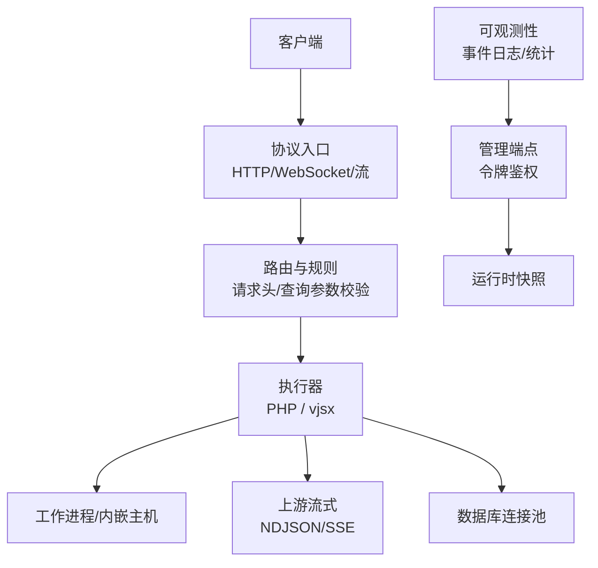
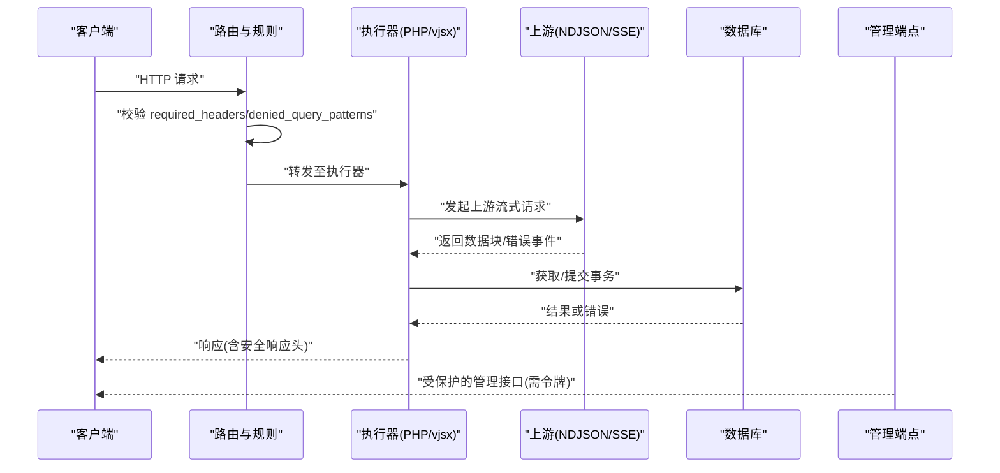
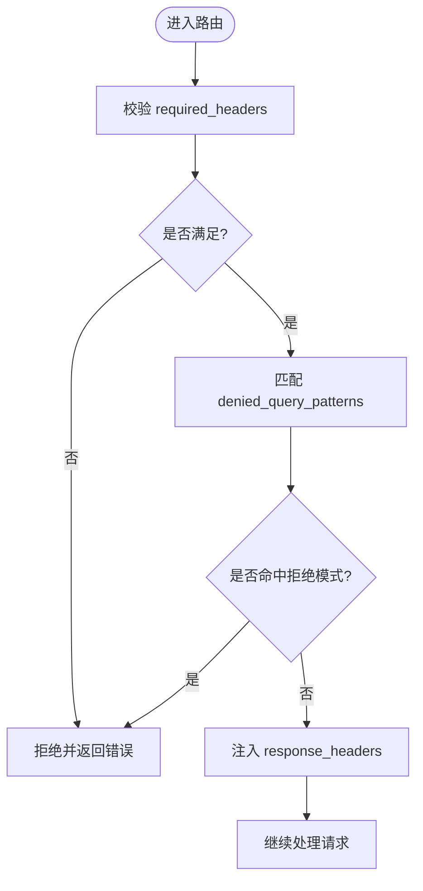
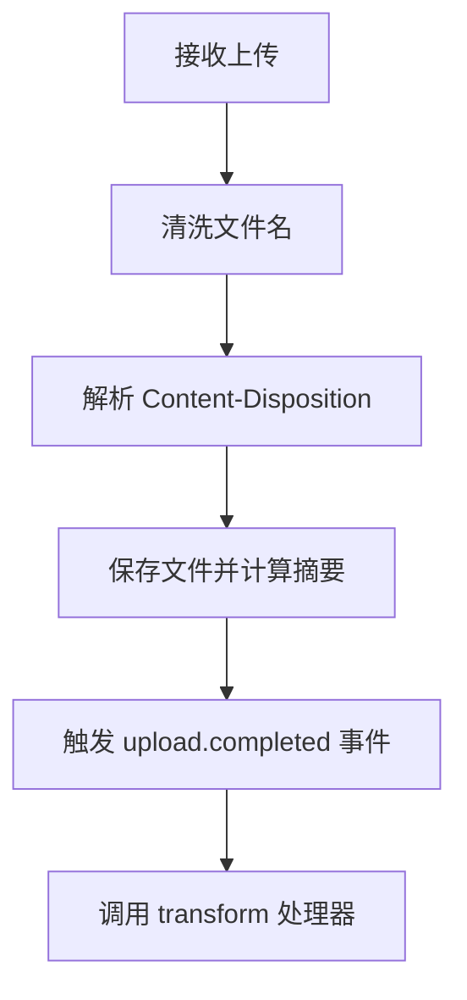
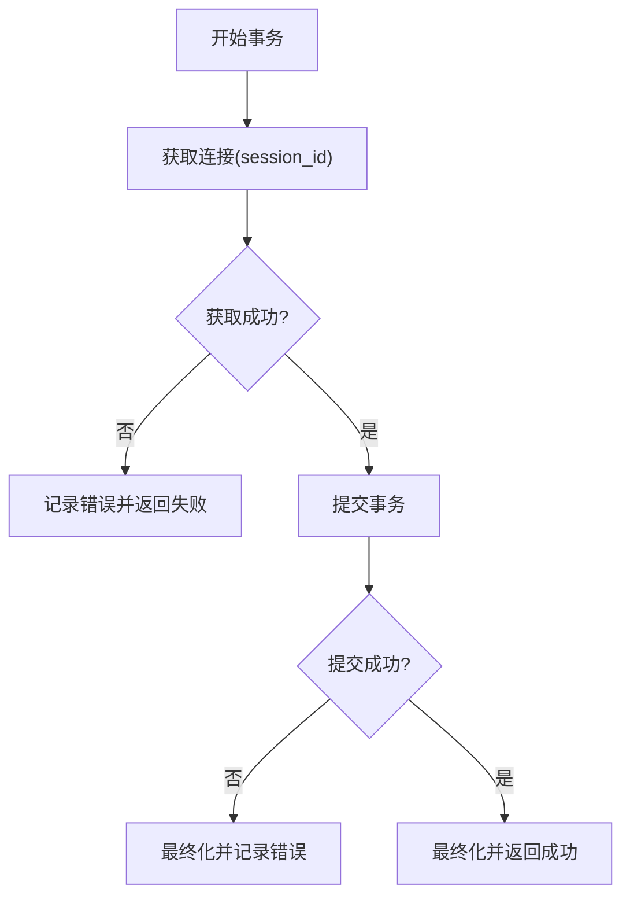
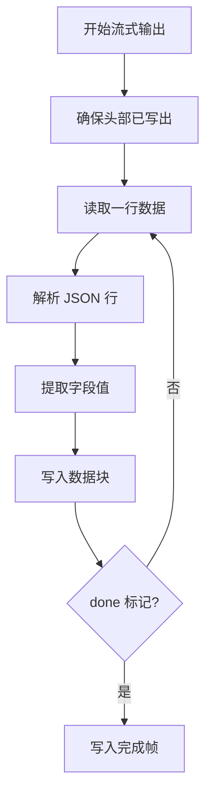
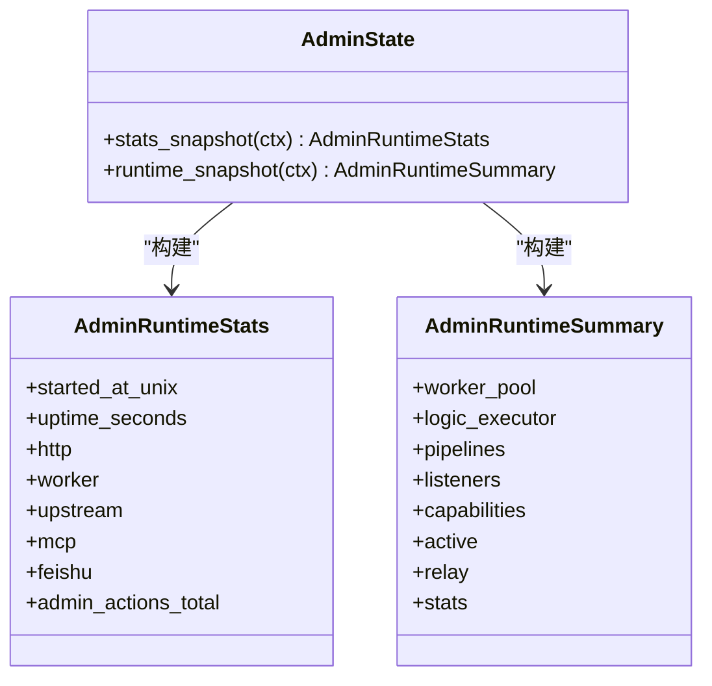
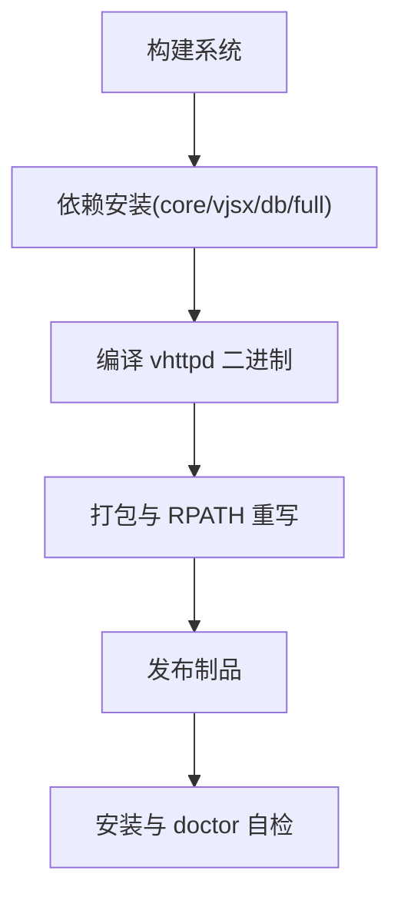

# 安全审计和编码规范

<cite>
**本文引用的文件**   
- [README.md](file://README.md)
- [config.v](file://src/config/config.v)
- [runtime_config.v](file://src/server_lifecycle/runtime_config.v)
- [state.v](file://src/admin/state.v)
- [ndjson_streamer.v](file://src/upstream/ndjson_streamer.v)
- [db_runtime.v](file://dbsrc/db_runtime.v)
- [Server.php](file://php/package/src/VHttpd/PhpWorker/Server.php)
- [OllamaClient.php](file://php/package/src/VSlim/Stream/OllamaClient.php)
- [v-profiler-ui.js](file://php/package/wordpress/v-profiler/v-profiler-ui.js)
- [profiler_test.php](file://php/package/tests/profiler_test.php)
- [openai_runtime_test.v](file://src/openai_runtime_test.v)
- [route_rule_test.v](file://src/route_rule_test.v)
- [upload_runtime.v](file://src/upload_runtime.v)
- [inproc_vjsx_http_facade.js](file://src/inproc_vjsx_http_facade.js)
- [entry_resolver.v](file://src/executor/inproc_vjsx_entry_resolver.v)
- [config_acceptance_test.sh](file://tests/e2e/config_acceptance_test.sh)
- [admin.toml](file://admin/admin.toml)
- [vhttpd.example.toml](file://config/vhttpd.example.toml)
</cite>

## 目录
1. [引言](#引言)
2. [项目结构](#项目结构)
3. [核心组件](#核心组件)
4. [架构总览](#架构总览)
5. [详细组件分析](#详细组件分析)
6. [依赖分析](#依赖分析)
7. [性能考虑](#性能考虑)
8. [故障排查指南](#故障排查指南)
9. [结论](#结论)
10. [附录](#附录)

## 引言
本指南面向 vhttpd 项目的安全审计与编码规范，覆盖以下目标：
- 代码审计清单：常见安全漏洞检测、依赖包安全检查、安全配置审查
- 安全编码规范：密码学使用、错误处理安全、资源清理等最佳实践
- 自动化安全扫描集成：静态分析、动态应用测试、渗透测试流程
- 安全事件监控与告警：异常行为检测、入侵检测
- 配套脚本与报告模板：提供可落地的检查脚本与报告模板

本指南严格基于仓库现有实现与文档进行提炼，确保建议与当前架构一致。

## 项目结构
vhttpd 作为协议与执行宿主，围绕 HTTP/WebSocket/流式传输、工作进程编排、运行时管理、MCP 与上游集成展开。其关键安全相关点包括：
- 配置加载与变量替换（TOML）
- 路由与安全策略（请求头校验、查询参数拒绝、响应头注入）
- 上传处理与文件名清洗
- 数据库连接池与事务生命周期
- 上游 NDJSON/SSE 流式输出与错误帧
- 管理员接口与令牌鉴权
- PHP 侧错误封装与上报
- OpenAI 网关头部清洗与分块传输

图表来源
- [README.md:84-126](file://README.md#L84-L126)
- [config.v:313-341](file://src/config/config.v#L313-L341)
- [state.v:12-54](file://src/admin/state.v#L12-L54)

章节来源
- [README.md:84-126](file://README.md#L84-L126)
- [config.v:313-341](file://src/config/config.v#L313-L341)

## 核心组件
- 配置模型与加载：集中定义 Server、Worker、Executor、Admin、Assets、Feishu、OpenAI、Db、Cache、RouteRule 等结构体，支持 TOML 解析与环境变量替换
- 路由与安全策略：required_headers、denied_query_patterns、response_headers 等
- 上传处理：文件名清洗、Content-Disposition 参数提取、事件管道触发
- 数据库运行时：连接获取、事务提交/回滚、错误记录
- 上游流式：SSE 错误事件、分块写入、完成帧
- 管理端点：运行态快照、能力集、活跃计数
- PHP 错误封装：统一错误响应与 SSE 错误帧
- OpenAI 网关：hop-by-hop 头部清洗、分块响应验证

章节来源
- [config.v:6-12](file://src/config/config.v#L6-L12)
- [config.v:313-341](file://src/config/config.v#L313-L341)
- [upload_runtime.v:33-49](file://src/upload_runtime.v#L33-L49)
- [db_runtime.v:453-508](file://dbsrc/db_runtime.v#L453-L508)
- [ndjson_streamer.v:48-97](file://src/upstream/ndjson_streamer.v#L48-L97)
- [state.v:56-102](file://src/admin/state.v#L56-L102)
- [Server.php:438-469](file://php/package/src/VHttpd/PhpWorker/Server.php#L438-L469)
- [openai_runtime_test.v:354-367](file://src/openai_runtime_test.v#L354-L367)

## 架构总览
下图展示从请求到执行器、上游、数据库与管理端的整体交互，标注了安全控制点（认证、输入校验、输出清洗、错误处理）。

图表来源
- [config.v:313-341](file://src/config/config.v#L313-L341)
- [ndjson_streamer.v:48-97](file://src/upstream/ndjson_streamer.v#L48-L97)
- [db_runtime.v:453-508](file://dbsrc/db_runtime.v#L453-L508)
- [state.v:56-102](file://src/admin/state.v#L56-L102)

## 详细组件分析

### 配置与安全策略
- 关键配置项
  - 服务器与 SSL：host/port/cert/cert_key
  - 工作进程：read_timeout_ms、queue_capacity、max_requests、pool_size、socket_prefix
  - 路由规则：required_headers、denied_query_patterns、response_headers、max_body_bytes
  - 管理端点：host/port/token
  - 外部服务：feishu、openai、db、cache
- 安全要点
  - 强制要求必要请求头（如 x-api-key），拒绝危险查询参数（如 debug、role=admin）
  - 通过 response_headers 注入安全标头（例如 X-Content-Type-Options）
  - 限制最大请求体大小，避免资源耗尽
  - 管理端点启用 token 鉴权，仅监听本地地址

图表来源
- [config.v:313-341](file://src/config/config.v#L313-L341)
- [route_rule_test.v:247-278](file://src/route_rule_test.v#L247-L278)

章节来源
- [config.v:6-12](file://src/config/config.v#L6-L12)
- [config.v:313-341](file://src/config/config.v#L313-L341)
- [route_rule_test.v:247-278](file://src/route_rule_test.v#L247-L278)
- [admin.toml:15-24](file://admin/admin.toml#L15-L24)
- [vhttpd.example.toml:38-47](file://config/vhttpd.example.toml#L38-L47)

### 上传处理与输入清洗
- 文件名清洗：仅允许字母数字及有限符号，去除首尾点号，空名回退默认值
- Content-Disposition 参数提取：安全解析 filename* 与 filename
- 上传完成后事件：生成 upload_id、trace_id、request_id，触发 pipeline 与 transform

图表来源
- [upload_runtime.v:33-49](file://src/upload_runtime.v#L33-L49)
- [config_acceptance_test.sh:1226-1280](file://tests/e2e/config_acceptance_test.sh#L1226-L1280)

章节来源
- [upload_runtime.v:33-49](file://src/upload_runtime.v#L33-L49)
- [config_acceptance_test.sh:1226-1280](file://tests/e2e/config_acceptance_test.sh#L1226-L1280)

### 数据库连接与事务安全
- 会话与连接获取：按 session_id 获取连接，失败时记录错误
- 事务提交/回滚：成功路径记录 driver/session_id；失败路径记录错误并清理
- 错误传播：将错误消息返回给上层，便于审计与告警

图表来源
- [db_runtime.v:453-508](file://dbsrc/db_runtime.v#L453-L508)

章节来源
- [db_runtime.v:453-508](file://dbsrc/db_runtime.v#L453-L508)

### 上游流式输出与错误帧
- SSE 错误事件：当发生错误时发送 error 事件，包含错误信息
- 分块输出：确保头部已写出后写入数据块，遇到 done 标记结束
- 头部注入：为 SSE 设置合适的缓存与缓冲控制头

图表来源
- [ndjson_streamer.v:48-97](file://src/upstream/ndjson_streamer.v#L48-L97)

章节来源
- [ndjson_streamer.v:48-97](file://src/upstream/ndjson_streamer.v#L48-L97)

### 管理端点与运行态快照
- 运行态快照：包含启动时间、uptime、HTTP/Worker/Upstream/MCP/Feishu 统计
- 能力集：列出支持的协议与特性（HTTP/Stream/WebSocket/MCP 等）
- 活跃计数：WebSocket 连接数、上游计划数、MCP 会话数、网关数量

图表来源
- [state.v:12-54](file://src/admin/state.v#L12-L54)
- [state.v:56-102](file://src/admin/state.v#L56-L102)

章节来源
- [state.v:12-54](file://src/admin/state.v#L12-L54)
- [state.v:56-102](file://src/admin/state.v#L56-L102)

### PHP 错误封装与上报
- 统一错误响应：包含状态码、内容类型、错误类名与消息
- SSE 错误帧：在流式模式下返回 error 事件，携带错误信息与类名
- 错误分类：便于上层聚合与告警

章节来源
- [Server.php:438-469](file://php/package/src/VHttpd/PhpWorker/Server.php#L438-L469)

### OpenAI 网关头部清洗与分块传输
- 头部清洗：移除 hop-by-hop 头部（connection、transfer-encoding、host 等），过滤非法字符
- 分块响应：验证 transfer-encoding: chunked，确保数据块格式正确

章节来源
- [openai_runtime_test.v:354-367](file://src/openai_runtime_test.v#L354-L367)

### vjsx 内嵌入口解析
- 全局函数映射：根据 kind 解析 http/websocket/websocket_upstream/startup/snapshot 等入口
- 存在性检查：判断模块是否导出对应全局函数

章节来源
- [inproc_vjsx_http_facade.js:1671-1694](file://src/inproc_vjsx_http_facade.js#L1671-L1694)
- [entry_resolver.v:51-81](file://src/executor/inproc_vjsx_entry_resolver.v#L51-L81)

## 依赖分析
- 构建与运行时依赖
  - OpenSSL、Boehm GC、pkg-config、DB 客户端库（MySQL/PostgreSQL/SQLite）
  - vjsx 管理的 QuickJS 源码与 TypeScript 编译器运行时
- 打包与分发
  - 二进制重写 RPATH/@loader_path，优先使用 bundled 原生库
  - 安装脚本与 runtime_doctor 用于环境自检

图表来源
- [README.md:241-271](file://README.md#L241-L271)
- [README.md:298-366](file://README.md#L298-L366)

章节来源
- [README.md:241-271](file://README.md#L241-L271)
- [README.md:298-366](file://README.md#L298-L366)

## 性能考虑
- 流式传输优化：SSE 与 text stream 的头部与缓冲控制，减少不必要延迟
- 工作进程队列：合理设置 queue_capacity、queue_timeout_ms、max_requests，避免拥塞
- 上游超时与重试：结合 upstream plan 与 backoff 策略提升韧性
- 数据库连接池：idle_ping_ms、pool_size 调优，降低慢查询影响

[本节为通用指导，不直接分析具体文件]

## 故障排查指南
- 配置问题
  - 检查 TOML 变量替换与路径解析是否正确
  - 确认 admin token 与监听地址配置
- 路由与安全策略
  - 验证 required_headers 与 denied_query_patterns 是否误拦截
  - 检查 response_headers 是否注入成功
- 上传与事件
  - 确认 upload_dir 权限与 on_completed 处理器可用
- 数据库
  - 查看 last_error、failed_queries、slow_queries 指标
- 上游流式
  - 关注 error 事件与分块终止帧
- 管理端点
  - 核对运行态快照中的 capabilities 与 active 计数

章节来源
- [v-profiler-ui.js:1188-1213](file://php/package/wordpress/v-profiler/v-profiler-ui.js#L1188-L1213)
- [profiler_test.php:225-234](file://php/package/tests/profiler_test.php#L225-L234)
- [state.v:12-54](file://src/admin/state.v#L12-L54)

## 结论
vhttpd 在协议层与执行层提供了丰富的安全控制点：配置驱动的安全策略、严格的输入清洗、健壮的错误处理与可观测性。通过本指南的审计清单与编码规范，可在开发、构建、部署与运维各阶段持续保障安全性与稳定性。

[本节为总结，不直接分析具体文件]

## 附录

### 安全审计清单
- 常见漏洞检测
  - 输入校验：required_headers、denied_query_patterns、max_body_bytes
  - 输出清洗：response_headers 注入安全标头
  - 上传安全：文件名清洗、Content-Disposition 解析、存储路径隔离
  - 上游安全：头部清洗（hop-by-hop）、分块传输验证
  - 数据库安全：连接获取与事务提交/回滚的错误记录
- 依赖包安全检查
  - 锁定版本与签名校验（composer.lock、QuickJS 子模块/checkout）
  - 构建产物完整性（RPATH 重写、bundled 库一致性）
- 安全配置审查
  - admin.token、listen host/port、ssl cert/cert_key
  - worker 超时与队列容量、max_requests
  - openai base_url、api_key_env、timeout_ms
  - feishu app_id/app_secret/verification_token/encrypt_key

章节来源
- [config.v:313-341](file://src/config/config.v#L313-L341)
- [upload_runtime.v:33-49](file://src/upload_runtime.v#L33-L49)
- [openai_runtime_test.v:354-367](file://src/openai_runtime_test.v#L354-L367)
- [db_runtime.v:453-508](file://dbsrc/db_runtime.v#L453-L508)
- [admin.toml:15-24](file://admin/admin.toml#L15-L24)
- [vhttpd.example.toml:38-47](file://config/vhttpd.example.toml#L38-L47)

### 安全编码规范
- 密码学使用
  - 使用 OpenSSL 后端，证书与私钥路径由配置管理
  - 对外部 API 密钥通过环境变量注入（OPENAI_API_KEY 等）
- 错误处理安全
  - 禁止静默吞错（or {}），应记录错误或返回结构化错误
  - 统一错误响应与 SSE 错误帧，包含错误类名与消息
- 资源清理
  - 事务提交/回滚后必须 finalize，释放连接与会话
  - 上传完成后及时触发事件并清理临时资源
- 输入与输出
  - 严格校验与清洗用户输入（文件名、查询参数、请求头）
  - 输出前注入安全响应头（X-Content-Type-Options 等）

章节来源
- [README.md:241-271](file://README.md#L241-L271)
- [Server.php:438-469](file://php/package/src/VHttpd/PhpWorker/Server.php#L438-L469)
- [db_runtime.v:453-508](file://dbsrc/db_runtime.v#L453-L508)
- [upload_runtime.v:33-49](file://src/upload_runtime.v#L33-L49)
- [route_rule_test.v:247-278](file://src/route_rule_test.v#L247-L278)

### 自动化安全扫描集成
- 静态代码分析
  - V 语言：lint 与单元测试（make test-fast）
  - PHP：phpunit/phpunit、psalm/phpstan（示例依赖）
  - TS：ts-rs 生成代码不参与手动修改，保持类型契约
- 动态应用测试
  - k6 基准与流式场景（bench/k6_stream.js）
  - e2e 配置验收测试（tests/e2e/config_acceptance_test.sh）
- 渗透测试流程
  - 针对管理端点与上传接口的授权与注入测试
  - 上游流式错误路径与头部注入测试

章节来源
- [k6_stream.js:1-51](file://bench/k6_stream.js#L1-L51)
- [config_acceptance_test.sh:1221-1293](file://tests/e2e/config_acceptance_test.sh#L1221-L1293)
- [openai_runtime_test.v:354-367](file://src/openai_runtime_test.v#L354-L367)

### 安全事件监控与告警配置
- 运行态快照
  - HTTP/Worker/Upstream/MCP/Feishu 统计指标
  - 活跃连接与网关数量
- 事件日志
  - event_log 路径配置（TOML 与 CLI）
  - 上传完成事件与 transform 处理器
- 告警建议
  - 高错误率与超时率阈值
  - 慢查询与失败查询比率
  - 上游错误事件频率

章节来源
- [state.v:12-54](file://src/admin/state.v#L12-L54)
- [vhttpd.example.toml:12-17](file://config/vhttpd.example.toml#L12-L17)
- [config_acceptance_test.sh:1226-1280](file://tests/e2e/config_acceptance_test.sh#L1226-L1280)

### 安全检查脚本与报告模板
- 检查脚本
  - 依赖安装与自检：make deps-core、make doctor、scripts/install_runtime.sh、scripts/runtime_doctor.sh
  - 配置验收：tests/e2e/config_acceptance_test.sh
  - 流式基准：bench/k6_stream.js
- 报告模板
  - 安全标头状态与建议（参考 WordPress Profiler UI 输出）
  - 配置差异与敏感项（admin.token、ssl、openai.api_key_env）
  - 运行态快照与指标（uptime、errors_total、slow_queries）

章节来源
- [README.md:241-271](file://README.md#L241-L271)
- [README.md:298-366](file://README.md#L298-L366)
- [config_acceptance_test.sh:1221-1293](file://tests/e2e/config_acceptance_test.sh#L1221-L1293)
- [v-profiler-ui.js:1188-1213](file://php/package/wordpress/v-profiler/v-profiler-ui.js#L1188-L1213)
- [profiler_test.php:225-234](file://php/package/tests/profiler_test.php#L225-L234)