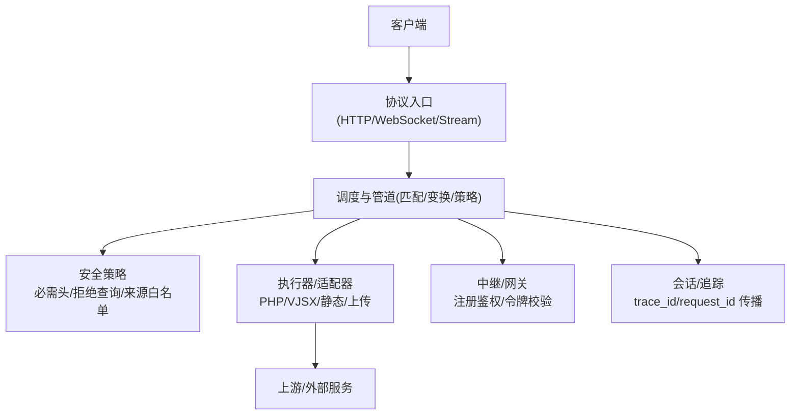
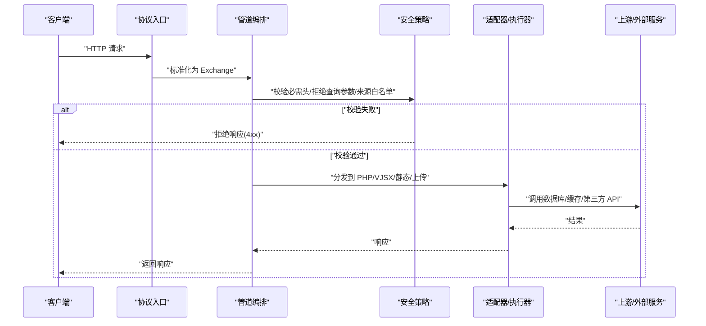
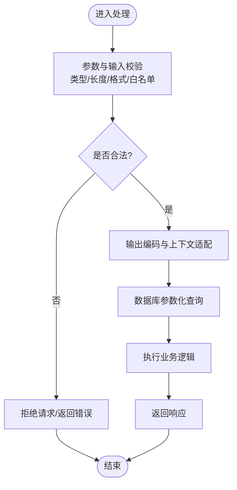
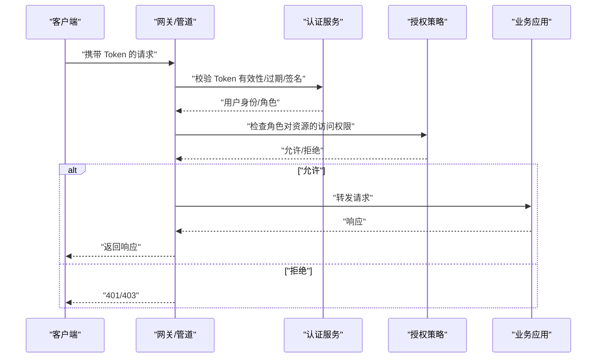
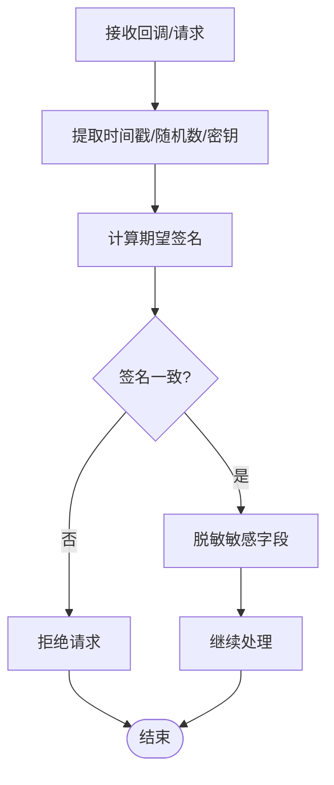
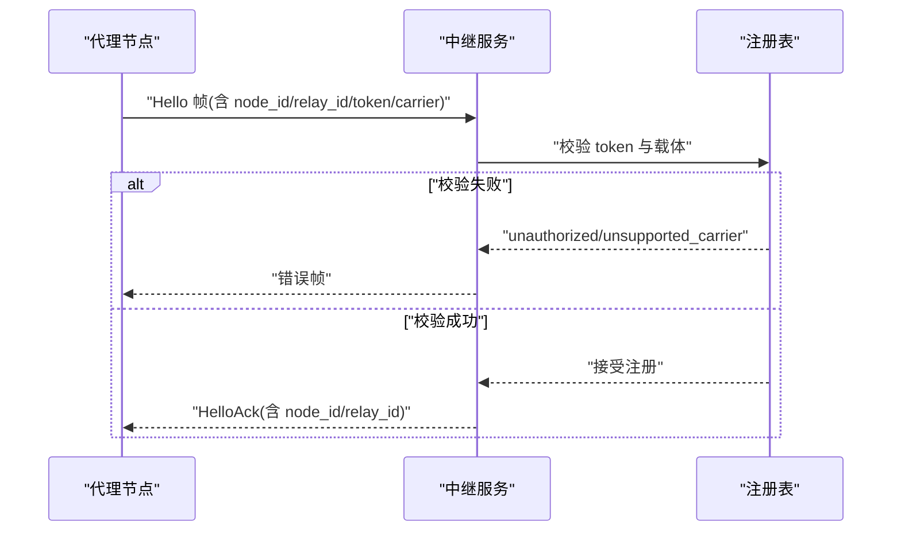
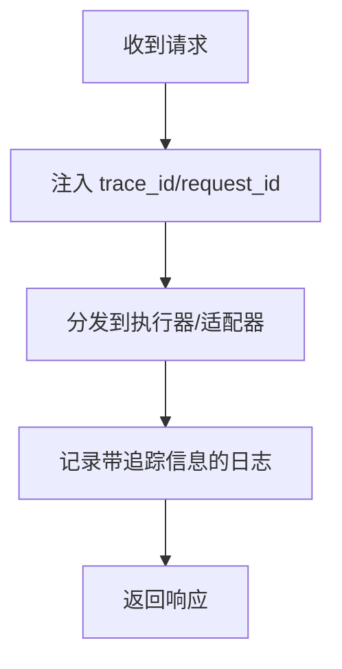
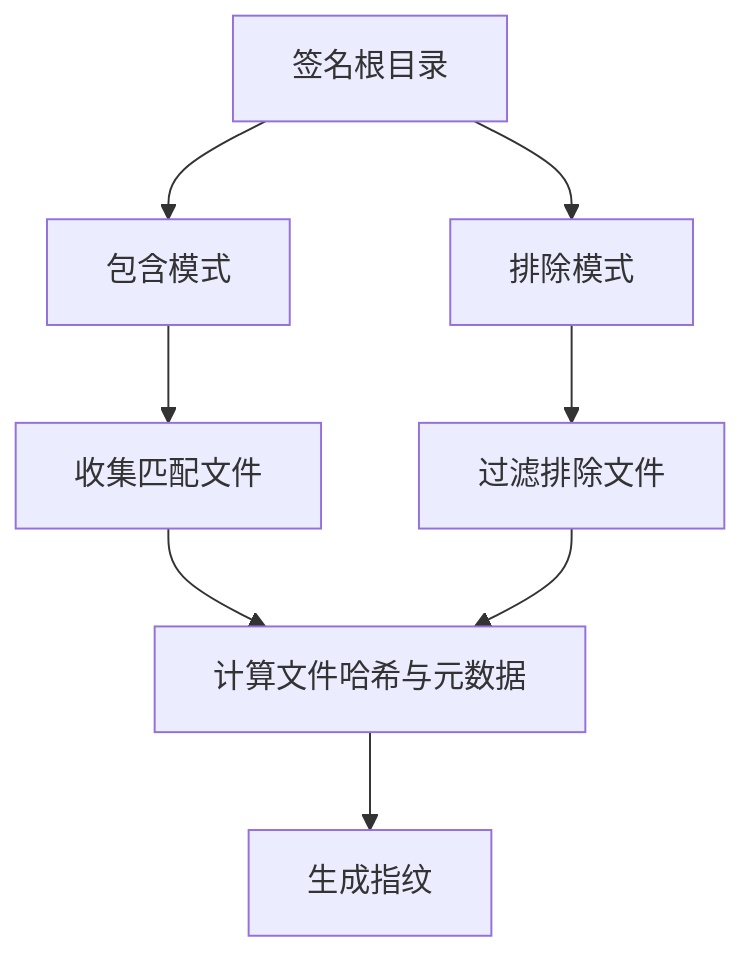
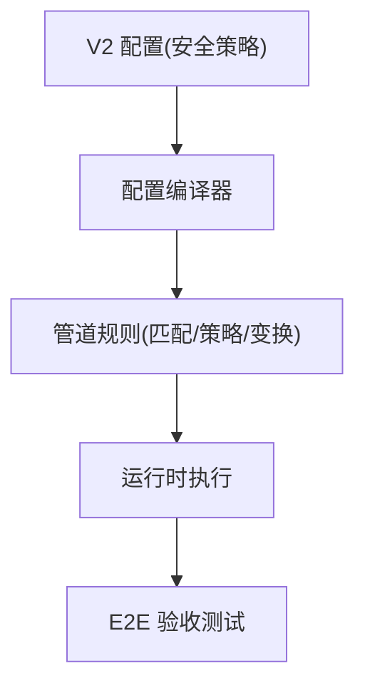

# 应用安全开发

<cite>
**本文引用的文件**   
- [README.md](file://README.md)
- [v2_config.v](file://src/config/v2_config.v)
- [pipeline.v](file://src/dispatch/pipeline.v)
- [route_rule_test.v](file://src/route_rule_test.v)
- [callback_crypto.v](file://src/upstream/provider/feishu/callback_crypto.v)
- [proto_frame.v](file://src/upstream/provider/feishu/proto_frame.v)
- [registration_test.v](file://src/relay/registration_test.v)
- [executor.v](file://src/command/executor.v)
- [state.v](file://src/api/mcp/protocol/state.v)
- [vjsx_host_signature.v](file://src/executor/vjsx_host_signature.v)
- [inproc_vjsx_executor_test.v](file://src/inproc_vjsx_executor_test.v)
- [refactor_0601.md](file://docs/refactor_0601.md)
- [PROTOCOL_PIPELINE_RELAY_ARCHITECTURE.md](file://docs/PROTOCOL_PIPELINE_RELAY_ARCHITECTURE.md)
- [PROTOCOL_PIPELINE_IMPLEMENTATION_PLAN.md](file://docs/PROTOCOL_PIPELINE_IMPLEMENTATION_PLAN.md)
- [codex_streaming_implementation_plan.md](file://docs/codex_streaming_implementation_plan.md)
- [NORMALIZED_COMMAND_DRAFT.md](file://docs/NORMALIZED_COMMAND_DRAFT.md)
- [config_acceptance_test.sh](file://tests/e2e/config_acceptance_test.sh)
</cite>

## 目录
1. [引言](#引言)
2. [项目结构](#项目结构)
3. [核心组件](#核心组件)
4. [架构总览](#架构总览)
5. [详细组件分析](#详细组件分析)
6. [依赖关系分析](#依赖关系分析)
7. [性能与安全权衡](#性能与安全权衡)
8. [故障排查指南](#故障排查指南)
9. [结论](#结论)
10. [附录：安全编码规范与审计清单](#附录安全编码规范与审计清单)

## 引言
本指南面向在 vhttpd 生态中构建 Web 应用的开发者，聚焦输入验证与过滤、认证授权、API 安全设计原则以及代码审计清单。文档基于仓库现有实现进行提炼，覆盖 SQL 注入防护、XSS 防护、命令注入防护、JWT/会话安全、RBAC、请求签名校验、参数校验、数据脱敏等主题，并提供可落地的流程图与时序图帮助理解。

## 项目结构
vhttpd 作为协议与执行宿主，围绕“入站协议 -> 管道编排 -> 策略与适配器 -> 执行器/上游”的链路组织。安全相关能力主要分布在以下位置：
- 配置与策略模型：V2 配置结构体定义安全策略（必需头、拒绝查询参数、允许来源等）
- 路由与规则测试：对必需头与拒绝查询参数的校验逻辑有单测覆盖
- 外部回调签名校验：飞书回调加密与签名校验
- 中继注册鉴权：节点注册时 token 校验
- 追踪与上下文传播：命令执行器在元数据中注入 trace_id/request_id
- 会话管理：MCP 会话状态维护
- 源码签名与热更隔离：vjsx 源码指纹计算用于变更检测与隔离
- 并发与内存安全建议：重构计划中对裸指针与锁顺序的改进建议

图表来源
- [README.md:84-126](file://README.md#L84-L126)
- [pipeline.v:1-119](file://src/dispatch/pipeline.v#L1-L119)
- [v2_config.v:224-229](file://src/config/v2_config.v#L224-L229)

章节来源
- [README.md:84-126](file://README.md#L84-L126)
- [PROTOCOL_PIPELINE_IMPLEMENTATION_PLAN.md:989-1006](file://docs/PROTOCOL_PIPELINE_IMPLEMENTATION_PLAN.md#L989-L1006)

## 核心组件
- V2 安全策略模型：提供 required_headers、denied_query_patterns、allowed_origins 等字段，用于在管道层统一实施安全约束
- 路由规则校验：通过测试用例验证必需头缺失与拒绝查询参数命中时的失败路径
- 飞书回调签名校验：支持 PKCS7 解填充与 HMAC-SHA256 签名验证，确保回调来源可信
- 中继注册鉴权：拒绝错误 token 与不支持的载体类型，返回明确的错误码
- 命令执行器上下文增强：自动注入 trace_id/request_id，便于全链路追踪
- MCP 会话管理：会话创建、清理、最大会话数限制与活动超时
- vjsx 源码签名：基于 include/exclude 模式扫描源码并生成指纹，支撑热更新与变更检测

章节来源
- [v2_config.v:224-229](file://src/config/v2_config.v#L224-L229)
- [route_rule_test.v:247-278](file://src/route_rule_test.v#L247-L278)
- [callback_crypto.v:1-51](file://src/upstream/provider/feishu/callback_crypto.v#L1-L51)
- [registration_test.v:47-109](file://src/relay/registration_test.v#L47-L109)
- [executor.v:46-71](file://src/command/executor.v#L46-L71)
- [state.v:55-100](file://src/api/mcp/protocol/state.v#L55-L100)
- [vjsx_host_signature.v:1-296](file://src/executor/vjsx_host_signature.v#L1-L296)

## 架构总览
下图展示了从 HTTP 入站到策略校验、管道执行、执行器调用的整体流程，并标注了安全控制点。

图表来源
- [README.md:84-126](file://README.md#L84-L126)
- [pipeline.v:1-119](file://src/dispatch/pipeline.v#L1-L119)
- [v2_config.v:224-229](file://src/config/v2_config.v#L224-L229)

## 详细组件分析

### 输入验证与过滤机制
- SQL 注入防护
  - 使用参数化查询与预编译语句是基础；在 vhttpd 侧可通过资源池与驱动抽象强制使用参数化接口
  - 结合数据库连接池与会话句柄，避免拼接 SQL 字符串
  - 参考数据库运行时封装以了解可用能力（如 prepared、parameters）
- XSS 防护
  - 输出编码：对所有用户可控数据进行 HTML/JS/CSS/URL 上下文的正确编码
  - 内容安全策略：通过响应头策略限制脚本加载与执行
  - 前端模板渲染库默认启用转义，避免直接插入未转义变量
- 命令注入防护
  - 禁止将用户输入拼接到系统命令；如需执行，应使用白名单命令与严格参数校验
  - 沙箱与最小权限：限制进程运行环境与文件系统访问范围
  - 参考命令执行参数模型，确保 command 数组与可选参数受控

章节来源
- [dbx/runtime.v:399-444](file://src/dbx/runtime.v#L399-L444)
- [CommandExecParams.ts:1-97](file://examples/codexbot-app-ts/codex/ts/v2/CommandExecParams.ts#L1-L97)

### 认证与授权
- JWT 令牌管理
  - 服务端签发与校验需保证密钥安全存储、算法固定、过期时间合理
  - 建议将 JWT 置于 HttpOnly Cookie 或 Authorization 头，配合 CSRF 防护
- 会话安全
  - 会话 ID 随机且不可预测，设置 Secure/HttpOnly/SameSite 属性
  - 会话绑定 IP/UA 等指纹，异常行为触发失效
  - 参考 MCP 会话管理中的最大会话数与活动超时清理
- RBAC（基于角色的访问控制）
  - 在管道层根据用户角色决定可访问的资源与方法
  - 结合 required_headers 与 denied_query_patterns 做前置拦截
  - 在业务层按资源维度校验角色权限

章节来源
- [state.v:55-100](file://src/api/mcp/protocol/state.v#L55-L100)
- [v2_config.v:224-229](file://src/config/v2_config.v#L224-L229)

### API 安全设计原则
- 请求签名验证
  - 飞书回调签名校验示例：提取 timestamp/nonce/encrypt_key 与 payload，计算 SHA256 并与签名对比
  - 建议所有对外暴露的回调与网关接口均启用签名校验与时间戳防重放
- 参数校验
  - 在管道层统一校验必需头与拒绝查询参数，失败即拒绝
  - 对路径、方法、主机名、查询参数进行白名单或正则匹配
- 数据脱敏
  - 日志与调试信息中屏蔽敏感键（password、token、secret、authorization、cookie 等）
  - 采用递归掩码策略，避免深层嵌套泄露

图表来源
- [callback_crypto.v:1-51](file://src/upstream/provider/feishu/callback_crypto.v#L1-L51)
- [route_rule_test.v:247-278](file://src/route_rule_test.v#L247-L278)
- [Profiler.php:562-598](file://php/package/src/VHttpd/WordPress/Profiler.php#L562-L598)

章节来源
- [callback_crypto.v:1-51](file://src/upstream/provider/feishu/callback_crypto.v#L1-L51)
- [route_rule_test.v:247-278](file://src/route_rule_test.v#L247-L278)
- [Profiler.php:562-598](file://php/package/src/VHttpd/WordPress/Profiler.php#L562-L598)

### 中继与上游安全
- 中继注册鉴权
  - 拒绝错误的 token 与不支持的载体类型，返回明确错误码
  - 要求 trace_id 存在，便于问题定位
- 协议帧与头部
  - 自定义协议帧编码，确保字段完整性与类型安全
  - 对关键头部进行校验与规范化

图表来源
- [registration_test.v:47-109](file://src/relay/registration_test.v#L47-L109)
- [proto_frame.v:1-43](file://src/upstream/provider/feishu/proto_frame.v#L1-L43)

章节来源
- [registration_test.v:47-109](file://src/relay/registration_test.v#L47-L109)
- [proto_frame.v:1-43](file://src/upstream/provider/feishu/proto_frame.v#L1-L43)

### 追踪与上下文传播
- 命令执行器在元数据中注入 trace_id/request_id，确保跨组件链路追踪
- 建议在管道各阶段记录 trace_id，便于问题定位与审计

图表来源
- [executor.v:46-71](file://src/command/executor.v#L46-L71)

章节来源
- [executor.v:46-71](file://src/command/executor.v#L46-L71)

### 源码签名与热更新隔离
- vjsx 源码签名基于 include/exclude 模式扫描源码，计算文件哈希与元数据，生成稳定指纹
- 用于热更新检测与版本隔离，避免无关文件变更导致误重启

图表来源
- [vjsx_host_signature.v:1-296](file://src/executor/vjsx_host_signature.v#L1-L296)

章节来源
- [vjsx_host_signature.v:1-296](file://src/executor/vjsx_host_signature.v#L1-L296)
- [inproc_vjsx_executor_test.v:78-112](file://src/inproc_vjsx_executor_test.v#L78-L112)

## 依赖关系分析
- 配置到管道的映射：V2 配置中的安全策略被编译进管道规则，并在运行时生效
- 管道能力校验：入站能力与管道需求进行匹配，不满足则报告能力缺失
- 端到端验收：E2E 脚本启动 vhttpd 并验证配置场景，确保策略与路由组合正确

图表来源
- [v2_config.v:1-318](file://src/config/v2_config.v#L1-L318)
- [pipeline.v:1-119](file://src/dispatch/pipeline.v#L1-L119)
- [config_acceptance_test.sh:1-50](file://tests/e2e/config_acceptance_test.sh#L1-L50)

章节来源
- [v2_config.v:1-318](file://src/config/v2_config.v#L1-L318)
- [pipeline.v:1-119](file://src/dispatch/pipeline.v#L1-L119)
- [config_acceptance_test.sh:1-50](file://tests/e2e/config_acceptance_test.sh#L1-L50)

## 性能与安全权衡
- 在管道层进行轻量级校验（必需头、拒绝查询参数）可减少后续处理开销
- 签名校验与脱敏应在必要处启用，避免对高频路径造成过大延迟
- 会话清理与最大会话数限制有助于防止资源耗尽
- 源码签名计算应避免频繁全量扫描，采用增量与缓存策略

[本节为通用指导，无需具体文件引用]

## 故障排查指南
- 中继注册失败
  - 检查 token 是否正确、载体类型是否受支持
  - 确认 trace_id 是否存在
- 回调签名校验失败
  - 核对时间戳、随机数与加密密钥
  - 检查签名算法与大小写一致性
- 路由规则拒绝
  - 查看必需头是否齐全、查询参数是否命中拒绝模式
- 并发与内存安全问题
  - 关注裸指针与锁顺序，遵循重构建议逐步替换为安全模式

章节来源
- [registration_test.v:47-109](file://src/relay/registration_test.v#L47-L109)
- [callback_crypto.v:1-51](file://src/upstream/provider/feishu/callback_crypto.v#L1-L51)
- [route_rule_test.v:247-278](file://src/route_rule_test.v#L247-L278)
- [refactor_0601.md:30-44](file://docs/refactor_0601.md#L30-L44)

## 结论
通过在管道层集中实施安全策略、在回调与中继环节强化签名与鉴权、在会话与追踪层面完善生命周期管理，并结合源码签名与热更新隔离，vhttpd 提供了较为完整的安全基线。建议在实际项目中进一步落地 JWT/会话/RBAC 方案，并持续优化性能与安全的平衡。

[本节为总结性内容，无需具体文件引用]

## 附录：安全编码规范与审计清单
- 输入验证
  - 对所有用户输入进行类型、长度、格式与白名单校验
  - 数据库操作必须使用参数化查询，禁止拼接 SQL
  - 输出编码与上下文适配，避免 XSS
- 认证授权
  - 使用强随机会话 ID，设置安全 Cookie 属性
  - JWT 校验算法固定、密钥安全存储、过期时间合理
  - RBAC 在管道层与业务层双重校验
- API 安全
  - 对外回调与网关接口启用签名校验与时间戳防重放
  - 必需头与拒绝查询参数在管道层统一拦截
  - 日志与调试信息脱敏敏感字段
- 中继与上游
  - 注册鉴权严格校验 token 与载体类型
  - 协议帧与头部规范化，确保完整性与类型安全
- 追踪与可观测性
  - 全链路注入 trace_id/request_id
  - 关键路径记录结构化日志
- 并发与内存安全
  - 避免裸指针跨线程共享，使用通道或原子引用计数
  - 明确锁获取顺序，减少死锁风险
  - 逐步替换 unsafe 与手动锁模式为语言惯用安全模式

章节来源
- [PROTOCOL_PIPELINE_RELAY_ARCHITECTURE.md:600-645](file://docs/PROTOCOL_PIPELINE_RELAY_ARCHITECTURE.md#L600-L645)
- [codex_streaming_implementation_plan.md:1-55](file://docs/codex_streaming_implementation_plan.md#L1-L55)
- [NORMALIZED_COMMAND_DRAFT.md:82-209](file://docs/NORMALIZED_COMMAND_DRAFT.md#L82-L209)
- [refactor_0601.md:351-365](file://docs/refactor_0601.md#L351-L365)