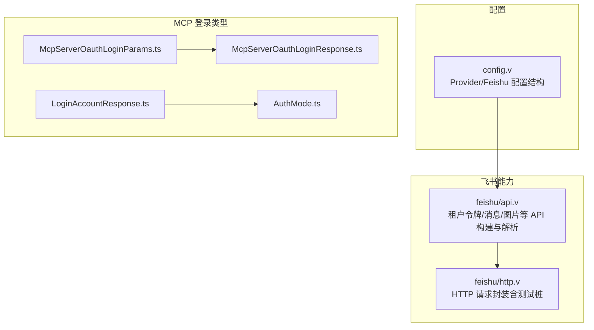
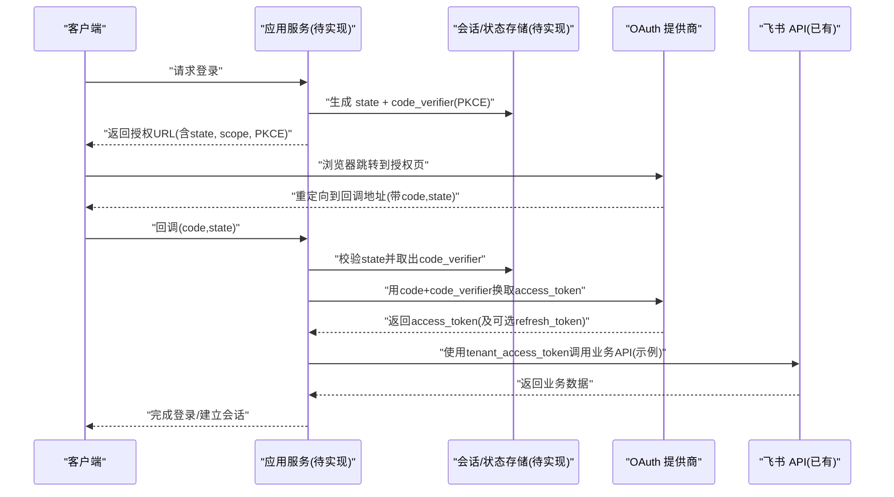
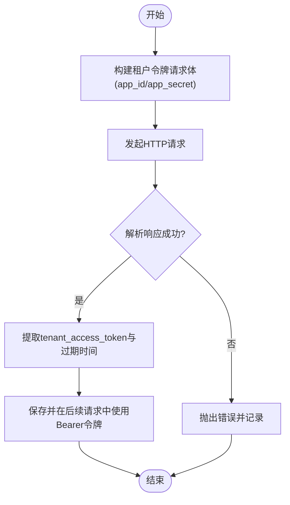
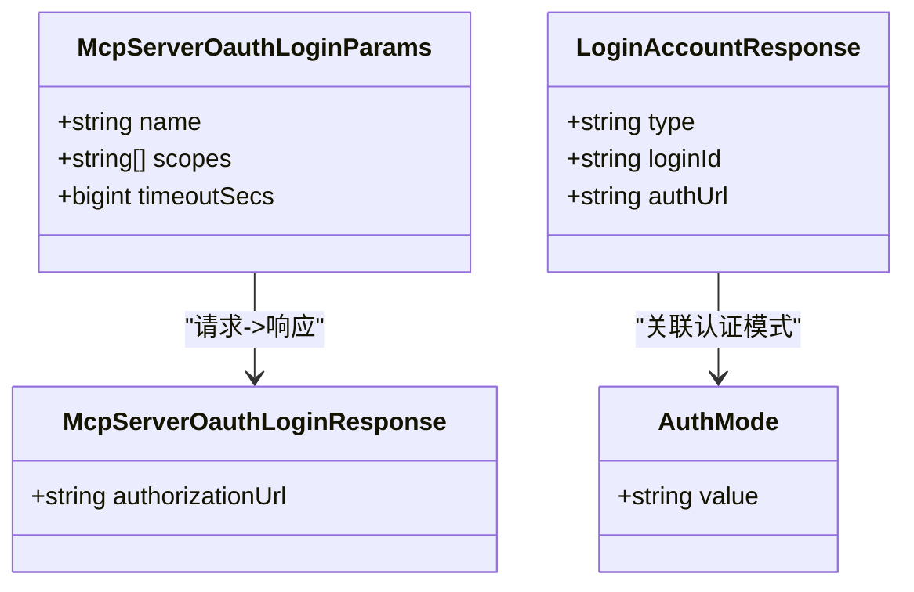
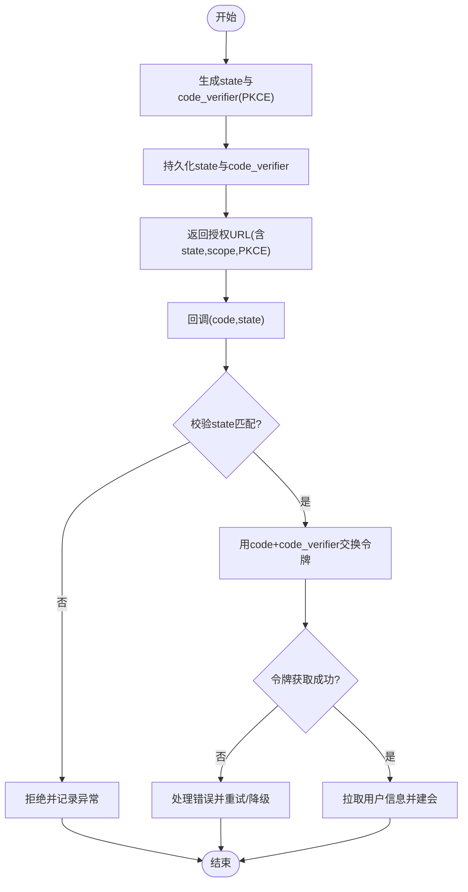
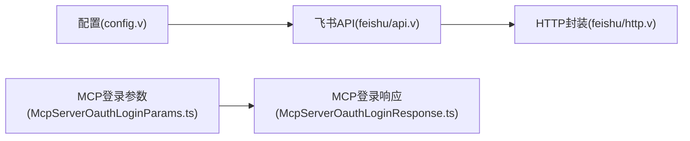

# OAuth 集成

<cite>
**本文引用的文件**
- [src/feishu/api.v](file://src/feishu/api.v)
- [src/feishu/http.v](file://src/feishu/http.v)
- [src/config/config.v](file://src/config/config.v)
- [examples/codexbot-app-ts/codex/ts/v2/McpServerOauthLoginParams.ts](file://examples/codexbot-app-ts/codex/ts/v2/McpServerOauthLoginParams.ts)
- [examples/codexbot-app-ts/codex/ts/v2/McpServerOauthLoginResponse.ts](file://examples/codexbot-app-ts/codex/ts/v2/McpServerOauthLoginResponse.ts)
- [examples/codexbot-app-ts/codex/ts/v2/LoginAccountResponse.ts](file://examples/codexbot-app-ts/codex/ts/v2/LoginAccountResponse.ts)
- [examples/codexbot-app-ts/codex/ts/AuthMode.ts](file://examples/codexbot-app-ts/codex/ts/AuthMode.ts)
</cite>

## 目录
1. [简介](#简介)
2. [项目结构](#项目结构)
3. [核心组件](#核心组件)
4. [架构总览](#架构总览)
5. [详细组件分析](#详细组件分析)
6. [依赖关系分析](#依赖关系分析)
7. [性能考虑](#性能考虑)
8. [故障排查指南](#故障排查指南)
9. [结论](#结论)
10. [附录](#附录)

## 简介
本文件面向在 vhttpd 生态中集成第三方 OAuth 认证（如飞书、Google、GitHub）的开发者，提供协议实现与工程落地的系统性说明。文档覆盖：
- OAuth 2.0 授权码模式、隐式模式、客户端凭证模式的适用场景与差异
- 回调处理机制：状态参数校验、令牌交换、用户信息获取
- 主流提供商集成要点与示例路径
- 安全最佳实践：PKCE、状态参数验证、令牌安全存储等

注意：当前仓库未包含通用 OAuth 2.0 中间件或统一回调路由的实现，但存在 MCP 侧的“登录启动”能力类型定义以及飞书租户令牌获取与 HTTP 封装等可复用基础能力。下文将基于现有代码进行映射与扩展建议。

## 项目结构
与 OAuth 相关的关键位置：
- 配置模型：Provider/Feishu 配置结构体，用于承载应用凭据与运行时选项
- 飞书 API 与 HTTP 封装：租户访问令牌获取、消息发送、图片上传等 REST 能力
- MCP 登录流程类型：MCP Server OAuth 登录参数与响应类型，表明系统支持“返回授权 URL 给客户端打开”的模式

图表来源
- [src/config/config.v:181-214](file://src/config/config.v#L181-L214)
- [src/feishu/api.v:164-190](file://src/feishu/api.v#L164-L190)
- [src/feishu/http.v:107-165](file://src/feishu/http.v#L107-L165)
- [examples/codexbot-app-ts/codex/ts/v2/McpServerOauthLoginParams.ts:1-5](file://examples/codexbot-app-ts/codex/ts/v2/McpServerOauthLoginParams.ts#L1-L5)
- [examples/codexbot-app-ts/codex/ts/v2/McpServerOauthLoginResponse.ts:1-5](file://examples/codexbot-app-ts/codex/ts/v2/McpServerOauthLoginResponse.ts#L1-L5)
- [examples/codexbot-app-ts/codex/ts/v2/LoginAccountResponse.ts:1-9](file://examples/codexbot-app-ts/codex/ts/v2/LoginAccountResponse.ts#L1-L9)
- [examples/codexbot-app-ts/codex/ts/AuthMode.ts:1-8](file://examples/codexbot-app-ts/codex/ts/v2/AuthMode.ts#L1-L8)

章节来源
- [src/config/config.v:181-214](file://src/config/config.v#L181-L214)
- [src/feishu/api.v:164-190](file://src/feishu/api.v#L164-L190)
- [src/feishu/http.v:107-165](file://src/feishu/http.v#L107-L165)
- [examples/codexbot-app-ts/codex/ts/v2/McpServerOauthLoginParams.ts:1-5](file://examples/codexbot-app-ts/codex/ts/v2/McpServerOauthLoginParams.ts#L1-L5)
- [examples/codexbot-app-ts/codex/ts/v2/McpServerOauthLoginResponse.ts:1-5](file://examples/codexbot-app-ts/codex/ts/v2/McpServerOauthLoginResponse.ts#L1-L5)
- [examples/codexbot-app-ts/codex/ts/v2/LoginAccountResponse.ts:1-9](file://examples/codexbot-app-ts/codex/ts/v2/LoginAccountResponse.ts#L1-L9)
- [examples/codexbot-app-ts/codex/ts/AuthMode.ts:1-8](file://examples/codexbot-app-ts/codex/ts/AuthMode.ts#L1-L8)

## 核心组件
- 配置模型
  - Provider/Feishu 配置结构体定义了启用开关、运行时驱动、插件、重试延迟、最近事件限制、应用列表等字段，便于按站点/实例加载不同凭据。
- 飞书 API 与 HTTP 封装
  - 提供租户访问令牌请求体构建与响应解析；消息发送、更新、图片上传的请求体与 URL 构建；统一的 HTTP 请求封装（含测试桩）。
- MCP 登录类型
  - 提供 MCP Server OAuth 登录的参数与响应类型，其中响应包含“授权 URL”，客户端可在浏览器中打开以发起授权流程。

章节来源
- [src/config/config.v:181-214](file://src/config/config.v#L181-L214)
- [src/feishu/api.v:164-190](file://src/feishu/api.v#L164-L190)
- [src/feishu/http.v:107-165](file://src/feishu/http.v#L107-L165)
- [examples/codexbot-app-ts/codex/ts/v2/McpServerOauthLoginParams.ts:1-5](file://examples/codexbot-app-ts/codex/ts/v2/McpServerOauthLoginParams.ts#L1-L5)
- [examples/codexbot-app-ts/codex/ts/v2/McpServerOauthLoginResponse.ts:1-5](file://examples/codexbot-app-ts/codex/ts/v2/McpServerOauthLoginResponse.ts#L1-L5)

## 架构总览
下图展示一个典型的“服务端生成授权 URL -> 客户端浏览器跳转 -> 回调到服务端 -> 交换令牌 -> 获取用户信息”的流程，并结合仓库中的 MCP 登录类型与飞书 HTTP 能力进行落地映射。

图表来源
- [examples/codexbot-app-ts/codex/ts/v2/McpServerOauthLoginParams.ts:1-5](file://examples/codexbot-app-ts/codex/ts/v2/McpServerOauthLoginParams.ts#L1-L5)
- [examples/codexbot-app-ts/codex/ts/v2/McpServerOauthLoginResponse.ts:1-5](file://examples/codexbot-app-ts/codex/ts/v2/McpServerOauthLoginResponse.ts#L1-L5)
- [src/feishu/api.v:164-190](file://src/feishu/api.v#L164-L190)
- [src/feishu/http.v:107-165](file://src/feishu/http.v#L107-L165)

## 详细组件分析

### 组件一：配置模型（Provider/Feishu）
- 作用
  - 集中管理 Provider 运行时驱动、插件、重试策略、最近事件限制等
  - 管理多应用配置（app_id/app_secret/verification_token/encrypt_key），支撑多租户/多站点
- 复杂度
  - 配置项较多，需结合站点/环境分层加载
- 优化点
  - 对敏感字段（app_secret、encrypt_key）采用加密存储或密钥管理服务
  - 为每个应用独立设置 token 刷新偏移与连接重试间隔

章节来源
- [src/config/config.v:181-214](file://src/config/config.v#L181-L214)

### 组件二：飞书 API 与 HTTP 封装
- 作用
  - 提供租户访问令牌请求体构建与响应解析
  - 提供消息发送、更新、图片上传的请求体与 URL 构建
  - 统一 HTTP 请求封装，屏蔽底层细节并提供测试桩
- 关键流程（租户令牌）
  - 构造请求体（app_id/app_secret）
  - 解析响应（tenant_access_token/expiry）
  - 后续调用通过 Bearer 令牌鉴权
- 错误处理
  - 响应码非 0 时抛出错误，上层需捕获并记录日志
- 并发与锁
  - HTTP 封装在 lane 级别加锁，避免跨线程竞争

图表来源
- [src/feishu/api.v:164-190](file://src/feishu/api.v#L164-L190)
- [src/feishu/http.v:107-165](file://src/feishu/http.v#L107-L165)

章节来源
- [src/feishu/api.v:164-190](file://src/feishu/api.v#L164-L190)
- [src/feishu/http.v:107-165](file://src/feishu/http.v#L107-L165)

### 组件三：MCP 登录流程类型（授权码模式参考）
- 作用
  - 定义 MCP Server OAuth 登录的参数与响应类型
  - 响应中包含“授权 URL”，客户端应在浏览器中打开以发起授权流程
- 适用模式
  - 授权码模式（Authorization Code）：服务端生成 state/PKCE，客户端携带 code 回调至服务端，服务端再交换令牌
- 扩展建议
  - 在服务端增加回调处理器，校验 state、交换 access_token、拉取用户信息并建立本地会话

图表来源
- [examples/codexbot-app-ts/codex/ts/v2/McpServerOauthLoginParams.ts:1-5](file://examples/codexbot-app-ts/codex/ts/v2/McpServerOauthLoginParams.ts#L1-L5)
- [examples/codexbot-app-ts/codex/ts/v2/McpServerOauthLoginResponse.ts:1-5](file://examples/codexbot-app-ts/codex/ts/v2/McpServerOauthLoginResponse.ts#L1-L5)
- [examples/codexbot-app-ts/codex/ts/v2/LoginAccountResponse.ts:1-9](file://examples/codexbot-app-ts/codex/ts/v2/LoginAccountResponse.ts#L1-L9)
- [examples/codexbot-app-ts/codex/ts/AuthMode.ts:1-8](file://examples/codexbot-app-ts/codex/ts/AuthMode.ts#L1-L8)

章节来源
- [examples/codexbot-app-ts/codex/ts/v2/McpServerOauthLoginParams.ts:1-5](file://examples/codexbot-app-ts/codex/ts/v2/McpServerOauthLoginParams.ts#L1-L5)
- [examples/codexbot-app-ts/codex/ts/v2/McpServerOauthLoginResponse.ts:1-5](file://examples/codexbot-app-ts/codex/ts/v2/McpServerOauthLoginResponse.ts#L1-L5)
- [examples/codexbot-app-ts/codex/ts/v2/LoginAccountResponse.ts:1-9](file://examples/codexbot-app-ts/codex/ts/v2/LoginAccountResponse.ts#L1-L9)
- [examples/codexbot-app-ts/codex/ts/AuthMode.ts:1-8](file://examples/codexbot-app-ts/codex/ts/AuthMode.ts#L1-L8)

### 组件四：回调处理与安全校验（建议实现）
- 状态参数验证
  - 在发起授权前生成随机 state 并持久化（会话/缓存），回调时严格比对
- PKCE 扩展
  - 生成 code_verifier 并计算 code_challenge，回调时用 code_verifier 换取令牌
- 令牌交换
  - 使用 code 与 code_verifier 向提供商换取 access_token（必要时 refresh_token）
- 用户信息获取
  - 使用 access_token 调用提供商的用户信息接口，建立本地会话

[本节为概念性流程，不直接对应具体源码文件]

## 依赖关系分析
- 配置层
  - Provider/Feishu 配置结构体为上层逻辑提供运行时参数与应用凭据
- 能力层
  - 飞书 API 与 HTTP 封装提供令牌获取与业务 API 调用能力
- 协议层
  - MCP 登录类型定义体现“服务端返回授权 URL”的交互范式，可作为 OAuth 授权码模式的入口

图表来源
- [src/config/config.v:181-214](file://src/config/config.v#L181-L214)
- [src/feishu/api.v:164-190](file://src/feishu/api.v#L164-L190)
- [src/feishu/http.v:107-165](file://src/feishu/http.v#L107-L165)
- [examples/codexbot-app-ts/codex/ts/v2/McpServerOauthLoginParams.ts:1-5](file://examples/codexbot-app-ts/codex/ts/v2/McpServerOauthLoginParams.ts#L1-L5)
- [examples/codexbot-app-ts/codex/ts/v2/McpServerOauthLoginResponse.ts:1-5](file://examples/codexbot-app-ts/codex/ts/v2/McpServerOauthLoginResponse.ts#L1-L5)

章节来源
- [src/config/config.v:181-214](file://src/config/config.v#L181-L214)
- [src/feishu/api.v:164-190](file://src/feishu/api.v#L164-L190)
- [src/feishu/http.v:107-165](file://src/feishu/http.v#L107-L165)
- [examples/codexbot-app-ts/codex/ts/v2/McpServerOauthLoginParams.ts:1-5](file://examples/codexbot-app-ts/codex/ts/v2/McpServerOauthLoginParams.ts#L1-L5)
- [examples/codexbot-app-ts/codex/ts/v2/McpServerOauthLoginResponse.ts:1-5](file://examples/codexbot-app-ts/codex/ts/v2/McpServerOauthLoginResponse.ts#L1-L5)

## 性能考虑
- 令牌缓存与刷新
  - 缓存 access_token 并在过期前主动刷新，减少网络往返
- 并发与锁
  - HTTP 封装已在 lane 级别加锁，避免竞态；在高并发下应关注锁粒度与超时控制
- 重试与退避
  - 对令牌刷新与用户信息拉取实施指数退避与熔断策略
- 流式与长连接
  - 若涉及长轮询或 SSE/WebSocket，需结合上游计划与调度器进行资源隔离

[本节为通用指导，不直接分析具体文件]

## 故障排查指南
- 常见错误
  - 状态参数不匹配：检查 state 是否被篡改或过期
  - PKCE 失败：确认 code_challenge/code_verifier 计算一致且未被截断
  - 令牌交换失败：检查 client_id/client_secret 与 redirect_uri 是否与提供商注册一致
  - 用户信息拉取失败：检查权限范围（scope）与令牌有效性
- 定位方法
  - 开启详细日志，记录授权 URL、回调参数、令牌交换请求与响应摘要
  - 使用飞书 HTTP 测试桩快速验证流程分支与错误路径

章节来源
- [src/feishu/http.v:41-103](file://src/feishu/http.v#L41-L103)

## 结论
- 仓库提供了 Provider/Feishu 配置结构与飞书 API/HTTP 封装，可作为 OAuth 集成的基础能力
- MCP 登录类型体现了“服务端返回授权 URL”的交互范式，适合授权码模式落地
- 建议在应用层补充回调处理、状态与 PKCE 校验、令牌交换与用户信息获取，并遵循安全最佳实践

[本节为总结，不直接分析具体文件]

## 附录

### OAuth 2.0 模式对比与选型
- 授权码模式（Authorization Code）
  - 适用：Web 应用、移动端后端
  - 特点：更安全，支持 PKCE，适合需要长期授权的场景
- 隐式模式（Implicit）
  - 适用：纯前端 SPA（已逐步弃用）
  - 特点：直接在浏览器中获取令牌，安全性较弱
- 客户端凭证模式（Client Credentials）
  - 适用：服务间调用（无用户上下文）
  - 特点：仅客户端身份，不涉及用户授权

[本节为概念性内容，不直接分析具体文件]

### 主流提供商集成要点（示例路径）
- 飞书
  - 参考：租户令牌获取与 HTTP 封装
  - 示例路径：
    - [src/feishu/api.v:164-190](file://src/feishu/api.v#L164-L190)
    - [src/feishu/http.v:107-165](file://src/feishu/http.v#L107-L165)
- Google/GitHub
  - 参考：MCP 登录类型（授权码模式）
  - 示例路径：
    - [examples/codexbot-app-ts/codex/ts/v2/McpServerOauthLoginParams.ts:1-5](file://examples/codexbot-app-ts/codex/ts/v2/McpServerOauthLoginParams.ts#L1-L5)
    - [examples/codexbot-app-ts/codex/ts/v2/McpServerOauthLoginResponse.ts:1-5](file://examples/codexbot-app-ts/codex/ts/v2/McpServerOauthLoginResponse.ts#L1-L5)

章节来源
- [src/feishu/api.v:164-190](file://src/feishu/api.v#L164-L190)
- [src/feishu/http.v:107-165](file://src/feishu/http.v#L107-L165)
- [examples/codexbot-app-ts/codex/ts/v2/McpServerOauthLoginParams.ts:1-5](file://examples/codexbot-app-ts/codex/ts/v2/McpServerOauthLoginParams.ts#L1-L5)
- [examples/codexbot-app-ts/codex/ts/v2/McpServerOauthLoginResponse.ts:1-5](file://examples/codexbot-app-ts/codex/ts/v2/McpServerOauthLoginResponse.ts#L1-L5)