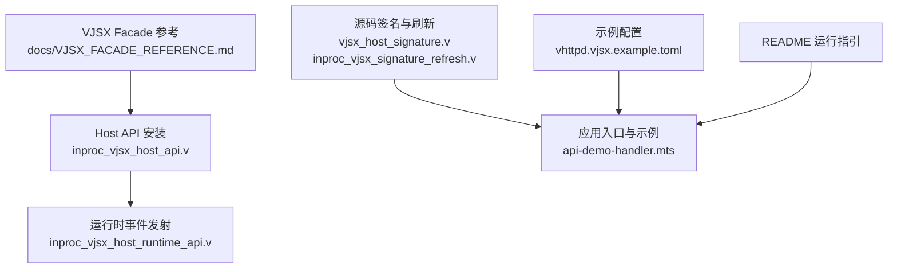
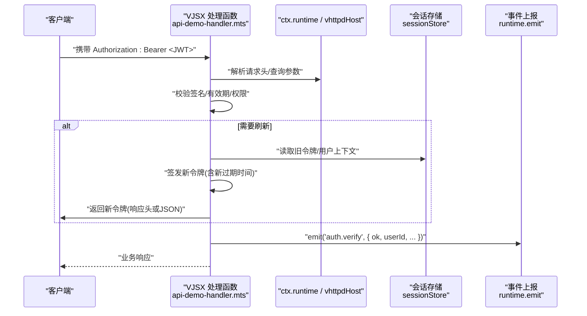
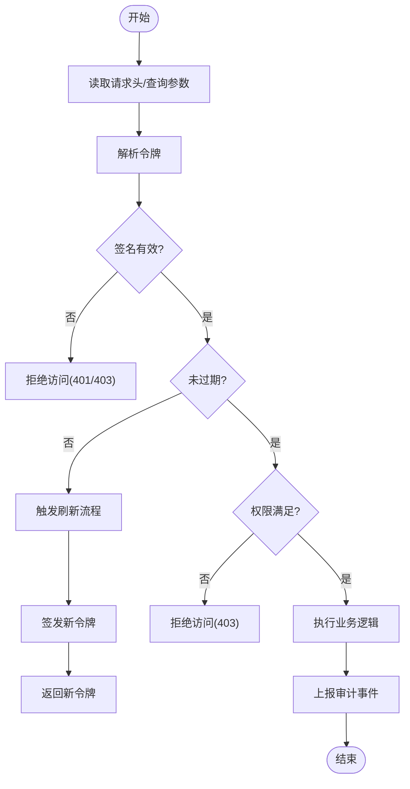
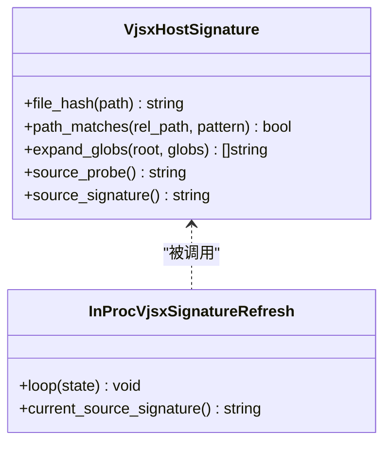
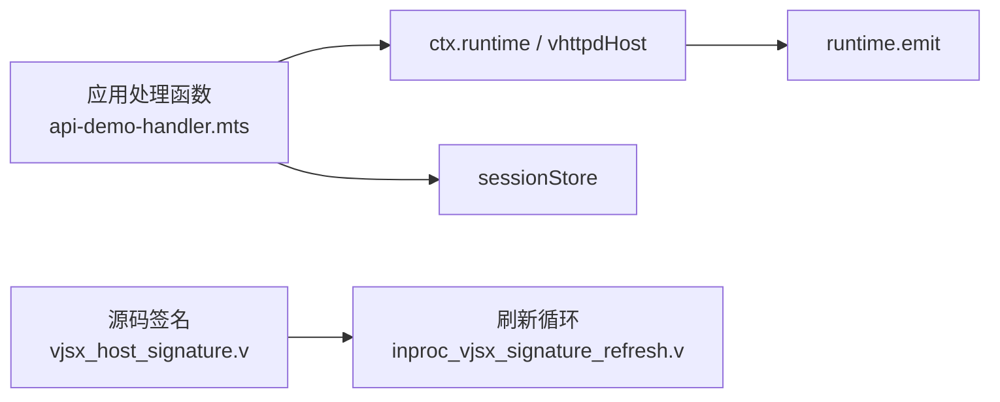

# 令牌管理

<cite>
**本文引用的文件**
- [src/executor/vjsx_host_signature.v](file://src/executor/vjsx_host_signature.v)
- [src/executor/inproc_vjsx_signature_refresh.v](file://src/executor/inproc_vjsx_signature_refresh.v)
- [src/executor/inproc_vjsx_host_api.v](file://src/executor/inproc_vjsx_host_api.v)
- [src/executor/inproc_vjsx_host_runtime_api.v](file://src/executor/inproc_vjsx_host_runtime_api.v)
- [docs/VJSX_FACADE_REFERENCE.md](file://docs/VJSX_FACADE_REFERENCE.md)
- [examples/vjsx/api-demo-handler.mts](file://examples/vjsx/api-demo-handler.mts)
- [config/vhttpd.vjsx.example.toml](file://config/vhttpd.vjsx.example.toml)
- [README.md](file://README.md)
</cite>

## 目录
1. [简介](#简介)
2. [项目结构](#项目结构)
3. [核心组件](#核心组件)
4. [架构总览](#架构总览)
5. [详细组件分析](#详细组件分析)
6. [依赖关系分析](#依赖关系分析)
7. [性能考虑](#性能考虑)
8. [故障排查指南](#故障排查指南)
9. [结论](#结论)
10. [附录](#附录)

## 简介
本文件面向在 VJSX 执行器中集成“令牌管理系统”的读者，聚焦于 JWT 令牌的生成、验证与刷新机制，覆盖签名算法选择、密钥管理与安全存储、生命周期管理（过期时间、自动刷新、撤销）、以及完整的验证流程（签名校验、权限检查、安全防护）。文档同时提供在 VJSX 执行器中的集成要点与示例路径，帮助快速落地。

说明：
- 仓库未内置通用 JWT 库或现成的令牌中间件；本文基于现有 VJSX Facade、Host API 与事件系统，给出可落地的实现方案与最佳实践。
- 所有代码级引用均以“章节来源”标注具体文件与行号，避免直接粘贴源码。

## 项目结构
围绕令牌管理，本项目中与 VJSX 执行器相关的核心位置如下：
- VJSX Facade 参考文档：定义 ctx.runtime、vhttpdHost 等能力边界，便于在应用侧实现令牌逻辑。
- Host API 安装与运行时事件发射：为应用侧提供 emit/snapshot/sessionStore/config 等宿主能力。
- 源码签名与热重载相关：用于保障应用代码变更时的安全重启与一致性。
- 示例配置与运行方式：提供 vjsx 执行器的启动参数与配置文件样例。

图表来源
- [docs/VJSX_FACADE_REFERENCE.md:1-280](file://docs/VJSX_FACADE_REFERENCE.md#L1-L280)
- [src/executor/inproc_vjsx_host_api.v:1-59](file://src/executor/inproc_vjsx_host_api.v#L1-L59)
- [src/executor/inproc_vjsx_host_runtime_api.v:1-57](file://src/executor/inproc_vjsx_host_runtime_api.v#L1-L57)
- [src/executor/vjsx_host_signature.v:1-296](file://src/executor/vjsx_host_signature.v#L1-L296)
- [src/executor/inproc_vjsx_signature_refresh.v:1-96](file://src/executor/inproc_vjsx_signature_refresh.v#L1-L96)
- [examples/vjsx/api-demo-handler.mts:1-91](file://examples/vjsx/api-demo-handler.mts#L1-L91)
- [config/vhttpd.vjsx.example.toml:1-36](file://config/vhttpd.vjsx.example.toml#L1-L36)
- [README.md:657-672](file://README.md#L657-L672)

章节来源
- [docs/VJSX_FACADE_REFERENCE.md:1-280](file://docs/VJSX_FACADE_REFERENCE.md#L1-L280)
- [src/executor/inproc_vjsx_host_api.v:1-59](file://src/executor/inproc_vjsx_host_api.v#L1-L59)
- [src/executor/inproc_vjsx_host_runtime_api.v:1-57](file://src/executor/inproc_vjsx_host_runtime_api.v#L1-L57)
- [src/executor/vjsx_host_signature.v:1-296](file://src/executor/vjsx_host_signature.v#L1-L296)
- [src/executor/inproc_vjsx_signature_refresh.v:1-96](file://src/executor/inproc_vjsx_signature_refresh.v#L1-L96)
- [examples/vjsx/api-demo-handler.mts:1-91](file://examples/vjsx/api-demo-handler.mts#L1-L91)
- [config/vhttpd.vjsx.example.toml:1-36](file://config/vhttpd.vjsx.example.toml#L1-L36)
- [README.md:657-672](file://README.md#L657-L672)

## 核心组件
- VJSX Facade 与 Host API
  - 通过 ctx.runtime 暴露只读执行元数据与日志、快照、HTTP 调用等能力。
  - 通过 globalThis.vhttpdHost 暴露宿主能力，如 emit、snapshot、sessionStore、config、readTextFile、findCodexSessionPath、httpFetch、bridgeDispatch、websocketDispatch。
- 运行时事件发射
  - 应用侧可通过 runtime.emit(kind, fields) 上报自定义事件，便于审计与追踪。
- 源码签名与刷新
  - 对应用源码进行包含/排除规则匹配与哈希计算，支持探测与全量签名，配合后台轮询实现热更新与一致性保证。
- 示例与配置
  - 提供 vjsx 执行器示例配置与运行方式，便于本地验证。

章节来源
- [docs/VJSX_FACADE_REFERENCE.md:1-280](file://docs/VJSX_FACADE_REFERENCE.md#L1-L280)
- [src/executor/inproc_vjsx_host_api.v:1-59](file://src/executor/inproc_vjsx_host_api.v#L1-L59)
- [src/executor/inproc_vjsx_host_runtime_api.v:1-57](file://src/executor/inproc_vjsx_host_runtime_api.v#L1-L57)
- [src/executor/vjsx_host_signature.v:1-296](file://src/executor/vjsx_host_signature.v#L1-L296)
- [src/executor/inproc_vjsx_signature_refresh.v:1-96](file://src/executor/inproc_vjsx_signature_refresh.v#L1-L96)
- [examples/vjsx/api-demo-handler.mts:1-91](file://examples/vjsx/api-demo-handler.mts#L1-L91)
- [config/vhttpd.vjsx.example.toml:1-36](file://config/vhttpd.vjsx.example.toml#L1-L36)
- [README.md:657-672](file://README.md#L657-L672)

## 架构总览
下图展示在 VJSX 执行器中集成令牌管理的整体流程：客户端请求进入后，由 VJSX 处理函数读取并验证 JWT，必要时触发刷新或拒绝访问；应用侧通过 Host API 上报事件与持久化会话状态；源码变更时通过签名与刷新机制保障一致性。

图表来源
- [examples/vjsx/api-demo-handler.mts:1-91](file://examples/vjsx/api-demo-handler.mts#L1-L91)
- [docs/VJSX_FACADE_REFERENCE.md:1-280](file://docs/VJSX_FACADE_REFERENCE.md#L1-L280)
- [src/executor/inproc_vjsx_host_runtime_api.v:1-57](file://src/executor/inproc_vjsx_host_runtime_api.v#L1-L57)

## 详细组件分析

### 令牌生成与签发
- 建议采用 RS256 或 ES256 等非对称算法，服务端持有私钥，客户端使用公钥验签，降低私钥泄露风险。
- 载荷设计应最小化，仅包含必要声明（如 sub、exp、iat、jti、角色/权限集合等），避免敏感信息入载。
- 颁发者（iss）与受众（aud）需严格设置，防止跨域误用。
- 令牌长度与传输：优先使用 Authorization: Bearer 头部；如需 Cookie，务必启用 HttpOnly、Secure、SameSite=Strict/Lax。

章节来源
- [docs/VJSX_FACADE_REFERENCE.md:1-280](file://docs/VJSX_FACADE_REFERENCE.md#L1-L280)

### 密钥管理与安全存储
- 私钥存储：使用操作系统密钥服务或云 KMS，避免明文落盘；若必须落盘，需限制文件权限并加密存储。
- 公钥分发：以受信任渠道发布，定期轮换并建立版本标识（kid）。
- 密钥轮换策略：双密钥窗口期，新旧并行一段时间后再下线旧密钥。

章节来源
- [docs/VJSX_FACADE_REFERENCE.md:1-280](file://docs/VJSX_FACADE_REFERENCE.md#L1-L280)

### 令牌生命周期管理
- 过期时间（exp）：短生命周期的访问令牌（例如 5-15 分钟），结合刷新令牌延长会话。
- 自动刷新策略：
  - 前端在接近过期前（如剩余 10% 时间）发起静默刷新。
  - 后端在鉴权失败且具备有效刷新令牌时，签发新访问令牌并返回。
- 撤销机制：
  - 维护黑名单（按 jti 或子集索引），在鉴权阶段检查是否已撤销。
  - 支持批量撤销（按用户/设备维度）与即时生效。

章节来源
- [docs/VJSX_FACADE_REFERENCE.md:1-280](file://docs/VJSX_FACADE_REFERENCE.md#L1-L280)

### 令牌验证流程与安全防护
- 签名验证：使用对应公钥校验签名，校验 kid 指向正确的密钥版本。
- 时效性：校验 exp、nbf、iat。
- 权限检查：根据载荷中的角色/权限集合进行授权决策。
- 安全防护：
  - 速率限制与防重放（结合 jti 与短期缓存）。
  - 输入校验与白名单（路径、方法、内容类型）。
  - 错误信息脱敏，避免泄露内部细节。
  - 审计日志：记录鉴权结果与关键上下文。

图表来源
- [docs/VJSX_FACADE_REFERENCE.md:1-280](file://docs/VJSX_FACADE_REFERENCE.md#L1-L280)
- [src/executor/inproc_vjsx_host_runtime_api.v:1-57](file://src/executor/inproc_vjsx_host_runtime_api.v#L1-L57)

### 在 VJSX 执行器中的集成要点
- 入口与上下文
  - 使用 ctx.runtime 获取执行元数据与日志能力。
  - 使用 vhttpdHost.sessionStore 做跨请求的会话/令牌状态存取。
  - 使用 runtime.emit 上报鉴权事件，便于审计与监控。
- 示例参考
  - 示例处理器展示了如何构造响应、读取请求信息与上报事件，可作为鉴权中间件的模板。
- 配置与运行
  - 使用示例配置与 CLI 参数启动 vjsx 执行器，确保模块根与应用入口正确。

章节来源
- [docs/VJSX_FACADE_REFERENCE.md:1-280](file://docs/VJSX_FACADE_REFERENCE.md#L1-L280)
- [examples/vjsx/api-demo-handler.mts:1-91](file://examples/vjsx/api-demo-handler.mts#L1-L91)
- [config/vhttpd.vjsx.example.toml:1-36](file://config/vhttpd.vjsx.example.toml#L1-L36)
- [README.md:657-672](file://README.md#L657-L672)

### 源码签名与热重载（与令牌安全相关）
- 源码签名
  - 基于 include/exclude 模式收集源文件，计算 mtime/size/hash，生成稳定签名。
- 刷新循环
  - 后台线程周期性探测变化，达到去抖阈值或全量周期后重新计算签名，保障应用一致性。
- 与令牌的关系
  - 当应用代码变更导致签名变化时，可触发安全重启或灰度切换，避免在运行态引入不安全的鉴权逻辑。

图表来源
- [src/executor/vjsx_host_signature.v:1-296](file://src/executor/vjsx_host_signature.v#L1-L296)
- [src/executor/inproc_vjsx_signature_refresh.v:1-96](file://src/executor/inproc_vjsx_signature_refresh.v#L1-L96)

章节来源
- [src/executor/vjsx_host_signature.v:1-296](file://src/executor/vjsx_host_signature.v#L1-L296)
- [src/executor/inproc_vjsx_signature_refresh.v:1-96](file://src/executor/inproc_vjsx_signature_refresh.v#L1-L96)

## 依赖关系分析
- Facade 与 Host API
  - 应用侧通过 ctx.runtime 与 vhttpdHost 访问宿主能力，完成日志、事件、会话与外部调用。
- 事件系统
  - 应用侧通过 runtime.emit 上报鉴权事件，供上层聚合与审计。
- 源码签名
  - 签名与刷新模块独立于业务逻辑，但影响部署与重启策略，间接影响令牌系统的可用性与安全性。

图表来源
- [examples/vjsx/api-demo-handler.mts:1-91](file://examples/vjsx/api-demo-handler.mts#L1-L91)
- [docs/VJSX_FACADE_REFERENCE.md:1-280](file://docs/VJSX_FACADE_REFERENCE.md#L1-L280)
- [src/executor/vjsx_host_signature.v:1-296](file://src/executor/vjsx_host_signature.v#L1-L296)
- [src/executor/inproc_vjsx_signature_refresh.v:1-96](file://src/executor/inproc_vjsx_signature_refresh.v#L1-L96)

章节来源
- [examples/vjsx/api-demo-handler.mts:1-91](file://examples/vjsx/api-demo-handler.mts#L1-L91)
- [docs/VJSX_FACADE_REFERENCE.md:1-280](file://docs/VJSX_FACADE_REFERENCE.md#L1-L280)
- [src/executor/vjsx_host_signature.v:1-296](file://src/executor/vjsx_host_signature.v#L1-L296)
- [src/executor/inproc_vjsx_signature_refresh.v:1-96](file://src/executor/inproc_vjsx_signature_refresh.v#L1-L96)

## 性能考虑
- 令牌校验开销
  - 使用非对称算法时，公钥校验较快；建议缓存公钥与最近校验结果（带 TTL）。
- 刷新频率控制
  - 前端侧限流刷新请求，避免风暴；后端对刷新接口实施速率限制。
- 黑名单与缓存
  - 将撤销令牌写入高性能缓存（如内存/Redis），设置合理过期时间，减少磁盘 IO。
- 事件上报
  - 使用异步队列或批量化上报，避免阻塞主流程。

[本节为通用指导，无需源码引用]

## 故障排查指南
- 常见问题
  - 签名无效：检查 kid 与公钥版本、算法是否一致。
  - 令牌过期：确认 exp/nbf/iat 设置与时区/时钟同步。
  - 权限不足：核对载荷中的角色/权限集合与路由策略。
  - 刷新失败：检查刷新令牌有效性、刷新接口可用性。
- 定位手段
  - 使用 runtime.emit 上报鉴权事件，结合 traceId/requestId 追踪链路。
  - 使用 vhttpdHost.snapshot 获取运行时快照，辅助定位问题。
  - 利用源码签名与刷新日志，确认应用是否因变更触发了重启。

章节来源
- [docs/VJSX_FACADE_REFERENCE.md:1-280](file://docs/VJSX_FACADE_REFERENCE.md#L1-L280)
- [src/executor/inproc_vjsx_host_runtime_api.v:1-57](file://src/executor/inproc_vjsx_host_runtime_api.v#L1-L57)
- [src/executor/vjsx_host_signature.v:1-296](file://src/executor/vjsx_host_signature.v#L1-L296)
- [src/executor/inproc_vjsx_signature_refresh.v:1-96](file://src/executor/inproc_vjsx_signature_refresh.v#L1-L96)

## 结论
通过在 VJSX 执行器中集成令牌管理，可实现高内聚、低耦合的安全鉴权体系。结合非对称签名、严格的密钥管理、完善的生命周期与撤销机制，以及完善的审计与监控，可在保障安全性的同时获得良好的用户体验与运维可观测性。源码签名与刷新机制进一步提升了部署期的安全性与一致性。

[本节为总结，无需源码引用]

## 附录
- 示例与运行
  - 示例处理器：examples/vjsx/api-demo-handler.mts
  - 示例配置：config/vhttpd.vjsx.example.toml
  - README 运行指引：README.md
- 参考文档
  - VJSX Facade 参考：docs/VJSX_FACADE_REFERENCE.md

章节来源
- [examples/vjsx/api-demo-handler.mts:1-91](file://examples/vjsx/api-demo-handler.mts#L1-L91)
- [config/vhttpd.vjsx.example.toml:1-36](file://config/vhttpd.vjsx.example.toml#L1-L36)
- [README.md:657-672](file://README.md#L657-L672)
- [docs/VJSX_FACADE_REFERENCE.md:1-280](file://docs/VJSX_FACADE_REFERENCE.md#L1-L280)