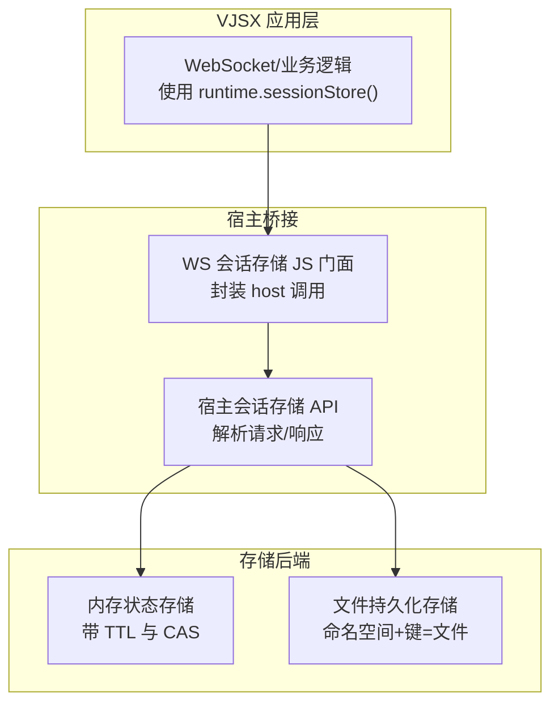
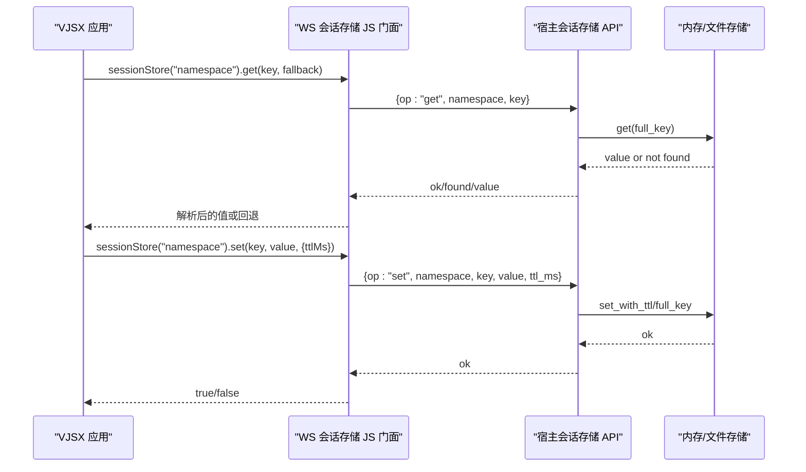
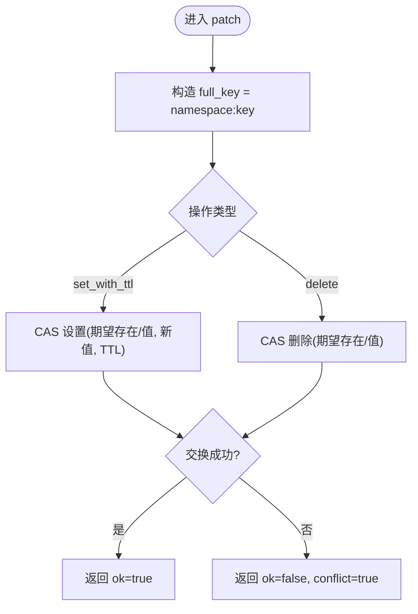
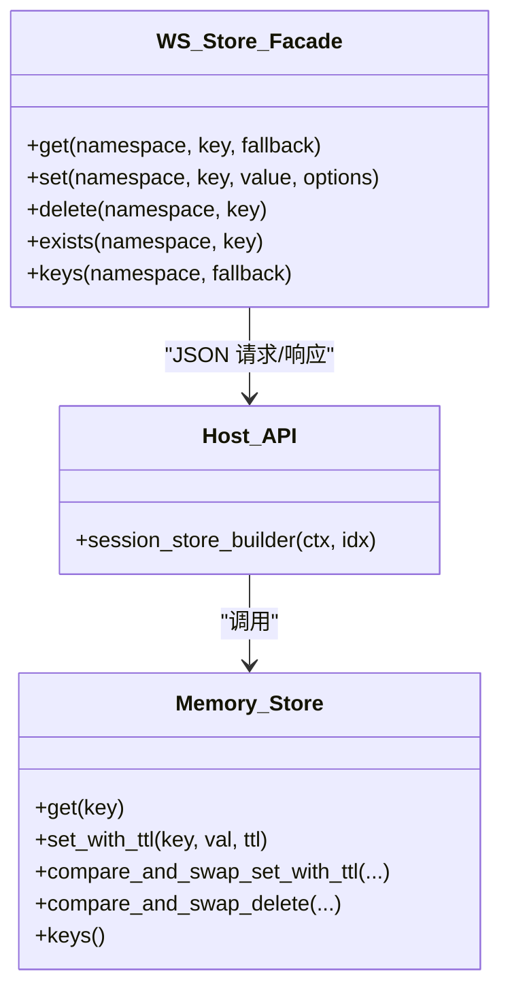
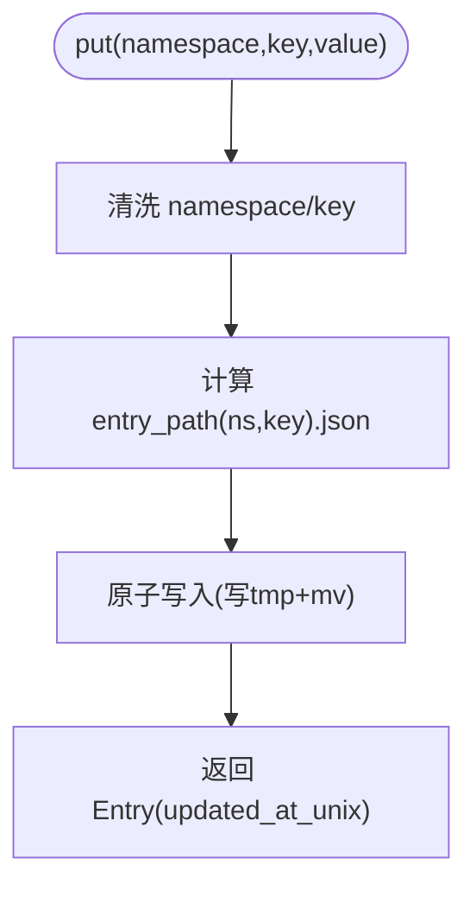
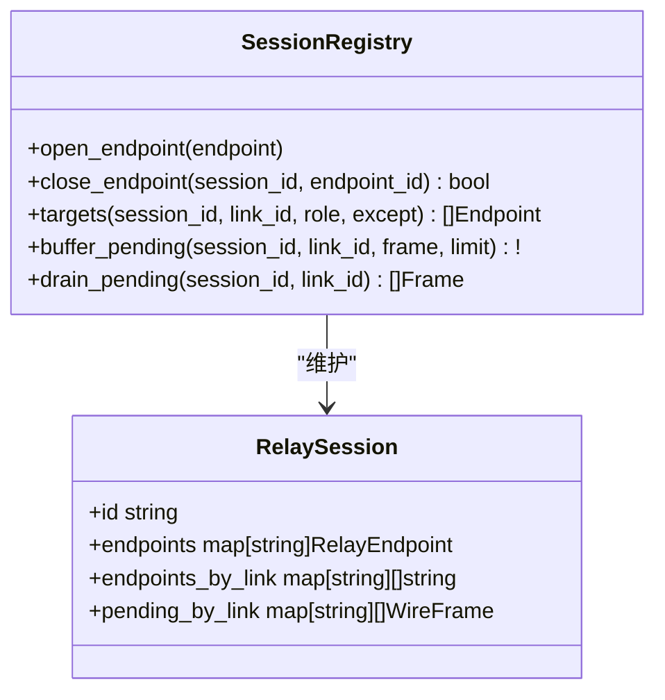
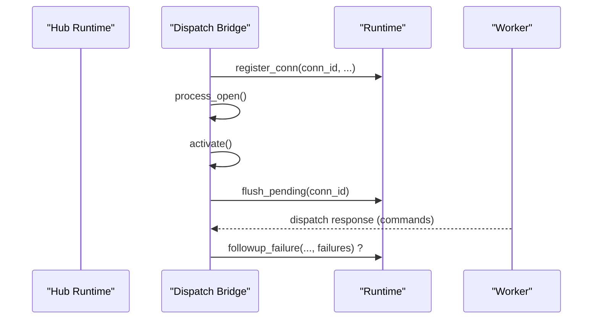
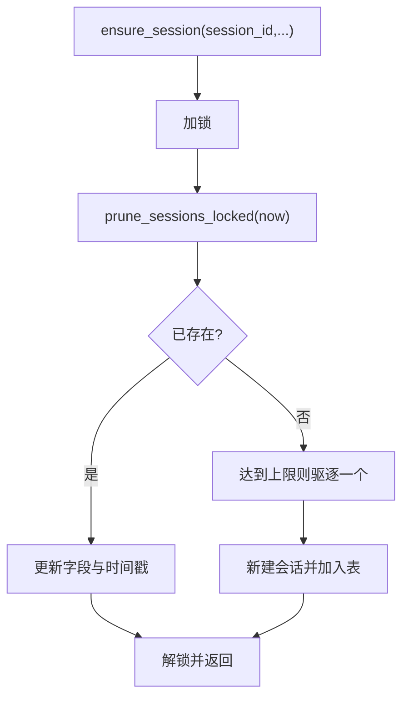
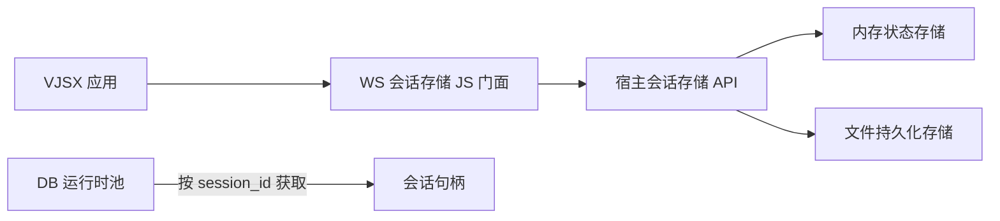

# 会话安全管理

<cite>
**本文引用的文件**   
- [inproc_vjsx_host_session_store_api.v](file://src/executor/inproc_vjsx_host_session_store_api.v)
- [inproc_vjsx_websocket_session_store_js.v](file://src/executor/inproc_vjsx_websocket_session_store_js.v)
- [state_store.v](file://src/state_store/state_store.v)
- [store.v](file://src/admin_state_store/store.v)
- [session.v](file://src/relay/session.v)
- [dispatch_session.v](file://src/ws/dispatch_session.v)
- [websocket_session_delivery_projection.v](file://src/websocket_session_delivery_projection.v)
- [hub_runtime.v](file://src/ws/hub_runtime.v)
- [state.v](file://src/api/mcp/protocol/state.v)
- [db_runtime_pool.v](file://src/db_runtime_pool.v)
</cite>

## 目录
1. [简介](#简介)
2. [项目结构](#项目结构)
3. [核心组件](#核心组件)
4. [架构总览](#架构总览)
5. [详细组件分析](#详细组件分析)
6. [依赖关系分析](#依赖关系分析)
7. [性能与扩展性](#性能与扩展性)
8. [安全配置指南](#安全配置指南)
9. [故障排查](#故障排查)
10. [结论](#结论)

## 简介
本文件围绕 vhttpd 的“会话”能力，系统性梳理其存储机制、并发控制、安全性与清理策略。重点覆盖：
- 内存存储、持久化存储（文件系统）以及面向分布式扩展的设计要点
- 并发控制：锁机制、版本控制与冲突解决
- 安全性：会话固定攻击防护、CSRF 保护、会话劫持防护
- 清理策略与性能优化建议

## 项目结构
vhttpd 将“会话”抽象为可插拔的存储接口，并通过宿主 API 暴露给 VJSX 应用层；同时提供基于文件的持久化实现用于管理态观测与调试。

图示来源
- [inproc_vjsx_websocket_session_store_js.v:1-207](file://src/executor/inproc_vjsx_websocket_session_store_js.v#L1-L207)
- [inproc_vjsx_host_session_store_api.v:1-136](file://src/executor/inproc_vjsx_host_session_store_api.v#L1-L136)
- [state_store.v:1-274](file://src/state_store/state_store.v#L1-L274)
- [store.v:1-194](file://src/admin_state_store/store.v#L1-L194)

章节来源
- [inproc_vjsx_websocket_session_store_js.v:1-207](file://src/executor/inproc_vjsx_websocket_session_store_js.v#L1-L207)
- [inproc_vjsx_host_session_store_api.v:1-136](file://src/executor/inproc_vjsx_host_session_store_api.v#L1-L136)
- [state_store.v:1-274](file://src/state_store/state_store.v#L1-L274)
- [store.v:1-194](file://src/admin_state_store/store.v#L1-L194)

## 核心组件
- 内存状态存储（MemoryStateStore）
  - 线程安全：内部互斥锁保护所有读写
  - 支持 TTL 过期判断与惰性删除
  - 提供 compare-and-swap 原子更新/删除，用于无锁乐观并发控制
- 宿主会话存储 API（Host Session Store API）
  - 暴露 get/set/patch/delete/exists/keys 等操作
  - patch 操作通过 CAS 返回冲突信号，供上层重试或降级
- WebSocket 会话存储 JS 门面
  - 在 VJSX 侧提供 sessionStore(namespace) 统一入口
  - 自动序列化/反序列化 JSON，并透传 TTL
- 管理态文件存储（FileStore）
  - 以命名空间+键映射到文件，便于审计与排障
  - 事件追加写入 events.jsonl，支持按类型查询

章节来源
- [state_store.v:1-274](file://src/state_store/state_store.v#L1-L274)
- [inproc_vjsx_host_session_store_api.v:1-136](file://src/executor/inproc_vjsx_host_session_store_api.v#L1-L136)
- [inproc_vjsx_websocket_session_store_js.v:1-207](file://src/executor/inproc_vjsx_websocket_session_store_js.v#L1-L207)
- [store.v:1-194](file://src/admin_state_store/store.v#L1-L194)

## 架构总览
下图展示从 VJSX 应用到宿主 API 再到存储后端的完整调用链，以及 WebSocket 会话生命周期中的关键节点。

图示来源
- [inproc_vjsx_websocket_session_store_js.v:1-207](file://src/executor/inproc_vjsx_websocket_session_store_js.v#L1-L207)
- [inproc_vjsx_host_session_store_api.v:1-136](file://src/executor/inproc_vjsx_host_session_store_api.v#L1-L136)
- [state_store.v:1-274](file://src/state_store/state_store.v#L1-L274)

## 详细组件分析

### 内存状态存储（并发与一致性）
- 并发控制
  - 所有方法均持有互斥锁，保证单进程内线性一致
  - keys/list/prune_expired 等扫描类操作会惰性清理过期项
- 版本控制与冲突解决
  - compare_and_swap_set_with_ttl / compare_and_swap_delete 提供 CAS 语义
  - 上层 patch 操作若失败，返回 conflict 标志，由应用层决定重试或回退
- 复杂度
  - get/set/delete/exists：O(1)
  - keys/list：O(n) 且含过期清理
  - CAS：O(1)

图示来源
- [inproc_vjsx_host_session_store_api.v:73-100](file://src/executor/inproc_vjsx_host_session_store_api.v#L73-L100)
- [state_store.v:212-273](file://src/state_store/state_store.v#L212-L273)

章节来源
- [state_store.v:1-274](file://src/state_store/state_store.v#L1-L274)
- [inproc_vjsx_host_session_store_api.v:1-136](file://src/executor/inproc_vjsx_host_session_store_api.v#L1-L136)

### WebSocket 会话存储 JS 门面
- 职责
  - 在 VJSX 运行时注入 sessionStore(namespace)
  - 将 get/set/delete/exists/keys 包装为 JSON 请求，调用宿主 API
  - 对返回值进行 JSON 解析与错误回退
- 设计要点
  - 空命名空间时直接返回默认值，避免无效 I/O
  - 所有宿主调用均做防御性检查（是否存在、是否函数）

图示来源
- [inproc_vjsx_websocket_session_store_js.v:1-207](file://src/executor/inproc_vjsx_websocket_session_store_js.v#L1-L207)
- [inproc_vjsx_host_session_store_api.v:1-136](file://src/executor/inproc_vjsx_host_session_store_api.v#L1-L136)
- [state_store.v:1-274](file://src/state_store/state_store.v#L1-L274)

章节来源
- [inproc_vjsx_websocket_session_store_js.v:1-207](file://src/executor/inproc_vjsx_websocket_session_store_js.v#L1-L207)

### 管理态文件存储（持久化与审计）
- 数据模型
  - Entry：包含 namespace、key、value、updated_at_unix
  - Event：事件记录，追加至 events.jsonl
- 特性
  - 命名空间与键经白名单清洗，防止路径穿越
  - 原子写入（临时文件+重命名），保障一致性
  - 列表/读取按文件名排序，便于观察

图示来源
- [store.v:57-72](file://src/admin_state_store/store.v#L57-L72)
- [store.v:187-194](file://src/admin_state_store/store.v#L187-L194)

章节来源
- [store.v:1-194](file://src/admin_state_store/store.v#L1-L194)

### 中继与会话路由（连接级会话）
- 作用
  - 维护 session_id -> endpoints 映射，按 link_id 聚合端点
  - 缓冲未决帧，限制上限，避免内存膨胀
- 清理
  - 当某 session 的 endpoints 与 pending 均为空时，自动移除

图示来源
- [session.v:1-142](file://src/relay/session.v#L1-L142)

章节来源
- [session.v:1-142](file://src/relay/session.v#L1-L142)

### WebSocket 会话分发与交付
- 生命周期
  - 建立连接后注册 conn_id，触发 open 处理与激活
  - 本地关闭流程标记 closing，并通知远端
- 交付结果
  - 根据 worker 返回的命令集构建交付结果，携带元数据（如 affinity_key）

图示来源
- [dispatch_session.v:37-89](file://src/ws/dispatch_session.v#L37-L89)
- [hub_runtime.v:34-43](file://src/ws/hub_runtime.v#L34-L43)
- [websocket_session_delivery_projection.v:1-42](file://src/websocket_session_delivery_projection.v#L1-L42)

章节来源
- [dispatch_session.v:37-89](file://src/ws/dispatch_session.v#L37-L89)
- [websocket_session_delivery_projection.v:1-42](file://src/websocket_session_delivery_projection.v#L1-L42)

### MCP 会话管理（示例：内存会话表）
- 功能
  - ensure_session 创建/更新会话，维护 last_activity_unix
  - 最大会话数阈值下触发驱逐
- 并发
  - 使用互斥锁保护临界区

图示来源
- [state.v:55-100](file://src/api/mcp/protocol/state.v#L55-L100)

章节来源
- [state.v:55-100](file://src/api/mcp/protocol/state.v#L55-L100)

## 依赖关系分析
- 组件耦合
  - VJSX 仅依赖 JS 门面，不感知宿主与存储细节
  - 宿主 API 作为唯一适配层，屏蔽不同后端差异
  - 内存存储与文件存储彼此独立，可通过宿主 API 组合使用
- 外部依赖
  - 数据库会话绑定：通过 db_runtime_acquire_conn 支持按 session_id 获取事务会话句柄，便于跨请求关联

图示来源
- [inproc_vjsx_websocket_session_store_js.v:1-207](file://src/executor/inproc_vjsx_websocket_session_store_js.v#L1-L207)
- [inproc_vjsx_host_session_store_api.v:1-136](file://src/executor/inproc_vjsx_host_session_store_api.v#L1-L136)
- [state_store.v:1-274](file://src/state_store/state_store.v#L1-L274)
- [store.v:1-194](file://src/admin_state_store/store.v#L1-L194)
- [db_runtime_pool.v:58-103](file://src/db_runtime_pool.v#L58-L103)

章节来源
- [db_runtime_pool.v:58-103](file://src/db_runtime_pool.v#L58-L103)

## 性能与扩展性
- 性能特征
  - 内存存储：O(1) 读写，适合热点会话；TTL 惰性清理降低后台压力
  - 文件存储：适合审计与调试，不适合高频热路径
  - CAS 操作避免全局锁竞争，提升并发吞吐
- 扩展建议
  - 分布式存储：可在宿主 API 层替换为 Redis/Memcached 等，保持 get/set/patch/exists/keys 契约不变
  - 批量 keys：当前 keys 为全量过滤前缀，高基数场景建议引入索引或分片命名空间
  - 清理策略：定期 prune_expired 或在 keys/list 时惰性清理，避免集中式 GC 抖动

[本节为通用指导，无需源码引用]

## 安全配置指南
- 会话固定攻击防护
  - 建议在会话创建后轮换会话标识（例如在认证成功后重新生成 session_id），并在旧标识失效前拒绝使用
  - 结合 TLS 终止与严格 Cookie 属性（Secure、HttpOnly、SameSite）降低泄露风险
- CSRF 保护
  - 对状态变更的表单/接口启用 CSRF 校验（同源策略、Samesite、双重提交或自定义 Token）
  - 参考文档中关于 veb.csrf 的使用说明，仅在必要路由启用中间件
- 会话劫持防护
  - 强制 HTTPS、设置 Strict-Transport-Security
  - 绑定用户代理指纹/IP 段（谨慎使用，考虑 NAT/移动网络）
  - 短 TTL、频繁刷新会话令牌，异常行为检测与主动注销
- 输入与路径安全
  - 管理态文件存储对命名空间与键进行白名单清洗，避免路径穿越
  - 对外暴露的管理接口应鉴权与限流

章节来源
- [store.v:167-185](file://src/admin_state_store/store.v#L167-L185)

## 故障排查
- 常见问题定位
  - 会话不存在/过期：检查 TTL 设置与惰性清理时机
  - 并发冲突：patch 返回 conflict 时，应用层需重试或降级
  - WebSocket 会话未激活：确认 register_conn 与 flush_pending 是否执行
- 诊断手段
  - 使用管理态文件存储查看命名空间下的键值与更新时间
  - 通过事件日志 events.jsonl 追踪 put/delete 等操作
  - 观察 WebSocket 交付结果元数据（如命令数量、亲和键）

章节来源
- [state_store.v:186-210](file://src/state_store/state_store.v#L186-L210)
- [store.v:111-153](file://src/admin_state_store/store.v#L111-L153)
- [websocket_session_delivery_projection.v:25-41](file://src/websocket_session_delivery_projection.v#L25-L41)

## 结论
vhttpd 的会话体系以“宿主 API + 多后端存储”为核心，提供线程安全的内存实现与可审计的文件持久化，并通过 CAS 支持乐观并发。结合 WebSocket 分发与 MCP 会话管理等模块，形成从协议接入到业务状态的闭环。在生产环境中，建议：
- 将热路径迁移至高性能分布式存储（Redis 等）
- 完善会话固定与 CSRF 防护策略
- 建立会话清理与监控告警机制，确保资源可控与安全合规