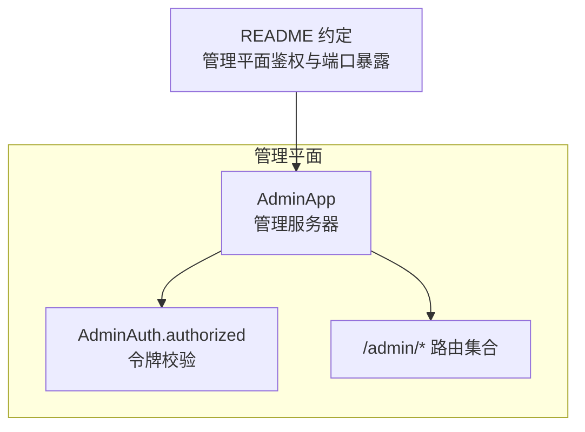
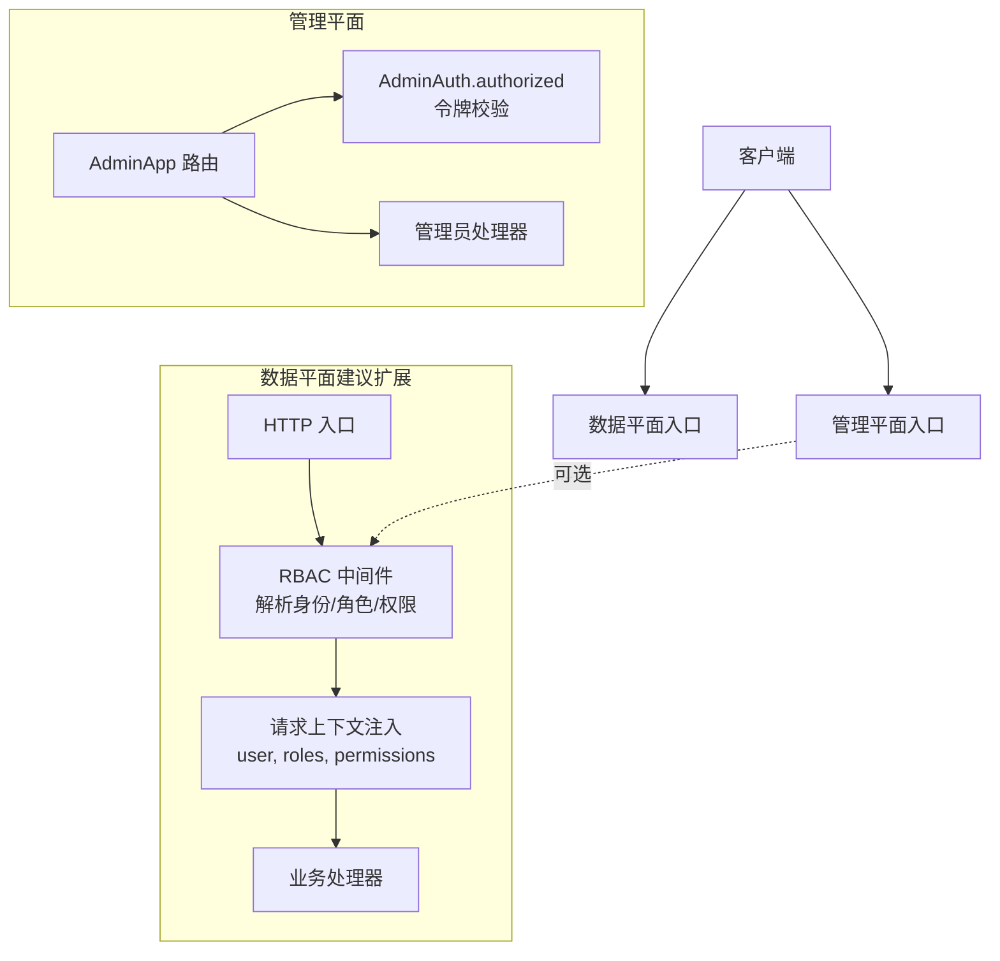
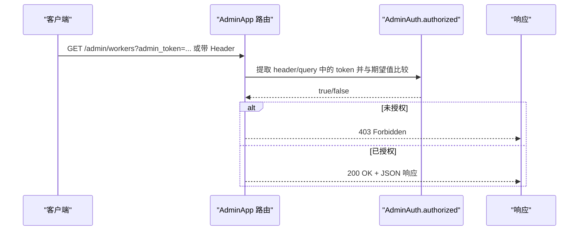
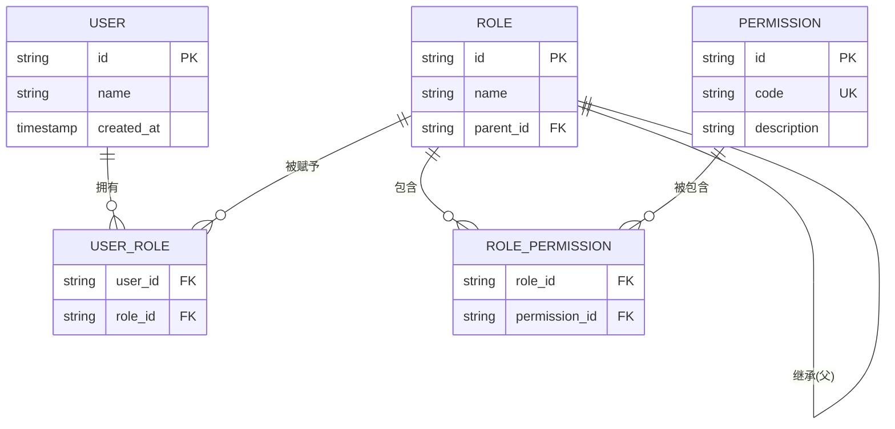
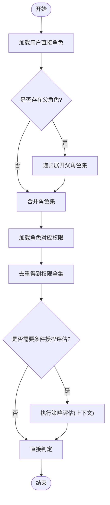
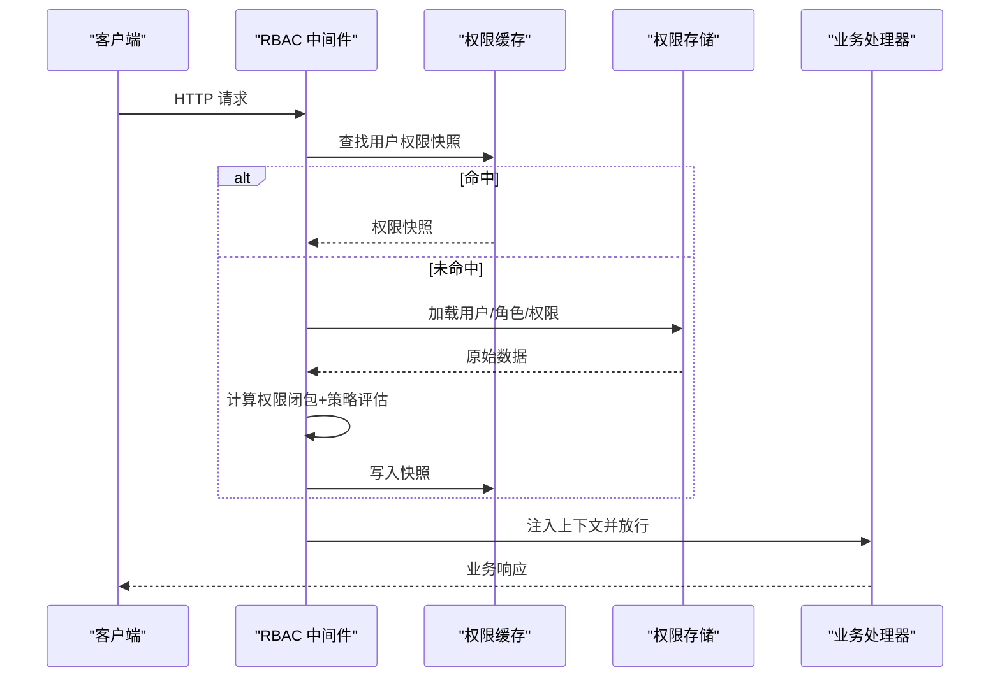

# 基于角色的访问控制

<cite>
**本文引用的文件**   
- [src/admin/types.v](file://src/admin/types.v)
- [src/admin_server.v](file://src/admin_server.v)
- [README.md](file://README.md)
</cite>

## 目录
1. [引言](#引言)
2. [项目结构](#项目结构)
3. [核心组件](#核心组件)
4. [架构总览](#架构总览)
5. [详细组件分析](#详细组件分析)
6. [依赖分析](#依赖分析)
7. [性能考虑](#性能考虑)
8. [故障排查指南](#故障排查指南)
9. [结论](#结论)
10. [附录](#附录)

## 引言
本文件面向在 vhttpd 中实现“基于角色的访问控制（RBAC）”的读者，目标是：
- 给出权限模型设计（用户、角色、权限的层次结构与关系映射）
- 提供角色继承机制的实现方案与动态权限检查、条件授权策略
- 说明权限缓存策略与性能优化方法
- 给出完整的权限检查中间件实现与 API 端点保护示例
- 提供权限审计日志与监控方案

需要特别说明的是：当前仓库已内置了管理平面的简单令牌鉴权能力（用于 /admin/* 接口），但并未包含通用的 RBAC 引擎。因此，本文在“现状”基础上，提出一套可落地的 RBAC 扩展方案，并给出与现有代码对接的最小改动路径。

## 项目结构
与 RBAC 相关的关键位置：
- 管理平面鉴权与路由：位于 admin 模块与管理服务器文件中
- 文档对管理平面鉴权行为有明确约定

图表来源
- [src/admin/types.v:129-139](file://src/admin/types.v#L129-L139)
- [src/admin_server.v:101-109](file://src/admin_server.v#L101-L109)
- [README.md:1187-1202](file://README.md#L1187-L1202)

章节来源
- [src/admin/types.v:129-139](file://src/admin/types.v#L129-L139)
- [src/admin_server.v:101-109](file://src/admin_server.v#L101-L109)
- [README.md:1187-1202](file://README.md#L1187-L1202)

## 核心组件
- AdminAuth 授权辅助：负责从请求头或查询参数中提取并校验管理令牌
- AdminApp 管理服务器：为每个受保护的 /admin/* 路由统一调用授权检查
- README 约定：描述当未配置令牌时开放管理端口；配置令牌后必须携带指定头部或查询参数，否则返回 403

章节来源
- [src/admin/types.v:129-139](file://src/admin/types.v#L129-L139)
- [src/admin_server.v:101-109](file://src/admin_server.v#L101-L109)
- [README.md:1187-1194](file://README.md#L1187-L1194)

## 架构总览
下图展示了“现状 + 建议扩展”的整体视图：管理平面已有令牌鉴权；建议在数据平面增加通用 RBAC 中间件，将用户上下文注入到请求上下文中，供业务逻辑进行细粒度授权判断。

[此图为概念性架构图，不直接映射具体源码文件，故无图表来源]

## 详细组件分析

### 现有管理平面鉴权（现状）
- 授权方式：支持通过请求头 x-vhttpd-admin-token 或查询参数 admin_token 传递令牌
- 行为约定：
  - 未设置令牌时，管理端口上的 /admin/* 开放
  - 设置令牌后，缺失或无效令牌返回 403
  - 管理端口启用时，数据平面不再提供 /admin/*（返回 404）

图表来源
- [src/admin/types.v:129-139](file://src/admin/types.v#L129-L139)
- [src/admin_server.v:101-109](file://src/admin_server.v#L101-L109)
- [README.md:1187-1194](file://README.md#L1187-L1194)

章节来源
- [src/admin/types.v:129-139](file://src/admin/types.v#L129-L139)
- [src/admin_server.v:101-109](file://src/admin_server.v#L101-L109)
- [README.md:1187-1194](file://README.md#L1187-L1194)

### RBAC 权限模型设计（建议）
- 实体与关系
  - 用户 User：唯一标识、基础属性
  - 角色 Role：一组权限集合，支持继承（父角色）
  - 权限 Permission：原子化资源操作（如 resource:action）
  - 会话 Session：承载用户登录态、角色快照、权限缓存键
- 层次结构
  - 用户 -> 多角色（多对多）
  - 角色 -> 多权限（多对多）
  - 角色 -> 父角色（自引用，形成继承树）
- 决策维度
  - 静态授权：用户是否拥有某权限（含继承）
  - 动态授权：结合上下文（时间、IP、资源标签等）的条件判断
  - 条件授权：表达式或策略规则（例如按租户、环境、风险等级）

[此图为概念性数据模型图，不直接映射具体源码文件，故无图表来源]

### 角色继承与权限计算（算法流程）
- 输入：用户 ID、目标权限码
- 步骤：
  1) 加载用户所有直接角色
  2) 递归展开角色继承树，得到完整角色集
  3) 合并角色对应的权限集合（去重）
  4) 若存在条件授权，结合上下文执行策略评估
  5) 输出允许/拒绝结果

[此图为概念性流程图，不直接映射具体源码文件，故无图表来源]

### 动态权限检查与条件授权（建议）
- 动态上下文：请求方法、路径、资源标识、租户、时间窗口、来源 IP、设备指纹等
- 条件授权策略：
  - 白名单/黑名单规则
  - 基于标签的资源匹配（如 project_id、env）
  - 风险评分阈值（高风险需二次审批）
- 实现要点：
  - 将策略以声明式配置或 DSL 表达
  - 使用轻量表达式引擎或规则表驱动
  - 将策略评估结果与静态权限结果做 AND/OR 组合

[本节为通用设计建议，不直接分析具体文件，故无章节来源]

### 权限缓存策略与性能优化（建议）
- 缓存层级
  - 进程内 LRU 缓存：用户-角色-权限闭包快照，TTL 短（秒级）
  - 分布式缓存（可选）：跨实例共享权限快照，适合水平扩展
- 失效策略
  - 写扩散：角色/权限变更时主动失效相关用户缓存
  - 读扩散：读取失败回源并回填
- 预取与预热
  - 登录成功后预取权限快照
  - 热点用户/角色提前构建
- 复杂度与权衡
  - 单次授权 O(R+P)，R 为角色数，P 为权限数
  - 缓存命中可将授权降至 O(1)

[本节为通用设计建议，不直接分析具体文件，故无章节来源]

### 权限检查中间件与 API 保护（建议）
- 中间件职责
  - 解析认证信息（JWT/OIDC/Session）
  - 加载用户角色与权限（优先缓存）
  - 执行条件授权策略
  - 将上下文注入到请求对象（user、roles、permissions、policy_result）
- 端点保护示例（概念）
  - 全局默认拒绝，显式标注允许
  - 路由级注解或装饰器声明所需权限
  - 资源级动态授权（如 /projects/:id 要求 owner 或 editor）

[此图为概念性序列图，不直接映射具体源码文件，故无图表来源]

### 权限审计日志与监控（建议）
- 审计事件
  - 认证成功/失败、授权成功/拒绝、策略评估结果、缓存命中率
- 指标
  - 授权延迟分布、拒绝率、缓存命中率、策略评估耗时
- 采集与告警
  - 结构化日志（trace_id、user_id、resource、permission、result）
  - 关键指标接入监控系统，设置拒绝率突增告警

[本节为通用设计建议，不直接分析具体文件，故无章节来源]

## 依赖分析
- 现有依赖
  - AdminApp 依赖 AdminAuth.authorized 完成管理平面鉴权
  - README 约定管理平面鉴权与端口暴露行为
- 扩展依赖（建议）
  - RBAC 中间件依赖：身份提供者、权限存储、策略引擎、缓存
  - 与现有 Admin 鉴权解耦，避免耦合管理平面与数据平面

图表来源
- [src/admin_server.v:101-109](file://src/admin_server.v#L101-L109)
- [src/admin/types.v:129-139](file://src/admin/types.v#L129-L139)
- [README.md:1187-1202](file://README.md#L1187-L1202)

章节来源
- [src/admin_server.v:101-109](file://src/admin_server.v#L101-L109)
- [src/admin/types.v:129-139](file://src/admin/types.v#L129-L139)
- [README.md:1187-1202](file://README.md#L1187-L1202)

## 性能考虑
- 最小化 I/O：优先走进程内缓存，必要时再访问外部存储
- 批量与批处理：批量加载用户/角色/权限，减少往返
- 惰性计算：仅在首次访问或缓存失效时计算权限闭包
- 分片与隔离：按租户或域划分缓存空间，降低冲突与锁竞争
- 降级策略：缓存不可用时快速失败或返回受限模式

[本节为通用设计建议，不直接分析具体文件，故无章节来源]

## 故障排查指南
- 常见现象
  - 管理接口返回 403：确认是否携带正确令牌或查询参数
  - 管理端口暴露异常：确认是否启用了独立管理端口
- 定位步骤
  - 检查请求头/查询参数是否符合约定
  - 核对服务端配置的令牌值
  - 查看管理端点的审计日志与错误响应体

章节来源
- [README.md:1187-1194](file://README.md#L1187-L1194)
- [README.md:1196-1202](file://README.md#L1196-L1202)

## 结论
- 现状：vhttpd 已在管理平面实现了简单的令牌鉴权，并通过 README 明确了行为约定
- 建议：在数据平面引入通用 RBAC 中间件，完善用户-角色-权限模型、角色继承、动态与条件授权、缓存与审计监控
- 收益：在不破坏现有管理平面鉴权的前提下，获得可扩展、高性能、可观测的企业级访问控制能力

[本节为总结性内容，不直接分析具体文件，故无章节来源]

## 附录
- 术语
  - 静态授权：仅基于用户-角色-权限关系的判定
  - 动态授权：结合运行时上下文进行判定
  - 条件授权：基于策略规则或表达式进行的附加判定
- 参考
  - 管理平面鉴权约定见 README 相关段落
  - 管理平面鉴权实现见 admin 模块与管理服务器文件

[本节为补充信息，不直接分析具体文件，故无章节来源]