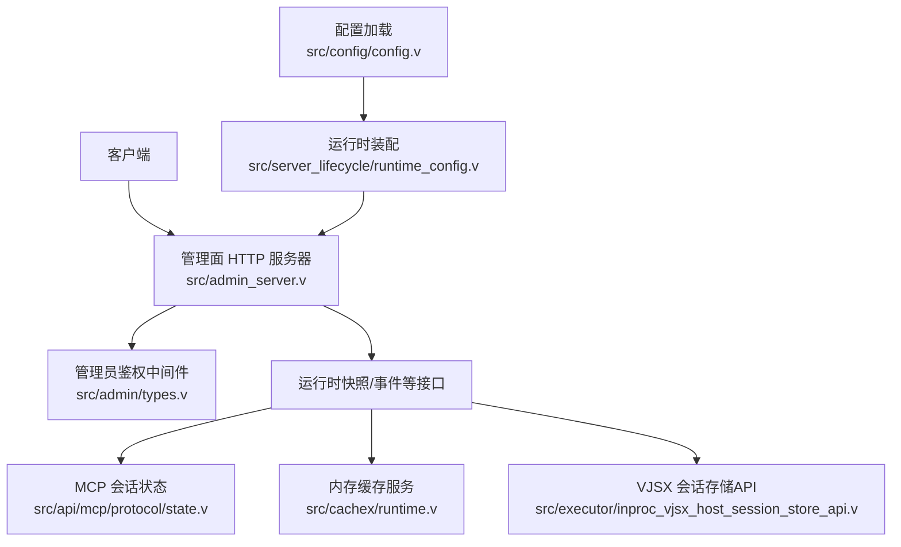
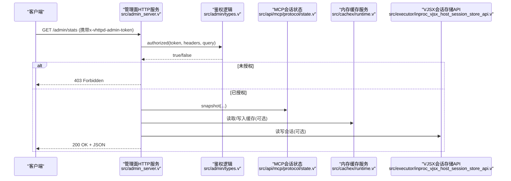
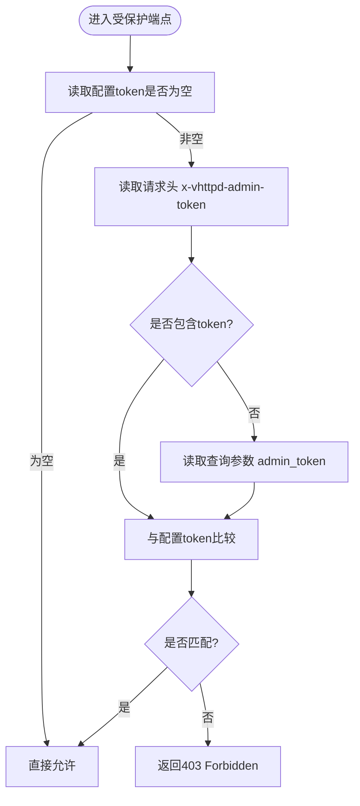
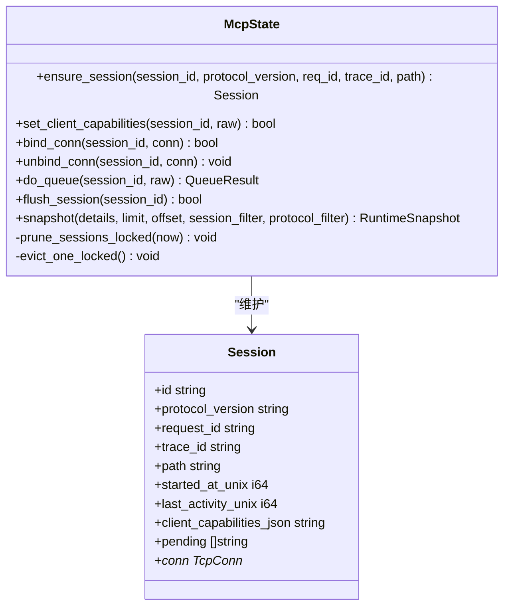
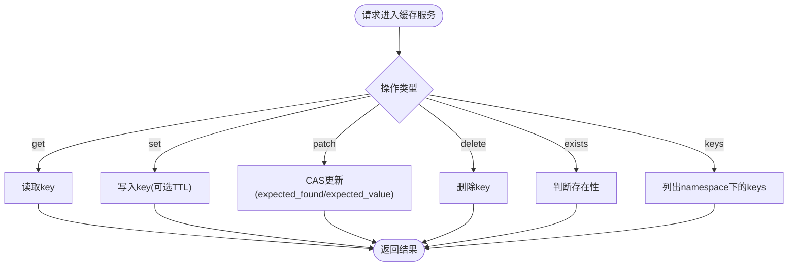
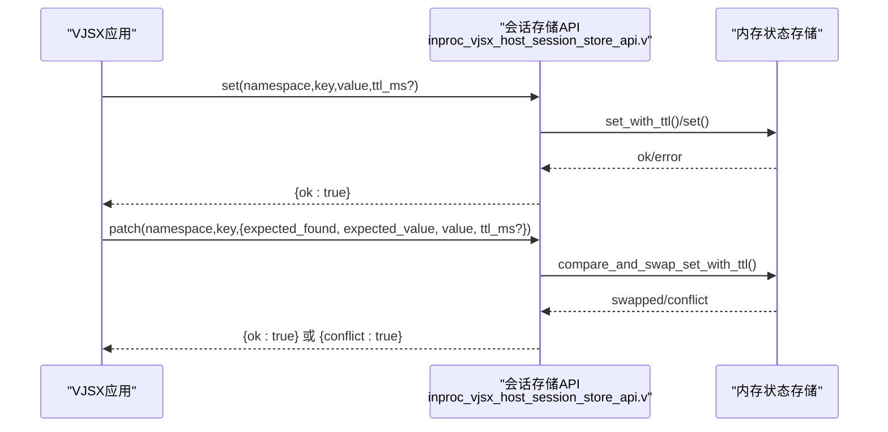
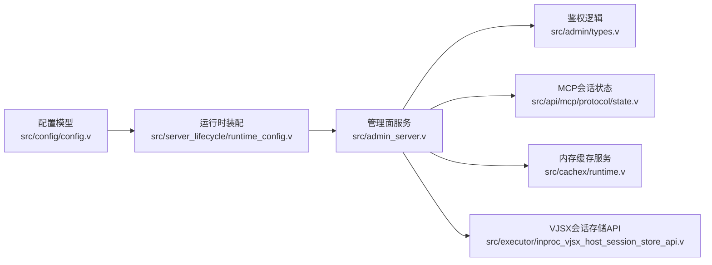

# 认证和授权

<cite>
**本文引用的文件**   
- [src/admin/types.v](file://src/admin/types.v)
- [src/admin_server.v](file://src/admin_server.v)
- [src/config/config.v](file://src/config/config.v)
- [src/server_lifecycle/runtime_config.v](file://src/server_lifecycle/runtime_config.v)
- [src/api/mcp/protocol/state.v](file://src/api/mcp/protocol/state.v)
- [src/cachex/runtime.v](file://src/cachex/runtime.v)
- [src/executor/inproc_vjsx_host_session_store_api.v](file://src/executor/inproc_vjsx_host_session_store_api.v)
- [README.md](file://README.md)
</cite>

## 目录
1. [简介](#简介)
2. [项目结构](#项目结构)
3. [核心组件](#核心组件)
4. [架构总览](#架构总览)
5. [详细组件分析](#详细组件分析)
6. [依赖关系分析](#依赖关系分析)
7. [性能考虑](#性能考虑)
8. [故障排查指南](#故障排查指南)
9. [结论](#结论)
10. [附录](#附录)

## 简介
本文件围绕 vhttpd 的认证与授权能力进行系统化说明，重点覆盖：
- 管理面访问控制（Admin Token）
- 会话安全管理（MCP 会话、缓存与会话存储）
- 并发控制与过期清理策略
- 基于角色的访问控制（RBAC）现状与建议
- API 密钥管理与第三方认证集成现状与建议
- JWT 令牌生成、验证与刷新机制的现状与建议

需要特别说明的是：当前仓库未实现 JWT 签名验证与刷新流程；管理面采用静态 Token 校验；会话管理集中在 MCP 协议状态与内存缓存/会话存储中。

## 项目结构
与认证和授权相关的核心位置如下：
- 管理面认证与路由：src/admin/types.v、src/admin_server.v
- 配置模型（含 MCP 会话参数）：src/config/config.v
- 运行时装配（Admin Token 注入）：src/server_lifecycle/runtime_config.v
- MCP 会话生命周期与清理：src/api/mcp/protocol/state.v
- 内存缓存服务（可用作会话/令牌缓存后端）：src/cachex/runtime.v
- 进程内 VJSX 应用会话存储接口（支持 TTL 与 CAS）：src/executor/inproc_vjsx_host_session_store_api.v
- 文档化 Admin Token 使用方式：README.md

图表来源
- [src/admin_server.v:101-109](file://src/admin_server.v#L101-L109)
- [src/admin/types.v:129-139](file://src/admin/types.v#L129-L139)
- [src/api/mcp/protocol/state.v:55-100](file://src/api/mcp/protocol/state.v#L55-L100)
- [src/cachex/runtime.v:24-70](file://src/cachex/runtime.v#L24-L70)
- [src/executor/inproc_vjsx_host_session_store_api.v:43-135](file://src/executor/inproc_vjsx_host_session_store_api.v#L43-L135)
- [src/config/config.v:132-179](file://src/config/config.v#L132-L179)
- [src/server_lifecycle/runtime_config.v:146-171](file://src/server_lifecycle/runtime_config.v#L146-L171)

章节来源
- [src/admin/types.v:129-139](file://src/admin/types.v#L129-L139)
- [src/admin_server.v:101-109](file://src/admin_server.v#L101-L109)
- [src/config/config.v:132-179](file://src/config/config.v#L132-L179)
- [src/server_lifecycle/runtime_config.v:146-171](file://src/server_lifecycle/runtime_config.v#L146-L171)
- [src/api/mcp/protocol/state.v:55-100](file://src/api/mcp/protocol/state.v#L55-L100)
- [src/cachex/runtime.v:24-70](file://src/cachex/runtime.v#L24-L70)
- [src/executor/inproc_vjsx_host_session_store_api.v:43-135](file://src/executor/inproc_vjsx_host_session_store_api.v#L43-L135)
- [README.md:1187-1221](file://README.md#L1187-L1221)

## 核心组件
- 管理面鉴权
  - 通过请求头 x-vhttpd-admin-token 或查询参数 admin_token 匹配配置的 token，缺失或不匹配返回 403。
  - 当未配置 token 时，管理端点开放（生产环境不建议）。
- MCP 会话管理
  - 提供会话创建、更新、连接绑定/解绑、消息队列与 flush、TTL 清理与容量驱逐。
- 内存缓存服务
  - 提供键值存取、TTL、CAS 操作，适合作为短期会话/令牌缓存后端。
- 进程内 VJSX 会话存储 API
  - 面向 VJSX 应用的 get/set/patch/delete/exists/keys 等原子操作，支持 TTL 与 compare-and-swap。

章节来源
- [src/admin/types.v:129-139](file://src/admin/types.v#L129-L139)
- [src/admin_server.v:101-109](file://src/admin_server.v#L101-L109)
- [src/api/mcp/protocol/state.v:55-100](file://src/api/mcp/protocol/state.v#L55-L100)
- [src/cachex/runtime.v:24-70](file://src/cachex/runtime.v#L24-L70)
- [src/executor/inproc_vjsx_host_session_store_api.v:43-135](file://src/executor/inproc_vjsx_host_session_store_api.v#L43-L135)

## 架构总览
下图展示管理面鉴权与数据面会话/缓存的关键交互路径。

图表来源
- [src/admin_server.v:101-109](file://src/admin_server.v#L101-L109)
- [src/admin/types.v:129-139](file://src/admin/types.v#L129-L139)
- [src/api/mcp/protocol/state.v:229-306](file://src/api/mcp/protocol/state.v#L229-L306)
- [src/cachex/runtime.v:24-70](file://src/cachex/runtime.v#L24-L70)
- [src/executor/inproc_vjsx_host_session_store_api.v:43-135](file://src/executor/inproc_vjsx_host_session_store_api.v#L43-L135)

## 详细组件分析

### 管理面鉴权（Admin Token）
- 鉴权入口
  - 管理面每个受保护端点在调用前均会检查 admin_authorized()，其内部委托给 AdminAuth.authorized()。
- 校验规则
  - 若配置 token 为空，则放行（仅用于开发）。
  - 否则从请求头 x-vhttpd-admin-token 或查询参数 admin_token 取值并严格相等比较。
- 错误响应
  - 未通过鉴权的请求统一返回 403 Forbidden。

图表来源
- [src/admin/types.v:129-139](file://src/admin/types.v#L129-L139)
- [src/admin_server.v:101-109](file://src/admin_server.v#L101-L109)

章节来源
- [src/admin/types.v:129-139](file://src/admin/types.v#L129-L139)
- [src/admin_server.v:101-109](file://src/admin_server.v#L101-L109)
- [README.md:1187-1221](file://README.md#L1187-L1221)

### MCP 会话生命周期与并发控制
- 会话创建与更新
  - ensure_session 在互斥锁保护下创建或更新会话，记录协议版本、请求ID、追踪ID、路径及活动时间。
- 连接绑定/解绑
  - bind_conn/unbind_conn 将 TCP 连接与会话关联，便于后续 flush 推送。
- 消息队列与限流
  - do_queue 追加待发送消息，超过 max_pending_messages 时丢弃最旧的部分。
- 过期清理与容量驱逐
  - prune_sessions_locked 按 session_ttl_seconds 清理过期会话。
  - evict_one_locked 在达到 max_sessions 上限时驱逐最久未活动的会话。
- 快照与过滤
  - snapshot 支持分页、过滤（session_id、protocol_version），并可返回详细列表。

图表来源
- [src/api/mcp/protocol/state.v:55-100](file://src/api/mcp/protocol/state.v#L55-L100)
- [src/api/mcp/protocol/state.v:102-151](file://src/api/mcp/protocol/state.v#L102-L151)
- [src/api/mcp/protocol/state.v:170-225](file://src/api/mcp/protocol/state.v#L170-L225)
- [src/api/mcp/protocol/state.v:229-306](file://src/api/mcp/protocol/state.v#L229-L306)
- [src/api/mcp/protocol/state.v:8-53](file://src/api/mcp/protocol/state.v#L8-L53)

章节来源
- [src/api/mcp/protocol/state.v:55-100](file://src/api/mcp/protocol/state.v#L55-L100)
- [src/api/mcp/protocol/state.v:170-225](file://src/api/mcp/protocol/state.v#L170-L225)
- [src/api/mcp/protocol/state.v:229-306](file://src/api/mcp/protocol/state.v#L229-L306)
- [src/api/mcp/protocol/state.v:8-53](file://src/api/mcp/protocol/state.v#L8-L53)

### 内存缓存服务（可作为会话/令牌缓存后端）
- 能力概览
  - 提供 enable/disable、Unix Socket 暴露、统计信息、以及 get/set/patch/delete/exists/keys 等操作。
  - patch 支持 compare-and-swap（CAS），可用于并发安全地更新会话或令牌。
- 适用场景
  - 作为短期令牌缓存、会话状态缓存、速率限制计数器等。

图表来源
- [src/cachex/runtime.v:24-70](file://src/cachex/runtime.v#L24-L70)

章节来源
- [src/cachex/runtime.v:24-70](file://src/cachex/runtime.v#L24-L70)

### 进程内 VJSX 会话存储 API（支持 TTL 与 CAS）
- 能力概览
  - 面向 VJSX 应用暴露 get/set/patch/delete/exists/keys 等接口。
  - set 支持 TTL；patch 支持 compare-and-swap（expected_found/expected_value），失败返回冲突。
- 适用场景
  - 应用级会话状态、分布式锁、短生命周期令牌缓存等。

图表来源
- [src/executor/inproc_vjsx_host_session_store_api.v:43-135](file://src/executor/inproc_vjsx_host_session_store_api.v#L43-L135)

章节来源
- [src/executor/inproc_vjsx_host_session_store_api.v:43-135](file://src/executor/inproc_vjsx_host_session_store_api.v#L43-L135)

## 依赖关系分析
- 配置到运行时的传递
  - AdminConfig.host/port/token 由配置层定义，并在运行时装配阶段注入到管理面服务。
- 管理面与子系统
  - 管理面通过共享对象访问 MCP 会话快照、缓存服务、VJSX 会话存储等。

图表来源
- [src/config/config.v:132-179](file://src/config/config.v#L132-L179)
- [src/server_lifecycle/runtime_config.v:146-171](file://src/server_lifecycle/runtime_config.v#L146-L171)
- [src/admin_server.v:101-109](file://src/admin_server.v#L101-L109)
- [src/admin/types.v:129-139](file://src/admin/types.v#L129-L139)
- [src/api/mcp/protocol/state.v:229-306](file://src/api/mcp/protocol/state.v#L229-L306)
- [src/cachex/runtime.v:24-70](file://src/cachex/runtime.v#L24-L70)
- [src/executor/inproc_vjsx_host_session_store_api.v:43-135](file://src/executor/inproc_vjsx_host_session_store_api.v#L43-L135)

章节来源
- [src/config/config.v:132-179](file://src/config/config.v#L132-L179)
- [src/server_lifecycle/runtime_config.v:146-171](file://src/server_lifecycle/runtime_config.v#L146-L171)
- [src/admin_server.v:101-109](file://src/admin_server.v#L101-L109)
- [src/admin/types.v:129-139](file://src/admin/types.v#L129-L139)

## 性能考虑
- MCP 会话清理与驱逐
  - 定期清理过期会话与容量驱逐可避免内存增长；建议根据业务负载调整 max_sessions、max_pending_messages、session_ttl_seconds。
- 管理面高并发
  - 管理面接口多为只读快照，注意在高并发下减少锁竞争；必要时对只读聚合方法引入读锁优化（参考重构计划中的建议）。
- 缓存与存储
  - 使用 CAS 操作保证并发安全更新，避免竞态条件导致的脏写。

[本节为通用指导，不直接分析具体文件]

## 故障排查指南
- 403 未授权
  - 确认是否配置了 admin token；若未配置，管理端点默认开放（仅开发环境）。
  - 检查请求头 x-vhttpd-admin-token 或查询参数 admin_token 是否与配置一致。
- MCP 会话异常
  - 检查是否达到 max_sessions 导致被驱逐；观察 last_activity_unix 与 started_at_unix 差异。
  - 关注 pending 队列长度是否超过 max_pending_messages，必要时增大上限或优化消费速度。
- 缓存/CAS 冲突
  - patch 操作返回 conflict 表示期望值不匹配，需重试或重新读取最新值后再次尝试。

章节来源
- [README.md:1187-1221](file://README.md#L1187-L1221)
- [src/api/mcp/protocol/state.v:8-53](file://src/api/mcp/protocol/state.v#L8-L53)
- [src/api/mcp/protocol/state.v:170-225](file://src/api/mcp/protocol/state.v#L170-L225)
- [src/executor/inproc_vjsx_host_session_store_api.v:73-100](file://src/executor/inproc_vjsx_host_session_store_api.v#L73-L100)

## 结论
- 当前系统提供了完善的管理面 Token 鉴权与 MCP 会话管理能力，具备基础的并发控制与过期清理机制。
- 尚未实现 JWT 签名验证与刷新流程；如需无状态令牌方案，可在现有缓存与会话存储基础上扩展。
- RBAC 尚未内置，建议在应用层或网关层实现角色与权限模型，并结合管理面进行动态下发与校验。
- API 密钥与 OAuth 集成目前未见原生实现，可按需接入外部认证提供商并通过缓存/会话存储持久化短期凭据。

[本节为总结性内容，不直接分析具体文件]

## 附录

### 现状与范围说明
- JWT 令牌
  - 未发现 JWT 生成、验签与刷新相关实现。建议以缓存/会话存储为支撑，结合上游认证服务完成签发与校验。
- 会话安全管理
  - MCP 会话：提供 TTL 清理、容量驱逐、消息队列与 flush。
  - 缓存与会话存储：提供 CAS 与 TTL，适合短期凭据与会话状态。
- 并发控制
  - 关键路径使用互斥锁保护；CAS 保障并发安全更新。
- RBAC
  - 未发现内置 RBAC 实现；建议基于角色与资源映射在应用层实现动态权限检查。
- API 密钥与 OAuth
  - 未发现原生实现；可通过管理面或配置中心下发密钥，OAuth 回调结果可存入缓存/会话存储。

[本节为概念性补充，不直接分析具体文件]