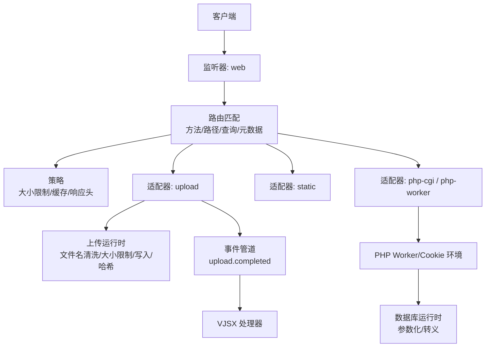
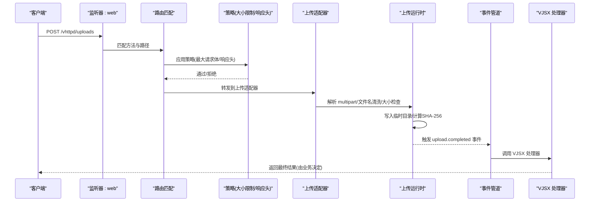
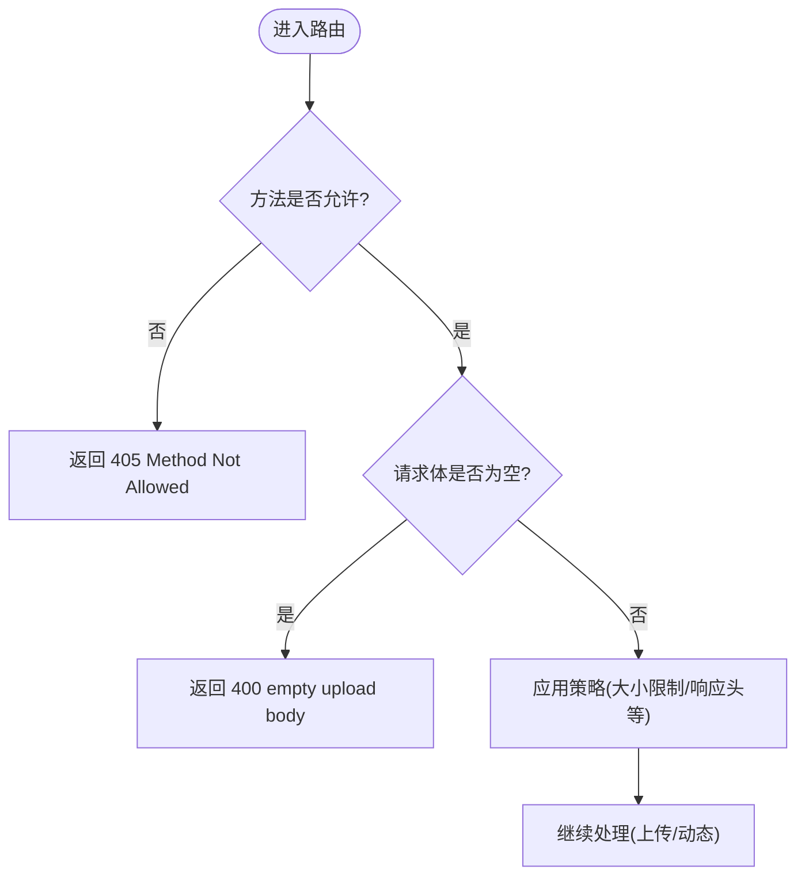
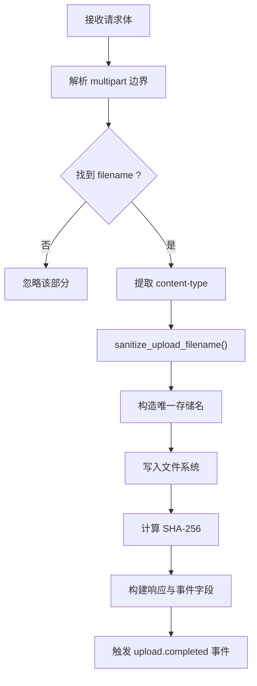
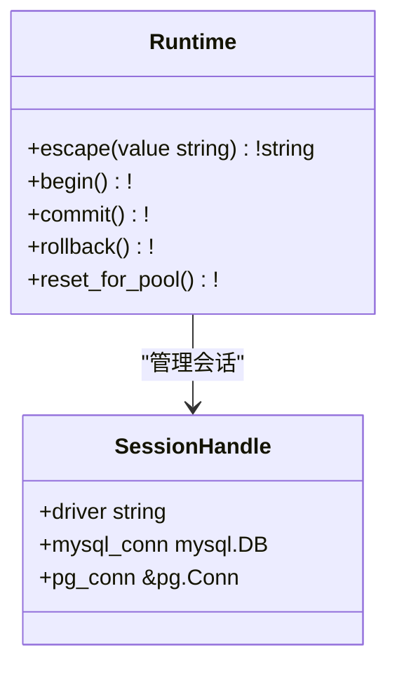
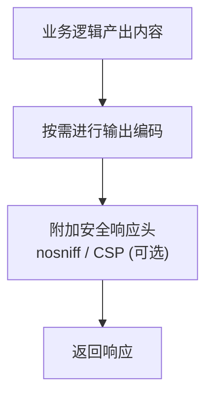
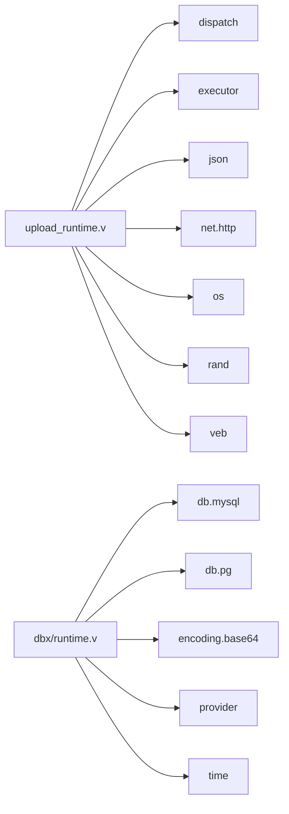

# 输入验证和过滤

<cite>
**本文引用的文件**   
- [src/upload_runtime.v](file://src/upload_runtime.v)
- [src/dbx/runtime.v](file://src/dbx/runtime.v)
- [examples/wordpress/vhttpd-v2.toml](file://examples/wordpress/vhttpd-v2.toml)
- [src/dispatch/http.v](file://src/dispatch/http.v)
- [src/inproc_vjsx_http_facade.js](file://src/inproc_vjsx_http_facade.js)
- [src/route_rule_test.v](file://src/route_rule_test.v)
</cite>

## 目录
1. [简介](#简介)
2. [项目结构](#项目结构)
3. [核心组件](#核心组件)
4. [架构总览](#架构总览)
5. [详细组件分析](#详细组件分析)
6. [依赖关系分析](#依赖关系分析)
7. [性能考量](#性能考量)
8. [故障排查指南](#故障排查指南)
9. [结论](#结论)
10. [附录](#附录)

## 简介
本指南聚焦 VHTTPD 的输入验证与过滤能力，覆盖以下关键主题：
- HTTP 请求参数校验（方法、路径、查询、头部）
- 文件上传安全验证（文件名清洗、大小限制、MIME 解析、完整性校验）
- SQL 注入防护（参数化查询与转义接口）
- XSS 防护（输出编码建议、CSP 配置建议）
- 命令注入防护（系统命令执行的安全限制）
- 在 PHP Worker 与 VJSX 执行器中的安全输入处理实践

为便于落地，文档提供代码级流程图与时序图，并给出可追溯的文件来源。

## 项目结构
VHTTPD 将“路由匹配—策略—适配器—执行器”解耦，输入验证贯穿多个层次：
- 路由层：按方法、路径、查询、元数据进行匹配与拦截
- 策略层：统一施加大小限制、缓存控制、响应头加固等
- 适配器层：针对上传、静态资源、PHP 引擎等专用处理
- 执行器层：PHP Worker、VJSX 事件处理器、数据库运行时等

图表来源
- [examples/wordpress/vhttpd-v2.toml:196-213](file://examples/wordpress/vhttpd-v2.toml#L196-L213)
- [src/upload_runtime.v:276-356](file://src/upload_runtime.v#L276-L356)
- [src/dispatch/http.v:1-55](file://src/dispatch/http.v#L1-L55)

章节来源
- [examples/wordpress/vhttpd-v2.toml:1-120](file://examples/wordpress/vhttpd-v2.toml#L1-L120)
- [src/dispatch/http.v:1-55](file://src/dispatch/http.v#L1-L55)

## 核心组件
- 上传运行时：负责 multipart/form-data 解析、文件名清洗、大小限制、落盘与 SHA-256 校验、完成事件派发。
- 数据库运行时：提供参数化查询与字符串转义接口，避免拼接 SQL。
- 路由与策略：通过配置声明式地限制请求体大小、设置响应头（如 nosniff）、拒绝危险路径。
- VJSX 宿主 API：向 JS 侧暴露受限的宿主能力，避免直接访问系统命令或不受控 I/O。

章节来源
- [src/upload_runtime.v:33-131](file://src/upload_runtime.v#L33-L131)
- [src/dbx/runtime.v:708-720](file://src/dbx/runtime.v#L708-L720)
- [examples/wordpress/vhttpd-v2.toml:141-184](file://examples/wordpress/vhttpd-v2.toml#L141-L184)
- [src/inproc_vjsx_host_api.v:18-47](file://src/inproc_vjsx_host_api.v#L18-L47)

## 架构总览
下图展示一次上传请求从入站到完成回调的关键流程，体现输入验证与安全控制的落点。

图表来源
- [examples/wordpress/vhttpd-v2.toml:196-213](file://examples/wordpress/vhttpd-v2.toml#L196-L213)
- [src/upload_runtime.v:276-356](file://src/upload_runtime.v#L276-L356)

## 详细组件分析

### HTTP 请求参数校验
- 方法校验：上传路由仅允许 POST/PUT，其他方法将被拒绝。
- 路径与查询：通过路由规则精确匹配；REST 场景下通过查询参数路由至入口脚本。
- 头部规范化：内部以标准化小写键名访问，避免大小写绕过。
- 策略限制：对请求体大小进行上限控制，防止超大负载。

图表来源
- [src/upload_runtime.v:276-288](file://src/upload_runtime.v#L276-L288)
- [src/dispatch/http.v:48-54](file://src/dispatch/http.v#L48-L54)
- [examples/wordpress/vhttpd-v2.toml:141-145](file://examples/wordpress/vhttpd-v2.toml#L141-L145)

章节来源
- [src/upload_runtime.v:276-288](file://src/upload_runtime.v#L276-L288)
- [src/dispatch/http.v:1-55](file://src/dispatch/http.v#L1-L55)
- [examples/wordpress/vhttpd-v2.toml:141-184](file://examples/wordpress/vhttpd-v2.toml#L141-L184)

### 文件上传安全验证
- 多部分解析：解析 Content-Type 边界与每个部分的 Content-Disposition/Content-Type。
- 文件名清洗：仅保留字母数字及有限符号，去除首尾点号，非法字符替换为下划线，空名回退默认值。
- 大小限制：通过策略 max_body_bytes 限制请求体大小。
- 完整性校验：计算 SHA-256 摘要，便于后续审计与去重。
- 存储隔离：使用独立根目录与唯一前缀命名，避免覆盖与路径穿越。
- 完成事件：生成结构化字段并通过事件管道分发，供 VJSX 处理器消费。

图表来源
- [src/upload_runtime.v:80-131](file://src/upload_runtime.v#L80-L131)
- [src/upload_runtime.v:33-49](file://src/upload_runtime.v#L33-L49)
- [src/upload_runtime.v:311-356](file://src/upload_runtime.v#L311-L356)

章节来源
- [src/upload_runtime.v:80-131](file://src/upload_runtime.v#L80-L131)
- [src/upload_runtime.v:33-49](file://src/upload_runtime.v#L33-L49)
- [src/upload_runtime.v:311-356](file://src/upload_runtime.v#L311-L356)
- [examples/wordpress/vhttpd-v2.toml:126-132](file://examples/wordpress/vhttpd-v2.toml#L126-L132)

### SQL 注入防护实现
- 参数化查询：优先使用驱动提供的参数化接口，避免字符串拼接。
- 转义接口：当必须拼接时，使用运行时提供的 escape 方法对值进行转义。
- 连接池与会话：复用会话并在必要时重置状态，降低跨请求污染风险。

图表来源
- [src/dbx/runtime.v:708-720](file://src/dbx/runtime.v#L708-L720)
- [src/dbx/runtime.v:638-706](file://src/dbx/runtime.v#L638-L706)

章节来源
- [src/dbx/runtime.v:708-720](file://src/dbx/runtime.v#L708-L720)
- [src/dbx/runtime.v:638-706](file://src/dbx/runtime.v#L638-L706)

### XSS 攻击防护措施
- 输出编码（建议）：在渲染 HTML 时对用户可控内容进行实体编码；JSON 输出确保正确的 Content-Type 与 charset。
- 内容安全策略 CSP（建议）：在策略中注入 CSP 响应头，限制脚本来源与执行上下文。
- 类型嗅探防护：通过 X-Content-Type-Options: nosniff 禁止浏览器 MIME 嗅探。

[此图为概念性说明，不直接映射具体源码]

章节来源
- [examples/wordpress/vhttpd-v2.toml:176-184](file://examples/wordpress/vhttpd-v2.toml#L176-L184)

### 命令注入防护方案
- 宿主能力最小化：VJSX 宿主 API 仅提供必要能力（如 emit、snapshot、sessionStore、config、readTextFile、httpFetch 等），不暴露系统命令执行接口。
- 执行器模式限制：在特定运行模式下关闭不必要的功能（如 worker 自动启动、流/WS/MCP 工作模式），减少攻击面。
- 沙箱与策略：通过配置限制网络、文件系统访问范围，结合事件与调度机制进行白名单控制。

章节来源
- [src/inproc_vjsx_host_api.v:18-47](file://src/inproc_vjsx_host_api.v#L18-L47)
- [src/inproc_vjsx_host_api.v:49-58](file://src/inproc_vjsx_host_api.v#L49-L58)
- [docs/INPROC_VJSX_RUNBOOK.md:87-92](file://docs/INPROC_VJSX_RUNBOOK.md#L87-L92)

### PHP Worker 中的安全输入处理
- 环境变量注入：通过引擎 env 注入站点根、数据库 socket、缓存 socket、scheme 等，避免在应用中硬编码敏感信息。
- 拒绝/兼容列表：通过 deny_php 与 compat_php 限制可执行的 PHP 入口，缩小攻击面。
- 路由与策略：对动态页面与 REST 入口分别应用大小限制与缓存策略，确保一致性。

章节来源
- [examples/wordpress/vhttpd-v2.toml:63-99](file://examples/wordpress/vhttpd-v2.toml#L63-L99)
- [examples/wordpress/vhttpd-v2.toml:73-76](file://examples/wordpress/vhttpd-v2.toml#L73-L76)
- [examples/wordpress/vhttpd-v2.toml:352-376](file://examples/wordpress/vhttpd-v2.toml#L352-L376)

### VJSX 执行器中的安全输入处理
- 宿主 API 安装：在 VJSX 上下文中安装 vhttpdHost，暴露受限能力。
- HTTP 门面：在 JS 侧提供标准化的 request/response 对象，包含 method/path/url/target/href 等，便于在业务层做二次校验。
- 事件驱动：上传完成后通过事件管道调用 VJSX 处理器，所有输入均经过上游清洗与策略限制。

章节来源
- [src/inproc_vjsx_host_api.v:18-47](file://src/inproc_vjsx_host_api.v#L18-L47)
- [src/inproc_vjsx_http_facade.js:570-619](file://src/inproc_vjsx_http_facade.js#L570-L619)
- [src/upload_runtime.v:248-274](file://src/upload_runtime.v#L248-L274)

## 依赖关系分析
- 上传运行时依赖：dispatch、executor、json、net.http、os、rand、veb。
- 数据库运行时依赖：db.mysql、db.pg、encoding.base64、json、net.unix、provider、time。
- 路由与策略依赖：基于配置的声明式匹配与策略组合，影响各适配器的行为。

图表来源
- [src/upload_runtime.v:1-11](file://src/upload_runtime.v#L1-L11)
- [src/dbx/runtime.v:1-13](file://src/dbx/runtime.v#L1-L13)

章节来源
- [src/upload_runtime.v:1-11](file://src/upload_runtime.v#L1-L11)
- [src/dbx/runtime.v:1-13](file://src/dbx/runtime.v#L1-L13)

## 性能考量
- 上传路径：大文件写入与哈希计算会占用 CPU 与磁盘 IO，建议合理设置 max_body_bytes 与存储目录所在磁盘。
- 数据库连接池：复用连接与空闲探测可减少握手开销，但需平衡 idle_ping_ms 与连接数。
- 策略命中顺序：将高频匹配的路由置于靠前位置，减少正则匹配成本。

[本节为通用指导，不直接分析具体文件]

## 故障排查指南
- 上传失败：检查上传目录是否存在且可写、max_body_bytes 是否过小、文件名是否被清洗为空导致回退默认名。
- 事件未触发：确认 completed_pipeline 与 transform 引用是否正确，观察 upload.completed 事件日志。
- 数据库错误：查看慢查询与最近查询快照，确认参数化与转义是否正确使用。
- 响应头缺失：确认策略 nosniff 与 CSP 是否已挂载到对应 pipeline。

章节来源
- [src/upload_runtime.v:294-310](file://src/upload_runtime.v#L294-L310)
- [src/upload_runtime.v:341-356](file://src/upload_runtime.v#L341-L356)
- [src/dbx/runtime.v:188-227](file://src/dbx/runtime.v#L188-L227)
- [examples/wordpress/vhttpd-v2.toml:176-184](file://examples/wordpress/vhttpd-v2.toml#L176-L184)

## 结论
VHTTPD 在路由、策略、适配器与执行器多层协同下，提供了完善的输入验证与过滤能力。通过严格的文件名清洗、大小限制、SQL 参数化与转义、以及最小化的宿主 API，有效降低了常见 Web 安全风险。建议在业务层配合输出编码与 CSP 策略，进一步加固前端安全。

## 附录
- 参考示例配置：WordPress 场景下的上传、静态资源、REST 路由与安全策略。
- 测试用例要点：上传完成事件路径与响应头大小写无关性验证。

章节来源
- [examples/wordpress/vhttpd-v2.toml:196-213](file://examples/wordpress/vhttpd-v2.toml#L196-L213)
- [src/route_rule_test.v:388-396](file://src/route_rule_test.v#L388-L396)
- [src/route_rule_test.v:398-406](file://src/route_rule_test.v#L398-L406)