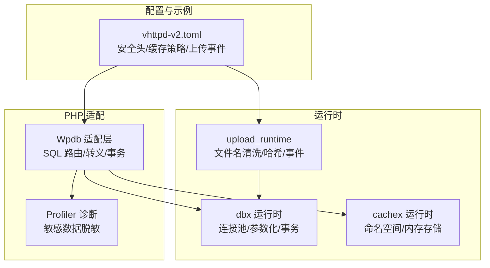
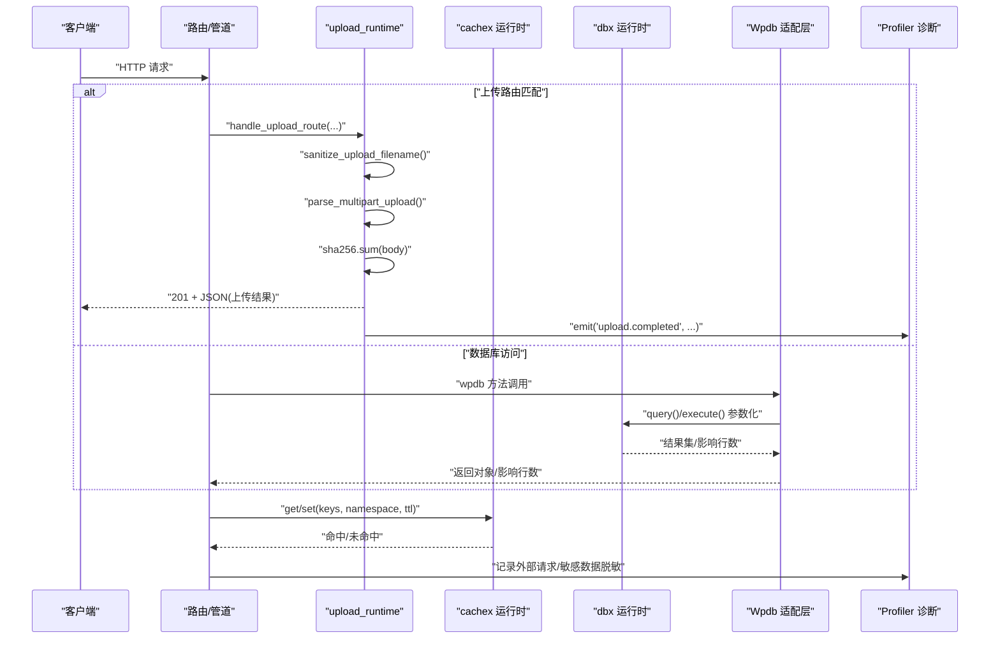
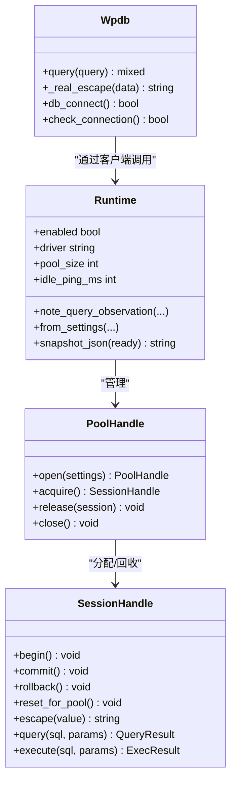
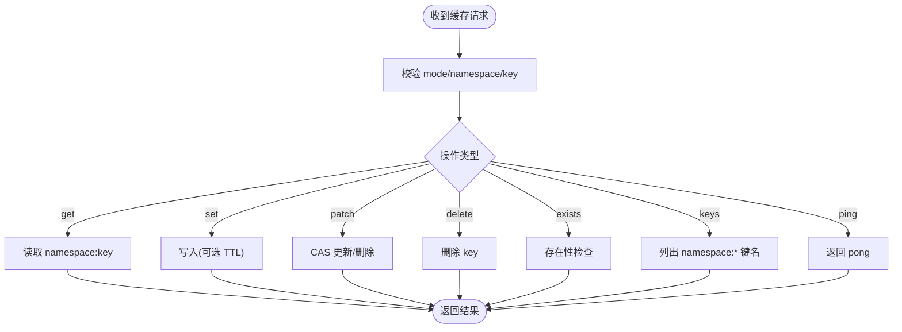
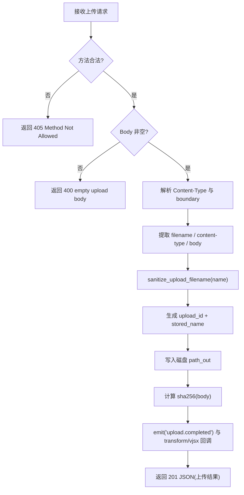
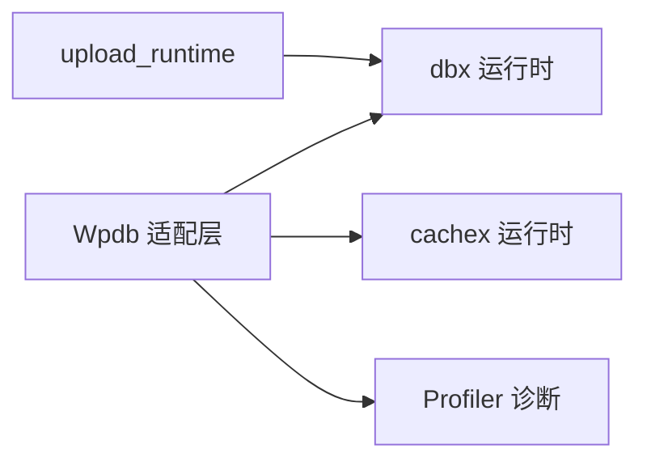

# 数据安全保护

<cite>
**本文引用的文件**   
- [src/dbx/runtime.v](file://src/dbx/runtime.v)
- [php/package/src/VHttpd/WordPress/Wpdb.php](file://php/package/src/VHttpd/WordPress/Wpdb.php)
- [src/cachex/runtime.v](file://src/cachex/runtime.v)
- [src/upload_runtime.v](file://src/upload_runtime.v)
- [php/package/src/VHttpd/WordPress/Profiler.php](file://php/package/src/VHttpd/WordPress/Profiler.php)
- [examples/wordpress/vhttpd-v2.toml](file://examples/wordpress/vhttpd-v2.toml)
- [tests/e2e/config_acceptance_test.sh](file://tests/e2e/config_acceptance_test.sh)
</cite>

## 目录
1. [简介](#简介)
2. [项目结构](#项目结构)
3. [核心组件](#核心组件)
4. [架构总览](#架构总览)
5. [详细组件分析](#详细组件分析)
6. [依赖关系分析](#依赖关系分析)
7. [性能与安全权衡](#性能与安全权衡)
8. [故障排查指南](#故障排查指南)
9. [结论](#结论)
10. [附录：配置与最佳实践清单](#附录配置与最佳实践清单)

## 简介
本指南围绕 vhttpd 的数据安全保护，聚焦以下方面：
- 数据库连接安全配置（连接池、参数化查询、会话隔离）
- SQL 查询安全（参数绑定、标识符校验、错误信息脱敏）
- 敏感数据加密存储与传输（应用层建议与实现要点）
- 缓存系统安全（命名空间隔离、内存安全、失效策略）
- 文件上传安全（类型验证、大小限制、路径遍历防护）
- 日志脱敏与可观测性（请求头、Cookie、URL 参数等）
- 备份与恢复的安全加固（加密、权限控制）

## 项目结构
与数据安全相关的核心模块分布如下：
- 数据库运行时与 PHP 适配层：dbx 运行时 + WordPress Wpdb 适配
- 缓存运行时：cachex 运行时（Unix Socket + 内存状态存储）
- 文件上传处理：upload_runtime
- 日志与诊断：WordPress Profiler（含敏感字段脱敏）
- 示例配置：WordPress v2 配置片段（包含响应头、缓存策略、上传事件）

图表来源
- [src/dbx/runtime.v:1-200](file://src/dbx/runtime.v#L1-L200)
- [src/cachex/runtime.v:1-120](file://src/cachex/runtime.v#L1-L120)
- [src/upload_runtime.v:1-120](file://src/upload_runtime.v#L1-L120)
- [php/package/src/VHttpd/WordPress/Wpdb.php:1-120](file://php/package/src/VHttpd/WordPress/Wpdb.php#L1-L120)
- [php/package/src/VHttpd/WordPress/Profiler.php:560-600](file://php/package/src/VHttpd/WordPress/Profiler.php#L560-L600)
- [examples/wordpress/vhttpd-v2.toml:150-194](file://examples/wordpress/vhttpd-v2.toml#L150-L194)

章节来源
- [src/dbx/runtime.v:1-200](file://src/dbx/runtime.v#L1-L200)
- [src/cachex/runtime.v:1-120](file://src/cachex/runtime.v#L1-L120)
- [src/upload_runtime.v:1-120](file://src/upload_runtime.v#L1-L120)
- [php/package/src/VHttpd/WordPress/Wpdb.php:1-120](file://php/package/src/VHttpd/WordPress/Wpdb.php#L1-L120)
- [php/package/src/VHttpd/WordPress/Profiler.php:560-600](file://php/package/src/VHttpd/WordPress/Profiler.php#L560-L600)
- [examples/wordpress/vhttpd-v2.toml:150-194](file://examples/wordpress/vhttpd-v2.toml#L150-L194)

## 核心组件
- 数据库运行时（dbx）
  - 提供 MySQL/PostgreSQL 驱动抽象、连接池、事务、参数化执行、慢查询观察、最近查询记录。
  - 支持空闲连接保活 ping、初始化 SQL 注入、会话级隔离。
- WordPress Wpdb 适配层
  - 将 wpdb 调用路由到 dbx 运行时；对标识符进行白名单校验；通过客户端 escape 接口转义；封装事务 begin/commit/rollback。
- 缓存运行时（cachex）
  - 基于 Unix Socket 的进程内内存缓存；按命名空间隔离键；支持 TTL、CAS 操作、keys 扫描。
- 文件上传处理（upload_runtime）
  - 解析 multipart/form-data 或自定义头部；严格清洗文件名；计算 SHA256；触发 upload.completed 事件。
- 诊断与脱敏（Profiler）
  - 收集外部 HTTP 请求、SQL 调用栈、插件统计；对 URL 查询参数、Cookie、POST 等敏感数据进行脱敏。

章节来源
- [src/dbx/runtime.v:1-200](file://src/dbx/runtime.v#L1-L200)
- [src/dbx/runtime.v:800-900](file://src/dbx/runtime.v#L800-L900)
- [php/package/src/VHttpd/WordPress/Wpdb.php:150-220](file://php/package/src/VHttpd/WordPress/Wpdb.php#L150-L220)
- [src/cachex/runtime.v:180-276](file://src/cachex/runtime.v#L180-L276)
- [src/upload_runtime.v:33-118](file://src/upload_runtime.v#L33-L118)
- [php/package/src/VHttpd/WordPress/Profiler.php:560-600](file://php/package/src/VHttpd/WordPress/Profiler.php#L560-L600)

## 架构总览
下图展示了从 Web 请求到数据库、缓存、上传处理的端到端流程，以及安全控制点。

图表来源
- [src/upload_runtime.v:276-357](file://src/upload_runtime.v#L276-L357)
- [src/dbx/runtime.v:808-902](file://src/dbx/runtime.v#L808-L902)
- [php/package/src/VHttpd/WordPress/Wpdb.php:198-253](file://php/package/src/VHttpd/WordPress/Wpdb.php#L198-L253)
- [src/cachex/runtime.v:194-276](file://src/cachex/runtime.v#L194-L276)
- [php/package/src/VHttpd/WordPress/Profiler.php:200-259](file://php/package/src/VHttpd/WordPress/Profiler.php#L200-L259)

## 详细组件分析

### 数据库连接与查询安全
- 连接池与驱动能力
  - 支持 MySQL 与 PostgreSQL；具备连接池、事务、参数化、预编译、保存点能力。
  - 空闲连接保活：MySQL 支持 idle_ping_ms 检测并重建连接；PostgreSQL 使用原生池管理。
- 参数化与转义
  - 查询与执行均优先使用参数化；无参时走直接执行路径。
  - 提供 escape 接口用于标识符与字符串转义；Wpdb 侧对字符集与排序规则进行白名单校验。
- 事务与会话
  - 支持 begin/commit/rollback；会话 ID 追踪活跃事务；提供 reset_for_pool 清理状态。
- 错误分类与观察
  - 识别“连接丢失”类错误；记录慢查询、失败计数、最近查询摘要（压缩 SQL）。

图表来源
- [src/dbx/runtime.v:72-103](file://src/dbx/runtime.v#L72-L103)
- [src/dbx/runtime.v:484-539](file://src/dbx/runtime.v#L484-L539)
- [src/dbx/runtime.v:556-607](file://src/dbx/runtime.v#L556-L607)
- [src/dbx/runtime.v:638-706](file://src/dbx/runtime.v#L638-L706)
- [src/dbx/runtime.v:808-902](file://src/dbx/runtime.v#L808-L902)
- [php/package/src/VHttpd/WordPress/Wpdb.php:150-220](file://php/package/src/VHttpd/WordPress/Wpdb.php#L150-L220)

章节来源
- [src/dbx/runtime.v:1-200](file://src/dbx/runtime.v#L1-L200)
- [src/dbx/runtime.v:484-539](file://src/dbx/runtime.v#L484-L539)
- [src/dbx/runtime.v:556-607](file://src/dbx/runtime.v#L556-L607)
- [src/dbx/runtime.v:638-706](file://src/dbx/runtime.v#L638-L706)
- [src/dbx/runtime.v:808-902](file://src/dbx/runtime.v#L808-L902)
- [php/package/src/VHttpd/WordPress/Wpdb.php:150-220](file://php/package/src/VHttpd/WordPress/Wpdb.php#L150-L220)

### 缓存系统安全配置
- 命名空间隔离
  - 所有键以 “namespace:key” 形式拼接，避免跨业务串扰。
- 内存安全与并发
  - 全局互斥锁保护读写；帧长度上限限制防止超大包；TTL 过期由底层状态存储管理。
- 失效策略
  - 支持 set_with_ttl、compare-and-swap（含删除）、exists、keys 前缀过滤。
- 进程内通信
  - 通过 Unix Socket 接收 JSON 帧，拒绝无效模式与缺失命名空间/键。

图表来源
- [src/cachex/runtime.v:194-276](file://src/cachex/runtime.v#L194-L276)
- [src/cachex/runtime.v:189-192](file://src/cachex/runtime.v#L189-L192)
- [src/cachex/runtime.v:157-187](file://src/cachex/runtime.v#L157-L187)

章节来源
- [src/cachex/runtime.v:1-120](file://src/cachex/runtime.v#L1-L120)
- [src/cachex/runtime.v:189-192](file://src/cachex/runtime.v#L189-L192)
- [src/cachex/runtime.v:194-276](file://src/cachex/runtime.v#L194-L276)

### 文件上传安全机制
- 文件名清洗
  - 仅允许字母数字及少量安全符号；去除首尾点号；非法输入回退为默认名称。
- 内容解析
  - 支持 multipart/form-data 与自定义头部 x-vhttpd-filename；边界解析健壮。
- 完整性校验
  - 计算 body 的 SHA256，便于后续校验与溯源。
- 存储与事件
  - 落盘至配置的 upload_dir（默认临时目录）；生成唯一 upload_id；触发 upload.completed 事件供 VJSX 处理器消费。
- 方法与大小限制
  - 仅接受 POST/PUT；空体拒绝；可通过路由 max_body_bytes 限制请求体大小。

图表来源
- [src/upload_runtime.v:276-357](file://src/upload_runtime.v#L276-L357)
- [src/upload_runtime.v:33-49](file://src/upload_runtime.v#L33-L49)
- [src/upload_runtime.v:80-118](file://src/upload_runtime.v#L80-L118)

章节来源
- [src/upload_runtime.v:33-118](file://src/upload_runtime.v#L33-L118)
- [src/upload_runtime.v:276-357](file://src/upload_runtime.v#L276-L357)

### 日志脱敏与可观测性
- 敏感字段脱敏
  - 对外部 HTTP 请求 URL 查询参数、Cookie、POST 等递归脱敏，匹配常见敏感键名（password、token、secret、authorization 等）。
- 诊断报告
  - 聚合 SQL 耗时、插件维度统计、外部请求耗时、缓存命中率、安全头状态与建议。
- 安全头检测
  - 自动检测已发送的安全相关响应头，并提供 TOML 配置建议片段。

章节来源
- [php/package/src/VHttpd/WordPress/Profiler.php:560-600](file://php/package/src/VHttpd/WordPress/Profiler.php#L560-L600)
- [php/package/src/VHttpd/WordPress/Profiler.php:200-259](file://php/package/src/VHttpd/WordPress/Profiler.php#L200-L259)
- [php/package/src/VHttpd/WordPress/Profiler.php:1151-1209](file://php/package/src/VHttpd/WordPress/Profiler.php#L1151-L1209)

### 配置与示例（安全相关）
- 响应安全头
  - 示例中设置 X-Content-Type-Options = nosniff，并在 REST OPTIONS 上限定方法与头。
- 缓存策略
  - 针对静态资源与前台页面设置不同 cache-control 与 TTL；登录态与购物车 Cookie 旁路缓存。
- 上传完成事件
  - 定义 upload-completed 变换处理器，用于后续审计或二次处理。

章节来源
- [examples/wordpress/vhttpd-v2.toml:150-194](file://examples/wordpress/vhttpd-v2.toml#L150-L194)
- [tests/e2e/config_acceptance_test.sh:984-1020](file://tests/e2e/config_acceptance_test.sh#L984-L1020)

## 依赖关系分析
- 组件耦合
  - Wpdb 依赖 dbx 运行时提供的 query/execute/escape/事务接口；同时可与 cachex 配合做查询结果缓存。
  - upload_runtime 独立于 Wpdb，但可与 dbx 在业务层联动（如记录上传元数据）。
- 外部依赖
  - dbx 依赖 MySQL/PostgreSQL 驱动；cachex 依赖进程内内存状态存储；Profiler 依赖 WordPress 钩子与 REST API。
- 潜在风险
  - 若未启用参数化或误用标识符拼接，可能引入 SQL 注入；上传路径需确保不可越权访问；缓存命名空间需严格区分租户。

图表来源
- [php/package/src/VHttpd/WordPress/Wpdb.php:198-253](file://php/package/src/VHttpd/WordPress/Wpdb.php#L198-L253)
- [src/dbx/runtime.v:808-902](file://src/dbx/runtime.v#L808-L902)
- [src/cachex/runtime.v:194-276](file://src/cachex/runtime.v#L194-L276)
- [src/upload_runtime.v:276-357](file://src/upload_runtime.v#L276-L357)
- [php/package/src/VHttpd/WordPress/Profiler.php:200-259](file://php/package/src/VHttpd/WordPress/Profiler.php#L200-L259)

## 性能与安全权衡
- 参数化 vs 直连
  - 有参数时使用预编译/参数化，安全性高；无参数时走直连路径，减少开销。
- 连接池与空闲保活
  - MySQL idle_ping_ms 可避免长空闲连接被远端关闭；PostgreSQL 使用原生池管理。
- 缓存旁路
  - 登录态、购物车、后台页面、强制刷新头等场景下主动旁路缓存，保障正确性与一致性。
- 上传体积与哈希
  - 大文件上传应结合路由 max_body_bytes 限制；SHA256 计算带来额外 CPU 开销，但提升完整性校验能力。

[本节为通用指导，不直接分析具体文件]

## 故障排查指南
- 数据库连接问题
  - 检查 dbx 运行时是否启动、socket 路径是否正确、驱动是否启用、连接池是否就绪。
  - 关注 is_connection_lost_error 分类，必要时调整 idle_ping_ms。
- 查询异常
  - 确认是否使用参数化；检查 Wpdb 的标识符白名单；查看最近查询快照与慢查询计数。
- 缓存异常
  - 检查命名空间与键是否为空；确认 frame 大小限制；核对 TTL 设置。
- 上传失败
  - 检查方法是否为 POST/PUT；body 是否为空；upload_dir 是否可写；文件名是否被清洗为默认值。
- 日志与诊断
  - 使用 Profiler 输出报告，关注敏感字段是否被脱敏、安全头是否缺失、外部请求耗时分布。

章节来源
- [src/dbx/runtime.v:179-186](file://src/dbx/runtime.v#L179-L186)
- [src/dbx/runtime.v:931-965](file://src/dbx/runtime.v#L931-L965)
- [src/cachex/runtime.v:157-187](file://src/cachex/runtime.v#L157-L187)
- [src/upload_runtime.v:276-357](file://src/upload_runtime.v#L276-L357)
- [php/package/src/VHttpd/WordPress/Profiler.php:1151-1209](file://php/package/src/VHttpd/WordPress/Profiler.php#L1151-L1209)

## 结论
vhttpd 在数据库、缓存、上传与诊断层面提供了完善的安全基线：参数化查询、连接池与事务、命名空间隔离、文件名清洗与完整性校验、敏感数据脱敏与安全头建议。生产部署时应结合最小权限原则、网络隔离与密钥管理，进一步落实加密存储与传输、备份加密与访问控制。

[本节为总结，不直接分析具体文件]

## 附录：配置与最佳实践清单
- 数据库
  - 启用连接池与参数化；合理设置 idle_ping_ms；限制慢查询阈值；仅授予必要权限。
- 缓存
  - 使用强命名空间；设置合理 TTL；对敏感键实施更短生命周期；禁止暴露 keys 给外部。
- 上传
  - 严格白名单文件名；限制最大体积；落盘后校验 SHA256；仅允许内部服务访问上传目录。
- 传输与存储
  - 全站 HTTPS；对敏感字段应用应用层加密（如 AES-GCM/CBC）；密钥与证书集中管理。
- 日志与审计
  - 开启 Profiler 脱敏；定期导出审计日志；对关键操作留痕并防篡改。
- 备份
  - 定时备份数据库与配置文件；备份文件加密存储；保留策略与恢复演练。

[本节为通用指导，不直接分析具体文件]