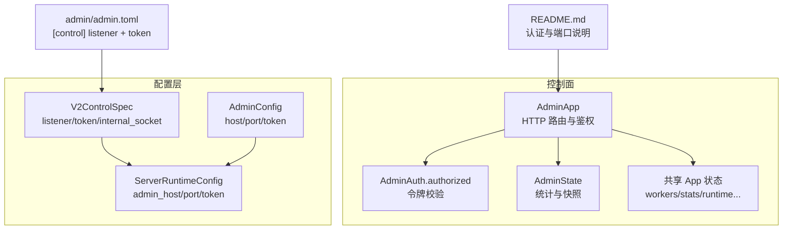
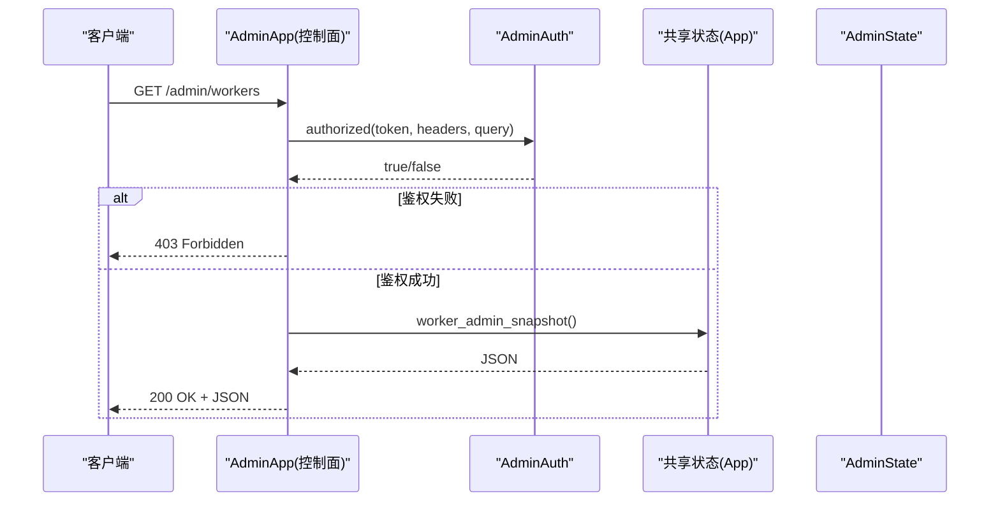
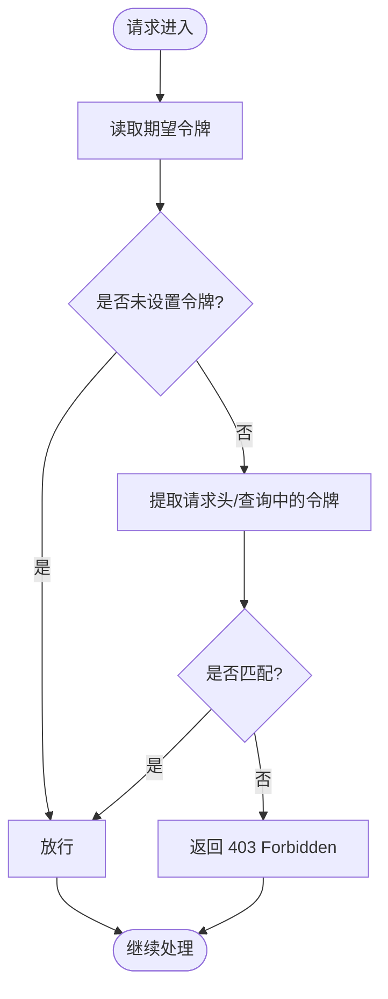
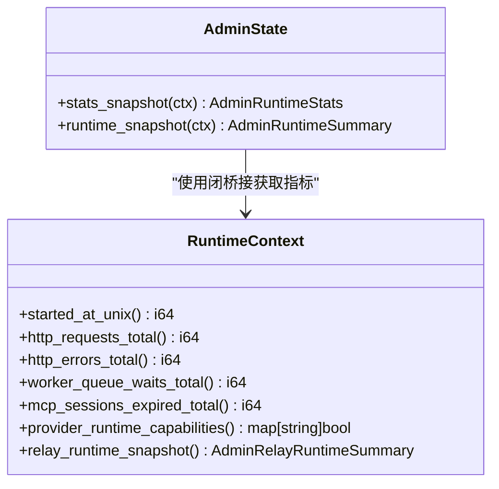
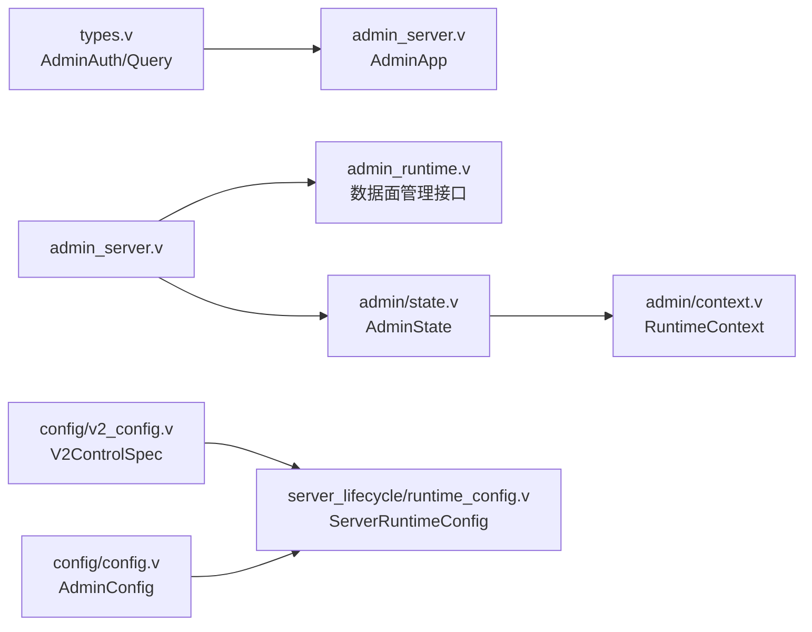

# 管理面板安全

<cite>
**本文引用的文件**
- [admin_server.v](file://src/admin_server.v)
- [admin_runtime.v](file://src/admin_runtime.v)
- [types.v](file://src/admin/types.v)
- [context.v](file://src/admin/context.v)
- [state.v](file://src/admin/state.v)
- [config.v](file://src/config/config.v)
- [v2_config.v](file://src/config/v2_config.v)
- [runtime_config.v](file://src/server_lifecycle/runtime_config.v)
- [README.md](file://README.md)
- [admin.toml](file://admin/admin.toml)
</cite>

## 目录
1. [简介](#简介)
2. [项目结构](#项目结构)
3. [核心组件](#核心组件)
4. [架构总览](#架构总览)
5. [详细组件分析](#详细组件分析)
6. [依赖关系分析](#依赖关系分析)
7. [性能与可用性考虑](#性能与可用性考虑)
8. [故障排查指南](#故障排查指南)
9. [结论](#结论)
10. [附录：配置与操作清单](#附录配置与操作清单)

## 简介
本指南聚焦于 vhttpd 管理面板的安全配置与加固，覆盖以下方面：
- 管理接口访问控制：管理员身份验证、端口暴露策略、数据面/控制面隔离
- 权限分级与最小化暴露：仅开放必要端点、按角色/来源限制
- IP 白名单与网络边界：监听地址与 TLS 绑定
- 强密码策略与登录失败锁定：令牌强度、防暴力破解建议
- 会话超时与请求限流：结合现有能力给出落地方案
- 管理 API 安全：API 密钥（令牌）管理、请求签名与审计日志
- 监控与告警：事件日志、指标采集与告警规则建议

## 项目结构
管理面板相关代码主要分布在 admin 模块与管理服务器实现中，并通过配置系统加载控制面监听器与令牌。关键路径如下：
- 管理 HTTP 服务与路由：src/admin_server.v
- 数据面管理接口（可选）：src/admin_runtime.v
- 认证与查询工具：src/admin/types.v
- 运行时上下文与快照：src/admin/context.v, src/admin/state.v
- 配置模型与示例：src/config/config.v, src/config/v2_config.v, admin/admin.toml, README.md

图示来源
- [admin_server.v:101-141](file://src/admin_server.v#L101-L141)
- [types.v:130-139](file://src/admin/types.v#L130-L139)
- [state.v:12-54](file://src/admin/state.v#L12-L54)
- [v2_config.v:52-57](file://src/config/v2_config.v#L52-L57)
- [config.v:132-137](file://src/config/config.v#L132-L137)
- [runtime_config.v:109-171](file://src/server_lifecycle/runtime_config.v#L109-L171)
- [admin.toml:21-24](file://admin/admin.toml#L21-L24)
- [README.md:1187-1221](file://README.md#L1187-L1221)

章节来源
- [admin_server.v:101-141](file://src/admin_server.v#L101-L141)
- [admin_runtime.v:1-673](file://src/admin_runtime.v#L1-L673)
- [types.v:130-139](file://src/admin/types.v#L130-L139)
- [context.v:1-54](file://src/admin/context.v#L1-L54)
- [state.v:12-103](file://src/admin/state.v#L12-L103)
- [config.v:132-137](file://src/config/config.v#L132-L137)
- [v2_config.v:52-57](file://src/config/v2_config.v#L52-L57)
- [runtime_config.v:109-171](file://src/server_lifecycle/runtime_config.v#L109-L171)
- [admin.toml:21-24](file://admin/admin.toml#L21-L24)
- [README.md:1187-1221](file://README.md#L1187-L1221)

## 核心组件
- AdminApp 管理 HTTP 服务：提供 /health、/admin/* 等路由，并在每个写敏感或信息型接口前调用鉴权方法。
- AdminAuth.authorized：基于令牌的简单鉴权，支持请求头与查询参数两种方式传入。
- AdminState 与 RuntimeContext：聚合运行时统计与快照，供管理面板展示。
- 配置模型：V2ControlSpec 与 AdminConfig 分别承载 V2 计划与控制面配置；ServerRuntimeConfig 将配置注入到运行期。

章节来源
- [admin_server.v:101-141](file://src/admin_server.v#L101-L141)
- [types.v:130-139](file://src/admin/types.v#L130-L139)
- [state.v:12-103](file://src/admin/state.v#L12-L103)
- [context.v:1-54](file://src/admin/context.v#L1-L54)
- [v2_config.v:52-57](file://src/config/v2_config.v#L52-L57)
- [config.v:132-137](file://src/config/config.v#L132-L137)
- [runtime_config.v:109-171](file://src/server_lifecycle/runtime_config.v#L109-L171)

## 架构总览
管理面板采用“控制面”与“数据面”双平面模式：
- 控制面：独立监听器（可绑定本地回环），通过 [control].listener 指定，并强制使用 token 鉴权。
- 数据面：当未启用独立控制面时，/admin/* 在数据面端口提供服务；启用后，数据面不再提供 /admin/*。

图示来源
- [admin_server.v:117-141](file://src/admin_server.v#L117-L141)
- [types.v:130-139](file://src/admin/types.v#L130-L139)
- [state.v:12-54](file://src/admin/state.v#L12-L54)

章节来源
- [README.md:1187-1221](file://README.md#L1187-L1221)
- [admin_server.v:117-141](file://src/admin_server.v#L117-L141)

## 详细组件分析

### 访问控制与身份验证
- 令牌来源：支持请求头 x-vhttpd-admin-token 或查询参数 admin_token。
- 鉴权逻辑：若未设置期望令牌，则允许访问；否则必须匹配。
- 端口暴露策略：
  - 当 admin_port=0（禁用）：/admin/* 在数据面端口提供。
  - 当 admin_port>0（启用）：/admin/* 从数据面移除，仅在控制面监听器上提供。

图示来源
- [types.v:130-139](file://src/admin/types.v#L130-L139)
- [README.md:1187-1221](file://README.md#L1187-L1221)

章节来源
- [types.v:130-139](file://src/admin/types.v#L130-L139)
- [README.md:1187-1221](file://README.md#L1187-L1221)

### 权限分级与最小暴露
- 当前实现为单令牌鉴权，无内置 RBAC。建议：
  - 通过前置网关（反向代理/WAF）实现基于源 IP、用户身份的细粒度授权。
  - 对写操作接口（如发布、替换、事件投递）进行二次确认与审批流程。
  - 将只读接口（stats、events、schema、providers）与变更接口分离，分别暴露给不同受众。

章节来源
- [admin_server.v:101-141](file://src/admin_server.v#L101-L141)
- [admin_runtime.v:1-673](file://src/admin_runtime.v#L1-L673)

### IP 白名单与网络边界
- 控制面监听器可通过 [listeners.admin_ui] 绑定到 127.0.0.1 或内网地址，避免公网暴露。
- 建议在容器/主机层面使用防火墙或云安全组限制来源 IP。
- 如需跨域访问，可在网关层做同源校验与 CORS 策略。

章节来源
- [admin.toml:15-24](file://admin/admin.toml#L15-L24)
- [v2_config.v:28-35](file://src/config/v2_config.v#L28-L35)

### 强密码策略与登录失败锁定
- 当前令牌为静态字符串，未内置复杂度检查与轮换机制。建议：
  - 使用高熵随机令牌（长度≥32，包含大小写字母、数字与符号）。
  - 定期轮换令牌，并通过配置中心或密钥管理服务下发。
  - 在网关层实现登录失败计数与临时封禁（例如连续失败 N 次锁定 M 分钟）。

章节来源
- [config.v:132-137](file://src/config/config.v#L132-L137)
- [v2_config.v:52-57](file://src/config/v2_config.v#L52-L57)

### 会话超时与请求限流
- 当前管理接口无会话与会话超时概念。建议：
  - 在网关层实施请求速率限制（QPS/IP 级）。
  - 对长连接或批量导出类接口增加超时与分页限制。
  - 利用现有 limit/offset 参数限制单次查询规模，防止资源耗尽。

章节来源
- [types.v:109-126](file://src/admin/types.v#L109-L126)
- [admin_server.v:623-675](file://src/admin_server.v#L623-L675)

### 管理 API 安全：令牌管理与请求签名
- 令牌管理：
  - 通过 [admin].token 或 [control].token 配置。
  - 建议由外部密钥管理系统注入环境变量，避免明文落盘。
- 请求签名：
  - 当前未实现请求签名。可在网关层引入 HMAC 签名校验，或使用 mTLS 双向认证。
- 审计日志：
  - 所有管理请求均附带 plane=admin 的元数据，便于接入统一日志系统。
  - 可结合 observability.event_log 输出 NDJSON 事件，用于离线分析与合规审计。

章节来源
- [config.v:132-137](file://src/config/config.v#L132-L137)
- [v2_config.v:52-57](file://src/config/v2_config.v#L52-L57)
- [admin_server.v:43-73](file://src/admin_server.v#L43-L73)
- [admin.toml:12-14](file://admin/admin.toml#L12-L14)

### 安全监控与告警
- 指标与快照：
  - AdminState.stats_snapshot 聚合 HTTP、Worker、Upstream、MCP、Feishu 等指标。
  - runtime_snapshot 提供活跃连接数、队列深度、执行器信息等。
- 告警建议：
  - 管理接口 403 比例突增（可能遭遇暴力破解）。
  - 事件日志中出现大量错误码或异常堆栈。
  - Worker 队列积压、超时与拒绝次数上升。
  - MCP 会话过期/驱逐/采样能力错误增多。

图示来源
- [state.v:12-103](file://src/admin/state.v#L12-L103)
- [context.v:1-54](file://src/admin/context.v#L1-L54)

章节来源
- [state.v:12-103](file://src/admin/state.v#L12-L103)
- [context.v:1-54](file://src/admin/context.v#L1-L54)

## 依赖关系分析
- AdminApp 依赖 AdminAuth 进行鉴权，依赖共享 App 状态获取运行时快照。
- AdminState 通过 RuntimeContext 的闭包函数访问主应用指标与状态，保持模块解耦。
- 配置层 V2ControlSpec/AdminConfig 被 ServerRuntimeConfig 消费，决定控制面监听与令牌。

图示来源
- [types.v:130-139](file://src/admin/types.v#L130-L139)
- [admin_server.v:101-141](file://src/admin_server.v#L101-L141)
- [admin_runtime.v:1-673](file://src/admin_runtime.v#L1-L673)
- [state.v:12-103](file://src/admin/state.v#L12-L103)
- [context.v:1-54](file://src/admin/context.v#L1-L54)
- [v2_config.v:52-57](file://src/config/v2_config.v#L52-L57)
- [config.v:132-137](file://src/config/config.v#L132-L137)
- [runtime_config.v:109-171](file://src/server_lifecycle/runtime_config.v#L109-L171)

章节来源
- [admin_server.v:101-141](file://src/admin_server.v#L101-L141)
- [admin_runtime.v:1-673](file://src/admin_runtime.v#L1-L673)
- [state.v:12-103](file://src/admin/state.v#L12-L103)
- [context.v:1-54](file://src/admin/context.v#L1-L54)
- [v2_config.v:52-57](file://src/config/v2_config.v#L52-L57)
- [config.v:132-137](file://src/config/config.v#L132-L137)
- [runtime_config.v:109-171](file://src/server_lifecycle/runtime_config.v#L109-L171)

## 性能与可用性考虑
- 限制查询规模：使用 limit/offset 参数保护后端，避免大结果集拖垮服务。
- 控制面与数据面隔离：启用独立控制面，降低生产流量对管理接口的影响。
- 事件日志异步写入：确保 event_log 路径具备足够磁盘空间与轮转策略。
- 指标快照缓存：AdminState 的快照构建应避免阻塞热点路径，必要时引入缓存。

章节来源
- [types.v:109-126](file://src/admin/types.v#L109-L126)
- [state.v:12-103](file://src/admin/state.v#L12-L103)
- [admin.toml:12-14](file://admin/admin.toml#L12-L14)

## 故障排查指南
- 403 Forbidden：检查是否正确传递 x-vhttpd-admin-token 或 admin_token 查询参数，且与配置一致。
- 404 Not Found：确认是否启用了独立控制面；若启用，需在控制面端口访问 /admin/*。
- 事件缺失：检查 observability.event_log 路径权限与磁盘空间。
- 指标异常：查看 AdminState 聚合的 HTTP/Worker/MCP 指标，定位瓶颈与错误来源。

章节来源
- [admin_server.v:117-141](file://src/admin_server.v#L117-L141)
- [admin_runtime.v:1-673](file://src/admin_runtime.v#L1-L673)
- [admin.toml:12-14](file://admin/admin.toml#L12-L14)

## 结论
vhttpd 的管理面板提供了简洁而有效的令牌鉴权与双平面架构，适合在生产环境中通过控制面隔离与前置网关强化安全。建议结合强令牌策略、IP 白名单、请求签名与审计日志，完善权限分级与监控告警体系，从而保障管理接口的机密性、完整性与可观测性。

## 附录：配置与操作清单
- 控制面监听与令牌
  - 在 [listeners.admin_ui] 中设置 protocol/transport/host/port，并将 host 绑定至 127.0.0.1 或内网地址。
  - 在 [control] 中指定 listener 与 token。
- 旧版配置
  - 在 [admin] 中设置 host/port/token。
- 认证方式
  - 请求头：x-vhttpd-admin-token
  - 查询参数：?admin_token=
- 审计与事件
  - 配置 observability.event_log 输出路径，用于离线审计与分析。

章节来源
- [admin.toml:15-24](file://admin/admin.toml#L15-L24)
- [config.v:132-137](file://src/config/config.v#L132-L137)
- [v2_config.v:52-64](file://src/config/v2_config.v#L52-L64)
- [README.md:1187-1221](file://README.md#L1187-L1221)