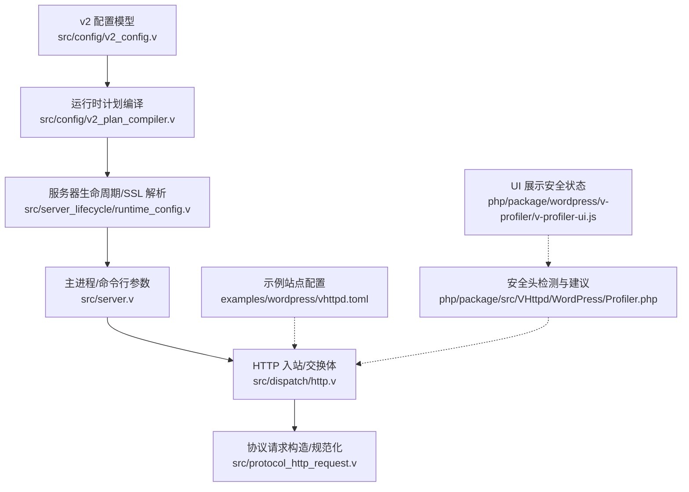
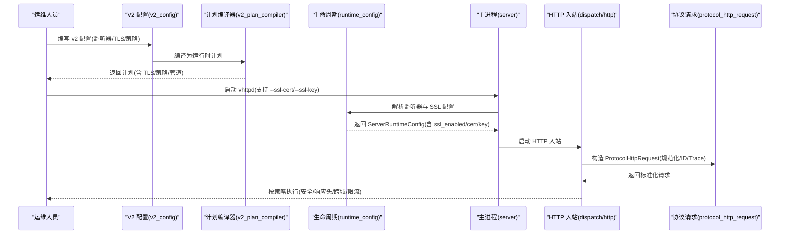
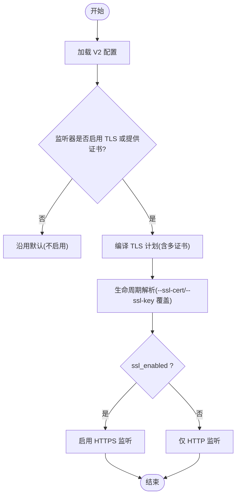
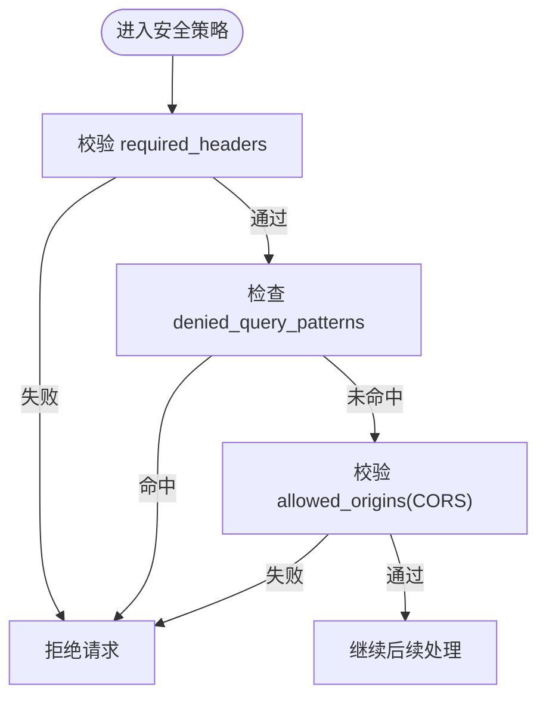
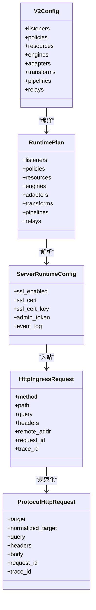

# 网络安全配置

<cite>
**本文引用的文件**
- [src/config/v2_config.v](file://src/config/v2_config.v)
- [src/config/v2_plan_compiler.v](file://src/config/v2_plan_compiler.v)
- [src/server_lifecycle/runtime_config.v](file://src/server_lifecycle/runtime_config.v)
- [src/server.v](file://src/server.v)
- [src/dispatch/http.v](file://src/dispatch/http.v)
- [src/protocol_http_request.v](file://src/protocol_http_request.v)
- [src/route_rule_test.v](file://src/route_rule_test.v)
- [config/vhttpd.example.toml](file://config/vhttpd.example.toml)
- [examples/wordpress/vhttpd.toml](file://examples/wordpress/vhttpd.toml)
- [php/package/src/VHttpd/WordPress/Profiler.php](file://php/package/src/VHttpd/WordPress/Profiler.php)
- [php/package/wordpress/v-profiler/v-profiler-ui.js](file://php/package/wordpress/v-profiler/v-profiler-ui.js)
- [articles/11-observability.md](file://articles/11-observability.md)
</cite>

## 目录
1. [简介](#简介)
2. [项目结构](#项目结构)
3. [核心组件](#核心组件)
4. [架构总览](#架构总览)
5. [详细组件分析](#详细组件分析)
6. [依赖关系分析](#依赖关系分析)
7. [性能与安全考量](#性能与安全考量)
8. [故障排查指南](#故障排查指南)
9. [结论](#结论)
10. [附录](#附录)

## 简介
本指南聚焦 VHTTPD 的网络安全配置，覆盖 HTTPS/TLS、证书管理、安全响应头、访问控制策略（含请求来源验证与跨域）、网络层防护（DDoS 缓解、频率限制、连接池安全）、防火墙与负载均衡建议，以及监控告警方案。文档以仓库源码为依据，提供可落地的配置项与最佳实践。

## 项目结构
VHTTPD 的安全相关能力主要分布在以下位置：
- 运行时计划与编译：V2 配置模型、策略与管道编译、TLS 计划生成
- 服务器生命周期：监听器、SSL 开关、证书路径解析、Admin 面与事件日志
- HTTP 入站与协议处理：请求标准化、头部归一化、目标规范化
- 示例与工具：示例站点配置、安全头检测与 TOML 建议生成、可观测性文档

图表来源
- [src/config/v2_config.v:1-318](file://src/config/v2_config.v#L1-L318)
- [src/config/v2_plan_compiler.v:1-800](file://src/config/v2_plan_compiler.v#L1-L800)
- [src/server_lifecycle/runtime_config.v:1-305](file://src/server_lifecycle/runtime_config.v#L1-L305)
- [src/server.v:1-372](file://src/server.v#L1-L372)
- [src/dispatch/http.v:1-55](file://src/dispatch/http.v#L1-L55)
- [src/protocol_http_request.v:1-32](file://src/protocol_http_request.v#L1-L32)
- [examples/wordpress/vhttpd.toml:90-130](file://examples/wordpress/vhttpd.toml#L90-L130)
- [php/package/src/VHttpd/WordPress/Profiler.php:1176-1197](file://php/package/src/VHttpd/WordPress/Profiler.php#L1176-L1197)
- [php/package/wordpress/v-profiler/v-profiler-ui.js:1188-1232](file://php/package/wordpress/v-profiler/v-profiler-ui.js#L1188-L1232)

章节来源
- [src/config/v2_config.v:1-318](file://src/config/v2_config.v#L1-L318)
- [src/config/v2_plan_compiler.v:1-800](file://src/config/v2_plan_compiler.v#L1-L800)
- [src/server_lifecycle/runtime_config.v:1-305](file://src/server_lifecycle/runtime_config.v#L1-L305)
- [src/server.v:1-372](file://src/server.v#L1-L372)
- [src/dispatch/http.v:1-55](file://src/dispatch/http.v#L1-L55)
- [src/protocol_http_request.v:1-32](file://src/protocol_http_request.v#L1-L32)
- [config/vhttpd.example.toml:1-67](file://config/vhttpd.example.toml#L1-L67)
- [examples/wordpress/vhttpd.toml:90-130](file://examples/wordpress/vhttpd.toml#L90-L130)
- [php/package/src/VHttpd/WordPress/Profiler.php:1176-1197](file://php/package/src/VHttpd/WordPress/Profiler.php#L1176-L1197)
- [php/package/wordpress/v-profiler/v-profiler-ui.js:1188-1232](file://php/package/wordpress/v-profiler/v-profiler-ui.js#L1188-L1232)

## 核心组件
- V2 配置模型与策略
  - 监听器 TLS 配置、多证书 SNI 列表、安全策略（必需头、拒绝查询模式、允许来源）、响应头策略、并发与限流策略等
- 运行时计划编译
  - 将 V2 配置编译为运行时计划，包括 TLS 计划、策略映射、管道与资源引用校验
- 服务器生命周期与 SSL 解析
  - 从监听器与 CLI 参数解析 SSL 开关与证书路径，合并默认值与覆盖项
- HTTP 入站与协议处理
  - 请求 ID/Trace ID 注入、头部归一化、目标规范化与查询解析
- 安全头检测与 TOML 建议
  - 检测缺失的安全响应头并自动生成建议的 TOML 片段，便于快速加固

章节来源
- [src/config/v2_config.v:224-259](file://src/config/v2_config.v#L224-L259)
- [src/config/v2_plan_compiler.v:291-307](file://src/config/v2_plan_compiler.v#L291-L307)
- [src/server_lifecycle/runtime_config.v:239-249](file://src/server_lifecycle/runtime_config.v#L239-L249)
- [src/dispatch/http.v:1-55](file://src/dispatch/http.v#L1-L55)
- [src/protocol_http_request.v:1-32](file://src/protocol_http_request.v#L1-L32)
- [php/package/src/VHttpd/WordPress/Profiler.php:1176-1197](file://php/package/src/VHttpd/WordPress/Profiler.php#L1176-L1197)

## 架构总览
下图展示了从 V2 配置到运行时计划的编译过程，以及服务器启动时如何启用 HTTPS/TLS 与注入安全策略。

图表来源
- [src/config/v2_config.v:1-318](file://src/config/v2_config.v#L1-L318)
- [src/config/v2_plan_compiler.v:1-800](file://src/config/v2_plan_compiler.v#L1-L800)
- [src/server_lifecycle/runtime_config.v:1-305](file://src/server_lifecycle/runtime_config.v#L1-L305)
- [src/server.v:1-372](file://src/server.v#L1-L372)
- [src/dispatch/http.v:1-55](file://src/dispatch/http.v#L1-L55)
- [src/protocol_http_request.v:1-32](file://src/protocol_http_request.v#L1-L32)

## 详细组件分析

### HTTPS/TLS 与证书管理
- 监听器 TLS 配置
  - 通过 V2 配置的监听器字段开启 TLS，支持单证书与多证书（SNI）列表
  - 当未显式设置但提供了 cert/cert_key 或 certificates 列表时，TLS 自动启用
- 运行时解析与覆盖
  - 生命周期模块从监听器与 CLI 参数合并 SSL 配置；CLI 参数优先于配置文件
  - 若启用且提供证书与私钥路径，则 ssl_enabled 为真
- 证书管理建议
  - 使用受信任 CA 签发的证书，避免自签证书用于公网入口
  - 定期轮换证书，结合自动化脚本更新监听器配置并平滑重载
  - 对敏感证书文件设置最小权限，仅运行用户可读

图表来源
- [src/config/v2_config.v:28-50](file://src/config/v2_config.v#L28-L50)
- [src/config/v2_plan_compiler.v:291-307](file://src/config/v2_plan_compiler.v#L291-L307)
- [src/server_lifecycle/runtime_config.v:239-249](file://src/server_lifecycle/runtime_config.v#L239-L249)
- [src/server.v:139-183](file://src/server.v#L139-L183)

章节来源
- [src/config/v2_config.v:28-50](file://src/config/v2_config.v#L28-L50)
- [src/config/v2_plan_compiler.v:291-307](file://src/config/v2_plan_compiler.v#L291-L307)
- [src/server_lifecycle/runtime_config.v:239-249](file://src/server_lifecycle/runtime_config.v#L239-L249)
- [src/server.v:139-183](file://src/server.v#L139-L183)

### 加密协议选择与套件建议
- 当前代码库未暴露 TLS 版本与套件配置项；建议在反向代理或系统层面统一管控（如 Nginx/HAProxy/云 LB）
- 推荐在边缘侧强制 TLS 1.2+，禁用弱套件与过时协议，启用前向保密套件

[本节为通用建议，不直接分析具体文件]

### 安全响应头设置
- 内置检测与 TOML 建议
  - WordPress Profiler 会检测常见安全响应头（如 CSP、X-Frame-Options、X-Content-Type-Options、Referrer-Policy、Permissions-Policy），并在缺失时自动生成建议的 TOML 片段，提示在 [http.headers] 段中补充
- 站点级响应头
  - 示例站点配置中可通过 response_headers 为特定路由添加安全头（如 X-Content-Type-Options）
- 建议
  - 全站启用严格的安全头策略，结合业务需求调整 CSP 白名单
  - 使用 UI 面板可视化检查安全头状态，持续回归

章节来源
- [php/package/src/VHttpd/WordPress/Profiler.php:1176-1197](file://php/package/src/VHttpd/WordPress/Profiler.php#L1176-L1197)
- [php/package/wordpress/v-profiler/v-profiler-ui.js:1188-1232](file://php/package/wordpress/v-profiler/v-profiler-ui.js#L1188-L1232)
- [examples/wordpress/vhttpd.toml:122-130](file://examples/wordpress/vhttpd.toml#L122-L130)

### 访问控制策略
- 必需请求头校验
  - 安全策略支持 required_headers，可按键匹配通配符或精确值，未满足则阻断
- 拒绝查询参数模式
  - denied_query_patterns 支持按 key/value 模式拒绝可疑请求（如 debug=1、role=admin）
- 请求来源验证
  - allowed_origins 用于跨域来源白名单；结合 CORS 策略实现细粒度控制
- 路由匹配与重写
  - 基于方法、主机、路径、正则、查询与元数据进行匹配；支持保留原始查询的重写规则

图表来源
- [src/config/v2_config.v:224-229](file://src/config/v2_config.v#L224-L229)
- [src/config/v2_plan_compiler.v:563-578](file://src/config/v2_plan_compiler.v#L563-L578)
- [src/route_rule_test.v:247-293](file://src/route_rule_test.v#L247-L293)

章节来源
- [src/config/v2_config.v:224-229](file://src/config/v2_config.v#L224-L229)
- [src/config/v2_plan_compiler.v:563-578](file://src/config/v2_plan_compiler.v#L563-L578)
- [src/route_rule_test.v:247-293](file://src/route_rule_test.v#L247-L293)

### CORS 跨域配置
- 通过 security.allowed_origins 指定允许的源（支持多个）
- 结合 response 策略中的 headers 注入 Access-Control-Allow-* 头
- 建议
  - 明确限定允许的 Origin、方法与头，避免使用通配符
  - 对预检请求进行缓存以减少开销

章节来源
- [src/config/v2_config.v:224-229](file://src/config/v2_config.v#L224-L229)
- [src/config/v2_plan_compiler.v:563-578](file://src/config/v2_plan_compiler.v#L563-L578)

### 网络层安全防护
- DDoS 防护
  - 在边缘侧（LB/CDN/WAF）启用速率限制与异常流量清洗
  - 应用层配合 limits 策略限制最大请求体大小与超时时间
- 请求频率限制
  - 参考高级模式文章中的速率限制中间件思路，结合 Redis 等外部存储实现 IP 维度的滑动窗口限流
  - 在响应头中回传 X-RateLimit-* 以便客户端退避
- 连接池安全
  - 合理设置 worker 队列容量与超时，避免雪崩
  - 上游数据库/缓存连接池设置空闲探测与初始化 SQL，确保连接健康

章节来源
- [src/config/v2_config.v:217-222](file://src/config/v2_config.v#L217-L222)
- [articles/12-advanced-patterns.md:822-915](file://articles/12-advanced-patterns.md#L822-L915)

### 防火墙规则建议
- 仅开放必要端口（如 80/443），管理面端口绑定本地回环或内网段
- 对 Admin API 启用强认证令牌，并通过防火墙限制来源 IP
- 对内部 Unix Socket（DB/Cache）限制进程间访问权限

[本节为通用建议，不直接分析具体文件]

### 负载均衡安全配置
- 终止 TLS 于 LB，后端走内网 HTTP，减少证书管理复杂度
- 透传真实客户端 IP（X-Forwarded-For），并在应用层做来源校验
- 启用健康检查与熔断，避免级联故障

[本节为通用建议，不直接分析具体文件]

### 网络安全监控方案
- 事件日志与追踪
  - 通过 observability.event_log 输出结构化事件日志，便于审计与分析
  - 可启用 tracing 导出至外部系统，结合采样率控制开销
- 告警规则
  - 针对 Worker 池耗尽、队列积压、高错误率、上游断开、会话数接近上限等指标设置告警
- 可视化
  - 利用 Profiler UI 查看安全头状态与速率限制门控情况

章节来源
- [src/config/v2_config.v:59-72](file://src/config/v2_config.v#L59-L72)
- [articles/11-observability.md:469-534](file://articles/11-observability.md#L469-L534)
- [php/package/wordpress/v-profiler/v-profiler-ui.js:1215-1232](file://php/package/wordpress/v-profiler/v-profiler-ui.js#L1215-L1232)

## 依赖关系分析
- 配置到计划
  - V2 配置模型被计划编译器转换为运行时计划，包含监听器、资源、引擎、适配器、变换、策略与管道
- 计划到运行时
  - 生命周期模块根据计划与 CLI 参数解析最终运行配置（含 SSL、Admin、Assets、Worker 参数）
- 运行时到入站
  - 主进程负责信号处理、帮助打印与参数校验，随后启动服务生命周期与 HTTP 入站
- 入站到协议
  - HTTP 入站将请求封装为 Exchange，协议层进行目标与查询规范化，注入 ID/Trace

图表来源
- [src/config/v2_config.v:1-318](file://src/config/v2_config.v#L1-L318)
- [src/config/v2_plan_compiler.v:1-800](file://src/config/v2_plan_compiler.v#L1-L800)
- [src/server_lifecycle/runtime_config.v:1-305](file://src/server_lifecycle/runtime_config.v#L1-L305)
- [src/dispatch/http.v:1-55](file://src/dispatch/http.v#L1-L55)
- [src/protocol_http_request.v:1-32](file://src/protocol_http_request.v#L1-L32)

章节来源
- [src/config/v2_config.v:1-318](file://src/config/v2_config.v#L1-L318)
- [src/config/v2_plan_compiler.v:1-800](file://src/config/v2_plan_compiler.v#L1-L800)
- [src/server_lifecycle/runtime_config.v:1-305](file://src/server_lifecycle/runtime_config.v#L1-L305)
- [src/dispatch/http.v:1-55](file://src/dispatch/http.v#L1-L55)
- [src/protocol_http_request.v:1-32](file://src/protocol_http_request.v#L1-L32)

## 性能与安全考量
- 合理设置 worker 队列容量与超时，避免过载导致雪崩
- 对静态资源启用缓存控制，减少重复计算与带宽消耗
- 在高并发场景下，结合外部限流与缓存，降低后端压力
- 安全头与跨域策略应尽早生效，减少无效请求进入应用层

[本节为通用建议，不直接分析具体文件]

## 故障排查指南
- 无法启用 HTTPS
  - 检查监听器 TLS 配置与 CLI 参数覆盖是否正确，确认证书与私钥路径存在且可读
- 安全头缺失
  - 使用 Profiler 检测缺失项，并按建议的 TOML 片段在 [http.headers] 中补充
- 跨域失败
  - 核对 allowed_origins 与前端实际 Origin 是否一致，检查预检请求是否被正确放行
- 限流过严
  - 观察速率限制统计与剩余配额，适当放宽阈值或优化业务逻辑

章节来源
- [src/server_lifecycle/runtime_config.v:239-249](file://src/server_lifecycle/runtime_config.v#L239-L249)
- [php/package/src/VHttpd/WordPress/Profiler.php:1176-1197](file://php/package/src/VHttpd/WordPress/Profiler.php#L1176-L1197)
- [src/config/v2_config.v:224-229](file://src/config/v2_config.v#L224-L229)

## 结论
VHTTPD 在 V2 配置模型中提供了完善的监听器 TLS、安全策略与响应头管理能力，结合生命周期解析与 HTTP 入站规范化，可实现端到端的安全加固。建议在生产环境中采用“边缘终止 TLS + 应用层策略”的分层安全架构，并配套完善的监控与告警体系，持续提升安全性与稳定性。

[本节为总结，不直接分析具体文件]

## 附录
- 示例配置参考
  - 示例站点配置展示了上传路由与响应头的设置方式，可作为安全头与上传控制的参考
- 可观测性与告警
  - 参考可观测性文档中的告警规则，建立关键指标的监控与告警闭环

章节来源
- [examples/wordpress/vhttpd.toml:90-130](file://examples/wordpress/vhttpd.toml#L90-L130)
- [articles/11-observability.md:469-534](file://articles/11-observability.md#L469-L534)