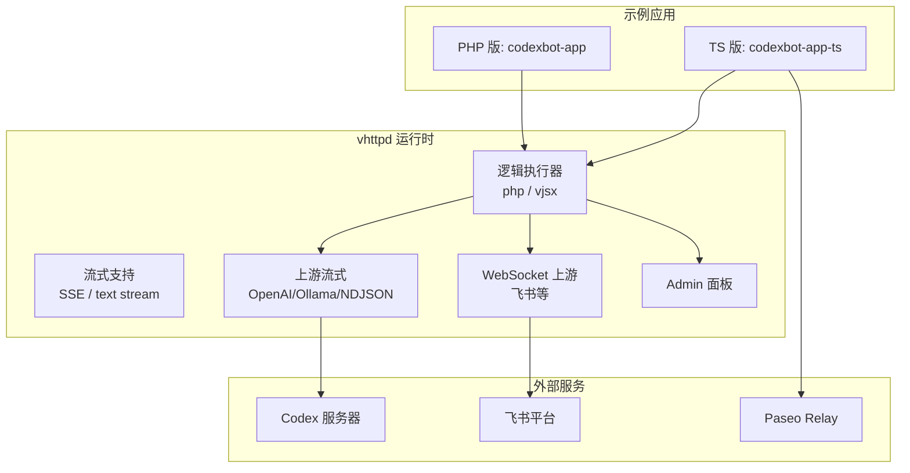
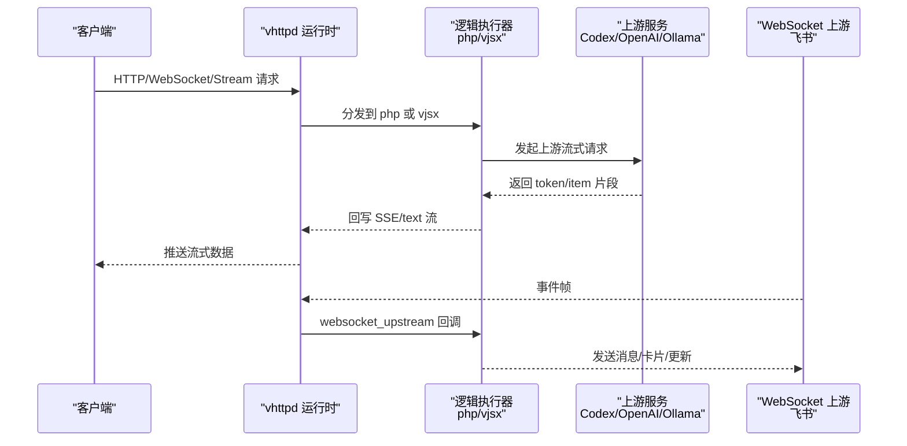
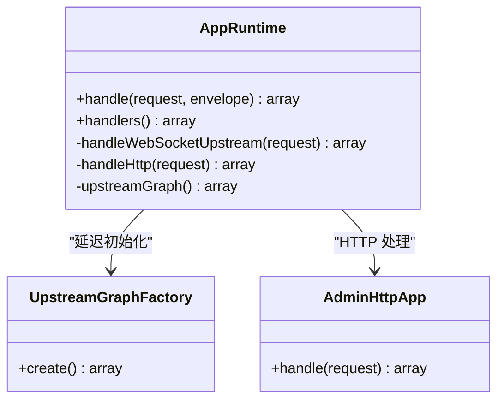
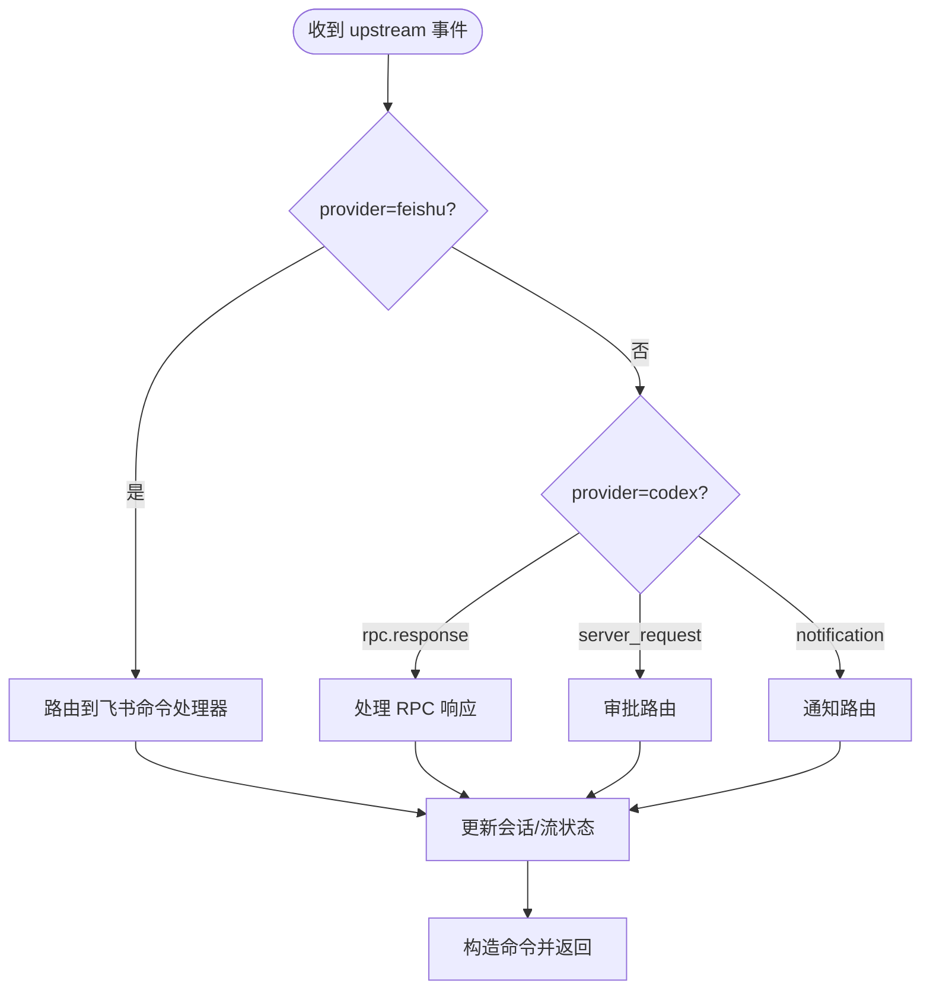
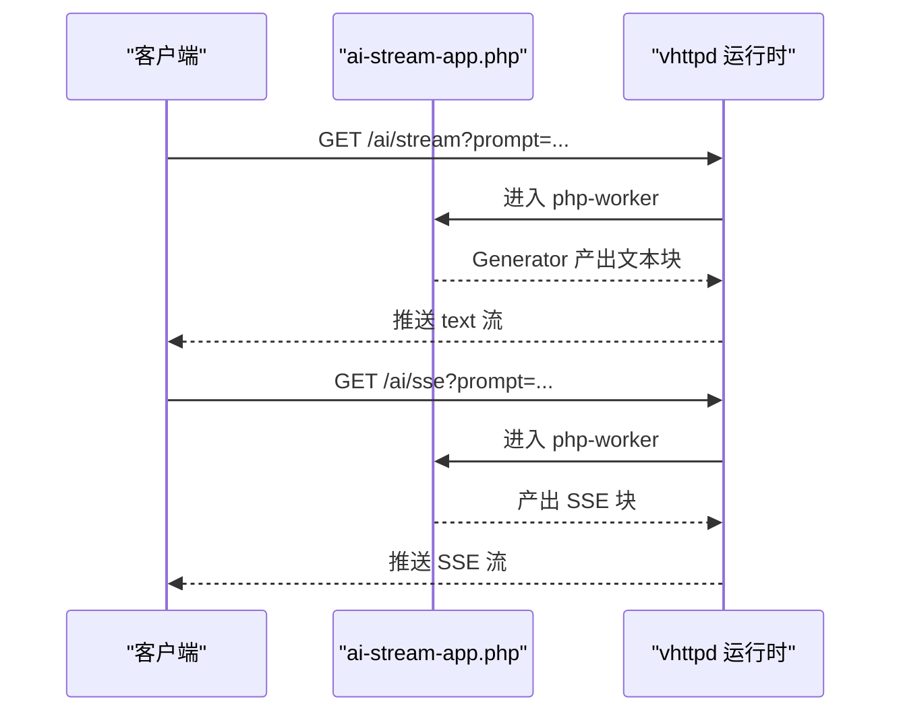
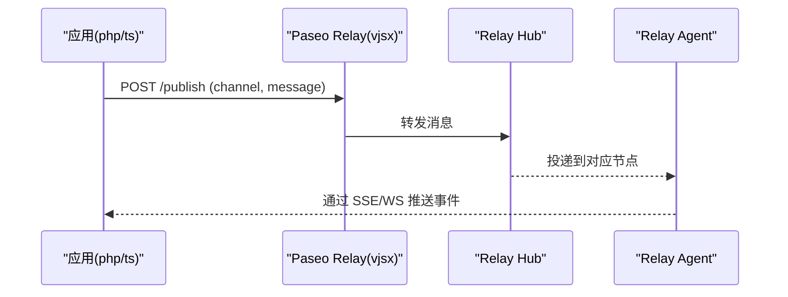
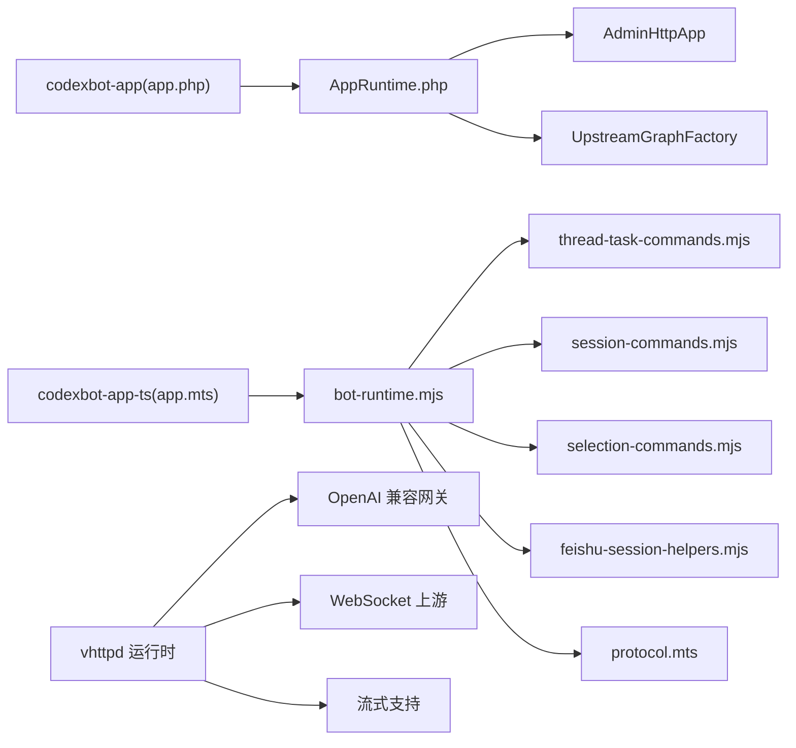

# AI 应用示例

<cite>
**本文引用的文件列表**
- [README.md](file://README.md)
- [09-codexbot.md](file://articles/09-codexbot.md)
- [04-ai-streaming.md](file://articles/04-ai-streaming.md)
- [12-advanced-patterns.md](file://articles/12-advanced-patterns.md)
- [PASEO_RELAY_VHTTPD_PLAN.md](file://docs/PASEO_RELAY_VHTTPD_PLAN.md)
- [PROTOCOL_PIPELINE_RELAY_ARCHITECTURE.md](file://docs/PROTOCOL_PIPELINE_RELAY_ARCHITECTURE.md)
- [codexbot-app README.md](file://examples/codexbot-app/README.md)
- [codexbot-app-ts README.md](file://examples/codexbot-app-ts/README.md)
- [app.php](file://examples/codexbot-app/app.php)
- [AppRuntime.php](file://examples/codexbot-app/lib/AppRuntime.php)
- [CodexBotAppFlowTest.php](file://examples/codexbot-app/tests/Feature/CodexBotAppFlowTest.php)
- [app.mts](file://examples/codexbot-app-ts/app.mts)
- [bot-runtime.mjs](file://examples/codexbot-app-ts/lib/bot-runtime.mjs)
- [thread-task-commands.mjs](file://examples/codexbot-app-ts/lib/thread-task-commands.mjs)
- [session-commands.mjs](file://examples/codexbot-app-ts/lib/session-commands.mjs)
- [selection-commands.mjs](file://examples/codexbot-app-ts/lib/selection-commands.mjs)
- [feishu-session-helpers.mjs](file://examples/codexbot-app-ts/lib/feishu-session-helpers.mjs)
- [protocol.mts](file://examples/codexbot-app-ts/codex/protocol.mts)
- [paseo-relay app.mts](file://examples/paseo-relay/app.mts)
- [ai-stream-app.php](file://examples/ai-stream-app.php)
</cite>

## 目录
1. [引言](#引言)
2. [项目结构](#项目结构)
3. [核心组件](#核心组件)
4. [架构总览](#架构总览)
5. [详细组件分析](#详细组件分析)
6. [依赖关系分析](#依赖关系分析)
7. [性能与流式处理](#性能与流式处理)
8. [故障排查指南](#故障排查指南)
9. [结论](#结论)
10. [附录：从原型到生产部署](#附录从原型到生产部署)

## 引言
本指南面向希望在 vhttpd 上构建 AI 应用的开发者，围绕 CodexBot 的 PHP 与 TypeScript 两个版本，系统讲解会话管理、流式响应、工具调用、权限控制与错误处理策略，并给出 Paseo Relay 代理服务的配置与使用建议。文档同时覆盖从原型开发到生产部署的全流程指导，帮助读者快速落地可观测、可扩展、高可用的 AI 应用。

## 项目结构
仓库包含完整的 AI 应用示例与运行时基础设施：
- 示例应用
  - PHP 版：examples/codexbot-app（基于 php-worker）
  - TypeScript 版：examples/codexbot-app-ts（基于 vjsx 嵌入式执行器）
- 协议与网关
  - OpenAI 兼容聚合网关与映射实现（vhttpd 内置）
  - Paseo Relay 在 vhttpd + vjsx 上的实现计划与样例
- 流式能力演示
  - ai-stream-app.php 展示 text/SSE 两种流式输出模式

图表来源
- [README.md](file://README.md)
- [09-codexbot.md](file://articles/09-codexbot.md)

章节来源
- [README.md](file://README.md)
- [09-codexbot.md](file://articles/09-codexbot.md)

## 核心组件
- 应用入口与运行时
  - PHP 入口：examples/codexbot-app/app.php
  - PHP 运行时：examples/codexbot-app/lib/AppRuntime.php
  - TS 入口：examples/codexbot-app-ts/app.mts
  - TS 组合根：examples/codexbot-app-ts/lib/bot-runtime.mjs
- 命令路由与会话协调
  - TS 线程任务命令：examples/codexbot-app-ts/lib/thread-task-commands.mjs
  - TS 会话命令：examples/codexbot-app-ts/lib/session-commands.mjs
  - TS 选择命令：examples/codexbot-app-ts/lib/selection-commands.mjs
  - TS 飞书会话辅助：examples/codexbot-app-ts/lib/feishu-session-helpers.mjs
- 协议与状态
  - TS Codex 协议常量与规范化：examples/codexbot-app-ts/codex/protocol.mts
- 流式演示
  - PHP 流式示例：examples/ai-stream-app.php
- 文档与计划
  - CodexBot 深度解析：articles/09-codexbot.md
  - AI 流式指南：articles/04-ai-streaming.md
  - Paseo Relay 计划与架构：docs/PASEO_RELAY_VHTTPD_PLAN.md, docs/PROTOCOL_PIPELINE_RELAY_ARCHITECTURE.md
  - 高级模式（含 Paseo 发送示例）：articles/12-advanced-patterns.md

章节来源
- [app.php](file://examples/codexbot-app/app.php)
- [AppRuntime.php](file://examples/codexbot-app/lib/AppRuntime.php)
- [app.mts](file://examples/codexbot-app-ts/app.mts)
- [bot-runtime.mjs](file://examples/codexbot-app-ts/lib/bot-runtime.mjs)
- [thread-task-commands.mjs](file://examples/codexbot-app-ts/lib/thread-task-commands.mjs)
- [session-commands.mjs](file://examples/codexbot-app-ts/lib/session-commands.mjs)
- [selection-commands.mjs](file://examples/codexbot-app-ts/lib/selection-commands.mjs)
- [feishu-session-helpers.mjs](file://examples/codexbot-app-ts/lib/feishu-session-helpers.mjs)
- [protocol.mts](file://examples/codexbot-app-ts/codex/protocol.mts)
- [ai-stream-app.php](file://examples/ai-stream-app.php)
- [09-codexbot.md](file://articles/09-codexbot.md)
- [04-ai-streaming.md](file://articles/04-ai-streaming.md)
- [PASEO_RELAY_VHTTPD_PLAN.md](file://docs/PASEO_RELAY_VHTTPD_PLAN.md)
- [PROTOCOL_PIPELINE_RELAY_ARCHITECTURE.md](file://docs/PROTOCOL_PIPELINE_RELAY_ARCHITECTURE.md)
- [12-advanced-patterns.md](file://articles/12-advanced-patterns.md)

## 架构总览
vhttpd 作为传输与运行时层，统一承载 HTTP/WebSocket/流式连接，并通过“逻辑执行器”模型将请求委派给不同宿主（php-worker 或 vjsx）。AI 应用通过上游流式（如 OpenAI/Ollama/NDJSON）和 WebSocket 上游（如飞书）与外部服务交互，同时提供 Admin 面板进行运行时观测与控制。

图表来源
- [README.md](file://README.md)
- [09-codexbot.md](file://articles/09-codexbot.md)

## 详细组件分析

### PHP 版 CodexBot 组件
- 入口与双模式处理
  - 入口文件设置时区、加载自动加载器，创建 AppRuntime 实例并返回处理器集合。
  - AppRuntime 根据 mode 区分 http 与 websocket_upstream 两条路径；后者通过 Event 与 CommandBus 统一派发。
- 测试与错误处理
  - 特性测试验证了速率限制与系统错误的格式化，以及单条/多条命令包装行为，体现错误与响应的标准化。

图表来源
- [AppRuntime.php](file://examples/codexbot-app/lib/AppRuntime.php)
- [app.php](file://examples/codexbot-app/app.php)

章节来源
- [app.php](file://examples/codexbot-app/app.php)
- [AppRuntime.php](file://examples/codexbot-app/lib/AppRuntime.php)
- [CodexBotAppFlowTest.php](file://examples/codexbot-app/tests/Feature/CodexBotAppFlowTest.php)

### TypeScript 版 CodexBot 组件
- 组合根与生命周期钩子
  - app.mts 导出 startup、app_startup、http、websocket_upstream 四个接口，内部委托给 bot-runtime.mjs 提供的 createBotApp。
  - bot-runtime.mjs 组装命令路由、状态持久化、渲染协调、实例策略与文本助手等模块，形成清晰的职责边界。
- 会话与任务编排
  - thread-task-commands.mjs 负责线程选择、忙闲态与取消、普通任务启动等。
  - session-commands.mjs 负责 /settings、/threads、/new 等会话级命令。
  - selection-commands.mjs 负责 project/model/instance 的选择与切换。
  - feishu-session-helpers.mjs 封装飞书回复与帮助文本生成。
- 协议与状态
  - protocol.mts 定义线程/回合状态常量与规范化函数，保证跨端语义一致。

图表来源
- [bot-runtime.mjs](file://examples/codexbot-app-ts/lib/bot-runtime.mjs)
- [thread-task-commands.mjs](file://examples/codexbot-app-ts/lib/thread-task-commands.mjs)
- [session-commands.mjs](file://examples/codexbot-app-ts/lib/session-commands.mjs)
- [selection-commands.mjs](file://examples/codexbot-app-ts/lib/selection-commands.mjs)
- [feishu-session-helpers.mjs](file://examples/codexbot-app-ts/lib/feishu-session-helpers.mjs)
- [protocol.mts](file://examples/codexbot-app-ts/codex/protocol.mts)

章节来源
- [app.mts](file://examples/codexbot-app-ts/app.mts)
- [bot-runtime.mjs](file://examples/codexbot-app-ts/lib/bot-runtime.mjs)
- [thread-task-commands.mjs](file://examples/codexbot-app-ts/lib/thread-task-commands.mjs)
- [session-commands.mjs](file://examples/codexbot-app-ts/lib/session-commands.mjs)
- [selection-commands.mjs](file://examples/codexbot-app-ts/lib/selection-commands.mjs)
- [feishu-session-helpers.mjs](file://examples/codexbot-app-ts/lib/feishu-session-helpers.mjs)
- [protocol.mts](file://examples/codexbot-app-ts/codex/protocol.mts)

### 流式响应处理（PHP 与 vhttpd）
- PHP 流式示例展示了两种模式：
  - text 流：逐块推送纯文本片段
  - SSE 流：以 Server-Sent Events 格式推送
- vhttpd 在运行时层提供统一的流式框架，使上层应用无需关心底层缓冲与超时细节。

图表来源
- [ai-stream-app.php](file://examples/ai-stream-app.php)
- [04-ai-streaming.md](file://articles/04-ai-streaming.md)

章节来源
- [ai-stream-app.php](file://examples/ai-stream-app.php)
- [04-ai-streaming.md](file://articles/04-ai-streaming.md)

### 工具调用机制（OpenAI 兼容与映射）
- vhttpd 内置 OpenAI 兼容聚合网关，支持：
  - 非流与流式 passthrough
  - NDJSON 映射为 OpenAI chat completion SSE
  - tool_calls 增量 chunk 归一化与非流聚合
  - usage 字段归一化
- 这些能力由 vhttpd 的 openai_* 运行时模块提供，插件可通过 hook 扩展自定义映射与 fallback 策略。

章节来源
- [README.md](file://README.md)

### 权限控制与访问治理
- Admin 面板鉴权
  - 通过 x-vhttpd-admin-token 头访问 /admin/* 接口，用于查看运行时快照、工作进程状态等。
- 站点隔离与多监听器
  - 多监听器模式下，每个 site 拥有独立 executor 与运行环境，便于按租户/业务域隔离。
- Paseo Relay 认证
  - 示例中通过 Authorization Bearer Token 保护 publish/subscribe 通道，确保仅授权客户端可读写。

章节来源
- [README.md](file://README.md)
- [12-advanced-patterns.md](file://articles/12-advanced-patterns.md)

### 错误处理策略
- 错误分类与用户可见文案
  - 测试用例验证了速率限制与系统错误的识别与卡片化输出，保障用户体验一致性。
- 流式错误安全
  - 在 OpenAI 兼容网关中，非 2xx 响应被归一化为 OpenAI 风格错误信封；流式场景在写入 SSE 头部前进行错误归一化，避免破坏流协议。
- 中断与去抖
  - TS 版支持 turn/interrupt 与空闲自动分离，结合 busy-guard 防止重复繁忙提示。

章节来源
- [CodexBotAppFlowTest.php](file://examples/codexbot-app/tests/Feature/CodexBotAppFlowTest.php)
- [README.md](file://README.md)
- [bot-runtime.mjs](file://examples/codexbot-app-ts/lib/bot-runtime.mjs)

### Paseo Relay 代理服务（配置与使用）
- 目标与兼容性
  - 在 vhttpd + vjsx 上实现与 @getpaseo/relay 行为兼容的本地中继，保持加密载荷对中继透明。
- 架构要点
  - 公共 hub 与本地 agent 通过 WebSocket 承载控制与数据通道，保留 serverId/connectionId 亲和性。
  - 现有 relay 会话协议位于 examples/paseo-relay/app.mts，后续迁移至通用 relay 运行时，VJSX 保留授权、目标选择与可选变换。
- 使用方式
  - 在 PHP 应用中通过 REST 发布消息，或通过 SSE 订阅通道接收事件；示例提供了 send/subscribe 方法。

图表来源
- [PASEO_RELAY_VHTTPD_PLAN.md](file://docs/PASEO_RELAY_VHTTPD_PLAN.md)
- [PROTOCOL_PIPELINE_RELAY_ARCHITECTURE.md](file://docs/PROTOCOL_PIPELINE_RELAY_ARCHITECTURE.md)
- [paseo-relay app.mts](file://examples/paseo-relay/app.mts)
- [12-advanced-patterns.md](file://articles/12-advanced-patterns.md)

章节来源
- [PASEO_RELAY_VHTTPD_PLAN.md](file://docs/PASEO_RELAY_VHTTPD_PLAN.md)
- [PROTOCOL_PIPELINE_RELAY_ARCHITECTURE.md](file://docs/PROTOCOL_PIPELINE_RELAY_ARCHITECTURE.md)
- [paseo-relay app.mts](file://examples/paseo-relay/app.mts)
- [12-advanced-patterns.md](file://articles/12-advanced-patterns.md)

## 依赖关系分析
- 应用与运行时
  - PHP 版依赖 php-worker 与 VSlim/VPhp 包，通过 AppRuntime 接入 vhttpd 的 upstream 与 admin 能力。
  - TS 版依赖 vjsx 嵌入式执行器，通过 app.mts 暴露生命周期与处理器，bot-runtime.mjs 组织各模块。
- 上游与协议
  - OpenAI 兼容网关与映射逻辑由 vhttpd 内置，减少外部依赖。
  - Paseo Relay 通过 vjsx 实现，复用 vhttpd 的 WebSocket 与调度能力。

图表来源
- [app.php](file://examples/codexbot-app/app.php)
- [AppRuntime.php](file://examples/codexbot-app/lib/AppRuntime.php)
- [app.mts](file://examples/codexbot-app-ts/app.mts)
- [bot-runtime.mjs](file://examples/codexbot-app-ts/lib/bot-runtime.mjs)
- [thread-task-commands.mjs](file://examples/codexbot-app-ts/lib/thread-task-commands.mjs)
- [session-commands.mjs](file://examples/codexbot-app-ts/lib/session-commands.mjs)
- [selection-commands.mjs](file://examples/codexbot-app-ts/lib/selection-commands.mjs)
- [feishu-session-helpers.mjs](file://examples/codexbot-app-ts/lib/feishu-session-helpers.mjs)
- [protocol.mts](file://examples/codexbot-app-ts/codex/protocol.mts)
- [README.md](file://README.md)

章节来源
- [app.php](file://examples/codexbot-app/app.php)
- [AppRuntime.php](file://examples/codexbot-app/lib/AppRuntime.php)
- [app.mts](file://examples/codexbot-app-ts/app.mts)
- [bot-runtime.mjs](file://examples/codexbot-app-ts/lib/bot-runtime.mjs)
- [README.md](file://README.md)

## 性能与流式处理
- 流式优势
  - 相比传统 request/response，流式可降低首字节延迟，提升交互体验。
  - vhttpd 提供统一的 worker stream frames 与 SSE/text 支持，简化应用侧实现。
- 实践建议
  - 优先使用 vhttpd 的流式能力，避免自行维护复杂缓冲与超时。
  - 对于长连接（如飞书），合理设置 read_timeout_ms 与队列容量，避免阻塞。
  - 在 TS 版中利用 busy-guard 与空闲自动分离，降低资源占用。

章节来源
- [README.md](file://README.md)
- [04-ai-streaming.md](file://articles/04-ai-streaming.md)
- [bot-runtime.mjs](file://examples/codexbot-app-ts/lib/bot-runtime.mjs)

## 故障排查指南
- 常见问题定位
  - 检查 /health 与 /dispatch?path=/health 是否可达，确认 vjsx 启动钩子是否触发。
  - 使用 /admin/state 查看会话、流状态与命令上下文，定位卡住的任务。
  - 观察 events.ndjson 日志，筛选 error 与 command.execute 事件进行分析。
- 典型问题
  - 速率限制与系统错误：通过错误助手生成友好卡片，避免直接透传原始错误。
  - 流式异常：在写入 SSE 头部前进行错误归一化，避免破坏流协议。
  - 空闲与忙态：利用 busy-guard 与 cancel 机制，及时释放资源。

章节来源
- [codexbot-app-ts README.md](file://examples/codexbot-app-ts/README.md)
- [09-codexbot.md](file://articles/09-codexbot.md)
- [CodexBotAppFlowTest.php](file://examples/codexbot-app/tests/Feature/CodexBotAppFlowTest.php)

## 结论
vhttpd 为 AI 应用提供了统一的传输与运行时基础，配合 php-worker 与 vjsx 两种执行器，既能承载成熟 PHP 业务，也能快速迭代协议适配与网关逻辑。CodexBot 的两个版本展示了会话管理、流式响应、工具调用、权限控制与错误处理的完整实践。Paseo Relay 的本地化方案进一步增强了跨网络的可扩展性与可控性。遵循本文的流程与最佳实践，可从原型快速推进到生产部署。

## 附录：从原型到生产部署
- 原型阶段
  - 使用 ai-stream-app.php 快速验证 text/SSE 流式效果。
  - 在 TS 版中通过 /health 与 /admin/state 验证应用与状态。
- 开发与调试
  - 启用 events.ndjson 日志，结合 /admin/runtime 与 /admin/state 进行观测。
  - 使用特性测试与单元测试验证错误处理与命令包装。
- 生产部署
  - 使用 systemd/launchd 模板托管 vhttpd 进程，配置多监听器与站点隔离。
  - 通过 TOML 配置环境变量与路径别名，集中管理敏感信息。
  - 针对长连接与流式场景调整 worker 参数与超时。
  - 如需 Paseo Relay，参考计划文档与样例实现，结合 vjsx 进行授权与路由定制。

章节来源
- [README.md](file://README.md)
- [04-ai-streaming.md](file://articles/04-ai-streaming.md)
- [PASEO_RELAY_VHTTPD_PLAN.md](file://docs/PASEO_RELAY_VHTTPD_PLAN.md)
- [PROTOCOL_PIPELINE_RELAY_ARCHITECTURE.md](file://docs/PROTOCOL_PIPELINE_RELAY_ARCHITECTURE.md)
- [codexbot-app-ts README.md](file://examples/codexbot-app-ts/README.md)