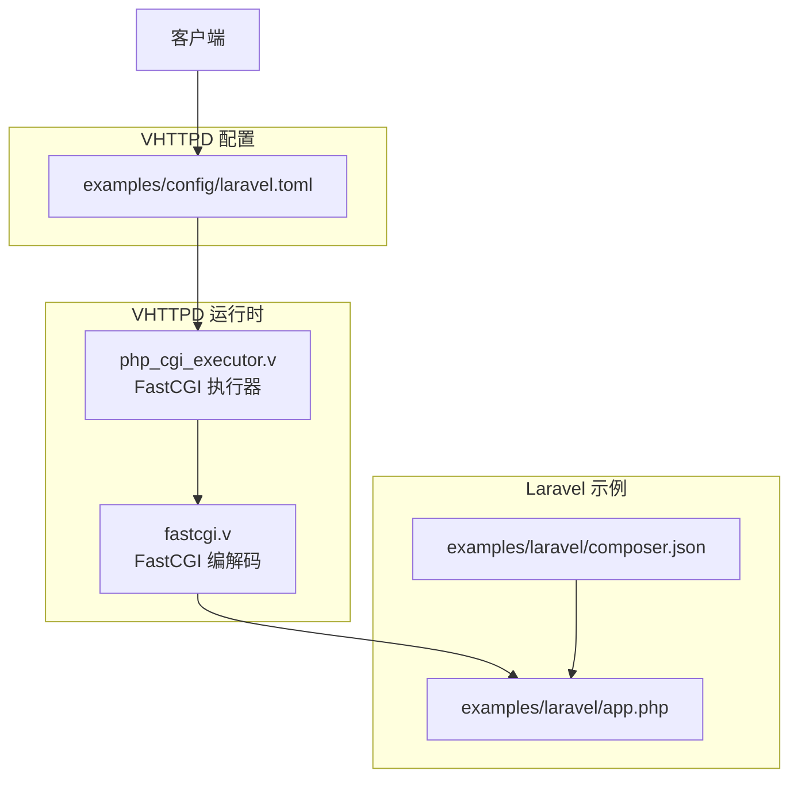
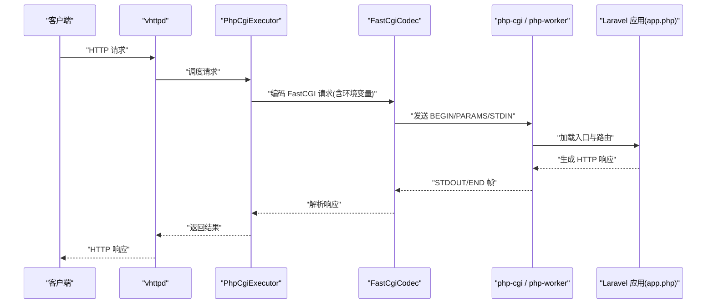
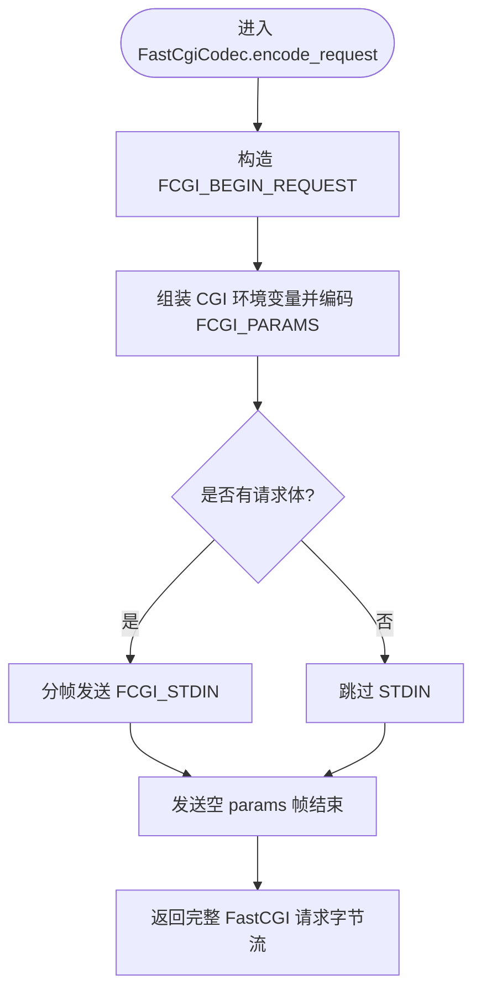
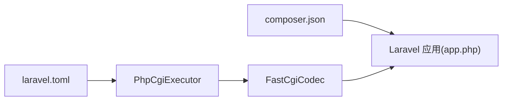

# Laravel 框架集成

<cite>
**本文引用的文件**   
- [README.md](file://README.md)
- [03-php-apps.md](file://articles/03-php-apps.md)
- [app.php](file://examples/laravel/app.php)
- [composer.json](file://examples/laravel/composer.json)
- [laravel.toml](file://examples/config/laravel.toml)
- [fastcgi.v](file://src/upstream/transport/fastcgi.v)
- [php_cgi_executor.v](file://src/executor/php_cgi_executor.v)
- [config.v](file://src/config/config.v)
</cite>

## 目录
1. [简介](#简介)
2. [项目结构](#项目结构)
3. [核心组件](#核心组件)
4. [架构总览](#架构总览)
5. [详细组件分析](#详细组件分析)
6. [依赖关系分析](#依赖关系分析)
7. [性能与优化](#性能与优化)
8. [故障排除指南](#故障排除指南)
9. [结论](#结论)
10. [附录](#附录)

## 简介
本文件面向希望在 VHTTPD 中部署和运行 Laravel 应用的开发者，提供从项目结构、依赖管理、路由与中间件集成、到 FastCGI 与 Worker 模式差异、环境变量、数据库连接、缓存策略、日志配置以及生产部署的完整指南。文档同时给出架构图与流程图，帮助读者快速理解请求在 vhttpd 与 PHP 应用之间的流转路径。

## 项目结构
Laravel 示例位于 examples/laravel 目录，包含最小可用的入口脚本与 composer 依赖定义；vhttpd 侧通过配置文件指定 worker 启动命令与应用入口，并通过 FastCGI 或 php-worker 执行器将 HTTP 请求转发给 PHP 进程。

图表来源
- [laravel.toml:1-23](file://examples/config/laravel.toml#L1-L23)
- [php_cgi_executor.v:1-118](file://src/executor/php_cgi_executor.v#L1-L118)
- [fastcgi.v:1-386](file://src/upstream/transport/fastcgi.v#L1-L386)
- [app.php:1-55](file://examples/laravel/app.php#L1-L55)
- [composer.json:1-9](file://examples/laravel/composer.json#L1-L9)

章节来源
- [README.md:437-518](file://README.md#L437-L518)
- [03-php-apps.md:37-159](file://articles/03-php-apps.md#L37-L159)

## 核心组件
- Laravel 应用入口：PSR-7 适配层 + Illuminate Router，负责路由与响应构建。
- vhttpd 配置：worker 池、socket、超时、环境变量等。
- FastCGI 执行器：将 HTTP 请求编码为 FastCGI 帧并发送给 php-cgi 进程。
- FastCGI 编解码：实现 CGI 环境变量映射、参数分帧、响应解析。

章节来源
- [app.php:1-55](file://examples/laravel/app.php#L1-L55)
- [laravel.toml:1-23](file://examples/config/laravel.toml#L1-L23)
- [php_cgi_executor.v:1-118](file://src/executor/php_cgi_executor.v#L1-L118)
- [fastcgi.v:1-386](file://src/upstream/transport/fastcgi.v#L1-L386)

## 架构总览
下图展示了 vhttpd 作为协议与运行时网关，如何将 HTTP 请求经 FastCGI 执行器转发至 php-cgi（或 php-worker），再由 Laravel 应用处理并返回响应。

图表来源
- [php_cgi_executor.v:42-82](file://src/executor/php_cgi_executor.v#L42-L82)
- [fastcgi.v:78-249](file://src/upstream/transport/fastcgi.v#L78-L249)
- [app.php:17-54](file://examples/laravel/app.php#L17-L54)

## 详细组件分析

### Laravel 应用入口与路由
- 入口脚本使用 PSR-7 接口接收请求，借助 Symfony HttpFoundation 与 Illuminate Request 进行转换，注册路由并返回 Illuminate Response，再转回 PSR-7 响应。
- 该模式适合在长驻 worker 中复用容器与路由器实例，减少重复初始化开销。

章节来源
- [app.php:1-55](file://examples/laravel/app.php#L1-L55)
- [03-php-apps.md:112-117](file://articles/03-php-apps.md#L112-L117)

### Composer 依赖管理
- 示例依赖包括 laravel/framework 及 PSR-7 桥接库，用于在 vhttpd 环境中完成 PSR-7 与框架对象模型互转。
- 建议在独立目录安装依赖，避免污染系统环境。

章节来源
- [composer.json:1-9](file://examples/laravel/composer.json#L1-L9)

### vhttpd 配置与 Worker 池
- 通过 TOML 配置 server、files、worker、admin 等段，设置监听地址、pid 与事件日志、worker 自动启动、读超时、池大小、socket 路径、worker 启动命令与环境变量。
- 关键环境变量 VHTTPD_APP 指向 Laravel 入口脚本，供 php-worker 识别应用入口。

章节来源
- [laravel.toml:1-23](file://examples/config/laravel.toml#L1-L23)
- [README.md:437-518](file://README.md#L437-L518)

### FastCGI 模式详解
- PhpCgiExecutor 负责选择 socket、设置读取超时、调用 FastCgiCodec 编码请求并解码响应。
- FastCgiCodec 将 HTTP 请求转换为 FastCGI 帧，构造标准 CGI 环境变量（如 REQUEST_METHOD、REQUEST_URI、SCRIPT_FILENAME、DOCUMENT_ROOT、HTTP_* 等），并按需分帧发送 PARAMS 与 STDIN，最后解析 STDOUT 中的 HTTP 头与 Body。

图表来源
- [fastcgi.v:78-249](file://src/upstream/transport/fastcgi.v#L78-L249)

章节来源
- [php_cgi_executor.v:42-82](file://src/executor/php_cgi_executor.v#L42-L82)
- [fastcgi.v:1-386](file://src/upstream/transport/fastcgi.v#L1-L386)

### Worker 模式（php-worker）说明
- 当使用 php-worker 时，vhttpd 通过自定义 worker 协议与外部 PHP 进程通信，支持更丰富的能力（如流式响应、WebSocket 事件等）。
- 在 php-worker 模式下，VHTTPD_APP 同样用于定位应用入口，但请求/响应语义由 vhttpd 与 php-worker 约定，而非 FastCGI。

章节来源
- [README.md:605-617](file://README.md#L605-L617)

### 环境变量与配置注入
- vhttpd 支持在 TOML 中使用 ${section.key} 与 ${env.NAME:-default} 展开变量，并在 worker.env 中向 php-worker 注入环境变量。
- 配置项如 worker.cmd、worker.socket、executor.kind 等均支持变量展开。

章节来源
- [README.md:437-518](file://README.md#L437-L518)
- [config.v:1589-1613](file://src/config/config.v#L1589-L1613)

### 数据库连接与缓存策略
- vhttpd 提供资源声明（resources.db.*、resources.cache.*）以集中管理数据库与缓存连接，可在 engines.php 中引用这些资源。
- 对于 Laravel 应用，建议通过环境变量或框架配置接入 vhttpd 提供的数据库与缓存后端，或在应用内直连外部服务。

章节来源
- [README.md:437-518](file://README.md#L437-L518)

### 日志配置
- 可通过 files.event_log 输出事件日志，便于追踪请求生命周期与 worker 状态。
- 生产环境建议开启 warn 级别以上日志，并结合外部日志采集系统。

章节来源
- [laravel.toml:5-7](file://examples/config/laravel.toml#L5-L7)
- [README.md:437-518](file://README.md#L437-L518)

## 依赖关系分析
- Laravel 应用依赖 laravel/framework 与 PSR-7 桥接库，入口脚本负责 PSR-7 与框架对象模型互转。
- vhttpd 通过 PhpCgiExecutor 与 FastCgiCodec 将 HTTP 请求转为 FastCGI 帧，交由 php-cgi 执行。
- 配置层通过 TOML 与变量展开机制，统一注入 worker 启动参数与环境变量。

图表来源
- [composer.json:1-9](file://examples/laravel/composer.json#L1-L9)
- [app.php:1-55](file://examples/laravel/app.php#L1-L55)
- [laravel.toml:1-23](file://examples/config/laravel.toml#L1-L23)
- [php_cgi_executor.v:1-118](file://src/executor/php_cgi_executor.v#L1-L118)
- [fastcgi.v:1-386](file://src/upstream/transport/fastcgi.v#L1-L386)

章节来源
- [composer.json:1-9](file://examples/laravel/composer.json#L1-L9)
- [app.php:1-55](file://examples/laravel/app.php#L1-L55)
- [laravel.toml:1-23](file://examples/config/laravel.toml#L1-L23)
- [php_cgi_executor.v:1-118](file://src/executor/php_cgi_executor.v#L1-L118)
- [fastcgi.v:1-386](file://src/upstream/transport/fastcgi.v#L1-L386)

## 性能与优化
- 合理设置 worker.pool_size 与 read_timeout_ms，避免过多进程导致上下文切换开销过大。
- 在 Laravel 入口中复用容器与路由器实例，减少每次请求的初始化成本。
- 启用事件日志与监控指标，结合外部采集系统进行容量规划与瓶颈定位。
- 对静态资源考虑使用独立的静态资源服务或 CDN，减轻应用服务器压力。

[本节为通用指导，不直接分析具体文件]

## 故障排除指南
- 无法解析 FastCGI 响应：检查 stdout/stderr 输出与响应格式是否符合 CGI 规范。
- 环境变量缺失：确认 VHTTPD_APP 与必要的环境变量已在 worker.env 中正确注入。
- 端口占用或 socket 不可用：检查 server.host/port 与 worker.socket 是否冲突或被防火墙拦截。
- 数据库连接失败：核对 resources.db.* 配置与网络连通性，必要时增加重试与超时策略。
- 日志无输出：确认 files.event_log 路径可写且权限正确。

章节来源
- [fastcgi.v:266-317](file://src/upstream/transport/fastcgi.v#L266-L317)
- [laravel.toml:1-23](file://examples/config/laravel.toml#L1-L23)

## 结论
通过在 vhttpd 中引入 Laravel 应用，并以 FastCGI 或 php-worker 作为执行器，可以在统一的运行时上获得更好的可观测性与扩展能力。配合合理的配置与优化策略，能够在保持 Laravel 生态的同时提升整体性能与稳定性。

[本节为总结性内容，不直接分析具体文件]

## 附录

### 从开发到生产的部署清单
- 准备 Laravel 应用与依赖，确保入口脚本可用。
- 编写 vhttpd TOML 配置，设置 server、worker、admin 与环境变量。
- 本地验证：启动 vhttpd 并访问示例路由。
- 生产部署：使用 systemd/launchd 模板管理进程，调整 pool_size、超时与日志级别。
- 监控与告警：接入事件日志与指标采集，建立健康检查与自愈策略。

章节来源
- [README.md:367-411](file://README.md#L367-L411)
- [laravel.toml:1-23](file://examples/config/laravel.toml#L1-L23)