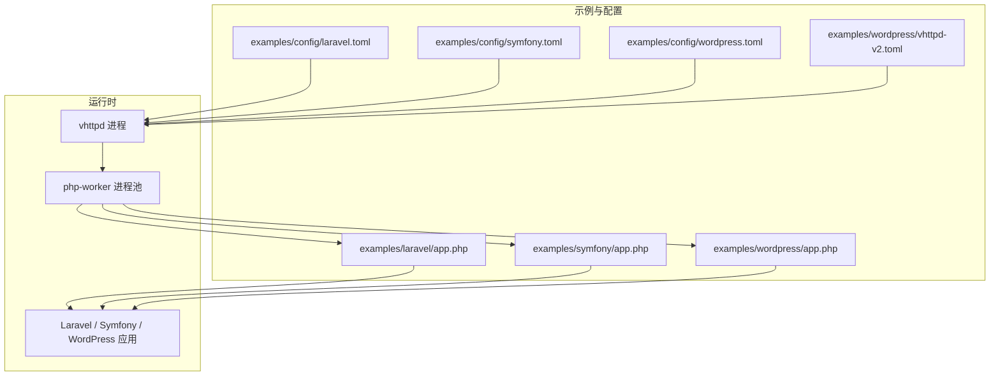
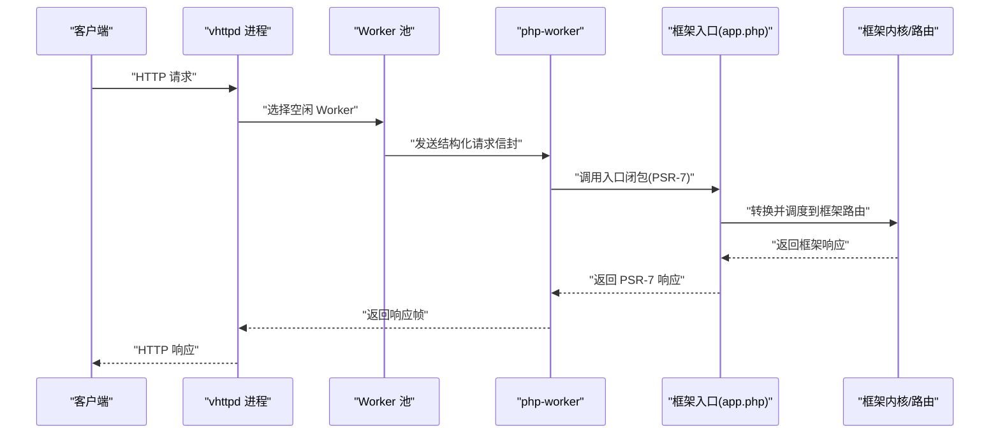
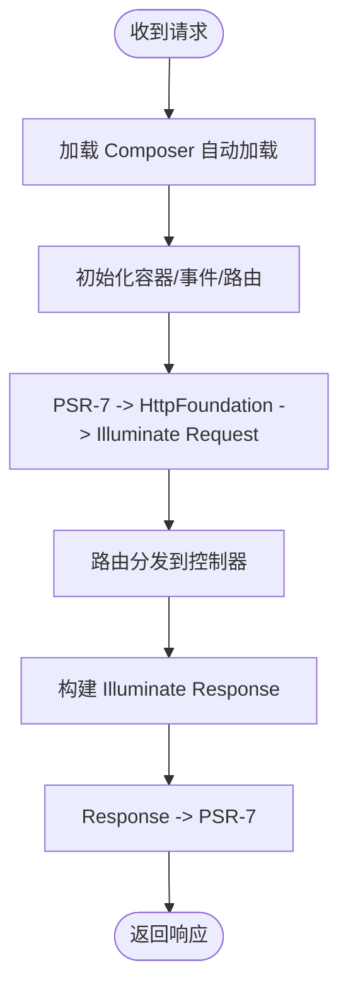
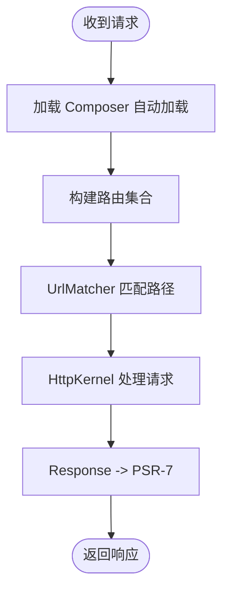
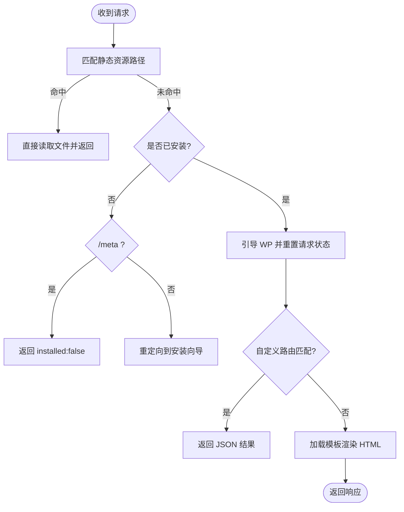
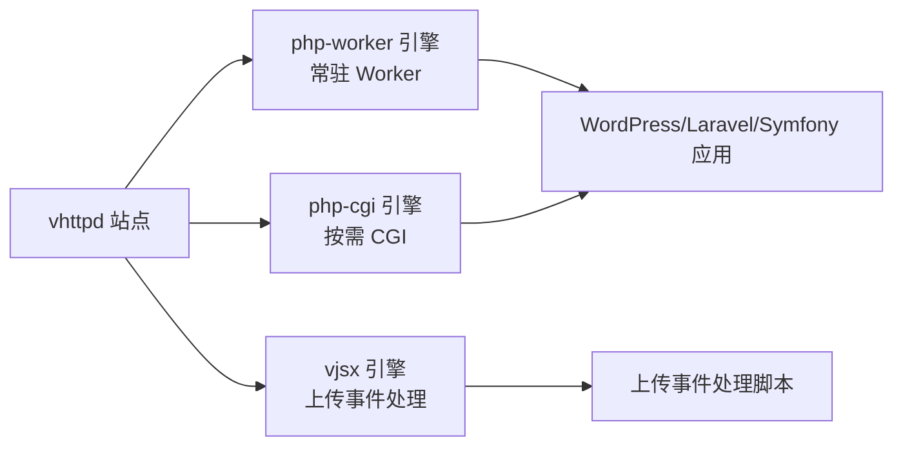
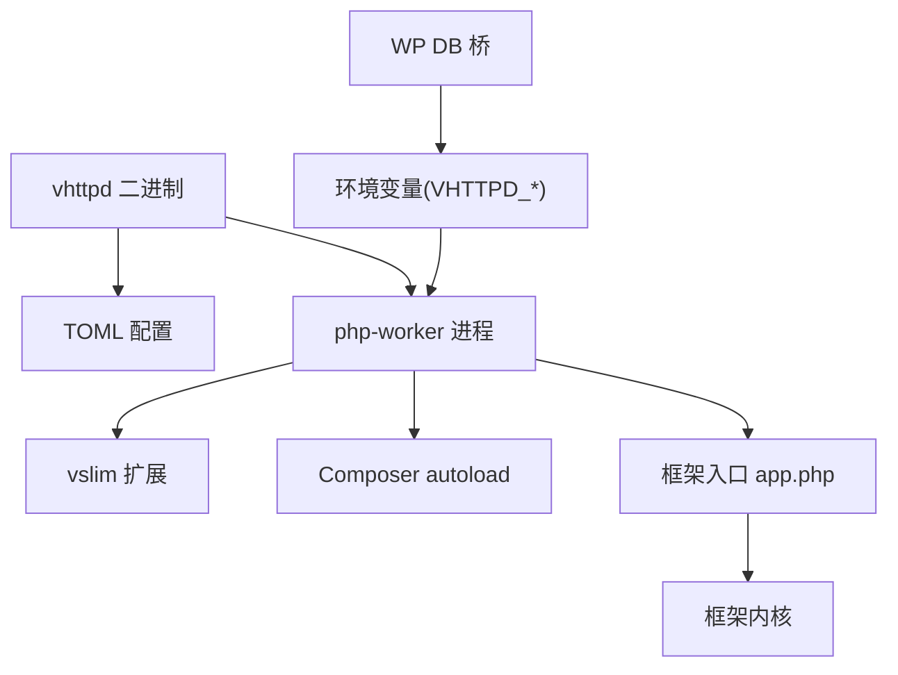

# PHP 框架集成示例

<cite>
**本文引用的文件**   
- [README.md](file://README.md)
- [03-php-apps.md](file://articles/03-php-apps.md)
- [vhttpd.example.toml](file://config/vhttpd.example.toml)
- [laravel.toml](file://examples/config/laravel.toml)
- [symfony.toml](file://examples/config/symfony.toml)
- [wordpress.toml](file://examples/config/wordpress.toml)
- [app.php（Laravel）](file://examples/laravel/app.php)
- [app.php（Symfony）](file://examples/symfony/app.php)
- [app.php（WordPress）](file://examples/wordpress/app.php)
- [README.md（Laravel 示例）](file://examples/laravel/README.md)
- [README.md（Symfony 示例）](file://examples/symfony/README.md)
- [README.md（WordPress 示例）](file://examples/wordpress/README.md)
- [vhttpd-v2.toml（WordPress v2）](file://examples/wordpress/vhttpd-v2.toml)
- [vhttpd-db.php（WP DB 桥）](file://php/package/wordpress/v-profiler/vhttpd-db.php)
</cite>

## 目录
1. [简介](#简介)
2. [项目结构](#项目结构)
3. [核心组件](#核心组件)
4. [架构总览](#架构总览)
5. [详细组件分析](#详细组件分析)
6. [依赖关系分析](#依赖关系分析)
7. [性能与生产部署](#性能与生产部署)
8. [故障排除指南](#故障排除指南)
9. [结论](#结论)
10. [附录](#附录)

## 简介
本文件面向在 VHTTPD 中集成三大主流 PHP 框架（Laravel、Symfony、WordPress）的开发者与运维人员，提供从开发到生产的完整迁移路径。内容涵盖：
- 各框架的项目结构与入口适配
- 配置文件设置与依赖管理
- Worker 模式下的运行差异与优化策略
- FastCGI 兼容与混合模式的取舍
- 生产环境部署与可观测性建议
- 常见问题排查方法

VHTTPD 将 HTTP/WebSocket/流式协议接入与 Worker 编排集中在运行时层，PHP 应用继续负责业务逻辑，从而在不改变既有框架代码的前提下获得现代运行时能力。

章节来源
- [README.md:1-120](file://README.md#L1-L120)
- [03-php-apps.md:1-120](file://articles/03-php-apps.md#L1-L120)

## 项目结构
仓库为多示例工程，包含三个框架的最小可用示例与对应配置：
- Laravel 示例：入口 app.php 通过 PSR-7 与框架内核对接
- Symfony 示例：入口 app.php 使用 HttpKernel + Routing 完成调度
- WordPress 示例：入口 app.php 封装生命周期，支持静态资源直出与安装态检测

图表来源
- [laravel.toml:1-23](file://examples/config/laravel.toml#L1-L23)
- [symfony.toml:1-22](file://examples/config/symfony.toml#L1-L22)
- [wordpress.toml:1-23](file://examples/config/wordpress.toml#L1-L23)
- [vhttpd-v2.toml（WordPress v2）:63-105](file://examples/wordpress/vhttpd-v2.toml#L63-L105)
- [app.php（Laravel）:1-55](file://examples/laravel/app.php#L1-L55)
- [app.php（Symfony）:1-67](file://examples/symfony/app.php#L1-L67)
- [app.php（WordPress）:1-252](file://examples/wordpress/app.php#L1-L252)

章节来源
- [README.md:430-618](file://README.md#L430-L618)
- [03-php-apps.md:112-171](file://articles/03-php-apps.md#L112-L171)

## 核心组件
- vhttpd 进程：负责协议接入、路由分发、Worker 池管理与可观测性
- php-worker：作为 PHP 侧边界，接收结构化请求信封并调用应用入口
- 框架入口适配：每个框架提供一个返回闭包的入口脚本，负责将 PSR-7 请求转换为框架原生对象并返回响应
- 配置系统：TOML 配置驱动站点、执行器、Worker 与环境变量注入

关键要点
- 统一请求信封：vhttpd 向 php-worker 发送标准化数组信封，避免重复解析
- Worker 长驻：通过 autostart/pool_size/socket 等参数实现常驻 Worker
- 环境变量注入：通过 worker.env 注入 VHTTPD_APP、VPHP_WP_ROOT 等

章节来源
- [README.md:1503-1559](file://README.md#L1503-L1559)
- [vhttpd.example.toml:1-67](file://config/vhttpd.example.toml#L1-L67)

## 架构总览
下图展示从客户端到框架应用的端到端流程，以及不同执行器与 Worker 的关系。

图表来源
- [README.md:1416-1445](file://README.md#L1416-L1445)
- [README.md:1503-1559](file://README.md#L1503-L1559)

## 详细组件分析

### Laravel 集成
- 入口脚本职责
  - 初始化容器与事件总线
  - 注册路由与控制器回调
  - 将 PSR-7 请求转换为 Illuminate Request，再派发得到 Response，最后转回 PSR-7
- 配置要点
  - 指定 worker.cmd 指向 php-worker
  - 通过 worker.env 注入 VHTTPD_APP 指向入口脚本
  - 端口、pid_file、event_log 等按站点隔离
- 验证方式
  - 访问 /laravel/hello/{name} 与 /laravel/meta?trace_id=...

图表来源
- [app.php（Laravel）:1-55](file://examples/laravel/app.php#L1-L55)
- [laravel.toml:1-23](file://examples/config/laravel.toml#L1-L23)

章节来源
- [README.md（Laravel 示例）:1-28](file://examples/laravel/README.md#L1-L28)
- [03-php-apps.md:112-171](file://articles/03-php-apps.md#L112-L171)
- [laravel.toml:1-23](file://examples/config/laravel.toml#L1-L23)
- [app.php（Laravel）:1-55](file://examples/laravel/app.php#L1-L55)

### Symfony 集成
- 入口脚本职责
  - 定义 RouteCollection 与控制器回调
  - 使用 UrlMatcher 匹配路径，交由 HttpKernel 处理
  - 将 Symfony Request/Response 与 PSR-7 双向转换
- 配置要点
  - 同 Laravel，worker.cmd 指向 php-worker，VHTTPD_APP 指向入口脚本
- 验证方式
  - 访问 /symfony/hello/{name} 与 /symfony/meta?trace_id=...

图表来源
- [app.php（Symfony）:1-67](file://examples/symfony/app.php#L1-L67)
- [symfony.toml:1-22](file://examples/config/symfony.toml#L1-L22)

章节来源
- [README.md（Symfony 示例）:1-28](file://examples/symfony/README.md#L1-L28)
- [03-php-apps.md:162-171](file://articles/03-php-apps.md#L162-L171)
- [symfony.toml:1-22](file://examples/config/symfony.toml#L1-L22)
- [app.php（Symfony）:1-67](file://examples/symfony/app.php#L1-L67)

### WordPress 集成
- 入口脚本职责
  - 生命周期封装：准备默认环境、检测是否已安装、按需引导 WP
  - 静态资源直出：对 wp-content/wp-includes/wp-admin 等静态路径直接返回文件
  - 未安装态：/meta 返回 installed:false，其他动态请求重定向至安装向导
  - 已安装态：重置请求运行时、渲染模板或返回自定义 JSON
- 配置要点
  - 基础模式：通过 wordpress.toml 指定 VPHP_WP_ROOT 与入口
  - v2 模式：通过 vhttpd-v2.toml 启用 engines.php-cgi 与 upload-events(vjsx)，并配置 deny_php/compat_php 白名单
- 验证方式
  - 访问 /meta 与 /post/{id}

图表来源
- [app.php（WordPress）:1-252](file://examples/wordpress/app.php#L1-L252)
- [wordpress.toml:1-23](file://examples/config/wordpress.toml#L1-L23)
- [vhttpd-v2.toml（WordPress v2）:63-105](file://examples/wordpress/vhttpd-v2.toml#L63-L105)

章节来源
- [README.md（WordPress 示例）:1-46](file://examples/wordpress/README.md#L1-L46)
- [app.php（WordPress）:1-252](file://examples/wordpress/app.php#L1-L252)
- [wordpress.toml:1-23](file://examples/config/wordpress.toml#L1-L23)
- [vhttpd-v2.toml（WordPress v2）:63-105](file://examples/wordpress/vhttpd-v2.toml#L63-L105)

### FastCGI 模式、Worker 模式与混合模式
- Worker 模式（推荐）
  - 通过 php-worker 长驻，减少启动开销，适合高并发与流式场景
  - 配置项：worker.autostart、pool_size、socket、cmd、worker.env
- FastCGI 兼容模式
  - 适用于需要兼容传统 CGI 入口的场景（例如部分 WordPress 内部入口）
  - 在 v2 配置中通过 engines.php-cgi 启用独立引擎，配合 deny_php/compat_php 控制资源访问
- 混合模式
  - 同一站点同时启用 php-worker 与 php-cgi：常规请求走 Worker，特定入口走 CGI
  - 结合 upload-events(vjsx) 等扩展能力，形成“Worker + CGI + 嵌入式 JS”的组合

图表来源
- [vhttpd-v2.toml（WordPress v2）:63-105](file://examples/wordpress/vhttpd-v2.toml#L63-L105)
- [README.md:191-209](file://README.md#L191-L209)

章节来源
- [README.md:191-209](file://README.md#L191-L209)
- [vhttpd-v2.toml（WordPress v2）:63-105](file://examples/wordpress/vhttpd-v2.toml#L63-L105)

## 依赖关系分析
- 外部依赖
  - PHP 运行时与扩展（如 vslim 扩展）
  - Composer 依赖（各框架示例均提供 composer.json）
- 运行时依赖
  - vhttpd 二进制与 TOML 配置
  - php-worker 进程与 Unix Socket
- 可选增强
  - WordPress DB/Object Cache 桥接：通过环境变量与 vendor/autoload 引入 vhttpd 提供的类

图表来源
- [vhttpd-db.php（WP DB 桥）:42-92](file://php/package/wordpress/v-profiler/vhttpd-db.php#L42-L92)
- [README.md:1416-1445](file://README.md#L1416-L1445)

章节来源
- [README.md:1416-1445](file://README.md#L1416-L1445)
- [vhttpd-db.php（WP DB 桥）:42-92](file://php/package/wordpress/v-profiler/vhttpd-db.php#L42-L92)

## 性能与生产部署
- Worker 池调优
  - pool_size：根据 CPU 核数与 I/O 特性调整
  - read_timeout_ms：合理设置以避免长连接阻塞
  - max_requests：周期性重启以释放内存碎片
- 静态资源与缓存
  - WordPress 示例内置静态资源直出，降低 PHP 负载
  - 可结合 vhttpd assets 模块对外部静态资源进行缓存控制
- 日志与可观测性
  - event_log 输出 NDJSON 事件，便于集中采集与分析
  - admin 接口暴露运行时与 Worker 状态
- 服务管理
  - Linux 使用 systemd 实例单元，macOS 使用 launchd
  - 多站点可通过多监听器或多实例部署

章节来源
- [README.md:367-411](file://README.md#L367-L411)
- [README.md:430-618](file://README.md#L430-L618)
- [README.md:1416-1445](file://README.md#L1416-L1445)

## 故障排除指南
- 常见错误定位
  - 未安装 WordPress：/meta 返回 installed:false；动态请求重定向安装向导
  - 直接访问受保护 PHP 入口：返回 501 提示需改用 CGI/compat 引擎
  - 缺少 vslim 扩展：检查 worker.cmd 中的 extension 路径是否正确
- 配置校验
  - 确认 VHTTPD_APP 与 VPHP_WP_ROOT 指向正确路径
  - 检查 socket 文件权限与路径是否存在
- 日志与调试
  - 查看 event_log 与 pid_file 辅助定位问题
  - 使用 admin 接口查看 Worker 活动与状态

章节来源
- [app.php（WordPress）:90-140](file://examples/wordpress/app.php#L90-L140)
- [README.md:430-618](file://README.md#L430-L618)

## 结论
通过在 vhttpd 之上采用统一的 Worker 模型与结构化请求信封，Laravel、Symfony 与 WordPress 可在不改动业务代码的前提下获得现代运行时能力。对于需要兼容传统 CGI 的场景，v2 配置提供了混合模式方案。结合静态资源直出、Worker 池调优与完善的可观测性，可实现从开发到生产的平滑迁移与稳定运行。

## 附录
- 快速开始
  - Laravel：参考示例 README 与 laravel.toml
  - Symfony：参考示例 README 与 symfony.toml
  - WordPress：参考示例 README、wordpress.toml 与 vhttpd-v2.toml
- 参考文档
  - 执行器模式说明：EXECUTOR_MODES.md
  - 站点 DSL 参考：SITE_CONFIG_DSL.md