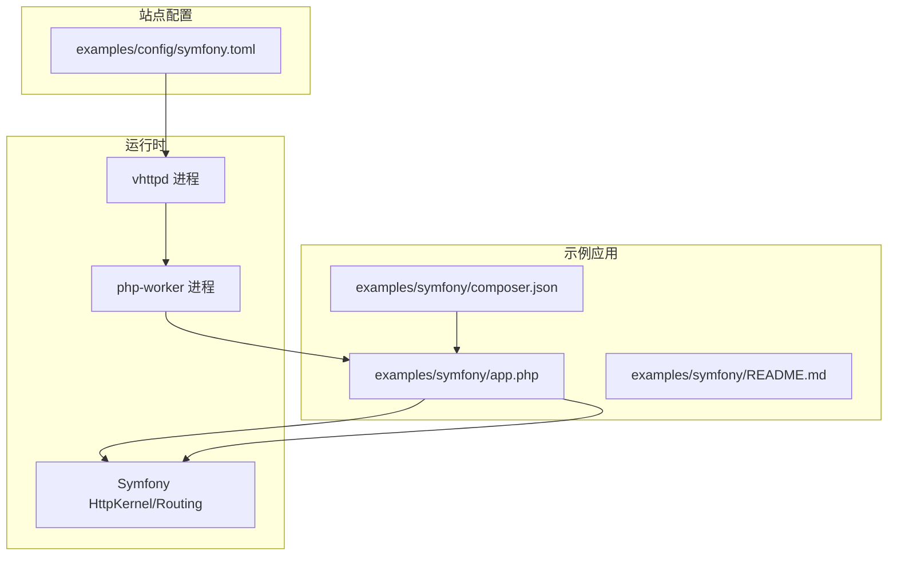
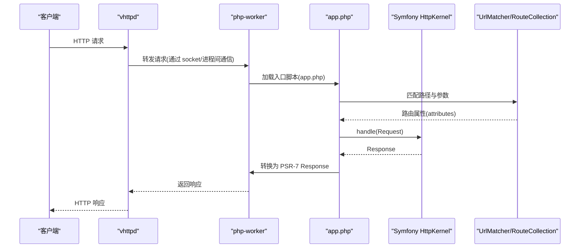
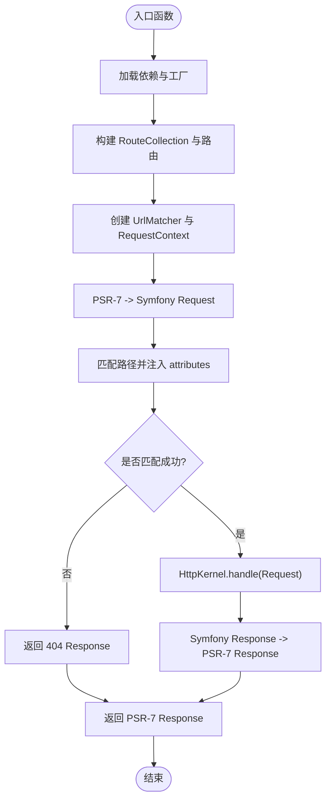
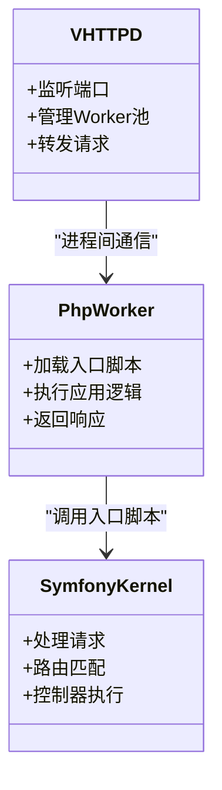
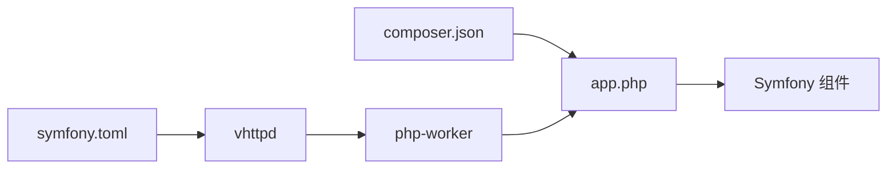

# Symfony 框架集成

<cite>
**本文引用的文件**
- [examples/symfony/README.md](file://examples/symfony/README.md)
- [examples/symfony/app.php](file://examples/symfony/app.php)
- [examples/symfony/composer.json](file://examples/symfony/composer.json)
- [examples/config/symfony.toml](file://examples/config/symfony.toml)
- [README.md](file://README.md)
- [src/executor/registry.v](file://src/executor/registry.v)
- [articles/03-php-apps.md](file://articles/03-php-apps.md)
</cite>

## 目录
1. [简介](#简介)
2. [项目结构](#项目结构)
3. [核心组件](#核心组件)
4. [架构总览](#架构总览)
5. [详细组件分析](#详细组件分析)
6. [依赖关系分析](#依赖关系分析)
7. [性能考虑](#性能考虑)
8. [故障排查指南](#故障排查指南)
9. [结论](#结论)
10. [附录](#附录)

## 简介
本文件面向希望在 VHTTPD 中部署 Symfony 应用的开发者与运维人员，提供从项目初始化、依赖安装、路由配置到服务容器集成的完整流程说明。文档同时覆盖运行模式（Worker 与 FastCGI）的配置要点、性能调优建议，以及数据库迁移、缓存、日志与错误处理的最佳实践。示例基于仓库中的最小可运行 Symfony 集成样例，便于快速上手并逐步扩展至生产环境。

## 项目结构
VHTTPD 的 Symfony 集成示例位于 examples/symfony 目录，包含入口脚本与依赖声明；对应的站点运行配置位于 examples/config/symfony.toml。整体结构如下：

图示来源
- [examples/symfony/app.php:1-67](file://examples/symfony/app.php#L1-L67)
- [examples/symfony/composer.json:1-13](file://examples/symfony/composer.json#L1-L13)
- [examples/config/symfony.toml:1-22](file://examples/config/symfony.toml#L1-L22)

章节来源
- [examples/symfony/README.md:1-28](file://examples/symfony/README.md#L1-L28)
- [examples/symfony/app.php:1-67](file://examples/symfony/app.php#L1-L67)
- [examples/symfony/composer.json:1-13](file://examples/symfony/composer.json#L1-L13)
- [examples/config/symfony.toml:1-22](file://examples/config/symfony.toml#L1-L22)

## 核心组件
- 应用入口与 PSR-7 桥接：通过 app.php 将外部请求转换为 Symfony Request，交由 HttpKernel 处理，再将 Response 转换回 PSR-7 对象返回给 vhttpd。
- 路由与控制器：示例使用 RouteCollection + UrlMatcher 动态注册路由，控制器为闭包形式，直接返回 Response 或 JsonResponse。
- Composer 依赖：引入 symfony/http-kernel、symfony/routing、symfony/http-foundation、symfony/event-dispatcher、symfony/psr-http-message-bridge 与 nyholm/psr7。
- 站点配置：通过 examples/config/symfony.toml 指定监听地址、worker 启动命令与环境变量（如 VHTTPD_APP），由 vhttpd 拉起 php-worker 执行应用入口。

章节来源
- [examples/symfony/app.php:1-67](file://examples/symfony/app.php#L1-L67)
- [examples/symfony/composer.json:1-13](file://examples/symfony/composer.json#L1-L13)
- [examples/config/symfony.toml:1-22](file://examples/config/symfony.toml#L1-L22)

## 架构总览
下图展示了在 VHTTPD 中运行 Symfony 的整体调用链：客户端请求进入 vhttpd，vhttpd 将请求转发给 php-worker，php-worker 加载 app.php，app.php 完成 PSR-7 与 Symfony 之间的双向转换，最终由 Symfony 内核处理并返回响应。

图示来源
- [examples/symfony/app.php:1-67](file://examples/symfony/app.php#L1-L67)
- [README.md:1416-1462](file://README.md#L1416-L1462)

章节来源
- [README.md:1416-1462](file://README.md#L1416-L1462)
- [examples/symfony/app.php:1-67](file://examples/symfony/app.php#L1-L67)

## 详细组件分析

### 应用入口与 PSR-7 桥接
- 职责：接收来自 vhttpd/php-worker 的 PSR-7 ServerRequestInterface，将其转换为 Symfony Request，交由 HttpKernel 处理，再将 Symfony Response 转换回 PSR-7 Response。
- 关键点：
  - 使用静态变量缓存路由集合、匹配器、工厂实例，避免每次请求重复构建，提升性能。
  - 通过 UrlMatcher 匹配路径并注入 attributes，再由 ControllerResolver 解析控制器并执行。
  - 对未匹配的路径进行 404 处理，确保健壮性。
- 扩展点：可在入口中注册事件监听器、中间件或自定义 ArgumentResolver，以增强请求处理链路。

图示来源
- [examples/symfony/app.php:1-67](file://examples/symfony/app.php#L1-L67)

章节来源
- [examples/symfony/app.php:1-67](file://examples/symfony/app.php#L1-L67)

### 路由与控制器
- 路由定义：示例使用 RouteCollection 动态添加路由，支持路径参数与查询参数。
- 控制器实现：采用闭包控制器，直接返回 Response 或 JsonResponse，适合轻量级集成场景。
- 最佳实践：
  - 对于大型应用，建议将路由与控制器拆分到独立文件或类中，并通过配置文件或注解/属性方式集中管理。
  - 利用 Symfony 的事件系统（EventDispatcher）注册全局监听器，统一处理跨切面逻辑（如鉴权、审计）。

章节来源
- [examples/symfony/app.php:1-67](file://examples/symfony/app.php#L1-L67)

### Composer 依赖与版本约束
- 依赖清单：包括 http-kernel、routing、http-foundation、event-dispatcher、psr-http-message-bridge 与 nyholm/psr7。
- 版本策略：示例使用较新的主版本范围，便于获得最新特性与安全更新。
- 建议：
  - 在生产环境中锁定具体版本号，避免意外升级导致兼容性问题。
  - 按需引入组件，减少不必要的依赖体积。

章节来源
- [examples/symfony/composer.json:1-13](file://examples/symfony/composer.json#L1-L13)

### 站点配置与运行模式
- Worker 模式（推荐）：
  - 通过 examples/config/symfony.toml 配置 worker.cmd 指向 php-worker，设置 VHTTPD_APP 环境变量指向应用入口。
  - vhttpd 自动注入 VHTTPD_APP 到 worker 环境，便于 PHP 侧读取入口路径。
- FastCGI 模式：
  - 可通过 executor.kind = "php-cgi" 启用 php-cgi 执行器，适用于传统 CGI 部署场景。
  - 该模式下 vhttpd 会生成 php-cgi 命令并绑定 socket，适合与现有基础设施对接。

图示来源
- [examples/config/symfony.toml:1-22](file://examples/config/symfony.toml#L1-L22)
- [src/executor/registry.v:354-386](file://src/executor/registry.v#L354-L386)

章节来源
- [examples/config/symfony.toml:1-22](file://examples/config/symfony.toml#L1-L22)
- [src/executor/registry.v:354-386](file://src/executor/registry.v#L354-L386)
- [README.md:447-531](file://README.md#L447-L531)

### 事件监听器与中间件
- 事件系统：示例已引入 symfony/event-dispatcher，可在入口中注册监听器，处理内核事件（如请求开始、响应结束、异常等）。
- 中间件模式：可通过自定义 EventSubscriber 或 Kernel 事件监听器实现类似中间件的横切逻辑。
- 建议：
  - 将通用逻辑（如日志、追踪、安全头）封装为独立监听器，保持控制器简洁。
  - 使用事件优先级控制执行顺序，避免副作用冲突。

章节来源
- [examples/symfony/app.php:1-67](file://examples/symfony/app.php#L1-L67)

### Bundle 注册与容器集成
- 现状：示例采用“无全量框架”的最小集成方式，仅引入必要组件，不依赖完整的 Symfony 应用骨架。
- 扩展建议：
  - 若需使用 Bundle 与容器，可将标准 Symfony 应用结构（含 Kernel、Bundle 注册、服务定义）与当前入口脚本结合，通过 HttpKernel 统一处理请求。
  - 在入口中初始化 Kernel 实例，并根据 APP_ENV 与 APP_DEBUG 切换调试模式。

章节来源
- [articles/03-php-apps.md:400-423](file://articles/03-php-apps.md#L400-L423)

## 依赖关系分析
- 应用层：app.php 依赖 Symfony 核心组件与 PSR-7 桥接库。
- 运行时层：vhttpd 负责网络 I/O 与进程管理，php-worker 作为 PHP 边界，app.php 作为应用入口。
- 配置层：TOML 配置驱动 vhttpd 行为，包括监听地址、worker 参数、环境变量注入等。

图示来源
- [examples/symfony/composer.json:1-13](file://examples/symfony/composer.json#L1-L13)
- [examples/symfony/app.php:1-67](file://examples/symfony/app.php#L1-L67)
- [examples/config/symfony.toml:1-22](file://examples/config/symfony.toml#L1-L22)

章节来源
- [examples/symfony/composer.json:1-13](file://examples/symfony/composer.json#L1-L13)
- [examples/symfony/app.php:1-67](file://examples/symfony/app.php#L1-L67)
- [examples/config/symfony.toml:1-22](file://examples/config/symfony.toml#L1-L22)

## 性能考虑
- 持久化 Worker：利用 php-worker 的持久化特性，在应用内维护数据库连接池、配置缓存与预热状态，减少每次请求的初始化开销。
- 路由与工厂缓存：示例已在入口中使用静态变量缓存路由集合与工厂实例，避免重复构建，提升吞吐。
- 资源限制：根据服务器 CPU 核心数调整 worker pool_size，并结合 max_requests 定期重启以避免内存泄漏。
- 流式响应：如需 SSE 或文本流，可利用 vhttpd 的流式帧能力，降低缓冲延迟。

章节来源
- [articles/03-php-apps.md:447-483](file://articles/03-php-apps.md#L447-L483)
- [README.md:1438-1445](file://README.md#L1438-L1445)

## 故障排查指南
- 启动失败：检查 vhttpd 日志与事件日志，确认 worker 启动命令与环境变量是否正确。
- 路由未命中：验证路由路径与参数是否与请求一致，必要时增加调试输出或启用 Symfony 调试模式。
- 性能问题：监控 worker 池大小、队列容量与超时设置，结合业务负载调整参数。
- 依赖缺失：确保 composer install 成功，vendor/autoload.php 可被正确加载。

章节来源
- [examples/symfony/README.md:1-28](file://examples/symfony/README.md#L1-L28)
- [examples/config/symfony.toml:1-22](file://examples/config/symfony.toml#L1-L22)

## 结论
通过在 VHTTPD 中集成 Symfony，开发者可以在保持现有业务逻辑不变的前提下，享受高性能、可扩展的运行环境。示例提供了最小可行的集成方案，便于快速验证与迭代。随着应用复杂度增长，可逐步引入 Bundle、容器与更丰富的 Symfony 生态组件，同时结合 vhttpd 的 Worker 管理与流式能力，构建高可用、低延迟的现代 Web 应用。

## 附录
- 快速启动：参考 examples/symfony/README.md 中的步骤，安装依赖并启动服务。
- 配置参考：查看 examples/config/symfony.toml 与 README.md 中的配置示例，了解 Worker 与 FastCGI 模式的差异。
- 扩展阅读：articles/03-php-apps.md 提供了更完整的 Symfony 集成示例与最佳实践。

章节来源
- [examples/symfony/README.md:1-28](file://examples/symfony/README.md#L1-L28)
- [examples/config/symfony.toml:1-22](file://examples/config/symfony.toml#L1-L22)
- [articles/03-php-apps.md:400-483](file://articles/03-php-apps.md#L400-L483)