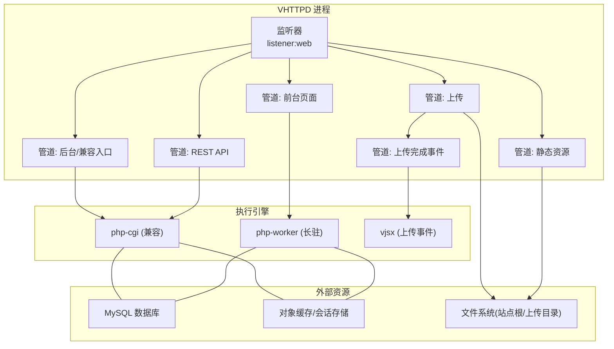
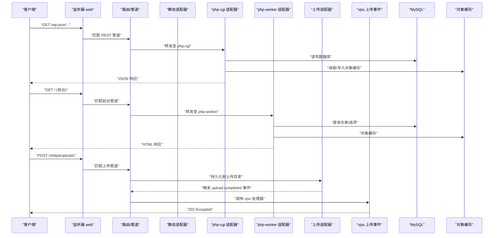
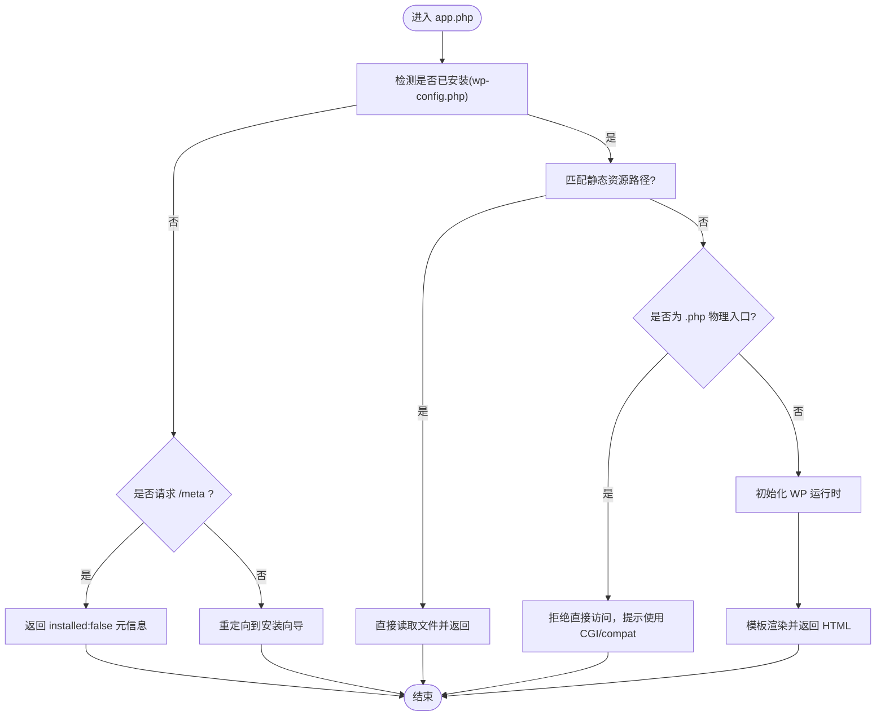
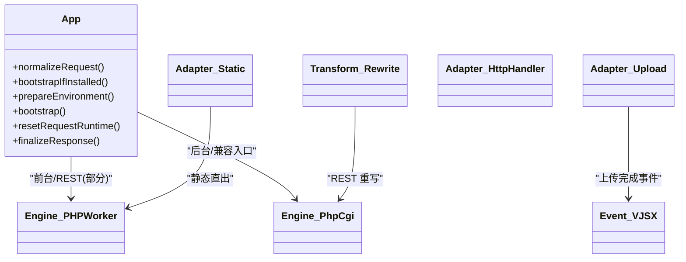

# WordPress 集成

<cite>
**本文引用的文件**   
- [examples/wordpress/README.md](file://examples/wordpress/README.md)
- [examples/wordpress/vhttpd.toml](file://examples/wordpress/vhttpd.toml)
- [examples/wordpress/vhttpd-v2.toml](file://examples/wordpress/vhttpd-v2.toml)
- [examples/wordpress/vhttpd-split.toml](file://examples/wordpress/vhttpd-split.toml)
- [examples/wordpress/vhttpd-cgi.toml](file://examples/wordpress/vhttpd-cgi.toml)
- [examples/wordpress/app.php](file://examples/wordpress/app.php)
- [examples/wordpress/wp-load.php](file://examples/wordpress/wp-load.php)
- [examples/wordpress/upload-events.mts](file://examples/wordpress/upload-events.mts)
- [php/package/README.md](file://php/package/README.md)
- [php/package/wordpress/vhttpd-db.php](file://php/package/wordpress/vhttpd-db.php)
- [docs/CONFIGURATION_MODEL_V2.md](file://docs/CONFIGURATION_MODEL_V2.md)
</cite>

## 目录
1. [简介](#简介)
2. [项目结构](#项目结构)
3. [核心组件](#核心组件)
4. [架构总览](#架构总览)
5. [详细组件分析](#详细组件分析)
6. [依赖关系分析](#依赖关系分析)
7. [性能与缓存策略](#性能与缓存策略)
8. [安全加固与访问控制](#安全加固与访问控制)
9. [多站点与 CDN 集成](#多站点与-cdn-集成)
10. [上传与事件处理](#上传与事件处理)
11. [数据库连接优化](#数据库连接优化)
12. [主题与插件兼容性](#主题与插件兼容性)
13. [重写规则与生命周期钩子](#重写规则与生命周期钩子)
14. [运维指南：监控、备份与故障诊断](#运维指南监控备份与故障诊断)
15. [结论](#结论)

## 简介
本文件面向在 VHTTPD 中部署 WordPress 的工程师与运维人员，提供从配置到运行、从静态资源到动态路由、从数据库与对象缓存到上传事件处理的完整实践。文档基于仓库内示例与官方说明，覆盖 v1/v2 两套配置模型、PHP 长驻 worker 与 php-cgi 双池分流、REST API 重写、WooCommerce 兼容路径、响应缓存旁路策略、以及上传完成回调等关键能力。

## 项目结构
WordPress 相关示例位于 examples/wordpress，包含多种运行模式与配置样例：
- v1 配置（executors/routes）：vhttpd.toml
- v2 配置（listeners/resources/engines/adapters/pipelines）：vhttpd-v2.toml
- 拆分路由演示：vhttpd-split.toml、vhttpd-cgi.toml
- PHP 应用入口与桥接逻辑：app.php、wp-load.php
- 上传事件处理器（vjsx）：upload-events.mts
- 配套说明：README.md
- 运行时包说明与 WP DB/Object Cache 桥接：php/package/README.md、php/package/wordpress/vhttpd-db.php

图示来源
- [examples/wordpress/vhttpd-v2.toml:1-434](file://examples/wordpress/vhttpd-v2.toml#L1-L434)
- [examples/wordpress/vhttpd.toml:1-290](file://examples/wordpress/vhttpd.toml#L1-L290)

章节来源
- [examples/wordpress/README.md:1-46](file://examples/wordpress/README.md#L1-L46)
- [examples/wordpress/vhttpd-v2.toml:1-434](file://examples/wordpress/vhttpd-v2.toml#L1-L434)
- [examples/wordpress/vhttpd.toml:1-290](file://examples/wordpress/vhttpd.toml#L1-L290)

## 核心组件
- 应用入口 app.php：负责 WordPress 安装态检测、静态资源直出、WP 启动与模板渲染、重定向拦截与错误封装。
- 执行器与适配器：php-worker 用于高性能前台；php-cgi 用于管理后台与兼容入口；static 用于静态资源；upload 用于大文件上传；vjsx 用于上传完成事件处理。
- 资源与存储：MySQL 数据库、对象缓存（session-store）、站点根与独立上传目录。
- 路由与管道：按路径、方法、查询参数进行精细化分流，并附加缓存策略与安全策略。

章节来源
- [examples/wordpress/app.php:1-252](file://examples/wordpress/app.php#L1-L252)
- [examples/wordpress/vhttpd-v2.toml:1-434](file://examples/wordpress/vhttpd-v2.toml#L1-L434)
- [examples/wordpress/vhttpd.toml:1-290](file://examples/wordpress/vhttpd.toml#L1-L290)

## 架构总览
下图展示了 v2 配置下的请求流转：监听器接收 HTTP，管道匹配后选择静态直出、php-cgi 或 php-worker，上传走 upload 适配器并在完成后触发 vjsx 事件处理。

图示来源
- [examples/wordpress/vhttpd-v2.toml:196-434](file://examples/wordpress/vhttpd-v2.toml#L196-L434)
- [examples/wordpress/upload-events.mts:1-25](file://examples/wordpress/upload-events.mts#L1-L25)

## 详细组件分析

### 应用入口 app.php
- 安装态检测：若未检测到 wp-config.php，返回框架元信息或重定向至安装流程。
- 静态资源直达：对 wp-content、wp-includes、favicon.ico、robots.txt 等直接读取本地文件并以合适 MIME 类型返回。
- 常驻加载：已安装且非物理 PHP 入口时，初始化 WordPress 环境并交由模板渲染。
- 重定向拦截：自定义 wp_redirect 抛出异常，统一转换为响应头 Location 与状态码。
- 错误封装：捕获异常并输出结构化错误信息。

图示来源
- [examples/wordpress/app.php:1-252](file://examples/wordpress/app.php#L1-L252)

章节来源
- [examples/wordpress/app.php:1-252](file://examples/wordpress/app.php#L1-L252)

### v1 配置（executors + routes）
- 定义两个 PHP 执行器：php（长驻）与 php-cgi（兼容），分别设置 socket、队列容量与超时。
- 通过 deny_php 与 compat_php 限制敏感 PHP 文件与需要兼容模式的入口。
- 路由规则按顺序匹配：静态后缀直出、wp-content/wp-includes 目录直出、REST API 走 php-cgi、WooCommerce 账户页与 AJAX 走 php-cgi、前台 GET 走 php-worker 并启用短 TTL 缓存与 Cookie 旁路。

章节来源
- [examples/wordpress/vhttpd.toml:1-290](file://examples/wordpress/vhttpd.toml#L1-L290)

### v2 配置（listeners/resources/engines/adapters/pipelines）
- 监听器：HTTP/TLS 监听端口。
- 资源：MySQL、对象缓存（session-store）、站点根与上传目录。
- 引擎：php-worker 与 php-cgi 双引擎，注入资源与环境变量。
- 适配器：http-handler（php-worker/php-cgi）、static、upload、fixed-response。
- 管道：按路径与方法精细分流，组合策略（缓存、限流、响应头）。
- 转换：wp-json 重写为 index.php?rest_route=...；上传完成事件调用 vjsx 处理器。

章节来源
- [examples/wordpress/vhttpd-v2.toml:1-434](file://examples/wordpress/vhttpd-v2.toml#L1-L434)
- [docs/CONFIGURATION_MODEL_V2.md:620-754](file://docs/CONFIGURATION_MODEL_V2.md#L620-L754)

### 拆分路由与 CGI 模式
- vhttpd-split.toml：演示将不同路径分发到 static、php-cgi 等不同执行器。
- vhttpd-cgi.toml：仅使用 php-cgi 执行器的最小配置。

章节来源
- [examples/wordpress/vhttpd-split.toml:1-56](file://examples/wordpress/vhttpd-split.toml#L1-L56)
- [examples/wordpress/vhttpd-cgi.toml:1-18](file://examples/wordpress/vhttpd-cgi.toml#L1-L18)

## 依赖关系分析
- 应用入口依赖 WordPress 运行时与 vhttpd 提供的 DB/Cache 桥接。
- v2 配置将资源（db/cache/storage）注入到引擎，并通过适配器与管道组织请求流。
- 上传事件由 vjsx 处理器异步处理，避免阻塞主请求链路。

图示来源
- [examples/wordpress/app.php:1-252](file://examples/wordpress/app.php#L1-L252)
- [examples/wordpress/vhttpd-v2.toml:1-434](file://examples/wordpress/vhttpd-v2.toml#L1-L434)
- [examples/wordpress/upload-events.mts:1-25](file://examples/wordpress/upload-events.mts#L1-L25)

## 性能与缓存策略
- 静态资源：按扩展名与目录直出，设置 immutable 或短期缓存。
- 前台页面：匿名请求启用短 TTL 缓存，带特定 Cookie 自动旁路。
- WooCommerce：购物车/结账/账户页强制 private,no-store，避免缓存污染。
- REST API：通过 php-cgi 执行，确保长输出与流式场景稳定。

章节来源
- [examples/wordpress/vhttpd.toml:120-290](file://examples/wordpress/vhttpd.toml#L120-L290)
- [examples/wordpress/vhttpd-v2.toml:147-174](file://examples/wordpress/vhttpd-v2.toml#L147-L174)

## 安全加固与访问控制
- 禁止直接访问敏感 PHP 文件（如 wp-config.php、wp-load.php、wp-settings.php、wp-blog-header.php）。
- 禁止上传目录、wp-includes、wp-admin/includes 下任意 .php 被直接访问。
- 为 REST OPTIONS 与上传响应添加 nosniff 等安全头。
- 通过固定响应适配器返回 403 阻断危险路径。

章节来源
- [examples/wordpress/vhttpd.toml:45-66](file://examples/wordpress/vhttpd.toml#L45-L66)
- [examples/wordpress/vhttpd-v2.toml:243-264](file://examples/wordpress/vhttpd-v2.toml#L243-L264)

## 多站点与 CDN 集成
- 多站点：在同一 vhttpd 实例上通过多个 listeners 与 pipelines 区分站点域名与根目录，复用 engines 与 resources。
- CDN：为静态资源设置 immutable 缓存，结合版本化文件名；对动态页面使用 short TTL 与 Cookie 旁路策略，保证 CDN 边缘缓存命中同时避免用户态数据污染。

章节来源
- [examples/wordpress/vhttpd-v2.toml:209-240](file://examples/wordpress/vhttpd-v2.toml#L209-L240)
- [examples/wordpress/vhttpd.toml:132-161](file://examples/wordpress/vhttpd.toml#L132-L161)

## 上传与事件处理
- 上传接口：/vhttpd/uploads 支持 POST/PUT，最大体积极大，落盘到独立目录。
- 完成事件：上传完成后触发 upload.completed 事件，由 vjsx 处理器记录日志并返回 202。
- 安全头：nosniff 防止 MIME 嗅探。

章节来源
- [examples/wordpress/vhttpd.toml:122-131](file://examples/wordpress/vhttpd.toml#L122-L131)
- [examples/wordpress/vhttpd-v2.toml:196-208](file://examples/wordpress/vhttpd-v2.toml#L196-L208)
- [examples/wordpress/upload-events.mts:1-25](file://examples/wordpress/upload-events.mts#L1-L25)

## 数据库连接优化
- 连接池：通过 MySQL 资源定义 pool_size、idle_ping_ms、init_sql（utf8mb4、sql_mode 调整）。
- 桥接：在 wp-config.php 中引入 vhttpd-db.php，使 $wpdb 走 vhttpd 的 DB 协议与连接池。
- 环境变量：VHTTPD_DB_SOCKET、VHTTPD_DB_POOL、VHTTPD_DB_TIMEOUT_MS 在引擎 env 中配置。

章节来源
- [examples/wordpress/vhttpd-v2.toml:20-33](file://examples/wordpress/vhttpd-v2.toml#L20-L33)
- [php/package/README.md:570-586](file://php/package/README.md#L570-L586)
- [php/package/wordpress/vhttpd-db.php:1-9](file://php/package/wordpress/vhttpd-db.php#L1-L9)

## 主题与插件兼容性
- 前台长驻 worker 适合大多数主题与插件；涉及长输出、流式响应或复杂表单的场景建议走 php-cgi。
- WooCommerce 的购物车/结账/账户页与 AJAX 明确走 php-cgi，避免状态不一致。
- 对于直接访问 .php 入口的请求，app.php 会拒绝并提示使用兼容执行器。

章节来源
- [examples/wordpress/app.php:119-140](file://examples/wordpress/app.php#L119-L140)
- [examples/wordpress/vhttpd.toml:186-200](file://examples/wordpress/vhttpd.toml#L186-L200)
- [examples/wordpress/vhttpd-v2.toml:329-337](file://examples/wordpress/vhttpd-v2.toml#L329-L337)

## 重写规则与生命周期钩子
- REST API 重写：/wp-json/* 经 transform 重写为 /index.php?rest_route=$path_remainder。
- 生命周期钩子：app.php 中通过 prepareEnvironment/bootstrap/resetRequestRuntime 等阶段控制 WP 启动与请求隔离；wp_redirect 被拦截以统一重定向行为。
- 前端元信息：/meta 接口返回框架与站点基本信息，便于健康检查与调试。

章节来源
- [examples/wordpress/vhttpd-v2.toml:185-190](file://examples/wordpress/vhttpd-v2.toml#L185-L190)
- [examples/wordpress/app.php:18-22](file://examples/wordpress/app.php#L18-L22)
- [examples/wordpress/app.php:148-162](file://examples/wordpress/app.php#L148-L162)

## 运维指南：监控、备份与故障诊断
- 可观测性：v2 配置开启 event_log 输出 NDJSON 事件，便于集中采集与分析。
- 健康检查：访问 /meta 判断安装态与站点元信息。
- 故障定位：
  - 未安装：/meta 返回 installed:false，其他动态请求提示 wp_config_missing。
  - 直接访问 .php 入口：返回 direct_php_script_unsupported，需改用 php-cgi。
  - 上传失败：检查上传目录权限与 max_body_bytes 策略。
- 备份恢复：
  - 数据库：定期导出 MySQL 库，注意 utf8mb4 与 sql_mode 一致性。
  - 文件：备份站点根与上传目录，保持对象缓存与 session-store 的幂等重建。
- 性能调优：
  - 根据并发调整 php-worker 与 php-cgi 的 pool_size 与 queue_capacity。
  - 合理设置前台页面 response_cache_ttl_ms 与 cache_control。
  - 关注 idle_ping_ms 与 init_sql 对连接稳定性影响。

章节来源
- [examples/wordpress/vhttpd-v2.toml:6-8](file://examples/wordpress/vhttpd-v2.toml#L6-L8)
- [examples/wordpress/app.php:91-117](file://examples/wordpress/app.php#L91-L117)
- [examples/wordpress/README.md:36-46](file://examples/wordpress/README.md#L36-L46)

## 结论
通过在 VHTTPD 中采用 php-worker 与 php-cgi 双执行器、细粒度管道与策略、以及对象缓存与上传事件机制，可以在保留 WordPress 生态的同时获得现代运行时的高性能与可观测性。配合严格的安全策略与合理的缓存旁路，既能保障前台吞吐，又能确保后台与电商场景的正确性与一致性。