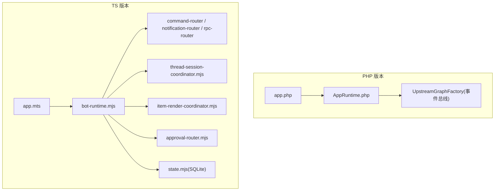
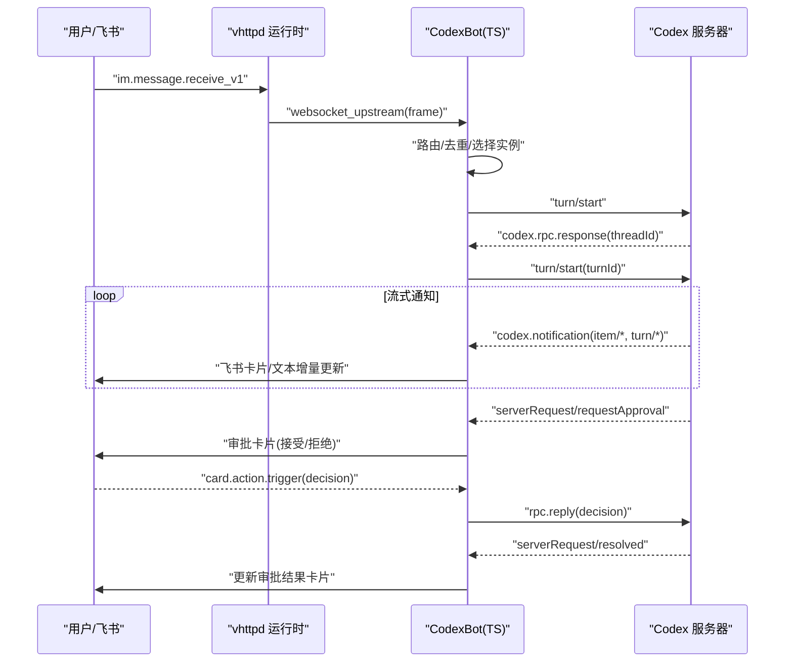
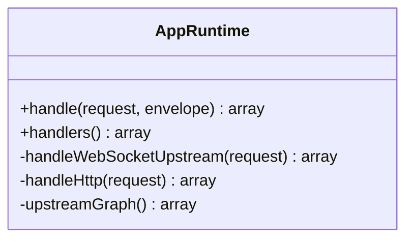
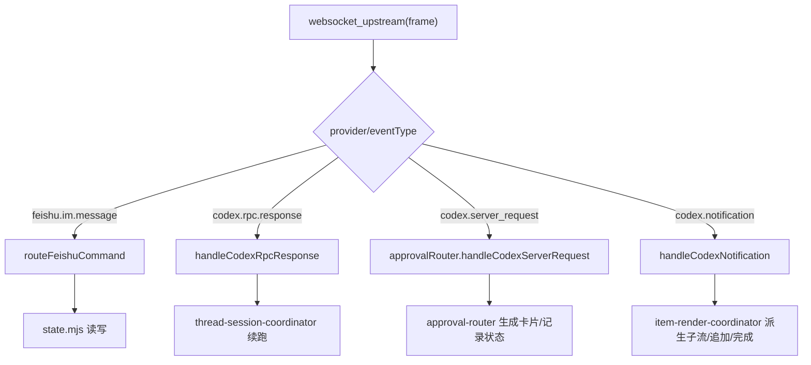
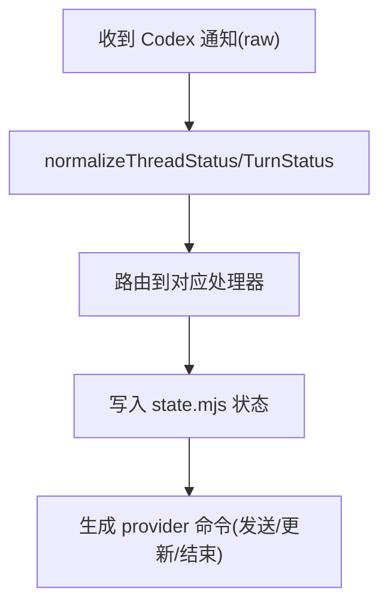
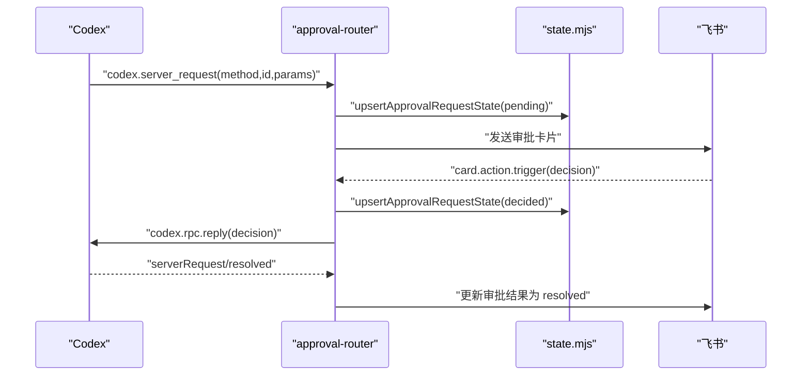
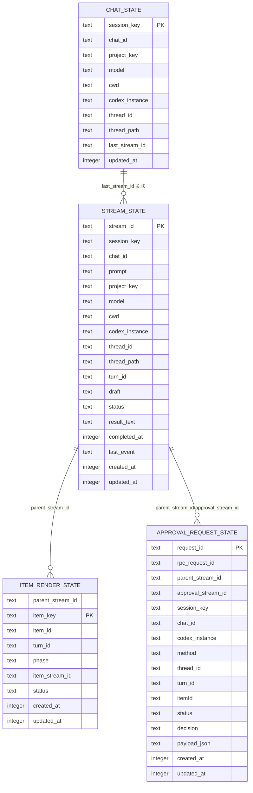
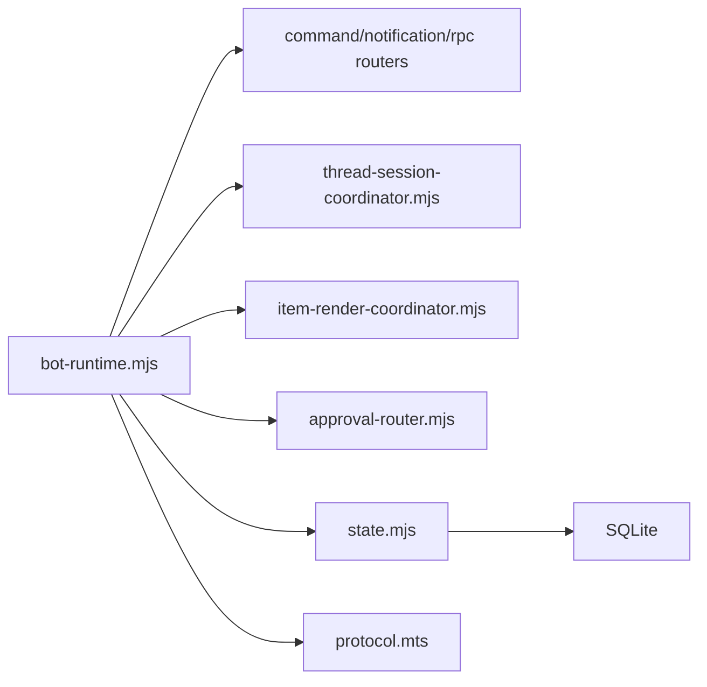

# CodexBot 完整应用

<cite>
**本文引用的文件**   
- [README.md](file://README.md)
- [09-codexbot.md](file://articles/09-codexbot.md)
- [codex_streaming_implementation_plan.md](file://docs/codex_streaming_implementation_plan.md)
- [app.php](file://examples/codexbot-app/app.php)
- [AppRuntime.php](file://examples/codexbot-app/lib/AppRuntime.php)
- [REFACTOR_NOTES.md](file://examples/codexbot-app/REFACTOR_NOTES.md)
- [app.mts](file://examples/codexbot-app-ts/app.mts)
- [bot-runtime.mjs](file://examples/codexbot-app-ts/lib/bot-runtime.mjs)
- [protocol.mts](file://examples/codexbot-app-ts/codex/protocol.mts)
- [state.mjs](file://examples/codexbot-app-ts/lib/state.mjs)
- [thread-session-coordinator.mjs](file://examples/codexbot-app-ts/lib/thread-session-coordinator.mjs)
- [item-render-coordinator.mjs](file://examples/codexbot-app-ts/lib/item-render-coordinator.mjs)
- [approval-router.mjs](file://examples/codexbot-app-ts/lib/approval-router.mjs)
- [inproc_vjsx_executor_codexbot_approval_test.v](file://src/inproc_vjsx_executor_codexbot_approval_test.v)
- [codex_notification_runtime.v](file://src/codex_notification_runtime.v)
</cite>

## 目录
1. [简介](#简介)
2. [项目结构](#项目结构)
3. [核心组件](#核心组件)
4. [架构总览](#架构总览)
5. [详细组件分析](#详细组件分析)
6. [依赖关系分析](#依赖关系分析)
7. [性能与可扩展性](#性能与可扩展性)
8. [部署与运维](#部署与运维)
9. [测试策略](#测试策略)
10. [故障排查指南](#故障排查指南)
11. [结论](#结论)

## 简介
本指南面向企业级 AI 应用开发者，围绕 vhttpd 上的 CodexBot 应用进行深度解析。内容覆盖：
- TypeScript 与 PHP 双版本实现对比
- Codex 协议集成、会话协调器、任务队列与审批流程
- 数据库集成（SQLite）与状态管理
- 流式渲染与飞书卡片交互
- 部署配置、生产优化与可观测性

vhttpd 作为传输与运行时层，提供 HTTP/WebSocket/流式能力，并通过“逻辑执行器”模型统一承载 PHP 与 vjsx（TypeScript/JS）两种业务形态。CodexBot 在两者之上分别实现了完整的飞书入口、Codex 会话与通知处理、SQLite 持久化以及审批交互闭环。

章节来源
- [README.md:1-120](file://README.md#L1-L120)

## 项目结构
仓库包含两个 CodexBot 示例：
- PHP 版本：examples/codexbot-app
- TypeScript 版本：examples/codexbot-app-ts

PHP 版本采用 AppRuntime 作为入口分发器，将 websocket_upstream 事件路由到上游图工厂装配的事件总线；TS 版本通过 bot-runtime 组合根组装命令路由、状态、渲染协调器与审批路由器等模块。

图表来源
- [app.php:1-15](file://examples/codexbot-app/app.php#L1-L15)
- [AppRuntime.php:1-79](file://examples/codexbot-app/lib/AppRuntime.php#L1-L79)
- [app.mts:1-35](file://examples/codexbot-app-ts/app.mts#L1-L35)
- [bot-runtime.mjs:1-634](file://examples/codexbot-app-ts/lib/bot-runtime.mjs#L1-L634)
- [thread-session-coordinator.mjs:1-102](file://examples/codexbot-app-ts/lib/thread-session-coordinator.mjs#L1-L102)
- [item-render-coordinator.mjs:1-228](file://examples/codexbot-app-ts/lib/item-render-coordinator.mjs#L1-L228)
- [approval-router.mjs:154-456](file://examples/codexbot-app-ts/lib/approval-router.mjs#L154-L456)
- [state.mjs:1-800](file://examples/codexbot-app-ts/lib/state.mjs#L1-L800)

章节来源
- [09-codexbot.md:1-870](file://articles/09-codexbot.md#L1-L870)
- [REFACTOR_NOTES.md:1-64](file://examples/codexbot-app/REFACTOR_NOTES.md#L1-L64)

## 核心组件
- 协议适配层
  - TS 侧 codex/protocol.mts 提供线程/回合状态规范化与错误码格式化，确保对上游语义的稳健解释。
- 会话与任务协调
  - thread-session-coordinator 维护线程名缓存、待重命名状态与排队 turn/start 续跑。
- 渲染协调器
  - item-render-coordinator 负责 item 生命周期到独立子流的映射、增量追加与完成收尾。
- 审批路由
  - approval-router 处理 codex.server_request 审批请求，生成飞书卡片，接收用户决策并回写 Codex。
- 状态与持久化
  - state.mjs 基于 SQLite 维护 chat/stream/command_context/project/instance/item_render/inbound_event/approval 等表，并提供幂等迁移与索引。
- 入口与编排
  - app.mts 暴露 startup/app_startup/http/websocket_upstream 钩子；bot-runtime.mjs 组合各模块并实现主事件分发。

章节来源
- [protocol.mts:1-124](file://examples/codexbot-app-ts/codex/protocol.mts#L1-L124)
- [thread-session-coordinator.mjs:1-102](file://examples/codexbot-app-ts/lib/thread-session-coordinator.mjs#L1-L102)
- [item-render-coordinator.mjs:1-228](file://examples/codexbot-app-ts/lib/item-render-coordinator.mjs#L1-L228)
- [approval-router.mjs:154-456](file://examples/codexbot-app-ts/lib/approval-router.mjs#L154-L456)
- [state.mjs:1-800](file://examples/codexbot-app-ts/lib/state.mjs#L1-L800)
- [app.mts:1-35](file://examples/codexbot-app-ts/app.mts#L1-L35)
- [bot-runtime.mjs:1-634](file://examples/codexbot-app-ts/lib/bot-runtime.mjs#L1-L634)

## 架构总览
vhttpd 作为网关与运行时，负责连接终止、worker 编排、流式转发与可观测性。CodexBot 在其上以“逻辑执行器”模式运行：
- PHP 版本：通过 php-worker 执行 AppRuntime，使用事件总线分发 upstream 事件。
- TS 版本：通过 vjsx in-proc 执行 bot-runtime，直接处理 provider 事件与 RPC 响应。

图表来源
- [codex_streaming_implementation_plan.md:57-162](file://docs/codex_streaming_implementation_plan.md#L57-L162)
- [bot-runtime.mjs:613-631](file://examples/codexbot-app-ts/lib/bot-runtime.mjs#L613-L631)
- [approval-router.mjs:277-456](file://examples/codexbot-app-ts/lib/approval-router.mjs#L277-L456)

章节来源
- [README.md:84-126](file://README.md#L84-L126)

## 详细组件分析

### 组件一：PHP 版本入口与分发
- 入口 app.php 初始化时区与自动加载，返回 AppRuntime 处理器集合。
- AppRuntime 根据 mode 区分 http 与 websocket_upstream；后者通过 UpstreamGraphFactory 构建事件图，将事件交给 EventRouter 与 CommandBus 处理。

图表来源
- [app.php:1-15](file://examples/codexbot-app/app.php#L1-L15)
- [AppRuntime.php:1-79](file://examples/codexbot-app/lib/AppRuntime.php#L1-L79)

章节来源
- [REFACTOR_NOTES.md:1-64](file://examples/codexbot-app/REFACTOR_NOTES.md#L1-L64)

### 组件二：TS 版本编排与路由
- app.mts 导出 startup/app_startup/http/websocket_upstream 钩子，委托给 createBotApp 返回的对象。
- bot-runtime.mjs 组合：
  - 命令路由：Feishu inbound、Codex notification/rpc response/server request
  - 会话协调：线程绑定、排队 turn/start 续跑
  - 渲染协调：item 生命周期到派生流、增量追加与完成
  - 审批路由：生成卡片、收集决策、回写 Codex
  - 状态层：SQLite 持久化与迁移

图表来源
- [app.mts:1-35](file://examples/codexbot-app-ts/app.mts#L1-L35)
- [bot-runtime.mjs:573-634](file://examples/codexbot-app-ts/lib/bot-runtime.mjs#L573-L634)
- [thread-session-coordinator.mjs:1-102](file://examples/codexbot-app-ts/lib/thread-session-coordinator.mjs#L1-L102)
- [item-render-coordinator.mjs:1-228](file://examples/codexbot-app-ts/lib/item-render-coordinator.mjs#L1-L228)
- [approval-router.mjs:154-456](file://examples/codexbot-app-ts/lib/approval-router.mjs#L154-L456)
- [state.mjs:1-800](file://examples/codexbot-app-ts/lib/state.mjs#L1-L800)

章节来源
- [09-codexbot.md:424-550](file://articles/09-codexbot.md#L424-L550)

### 组件三：Codex 协议与状态规范
- protocol.mts 定义线程/回合/消息阶段常量，并提供 normalize/is 系列工具函数，屏蔽大小写与变体差异。
- 结合 vhttpd 的 codex 通知运行时，将 raw JSON 解析后派发至 worker 处理。

图表来源
- [protocol.mts:1-124](file://examples/codexbot-app-ts/codex/protocol.mts#L1-L124)
- [codex_notification_runtime.v:1-126](file://src/codex_notification_runtime.v#L1-L126)

章节来源
- [codex_streaming_implementation_plan.md:57-162](file://docs/codex_streaming_implementation_plan.md#L57-L162)

### 组件四：审批流程（server_request → 卡片 → 决策 → reply）
- 当 Codex 发起审批请求时，创建派生审批流，生成飞书卡片，等待用户点击按钮。
- 用户触发 card.action.trigger 后，读取决策并调用 codex.rpc.reply 回写，随后 serverRequest/resolved 通知到来时更新卡片为已解决。

图表来源
- [approval-router.mjs:277-456](file://examples/codexbot-app-ts/lib/approval-router.mjs#L277-L456)
- [state.mjs:689-747](file://examples/codexbot-app-ts/lib/state.mjs#L689-L747)

章节来源
- [inproc_vjsx_executor_codexbot_approval_test.v:1-75](file://src/inproc_vjsx_executor_codexbot_approval_test.v#L1-L75)

### 组件五：数据库与状态模型
- 表族：chat_state、stream_state、command_context_state、project_registry、project_binding_state、settings、instance_registry、item_render_state、inbound_event_state、approval_request_state。
- 特性：
  - WAL 模式与批量索引，提升并发与查询性能
  - 字段演进与别名归一化（default→main）
  - 幂等 upsert 与事务保护
  - 入站事件去重窗口

图表来源
- [state.mjs:24-170](file://examples/codexbot-app-ts/lib/state.mjs#L24-L170)
- [state.mjs:221-261](file://examples/codexbot-app-ts/lib/state.mjs#L221-L261)

章节来源
- [state.mjs:1-800](file://examples/codexbot-app-ts/lib/state.mjs#L1-L800)

## 依赖关系分析
- 模块内聚与耦合
  - bot-runtime.mjs 作为组合根，集中导入命令路由、协调器、渲染器、状态与协议工具，保持高内聚低耦合。
  - 状态层 state.mjs 仅暴露数据访问 API，不依赖上层路由，便于复用与测试。
- 外部依赖
  - SQLite（sqlite npm 包）用于本地持久化
  - 飞书 SDK/卡片能力通过 provider 命令下发
  - Codex WebSocket 上游由 vhttpd 托管，事件经 kernel 派发至 vjsx 执行器

图表来源
- [bot-runtime.mjs:1-634](file://examples/codexbot-app-ts/lib/bot-runtime.mjs#L1-L634)
- [state.mjs:1-800](file://examples/codexbot-app-ts/lib/state.mjs#L1-L800)
- [protocol.mts:1-124](file://examples/codexbot-app-ts/codex/protocol.mts#L1-L124)

章节来源
- [README.md:1-120](file://README.md#L1-L120)

## 性能与可扩展性
- 流式路径优化
  - vhttpd 原生拦截高频 delta，直接推送飞书，避免 PHP 瓶颈（混合模式）。
- 并发与吞吐
  - SQLite WAL 模式与关键索引减少锁竞争与扫描成本。
  - 入站事件去重表按时间窗口清理，控制存储增长。
- 扩展点
  - 多 Codex 实例动态注册与选择（provider-config.mts 与 state 中的 instance_registry）。
  - 多 Feishu 实例支持，通过实例别名归一化。

章节来源
- [codex_streaming_implementation_plan.md:148-162](file://docs/codex_streaming_implementation_plan.md#L148-L162)
- [state.mjs:221-261](file://examples/codexbot-app-ts/lib/state.mjs#L221-L261)

## 部署与运维
- 运行方式
  - 使用 systemd/launchd 前台进程管理，推荐 TOML 配置驱动。
  - 多监听器模式：同一进程绑定多个 host:port，每个站点独立 executor 与 app。
- 环境变量与密钥
  - 飞书凭据：FEISHU_APP_ID、FEISHU_APP_SECRET、FEISHU_VERIFICATION_TOKEN、FEISHU_ENCRYPT_KEY
  - TS 数据库路径：CODEXBOT_TS_DB_PATH
  - 默认工作目录/项目/模型/实例等可通过环境变量覆盖
- 健康检查与调试
  - GET /health 主机级健康
  - GET /dispatch?path=/health 进入 TS 应用触发启动钩子
  - GET /admin/state 查看运行时快照（会话、流、上下文、审批等）

章节来源
- [README.md:437-672](file://README.md#L437-L672)
- [README.md:674-800](file://README.md#L674-L800)
- [README.md:367-411](file://README.md#L367-L411)

## 测试策略
- 端到端审批流程测试
  - 通过 in-proc vjsx 执行器模拟 Codex 事件序列：thread/start → turn/start → server_request → 用户决策 → serverRequest/resolved，断言命令类型与内容。
- 行为验证要点
  - 首次 thread/start 响应应触发 turn/start
  - server_request 应生成飞书审批卡片并记录 pending 状态
  - 用户决策后应回复 codex.rpc.reply 并更新审批流状态
  - resolved 通知应更新卡片为 resolved

章节来源
- [inproc_vjsx_executor_codexbot_approval_test.v:1-75](file://src/inproc_vjsx_executor_codexbot_approval_test.v#L1-L75)

## 故障排查指南
- 常见问题定位
  - 未绑定线程：rpc response 中指示缺失 threadId 时，需先创建或选择线程。
  - 审批无响应：检查 approval_request_state 是否处于 pending/decided/resolved，确认卡片 actionValue 是否正确传递 requestId。
  - 重复消息：检查 inbound_event_state 去重键与窗口是否命中。
  - 长时间空闲：活跃流超时自动 detach，状态置 cancelled，需重新发起任务。
- 诊断接口
  - /admin/runtime 与 /admin/state 查看运行时与 Bot 状态快照
  - 事件日志：vhttpd 事件 NDJSON 与 stderr 输出

章节来源
- [bot-runtime.mjs:573-634](file://examples/codexbot-app-ts/lib/bot-runtime.mjs#L573-L634)
- [state.mjs:663-687](file://examples/codexbot-app-ts/lib/state.mjs#L663-L687)
- [README.md:674-800](file://README.md#L674-L800)

## 结论
CodexBot 在 vhttpd 的统一运行时之上，提供了跨语言（PHP/TS）的企业级 AI 应用范式：
- 清晰的协议适配与状态规范化
- 健壮的会话与任务协调机制
- 完善的审批交互闭环
- 高性能的流式渲染与稳定的持久化
- 可观测、可运维的生产就绪方案

建议在生产环境优先采用 TS/vjsx 模式以获得更好的流式性能与可观测性，同时保留 PHP 版本用于兼容现有生态与团队技能栈。