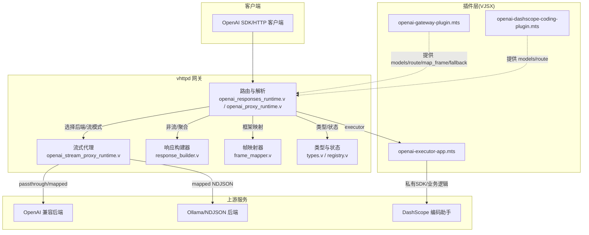
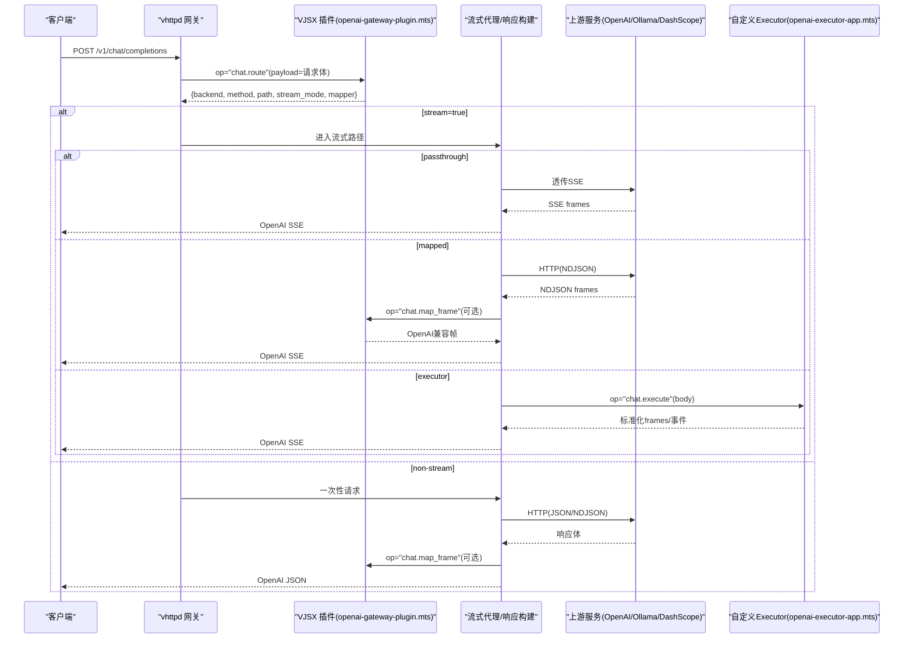
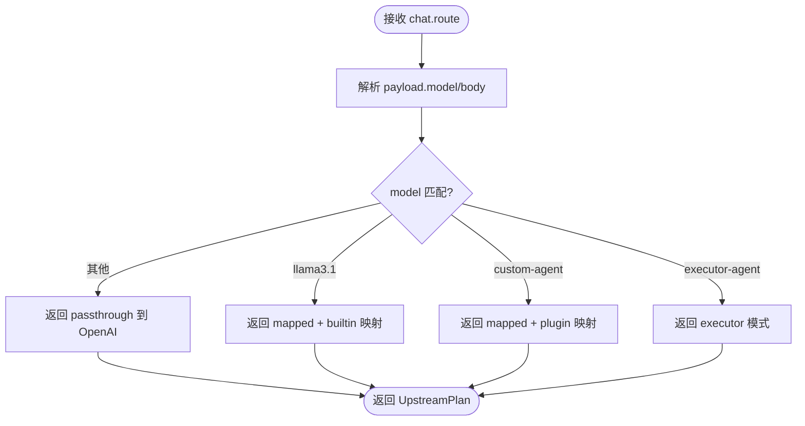
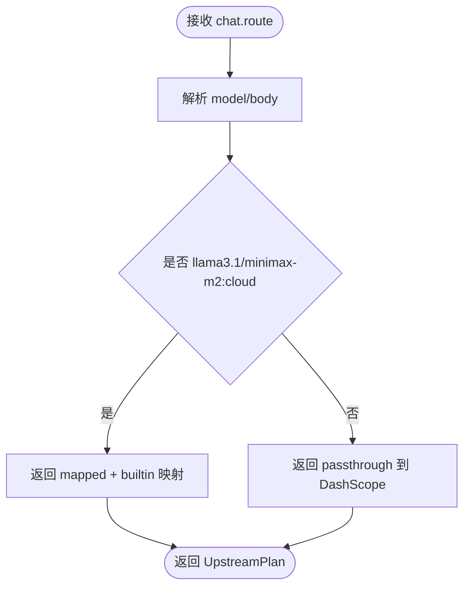
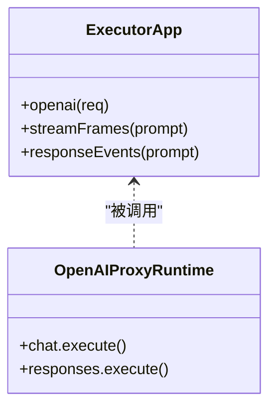
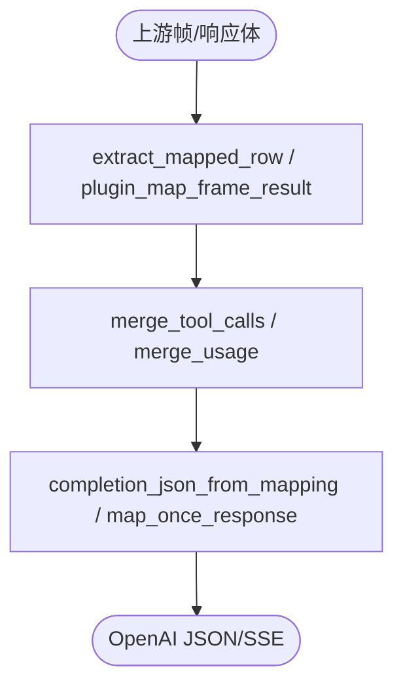
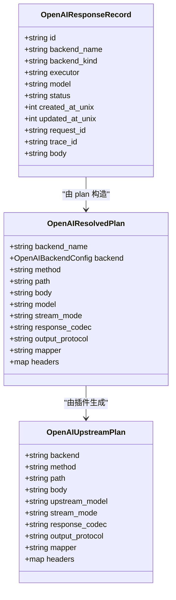
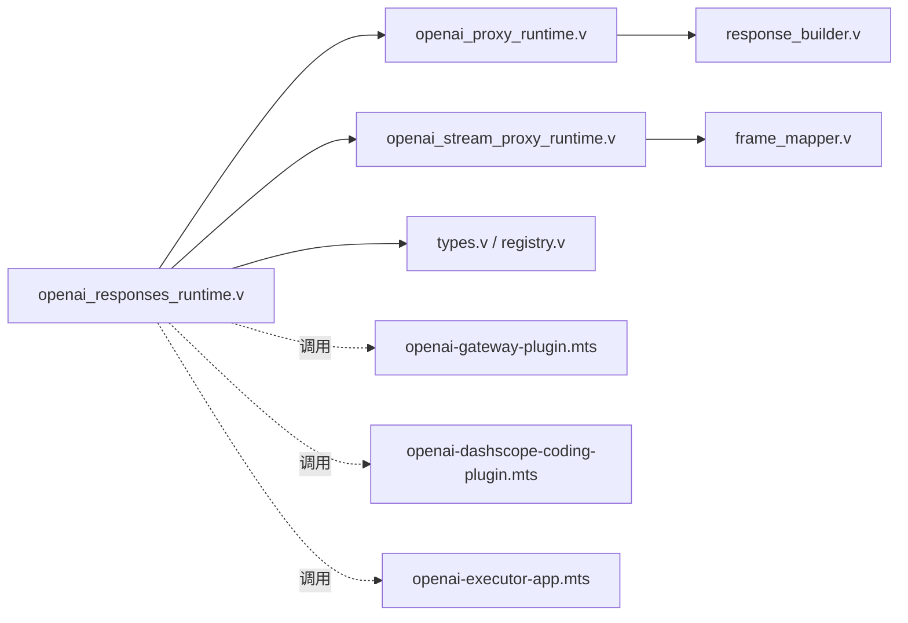

# OpenAI 集成应用

<cite>
**本文引用的文件**   
- [openai-gateway-plugin.mts](file://examples/vjsx/openai-gateway-plugin.mts)
- [openai-dashscope-coding-plugin.mts](file://examples/vjsx/openai-dashscope-coding-plugin.mts)
- [openai-executor-app.mts](file://examples/vjsx/openai-executor-app.mts)
- [registry.v](file://src/api/openai/registry.v)
- [types.v](file://src/api/openai/types.v)
- [response_builder.v](file://src/api/openai/response_builder.v)
- [frame_mapper.v](file://src/api/openai/frame_mapper.v)
- [OPENAI_AGGREGATION_GATEWAY_PLAN.md](file://docs/OPENAI_AGGREGATION_GATEWAY_PLAN.md)
- [openai_gateway_integration_test.v](file://src/openai_gateway_integration_test.v)
- [openai_runtime_context.v](file://src/openai_runtime_context.v)
- [openai_responses_runtime.v](file://src/openai_responses_runtime.v)
- [openai_proxy_runtime.v](file://src/openai_proxy_runtime.v)
- [openai_stream_proxy_runtime.v](file://src/openai_stream_proxy_runtime.v)
</cite>

## 目录
1. [简介](#简介)
2. [项目结构](#项目结构)
3. [核心组件](#核心组件)
4. [架构总览](#架构总览)
5. [详细组件分析](#详细组件分析)
6. [依赖关系分析](#依赖关系分析)
7. [性能与可靠性](#性能与可靠性)
8. [故障排查指南](#故障排查指南)
9. [结论](#结论)
10. [附录：配置与示例](#附录配置与示例)

## 简介
本指南面向在 vhttpd 上构建 OpenAI 兼容的 VJSX 应用，重点覆盖以下能力：
- 实现 OpenAI 兼容 API 网关（/v1/models、/v1/chat/completions、/v1/responses）
- 流式响应处理（SSE 透传、NDJSON 映射、Executor 模式）
- 插件架构与能力协商（models、route、map_frame、fallback、execute）
- 模型路由、错误重试与限流控制
- DashScope 编码助手的具体实现示例
- 自定义 AI 工具的扩展与执行
- 插件注册机制、能力协商与会话管理

## 项目结构
围绕 OpenAI 集成的关键代码分布在如下位置：
- 示例插件与应用（VJSX）
  - examples/vjsx/openai-gateway-plugin.mts：OpenAI 网关路由与映射插件
  - examples/vjsx/openai-dashscope-coding-plugin.mts：DashScope 编码助手插件
  - examples/vjsx/openai-executor-app.mts：自定义 Executor 应用（支持 chat.execute 与 responses.execute）
- OpenAI 网关核心（V）
  - src/api/openai/*：类型定义、响应构建、帧映射、记录注册等
  - src/openai_*_runtime.v：运行时路由、代理、流式转发、Responses 处理
  - docs/OPENAI_AGGREGATION_GATEWAY_PLAN.md：网关协议与实现计划
  - src/openai_gateway_integration_test.v：端到端集成测试（含 Responses 流式透传）

图表来源
- [openai_responses_runtime.v:1-33](file://src/openai_responses_runtime.v#L1-L33)
- [openai_proxy_runtime.v:67-91](file://src/openai_proxy_runtime.v#L67-L91)
- [openai_stream_proxy_runtime.v:112-143](file://src/openai_stream_proxy_runtime.v#L112-L143)
- [response_builder.v:1-202](file://src/api/openai/response_builder.v#L1-L202)
- [frame_mapper.v:1-222](file://src/api/openai/frame_mapper.v#L1-L222)
- [types.v:1-89](file://src/api/openai/types.v#L1-L89)
- [registry.v:1-57](file://src/api/openai/registry.v#L1-L57)
- [openai-gateway-plugin.mts:1-213](file://examples/vjsx/openai-gateway-plugin.mts#L1-L213)
- [openai-dashscope-coding-plugin.mts:1-75](file://examples/vjsx/openai-dashscope-coding-plugin.mts#L1-L75)
- [openai-executor-app.mts:1-102](file://examples/vjsx/openai-executor-app.mts#L1-L102)

章节来源
- [openai_responses_runtime.v:1-33](file://src/openai_responses_runtime.v#L1-L33)
- [openai_proxy_runtime.v:67-91](file://src/openai_proxy_runtime.v#L67-L91)
- [openai_stream_proxy_runtime.v:112-143](file://src/openai_stream_proxy_runtime.v#L112-L143)
- [response_builder.v:1-202](file://src/api/openai/response_builder.v#L1-L202)
- [frame_mapper.v:1-222](file://src/api/openai/frame_mapper.v#L1-L222)
- [types.v:1-89](file://src/api/openai/types.v#L1-L89)
- [registry.v:1-57](file://src/api/openai/registry.v#L1-L57)
- [openai-gateway-plugin.mts:1-213](file://examples/vjsx/openai-gateway-plugin.mts#L1-L213)
- [openai-dashscope-coding-plugin.mts:1-75](file://examples/vjsx/openai-dashscope-coding-plugin.mts#L1-L75)
- [openai-executor-app.mts:1-102](file://examples/vjsx/openai-executor-app.mts#L1-L102)

## 核心组件
- 网关路由与协议入口
  - 负责 /v1/responses 与 /v1/chat/completions 的路由、参数解析、流式与非流分支。
- 流式代理与映射
  - 支持 passthrough（SSE 透传）、mapped（NDJSON 解码并映射为 OpenAI SSE）、executor（调用 VJSX 应用）。
- 响应构建器
  - 将 executor 或 mapped 的结果转换为 OpenAI 标准 JSON/SSE 格式。
- 帧映射器
  - 内置对多种上游帧结构的提取与合并（content、tool_calls、usage），并支持插件自定义映射。
- 类型与状态
  - 统一描述 UpstreamPlan、ResolvedPlan、ResponseRecord 等核心数据结构。
- 插件接口（VJSX）
  - 通过单一 openai(req) 暴露 models、chat.route、responses.route、chat.map_frame、chat.fallback、chat.execute、responses.execute 等操作。

章节来源
- [openai_responses_runtime.v:1-33](file://src/openai_responses_runtime.v#L1-L33)
- [openai_proxy_runtime.v:67-91](file://src/openai_proxy_runtime.v#L67-L91)
- [openai_stream_proxy_runtime.v:112-143](file://src/openai_stream_proxy_runtime.v#L112-L143)
- [response_builder.v:1-202](file://src/api/openai/response_builder.v#L1-L202)
- [frame_mapper.v:1-222](file://src/api/openai/frame_mapper.v#L1-L222)
- [types.v:1-89](file://src/api/openai/types.v#L1-L89)
- [registry.v:1-57](file://src/api/openai/registry.v#L1-L57)
- [openai-gateway-plugin.mts:1-213](file://examples/vjsx/openai-gateway-plugin.mts#L1-L213)

## 架构总览
下图展示了从客户端到上游服务的完整链路，包括插件参与的能力协商与映射过程。

图表来源
- [openai-gateway-plugin.mts:89-138](file://examples/vjsx/openai-gateway-plugin.mts#L89-L138)
- [openai_stream_proxy_runtime.v:112-143](file://src/openai_stream_proxy_runtime.v#L112-L143)
- [openai_proxy_runtime.v:67-91](file://src/openai_proxy_runtime.v#L67-L91)
- [response_builder.v:113-159](file://src/api/openai/response_builder.v#L113-L159)
- [frame_mapper.v:128-179](file://src/api/openai/frame_mapper.v#L128-L179)
- [openai-executor-app.mts:51-101](file://examples/vjsx/openai-executor-app.mts#L51-L101)

## 详细组件分析

### 组件A：OpenAI 网关插件（路由与映射）
- 功能要点
  - 暴露 models 列表，供 /v1/models 使用
  - 根据 model 字段进行路由：OpenAI 透传、Ollama NDJSON 映射、自定义 Agent、Executor 模式
  - 支持 chat.map_frame 自定义帧映射，以及 chat.fallback 失败回退
- 关键流程
  - routeChat：按 model 选择 backend/stream_mode/mapper
  - mapCustomFrame：将上游自定义帧映射为 OpenAI 兼容帧（包含 tool_calls、finish_reason、usage）
  - fallback：当上游返回 5xx 时，自动降级到备用后端（如 Ollama）

图表来源
- [openai-gateway-plugin.mts:89-138](file://examples/vjsx/openai-gateway-plugin.mts#L89-L138)
- [openai-gateway-plugin.mts:140-195](file://examples/vjsx/openai-gateway-plugin.mts#L140-L195)

章节来源
- [openai-gateway-plugin.mts:1-213](file://examples/vjsx/openai-gateway-plugin.mts#L1-L213)

### 组件B：DashScope 编码助手插件
- 功能要点
  - 暴露一组模型（qwen3.6-plus、qwen3.5-plus、qwen3-coder-plus、glm-5、kimi-k2.5、MiniMax-M2.5、llama3.1、minimax-m2:cloud）
  - 针对特定模型走 Ollama 映射；其余走 bailian_coding 透传（DashScope 编码助手）
- 适用场景
  - 快速接入多厂商模型，并通过统一 OpenAI 接口对外暴露

图表来源
- [openai-dashscope-coding-plugin.mts:20-52](file://examples/vjsx/openai-dashscope-coding-plugin.mts#L20-L52)
- [openai-dashscope-coding-plugin.mts:54-74](file://examples/vjsx/openai-dashscope-coding-plugin.mts#L54-L74)

章节来源
- [openai-dashscope-coding-plugin.mts:1-75](file://examples/vjsx/openai-dashscope-coding-plugin.mts#L1-L75)

### 组件C：自定义 Executor 应用
- 功能要点
  - 支持 chat.execute 与 responses.execute
  - 可返回标准化 frames 或 typed Responses 事件，vhttpd 负责将其转为 OpenAI 兼容输出
- 典型用法
  - 封装私有 SDK、复杂编排或多步 Agent 逻辑，屏蔽上游差异

图表来源
- [openai-executor-app.mts:10-49](file://examples/vjsx/openai-executor-app.mts#L10-L49)
- [openai-executor-app.mts:51-101](file://examples/vjsx/openai-executor-app.mts#L51-L101)

章节来源
- [openai-executor-app.mts:1-102](file://examples/vjsx/openai-executor-app.mts#L1-L102)

### 组件D：响应构建与帧映射
- 响应构建
  - 将 executor 或 mapped 结果转换为 OpenAI chat.completion JSON 或 SSE 事件
  - 支持 usage 归一化、tool_calls 聚合、finish_reason 推导
- 帧映射
  - 内置 extract_mapped_row 支持 message/tool_calls/content/response 等多种上游帧
  - 支持 plugin_map_frame_result 允许插件自定义映射与错误注入

图表来源
- [frame_mapper.v:7-59](file://src/api/openai/frame_mapper.v#L7-L59)
- [frame_mapper.v:128-179](file://src/api/openai/frame_mapper.v#L128-L179)
- [response_builder.v:7-34](file://src/api/openai/response_builder.v#L7-L34)
- [response_builder.v:113-159](file://src/api/openai/response_builder.v#L113-L159)

章节来源
- [frame_mapper.v:1-222](file://src/api/openai/frame_mapper.v#L1-L222)
- [response_builder.v:1-202](file://src/api/openai/response_builder.v#L1-L202)

### 组件E：类型与状态（ResolvedPlan/ResponseRecord）
- OpenAIResolvedPlan/OpenAIUpstreamPlan：描述上游请求计划（backend、method、path、stream_mode、mapper 等）
- OpenAIResponseRecord：存储已完成的 Responses 对象，便于本地查询与 TTL 管理

图表来源
- [types.v:45-89](file://src/api/openai/types.v#L45-L89)
- [registry.v:7-23](file://src/api/openai/registry.v#L7-L23)

章节来源
- [types.v:1-89](file://src/api/openai/types.v#L1-L89)
- [registry.v:1-57](file://src/api/openai/registry.v#L1-L57)

## 依赖关系分析
- 运行时入口
  - openai_responses_runtime.v：统一处理 /v1/responses 的请求分发（流式/非流式、executor/passthrough）
  - openai_proxy_runtime.v：非流式路径的响应构建与映射
  - openai_stream_proxy_runtime.v：流式路径的代理与 SSE 透传
- 插件与协议
  - 插件通过 openai(req) 暴露能力，网关根据 req.op 调度
  - 协议契约与行为详见 OPENAI_AGGREGATION_GATEWAY_PLAN.md
- 集成测试
  - openai_gateway_integration_test.v 验证了 Responses 流式透传、NDJSON 映射、工具调用与用量统计等

图表来源
- [openai_responses_runtime.v:1-33](file://src/openai_responses_runtime.v#L1-L33)
- [openai_proxy_runtime.v:67-91](file://src/openai_proxy_runtime.v#L67-L91)
- [openai_stream_proxy_runtime.v:112-143](file://src/openai_stream_proxy_runtime.v#L112-L143)
- [response_builder.v:1-202](file://src/api/openai/response_builder.v#L1-L202)
- [frame_mapper.v:1-222](file://src/api/openai/frame_mapper.v#L1-L222)
- [types.v:1-89](file://src/api/openai/types.v#L1-L89)
- [registry.v:1-57](file://src/api/openai/registry.v#L1-L57)
- [openai-gateway-plugin.mts:1-213](file://examples/vjsx/openai-gateway-plugin.mts#L1-L213)
- [openai-dashscope-coding-plugin.mts:1-75](file://examples/vjsx/openai-dashscope-coding-plugin.mts#L1-L75)
- [openai-executor-app.mts:1-102](file://examples/vjsx/openai-executor-app.mts#L1-L102)

章节来源
- [openai_responses_runtime.v:1-33](file://src/openai_responses_runtime.v#L1-L33)
- [openai_proxy_runtime.v:67-91](file://src/openai_proxy_runtime.v#L67-L91)
- [openai_stream_proxy_runtime.v:112-143](file://src/openai_stream_proxy_runtime.v#L112-L143)
- [OPENAI_AGGREGATION_GATEWAY_PLAN.md:464-595](file://docs/OPENAI_AGGREGATION_GATEWAY_PLAN.md#L464-L595)
- [openai_gateway_integration_test.v:1123-1154](file://src/openai_gateway_integration_test.v#L1123-L1154)

## 性能与可靠性
- 流式性能
  - passthrough 模式直接透传上游 SSE，避免额外编解码开销
  - mapped 模式在内存中逐行解析 NDJSON，适合轻量映射；若上游帧复杂，建议尽量在插件侧完成转换
- 错误处理与重试
  - 非流式：上游非 2xx 会被规范化为 OpenAI 错误信封
  - 流式：在写入 SSE 头之前仍可切换后端；一旦开始流式传输，则发送 OpenAI 风格错误帧而非切换
  - 支持 chat.fallback 钩子，一次重试策略（例如 5xx 时回退到备用后端）
- 限流与速率控制
  - 建议在插件层或上游网关处实施限流；网关本身不内建令牌桶，但可通过插件返回不同后端或拒绝请求来实现
- 资源与超时
  - 流式代理设置读写超时为无限，确保长连接稳定；需在上游保证心跳与保活

章节来源
- [OPENAI_AGGREGATION_GATEWAY_PLAN.md:530-595](file://docs/OPENAI_AGGREGATION_GATEWAY_PLAN.md#L530-L595)
- [openai_stream_proxy_runtime.v:112-143](file://src/openai_stream_proxy_runtime.v#L112-L143)
- [openai_gateway_integration_test.v:1123-1154](file://src/openai_gateway_integration_test.v#L1123-L1154)

## 故障排查指南
- 常见问题定位
  - 模型未命中路由：检查插件 models 列表与 chat.route 的 model 匹配逻辑
  - 流式无输出：确认上游 Content-Type 是否为 text/event-stream，且数据帧符合预期
  - 工具调用异常：核对 frame_mapper 的 tool_calls 合并逻辑与插件 map_frame 返回值
  - 用量统计缺失：检查上游是否返回 usage 或 prompt_eval_count/eval_count，并确保映射器正确聚合
- 调试手段
  - 启用事件日志与 trace_id，结合 x-vhttpd-openai-backend 响应头定位具体后端
  - 使用集成测试用例模拟上游行为，逐步缩小问题范围

章节来源
- [openai_gateway_integration_test.v:169-200](file://src/openai_gateway_integration_test.v#L169-L200)
- [openai_proxy_runtime.v:67-91](file://src/openai_proxy_runtime.v#L67-L91)
- [frame_mapper.v:106-124](file://src/api/openai/frame_mapper.v#L106-L124)

## 结论
通过 vhttpd 的 OpenAI 网关与 VJSX 插件体系，开发者可以以最小成本对接多家上游模型与服务，同时保持统一的 OpenAI 兼容接口。插件负责能力协商与映射，网关负责流式转发与标准化输出，Executor 模式则为私有 SDK 与复杂业务逻辑提供了扩展点。配合完善的错误处理、重试与映射机制，系统具备高可用与可扩展性。

## 附录：配置与示例
- 配置要点（参考计划文档）
  - [openai] 启用与基础路径
  - [openai.backends.*] 定义后端（openai_http/http/executor）
  - [openai.routes.*] 模型到后端的映射
  - [plugins.*] 加载 VJSX 插件（openai-gateway、dashscope-coding、executor）
- 示例入口
  - 网关插件：examples/vjsx/openai-gateway-plugin.mts
  - DashScope 编码助手：examples/vjsx/openai-dashscope-coding-plugin.mts
  - 自定义 Executor：examples/vjsx/openai-executor-app.mts

章节来源
- [OPENAI_AGGREGATION_GATEWAY_PLAN.md:70-128](file://docs/OPENAI_AGGREGATION_GATEWAY_PLAN.md#L70-L128)
- [openai-gateway-plugin.mts:1-213](file://examples/vjsx/openai-gateway-plugin.mts#L1-L213)
- [openai-dashscope-coding-plugin.mts:1-75](file://examples/vjsx/openai-dashscope-coding-plugin.mts#L1-L75)
- [openai-executor-app.mts:1-102](file://examples/vjsx/openai-executor-app.mts#L1-L102)