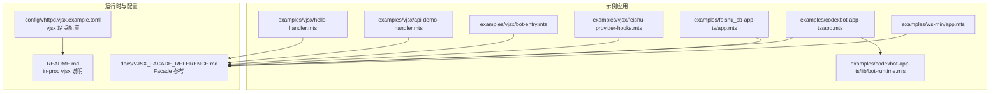
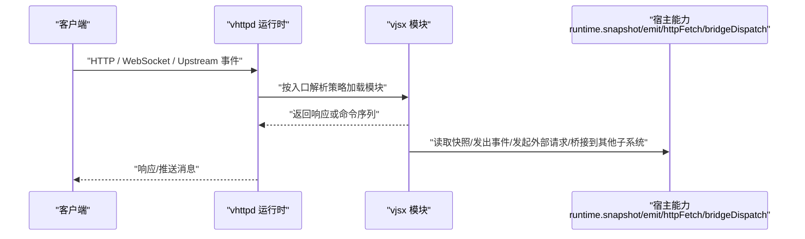
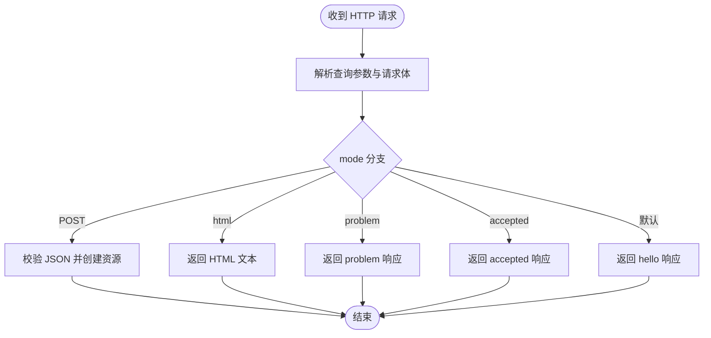
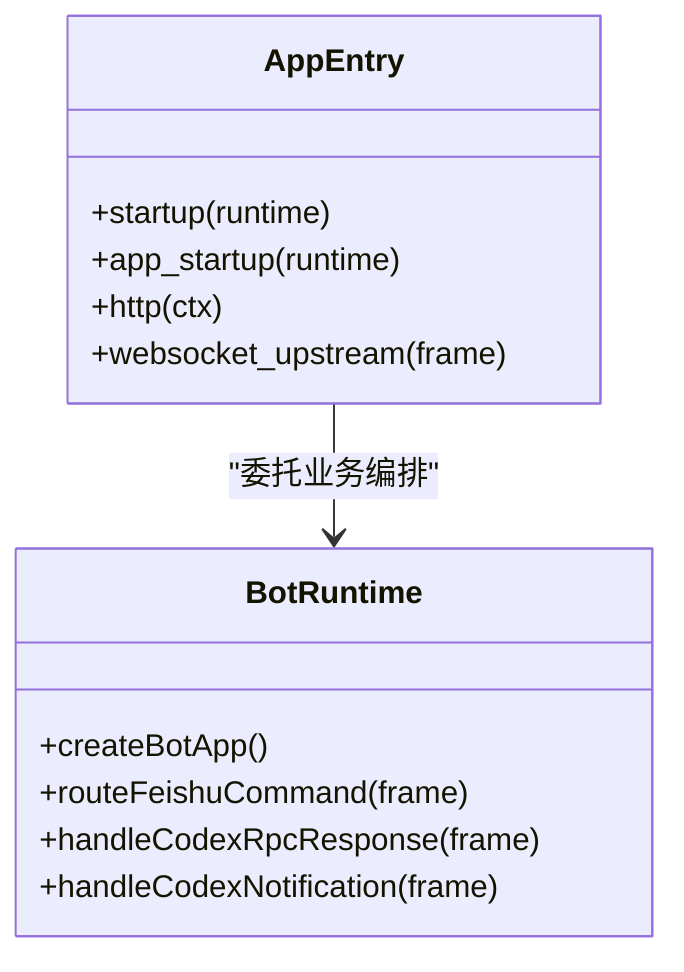
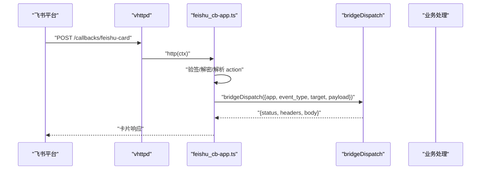
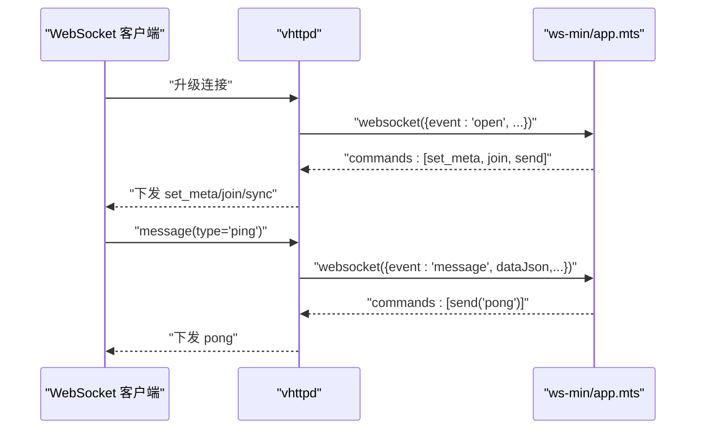
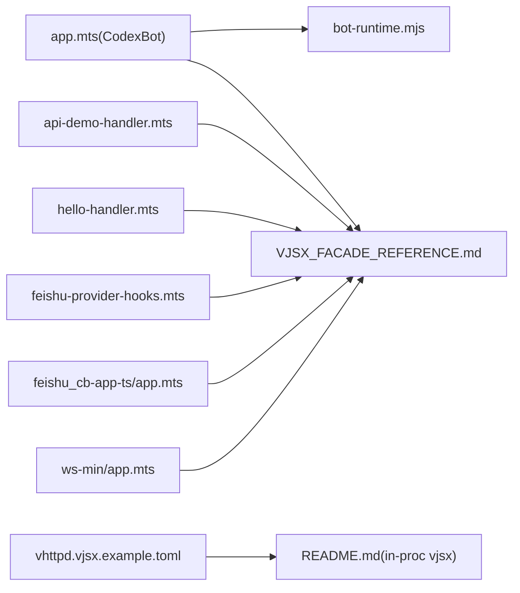

# VJSX 应用示例

<cite>
**本文引用的文件**   
- [README.md](file://README.md)
- [VJSX_FACADE_REFERENCE.md](file://docs/VJSX_FACADE_REFERENCE.md)
- [vhttpd.vjsx.example.toml](file://config/vhttpd.vjsx.example.toml)
- [hello-handler.mts](file://examples/vjsx/hello-handler.mts)
- [api-demo-handler.mts](file://examples/vjsx/api-demo-handler.mts)
- [bot-entry.mts](file://examples/vjsx/bot-entry.mts)
- [feishu-provider-hooks.mts](file://examples/vjsx/feishu-provider-hooks.mts)
- [app.mts (CodexBot TS)](file://examples/codexbot-app-ts/app.mts)
- [bot-runtime.mjs](file://examples/codexbot-app-ts/lib/bot-runtime.mjs)
- [app.mts (飞书卡片回调)](file://examples/feishu_cb-app-ts/app.mts)
- [app.mts (WebSocket 最小示例)](file://examples/ws-min/app.mts)
</cite>

## 目录
1. [简介](#简介)
2. [项目结构](#项目结构)
3. [核心组件](#核心组件)
4. [架构总览](#架构总览)
5. [详细组件分析](#详细组件分析)
6. [依赖关系分析](#依赖关系分析)
7. [性能与可观测性](#性能与可观测性)
8. [故障排查指南](#故障排查指南)
9. [结论](#结论)
10. [附录：开发与部署最佳实践](#附录开发与部署最佳实践)

## 简介
本指南面向使用 TypeScript/JavaScript 的 VJSX 应用开发者，围绕 vhttpd 的 in-proc vjsx 模式，系统讲解应用架构、模块组织、事件处理与状态管理。文档覆盖以下典型场景：
- 简单 API 处理器（Hello/综合演示）
- 复杂 AI 应用（CodexBot）
- 飞书机器人应用（HTTP 回调 + WebSocket 上游）
- WebSocket 实时通信应用（最小示例）
并给出热重载开发、调试技巧、性能优化与生产部署的最佳实践。

## 项目结构
仓库中 VJSX 相关示例位于 examples/vjsx、examples/codexbot-app-ts、examples/feishu_cb-app-ts、examples/ws-min 等目录；配置参考 config/vhttpd.vjsx.example.toml；运行时入口与能力参考 README 与 VJSX Facade 参考文档。

图表来源
- [README.md](file://README.md)
- [VJSX_FACADE_REFERENCE.md](file://docs/VJSX_FACADE_REFERENCE.md)
- [vhttpd.vjsx.example.toml](file://config/vhttpd.vjsx.example.toml)
- [hello-handler.mts](file://examples/vjsx/hello-handler.mts)
- [api-demo-handler.mts](file://examples/vjsx/api-demo-handler.mts)
- [bot-entry.mts](file://examples/vjsx/bot-entry.mts)
- [feishu-provider-hooks.mts](file://examples/vjsx/feishu-provider-hooks.mts)
- [app.mts (CodexBot TS)](file://examples/codexbot-app-ts/app.mts)
- [bot-runtime.mjs](file://examples/codexbot-app-ts/lib/bot-runtime.mjs)
- [app.mts (飞书卡片回调)](file://examples/feishu_cb-app-ts/app.mts)
- [app.mts (WebSocket 最小示例)](file://examples/ws-min/app.mts)

章节来源
- [README.md](file://README.md)
- [VJSX_FACADE_REFERENCE.md](file://docs/VJSX_FACADE_REFERENCE.md)
- [vhttpd.vjsx.example.toml](file://config/vhttpd.vjsx.example.toml)

## 核心组件
- 请求上下文与响应助手
  - ctx.runtime.* 提供只读执行元数据与日志、事件、快照、桥接调用等能力
  - ctx.* 提供丰富的请求解析与语义化响应方法（如 ok/created/problem/accepted/notFound 等）
- 入口解析策略
  - 优先 export default，其次 export const handle，最后 globalThis.__vhttpd_handle
- 调度类型
  - HTTP 请求处理：export default function http(ctx)
  - WebSocket 事件处理：websocket(frame)
  - WebSocket 上游事件处理：websocket_upstream(frame)
  - 可选 snapshot(runtime) 用于聚合多 lane 快照

章节来源
- [VJSX_FACADE_REFERENCE.md](file://docs/VJSX_FACADE_REFERENCE.md)

## 架构总览
vhttpd 作为协议与执行宿主，支持 PHP worker 与内嵌 vjsx 两种逻辑执行器。in-proc vjsx 模式下，HTTP/WebSocket 事件直接分发到 TS/JS 模块，无需外部 worker 进程。

图表来源
- [README.md](file://README.md)
- [VJSX_FACADE_REFERENCE.md](file://docs/VJSX_FACADE_REFERENCE.md)

## 详细组件分析

### 简单 API 处理器（Hello 与综合演示）
- hello-handler.mts
  - 暴露默认导出函数，返回 JSON 响应，包含运行期元数据与请求信息
- api-demo-handler.mts
  - 演示多种语义化响应（ok/created/problem/accepted）、内容协商、JSON 体解析、HTML 渲染、事件上报 runtime.emit

图表来源
- [api-demo-handler.mts](file://examples/vjsx/api-demo-handler.mts)
- [hello-handler.mts](file://examples/vjsx/hello-handler.mts)

章节来源
- [hello-handler.mts](file://examples/vjsx/hello-handler.mts)
- [api-demo-handler.mts](file://examples/vjsx/api-demo-handler.mts)
- [VJSX_FACADE_REFERENCE.md](file://docs/VJSX_FACADE_REFERENCE.md)

### 复杂 AI 应用（CodexBot）
- app.mts（入口）
  - 统一导出 startup/app_startup/http/websocket_upstream 钩子，转发至 bot-runtime 实现
- bot-runtime.mjs（核心编排）
  - 组合命令路由、会话协调、流式输出、审批路由、实例策略、状态持久化、UI 文本等
  - 对 Feishu 与 Codex 上游事件进行分派与处理

图表来源
- [app.mts (CodexBot TS)](file://examples/codexbot-app-ts/app.mts)
- [bot-runtime.mjs](file://examples/codexbot-app-ts/lib/bot-runtime.mjs)

章节来源
- [app.mts (CodexBot TS)](file://examples/codexbot-app-ts/app.mts)
- [bot-runtime.mjs](file://examples/codexbot-app-ts/lib/bot-runtime.mjs)

### 飞书机器人应用（HTTP 回调 + WebSocket 上游）
- feishu-provider-hooks.mts
  - 握手/归一化/处理回调，将上游事件标准化为内部 topic/name/data/metadata
- feishu_cb-app-ts/app.mts
  - 接收飞书卡片回调，验签解密，解析 action，通过 bridgeDispatch 转发到后端处理，并返回卡片响应
- bot-entry.mts
  - 展示 websocket_upstream 的最小处理：解析 payload 并回发文本消息

图表来源
- [feishu-provider-hooks.mts](file://examples/vjsx/feishu-provider-hooks.mts)
- [app.mts (飞书卡片回调)](file://examples/feishu_cb-app-ts/app.mts)
- [VJSX_FACADE_REFERENCE.md](file://docs/VJSX_FACADE_REFERENCE.md)

章节来源
- [feishu-provider-hooks.mts](file://examples/vjsx/feishu-provider-hooks.mts)
- [app.mts (飞书卡片回调)](file://examples/feishu_cb-app-ts/app.mts)
- [bot-entry.mts](file://examples/vjsx/bot-entry.mts)
- [VJSX_FACADE_REFERENCE.md](file://docs/VJSX_FACADE_REFERENCE.md)

### WebSocket 实时通信应用（最小示例）
- ws-min/app.mts
  - 在 open 时设置元数据、加入房间、发送同步消息
  - 在 message 时根据 type 回显或透传

图表来源
- [app.mts (WebSocket 最小示例)](file://examples/ws-min/app.mts)
- [VJSX_FACADE_REFERENCE.md](file://docs/VJSX_FACADE_REFERENCE.md)

章节来源
- [app.mts (WebSocket 最小示例)](file://examples/ws-min/app.mts)
- [VJSX_FACADE_REFERENCE.md](file://docs/VJSX_FACADE_REFERENCE.md)

## 依赖关系分析
- 入口与编排
  - CodexBot 入口 app.mts 仅做钩子转发，核心逻辑集中在 bot-runtime.mjs
- 运行时能力
  - 所有示例均依赖 VJSX Facade 提供的 ctx/runtime/frame 能力
- 配置驱动
  - vjsx 站点通过 TOML 指定 executor.kind=vjsx、app_entry/module_root/thread_count 等

图表来源
- [app.mts (CodexBot TS)](file://examples/codexbot-app-ts/app.mts)
- [bot-runtime.mjs](file://examples/codexbot-app-ts/lib/bot-runtime.mjs)
- [api-demo-handler.mts](file://examples/vjsx/api-demo-handler.mts)
- [hello-handler.mts](file://examples/vjsx/hello-handler.mts)
- [feishu-provider-hooks.mts](file://examples/vjsx/feishu-provider-hooks.mts)
- [app.mts (飞书卡片回调)](file://examples/feishu_cb-app-ts/app.mts)
- [app.mts (WebSocket 最小示例)](file://examples/ws-min/app.mts)
- [vhttpd.vjsx.example.toml](file://config/vhttpd.vjsx.example.toml)
- [README.md](file://README.md)

章节来源
- [README.md](file://README.md)
- [vhttpd.vjsx.example.toml](file://config/vhttpd.vjsx.example.toml)

## 性能与可观测性
- 线程与并发
  - 通过 thread_count 控制 vjsx 线程数，结合 runtimeProfile 选择合适运行环境
- 快照与遥测
  - 使用 ctx.runtime.snapshot() 获取运行态指标（活跃 WebSocket/Upstreams/WorkerPool 等）
  - 使用 ctx.runtime.emit(kind, fields) 上报自定义事件
- 日志
  - ctx.runtime.log/warn/error 输出结构化日志，便于定位问题
- 外部 I/O
  - 使用 ctx.runtime.httpFetch 发起外部请求，避免阻塞主循环
- 资源与超时
  - 合理设置 read_timeout_ms、队列容量与超时，避免背压堆积

章节来源
- [VJSX_FACADE_REFERENCE.md](file://docs/VJSX_FACADE_REFERENCE.md)
- [README.md](file://README.md)

## 故障排查指南
- 入口未生效
  - 确认模块导出顺序：export default > export const handle > globalThis.__vhttpd_handle
- 响应异常
  - 检查语义化响应方法是否正确使用（如 problem/accepted/unprocessableEntity）
- 事件未触发
  - 核对 dispatchKind 与 frame 字段，确保 handler 匹配对应事件类型
- 桥接失败
  - 检查 bridgeDispatch 输入参数与返回值结构，关注 status/body/headers
- 上游事件丢失
  - 查看 runtime.snapshot 中的 active_upstreams 与最近事件，必要时启用更详细的日志级别

章节来源
- [VJSX_FACADE_REFERENCE.md](file://docs/VJSX_FACADE_REFERENCE.md)
- [README.md](file://README.md)

## 结论
VJSX 在 vhttpd 的 in-proc 模式下提供了轻量、高内聚的应用开发体验。通过统一的 Facade 与清晰的入口约定，开发者可以快速构建从简单 API 到复杂 AI 与即时通信应用。配合快照、事件与日志能力，可实现良好的可观测性与运维友好性。

## 附录：开发与部署最佳实践
- 开发
  - 使用 node 运行时 profile，开启本地快速迭代
  - 利用 build_root 稳定构建产物以便调试
  - 使用 ctx.runtime.emit 与 snapshot 辅助定位问题
- 调试
  - 通过 admin 端口查看运行态快照与活动
  - 针对关键路径增加结构化日志与 traceId 透传
- 性能
  - 合理设置 thread_count 与 runtimeProfile
  - 减少同步阻塞操作，优先使用异步 I/O
  - 对热点数据采用缓存或快照聚合
- 部署
  - 使用 systemd/launchd 托管前台进程
  - 通过 TOML 集中管理站点与执行器配置
  - 生产环境建议关闭不必要的调试端点，收紧权限与网络访问

章节来源
- [README.md](file://README.md)
- [vhttpd.vjsx.example.toml](file://config/vhttpd.vjsx.example.toml)