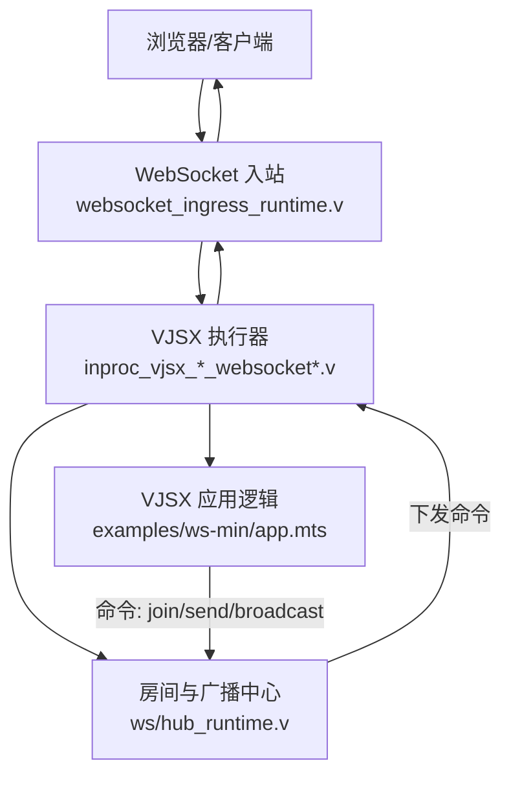
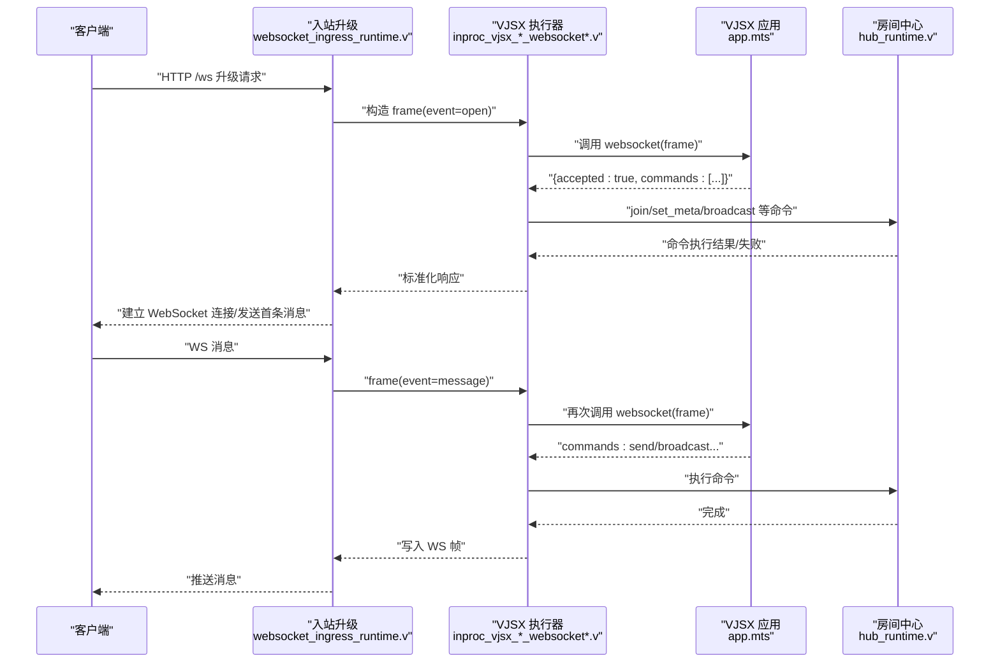
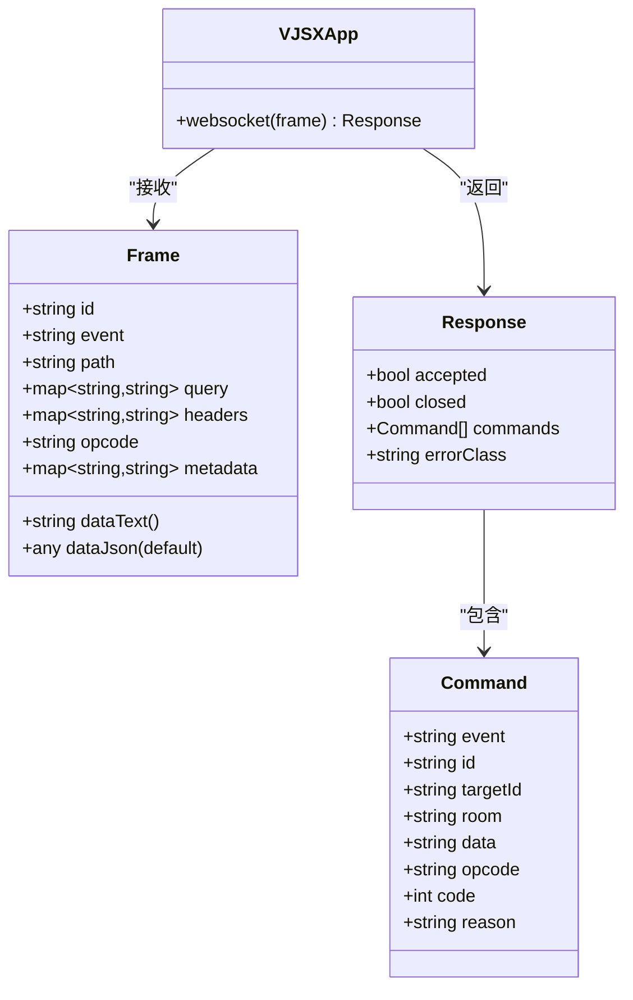
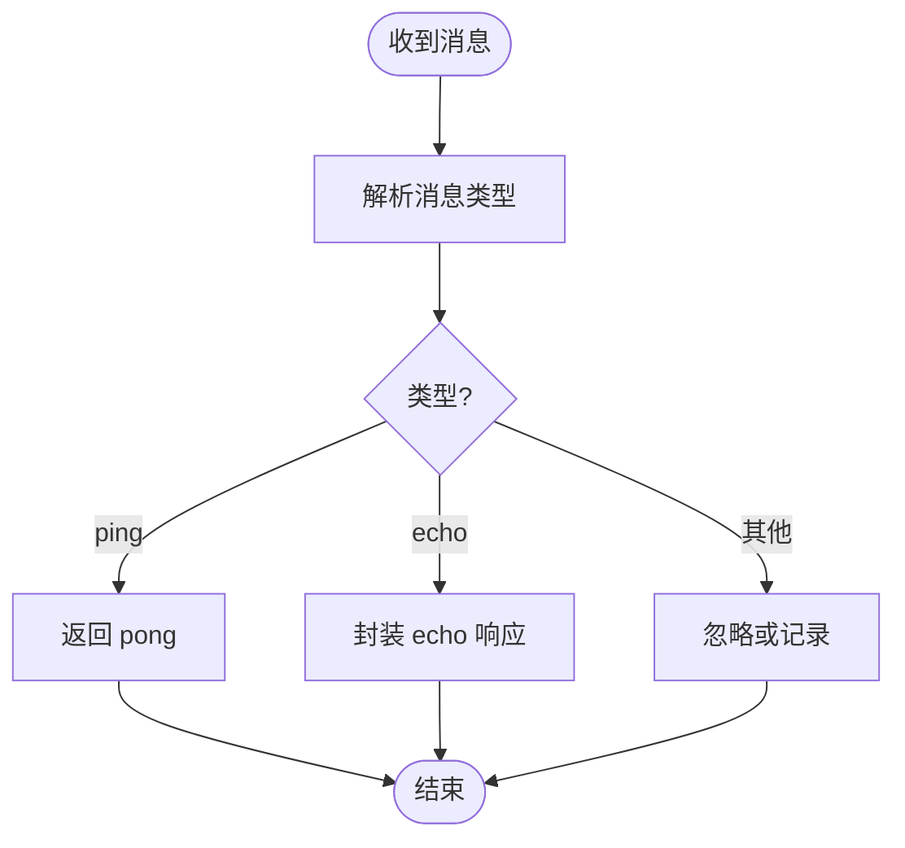
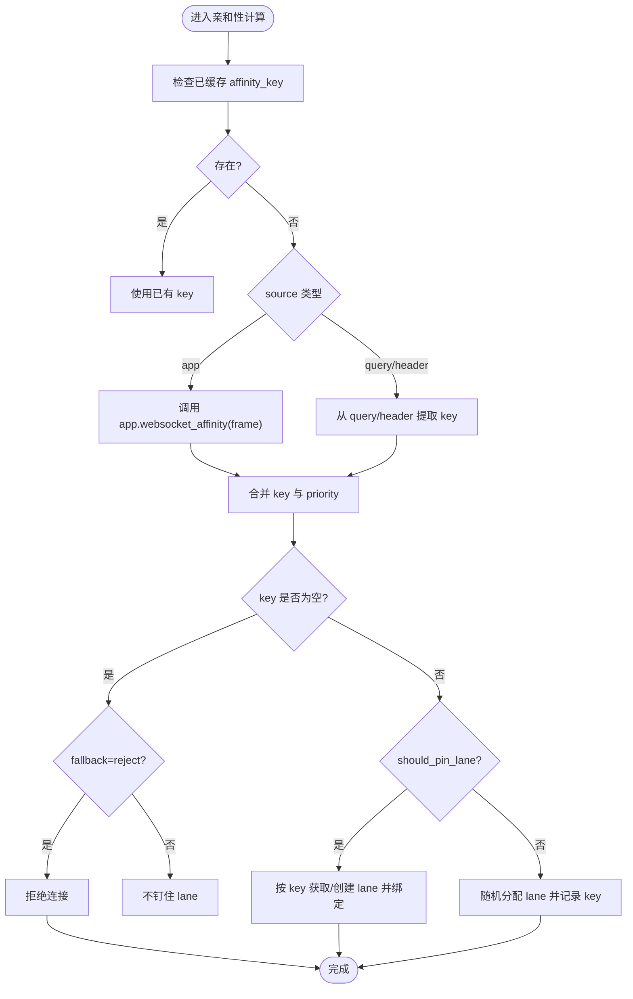
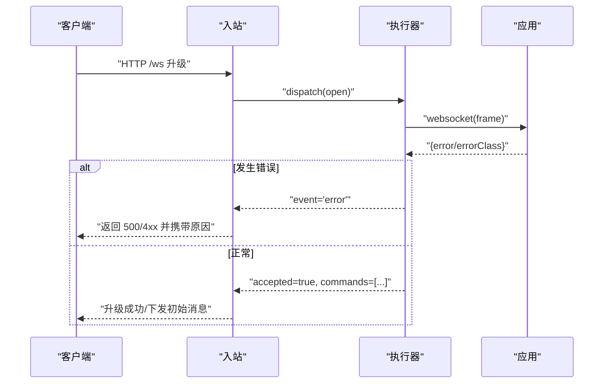
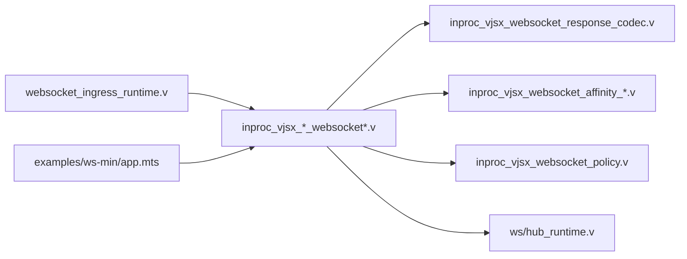

# WebSocket 实时通信应用

<cite>
**本文引用的文件列表**
- [examples/ws-min/app.mts](file://examples/ws-min/app.mts)
- [examples/ws-min/ws-min.toml](file://examples/ws-min/ws-min.toml)
- [examples/public/websocket_echo_app.js](file://examples/public/websocket_echo_app.js)
- [src/executor/inproc_vjsx_websocket_affinity_runtime.v](file://src/executor/inproc_vjsx_websocket_affinity_runtime.v)
- [src/executor/inproc_vjsx_websocket_affinity_state.v](file://src/executor/inproc_vjsx_websocket_affinity_state.v)
- [src/executor/inproc_vjsx_websocket_policy.v](file://src/executor/inproc_vjsx_websocket_policy.v)
- [src/executor/inproc_vjsx_websocket_event_runtime.v](file://src/executor/inproc_vjsx_websocket_event_runtime.v)
- [src/executor/inproc_vjsx_websocket_response_codec.v](file://src/executor/inproc_vjsx_websocket_response_codec.v)
- [src/websocket_ingress_runtime.v](file://src/websocket_ingress_runtime.v)
- [src/ws/hub_runtime.v](file://src/ws/hub_runtime.v)
- [examples/paseo-relay/app.mts](file://examples/paseo-relay/app.mts)
- [articles/08-vjsx-intro.md](file://articles/08-vjsx-intro.md)
</cite>

## 目录
1. [简介](#简介)
2. [项目结构](#项目结构)
3. [核心组件](#核心组件)
4. [架构总览](#架构总览)
5. [详细组件分析](#详细组件分析)
6. [依赖关系分析](#依赖关系分析)
7. [性能与扩展性](#性能与扩展性)
8. [故障排查指南](#故障排查指南)
9. [结论](#结论)
10. [附录：最小实现与典型场景](#附录最小实现与典型场景)

## 简介
本指南面向使用 VJSX（vhttpd 的 JS/TS 运行时）构建 WebSocket 实时通信应用的开发者，系统讲解基于 VJSX 的 WebSocket 服务器实现、连接管理、消息广播与房间系统；并给出客户端 JavaScript SDK 的使用建议、连接重连机制与错误处理策略。文档同时覆盖会话亲和性、负载均衡与高可用部署策略，并提供最小化 WebSocket 应用示例以及聊天、数据同步、协作编辑等典型场景的实现思路。

## 项目结构
仓库中与 WebSocket 和 VJSX 相关的关键位置如下：
- 最小示例：examples/ws-min（VJSX 应用 + 站点配置）
- 浏览器端演示：examples/public/websocket_echo_app.js
- VJSX 执行器与亲和性：src/executor/*websocket*
- 入站升级与响应编码：src/websocket_ingress_runtime.v, src/executor/inproc_vjsx_websocket_response_codec.v
- 房间与广播：src/ws/hub_runtime.v
- 进阶示例：examples/paseo-relay/app.mts（展示 websocket_affinity 回调）
- 文档参考：articles/08-vjsx-intro.md（VJSX 入口与事件说明）

图表来源
- [src/websocket_ingress_runtime.v](file://src/websocket_ingress_runtime.v)
- [src/executor/inproc_vjsx_websocket_event_runtime.v](file://src/executor/inproc_vjsx_websocket_event_runtime.v)
- [src/executor/inproc_vjsx_websocket_response_codec.v](file://src/executor/inproc_vjsx_websocket_response_codec.v)
- [src/ws/hub_runtime.v](file://src/ws/hub_runtime.v)
- [examples/ws-min/app.mts](file://examples/ws-min/app.mts)

章节来源
- [examples/ws-min/app.mts](file://examples/ws-min/app.mts)
- [examples/ws-min/ws-min.toml](file://examples/ws-min/ws-min.toml)
- [examples/public/websocket_echo_app.js](file://examples/public/websocket_echo_app.js)
- [src/websocket_ingress_runtime.v](file://src/websocket_ingress_runtime.v)
- [src/executor/inproc_vjsx_websocket_response_codec.v](file://src/executor/inproc_vjsx_websocket_response_codec.v)
- [src/ws/hub_runtime.v](file://src/ws/hub_runtime.v)

## 核心组件
- VJSX WebSocket 应用接口
  - 通过导出默认对象暴露 websocket(frame) 处理器，接收帧事件 open/message/close，返回 accepted/closed 及 commands 列表。
  - 支持 set_meta/join/leave/send/send_to/broadcast/broadcast_dispatch/close 等命令控制连接与会话状态。
- 执行器与亲和性
  - 根据配置或应用回调计算 affinity_key，将同一会话的请求路由到固定 lane（线程），保证状态一致性。
  - 支持从 query/header/app 三种来源解析 key，并可设置优先级与是否钉住 lane。
- 房间与广播
  - hub 提供 join/leave/send/broadcast 等命令的执行与跨 worker 分发能力，支持按房间广播与排除特定连接。
- 入站与响应编解码
  - 入站负责 HTTP 升级到 WebSocket 并调用 VJSX 处理器；响应编码器将 JS 返回值规范化为内部命令。

章节来源
- [examples/ws-min/app.mts](file://examples/ws-min/app.mts)
- [src/executor/inproc_vjsx_websocket_affinity_runtime.v](file://src/executor/inproc_vjsx_websocket_affinity_runtime.v)
- [src/executor/inproc_vjsx_websocket_policy.v](file://src/executor/inproc_vjsx_websocket_policy.v)
- [src/executor/inproc_vjsx_websocket_response_codec.v](file://src/executor/inproc_vjsx_websocket_response_codec.v)
- [src/ws/hub_runtime.v](file://src/ws/hub_runtime.v)

## 架构总览
下图展示了从浏览器连接到 VJSX 应用再到房间广播的端到端流程。

图表来源
- [src/websocket_ingress_runtime.v](file://src/websocket_ingress_runtime.v)
- [src/executor/inproc_vjsx_websocket_event_runtime.v](file://src/executor/inproc_vjsx_websocket_event_runtime.v)
- [src/executor/inproc_vjsx_websocket_response_codec.v](file://src/executor/inproc_vjsx_websocket_response_codec.v)
- [src/ws/hub_runtime.v](file://src/ws/hub_runtime.v)
- [examples/ws-min/app.mts](file://examples/ws-min/app.mts)

## 详细组件分析

### VJSX WebSocket 应用开发
- 入口与事件
  - 在默认导出对象中实现 websocket(frame)，处理 open/message/close 三类事件。
  - 通过 frame.query/frame.headers/frame.metadata 获取上下文信息。
- 常用命令
  - set_meta/clear_meta：设置/清除连接元数据
  - join/leave：加入/离开房间
  - send/send_to：向指定连接发送消息
  - broadcast/broadcast_dispatch：按房间广播
  - close：关闭连接（可带 code/reason）
- 二进制与文本
  - 支持 text/binary 两种 opcode，并在命令中指定。

章节来源
- [examples/ws-min/app.mts](file://examples/ws-min/app.mts)
- [articles/08-vjsx-intro.md](file://articles/08-vjsx-intro.md)

#### 类图：VJSX WebSocket 应用与命令

图表来源
- [examples/ws-min/app.mts](file://examples/ws-min/app.mts)
- [src/executor/inproc_vjsx_websocket_response_codec.v](file://src/executor/inproc_vjsx_websocket_response_codec.v)

### 连接管理与房间系统
- 房间模型
  - 每个连接维护 rooms 集合与 metadata 键值对。
  - 通过 join/leave 动态变更房间成员关系。
- 广播机制
  - hub 根据房间名查找目标连接，构建 info 帧并派发至对应 worker，再执行 send/broadcast 等命令。
  - 支持排除特定连接（except_id）。

图表来源
- [examples/ws-min/app.mts](file://examples/ws-min/app.mts)
- [src/ws/hub_runtime.v](file://src/ws/hub_runtime.v)

章节来源
- [src/ws/hub_runtime.v](file://src/ws/hub_runtime.v)

### 会话亲和性与 Lane 绑定
- 亲和性来源
  - 可从 query/header/app 三种来源解析 affinity_key。
  - 支持 priority 与 should_pin_lane 决策。
- 绑定与迁移
  - 首次计算后缓存 connection->lane 映射；支持迁移旧 key 到新 key。
  - 当 key 为空且 fallback=reject 时拒绝连接。

图表来源
- [src/executor/inproc_vjsx_websocket_affinity_runtime.v](file://src/executor/inproc_vjsx_websocket_affinity_runtime.v)
- [src/executor/inproc_vjsx_websocket_affinity_state.v](file://src/executor/inproc_vjsx_websocket_affinity_state.v)
- [src/executor/inproc_vjsx_websocket_policy.v](file://src/executor/inproc_vjsx_websocket_policy.v)
- [examples/paseo-relay/app.mts](file://examples/paseo-relay/app.mts)

章节来源
- [src/executor/inproc_vjsx_websocket_affinity_runtime.v](file://src/executor/inproc_vjsx_websocket_affinity_runtime.v)
- [src/executor/inproc_vjsx_websocket_affinity_state.v](file://src/executor/inproc_vjsx_websocket_affinity_state.v)
- [src/executor/inproc_vjsx_websocket_policy.v](file://src/executor/inproc_vjsx_websocket_policy.v)
- [examples/paseo-relay/app.mts](file://examples/paseo-relay/app.mts)

### 入站升级与错误处理
- 升级流程
  - 入站将 HTTP 升级为 WebSocket，并将 open 事件交由 VJSX 执行器处理。
  - 若处理器返回 error 或未接受，则返回 4xx/5xx 并附带原因。
- 错误分类
  - 支持 error_class 用于区分业务错误与运行时错误，便于前端重试与降级。

图表来源
- [src/websocket_ingress_runtime.v](file://src/websocket_ingress_runtime.v)
- [src/executor/inproc_vjsx_websocket_response_codec.v](file://src/executor/inproc_vjsx_websocket_response_codec.v)

章节来源
- [src/websocket_ingress_runtime.v](file://src/websocket_ingress_runtime.v)
- [src/executor/inproc_vjsx_websocket_response_codec.v](file://src/executor/inproc_vjsx_websocket_response_codec.v)

### 客户端 JavaScript SDK 与重连机制
- 基础用法
  - 使用原生 WebSocket API 即可与 vhttpd 服务交互；示例见 examples/public/websocket_echo_app.js。
- 重连策略建议
  - 指数退避：初次失败等待 t，后续每次翻倍，上限 T_max。
  - 抖动：在退避基础上增加随机抖动，避免雪崩。
  - 心跳保活：周期性 ping/pong，超时判定断线并重连。
  - 幂等恢复：服务端在 open 阶段下发必要状态，客户端据此恢复本地视图。
- 错误处理
  - 区分网络错误与服务端拒绝（如 403/401），前者重试，后者提示用户或跳转登录。
  - 利用 error_class 做差异化处理（例如认证失败、限流、系统错误）。

章节来源
- [examples/public/websocket_echo_app.js](file://examples/public/websocket_echo_app.js)

## 依赖关系分析
- 模块耦合
  - 入站层仅关注协议升级与错误映射，业务逻辑下沉到 VJSX 应用。
  - 执行器负责亲和性、任务队列与命令编解码，与 hub 解耦。
  - hub 专注房间与广播，屏蔽底层多 worker 细节。
- 外部依赖
  - 无额外第三方库依赖，全部由 vhttpd 内核与 VJSX 运行时提供。

图表来源
- [src/websocket_ingress_runtime.v](file://src/websocket_ingress_runtime.v)
- [src/executor/inproc_vjsx_websocket_response_codec.v](file://src/executor/inproc_vjsx_websocket_response_codec.v)
- [src/executor/inproc_vjsx_websocket_affinity_runtime.v](file://src/executor/inproc_vjsx_websocket_affinity_runtime.v)
- [src/executor/inproc_vjsx_websocket_affinity_state.v](file://src/executor/inproc_vjsx_websocket_affinity_state.v)
- [src/executor/inproc_vjsx_websocket_policy.v](file://src/executor/inproc_vjsx_websocket_policy.v)
- [src/ws/hub_runtime.v](file://src/ws/hub_runtime.v)
- [examples/ws-min/app.mts](file://examples/ws-min/app.mts)

## 性能与扩展性
- 单节点内广播
  - hub 在同一进程内跨 worker 分发，适合中小规模并发。
- 多节点扩展
  - 可在 hub 之上接入外部消息总线（如 Redis/NATS）实现跨节点广播。
- 亲和性与负载
  - 合理设置 affinity_key 与 priority，减少跨 lane 切换带来的序列化开销。
  - 对于无状态广播型场景，可不钉住 lane，提升均衡度。
- 资源控制
  - 限制每连接房间数、广播频率与消息大小，防止热点房间放大效应。

[本节为通用指导，无需源码引用]

## 故障排查指南
- 常见问题定位
  - 连接被拒：检查入站返回码与 error_class，确认鉴权与参数校验。
  - 无法加入房间：确认 join 命令是否被执行，rooms 快照是否正确。
  - 广播未到达：核对房间名一致性与 except_id 排除逻辑。
  - 亲和性异常：检查 affinity_key 生成逻辑与 fallback 策略。
- 日志与追踪
  - 利用 request_id/trace_id 串联请求链路，快速定位问题。
  - 在关键路径打印命令执行结果与失败原因。

章节来源
- [src/websocket_ingress_runtime.v](file://src/websocket_ingress_runtime.v)
- [src/ws/hub_runtime.v](file://src/ws/hub_runtime.v)

## 结论
vhttpd 的 VJSX 运行时提供了完整的 WebSocket 开发体验：简洁的应用接口、强大的房间与广播能力、灵活的会话亲和性与完善的错误处理。结合合理的客户端重连策略与部署模式，可高效构建聊天、数据同步与协作编辑等实时应用。

[本节为总结，无需源码引用]

## 附录：最小实现与典型场景

### 最小化 WebSocket 应用
- 服务端
  - 在 VJSX 应用中实现 websocket(frame)，open 时设置元数据、加入房间并下发初始消息；message 时回显或转发。
- 站点配置
  - 启用 websocket_dispatch，指向 VJSX 应用入口。
- 客户端
  - 使用原生 WebSocket 进行连接、发送与接收。

章节来源
- [examples/ws-min/app.mts](file://examples/ws-min/app.mts)
- [examples/ws-min/ws-min.toml](file://examples/ws-min/ws-min.toml)
- [examples/public/websocket_echo_app.js](file://examples/public/websocket_echo_app.js)

### 典型场景实现要点
- 实时聊天
  - 使用房间隔离频道；join 后广播新成员加入；消息经 hub 广播给房间内除发送者外的所有连接。
- 数据同步
  - 在 open 阶段下发全量状态；后续增量更新以 diff 形式推送；客户端合并冲突采用最后写入优先或操作转换。
- 协作编辑
  - 引入 CRDT/OT 算法；将用户操作序列化为消息；通过房间广播；服务端维护版本向量确保一致性。

[本节为概念性说明，无需源码引用]