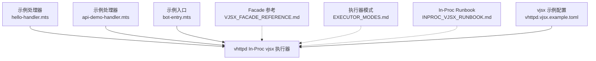
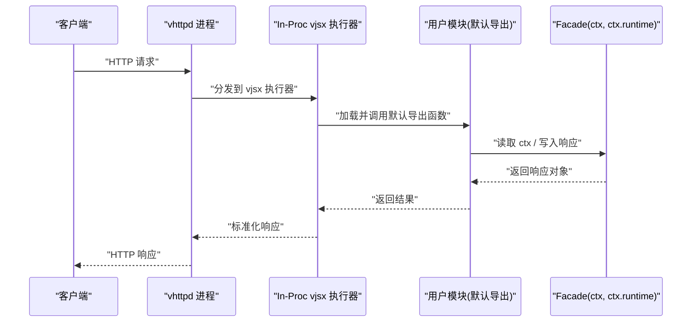
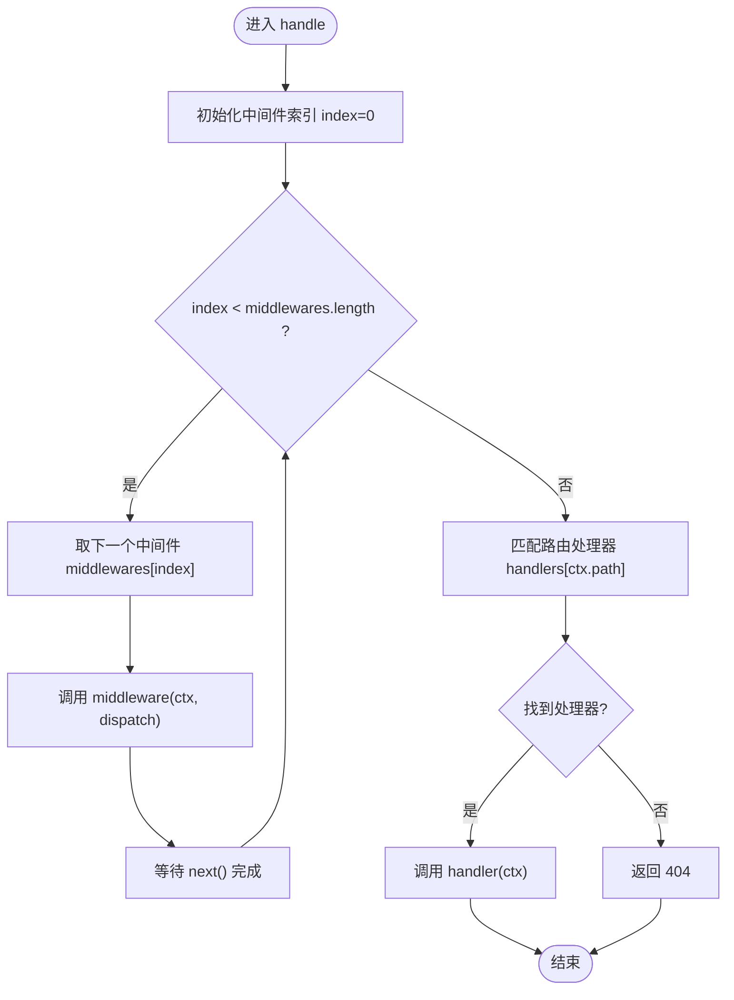
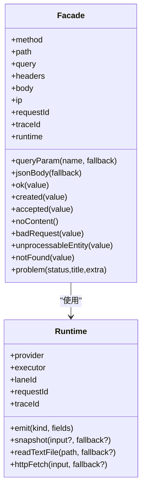

# 基础 VJSX 应用

<cite>
**本文引用的文件列表**
- [README.md](file://README.md)
- [08-vjsx-intro.md](file://articles/08-vjsx-intro.md)
- [VJSX_FACADE_REFERENCE.md](file://docs/VJSX_FACADE_REFERENCE.md)
- [EXECUTOR_MODES.md](file://docs/EXECUTOR_MODES.md)
- [INPROC_VJSX_RUNBOOK.md](file://docs/INPROC_VJSX_RUNBOOK.md)
- [vhttpd.vjsx.example.toml](file://config/vhttpd.vjsx.example.toml)
- [hello-handler.mts](file://examples/vjsx/hello-handler.mts)
- [api-demo-handler.mts](file://examples/vjsx/api-demo-handler.mts)
- [bot-entry.mts](file://examples/vjsx/bot-entry.mts)
</cite>

## 目录
1. [简介](#简介)
2. [项目结构](#项目结构)
3. [核心组件](#核心组件)
4. [架构总览](#架构总览)
5. [详细组件分析](#详细组件分析)
6. [依赖关系分析](#依赖关系分析)
7. [性能与可观测性](#性能与可观测性)
8. [故障排查指南](#故障排查指南)
9. [结论](#结论)
10. [附录：从 Hello World 到复杂 API 的演进](#附录从-hello-world-到复杂-api-的演进)

## 简介
本指南面向希望使用 vhttpd 内置的嵌入式 TypeScript/JavaScript 执行器（简称“vjsx”）快速构建 HTTP API 应用的开发者。你将学会：
- 创建简单的 HTTP API 处理器，处理请求与响应
- 实现基本业务逻辑、错误处理、日志记录与调试技巧
- 理解模块导入导出约定、中间件机制与配置选项
- 掌握 vjsx 执行器的生命周期、运行模式与最佳实践

vjsx 是 vhttpd 的“嵌入式执行器”，无需 Node.js，基于 QuickJS 引擎，支持 .mts 文件与类型检查，适合轻量网关、协议粘合与薄逻辑层场景。

章节来源
- [README.md:1-120](file://README.md#L1-L120)
- [08-vjsx-intro.md:1-42](file://articles/08-vjsx-intro.md#L1-L42)

## 项目结构
围绕 vjsx 的基础开发，仓库提供了示例入口、文档参考与配置模板：
- 示例处理器
  - hello-handler.mts：最简 HTTP 处理器
  - api-demo-handler.mts：演示多种语义化响应、内容协商与运行时快照
  - bot-entry.mts：HTTP + WebSocket Upstream 组合示例
- 文档参考
  - VJSX_FACADE_REFERENCE.md：Facade API 完整参考
  - EXECUTOR_MODES.md：执行器模式与配置要点
  - INPROC_VJSX_RUNBOOK.md：In-Proc vjsx 本地验证步骤
- 配置模板
  - vhttpd.vjsx.example.toml：最小可用的 vjsx 站点配置

图表来源
- [hello-handler.mts:1-16](file://examples/vjsx/hello-handler.mts#L1-L16)
- [api-demo-handler.mts:1-91](file://examples/vjsx/api-demo-handler.mts#L1-L91)
- [bot-entry.mts:1-120](file://examples/vjsx/bot-entry.mts#L1-L120)
- [VJSX_FACADE_REFERENCE.md:1-280](file://docs/VJSX_FACADE_REFERENCE.md#L1-L280)
- [EXECUTOR_MODES.md:106-136](file://docs/EXECUTOR_MODES.md#L106-L136)
- [INPROC_VJSX_RUNBOOK.md:54-85](file://docs/INPROC_VJSX_RUNBOOK.md#L54-L85)
- [vhttpd.vjsx.example.toml:1-37](file://config/vhttpd.vjsx.example.toml#L1-L37)

章节来源
- [README.md:1-120](file://README.md#L1-L120)
- [08-vjsx-intro.md:45-92](file://articles/08-vjsx-intro.md#L45-L92)

## 核心组件
- 入口解析与默认导出约定
  - 优先识别 export default；其次 export const handle；最后 globalThis.__vhttpd_handle
- 请求上下文 ctx
  - 提供方法级属性与方法：查询参数、请求头、请求体、内容协商、状态码与响应头等
- 运行时 ctx.runtime
  - 提供只读元数据、结构化事件 emit、快照 snapshot、文本文件读取 readTextFile、外部 HTTP 请求 httpFetch 等
- 响应辅助方法
  - ok/created/accepted/noContent/badRequest/unprocessableEntity/notFound/problem 等语义化响应
- 配置项
  - executor.kind = "vjsx"
  - vjsx.app_entry / module_root / runtime_profile / thread_count 等

章节来源
- [VJSX_FACADE_REFERENCE.md:1-120](file://docs/VJSX_FACADE_REFERENCE.md#L1-L120)
- [EXECUTOR_MODES.md:106-136](file://docs/EXECUTOR_MODES.md#L106-L136)
- [INPROC_VJSX_RUNBOOK.md:54-85](file://docs/INPROC_VJSX_RUNBOOK.md#L54-L85)

## 架构总览
vhttpd 作为传输与运行时层，将 HTTP/WebSocket/流式连接终止后，委派给“逻辑执行器”。在 vjsx 模式下，请求进入 In-Proc vjsx 执行器，加载并调用用户导出的默认函数，返回响应或命令。

图表来源
- [README.md:84-126](file://README.md#L84-L126)
- [VJSX_FACADE_REFERENCE.md:1-120](file://docs/VJSX_FACADE_REFERENCE.md#L1-L120)

## 详细组件分析

### 组件一：Hello World 处理器
- 目标：展示最小可用 HTTP 处理器
- 关键点
  - 默认导出 handle(ctx)
  - 通过 ctx.json() 返回 JSON
  - 读取 ctx.method、ctx.path、ctx.queryParam("name", "world")
  - 暴露 ctx.runtime.* 元信息用于追踪

章节来源
- [hello-handler.mts:1-16](file://examples/vjsx/hello-handler.mts#L1-L16)
- [08-vjsx-intro.md:94-123](file://articles/08-vjsx-intro.md#L94-L123)

### 组件二：API 演示处理器
- 目标：演示语义化响应、内容协商、运行时快照与事件发射
- 关键点
  - 根据 mode 分支返回不同响应
  - POST 时校验 Content-Type 并解析 JSON 体
  - 使用 ctx.runtime.emit 发送结构化事件
  - 使用 ctx.runtime.snapshot 聚合运行时指标

章节来源
- [api-demo-handler.mts:1-91](file://examples/vjsx/api-demo-handler.mts#L1-L91)
- [INPROC_VJSX_RUNBOOK.md:54-85](file://docs/INPROC_VJSX_RUNBOOK.md#L54-L85)

### 组件三：Bot 入口（HTTP + WebSocket Upstream）
- 目标：展示 HTTP 与 websocket_upstream 的组合形态
- 关键点
  - 默认导出对象包含 http 与 websocket_upstream 两个方法
  - websocket_upstream 接收 frame，返回 handled 与 commands
  - 通过 payloadJson 解析载荷并构造 provider.message.send 命令

章节来源
- [bot-entry.mts:1-120](file://examples/vjsx/bot-entry.mts#L1-L120)
- [VJSX_FACADE_REFERENCE.md:204-280](file://docs/VJSX_FACADE_REFERENCE.md#L204-L280)

### 组件四：中间件机制（应用层实现）
- 说明：vjsx 未内置框架级中间件，但可在应用层以数组形式组合中间件，形成类似 Express 的链式调用
- 典型中间件
  - 请求日志：记录方法与路径，统计耗时
  - 鉴权：校验 Authorization 头，注入 userId
  - CORS：设置跨域头并处理 OPTIONS 预检
- 调度流程

章节来源
- [08-vjsx-intro.md:325-392](file://articles/08-vjsx-intro.md#L325-L392)

### 组件五：配置与启动
- 关键配置项
  - executor.kind = "vjsx"
  - vjsx.app_entry：入口文件
  - vjsx.module_root：模块解析根目录
  - vjsx.runtime_profile：node 或 script
  - vjsx.thread_count：并发线程数
- 多监听器与站点隔离
  - 每个站点独立 executor 选择与 app 入口
- 变量展开与路径别名
  - TOML 字符串字段支持 ${section.key} 与 ${env.NAME:-default}

章节来源
- [vhttpd.vjsx.example.toml:1-37](file://config/vhttpd.vjsx.example.toml#L1-L37)
- [EXECUTOR_MODES.md:106-136](file://docs/EXECUTOR_MODES.md#L106-L136)
- [README.md:437-520](file://README.md#L437-L520)

## 依赖关系分析
- 入口解析顺序
  - export default > export const handle > globalThis.__vhttpd_handle
- Facade 能力边界
  - 当前范围：HTTP 分发 + websocket_upstream 分发
  - 暂不暴露：Stream 与 MCP worker 模式
- 运行时能力
  - emit/snapshot/readTextFile/httpFetch 等由 vhttpd 宿主侧提供

图表来源
- [VJSX_FACADE_REFERENCE.md:1-120](file://docs/VJSX_FACADE_REFERENCE.md#L1-L120)

章节来源
- [VJSX_FACADE_REFERENCE.md:1-120](file://docs/VJSX_FACADE_REFERENCE.md#L1-L120)

## 性能与可观测性
- 性能
  - 多线程执行：thread_count 控制并发 lane 数量
  - 无外部依赖：QuickJS 内嵌，减少环境开销
  - 建议：CPU 密集型逻辑尽量下沉至 PHP 或其他重型执行器
- 可观测性
  - 结构化事件：ctx.runtime.emit 输出到事件日志
  - 运行时快照：ctx.runtime.snapshot 获取聚合指标
  - Admin 平面：查看运行时、计划与替换状态

章节来源
- [INPROC_VJSX_RUNBOOK.md:54-85](file://docs/INPROC_VJSX_RUNBOOK.md#L54-L85)
- [08-vjsx-intro.md:631-665](file://articles/08-vjsx-intro.md#L631-L665)

## 故障排查指南
- 常见问题定位
  - 入口解析失败：确认是否按约定导出默认函数
  - 模块导入失败：检查 module_root 与相对路径
  - 运行时异常：使用 ctx.runtime.error 记录，结合事件日志定位
  - 转换/编译错误：关注 transform 相关事件与替换计划
- 实用技巧
  - 使用 ctx.runtime.snapshot 观察当前线程、请求计数等
  - 使用 Admin 端点查看 plan/replacement 状态
  - 通过 event log 过滤关键词如 inproc_vjsx_executor_handler_failed

章节来源
- [INPROC_VJSX_RUNBOOK.md:54-85](file://docs/INPROC_VJSX_RUNBOOK.md#L54-L85)
- [tests/e2e/config_acceptance_test.sh:2545-2561](file://tests/e2e/config_acceptance_test.sh#L2545-L2561)

## 结论
vjsx 为 vhttpd 提供了轻量、高性能的嵌入式执行能力，适合快速构建 HTTP API 与协议粘合逻辑。通过标准导出约定、丰富的 Facade API 与结构化可观测能力，开发者可以高效地实现从 Hello World 到具备鉴权、CORS、内容协商与运行时监控的 API 服务。对于更复杂的业务逻辑，推荐与 PHP 执行器协作，形成“薄前端 + 厚后端”的分层架构。

## 附录：从 Hello World 到复杂 API 的演进
- 第一步：最小可用
  - 使用 hello-handler.mts 作为入口，返回 JSON 并打印请求元信息
- 第二步：丰富响应与内容协商
  - 使用 api-demo-handler.mts 演示 ok/created/accepted/problem 等语义化响应
  - 使用 is/isJson/wantsJson 等进行内容协商
- 第三步：引入中间件
  - 在应用层实现日志、鉴权、CORS 等中间件，组合成处理链
- 第四步：接入外部系统
  - 使用 ctx.runtime.httpFetch 发起外部 HTTP 请求
  - 使用 ctx.runtime.readTextFile 读取配置文件
- 第五步：WebSocket Upstream
  - 使用 bot-entry.mts 中的 websocket_upstream 处理上游事件并下发命令
- 第六步：可观测性与运维
  - 使用 ctx.runtime.emit 与 ctx.runtime.snapshot 进行埋点与监控
  - 借助 Admin 平面查看运行时与计划状态

章节来源
- [hello-handler.mts:1-16](file://examples/vjsx/hello-handler.mts#L1-L16)
- [api-demo-handler.mts:1-91](file://examples/vjsx/api-demo-handler.mts#L1-L91)
- [08-vjsx-intro.md:325-392](file://articles/08-vjsx-intro.md#L325-L392)
- [bot-entry.mts:1-120](file://examples/vjsx/bot-entry.mts#L1-L120)
- [INPROC_VJSX_RUNBOOK.md:54-85](file://docs/INPROC_VJSX_RUNBOOK.md#L54-L85)