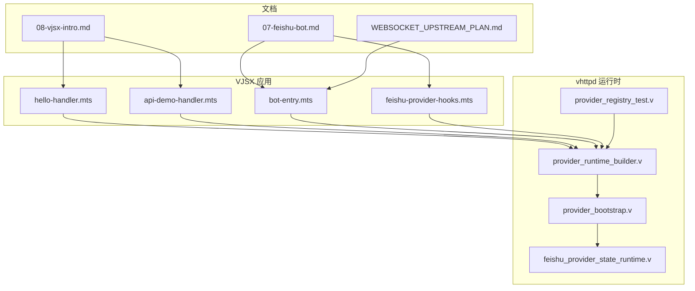
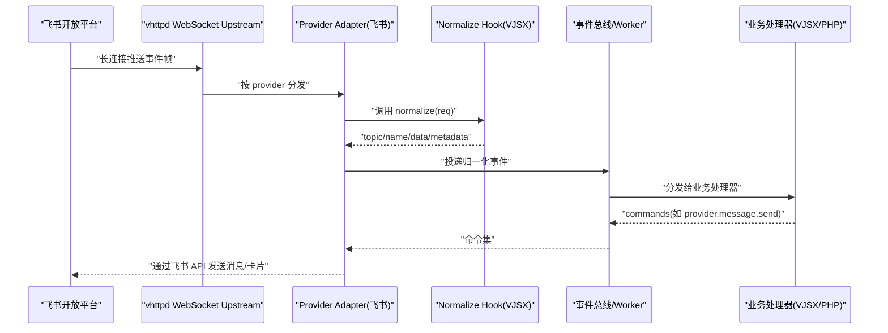
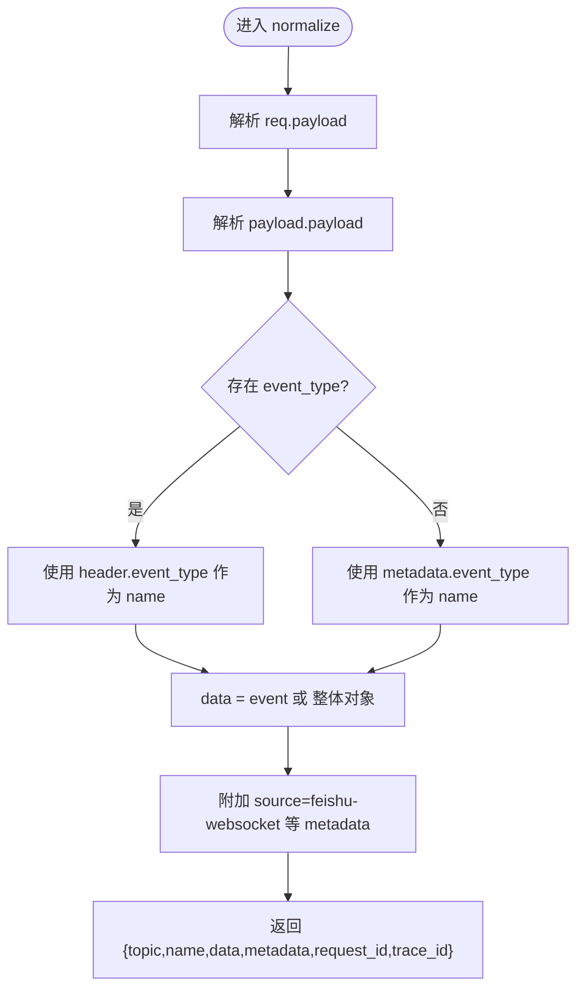
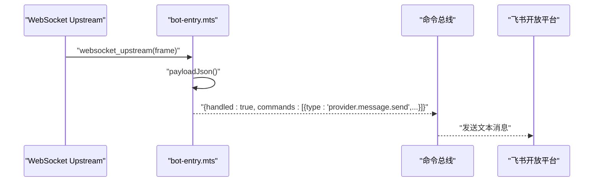
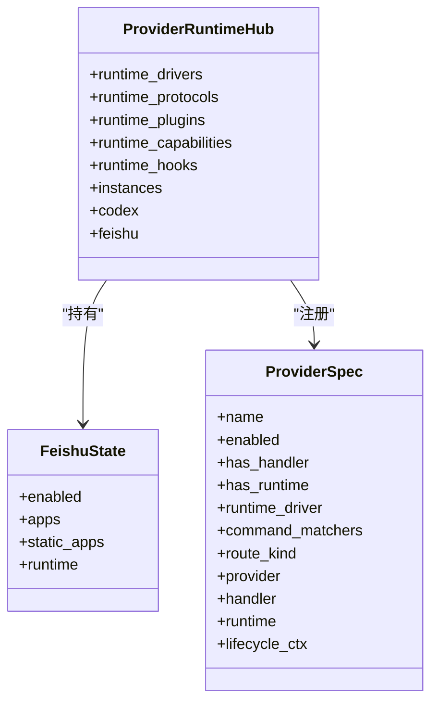
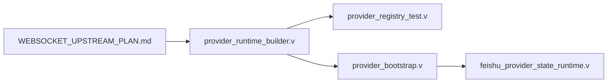

# 飞书机器人应用

<cite>
**本文引用的文件**   
- [examples/vjsx/feishu-provider-hooks.mts](file://examples/vjsx/feishu-provider-hooks.mts)
- [examples/vjsx/bot-entry.mts](file://examples/vjsx/bot-entry.mts)
- [examples/vjsx/hello-handler.mts](file://examples/vjsx/hello-handler.mts)
- [examples/vjsx/api-demo-handler.mts](file://examples/vjsx/api-demo-handler.mts)
- [articles/07-feishu-bot.md](file://articles/07-feishu-bot.md)
- [articles/08-vjsx-intro.md](file://articles/08-vjsx-intro.md)
- [src/provider_runtime_builder.v](file://src/provider_runtime_builder.v)
- [src/provider_registry_test.v](file://src/provider_registry_test.v)
- [src/provider_bootstrap.v](file://src/provider_bootstrap.v)
- [src/feishu_provider_state_runtime.v](file://src/feishu_provider_state_runtime.v)
- [docs/WEBSOCKET_UPSTREAM_PLAN.md](file://docs/WEBSOCKET_UPSTREAM_PLAN.md)
</cite>

## 目录
1. [简介](#简介)
2. [项目结构](#项目结构)
3. [核心组件](#核心组件)
4. [架构总览](#架构总览)
5. [详细组件分析](#详细组件分析)
6. [依赖关系分析](#依赖关系分析)
7. [性能与可靠性](#性能与可靠性)
8. [故障排查指南](#故障排查指南)
9. [结论](#结论)
10. [附录：示例与模板](#附录示例与模板)

## 简介
本指南面向使用 vhttpd 构建“飞书机器人 VJSX 应用”的开发者，覆盖以下关键主题：
- 飞书消息处理、卡片交互、事件订阅与回调处理
- 机器人认证、消息路由、用户状态管理与权限控制
- Provider Hooks（握手、归一化）在 VJSX 中的使用方法与自定义钩子实现
- 完整的消息模板、交互式卡片与实时更新示例路径
- 基于 WebSocket upstream 的事件驱动模型与命令式响应

## 项目结构
围绕飞书机器人 VJSX 应用，仓库中与本指南直接相关的代码与文档分布如下：
- VJSX 示例与入口
  - examples/vjsx/feishu-provider-hooks.mts：Provider Hooks 示例（handshake、normalize）
  - examples/vjsx/bot-entry.mts：WebSocket Upstream 最小可用入口
  - examples/vjsx/hello-handler.mts：HTTP Handler 基础示例
  - examples/vjsx/api-demo-handler.mts：API 演示与运行时快照
- 文章与说明
  - articles/07-feishu-bot.md：飞书机器人实战（配置、事件流、卡片、监控）
  - articles/08-vjsx-intro.md：vjsx 入门与上下文 API
- 运行时与提供者注册
  - src/provider_runtime_builder.v：Provider 运行时构建器（驱动、协议、插件、能力、钩子）
  - src/provider_registry_test.v：Provider 运行时能力与钩子断言
  - src/provider_bootstrap.v：Provider 启动与命令匹配器注册
  - src/feishu_provider_state_runtime.v：飞书运行时状态查询辅助
- 设计规划
  - docs/WEBSOCKET_UPSTREAM_PLAN.md：WebSocket upstream 分层与边界

图表来源
- [examples/vjsx/hello-handler.mts](file://examples/vjsx/hello-handler.mts)
- [examples/vjsx/api-demo-handler.mts](file://examples/vjsx/api-demo-handler.mts)
- [examples/vjsx/bot-entry.mts](file://examples/vjsx/bot-entry.mts)
- [examples/vjsx/feishu-provider-hooks.mts](file://examples/vjsx/feishu-provider-hooks.mts)
- [src/provider_runtime_builder.v](file://src/provider_runtime_builder.v)
- [src/provider_bootstrap.v](file://src/provider_bootstrap.v)
- [src/feishu_provider_state_runtime.v](file://src/feishu_provider_state_runtime.v)
- [src/provider_registry_test.v](file://src/provider_registry_test.v)
- [articles/07-feishu-bot.md](file://articles/07-feishu-bot.md)
- [articles/08-vjsx-intro.md](file://articles/08-vjsx-intro.md)
- [docs/WEBSOCKET_UPSTREAM_PLAN.md](file://docs/WEBSOCKET_UPSTREAM_PLAN.md)

章节来源
- [examples/vjsx/hello-handler.mts](file://examples/vjsx/hello-handler.mts)
- [examples/vjsx/api-demo-handler.mts](file://examples/vjsx/api-demo-handler.mts)
- [examples/vjsx/bot-entry.mts](file://examples/vjsx/bot-entry.mts)
- [examples/vjsx/feishu-provider-hooks.mts](file://examples/vjsx/feishu-provider-hooks.mts)
- [articles/07-feishu-bot.md](file://articles/07-feishu-bot.md)
- [articles/08-vjsx-intro.md](file://articles/08-vjsx-intro.md)
- [src/provider_runtime_builder.v](file://src/provider_runtime_builder.v)
- [src/provider_bootstrap.v](file://src/provider_bootstrap.v)
- [src/feishu_provider_state_runtime.v](file://src/feishu_provider_state_runtime.v)
- [src/provider_registry_test.v](file://src/provider_registry_test.v)
- [docs/WEBSOCKET_UPSTREAM_PLAN.md](file://docs/WEBSOCKET_UPSTREAM_PLAN.md)

## 核心组件
- VJSX HTTP Handler
  - 通过默认导出函数接收 ctx 上下文，返回结构化响应。用于健康检查、调试与元信息输出。
  - 参考路径：[examples/vjsx/hello-handler.mts](file://examples/vjsx/hello-handler.mts)、[examples/vjsx/api-demo-handler.mts](file://examples/vjsx/api-demo-handler.mts)
- VJSX WebSocket Upstream 入口
  - 暴露 websocket_upstream(frame) 方法，解析 frame.payloadJson()，构造 provider.message.send 命令并返回 commands 列表。
  - 参考路径：[examples/vjsx/bot-entry.mts](file://examples/vjsx/bot-entry.mts)
- Provider Hooks（VJSX）
  - handshake(req)：握手阶段发送 hello 帧等初始化数据。
  - normalize(req)：将上游原始 payload 归一化为内部事件 topic/name/data/metadata。
  - 参考路径：[examples/vjsx/feishu-provider-hooks.mts](file://examples/vjsx/feishu-provider-hooks.mts)
- Provider 运行时与注册
  - provider_runtime_builder.v：定义运行时驱动、协议、插件、能力、钩子映射。
  - provider_bootstrap.v：注册 feishu 命令匹配器（如 feishu.message.*）。
  - provider_registry_test.v：断言飞书运行时驱动为 vjsx、协议为 websocket、能力与钩子映射。
  - feishu_provider_state_runtime.v：提供运行时启用与实例源查询辅助。
  - 参考路径：[src/provider_runtime_builder.v](file://src/provider_runtime_builder.v)、[src/provider_bootstrap.v](file://src/provider_bootstrap.v)、[src/provider_registry_test.v](file://src/provider_registry_test.v)、[src/feishu_provider_state_runtime.v](file://src/feishu_provider_state_runtime.v)
- 文档与最佳实践
  - 07-feishu-bot.md：飞书事件流、卡片交互、Admin 监控、常见问题。
  - 08-vjsx-intro.md：vjsx 上下文 API、中间件模式、WebSocket Upstream 帧属性与返回值约定。
  - WEBSOCKET_UPSTREAM_PLAN.md：upstream 分层、provider 边界、MVP 范围。
  - 参考路径：[articles/07-feishu-bot.md](file://articles/07-feishu-bot.md)、[articles/08-vjsx-intro.md](file://articles/08-vjsx-intro.md)、[docs/WEBSOCKET_UPSTREAM_PLAN.md](file://docs/WEBSOCKET_UPSTREAM_PLAN.md)

章节来源
- [examples/vjsx/hello-handler.mts](file://examples/vjsx/hello-handler.mts)
- [examples/vjsx/api-demo-handler.mts](file://examples/vjsx/api-demo-handler.mts)
- [examples/vjsx/bot-entry.mts](file://examples/vjsx/bot-entry.mts)
- [examples/vjsx/feishu-provider-hooks.mts](file://examples/vjsx/feishu-provider-hooks.mts)
- [src/provider_runtime_builder.v](file://src/provider_runtime_builder.v)
- [src/provider_bootstrap.v](file://src/provider_bootstrap.v)
- [src/provider_registry_test.v](file://src/provider_registry_test.v)
- [src/feishu_provider_state_runtime.v](file://src/feishu_provider_state_runtime.v)
- [articles/07-feishu-bot.md](file://articles/07-feishu-bot.md)
- [articles/08-vjsx-intro.md](file://articles/08-vjsx-intro.md)
- [docs/WEBSOCKET_UPSTREAM_PLAN.md](file://docs/WEBSOCKET_UPSTREAM_PLAN.md)

## 架构总览
vhttpd 以“WebSocket upstream + Provider 适配器 + Worker 业务逻辑”的分层模型承载飞书机器人：
- upstream runtime：负责连接、重连、ping/pong、frame 收发循环与 provider 分发
- provider adapter：负责鉴权、bootstrap、frame 编解码、ack 语义与发送 API
- worker 业务逻辑：消费归一化后的事件，执行命令（如发送文本、卡片、更新消息）

图表来源
- [docs/WEBSOCKET_UPSTREAM_PLAN.md](file://docs/WEBSOCKET_UPSTREAM_PLAN.md)
- [examples/vjsx/feishu-provider-hooks.mts](file://examples/vjsx/feishu-provider-hooks.mts)
- [examples/vjsx/bot-entry.mts](file://examples/vjsx/bot-entry.mts)

## 详细组件分析

### 组件A：VJSX Provider Hooks（握手与归一化）
- 目标
  - 在握手阶段向远端发送 hello 帧，便于对端识别 provider/instance。
  - 将上游原始 payload 归一化为统一事件结构，供后续管道消费。
- 关键行为
  - handshake(req)：解析 req.payload，返回 send 数组，包含 text 字段（JSON 字符串），携带 type/provider/instance。
  - normalize(req)：解析 req.payload 与 payload.payload，提取 header.event_type 或 metadata.event_type 作为 name，event 或整体对象作为 data，并附加 source=feishu-websocket 等 metadata。
- 扩展点
  - 可在 normalize 中增加鉴权校验、租户隔离、事件过滤、敏感字段脱敏等。
  - 可在 handshake 中动态下发策略、白名单、限流参数等。

图表来源
- [examples/vjsx/feishu-provider-hooks.mts](file://examples/vjsx/feishu-provider-hooks.mts)

章节来源
- [examples/vjsx/feishu-provider-hooks.mts](file://examples/vjsx/feishu-provider-hooks.mts)

### 组件B：VJSX WebSocket Upstream 入口（最小可用）
- 目标
  - 接收来自 upstream 的 frame，解析 payload，构造 provider.message.send 命令，完成简单回显。
- 关键行为
  - frame.payloadJson({}) 获取 JSON 载荷；若 text 为空则使用占位值。
  - 返回 handled=true 与 commands 列表，其中 type=provider.message.send，指定 provider/instance/target/target_type/message_type/text/metadata。
- 适用场景
  - 快速验证链路连通性、调试事件流转、原型验证。

图表来源
- [examples/vjsx/bot-entry.mts](file://examples/vjsx/bot-entry.mts)

章节来源
- [examples/vjsx/bot-entry.mts](file://examples/vjsx/bot-entry.mts)

### 组件C：Provider 运行时与命令匹配器
- 运行时驱动与协议
  - 飞书运行时驱动为 vjsx，协议为 websocket，插件名为 feishu_runtime。
  - 能力映射：send_message -> feishu.message.send；update_message -> provider.feishu.update_message。
  - 钩子映射：handshake、normalize。
- 命令匹配器
  - 注册前缀匹配器 feishu.message.*，用于将命令路由到飞书 provider。
- 运行时状态
  - 提供运行时启用判断、静态/动态实例源查询等辅助方法。

图表来源
- [src/provider_runtime_builder.v](file://src/provider_runtime_builder.v)
- [src/provider_bootstrap.v](file://src/provider_bootstrap.v)
- [src/feishu_provider_state_runtime.v](file://src/feishu_provider_state_runtime.v)
- [src/provider_registry_test.v](file://src/provider_registry_test.v)

章节来源
- [src/provider_runtime_builder.v](file://src/provider_runtime_builder.v)
- [src/provider_bootstrap.v](file://src/provider_bootstrap.v)
- [src/feishu_provider_state_runtime.v](file://src/feishu_provider_state_runtime.v)
- [src/provider_registry_test.v](file://src/provider_registry_test.v)

### 组件D：VJSX HTTP Handler 与运行时快照
- 用途
  - 提供健康检查、请求摘要、运行时快照（worker_pool_size、active_websockets、active_upstreams 等）。
  - 支持多种响应类型（JSON/HTML）、问题详情（RFC 7807 Problem Details）、异步接受（202 Accepted）。
- 典型用法
  - 结合 ctx.runtime.emit 上报自定义事件，配合 Admin Plane 观测。
  - 使用 ctx.queryParam、ctx.jsonBody、ctx.is 等便捷方法简化请求处理。

章节来源
- [examples/vjsx/hello-handler.mts](file://examples/vjsx/hello-handler.mts)
- [examples/vjsx/api-demo-handler.mts](file://examples/vjsx/api-demo-handler.mts)
- [articles/08-vjsx-intro.md](file://articles/08-vjsx-intro.md)

### 组件E：飞书卡片交互与消息模板
- 卡片交互流程
  - 收到 im.message.receive_v1 时，根据文本内容选择不同卡片模板（欢迎卡/天气卡）。
  - 收到 im.message.action_v1 时，解析 action.value.action 进行按钮点击处理。
- 消息模板要点
  - config.wide_screen_mode 开启宽屏模式。
  - header.title.tag=plain_text，header.template 设置主题色。
  - elements 中使用 markdown/lark_md 渲染富文本，action 中包含 button 与 value。
- 更新消息
  - 先发送“思考中”消息，获得 message_id，后续通过 update 命令替换内容。

章节来源
- [articles/07-feishu-bot.md](file://articles/07-feishu-bot.md)

## 依赖关系分析
- 运行时绑定
  - provider_runtime_builder.v 定义了运行时驱动、协议、插件、能力与钩子的映射表。
  - provider_registry_test.v 断言飞书运行时驱动为 vjsx、协议为 websocket、能力与钩子映射正确。
  - provider_bootstrap.v 注册 feishu 命令匹配器（feishu.message.*），确保命令路由到飞书 provider。
  - feishu_provider_state_runtime.v 提供运行时启用与实例源查询辅助。
- 文档与设计
  - WEBSOCKET_UPSTREAM_PLAN.md 明确 upstream 分层与 provider 边界，指导实现与演进。

图表来源
- [src/provider_runtime_builder.v](file://src/provider_runtime_builder.v)
- [src/provider_registry_test.v](file://src/provider_registry_test.v)
- [src/provider_bootstrap.v](file://src/provider_bootstrap.v)
- [src/feishu_provider_state_runtime.v](file://src/feishu_provider_state_runtime.v)
- [docs/WEBSOCKET_UPSTREAM_PLAN.md](file://docs/WEBSOCKET_UPSTREAM_PLAN.md)

章节来源
- [src/provider_runtime_builder.v](file://src/provider_runtime_builder.v)
- [src/provider_registry_test.v](file://src/provider_registry_test.v)
- [src/provider_bootstrap.v](file://src/provider_bootstrap.v)
- [src/feishu_provider_state_runtime.v](file://src/feishu_provider_state_runtime.v)
- [docs/WEBSOCKET_UPSTREAM_PLAN.md](file://docs/WEBSOCKET_UPSTREAM_PLAN.md)

## 性能与可靠性
- 连接与重连
  - upstream 负责连接建立、心跳、自动重连与错误恢复，避免业务侧重复实现。
- 事件去重
  - 建议在业务层基于 messageId 做幂等处理，防止重复消费。
- 异步处理
  - 先发“思考中”消息，再异步执行耗时任务，完成后通过 update 命令更新消息体。
- 可观测性
  - 使用 ctx.runtime.emit 上报自定义事件；通过 Admin Plane 查看运行时快照与事件日志。

章节来源
- [articles/07-feishu-bot.md](file://articles/07-feishu-bot.md)
- [articles/08-vjsx-intro.md](file://articles/08-vjsx-intro.md)
- [docs/WEBSOCKET_UPSTREAM_PLAN.md](file://docs/WEBSOCKET_UPSTREAM_PLAN.md)

## 故障排查指南
- 常见现象
  - 无法接收事件：检查 provider 是否启用、实例是否正确、事件订阅是否配置。
  - 卡片不显示：确认卡片 JSON 结构与字段是否符合规范。
  - 重复处理：确认是否在业务层实现了 messageId 去重。
- 定位手段
  - 查看 Admin Plane 的运行时快照与上游 WebSocket 状态。
  - 观察事件日志（NDJSON），核对 trace_id 与 pipeline 名称。
  - 在 normalize 与业务处理器中增加日志输出，定位异常分支。

章节来源
- [articles/07-feishu-bot.md](file://articles/07-feishu-bot.md)

## 结论
通过 vhttpd 的 WebSocket upstream 与 Provider Hooks，开发者可以以 VJSX 轻量方式快速构建飞书机器人：
- 使用 handshake/normalize 完成握手与事件归一化
- 在 bot-entry 中实现最小可用的消息回显
- 借助卡片模板与按钮动作实现丰富的交互体验
- 利用运行时快照与事件日志提升可观测性与排障效率

## 附录：示例与模板
- VJSX 示例
  - HTTP Handler：[examples/vjsx/hello-handler.mts](file://examples/vjsx/hello-handler.mts)
  - API 演示与运行时快照：[examples/vjsx/api-demo-handler.mts](file://examples/vjsx/api-demo-handler.mts)
  - WebSocket Upstream 入口：[examples/vjsx/bot-entry.mts](file://examples/vjsx/bot-entry.mts)
  - Provider Hooks（握手/归一化）：[examples/vjsx/feishu-provider-hooks.mts](file://examples/vjsx/feishu-provider-hooks.mts)
- 文档与实践
  - 飞书机器人实战（配置、事件流、卡片、监控）：[articles/07-feishu-bot.md](file://articles/07-feishu-bot.md)
  - vjsx 入门与上下文 API：[articles/08-vjsx-intro.md](file://articles/08-vjsx-intro.md)
  - WebSocket upstream 分层与边界：[docs/WEBSOCKET_UPSTREAM_PLAN.md](file://docs/WEBSOCKET_UPSTREAM_PLAN.md)