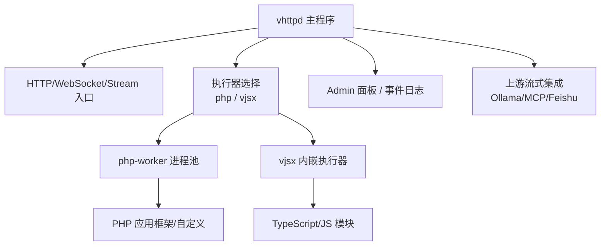
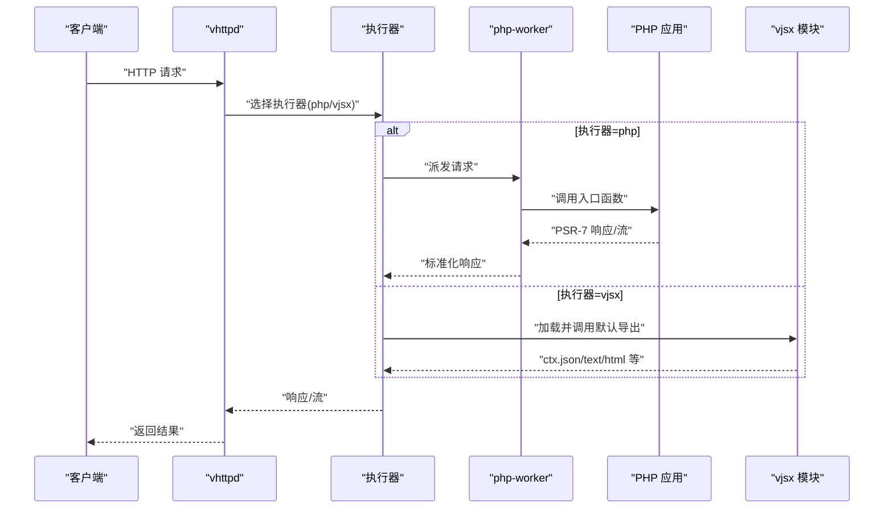
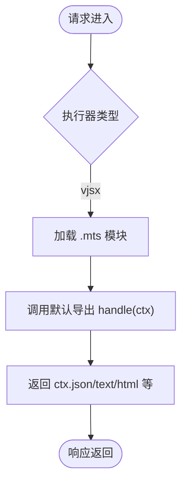
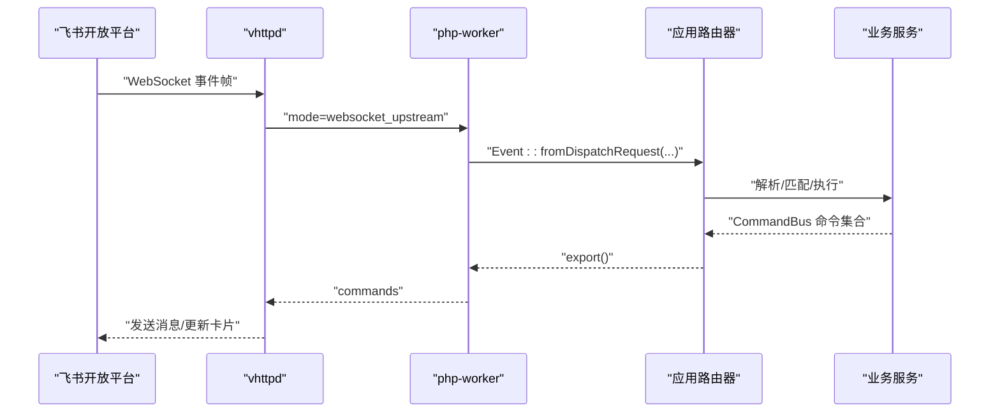
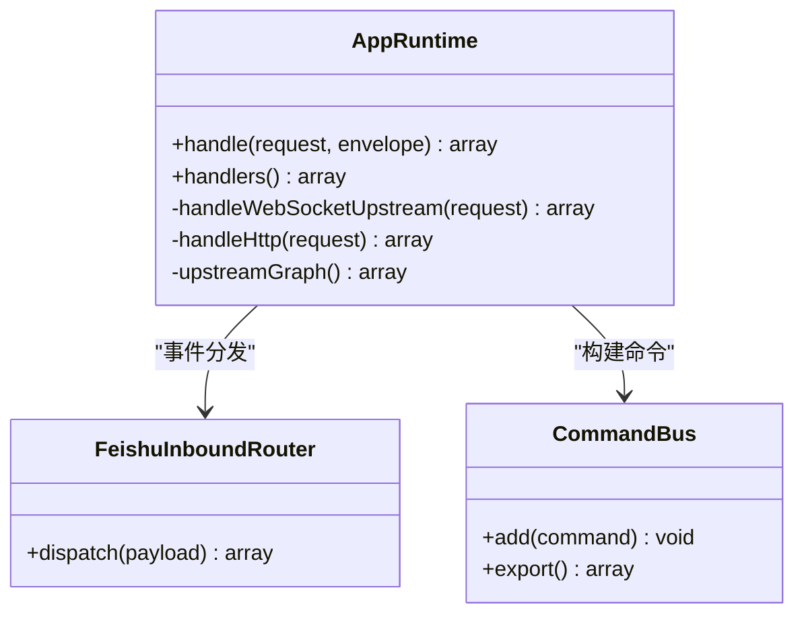

# 完整应用示例

<cite>
**本文引用的文件**
- [README.md](file://README.md)
- [examples/README.md](file://examples/README.md)
- [articles/03-php-apps.md](file://articles/03-php-apps.md)
- [articles/08-vjsx-intro.md](file://articles/08-vjsx-intro.md)
- [articles/07-feishu-bot.md](file://articles/07-feishu-bot.md)
- [articles/09-codexbot.md](file://articles/09-codexbot.md)
- [examples/laravel/app.php](file://examples/laravel/app.php)
- [examples/symfony/app.php](file://examples/symfony/app.php)
- [examples/wordpress/app.php](file://examples/wordpress/app.php)
- [examples/vjsx/hello-handler.mts](file://examples/vjsx/hello-handler.mts)
- [examples/codexbot-app/app.php](file://examples/codexbot-app/app.php)
- [examples/codexbot-app/lib/AppRuntime.php](file://examples/codexbot-app/lib/AppRuntime.php)
- [examples/codexbot-app/lib/Upstream/FeishuInboundRouter.php](file://examples/codexbot-app/lib/Upstream/FeishuInboundRouter.php)
- [config/vhttpd.vjsx.example.toml](file://config/vhttpd.vjsx.example.toml)
- [examples/config/laravel.toml](file://examples/config/laravel.toml)
- [examples/config/symfony.toml](file://examples/config/symfony.toml)
- [examples/config/wordpress.toml](file://examples/config/wordpress.toml)
- [examples/codexbot-app/codexbot.toml](file://examples/codexbot-app/codexbot.toml)
</cite>

## 目录
1. [引言](#引言)
2. [项目结构](#项目结构)
3. [核心组件](#核心组件)
4. [架构总览](#架构总览)
5. [详细组件分析](#详细组件分析)
6. [依赖分析](#依赖分析)
7. [性能考虑](#性能考虑)
8. [故障排查指南](#故障排查指南)
9. [结论](#结论)
10. [附录](#附录)

## 引言
本示例文档面向希望从零到一落地多种应用的工程师与运维人员，覆盖以下场景：
- PHP 应用（Laravel、Symfony、WordPress）在 vhttpd 上的部署与配置
- VJSX 应用的开发与架构设计（嵌入式 TypeScript/JavaScript）
- 飞书机器人应用的实现（WebSocket upstream + HTTP 回调）
- CodexBot AI 应用的完整开发流程（PHP 版与 TS 版）

每个示例均包含：项目结构说明、配置文件详解、核心代码解析、依赖管理与部署指南，并提供从开发到生产环境的实践指导。

## 项目结构
仓库以“运行时 + 示例”组织：
- 根目录 README 提供总体能力、运行方式、TOML 配置、多监听器模式、服务管理、打包分发等
- examples 下提供可直接运行的示例与配置
- articles 为教程式文章，串联各示例的实战步骤
- config 提供通用示例配置模板

图表来源
- [README.md:84-126](file://README.md#L84-L126)

章节来源
- [README.md:1-126](file://README.md#L1-L126)
- [examples/README.md:1-52](file://examples/README.md#L1-L52)

## 核心组件
- 执行器模型
  - php：通过外部 php-worker 进程执行 PHP 应用，支持长连接、流式响应、MCP、WebSocket upstream
  - vjsx：内嵌 QuickJS 执行 TypeScript/JavaScript，适合轻量网关、协议粘合、中间件
- 运行时能力
  - 统一请求上下文、事件日志、Admin 观测
  - 上游流式托管（phase 3 UpstreamPlan），如 Ollama 代理
  - WebSocket upstream（飞书）与回调入口
- 配置系统
  - TOML 优先，CLI 覆盖；支持变量展开与多监听器站点隔离

章节来源
- [README.md:33-126](file://README.md#L33-L126)
- [README.md:437-617](file://README.md#L437-L617)

## 架构总览
下图展示典型请求路径：客户端进入 vhttpd，按站点与执行器路由到 php-worker 或 vjsx，再返回响应或流式数据。

图表来源
- [README.md:84-126](file://README.md#L84-L126)

## 详细组件分析

### PHP 应用（Laravel/Symfony/WordPress）
本节聚焦三类 PHP 框架在 vhttpd 上的集成要点：入口桥接、配置项、依赖安装与启动验证。

#### Laravel 集成
- 入口职责
  - 将 PSR-7 请求转换为 Symfony HttpFoundation，再转为 Illuminate Request
  - 路由处理完成后，再转回 PSR-7 响应
- 关键文件
  - 入口：[examples/laravel/app.php](file://examples/laravel/app.php)
  - 配置：[examples/config/laravel.toml](file://examples/config/laravel.toml)
- 依赖与启动
  - 先安装 vendor 依赖
  - 使用 vhttpd --config 指定配置，端口与管理端点见配置

章节来源
- [examples/laravel/app.php:17-54](file://examples/laravel/app.php#L17-L54)
- [examples/config/laravel.toml:1-23](file://examples/config/laravel.toml#L1-L23)
- [articles/03-php-apps.md:38-159](file://articles/03-php-apps.md#L38-L159)

#### Symfony 集成
- 入口职责
  - 直接挂载 Symfony HttpKernel，保持完整框架体验
  - 同样通过 PSR-7 ↔ HttpFoundation 转换
- 关键文件
  - 入口：[examples/symfony/app.php](file://examples/symfony/app.php)
  - 配置：[examples/config/symfony.toml](file://examples/config/symfony.toml)
- 依赖与启动
  - 安装依赖后，通过 vhttpd 启动并访问示例路由

章节来源
- [examples/symfony/app.php:23-66](file://examples/symfony/app.php#L23-L66)
- [examples/config/symfony.toml:1-22](file://examples/config/symfony.toml#L1-L22)
- [articles/03-php-apps.md:162-263](file://articles/03-php-apps.md#L162-L263)

#### WordPress 集成
- 入口职责
  - 基于 Lifecycle 完成环境准备、静态资源直通、未安装引导、wp() 路由与模板渲染
  - 拦截 wp_redirect 异常，转化为标准响应
- 关键文件
  - 入口：[examples/wordpress/app.php](file://examples/wordpress/app.php)
  - 配置：[examples/config/wordpress.toml](file://examples/config/wordpress.toml)
- 环境变量
  - 需设置 VPHP_WP_ROOT 指向真实 WordPress 根目录

章节来源
- [examples/wordpress/app.php:1-252](file://examples/wordpress/app.php#L1-L252)
- [examples/config/wordpress.toml:1-23](file://examples/config/wordpress.toml#L1-L23)
- [articles/03-php-apps.md:266-365](file://articles/03-php-apps.md#L266-L365)

#### 一键演示与参考
- 示例索引与命令参考见 examples/README.md
- 教程文章对三种框架的迁移思路、最佳实践做了系统化总结

章节来源
- [examples/README.md:406-425](file://examples/README.md#L406-L425)
- [articles/03-php-apps.md:368-503](file://articles/03-php-apps.md#L368-L503)

### VJSX 应用（嵌入式 TypeScript/JavaScript）
- 适用场景
  - 快速原型、轻量网关/中间件、协议粘合、低开销高并发
- 配置要点
  - executor.kind = "vjsx"
  - vjsx.app_entry/module_root/runtime_profile/thread_count
- 最小入口
  - 导出默认函数，接收 ctx，返回 ctx.json/text/html 等
- 参考
  - 示例入口：[examples/vjsx/hello-handler.mts](file://examples/vjsx/hello-handler.mts)
  - 示例配置：[config/vhttpd.vjsx.example.toml](file://config/vhttpd.vjsx.example.toml)
  - 入门教程：[articles/08-vjsx-intro.md](file://articles/08-vjsx-intro.md)

图表来源
- [config/vhttpd.vjsx.example.toml:18-25](file://config/vhttpd.vjsx.example.toml#L18-L25)
- [examples/vjsx/hello-handler.mts:1-16](file://examples/vjsx/hello-handler.mts#L1-L16)
- [articles/08-vjsx-intro.md:45-92](file://articles/08-vjsx-intro.md#L45-L92)

章节来源
- [config/vhttpd.vjsx.example.toml:1-37](file://config/vhttpd.vjsx.example.toml#L1-L37)
- [examples/vjsx/hello-handler.mts:1-16](file://examples/vjsx/hello-handler.mts#L1-L16)
- [articles/08-vjsx-intro.md:1-120](file://articles/08-vjsx-intro.md#L1-L120)

### 飞书机器人应用
- 连接方式
  - 通过 vhttpd 的 WebSocket upstream 与飞书开放平台建立长连接，自动重连与 token 刷新
- 事件处理
  - 事件经 Event 规范化后进入应用层路由器，解析消息、匹配项目、路由命令
- 回调入口
  - HTTP 回调用于交互卡片等场景，与 worker 桥接复用
- 参考
  - 教程：[articles/07-feishu-bot.md](file://articles/07-feishu-bot.md)
  - 入口与运行时：[examples/codexbot-app/app.php](file://examples/codexbot-app/app.php)、[examples/codexbot-app/lib/AppRuntime.php](file://examples/codexbot-app/lib/AppRuntime.php)
  - 入站路由：[examples/codexbot-app/lib/Upstream/FeishuInboundRouter.php](file://examples/codexbot-app/lib/Upstream/FeishuInboundRouter.php)

图表来源
- [articles/07-feishu-bot.md:24-47](file://articles/07-feishu-bot.md#L24-L47)
- [examples/codexbot-app/lib/AppRuntime.php:49-63](file://examples/codexbot-app/lib/AppRuntime.php#L49-L63)
- [examples/codexbot-app/lib/Upstream/FeishuInboundRouter.php:18-48](file://examples/codexbot-app/lib/Upstream/FeishuInboundRouter.php#L18-L48)

章节来源
- [articles/07-feishu-bot.md:1-120](file://articles/07-feishu-bot.md#L1-L120)
- [examples/codexbot-app/app.php:1-15](file://examples/codexbot-app/app.php#L1-L15)
- [examples/codexbot-app/lib/AppRuntime.php:1-79](file://examples/codexbot-app/lib/AppRuntime.php#L1-L79)
- [examples/codexbot-app/lib/Upstream/FeishuInboundRouter.php:1-50](file://examples/codexbot-app/lib/Upstream/FeishuInboundRouter.php#L1-L50)

### CodexBot AI 应用（PHP 版与 TS 版）
- 整体目标
  - 结合飞书渠道与 Codex 协议，提供聊天、会话、任务、实时协作等能力
- PHP 版
  - 入口：[examples/codexbot-app/app.php](file://examples/codexbot-app/app.php)
  - 运行时：[examples/codexbot-app/lib/AppRuntime.php](file://examples/codexbot-app/lib/AppRuntime.php)
  - 配置：[examples/codexbot-app/codexbot.toml](file://examples/codexbot-app/codexbot.toml)
- TS 版
  - 入口与协议定义位于 examples/codexbot-app-ts（含 codex/protocol.mts 等）
- 教程
  - 深度解析与最佳实践：[articles/09-codexbot.md](file://articles/09-codexbot.md)

图表来源
- [examples/codexbot-app/lib/AppRuntime.php:24-77](file://examples/codexbot-app/lib/AppRuntime.php#L24-L77)
- [examples/codexbot-app/lib/Upstream/FeishuInboundRouter.php:18-48](file://examples/codexbot-app/lib/Upstream/FeishuInboundRouter.php#L18-L48)

章节来源
- [examples/codexbot-app/app.php:1-15](file://examples/codexbot-app/app.php#L1-L15)
- [examples/codexbot-app/lib/AppRuntime.php:1-79](file://examples/codexbot-app/lib/AppRuntime.php#L1-L79)
- [examples/codexbot-app/codexbot.toml:1-70](file://examples/codexbot-app/codexbot.toml#L1-L70)
- [articles/09-codexbot.md:1-120](file://articles/09-codexbot.md#L1-L120)

## 依赖分析
- 构建与运行依赖
  - 核心依赖：OpenSSL、Boehm GC、pkg-config、DB 客户端库
  - vjsx 依赖：QuickJS 源码树（本地或受管路径）
- 打包与分发
  - 推荐发布预编译二进制，附带 runtime/libs 以便免系统包运行
  - 提供 install_runtime.sh 与 runtime_doctor.sh 辅助安装与自检
- 多监听器与站点隔离
  - 一个进程可监听多个 host:port，每个站点独立 executor 与 app

章节来源
- [README.md:210-366](file://README.md#L210-L366)
- [README.md:533-617](file://README.md#L533-L617)

## 性能考虑
- 流式与长连接
  - 原生支持 SSE/文本流与 WebSocket，避免多层缓冲带来的延迟
- Worker 池与超时
  - 合理设置 pool_size、read_timeout_ms、max_requests、restart_backoff_*
- 线程与内存
  - vjsx 多线程并行；PHP 常驻 worker 可缓存连接与配置
- 上游流托管
  - phase 3 UpstreamPlan 让 vhttpd 接管上游流，降低 worker 占用

章节来源
- [README.md:175-209](file://README.md#L175-L209)
- [README.md:437-617](file://README.md#L437-L617)

## 故障排查指南
- 常见检查点
  - 确认入口文件与扩展路径存在（php-worker 启动失败会快速报错）
  - 查看事件日志与 Admin 面板状态
  - 校验环境变量与 TOML 变量展开
- 调试建议
  - 使用 admin 接口查看运行时快照与上游状态
  - 针对飞书机器人，关注最近事件与 chats 快照，便于定位 chat_id

章节来源
- [README.md:605-617](file://README.md#L605-L617)
- [README.md:674-732](file://README.md#L674-L732)

## 结论
本示例文档围绕 vhttpd 的多执行器模型，给出了 PHP 三大框架、VJSX、飞书机器人以及 CodexBot AI 应用的端到端实践路径。借助统一的配置与运行时能力，开发者可在同一进程中灵活组合不同逻辑模型，兼顾高性能与可观测性。

## 附录
- 快速开始与一键演示
  - 参见 examples/README.md 中的“一键启动”和“Framework 示例”
- 更多示例配置
  - examples/config 下提供多套开箱即用的 TOML 配置

章节来源
- [examples/README.md:1-52](file://examples/README.md#L1-L52)
- [examples/README.md:406-425](file://examples/README.md#L406-L425)