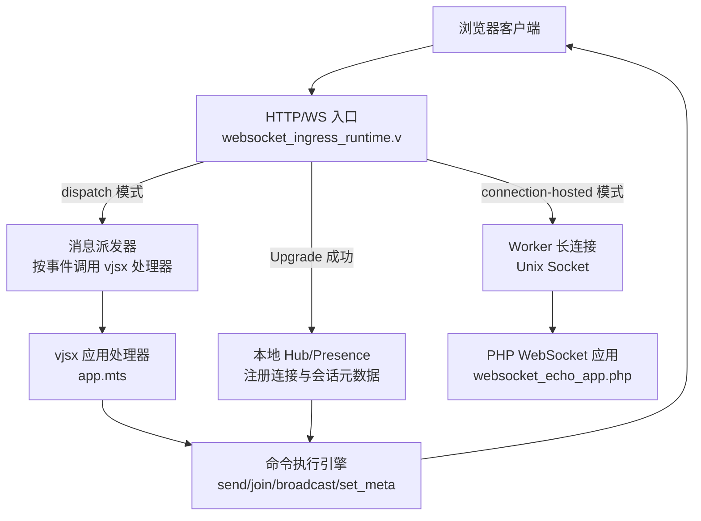
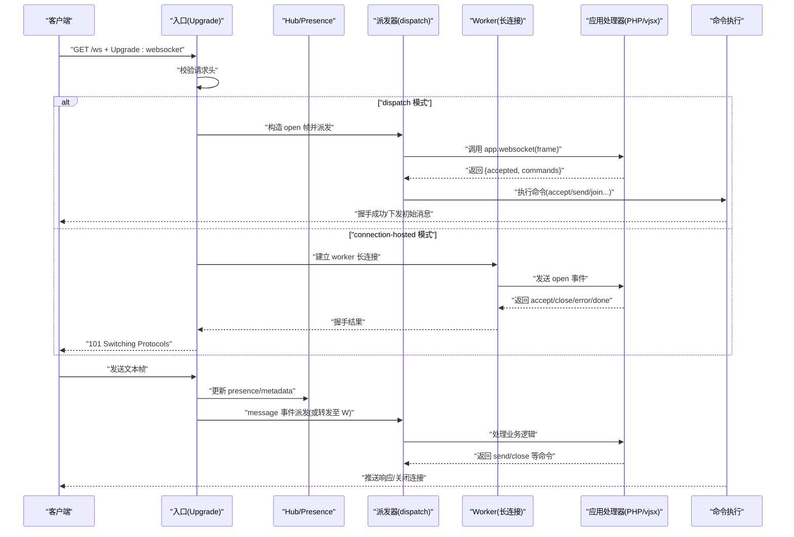
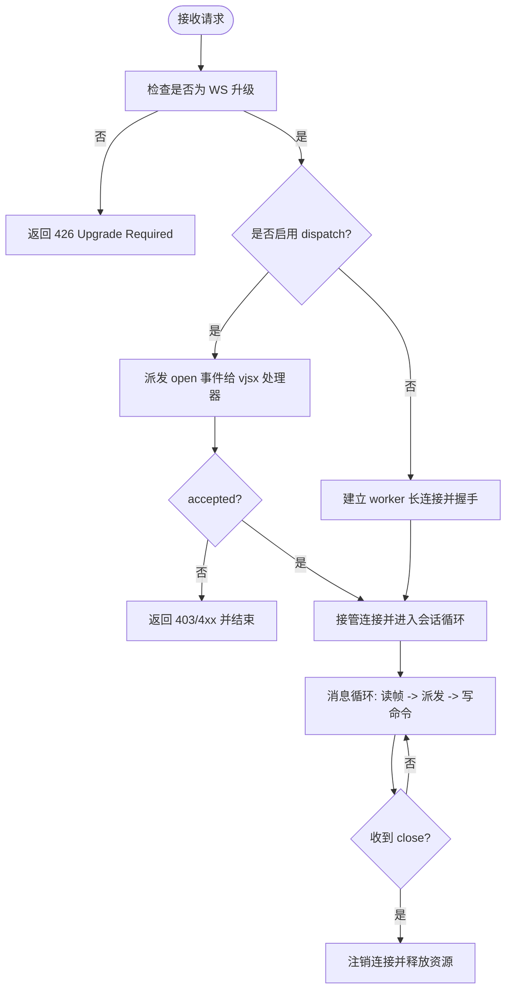
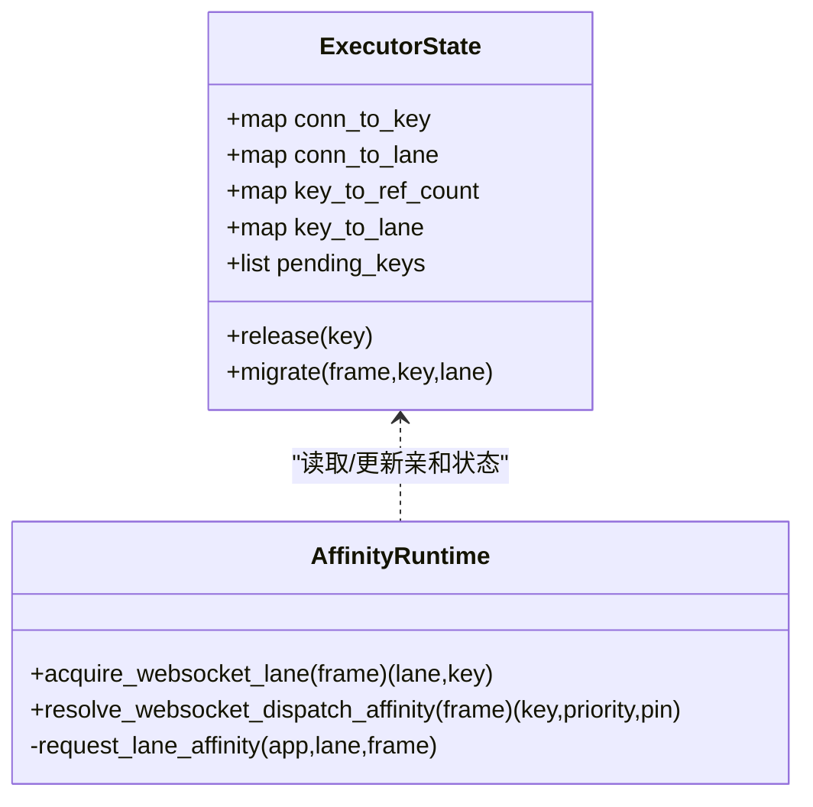
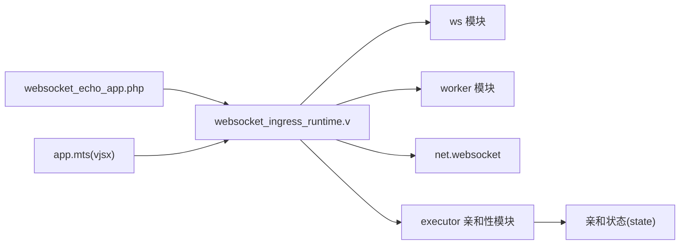

# 实时通信示例

<cite>
**本文引用的文件**   
- [websocket_ingress_runtime.v](file://src/websocket_ingress_runtime.v)
- [inproc_vjsx_websocket_affinity_state.v](file://src/executor/inproc_vjsx_websocket_affinity_state.v)
- [inproc_vjsx_websocket_affinity_runtime.v](file://src/executor/inproc_vjsx_websocket_affinity_runtime.v)
- [websocket_echo_app.php](file://examples/websocket_echo_app.php)
- [websocket_echo_app.js](file://examples/public/websocket_echo_app.js)
- [app.mts](file://examples/ws-min/app.mts)
- [websocket-echo.toml](file://examples/config/websocket-echo.toml)
- [ws-min.toml](file://examples/ws-min/ws-min.toml)
- [WEBSOCKET_MESSAGE_DISPATCH_PLAN.md](file://docs/WEBSOCKET_MESSAGE_DISPATCH_PLAN.md)
- [WEBSOCKET_PHASE2_IMPLEMENTATION_PLAN.md](file://docs/WEBSOCKET_PHASE2_IMPLEMENTATION_PLAN.md)
- [WEBSOCKET_MVP_PLAN.md](file://docs/WEBSOCKET_MVP_PLAN.md)
- [README.md](file://README.md)
</cite>

## 目录
1. [简介](#简介)
2. [项目结构](#项目结构)
3. [核心组件](#核心组件)
4. [架构总览](#架构总览)
5. [详细组件分析](#详细组件分析)
6. [依赖关系分析](#依赖关系分析)
7. [性能与扩展性](#性能与扩展性)
8. [故障排查指南](#故障排查指南)
9. [结论](#结论)
10. [附录：配置与运行](#附录配置与运行)

## 简介
本指南面向希望在 vhttpd 上构建实时通信应用的开发者，围绕 WebSocket 连接的建立与管理、消息路由与广播、会话亲和性与负载均衡策略展开。通过两个最小可运行示例（PHP Echo 与 TypeScript 最小化 WS），演示双向实时通信的实现模式，并给出连接池管理、背压控制、错误重连与性能优化的最佳实践建议。

## 项目结构
仓库中与实时通信相关的代码与示例分布如下：
- 协议入口与调度：vhttpd 内核负责 HTTP Upgrade 检测、WebSocket 握手、事件分发到 PHP 或 vjsx worker，以及命令执行与回写。
- 亲和性与负载均衡：vjsx executor 提供基于 key 的亲和性选择与 lane 绑定能力，支持从应用侧动态计算亲和键。
- 示例应用：
  - PHP Echo：使用 VSlim WebSocket App 在 PHP worker 中处理 open/message/close，返回 echo 响应。
  - TS 最小化：通过 vjsx 暴露 websocket(frame) 处理器，返回命令列表完成 accept/send/join 等操作。
- 配置：分别提供 PHP Echo 与 TS 最小化的站点配置，启用 worker 池与静态资源托管等。

图表来源
- [websocket_ingress_runtime.v:279-411](file://src/websocket_ingress_runtime.v#L279-L411)
- [app.mts:5-43](file://examples/ws-min/app.mts#L5-L43)
- [websocket_echo_app.php:224-239](file://examples/websocket_echo_app.php#L224-L239)

章节来源
- [websocket_ingress_runtime.v:1-482](file://src/websocket_ingress_runtime.v#L1-L482)
- [app.mts:1-44](file://examples/ws-min/app.mts#L1-L44)
- [websocket_echo_app.php:1-240](file://examples/websocket_echo_app.php#L1-L240)

## 核心组件
- WebSocket 入口与升级
  - 校验 Upgrade 请求头，拒绝非 WS 请求；成功后接管连接并进入 WS 会话循环。
  - 支持两种模式：
    - connection-hosted：每个 WS 连接绑定一个 worker 长连接。
    - message-dispatch：vhttpd 持有连接，事件无状态派发到空闲 worker，worker 返回命令列表由 vhttpd 执行。
- 事件与命令
  - 事件：open、message、close。
  - 命令：accept、send、close、join、leave、broadcast、set_meta 等。
- 亲和性与负载均衡
  - 支持从查询参数、请求头或应用侧函数计算亲和键。
  - 可选择是否将连接钉住到特定 lane（线程/进程槽位），以维持局部状态一致性。
- 示例应用
  - PHP Echo：接受连接后发送“已连接”，对消息进行前缀 echo，收到 bye 则关闭。
  - TS 最小化：open 时设置 meta、加入房间、同步初始状态；message 时根据 type 做 ping/pong 或回显。

章节来源
- [websocket_ingress_runtime.v:20-30](file://src/websocket_ingress_runtime.v#L20-L30)
- [websocket_ingress_runtime.v:279-411](file://src/websocket_ingress_runtime.v#L279-L411)
- [inproc_vjsx_websocket_affinity_runtime.v:80-146](file://src/executor/inproc_vjsx_websocket_affinity_runtime.v#L80-L146)
- [websocket_echo_app.php:224-239](file://examples/websocket_echo_app.php#L224-L239)
- [app.mts:5-43](file://examples/ws-min/app.mts#L5-L43)

## 架构总览
下图展示了从浏览器到 vhttpd 再到 worker 的端到端流程，包括两种模式的差异与命令执行路径。

图表来源
- [websocket_ingress_runtime.v:279-411](file://src/websocket_ingress_runtime.v#L279-L411)
- [websocket_echo_app.php:224-239](file://examples/websocket_echo_app.php#L224-L239)
- [app.mts:5-43](file://examples/ws-min/app.mts#L5-L43)

## 详细组件分析

### WebSocket 入口与升级流程
- 入口职责
  - 识别 WS 升级请求，拒绝非法请求并返回 426。
  - 根据配置选择 dispatch 或 connection-hosted 模式。
  - 接管 TCP 连接，设置读写超时为无限，进入 WS 会话循环。
- 关键回调
  - on_connect：注册连接到 Hub，记录 worker_socket、方法、路径、trace_id 等。
  - on_message：解析 opcode/payload，封装为 worker frame 写入 worker 通道，等待 done/close/error。
  - on_close：若非 worker 主动关闭，向 worker 发送 close 事件并清理资源。

图表来源
- [websocket_ingress_runtime.v:20-30](file://src/websocket_ingress_runtime.v#L20-L30)
- [websocket_ingress_runtime.v:279-411](file://src/websocket_ingress_runtime.v#L279-L411)
- [websocket_ingress_runtime.v:413-481](file://src/websocket_ingress_runtime.v#L413-L481)

章节来源
- [websocket_ingress_runtime.v:1-482](file://src/websocket_ingress_runtime.v#L1-L482)

### 消息路由与广播机制
- 路由
  - 同一连接的事件在 vhttpd 层序列化，避免乱序。
  - 支持 join/leave 房间，presence 维护成员集合与计数。
- 广播
  - 命令包含 broadcast，用于向房间内所有成员推送消息。
  - 命令执行引擎会遍历房间成员并写出对应帧。
- 元数据与会话亲和
  - set_meta 可在连接级别附加元数据，便于后续路由与审计。
  - 结合亲和键，可将相关连接定向到相同 lane，提升缓存命中率与一致性。

章节来源
- [websocket_ingress_runtime.v:279-411](file://src/websocket_ingress_runtime.v#L279-L411)
- [WEBSOCKET_MESSAGE_DISPATCH_PLAN.md:1-412](file://docs/WEBSOCKET_MESSAGE_DISPATCH_PLAN.md#L1-L412)

### 会话亲和性与负载均衡策略
- 亲和键来源
  - 可从查询参数、请求头或应用侧函数计算得到。
  - 支持 fallback 策略：reject 或 round_robin。
- Lane 绑定
  - should_pin_lane 决定是否将连接钉住到特定 lane。
  - 迁移与释放：当连接亲和键变化或连接关闭时，更新引用计数并清理映射。
- 决策流程
  - 若已有连接级亲和键则复用；否则按 source 计算新键。
  - 若未命中且 fallback=reject，直接拒绝请求。

图表来源
- [inproc_vjsx_websocket_affinity_state.v:6-124](file://src/executor/inproc_vjsx_websocket_affinity_state.v#L6-L124)
- [inproc_vjsx_websocket_affinity_runtime.v:80-186](file://src/executor/inproc_vjsx_websocket_affinity_runtime.v#L80-L186)

章节来源
- [inproc_vjsx_websocket_affinity_state.v:1-124](file://src/executor/inproc_vjsx_websocket_affinity_state.v#L1-L124)
- [inproc_vjsx_websocket_affinity_runtime.v:1-186](file://src/executor/inproc_vjsx_websocket_affinity_runtime.v#L1-L186)

### 示例一：PHP WebSocket Echo
- 功能要点
  - HTTP 页面返回 HTML，内嵌 JS 客户端。
  - WS 端点 /ws：onOpen 接受连接并发送“已连接”；onMessage 对文本进行 echo；收到 bye 则关闭。
- 前端交互
  - 提供连接、发送、断开、清空日志等按钮，统一输出时间戳日志。
- 适用场景
  - 快速验证 WS 链路、调试网络问题、演示基本收发语义。

章节来源
- [websocket_echo_app.php:182-239](file://examples/websocket_echo_app.php#L182-L239)
- [websocket_echo_app.js:1-92](file://examples/public/websocket_echo_app.js#L1-L92)

### 示例二：TypeScript 最小化 WS
- 功能要点
  - 通过 vjsx 暴露 websocket(frame) 处理器。
  - open 时设置 meta、加入房间、同步初始状态；message 时根据 type 做 ping/pong 或回显。
- 适用场景
  - 展示 vjsx 模式下命令式编程模型，适合复杂路由与房间协作。

章节来源
- [app.mts:1-44](file://examples/ws-min/app.mts#L1-L44)

## 依赖关系分析
- 入口模块依赖
  - 导入 net.websocket、net.http、worker、ws 等模块，实现握手、帧编解码与事件桥接。
- 与 vjsx executor 的耦合
  - 通过 affinity runtime 获取 lane 与亲和键，影响后续任务调度与队列行为。
- 示例与应用
  - PHP 示例依赖 VSlim WebSocket App；TS 示例依赖 vjsx 运行时与命令执行引擎。

图表来源
- [websocket_ingress_runtime.v:1-20](file://src/websocket_ingress_runtime.v#L1-L20)
- [inproc_vjsx_websocket_affinity_runtime.v:1-44](file://src/executor/inproc_vjsx_websocket_affinity_runtime.v#L1-L44)
- [inproc_vjsx_websocket_affinity_state.v:1-42](file://src/executor/inproc_vjsx_websocket_affinity_state.v#L1-L42)
- [websocket_echo_app.php:224-239](file://examples/websocket_echo_app.php#L224-L239)
- [app.mts:5-43](file://examples/ws-min/app.mts#L5-L43)

章节来源
- [websocket_ingress_runtime.v:1-482](file://src/websocket_ingress_runtime.v#L1-L482)
- [inproc_vjsx_websocket_affinity_runtime.v:1-186](file://src/executor/inproc_vjsx_websocket_affinity_runtime.v#L1-L186)
- [inproc_vjsx_websocket_affinity_state.v:1-124](file://src/executor/inproc_vjsx_websocket_affinity_state.v#L1-L124)

## 性能与扩展性
- 连接与 Worker 解耦
  - 采用 message-dispatch 模式后，连接数不再与 worker 数量强耦合，worker 仅在有事件时参与处理，显著提升吞吐。
- 背压控制
  - 建议在 vhttpd 层为每连接维护事件队列，限制并发 in-flight 任务，防止 worker 过载。
  - 对命令执行增加超时与重试上限，避免长时间占用资源。
- 亲和性与缓存
  - 合理设置亲和键与 pin 策略，减少跨 lane 状态迁移成本，提高内存缓存命中率。
- 资源回收
  - 确保 close 事件能正确触发 worker 侧清理，避免泄漏；对异常路径补充日志与指标。
- 参考规划
  - MVP 范围聚焦于 text 帧、open/message/close 与基础命令集，逐步演进到更复杂的房间与集群广播。

章节来源
- [WEBSOCKET_MESSAGE_DISPATCH_PLAN.md:288-339](file://docs/WEBSOCKET_MESSAGE_DISPATCH_PLAN.md#L288-L339)
- [WEBSOCKET_PHASE2_IMPLEMENTATION_PLAN.md:378-431](file://docs/WEBSOCKET_PHASE2_IMPLEMENTATION_PLAN.md#L378-L431)
- [WEBSOCKET_MVP_PLAN.md:65-121](file://docs/WEBSOCKET_MVP_PLAN.md#L65-L121)

## 故障排查指南
- 常见错误码与原因
  - 426 Upgrade Required：请求不是 WS 升级请求或缺少必要头部。
  - 403 Forbidden：应用拒绝接受连接或未返回 accept。
  - 502 Bad Gateway：worker 不可用或握手失败。
  - 500 Worker Runtime Error：应用侧抛出错误。
- 定位步骤
  - 检查入口日志中的 trace_id 与 path，确认是否正确进入 WS 分支。
  - 核对 worker 侧返回的命令序列，确认是否存在 close/error/done。
  - 观察 presence 与房间成员变化，确认 join/broadcast 是否生效。
- 恢复策略
  - 客户端实现指数退避重连，区分网络错误与服务端拒绝。
  - 服务端对频繁失败的连接实施限流或熔断。

章节来源
- [websocket_ingress_runtime.v:279-411](file://src/websocket_ingress_runtime.v#L279-L411)

## 结论
vhttpd 提供了统一的传输运行时，既能承载传统 HTTP，也能高效处理 WebSocket 与流式协议。通过消息派发模式与亲和性策略，可以在保持低延迟的同时获得良好的可扩展性。配合示例应用与配置，开发者可以快速搭建可靠的实时通信服务，并在生产环境中持续优化性能与稳定性。

## 附录：配置与运行
- PHP Echo 示例
  - 站点监听端口、worker 自动启动、事件日志与静态资源根目录均可在配置中指定。
- TS 最小化示例
  - 启用 websocket_dispatch，指定 vjsx 应用路径与运行时 profile，设置线程数。
- 通用工作进程参数
  - 可通过命令行参数调整 worker 池大小、重启策略、admin 平面等。

章节来源
- [websocket-echo.toml:1-28](file://examples/config/websocket-echo.toml#L1-L28)
- [ws-min.toml:1-16](file://examples/ws-min/ws-min.toml#L1-L16)
- [README.md:1065-1089](file://README.md#L1065-L1089)