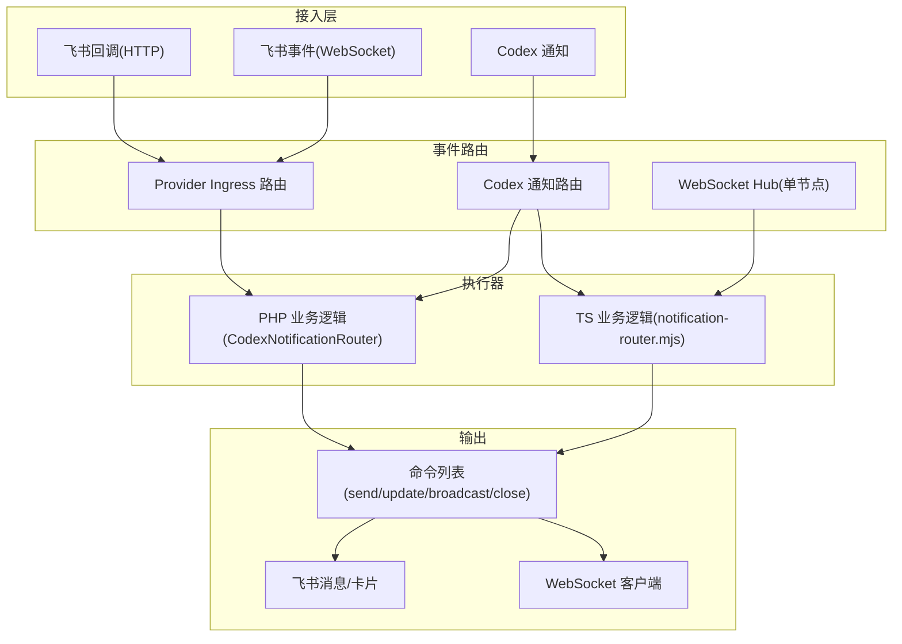
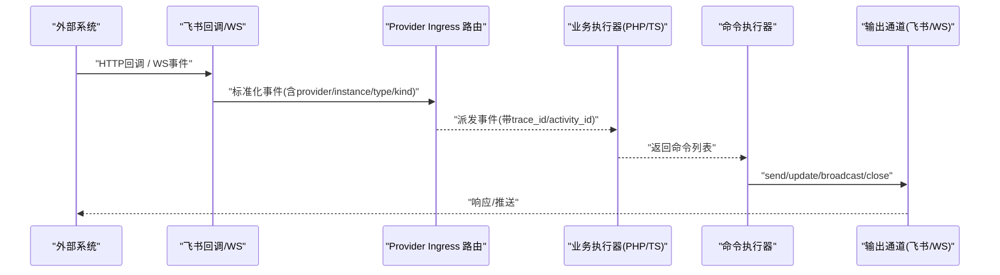
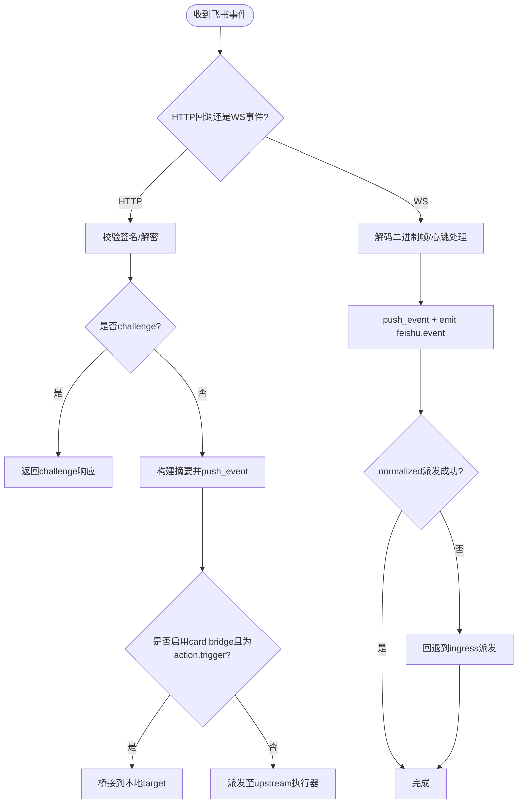
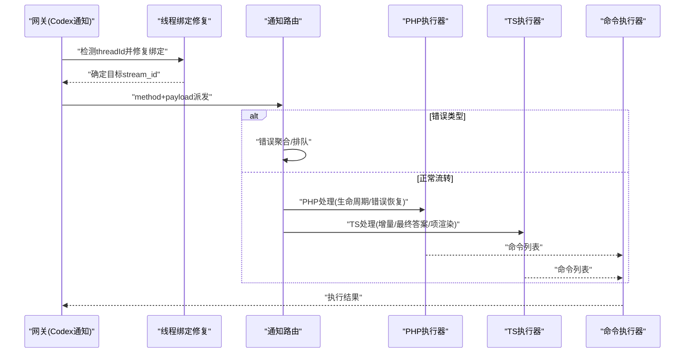
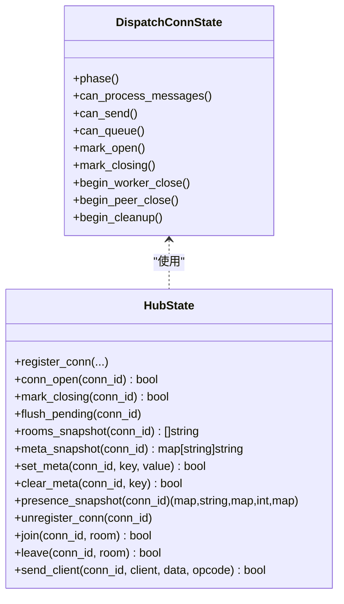
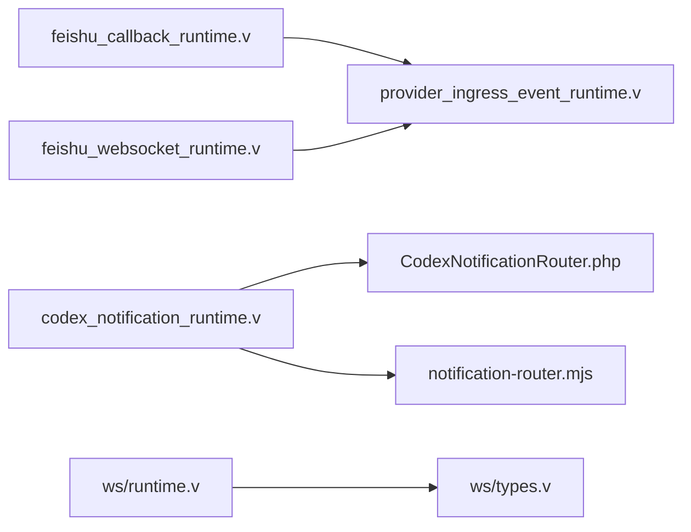

# 事件驱动架构

<cite>
**本文引用的文件**   
- [src/ws/types.v](file://src/ws/types.v)
- [src/ws/runtime.v](file://src/ws/runtime.v)
- [src/feishu_callback_runtime.v](file://src/feishu_callback_runtime.v)
- [src/feishu_websocket_runtime.v](file://src/feishu_websocket_runtime.v)
- [src/feishu_ingress_event_runtime.v](file://src/feishu_ingress_event_runtime.v)
- [src/provider_ingress_event_runtime.v](file://src/provider_ingress_event_runtime.v)
- [src/codex_notification_runtime.v](file://src/codex_notification_runtime.v)
- [examples/codexbot-app/lib/Upstream/CodexNotificationRouter.php](file://examples/codexbot-app/lib/Upstream/CodexNotificationRouter.php)
- [examples/codexbot-app-ts/lib/notification-router.mjs](file://examples/codexbot-app-ts/lib/notification-router.mjs)
- [docs/WEBSOCKET_MESSAGE_DISPATCH_PLAN.md](file://docs/WEBSOCKET_MESSAGE_DISPATCH_PLAN.md)
- [docs/WEBSOCKET_EVENT_BUS_PLAN.md](file://docs/WEBSOCKET_EVENT_BUS_PLAN.md)
- [docs/WEBSOCKET_PHASE2_IMPLEMENTATION_PLAN.md](file://docs/WEBSOCKET_PHASE2_IMPLEMENTATION_PLAN.md)
</cite>

## 目录
1. [引言](#引言)
2. [项目结构](#项目结构)
3. [核心组件](#核心组件)
4. [架构总览](#架构总览)
5. [详细组件分析](#详细组件分析)
6. [依赖关系分析](#依赖关系分析)
7. [性能考量](#性能考量)
8. [故障排查指南](#故障排查指南)
9. [结论](#结论)
10. [附录](#附录)

## 引言
本文件面向 VHTTPD 的事件驱动架构，系统性阐述基于事件的系统设计与实现，覆盖事件发布订阅模式、事件总线架构与异步消息处理。重点说明以下场景的实现：
- 飞书事件回调（HTTP/WebSocket）
- Codex 通知推送
- WebSocket 事件分发（单节点 Hub 与短连接调度）

同时提供事件建模最佳实践（命名规范、版本兼容、幂等性），并介绍事件溯源与 CQRS 在现有架构中的演进路径与优化建议。

## 项目结构
VHTTPD 将“接入层”“事件路由”“业务执行器”“输出命令”分层解耦：
- 接入层：接收外部事件（飞书 HTTP/WebSocket、Codex 通知）
- 事件路由：标准化事件元数据、选择目标实例/流、进入统一派发通道
- 业务执行器：PHP/TS 应用根据事件类型进行状态机更新与渲染
- 输出命令：生成 provider 指令（如发送/更新消息、关闭流等）

图表来源
- [src/feishu_callback_runtime.v:1-179](file://src/feishu_callback_runtime.v#L1-L179)
- [src/feishu_websocket_runtime.v:1-222](file://src/feishu_websocket_runtime.v#L1-L222)
- [src/codex_notification_runtime.v:1-127](file://src/codex_notification_runtime.v#L1-L127)
- [src/ws/runtime.v:1-343](file://src/ws/runtime.v#L1-L343)
- [examples/codexbot-app/lib/Upstream/CodexNotificationRouter.php:1-225](file://examples/codexbot-app/lib/Upstream/CodexNotificationRouter.php#L1-L225)
- [examples/codexbot-app-ts/lib/notification-router.mjs:1-800](file://examples/codexbot-app-ts/lib/notification-router.mjs#L1-L800)

章节来源
- [src/ws/types.v:1-425](file://src/ws/types.v#L1-L425)
- [src/ws/runtime.v:1-343](file://src/ws/runtime.v#L1-L343)
- [src/feishu_callback_runtime.v:1-179](file://src/feishu_callback_runtime.v#L1-L179)
- [src/feishu_websocket_runtime.v:1-222](file://src/feishu_websocket_runtime.v#L1-L222)
- [src/feishu_ingress_event_runtime.v:1-36](file://src/feishu_ingress_event_runtime.v#L1-L36)
- [src/provider_ingress_event_runtime.v:1-58](file://src/provider_ingress_event_runtime.v#L1-L58)
- [src/codex_notification_runtime.v:1-127](file://src/codex_notification_runtime.v#L1-L127)
- [examples/codexbot-app/lib/Upstream/CodexNotificationRouter.php:1-225](file://examples/codexbot-app/lib/Upstream/CodexNotificationRouter.php#L1-L225)
- [examples/codexbot-app-ts/lib/notification-router.mjs:1-800](file://examples/codexbot-app-ts/lib/notification-router.mjs#L1-L800)

## 核心组件
- 事件入站与标准化
  - 飞书回调入口：校验签名/解密、构造摘要、记录活动、派发至上游或桥接
  - 飞书 WebSocket 事件：二进制帧解码、摘要提取、本地事件广播、派发至上游
  - Provider Ingress 路由：统一注入 provider/instance/event_type/event_kind 等元数据，进入运行时事件管道
- 事件派发与执行
  - Codex 通知路由：线程绑定修复、错误聚合、按方法分流、派发至 PHP/TS 执行器
  - WebSocket 单节点 Hub：连接注册/房间成员/元数据快照、按连接序列化派发、命令执行
- 业务执行器
  - PHP 侧：解析 method/params、生命周期路由、错误恢复、生成 provider 命令
  - TS 侧：复杂状态机、增量文本合并、最终答案回读、项级渲染与父流收尾
- 输出命令
  - send/update/broadcast/join/leave/close/set_meta/clear_meta 等命令由 vhttpd 执行并下发到对应通道

章节来源
- [src/feishu_callback_runtime.v:1-179](file://src/feishu_callback_runtime.v#L1-L179)
- [src/feishu_websocket_runtime.v:1-222](file://src/feishu_websocket_runtime.v#L1-L222)
- [src/feishu_ingress_event_runtime.v:1-36](file://src/feishu_ingress_event_runtime.v#L1-L36)
- [src/provider_ingress_event_runtime.v:1-58](file://src/provider_ingress_event_runtime.v#L1-L58)
- [src/codex_notification_runtime.v:1-127](file://src/codex_notification_runtime.v#L1-L127)
- [src/ws/runtime.v:1-343](file://src/ws/runtime.v#L1-L343)
- [examples/codexbot-app/lib/Upstream/CodexNotificationRouter.php:1-225](file://examples/codexbot-app/lib/Upstream/CodexNotificationRouter.php#L1-L225)
- [examples/codexbot-app-ts/lib/notification-router.mjs:1-800](file://examples/codexbot-app-ts/lib/notification-router.mjs#L1-L800)

## 架构总览
下图展示从外部事件到内部命令执行的端到端流程，体现“事件入站 → 标准化 → 派发 → 执行 → 命令下发”的闭环。

图表来源
- [src/feishu_callback_runtime.v:1-179](file://src/feishu_callback_runtime.v#L1-L179)
- [src/feishu_websocket_runtime.v:1-222](file://src/feishu_websocket_runtime.v#L1-L222)
- [src/provider_ingress_event_runtime.v:1-58](file://src/provider_ingress_event_runtime.v#L1-L58)
- [examples/codexbot-app/lib/Upstream/CodexNotificationRouter.php:1-225](file://examples/codexbot-app/lib/Upstream/CodexNotificationRouter.php#L1-L225)
- [examples/codexbot-app-ts/lib/notification-router.mjs:1-800](file://examples/codexbot-app-ts/lib/notification-router.mjs#L1-L800)

## 详细组件分析

### 飞书事件回调（HTTP/WebSocket）
- HTTP 回调
  - 校验签名与加密载荷，支持 challenge 配置
  - 构造 RuntimeEventSnapshot 摘要，推入 provider 事件队列
  - 若启用卡桥接，优先走本地 card bridge；否则进入 upstream 派发
- WebSocket 事件
  - 二进制帧解码，心跳/pong 处理
  - 摘要提取后 push_event，并尝试 normalized 派发，失败则回退 ingress 派发
  - 支持 card bridge 与 upstream 派发，统一 ack 返回

图表来源
- [src/feishu_callback_runtime.v:1-179](file://src/feishu_callback_runtime.v#L1-L179)
- [src/feishu_websocket_runtime.v:1-222](file://src/feishu_websocket_runtime.v#L1-L222)

章节来源
- [src/feishu_callback_runtime.v:1-179](file://src/feishu_callback_runtime.v#L1-L179)
- [src/feishu_websocket_runtime.v:1-222](file://src/feishu_websocket_runtime.v#L1-L222)

### Codex 通知推送
- 网关层轻量同步：检测 threadId，修复 thread→stream 绑定，选择 active/pending stream
- 错误聚合：systemError/error 类型拦截并排队，避免抢跑/覆盖
- 分流派发：按 method 分支（thread/started、item/delta、turn/completed 等）
- 执行器：PHP/TS 分别维护状态机、增量文本合并、最终答案回读、项级渲染与父流收尾

图表来源
- [src/codex_notification_runtime.v:1-127](file://src/codex_notification_runtime.v#L1-L127)
- [examples/codexbot-app/lib/Upstream/CodexNotificationRouter.php:1-225](file://examples/codexbot-app/lib/Upstream/CodexNotificationRouter.php#L1-L225)
- [examples/codexbot-app-ts/lib/notification-router.mjs:1-800](file://examples/codexbot-app-ts/lib/notification-router.mjs#L1-L800)

章节来源
- [src/codex_notification_runtime.v:1-127](file://src/codex_notification_runtime.v#L1-L127)
- [examples/codexbot-app/lib/Upstream/CodexNotificationRouter.php:1-225](file://examples/codexbot-app/lib/Upstream/CodexNotificationRouter.php#L1-L225)
- [examples/codexbot-app-ts/lib/notification-router.mjs:1-800](file://examples/codexbot-app-ts/lib/notification-router.mjs#L1-L800)

### WebSocket 事件分发（单节点 Hub 与短连接调度）
- 单节点 Hub
  - 连接注册/注销、房间成员管理、连接元数据快照
  - 按连接序列化派发，保证同连接顺序；跨连接并行
  - 命令执行：send/broadcast/join/leave/close/set_meta/clear_meta
- 短连接调度（Phase 2）
  - 将 WS 事件视为短时任务：vhttpd 构建 envelope → 派发空闲 worker → worker 返回命令 → vhttpd 执行命令
  - 明确超时、命令校验、每连接队列与 in-flight 限制

图表来源
- [src/ws/types.v:1-425](file://src/ws/types.v#L1-L425)
- [src/ws/runtime.v:1-343](file://src/ws/runtime.v#L1-L343)

章节来源
- [src/ws/types.v:1-425](file://src/ws/types.v#L1-L425)
- [src/ws/runtime.v:1-343](file://src/ws/runtime.v#L1-L343)
- [docs/WEBSOCKET_MESSAGE_DISPATCH_PLAN.md:288-357](file://docs/WEBSOCKET_MESSAGE_DISPATCH_PLAN.md#L288-L357)
- [docs/WEBSOCKET_EVENT_BUS_PLAN.md:405-444](file://docs/WEBSOCKET_EVENT_BUS_PLAN.md#L405-L444)
- [docs/WEBSOCKET_PHASE2_IMPLEMENTATION_PLAN.md:189-327](file://docs/WEBSOCKET_PHASE2_IMPLEMENTATION_PLAN.md#L189-L327)

## 依赖关系分析
- 模块耦合
  - 飞书回调/WS 模块依赖 Provider Ingress 路由进行标准化派发
  - Codex 通知路由依赖线程绑定修复与活跃流选择
  - WebSocket Hub 独立于业务执行器，仅负责连接/房间/命令执行
- 外部依赖
  - 飞书 API（签名校验、卡片桥接）
  - Codex 协议（通知方法、状态字段）
  - WebSocket 传输（net.websocket）

图表来源
- [src/feishu_callback_runtime.v:1-179](file://src/feishu_callback_runtime.v#L1-L179)
- [src/feishu_websocket_runtime.v:1-222](file://src/feishu_websocket_runtime.v#L1-L222)
- [src/provider_ingress_event_runtime.v:1-58](file://src/provider_ingress_event_runtime.v#L1-L58)
- [src/codex_notification_runtime.v:1-127](file://src/codex_notification_runtime.v#L1-L127)
- [examples/codexbot-app/lib/Upstream/CodexNotificationRouter.php:1-225](file://examples/codexbot-app/lib/Upstream/CodexNotificationRouter.php#L1-L225)
- [examples/codexbot-app-ts/lib/notification-router.mjs:1-800](file://examples/codexbot-app-ts/lib/notification-router.mjs#L1-L800)
- [src/ws/runtime.v:1-343](file://src/ws/runtime.v#L1-L343)
- [src/ws/types.v:1-425](file://src/ws/types.v#L1-L425)

章节来源
- [src/feishu_callback_runtime.v:1-179](file://src/feishu_callback_runtime.v#L1-L179)
- [src/feishu_websocket_runtime.v:1-222](file://src/feishu_websocket_runtime.v#L1-L222)
- [src/provider_ingress_event_runtime.v:1-58](file://src/provider_ingress_event_runtime.v#L1-L58)
- [src/codex_notification_runtime.v:1-127](file://src/codex_notification_runtime.v#L1-L127)
- [examples/codexbot-app/lib/Upstream/CodexNotificationRouter.php:1-225](file://examples/codexbot-app/lib/Upstream/CodexNotificationRouter.php#L1-L225)
- [examples/codexbot-app-ts/lib/notification-router.mjs:1-800](file://examples/codexbot-app-ts/lib/notification-router.mjs#L1-L800)
- [src/ws/runtime.v:1-343](file://src/ws/runtime.v#L1-L343)
- [src/ws/types.v:1-425](file://src/ws/types.v#L1-L425)

## 性能考量
- 事件处理模型
  - 将 WS 事件视作短时任务，worker 池按吞吐而非连接数配置
  - 每连接事件队列 + 单 in-flight，保证连接内有序，跨连接并行
- 背压与安全
  - worker 超时策略：失败事件、可选告警/断连
  - 命令校验：未知房间/目标/超大负载/非法操作码拒绝
- 单节点 Hub 扩展
  - 先实现单节点跨 worker fanout，再考虑外部 bus 适配器以支持多节点

章节来源
- [docs/WEBSOCKET_MESSAGE_DISPATCH_PLAN.md:288-357](file://docs/WEBSOCKET_MESSAGE_DISPATCH_PLAN.md#L288-L357)
- [docs/WEBSOCKET_EVENT_BUS_PLAN.md:405-444](file://docs/WEBSOCKET_EVENT_BUS_PLAN.md#L405-L444)
- [docs/WEBSOCKET_PHASE2_IMPLEMENTATION_PLAN.md:189-327](file://docs/WEBSOCKET_PHASE2_IMPLEMENTATION_PLAN.md#L189-L327)

## 故障排查指南
- 飞书回调
  - 检查签名校验与加密密钥配置
  - 确认 challenge 流程与 token 校验
  - 观察 activity 记录（transport_error/worker_error/command_error）
- Codex 通知
  - 关注 threadId 绑定修复日志
  - 错误聚合是否生效（systemError/error）
  - 最终答案回读是否触发（thread/read）
- WebSocket
  - 连接生命周期阶段是否正确（opening/open/closing/closed）
  - 房间成员与元数据快照是否符合预期
  - 命令执行是否有异常或超时

章节来源
- [src/feishu_callback_runtime.v:1-179](file://src/feishu_callback_runtime.v#L1-L179)
- [src/feishu_websocket_runtime.v:1-222](file://src/feishu_websocket_runtime.v#L1-L222)
- [src/codex_notification_runtime.v:1-127](file://src/codex_notification_runtime.v#L1-L127)
- [src/ws/runtime.v:1-343](file://src/ws/runtime.v#L1-L343)

## 结论
VHTTPD 的事件驱动架构通过“标准化入站 → 统一派发 → 可插拔执行器 → 命令下发”的分层设计，实现了高内聚低耦合的事件处理能力。飞书与 Codex 两类典型场景均能稳定落地，并在 WebSocket 领域提供了单节点 Hub 与短连接调度的可扩展路径。后续可在事件溯源与 CQRS 方向逐步引入持久化与读写分离，进一步提升可观测性与一致性保障。

## 附录

### 事件建模最佳实践
- 命名规范
  - 使用点号分隔的层级命名，如 provider.{provider_id}、{event_type}
  - 区分 event_type 与 event_kind，前者用于路由，后者用于分类
- 版本兼容
  - 事件体采用向后兼容的字段扩展策略，新增字段默认空值安全
  - 对关键路径（如 threadId/streamId）做容错与降级
- 幂等性保证
  - 使用 message_id/event_id 作为幂等键，结合去重存储
  - 对重复事件快速识别并跳过处理

### 事件溯源与 CQRS 演进建议
- 事件溯源
  - 将 UpstreamEventSnapshot/ActivitySnapshot 持久化为不可变事件源
  - 基于事件回放重建状态，支撑审计与调试
- CQRS
  - 写路径：事件入站 → 标准化 → 派发 → 命令执行
  - 读路径：从事件源投影出视图（会话、房间、统计）
  - 通过命令列表与事件快照的一致性约束，确保读写分离下的最终一致