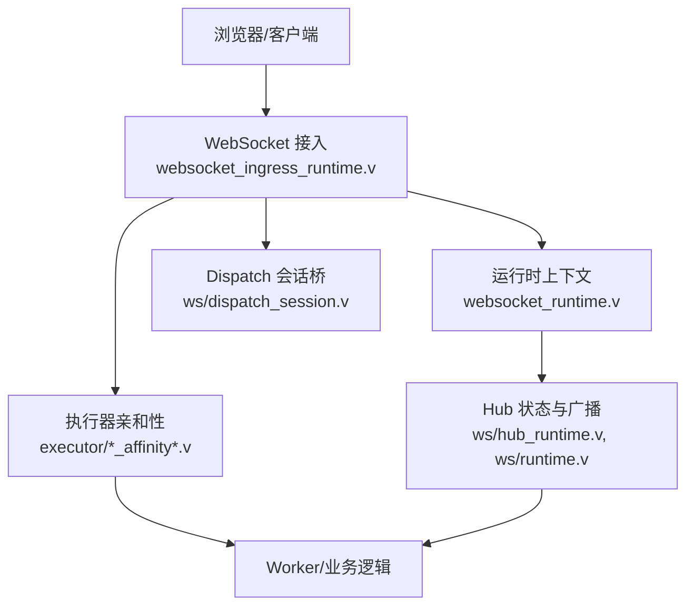
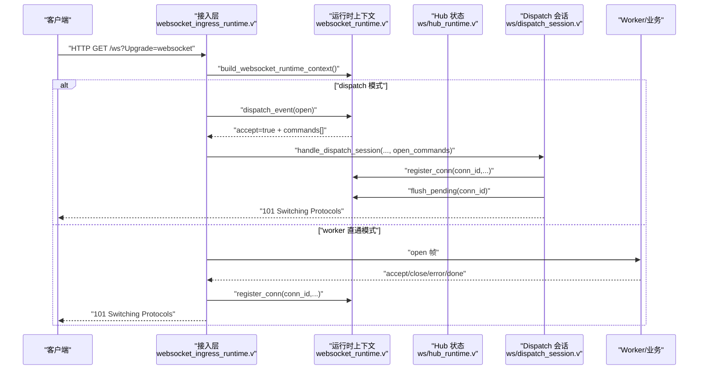
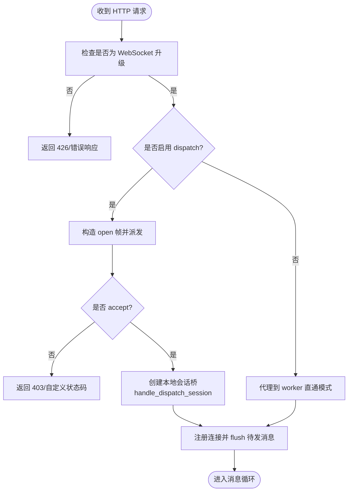
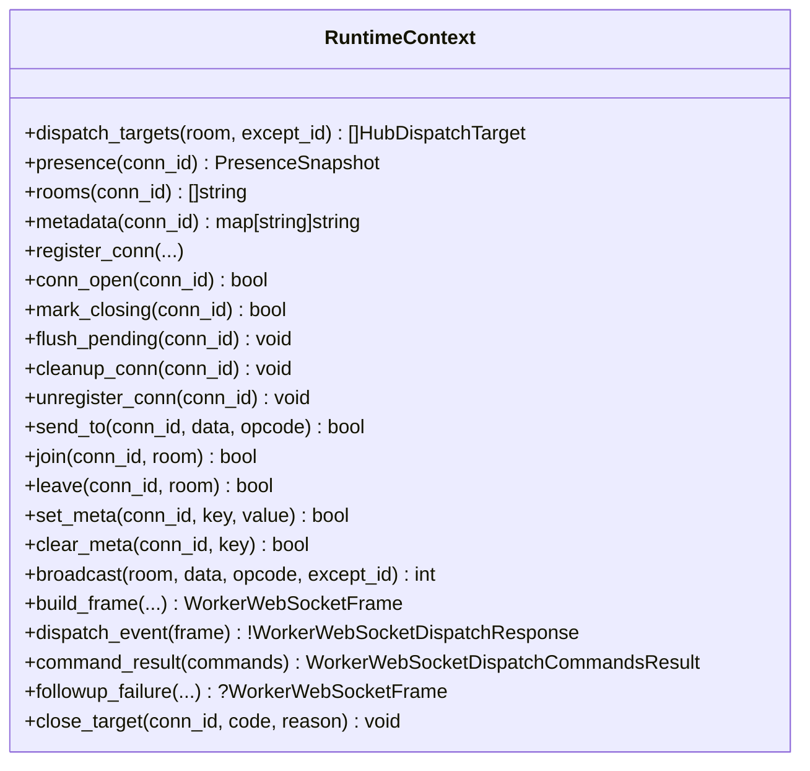
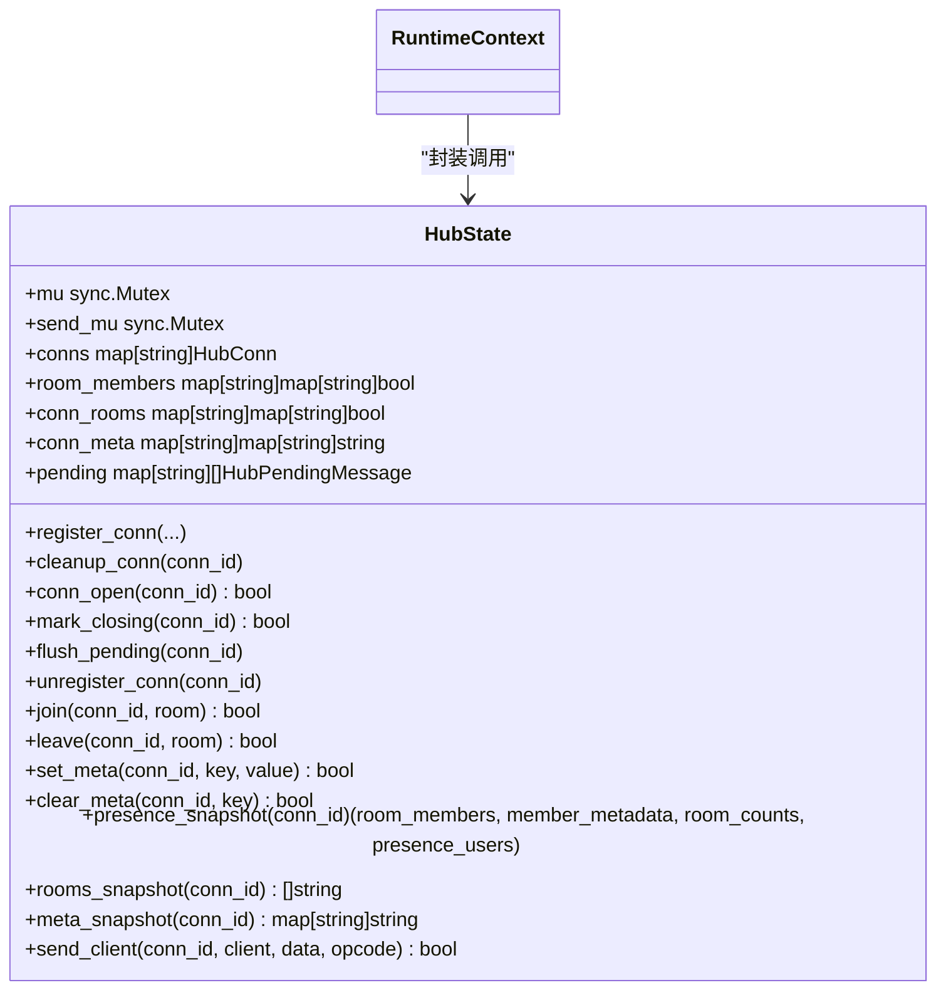
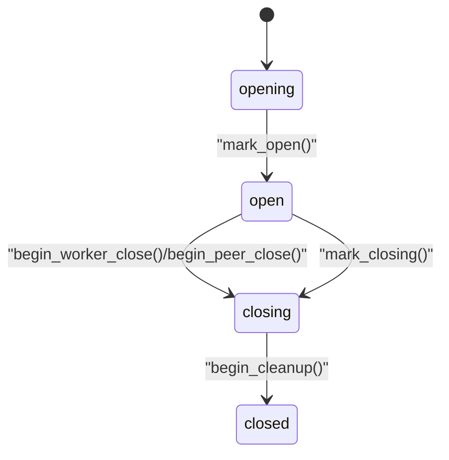
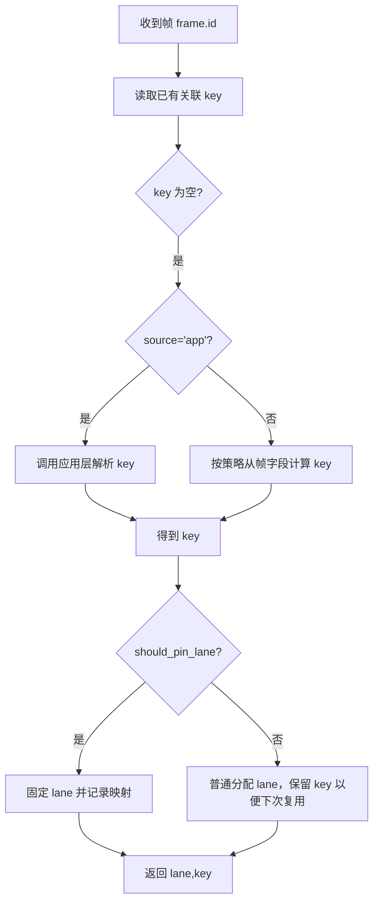
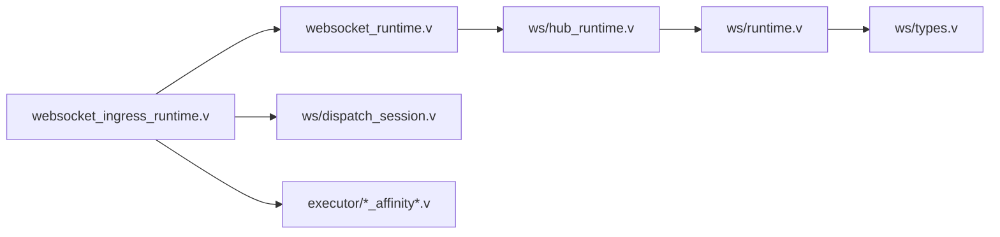

# 实时通信架构模式

<cite>
**本文引用的文件**   
- [websocket_ingress_runtime.v](file://src/websocket_ingress_runtime.v)
- [websocket_runtime.v](file://src/websocket_runtime.v)
- [dispatch_session.v](file://src/ws/dispatch_session.v)
- [hub_runtime.v](file://src/ws/hub_runtime.v)
- [runtime.v](file://src/ws/runtime.v)
- [types.v](file://src/ws/types.v)
- [inproc_vjsx_websocket_affinity_runtime.v](file://src/executor/inproc_vjsx_websocket_affinity_runtime.v)
- [inproc_vjsx_websocket_affinity_state.v](file://src/executor/inproc_vjsx_websocket_affinity_state.v)
- [12-advanced-patterns.md](file://articles/12-advanced-patterns.md)
- [WEBSOCKET_MVP_PLAN.md](file://docs/WEBSOCKET_MVP_PLAN.md)
- [WEBSOCKET_PHASE2_IMPLEMENTATION_PLAN.md](file://docs/WEBSOCKET_PHASE2_IMPLEMENTATION_PLAN.md)
</cite>

## 目录
1. [引言](#引言)
2. [项目结构](#项目结构)
3. [核心组件](#核心组件)
4. [架构总览](#架构总览)
5. [详细组件分析](#详细组件分析)
6. [依赖关系分析](#依赖关系分析)
7. [性能与扩展性](#性能与扩展性)
8. [故障排查指南](#故障排查指南)
9. [结论](#结论)
10. [附录：典型场景与最佳实践](#附录典型场景与最佳实践)

## 引言
本文件面向在 vhttpd 上构建实时应用的工程师，系统化梳理 WebSocket 长连接管理、房间系统、消息广播、会话亲和性与负载均衡等核心模式。文档同时给出端到端调用序列、关键数据结构与状态机、以及聊天室、在线协作、实时监控等典型应用的设计要点与落地建议。

## 项目结构
vhttpd 的实时通信能力由“协议接入层 + 运行时上下文 + Hub 状态 + 执行器亲和性”四层构成：
- 协议接入层：负责 HTTP Upgrade 到 WebSocket，建立并维护客户端与 worker 或 dispatch 模式的桥接。
- 运行时上下文：封装对 Hub 的操作（注册、加入/离开房间、广播、元数据）和命令执行。
- Hub 状态：进程内连接、房间、成员、元数据、待发送队列的统一管理。
- 执行器亲和性：为 vjsx 执行器提供基于策略的连接亲和与 Lane 绑定，支撑多实例下的路由与负载。

图表来源
- [websocket_ingress_runtime.v:1-120](file://src/websocket_ingress_runtime.v#L1-L120)
- [websocket_runtime.v:1-115](file://src/websocket_runtime.v#L1-L115)
- [dispatch_session.v:1-120](file://src/ws/dispatch_session.v#L1-L120)
- [hub_runtime.v:1-120](file://src/ws/hub_runtime.v#L1-L120)
- [runtime.v:1-120](file://src/ws/runtime.v#L1-L120)
- [inproc_vjsx_websocket_affinity_runtime.v:1-120](file://src/executor/inproc_vjsx_websocket_affinity_runtime.v#L1-L120)

章节来源
- [websocket_ingress_runtime.v:1-120](file://src/websocket_ingress_runtime.v#L1-L120)
- [WEBSOCKET_MVP_PLAN.md:1-63](file://docs/WEBSOCKET_MVP_PLAN.md#L1-L63)

## 核心组件
- 接入与桥接
  - HTTP 升级检测与握手接管，支持两种模式：
    - 直通 worker 模式：将 TCP 连接交给 net.websocket，并在 worker 间通过帧协议转发。
    - dispatch 模式：先向内核派发 open 事件，根据返回的命令列表决定是否接受连接并进入本地会话桥。
- 运行时上下文 RuntimeContext
  - 统一暴露 register_conn、join/leave、set_meta/clear_meta、send_to、broadcast、presence、rooms、metadata、build_frame、dispatch_event、command_result、close_target 等方法。
- Hub 状态 HubState
  - 维护连接表、房间成员表、连接房间映射、连接元数据、待发送队列；提供 join/leave/broadcast/send_to/close_target 等原子操作。
- 连接生命周期状态机
  - 定义 opening/open/closing/closed 四态，控制 can_send/can_queue/can_process_messages 等访问语义，避免竞态与重复关闭。
- 亲和性与负载均衡
  - 支持从请求帧计算亲和键，按策略选择是否固定 Lane，维护 key→lane 映射与引用计数，支持迁移与释放。

章节来源
- [websocket_ingress_runtime.v:279-411](file://src/websocket_ingress_runtime.v#L279-L411)
- [websocket_runtime.v:26-99](file://src/websocket_runtime.v#L26-L99)
- [hub_runtime.v:174-334](file://src/ws/hub_runtime.v#L174-L334)
- [runtime.v:24-133](file://src/ws/runtime.v#L24-L133)
- [types.v:11-120](file://src/ws/types.v#L11-L120)
- [inproc_vjsx_websocket_affinity_runtime.v:80-146](file://src/executor/inproc_vjsx_websocket_affinity_runtime.v#L80-L146)

## 架构总览
下图展示一次典型的 WebSocket 打开流程，包括两种路径：worker 直通与 dispatch 模式。

图表来源
- [websocket_ingress_runtime.v:341-411](file://src/websocket_ingress_runtime.v#L341-L411)
- [websocket_runtime.v:96-99](file://src/websocket_runtime.v#L96-L99)
- [dispatch_session.v:11-48](file://src/ws/dispatch_session.v#L11-L48)
- [hub_runtime.v:174-215](file://src/ws/hub_runtime.v#L174-L215)

## 详细组件分析

### 组件一：WebSocket 接入与桥接
- 职责
  - 识别 Upgrade 请求，决定走 dispatch 还是 worker 直通。
  - 建立 BridgeState，注册连接、处理消息与关闭事件。
  - 将 worker 侧命令（send/join/broadcast/close 等）转换为实际网络写入或状态变更。
- 关键点
  - 使用 ctx.takeover_conn() 接管 TCP 连接，交由 net.websocket 完成握手。
  - 在 worker 模式下，通过帧编解码器与 worker 双向通信。
  - 在 dispatch 模式下，先派发 open，再根据命令列表决定是否接受连接。

图表来源
- [websocket_ingress_runtime.v:16-30](file://src/websocket_ingress_runtime.v#L16-L30)
- [websocket_ingress_runtime.v:341-411](file://src/websocket_ingress_runtime.v#L341-L411)
- [dispatch_session.v:11-48](file://src/ws/dispatch_session.v#L11-L48)

章节来源
- [websocket_ingress_runtime.v:279-411](file://src/websocket_ingress_runtime.v#L279-L411)
- [dispatch_session.v:11-124](file://src/ws/dispatch_session.v#L11-L124)

### 组件二：运行时上下文 RuntimeContext
- 职责
  - 对外暴露统一的 Hub 操作接口，屏蔽底层锁与并发细节。
  - 将命令结果（commands）转译为 send/join/broadcast/close 等动作。
- 关键点
  - presence/rooms/metadata 快照用于在派发时携带上下文信息。
  - build_frame 将业务帧包装为 WorkerWebSocketFrame。
  - command_result 驱动后续动作（如关闭目标连接）。

图表来源
- [websocket_runtime.v:26-99](file://src/websocket_runtime.v#L26-L99)

章节来源
- [websocket_runtime.v:26-99](file://src/websocket_runtime.v#L26-L99)

### 组件三：Hub 状态与广播
- 职责
  - 维护连接、房间、成员、元数据与待发送队列。
  - 提供 send_to、broadcast、join/leave、presence 等原子操作。
- 关键点
  - 写路径加互斥锁，读快照也加锁保证一致性。
  - pending 队列用于连接尚未就绪时的消息缓冲，待 conn_open 后 flush。
  - broadcast_dispatch 将广播转为对房间内每个连接的 dispatch 事件，便于复杂路由。

图表来源
- [runtime.v:24-133](file://src/ws/runtime.v#L24-L133)
- [hub_runtime.v:174-334](file://src/ws/hub_runtime.v#L174-L334)
- [types.v:361-377](file://src/ws/types.v#L361-L377)

章节来源
- [runtime.v:24-133](file://src/ws/runtime.v#L24-L133)
- [hub_runtime.v:174-334](file://src/ws/hub_runtime.v#L174-L334)
- [types.v:361-377](file://src/ws/types.v#L361-L377)

### 组件四：连接生命周期状态机
- 状态
  - opening → open → closing → closed
- 行为
  - can_send/can_queue/can_process_messages 控制不同阶段的读写权限。
  - begin_peer_close 区分对端发起与 worker 发起的关闭，避免重复通知。
  - mark_closing 与 begin_cleanup 确保清理只执行一次。

图表来源
- [types.v:11-120](file://src/ws/types.v#L11-L120)

章节来源
- [types.v:11-120](file://src/ws/types.v#L11-L120)

### 组件五：亲和性与负载均衡
- 目标
  - 在多 Lane/多实例环境下，保持同一会话的请求落在同一执行单元，提升缓存命中与状态一致性。
- 机制
  - 从请求帧计算 affinity_key（可来自配置或应用层）。
  - should_pin_lane 决定是否固定 Lane；否则仅记录 key 以辅助路由。
  - 维护 key→lane 映射与引用计数，支持迁移与释放。
- 适用场景
  - 需要会话级状态（如协作文档、游戏房间）的应用。

图表来源
- [inproc_vjsx_websocket_affinity_runtime.v:80-146](file://src/executor/inproc_vjsx_websocket_affinity_runtime.v#L80-L146)
- [inproc_vjsx_websocket_affinity_state.v:6-42](file://src/executor/inproc_vjsx_websocket_affinity_state.v#L6-L42)

章节来源
- [inproc_vjsx_websocket_affinity_runtime.v:80-146](file://src/executor/inproc_vjsx_websocket_affinity_runtime.v#L80-L146)
- [inproc_vjsx_websocket_affinity_state.v:6-42](file://src/executor/inproc_vjsx_websocket_affinity_state.v#L6-L42)

## 依赖关系分析
- 模块耦合
  - websocket_ingress_runtime.v 依赖 executor、ws、transport、net.websocket 等。
  - ws 内部解耦：RuntimeContext 作为薄封装，HubState 承载状态，types 定义共享类型。
  - 亲和性模块独立于 ws，通过 executor 状态进行关联。
- 外部依赖
  - V 标准库 net.websocket 负责握手与帧收发。
  - transport.WorkerWebSocketFrame 作为跨进程/跨模块的消息载体。

图表来源
- [websocket_ingress_runtime.v:1-120](file://src/websocket_ingress_runtime.v#L1-L120)
- [websocket_runtime.v:1-115](file://src/websocket_runtime.v#L1-L115)
- [dispatch_session.v:1-120](file://src/ws/dispatch_session.v#L1-L120)
- [hub_runtime.v:1-120](file://src/ws/hub_runtime.v#L1-L120)
- [runtime.v:1-120](file://src/ws/runtime.v#L1-L120)
- [types.v:1-120](file://src/ws/types.v#L1-L120)
- [inproc_vjsx_websocket_affinity_runtime.v:1-120](file://src/executor/inproc_vjsx_websocket_affinity_runtime.v#L1-L120)

章节来源
- [websocket_ingress_runtime.v:1-120](file://src/websocket_ingress_runtime.v#L1-L120)
- [websocket_runtime.v:1-115](file://src/websocket_runtime.v#L1-L115)
- [dispatch_session.v:1-120](file://src/ws/dispatch_session.v#L1-L120)
- [hub_runtime.v:1-120](file://src/ws/hub_runtime.v#L1-L120)
- [runtime.v:1-120](file://src/ws/runtime.v#L1-L120)
- [types.v:1-120](file://src/ws/types.v#L1-L120)
- [inproc_vjsx_websocket_affinity_runtime.v:1-120](file://src/executor/inproc_vjsx_websocket_affinity_runtime.v#L1-L120)

## 性能与扩展性
- 低开销长连接
  - 利用 net.websocket 原生实现握手与帧收发，避免重复造轮子。
  - Hub 采用内存表+互斥锁，适合单机高并发；跨节点可扩展至分布式总线（规划中）。
- 命令批处理与延迟写入
  - pending 队列缓冲未就绪消息，减少无效 IO。
  - broadcast 批量收集目标后再写，降低锁竞争。
- 亲和性优化
  - 固定 Lane 可减少跨进程/跨实例通信，提高缓存命中率与一致性。
- 可观测性
  - 通过 admin plane 查看活跃连接、房间、上游会话等指标，辅助容量规划与问题定位。

[本节为通用指导，不直接分析具体文件]

## 故障排查指南
- 常见问题
  - 握手失败：检查 Upgrade 头与 sec-websocket-key 是否正确。
  - 未接受连接：确认 open 事件的 accept 分支与命令列表是否包含 close。
  - 消息丢失：检查 can_send/can_queue 状态与 pending 队列，确认 flush_pending 是否被调用。
  - 重复关闭：关注 begin_peer_close 与 worker_initiated_close 标志，避免重复通知。
- 定位手段
  - 使用 admin API 查看 active connections、rooms、upstream sessions。
  - 结合 trace_id/request_id 追踪单条消息的全链路。

章节来源
- [websocket_ingress_runtime.v:103-221](file://src/websocket_ingress_runtime.v#L103-L221)
- [dispatch_session.v:126-204](file://src/ws/dispatch_session.v#L126-L204)
- [runtime.v:103-133](file://src/ws/runtime.v#L103-L133)

## 结论
vhttpd 的实时通信架构以“轻量接入 + 强上下文 + 集中 Hub + 灵活亲和性”为核心，既满足单机高性能，又为未来分布式扩展预留空间。通过 open/message/close 事件与命令体系，业务可在 worker 或 dispatch 模式下自由编排，兼顾开发体验与运行效率。

[本节为总结，不直接分析具体文件]

## 附录：典型场景与最佳实践

### 聊天室
- 设计要点
  - 使用 join/leave 管理房间成员，broadcast 推送消息。
  - 在 open 阶段设置用户元数据（如 user id），便于 presence 查询。
- 参考实现
  - PHP 广播示例见文章中的 WebSocketBroadcaster 用法。

章节来源
- [12-advanced-patterns.md:581-666](file://articles/12-advanced-patterns.md#L581-L666)

### 在线协作
- 设计要点
  - 开启亲和性并 should_pin_lane，确保同一协作者的所有操作落在同一 Lane。
  - 使用 set_meta/clear_meta 维护协作者状态（光标位置、选区等）。
  - 合并冲突策略建议在应用层实现，服务端只做可靠分发。

章节来源
- [inproc_vjsx_websocket_affinity_runtime.v:80-146](file://src/executor/inproc_vjsx_websocket_affinity_runtime.v#L80-L146)
- [inproc_vjsx_websocket_affinity_state.v:6-42](file://src/executor/inproc_vjsx_websocket_affinity_state.v#L6-L42)

### 实时监控
- 设计要点
  - 使用 presence 与 rooms 快照做前端面板展示。
  - 对高频事件采用节流与聚合，避免刷屏。
  - 必要时使用 broadcast_dispatch 将广播转为逐点派发，便于审计与限流。

章节来源
- [hub_runtime.v:282-334](file://src/ws/hub_runtime.v#L282-L334)
- [runtime.v:199-242](file://src/ws/runtime.v#L199-L242)

### 断线重连与幂等
- 客户端
  - 指数退避重连，带 last_seen_id 或 session_token 实现幂等恢复。
- 服务端
  - 在 close 事件中持久化必要状态，避免丢失。
  - 使用 followup_failure 生成友好关闭帧，便于前端提示。

章节来源
- [dispatch_session.v:66-76](file://src/ws/dispatch_session.v#L66-L76)
- [websocket_ingress_runtime.v:184-277](file://src/websocket_ingress_runtime.v#L184-L277)

### 安全认证与鉴权
- 建议
  - 在 open 阶段校验 token/签名，拒绝非法连接。
  - 使用 metadata 存储最小化鉴权上下文，避免明文敏感信息。
  - 限制房间名与消息大小，防止滥用。

章节来源
- [websocket_ingress_runtime.v:341-411](file://src/websocket_ingress_runtime.v#L341-L411)

### 流量控制与背压
- 建议
  - 对热点房间采用分片广播或扇出限速。
  - 利用 pending 队列与 can_queue 判断，避免阻塞主循环。
  - 监控 send 失败率与队列长度，动态调整阈值。

章节来源
- [runtime.v:303-343](file://src/ws/runtime.v#L303-L343)
- [hub_runtime.v:217-251](file://src/ws/hub_runtime.v#L217-L251)

### 架构演进与路线图
- MVP 聚焦传输与 worker 适配，避免重复实现握手与帧解析。
- Phase 2 引入消息派发与命令执行，使业务更贴近事件驱动模型。

章节来源
- [WEBSOCKET_MVP_PLAN.md:1-63](file://docs/WEBSOCKET_MVP_PLAN.md#L1-L63)
- [WEBSOCKET_PHASE2_IMPLEMENTATION_PLAN.md:378-431](file://docs/WEBSOCKET_PHASE2_IMPLEMENTATION_PLAN.md#L378-L431)