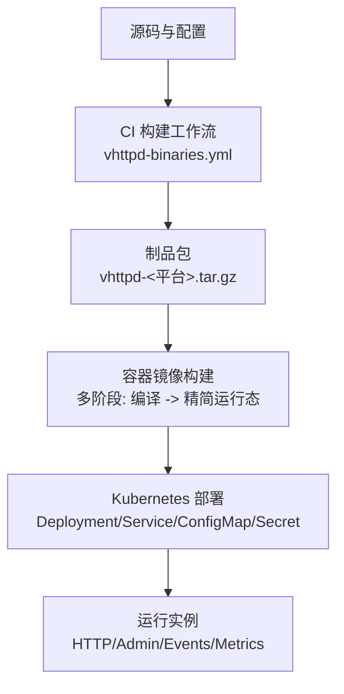
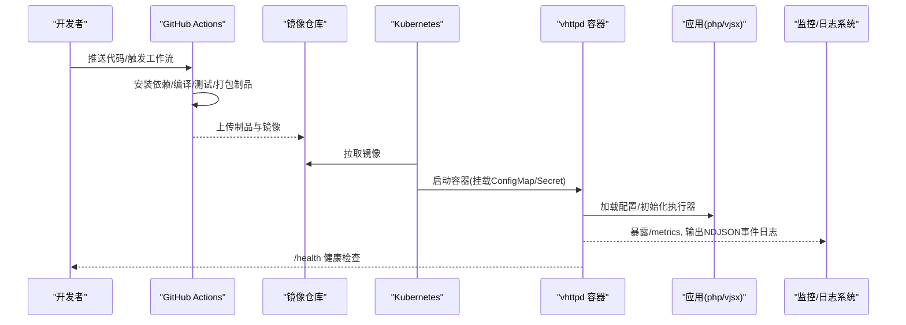

# 容器化部署架构

<cite>
**本文引用的文件**   
- [README.md](file://README.md)
- [vhttpd-binaries.yml](file://.github/workflows/vhttpd-binaries.yml)
- [12-advanced-patterns.md](file://articles/12-advanced-patterns.md)
- [11-observability.md](file://articles/11-observability.md)
- [refactor_0601.md](file://docs/refactor_0601.md)
- [v2_plan_compiler.v](file://src/config/v2_plan_compiler.v)
- [admin_runtime_graph.v](file://src/admin_runtime_graph.v)
- [app.js](file://admin/ui/app.js)
- [index.html](file://admin/ui/index.html)
</cite>

## 目录
1. [引言](#引言)
2. [项目结构](#项目结构)
3. [核心组件](#核心组件)
4. [架构总览](#架构总览)
5. [详细组件分析](#详细组件分析)
6. [依赖分析](#依赖分析)
7. [性能考虑](#性能考虑)
8. [故障排查指南](#故障排查指南)
9. [结论](#结论)
10. [附录](#附录)

## 引言
本文件面向生产环境，提供 VHTTPD 的容器化与编排部署方案。内容覆盖：
- Docker 镜像构建与多阶段编译策略
- Kubernetes 编排（Deployment、Service、ConfigMap、Secret）
- 高可用集群（负载均衡、健康检查、自动扩缩容）
- CI/CD 流水线（自动化测试、代码扫描、灰度发布、回滚）
- 生产监控、日志收集与故障诊断

VHTTPD 作为协议与执行宿主，原生支持 HTTP/WebSocket/流式响应，并通过可插拔执行器（php-worker、vjsx 等）承载业务逻辑。其设计强调“贴近 veb”，将传输、Worker 编排、流式能力与可观测性集中在运行时层。

## 项目结构
从容器化视角，关键产出与配置如下：
- 二进制产物与打包脚本：由 GitHub Actions 工作流生成并打包为 tar.gz 制品，包含二进制、运行时库与安装/校验脚本
- 运行期配置：TOML 配置文件（示例位于 config 目录），支持变量展开与多监听器
- 管理平面与可观测性：内置 /health、/admin/* 端点，事件日志 NDJSON，Prometheus 指标导出
- 文档与示例：高级模式、可观测性实践、Kubernetes 集成示例

图表来源
- [vhttpd-binaries.yml:1-171](file://.github/workflows/vhttpd-binaries.yml#L1-L171)
- [README.md:256-366](file://README.md#L256-L366)

章节来源
- [README.md:256-366](file://README.md#L256-L366)
- [vhttpd-binaries.yml:1-171](file://.github/workflows/vhttpd-binaries.yml#L1-L171)

## 核心组件
- 构建与制品
  - CI 工作流负责在 Linux/macOS 上安装依赖、拉取 vjsx 模块、准备 QuickJS 源码、编译生产二进制、执行冒烟测试与打包制品
  - 制品包含二进制、运行时库、安装与自检脚本，便于后续镜像构建或裸机部署
- 运行期配置
  - TOML 配置支持变量展开、多监听器、站点级覆盖、执行器选择（php/vjsx）、Admin 面板、可观测性开关等
- 可观测性与运维
  - Admin 面板暴露 /health、/admin/stats、/admin/runtime 等端点；事件日志输出 NDJSON；支持 Prometheus 指标导出
  - 内置 UI 通过 /admin/* 聚合运行时状态、路由图、事件统计与健康视图

章节来源
- [vhttpd-binaries.yml:1-171](file://.github/workflows/vhttped-binaries.yml#L1-L171)
- [README.md:437-617](file://README.md#L437-L617)
- [README.md:1147-1185](file://README.md#L1147-L1185)
- [11-observability.md:1-120](file://articles/11-observability.md#L1-L120)
- [app.js:1-40](file://admin/ui/app.js#L1-L40)
- [index.html:58-83](file://admin/ui/index.html#L58-L83)

## 架构总览
下图展示从 CI 到 K8s 的端到端流程，以及运行时的数据面与管理面交互。

图表来源
- [vhttpd-binaries.yml:1-171](file://.github/workflows/vhttpd-binaries.yml#L1-L171)
- [README.md:1147-1185](file://README.md#L1147-L1185)
- [11-observability.md:406-433](file://articles/11-observability.md#L406-L433)

## 详细组件分析

### 容器镜像构建与优化
- 多阶段构建建议
  - 构建阶段：基于带编译链的基础镜像，安装 V 编译器与系统依赖，克隆 vjsx 模块，准备 QuickJS 源码，执行 make prod 生成生产二进制
  - 运行阶段：基于最小基础镜像（如 distroless/slim），仅复制二进制与必要的运行时库，设置 RPATH 指向 bundled libs，减少攻击面与体积
- 依赖与库打包
  - 使用打包脚本提取动态库至 runtime/libs，并在二进制中重写 RPATH，确保在无系统库的环境中也能运行
- 环境变量与入口
  - 通过环境变量注入配置路径、日志级别、时区等；容器入口直接执行 vhttpd 前台进程，交由 systemd 或容器运行时管理生命周期

章节来源
- [README.md:256-366](file://README.md#L256-L366)
- [refactor_0601.md:380-394](file://docs/refactor_0601.md#L380-L394)

### Kubernetes 编排部署
- Deployment
  - 副本数按负载设定；资源 requests/limits 明确 CPU/内存；探针使用 /health 进行存活与就绪检查
- Service
  - 暴露 HTTP 与 Admin 端口；对外通过 LoadBalancer 或 Ingress 接入
- ConfigMap/Secret
  - 将 TOML 配置以 ConfigMap 挂载；敏感信息（数据库密码、第三方密钥）放入 Secret 并注入环境变量或挂载文件
- 滚动更新与回滚
  - 利用 K8s 默认滚动策略；失败时快速回滚到上一稳定版本

章节来源
- [12-advanced-patterns.md:484-553](file://articles/12-advanced-patterns.md#L484-L553)
- [README.md:1147-1185](file://README.md#L1147-L1185)

### 高可用集群与弹性
- 负载均衡
  - 在 K8s 中使用 Service 或 Ingress 做 L4/L7 分发；对 WebSocket 场景结合粘性会话或外部一致性哈希
- 健康检查
  - 实现 /health 返回 200 OK；结合 readiness/liveness probe 控制流量与重启
- 自动扩缩容
  - 基于 HPA 根据 CPU/内存或自定义指标（如队列长度、错误率）进行扩缩容
- 多监听器模式
  - 同一进程监听多个端口，分别承载 API、AI 流、MCP、Admin 等，隔离不同负载特性

章节来源
- [12-advanced-patterns.md:484-579](file://articles/12-advanced-patterns.md#L484-L579)
- [README.md:533-603](file://README.md#L533-L603)

### CI/CD 流水线设计
- 触发与矩阵构建
  - 针对 main 分支与 PR 触发；Linux/macOS 多目标矩阵构建
- 依赖与模块
  - 安装系统依赖；克隆 vjsx 模块；准备 QuickJS 源码；设置 VPHP_V_GC=boehm
- 构建与测试
  - 执行 make prod 构建生产二进制；运行 fast unit tests 与 e2e smoke test
- 制品与归档
  - 打包二进制与运行时库、脚本，上传制品供后续镜像构建或发布

章节来源
- [vhttpd-binaries.yml:1-171](file://.github/workflows/vhttpd-binaries.yml#L1-L171)

### 灰度发布与回滚策略
- 蓝绿/金丝雀
  - 通过 K8s Service 权重或 Ingress 规则逐步切换流量；配合 /health 与自定义指标验证稳定性
- 配置热替换
  - 使用 ConfigMap 挂载配置；结合 vhttpd 的配置重载能力（若启用）实现零停机更新
- 回滚
  - 一键回滚到上一个稳定镜像版本；保留历史 ConfigMap 快照以便对比

章节来源
- [12-advanced-patterns.md:484-553](file://articles/12-advanced-patterns.md#L484-L553)
- [README.md:437-525](file://README.md#L437-L525)

### 生产监控、日志与诊断
- 指标与可视化
  - 暴露 /admin/metrics 供 Prometheus 抓取；Grafana 可视化关键指标（请求量、错误率、延迟分位、Worker 队列深度等）
- 结构化日志
  - 事件日志输出 NDJSON；支持按模块与全局日志级别控制；建议集中采集与轮转
- 健康检查
  - /health 用于存活探测；/admin/stats 与 /admin/runtime 用于容量与异常定位
- 管理界面
  - Admin UI 聚合运行时摘要、路由图、事件统计与健康视图，辅助排障

章节来源
- [11-observability.md:1-120](file://articles/11-observability.md#L1-L120)
- [11-observability.md:406-433](file://articles/11-observability.md#L406-L433)
- [README.md:1147-1185](file://README.md#L1147-L1185)
- [app.js:1-40](file://admin/ui/app.js#L1-L40)
- [index.html:58-83](file://admin/ui/index.html#L58-L83)

## 依赖分析
- 构建期依赖
  - V 编译器、OpenSSL、Boehm GC、SQLite/MySQL/PostgreSQL 客户端开发包、pkg-config、patchelf 等
- 运行期依赖
  - 二进制优先加载 bundled 运行时库（libmysqlclient/libpq/libssl/libcrypto/libgc），降低宿主机依赖
- 模块依赖
  - vjsx 模块与受管 QuickJS 源码在构建期准备；运行期无需本地 vjsx 源码树

图表来源
- [vhttpd-binaries.yml:47-82](file://.github/workflows/vhttpd-binaries.yml#L47-L82)
- [README.md:332-346](file://README.md#L332-L346)

章节来源
- [vhttpd-binaries.yml:47-82](file://.github/workflows/vhttpd-binaries.yml#L47-L82)
- [README.md:332-346](file://README.md#L332-L346)

## 性能考虑
- 资源配额与限制
  - 合理设置 requests/limits，避免 OOMKill 与 CPU 抖动
- Worker 池与超时
  - 依据业务特征调整 pool_size、read_timeout_ms、queue_capacity 等参数
- 连接复用与长连接
  - 数据库连接池托管、WebSocket 粘性会话、Upstream 长连接管理
- 流式处理
  - 充分利用 vhttpd 的流式能力，避免多层代理缓冲导致的延迟与超时问题

章节来源
- [README.md:175-189](file://README.md#L175-L189)
- [12-advanced-patterns.md:108-222](file://articles/12-advanced-patterns.md#L108-L222)

## 故障排查指南
- 健康检查失败
  - 确认 /health 可达；检查探针配置与初始延迟
- 指标缺失
  - 确认 /admin/metrics 已启用且被 Prometheus 抓取；核对鉴权头
- 事件日志为空
  - 检查 event_log 路径权限与 logrotate 重开信号
- Worker 异常
  - 查看 /admin/workers 与 /admin/stats；必要时重启单个或全部 Worker
- 上游连接问题
  - 查看 /admin/runtime/upstreams/websocket 及事件日志中的 upstream.* 条目

章节来源
- [README.md:1147-1185](file://README.md#L1147-L1185)
- [11-observability.md:333-371](file://articles/11-observability.md#L333-L371)
- [11-observability.md:667-720](file://articles/11-observability.md#L667-L720)

## 结论
通过将 VHTTPD 的二进制与运行时库打包进精简镜像，并结合 K8s 的声明式编排与弹性能力，可实现高可用、易运维的生产部署。配合完善的 CI/CD、灰度发布与回滚策略，以及全面的监控与日志体系，能够保障服务在高并发与复杂链路下的稳定性与可观测性。

## 附录

### 运行时计划与可观测性配置要点
- 运行时计划编译
  - 解析 pipelines、relays、providers、transforms、policies 等引用关系，并进行去重与合法性校验
- 可观测性子配置
  - 支持 event_log、log_level、tracing（enabled/exporter/endpoint/sample_rate）等字段
- 管理图与拓扑
  - 生成运行时图节点与边，辅助理解适配器、管道、引擎、提供者与中继之间的关系

章节来源
- [v2_plan_compiler.v:107-145](file://src/config/v2_plan_compiler.v#L107-L145)
- [v2_plan_compiler.v:182-203](file://src/config/v2_plan_compiler.v#L182-L203)
- [admin_runtime_graph.v:67-104](file://src/admin_runtime_graph.v#L67-L104)