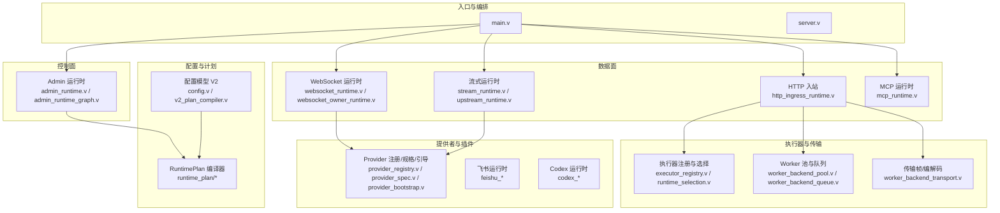
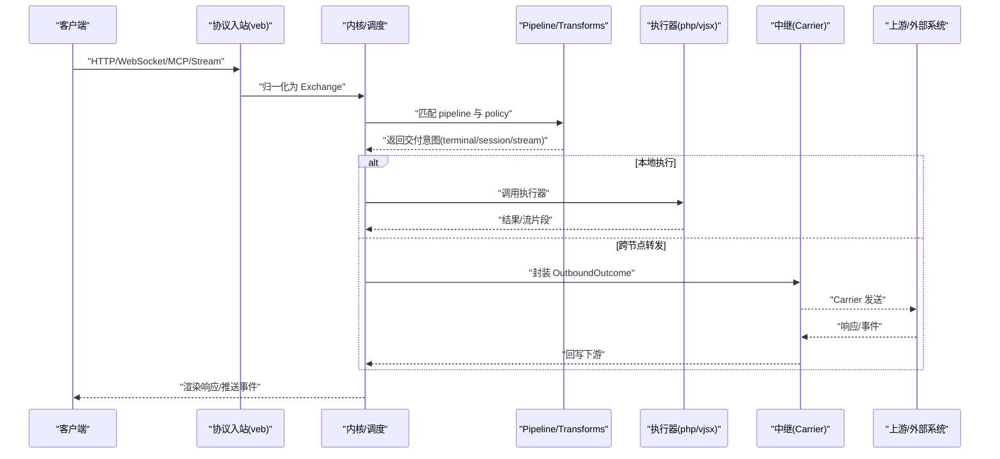
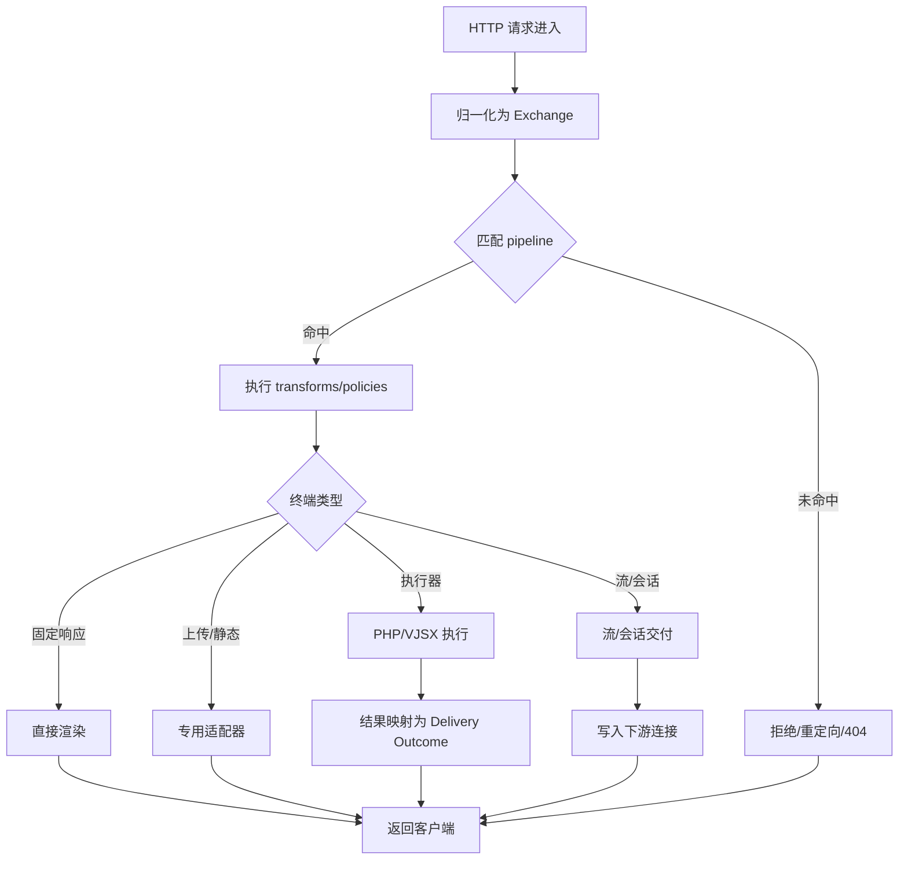
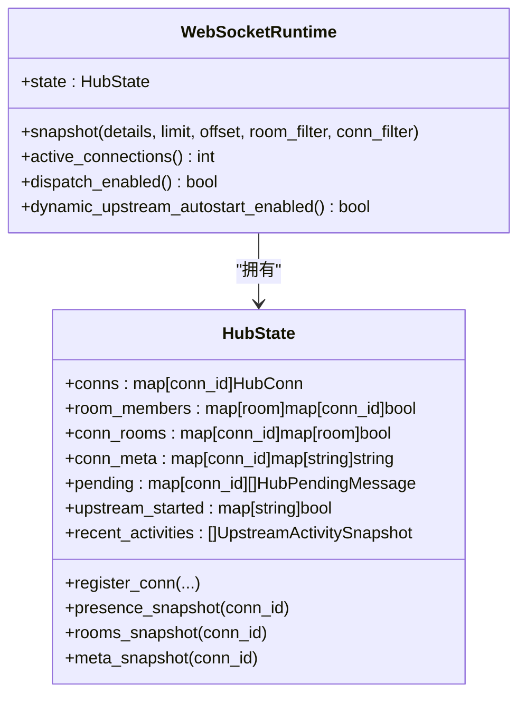
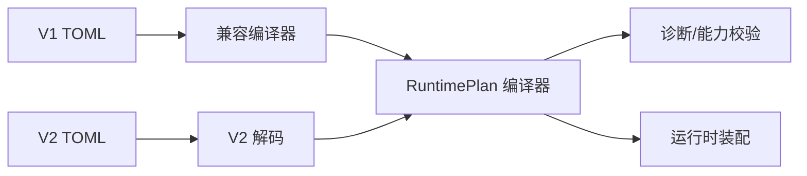
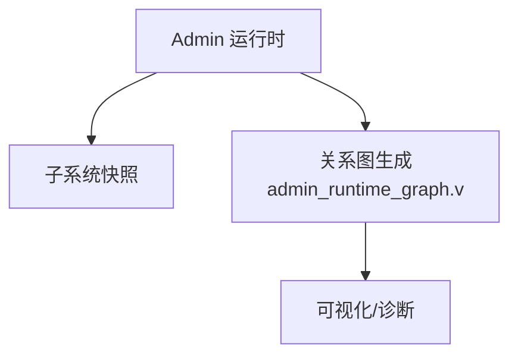
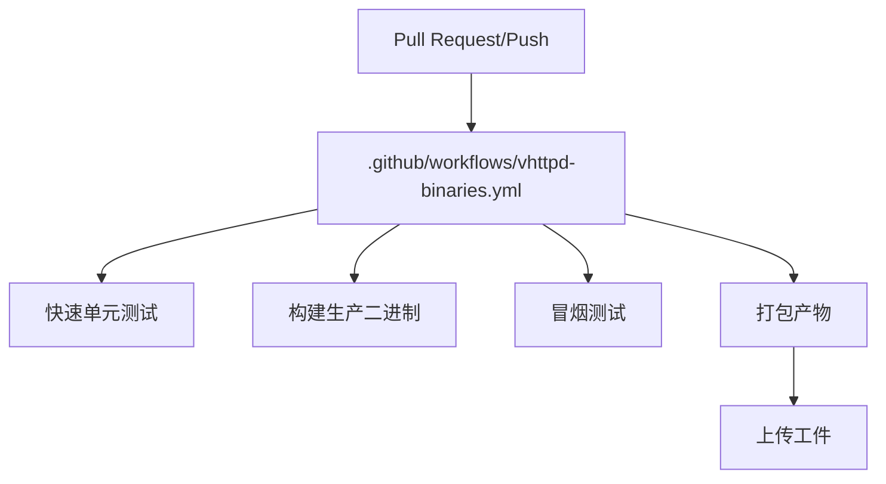
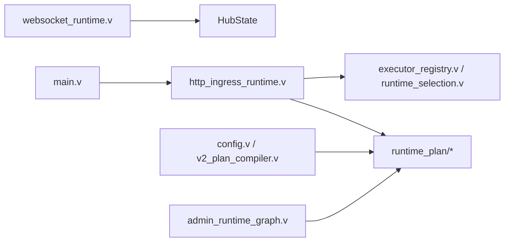

# 开发模式和架构实践

<cite>
**本文引用的文件**   
- [README.md](file://README.md)
- [OVERVIEW.md](file://docs/OVERVIEW.md)
- [ARCHITECTURE_REFACTOR_BASELINE.md](file://docs/ARCHITECTURE_REFACTOR_BASELINE.md)
- [PROTOCOL_PIPELINE_RELAY_ARCHITECTURE.md](file://docs/PROTOCOL_PIPELINE_RELAY_ARCHITECTURE.md)
- [PROTOCOL_PIPELINE_IMPLEMENTATION_PLAN.md](file://docs/PROTOCOL_PIPELINE_IMPLEMENTATION_PLAN.md)
- [CONFIGURATION_MODEL_V2.md](file://docs/CONFIGURATION_MODEL_V2.md)
- [WEBSOCKET_MESSAGE_DISPATCH_PLAN.md](file://docs/WEBSOCKET_MESSAGE_DISPATCH_PLAN.md)
- [WEBSOCKET_EVENT_BUS_PLAN.md](file://docs/WEBSOCKET_EVENT_BUS_PLAN.md)
- [THEME_REFACTORING_PLAN.md](file://docs/THEME_REFACTORING_PLAN.md)
- [refactor_0601.md](file://docs/refactor_0601.md)
- [main.v](file://src/main.v)
- [http_ingress_runtime.v](file://src/http_ingress_runtime.v)
- [websocket_runtime.v](file://src/websocket_runtime.v)
- [websocket_owner_runtime.v](file://src/websocket_owner_runtime.v)
- [config.v](file://src/config/config.v)
- [v2_plan_compiler.v](file://src/config/v2_plan_compiler.v)
- [admin_runtime_graph.v](file://src/admin_runtime_graph.v)
- [.github/workflows/vhttpd-binaries.yml](file://.github/workflows/vhttpd-binaries.yml)
</cite>

## 目录
1. [引言](#引言)
2. [项目结构](#项目结构)
3. [核心组件](#核心组件)
4. [架构总览](#架构总览)
5. [详细组件分析](#详细组件分析)
6. [依赖分析](#依赖分析)
7. [性能考虑](#性能考虑)
8. [故障排查指南](#故障排查指南)
9. [结论](#结论)
10. [附录](#附录)

## 引言
本指南面向 vhttpd 的开发与架构实践，聚焦以下主题：
- 设计模式与架构风格：微服务网关、事件驱动、管道处理（Exchange + Pipeline）、协议对等与中继转发。
- 模块化与插件化：接口契约、依赖管理、版本兼容与配置编译。
- 前后端分离：API 规范、数据格式约定、错误处理策略。
- 实时通信：WebSocket 房间管理、消息路由、状态同步与跨进程分发。
- DevOps：容器化构建、CI/CD 流水线、灰度发布与可观测性。

vhttpd 的定位是“可编程运行时网关”：统一接入 HTTP/WebSocket/stream/MCP，通过统一的 Exchange 和 Pipeline 连接不同协议，调度 PHP worker、VJSX 等执行器，并暴露控制面与运行态快照。

章节来源
- [README.md](file://README.md)
- [OVERVIEW.md](file://docs/OVERVIEW.md)

## 项目结构
仓库采用“按主题（角色）组织”的演进方向，当前代码已呈现清晰的子系统边界：入口与编排、数据面、控制面、执行器、传输、会话、提供者、管道与中继。

图示来源
- [main.v:1-117](file://src/main.v#L1-L117)
- [http_ingress_runtime.v:121-145](file://src/http_ingress_runtime.v#L121-L145)
- [websocket_runtime.v:26-52](file://src/websocket_runtime.v#L26-L52)
- [websocket_owner_runtime.v:1-44](file://src/websocket_owner_runtime.v#L1-L44)
- [config.v:216-311](file://src/config/config.v#L216-L311)
- [v2_plan_compiler.v:107-145](file://src/config/v2_plan_compiler.v#L107-L145)
- [admin_runtime_graph.v:67-104](file://src/admin_runtime_graph.v#L67-L104)

章节来源
- [ARCHITECTURE_REFACTOR_BASELINE.md](file://docs/ARCHITECTURE_REFACTOR_BASELINE.md)
- [THEME_REFACTORING_PLAN.md](file://docs/THEME_REFACTORING_PLAN.md)

## 核心组件
- 入口与中间件：App 组合根，挂载 veb 中间件与静态资源处理器，统一请求 ID 与追踪 ID 解析，并将所有路径路由到数据面运行时。
- HTTP 入站：将 veb.Request 归一化为内部 Exchange，匹配 RuntimePlan 中的 pipeline，执行 guard/policy/transform，再交由终端适配器或执行器。
- WebSocket 运行时：维护 HubState（连接、房间、成员、元数据、活动记录），提供 presence/rooms/metadata 快照与上下文构造。
- 配置与计划：V2 配置模型与编译器产出不可变 RuntimePlan；V1 兼容层在单一边界内完成翻译；启动期进行能力校验与引用解析。
- 控制面：Admin 运行时聚合各子系统快照，并通过图可视化展示资源关系与引用边。

章节来源
- [main.v:1-117](file://src/main.v#L1-L117)
- [http_ingress_runtime.v:121-145](file://src/http_ingress_runtime.v#L121-L145)
- [websocket_runtime.v:26-52](file://src/websocket_runtime.v#L26-L52)
- [websocket_owner_runtime.v:1-44](file://src/websocket_owner_runtime.v#L1-L44)
- [config.v:216-311](file://src/config/config.v#L216-L311)
- [v2_plan_compiler.v:107-145](file://src/config/v2_plan_compiler.v#L107-L145)
- [admin_runtime_graph.v:67-104](file://src/admin_runtime_graph.v#L67-L104)

## 架构总览
vhttpd 的目标架构强调“协议对等”“管道处理”“跨节点中继”。数据面遵循 Ingress Adapter → Canonical Exchange → Transforms → Egress Adapter 的固定范式；跨网络部署时，可在两端 vhttpd 之间通过 Carrier/Relay 转发 Exchange，保持流式、双向会话、背压与可观测性。

图示来源
- [PROTOCOL_PIPELINE_RELAY_ARCHITECTURE.md](file://docs/PROTOCOL_PIPELINE_RELAY_ARCHITECTURE.md)
- [PROTOCOL_PIPELINE_IMPLEMENTATION_PLAN.md](file://docs/PROTOCOL_PIPELINE_IMPLEMENTATION_PLAN.md)

章节来源
- [PROTOCOL_PIPELINE_RELAY_ARCHITECTURE.md](file://docs/PROTOCOL_PIPELINE_RELAY_ARCHITECTURE.md)
- [PROTOCOL_PIPELINE_IMPLEMENTATION_PLAN.md](file://docs/PROTOCOL_PIPELINE_IMPLEMENTATION_PLAN.md)

## 详细组件分析

### 管道处理模式（Exchange + Pipeline）
- 统一交换体：Exchange 包含身份（id/request_id/trace_id/parent_id）、种类（request/response/event/stream/session/error）、负载（sum type）与元数据。
- 编译期计划：RuntimePlan 定义 listener、adapter、transform、policy、engine、relay、terminal 等资源，并在启动期完成引用解析、能力校验与诊断输出。
- 运行时执行：HTTP 入站将 veb.Request 转换为 Exchange，匹配 pipeline，执行 transform 与 policy，最终由 terminal adapter 渲染或交由执行器/流式/会话通道。

图示来源
- [PROTOCOL_PIPELINE_IMPLEMENTATION_PLAN.md](file://docs/PROTOCOL_PIPELINE_IMPLEMENTATION_PLAN.md)
- [http_ingress_runtime.v:121-145](file://src/http_ingress_runtime.v#L121-L145)

章节来源
- [PROTOCOL_PIPELINE_IMPLEMENTATION_PLAN.md](file://docs/PROTOCOL_PIPELINE_IMPLEMENTATION_PLAN.md)
- [http_ingress_runtime.v:121-145](file://src/http_ingress_runtime.v#L121-L145)

### 事件驱动与 WebSocket 房间/消息分发
- 单节点事件总线：HubState 维护连接、房间、成员、元数据与活动快照；提供 join/leave/broadcast/send_to 命令语义。
- 未来消息分发模式：WebSocket 连接完全由 vhttpd 持有，事件以无状态短任务分发给空闲 worker，worker 返回命令集，vhttpd 应用命令。

图示来源
- [websocket_owner_runtime.v:1-44](file://src/websocket_owner_runtime.v#L1-L44)
- [websocket_runtime.v:26-52](file://src/websocket_runtime.v#L26-L52)

章节来源
- [WEBSOCKET_MESSAGE_DISPATCH_PLAN.md](file://docs/WEBSOCKET_MESSAGE_DISPATCH_PLAN.md)
- [WEBSOCKET_EVENT_BUS_PLAN.md](file://docs/WEBSOCKET_EVENT_BUS_PLAN.md)
- [websocket_owner_runtime.v:1-44](file://src/websocket_owner_runtime.v#L1-L44)
- [websocket_runtime.v:26-52](file://src/websocket_runtime.v#L26-L52)

### 配置模型与版本兼容（V1→V2）
- V2 配置：显式声明 listener、pipeline、adapter、transform、policy、engine、relay、terminal 等资源，使用 kind:id 引用语法，严格校验未知字段与能力不匹配。
- 兼容编译：V1 TOML 经兼容层翻译为 V2 资源，仅在此边界内保留历史语义；运行时不感知来源。
- 诊断与可见性：编译期与投影期均产生诊断信息，Admin 暴露 plan 视图与关系图。

图示来源
- [CONFIGURATION_MODEL_V2.md](file://docs/CONFIGURATION_MODEL_V2.md)
- [v2_plan_compiler.v:107-145](file://src/config/v2_plan_compiler.v#L107-L145)

章节来源
- [CONFIGURATION_MODEL_V2.md](file://docs/CONFIGURATION_MODEL_V2.md)
- [v2_plan_compiler.v:107-145](file://src/config/v2_plan_compiler.v#L107-L145)

### 控制面与可观测性
- Admin 运行时聚合各子系统快照，提供 workers/stats/runtime summary 等端点。
- 关系图：基于 RuntimePlan 生成资源节点与引用边，便于定位依赖与问题。

图示来源
- [admin_runtime_graph.v:67-104](file://src/admin_runtime_graph.v#L67-L104)

章节来源
- [admin_runtime_graph.v:67-104](file://src/admin_runtime_graph.v#L67-L104)

### 模块化和插件化最佳实践
- 接口契约：以 ProviderSpec/AdapterDescriptor/TransformerAction 等纯值对象作为稳定边界，避免在核心中引入具体协议实现。
- 依赖管理：通过 RuntimePlan 的资源引用与能力校验，确保编译期发现缺失/冲突；运行时只消费不可变计划。
- 版本兼容：V1→V2 兼容层集中管理历史语义，禁止在运行时分支判断来源；新增能力优先通过 transform/adapter 扩展而非修改核心。

章节来源
- [PROTOCOL_PIPELINE_IMPLEMENTATION_PLAN.md](file://docs/PROTOCOL_PIPELINE_IMPLEMENTATION_PLAN.md)
- [CONFIGURATION_MODEL_V2.md](file://docs/CONFIGURATION_MODEL_V2.md)

### 前后端分离与 API 规范
- 数据面路径：HTTP 路径由应用定义；内置 /mcp、/bridge/ws、/callbacks/feishu 等受控路径；/admin 为控制面。
- 数据格式：Exchange 承载协议无关的请求/响应/事件/流/会话/错误；终端渲染负责 Set-Cookie、x-request-id 等通用头。
- 错误处理：统一分类为 delivery outcome，附带 trace_id/request_id 与 error_class，便于前端与运维一致处理。

章节来源
- [OVERVIEW.md](file://docs/OVERVIEW.md)
- [PROTOCOL_PIPELINE_IMPLEMENTATION_PLAN.md](file://docs/PROTOCOL_PIPELINE_IMPLEMENTATION_PLAN.md)

### 实时通信架构模式
- 房间与会话：HubState 作为权威源，维护 conn_id↔room、presence、metadata；支持 per-connection 序列化与命令验证。
- 跨进程广播：单节点事件总线阶段已完成跨 worker 的房间广播；后续可扩展外部总线适配以实现多节点扇出。
- 状态同步：建议将认证/会话标签、路由信息等关键状态置于 vhttpd，worker 仅持有快照或辅助视图。

章节来源
- [WEBSOCKET_MESSAGE_DISPATCH_PLAN.md](file://docs/WEBSOCKET_MESSAGE_DISPATCH_PLAN.md)
- [WEBSOCKET_EVENT_BUS_PLAN.md](file://docs/WEBSOCKET_EVENT_BUS_PLAN.md)

### 现代 DevOps 实践
- CI/CD：GitHub Actions 在多平台矩阵上安装依赖、克隆 vjsx、准备 QuickJS、运行快速测试、构建生产二进制、打包产物并上传。
- 容器化：建议在贡献者指引中增加 Dockerfile（多阶段构建），消除环境差异，简化上手。
- 灰度发布：利用多监听器与 site 隔离，结合 RuntimePlan 替换与预览能力，逐步切换流量；配合 Admin 快照与事件日志做渐进验证。

图示来源
- [.github/workflows/vhttpd-binaries.yml](file://.github/workflows/vhttpd-binaries.yml)

章节来源
- [.github/workflows/vhttpd-binaries.yml](file://.github/workflows/vhttpd-binaries.yml)
- [refactor_0601.md](file://docs/refactor_0601.md)

## 依赖分析
- 耦合与内聚：入口 main.v 仅承担中间件与静态资源挂载，数据面路由委托给 HttpIngressRuntime；WebSocket 运行时自管 HubState；配置与计划集中在 config 与 runtime_plan 模块，降低散乱耦合。
- 直接依赖：HTTP 入站依赖 veb 上下文与请求对象，但在入站边缘完成归一化，避免污染核心；Provider 与 Executor 通过 RuntimePlan 与适配器描述符解耦。
- 潜在循环：通过纯值对象（Exchange/Descriptor/Plan）与单向装配（Server→DataPlane/ControlPlane→Subsystems）避免循环依赖。
- 外部依赖：veb/http/urllib 作为 HTTP 事实来源；QuickJS 用于 VJSX；DB/TLS 库通过打包脚本随二进制分发。

图示来源
- [main.v:1-117](file://src/main.v#L1-L117)
- [http_ingress_runtime.v:121-145](file://src/http_ingress_runtime.v#L121-L145)
- [websocket_runtime.v:26-52](file://src/websocket_runtime.v#L26-L52)
- [config.v:216-311](file://src/config/config.v#L216-L311)
- [v2_plan_compiler.v:107-145](file://src/config/v2_plan_compiler.v#L107-L145)
- [admin_runtime_graph.v:67-104](file://src/admin_runtime_graph.v#L67-L104)

章节来源
- [ARCHITECTURE_REFACTOR_BASELINE.md](file://docs/ARCHITECTURE_REFACTOR_BASELINE.md)

## 性能考虑
- 零拷贝预算：原生阶段共享 Exchange，仅在跨边界（VJSX、Relay、Worker）序列化一次。
- 编译期优化：路由正则、引用解析、能力校验均在启动期完成；策略归一化为可执行计划。
- 有界并发：引擎、变换队列、Relay 通道与流缓冲均有上限；VJSX 复用 lane worker 而非无界线程。
- 基准约束：HTTP 兼容路径相对基线回归不超过 5%；静态响应路径独立于应用执行；流式路径不缓存整响应。

章节来源
- [PROTOCOL_PIPELINE_IMPLEMENTATION_PLAN.md](file://docs/PROTOCOL_PIPELINE_IMPLEMENTATION_PLAN.md)

## 故障排查指南
- 常见错误类：worker 队列满（503）、等待超时（504）、上游不可用、载体未连接、未知房间/目标等；均通过 delivery outcome 携带 error_class 与 trace_id。
- 诊断手段：
  - Admin 快照：/admin/runtime、/admin/workers、/admin/stats、/admin/runtime/plan。
  - 关系图：基于 RuntimePlan 生成的资源与引用边，快速定位缺失/冲突。
  - 事件日志：NDJSON 事件流，结合 trace_id 串联全链路。
- 修复建议：
  - 检查 V2 配置与兼容性翻译是否产生预期计划。
  - 核对 adapter/transform 能力与 pipeline egress 需求是否匹配。
  - 针对 WebSocket 场景，确认 HubState 的 rooms/presence 快照与命令校验。

章节来源
- [OVERVIEW.md](file://docs/OVERVIEW.md)
- [PROTOCOL_PIPELINE_IMPLEMENTATION_PLAN.md](file://docs/PROTOCOL_PIPELINE_IMPLEMENTATION_PLAN.md)
- [admin_runtime_graph.v:67-104](file://src/admin_runtime_graph.v#L67-L104)

## 结论
vhttpd 以“协议对等 + 管道处理 + 跨节点中继”为核心，逐步从单体 App 向领域子系统拆分，形成清晰的数据面/控制面/执行器/传输/提供者分层。通过 V2 配置与 RuntimePlan 的强约束，系统在可扩展性、可观测性与稳定性方面具备良好基础。下一步应继续推进 WorkerBackend 抽象、Kernel 实体化与 ProviderRuntime 所有权迁移，并以消息分发模式提升 WebSocket 的可扩展性。

## 附录
- 推荐阅读顺序：概览 → README → 运行时模块地图 → 流式/上游计划 → MCP → Worker/Transport 契约。
- 参考文档：
  - [OVERVIEW.md](file://docs/OVERVIEW.md)
  - [ARCHITECTURE_REFACTOR_BASELINE.md](file://docs/ARCHITECTURE_REFACTOR_BASELINE.md)
  - [PROTOCOL_PIPELINE_RELAY_ARCHITECTURE.md](file://docs/PROTOCOL_PIPELINE_RELAY_ARCHITECTURE.md)
  - [PROTOCOL_PIPELINE_IMPLEMENTATION_PLAN.md](file://docs/PROTOCOL_PIPELINE_IMPLEMENTATION_PLAN.md)
  - [CONFIGURATION_MODEL_V2.md](file://docs/CONFIGURATION_MODEL_V2.md)
  - [WEBSOCKET_MESSAGE_DISPATCH_PLAN.md](file://docs/WEBSOCKET_MESSAGE_DISPATCH_PLAN.md)
  - [WEBSOCKET_EVENT_BUS_PLAN.md](file://docs/WEBSOCKET_EVENT_BUS_PLAN.md)
  - [THEME_REFACTORING_PLAN.md](file://docs/THEME_REFACTORING_PLAN.md)
  - [refactor_0601.md](file://docs/refactor_0601.md)